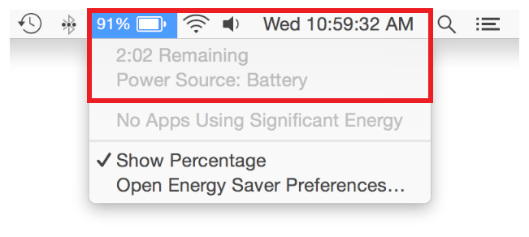
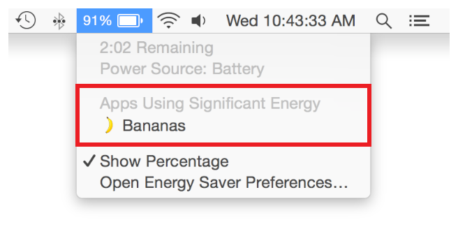

> 导航：[总目录](../../../README.md) · [documentation](../../../_indexes/documentation.md) · [Energy Efficiency Guide for Mac Apps](index.md)

## Check the Battery Status Menu

High energy use can severely impact a user’s ability to get things done while operating on battery power. Users can control some energy factors, such as screen brightness and hard disk sleep, by configuring the Energy Saver pane in System Preferences. They can check the Battery Status menu to get the percentage of battery remaining, as well as an estimate of how long it will take to deplete the battery, given the current environment—running apps, resources being utilized, and so forth. See Figure 17-1.

__Figure 17-1__Battery statistics

The Battery Status menu also lists running apps that are using significant energy at any given time. If an app appears in this list, the system has identified the app based on its requirements with regard to CPU usage, disk I/O, networking, and numerous other factors. Figure 17-2 shows an app that has been flagged in the Battery Status menu.

> [!IMPORTANT]
> 

__Figure 17-2__An app using significant energy

Clicking on an app in the list automatically launches Activity Monitor, displays its Energy pane, and selects the app. Optionally, the user may quit the app from Activity Monitor, or force quit the app if it’s unresponsive.

[Monitor Usage Regularly](MonitoringEnergyUsage.md#apple-f4xwc4dqnrsv64tfmyxwi33df52wszbpkridimbqgeztsmrzfvbuqmrufvjvomi)

[Respond to Thermal State Changes](RespondToThermalStateChanges.md#apple-f4xwc4dqnrsv64tfmyxwi33df52wszbpkridimbqgeztsmrzfvbuqmrvfvjvomi)
