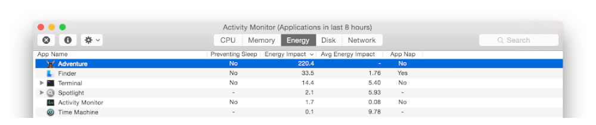
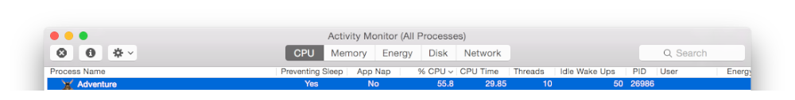
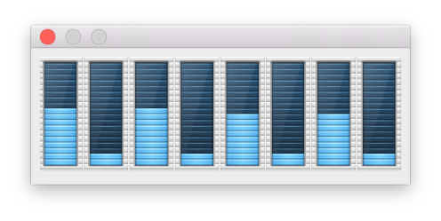
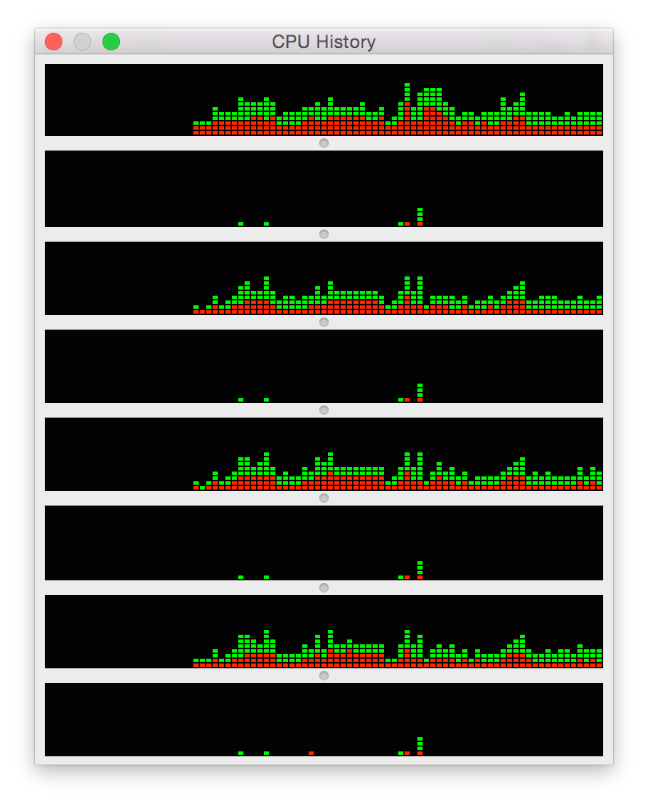
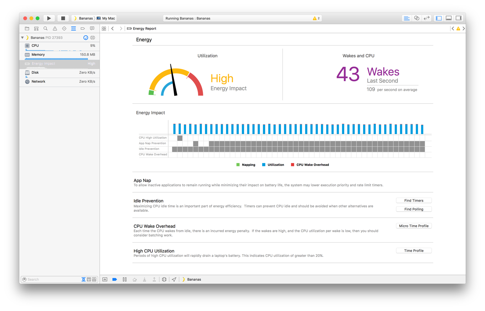
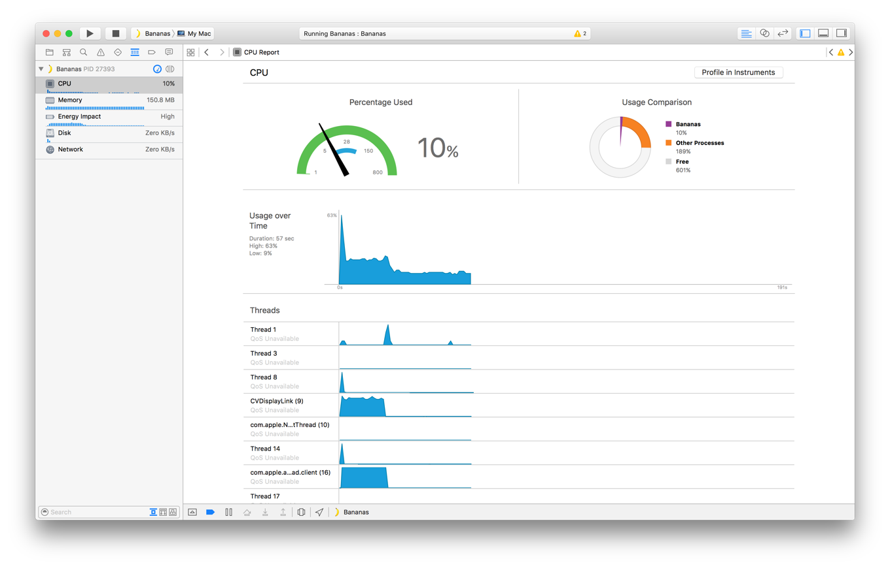
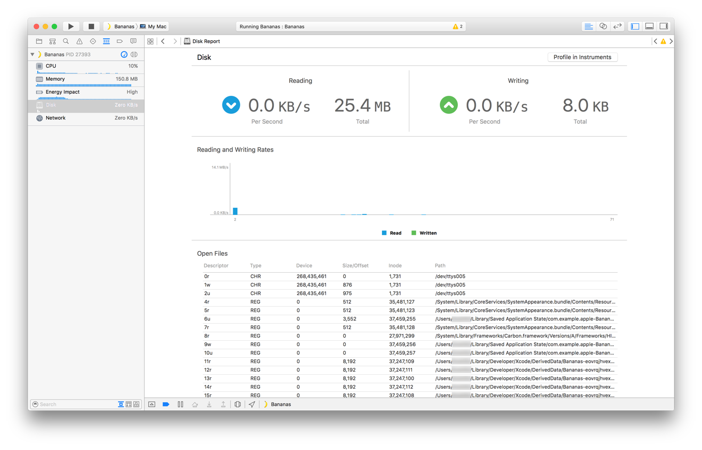
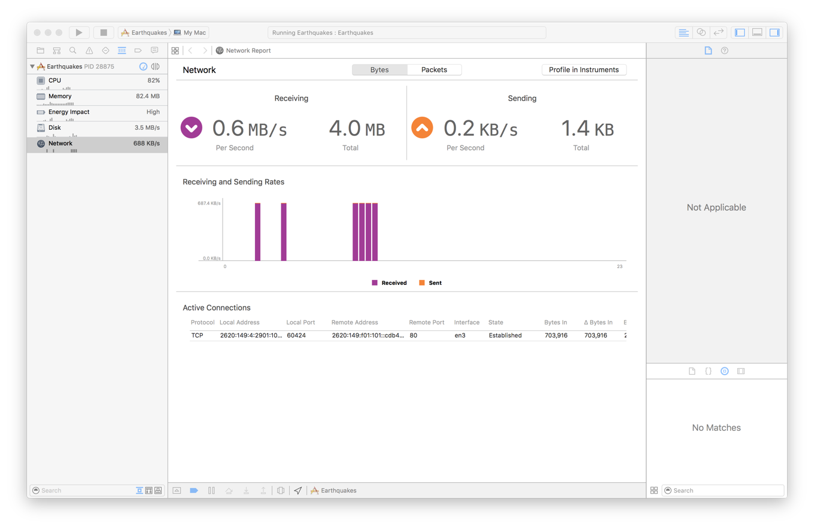
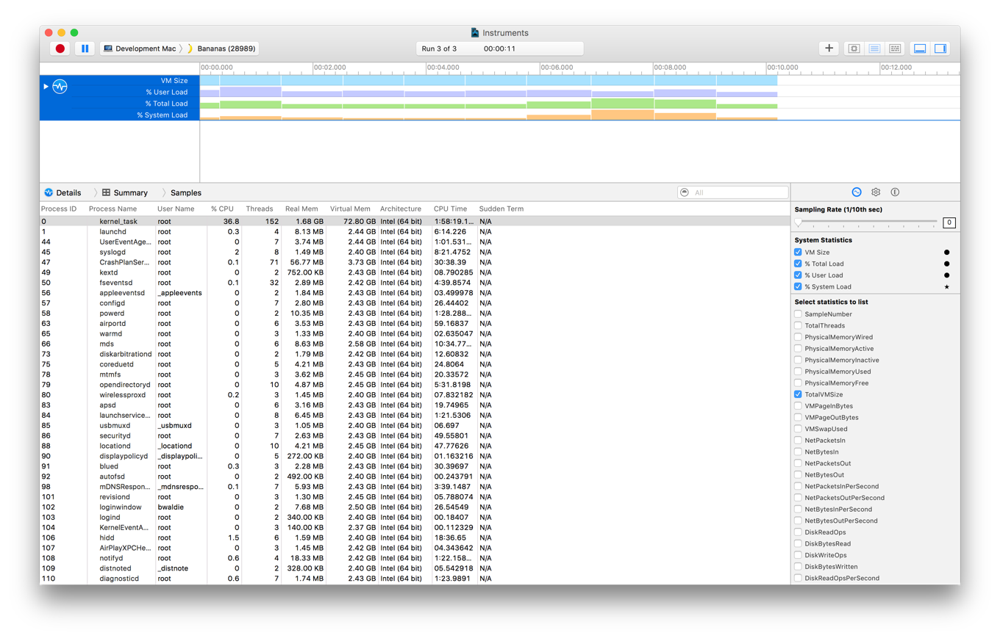
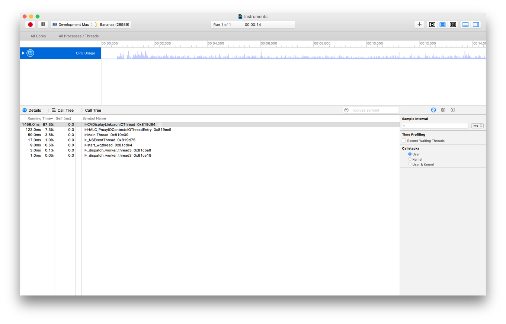

> 导航：[总目录](../../../README.md) · [documentation](../../../_indexes/documentation.md) · [Energy Efficiency Guide for Mac Apps](index.md)

## Monitor Usage Regularly

Throughout the development process, verify that your app is running efficiently by regularly monitoring, testing, and retesting its performance. A variety of tools and utilities can help you analyze your app's energy impact.

### Activity Monitor

Activity Monitor is installed in the `/Applications/Utilities` folder on every Mac. It provides a running list of active processes, along with various metrics.

### Assess Energy Usage

Metrics that relate to energy use and can be viewed in the Energy pane of Activity Monitor (see Figure 16-1). Use the View > Columns menu to enable or customize the metrics displayed.

__Figure 16-1__Energy columns in Activity Monitor

As shown in Figure 16-2, graphs denoting overall energy impact and battery statistics are displayed at the bottom of the Energy pane.

__Figure 16-2__Energy statistic graphs in Activity Monitor

The Energy pane in Activity Monitor displays the following columns:

- __Preventing Sleep.__ Indicates when an app is preventing the system from sleeping, perhaps because it has initiated activity that has disabled sleep (see [Determine When Your App Is Preventing Sleep](PrioritizeWorkAtTheAppLevel.md#apple-f4xwc4dqnrsv64tfmyxwi33df52wszbpkridimbqgeztsmrzfvbuqmzwfvjvony)).
- __Energy Impact.__ Assigns an energy impact score to your app, based on how efficiently it is operating. A variety of factors are taken into account when this score is assigned, including CPU usage, network activity, disk I/O, and more.
- __Avg Energy Impact.__ Indicates the average energy impact score over the past 8 hours, or since the time the Mac was restarted.
- __App Nap.__ Indicates when an app has been placed in App Nap (see [Extend App Nap](AppNap.md#apple-f4xwc4dqnrsv64tfmyxwi33df52wszbpkridimbqgeztsmrzfvbuqmrnknltc)). You can use this column to monitor your running app and make sure App Nap activates when it’s placed in the background and hidden or fully obscured by another app.

### Assess CPU Usage

High CPU usage is a major contributing factor to high energy consumption, and Activity Monitor implements a variety of features that can help assess the amount of CPU your app is utilizes. The CPU pane shows the percentage of CPU your app is using at any given time, in relation to the other active processes on the system, as shown in Figure 16-3. When your app isn’t active, the number in this column should be 0.0. High values here, especially consistent ones, indicate that your app may not be as energy efficient as it could be. You should look carefully at your app for ways to reduce its CPU requirements.

__Figure 16-3__CPU columns in Activity Monitor

Graphs and statistics related to overall system CPU usage are displayed at he bottom of the CPU pane. See Figure 16-4.

__Figure 16-4__CPU statistic graphs in Activity Monitor

Activity Monitor also includes provides graphical displays of historical and current state CPU core utilization.

- __CPU Usage.__ Represents system-wide usage across all CPU cores. To display this window, choose Window > CPU Usage. See Figure 16-5.

  __Figure 16-5__The CPU Usage dialog in Activity Monitor
  
- __CPU History.__ Represents system-wide usage across all CPU cores over a period of time. It begins to capture usage once the window is displayed, and updates as usage fluctuates. To display this window, choose Window > CPU History. See Figure 16-5.

  __Figure 16-6__The CPU History dialog in Activity Monitor
  

### Xcode

There’s no better time to diagnose your app’s energy footprint than when you are in the process of developing your app. Xcode includes a number of features that can help.

### Debugging Gauges

The debug navigator in Xcode (choose View > Navigators > Show Debug Navigator) provides a series of gauges that allow you to analyze the energy impact of your app while testing it within Xcode. These gauges are displayed when your app has been launched by Xcode and is actively running or paused.

- __Energy impact gauge.__ Displays a report of your app’s current energy impact and a bar graph of its recent impact. When users interact with your app, it should have a low energy impact. When users aren’t interacting with your app, it should have zero energy impact.

  __Figure 16-7__Monitoring energy impact in Xcode
  
- __CPU gauge.__ Monitors your app and reports on its current and historical CPU usage. Spikes when your app is supposed to have low CPU activity or when your app is idle may indicate problem areas where optimizations can be made.

  __Figure 16-8__Monitoring CPU usage in Xcode
  
- __Disk usage gauge.__ Alerts you to disk read and write activity and files your app has opened. Use this gauge to identify unexpected or recurring small I/O activity.

  __Figure 16-9__Monitoring disk I/O in Xcode
  
- __Network usage gauge.__ Accounts for all inbound and outbound network traffic. Look for discretionary activity that your app performs directly, and consider updating it to be performed by the system at more energy optimal times.

  __Figure 16-10__Monitoring network activity in Xcode
  

### Debugging

Knowing how to test and debug your app can go a long way toward helping you identify potential energy problems and areas for improvement. Debug Your App in _[Xcode Overview](https://developer.apple.com/library/archive/documentation/ToolsLanguages/Conceptual/Xcode_Overview/index.html#//apple_ref/doc/uid/TP40010215)_ and _[Testing with Xcode](../../Developer%20Tools/Testing%20with%20Xcode/About%20Testing%20with%20Xcode.md#apple-f4xwc4dqnrsv64tfmyxwi33df52wszbpkridimbqge2dcmzs)_ describe common debugging techniques. If your app performs tasks asynchronously using GCD, `NSOperationQueue`, or XPC, debugging can be a little harder. There are, however, techniques that can help you debug your app even in these complex situations.

- __Queue debugging.__ If your app uses GCD dispatch queues to perform operations, use queue debugging techniques to ensure that work is being performed as expected. To learn about GCD, dispatch queues, and queue debugging, watch the session _WWDC 2013: Debugging with Xcode_, and review the _[Concurrency Programming Guide](../../General/Concurrency%20Programming%20Guide/Introduction.md#apple-f4xwc4dqnrsv64tfmyxwi33df52wszbpkridimbqga4daojr)_ and _Grand Central Dispatch (GCD) Reference_.
- __Activity tracing.__ This technology makes finding bugs faster and easier by logging trace messages as your app runs. When a problem occurs, follow these messages to identify the code that produced the failure. For information on activity tracing, see the session _WWDC 2014: Fix Bugs Faster Using Activity Tracing_.

### Instruments

The Instruments app, which is included with Xcode, gathers data from your running app and presents it in a graphical timeline. You gather data about such performance areas as your app’s CPU usage, disk activity, network activity, and graphics operations. By viewing the data together, you can analyze different aspects of your app’s performance to identify potential areas of improvement.

Instruments provides a variety of preconfigured profiling templates, which help you analyze your app and ensure that it is performing efficiently. Some of these relate directly to energy.

- __Activity Monitor template.__ Monitors the CPU, memory, disk, and network usage statistics of your app. Results are graphically represented at a high level in a timeline. If you prefer, you can dive deeper into detailed statistics for more comprehensive analysis.

  __Figure 16-11__Activity monitoring with Instruments
  
- __Time Profiler template.__ Captures stack trace information at prescribed intervals, while displaying a timeline of the percentage of CPU being used.

  __Figure 16-12__Time profiling with Instruments
  

> [!NOTE]
> 

### Command-Line Tools

Command-line tools can be useful if you are already working in command-line mode or if you are building scripts to monitor your apps.

- __dtrace.__ Access low-level information about the operating system kernel and the user processes running on your computer. To learn about DTrace and the D scripting language, see the _Solaris Dynamic Tracing Guide_, available from the [Oracle Technology Network](http://docs.oracle.com/cd/E19253-01/817-6223/), and the dtrace(1) Mac OS X Manual Page.
- __fs_usage.__ Get a running list of system calls related to activity in the file system. Use `fs_usage` command options to specify a timeout, filtering, and more. See [fs_usage](MinimizingIO.md#apple-f4xwc4dqnrsv64tfmyxwi33df52wszbpkridimbqgeztsmrzfvbuqmrwfvjvooa) in [Minimize I/O](MinimizingIO.md#apple-f4xwc4dqnrsv64tfmyxwi33df52wszbpkridimbqgeztsmrzfvbuqmrwfvjvomi) or refer to the fs_usage(1) Mac OS X Manual Page.
- __pmset.__ Adjust system-wide power management settings, such as idle sleep timing, automatic restart on power loss, and more. It can also be used to put the device to sleep, and to determine whether any power assertions are in place. See pmset(1) Mac OS X Manual Page.
- __powermetrics.__ Monitor CPU usage and determine how much CPU time is being allocated to different quality of service classes. This can be helpful for ensuring that quality of service classes are properly implemented. See [powermetrics](PrioritizeWorkAtTheTaskLevel.md#apple-f4xwc4dqnrsv64tfmyxwi33df52wszbpkridimbqgeztsmrzfvbuqmzvfvjvomjq) in [Prioritize Work at the Task Level](PrioritizeWorkAtTheTaskLevel.md#apple-f4xwc4dqnrsv64tfmyxwi33df52wszbpkridimbqgeztsmrzfvbuqmzvfvjvomi) or the powermetrics(1) Mac OS X Manual Page.
- __sample.__ Gather information about your app at specified intervals and produce a report of functions occurring at those intervals. This information helps you diagnose responsiveness problems, high CPU use problems, and more. See sample(1) Mac OS X Manual Page.
- __spindump.__ Use this tool with the `-timeline` option to sample and profile your app in order to determine which QoS class applies to a thread as a specific portion of code executes at a given time. [spindump](PrioritizeWorkAtTheTaskLevel.md#apple-f4xwc4dqnrsv64tfmyxwi33df52wszbpkridimbqgeztsmrzfvbuqmzvfvjvomzq) in [Prioritize Work at the Task Level](PrioritizeWorkAtTheTaskLevel.md#apple-f4xwc4dqnrsv64tfmyxwi33df52wszbpkridimbqgeztsmrzfvbuqmzvfvjvomi) demonstrates usage. See spindump(8) Mac OS X Manual Page.
- __timerfires.__ Get logs indicating each time your app is woken as a result of a timer firing. See [Recognize and Address Timer Issues](Timers.md#apple-f4xwc4dqnrsv64tfmyxwi33df52wszbpkridimbqgeztsmrzfvbuqnjnknltemy) in [Minimize Timer Usage](Timers.md#apple-f4xwc4dqnrsv64tfmyxwi33df52wszbpkridimbqgeztsmrzfvbuqnjnknltc) and timerfires(1) Mac OS X Manual Page.
- __top.__ Get CPU usage information, as shown in Listing 16-1.

  __Listing 16-1__Using top to identify CPU usage for a specified process
  1. `$ top -pid 68041`
  2. `PID COMMAND %CPU`
  3. `68041 Adventure 18.1`

### Quartz Debug Utility

The Quartz Debug utility (part of the Graphics Tools for Xcode package in the Developer site [Downloads section](https://developer.apple.com/downloads/index.action)) helps you debug graphics-related issues in your apps. See [Detect Extraneous Updates](UsingEfficientGraphics.md#apple-f4xwc4dqnrsv64tfmyxwi33df52wszbpkridimbqgeztsmrzfvbuqmrxfvjvona).

[Observe Signs of Energy Leaks](SignsofEnergyLeaks.md#apple-f4xwc4dqnrsv64tfmyxwi33df52wszbpkridimbqgeztsmrzfvbuqmrsfvjvomi)

[Check the Battery Status Menu](MonitoringBatteryUsage.md#apple-f4xwc4dqnrsv64tfmyxwi33df52wszbpkridimbqgeztsmrzfvbuqmrtfvjvomi)
