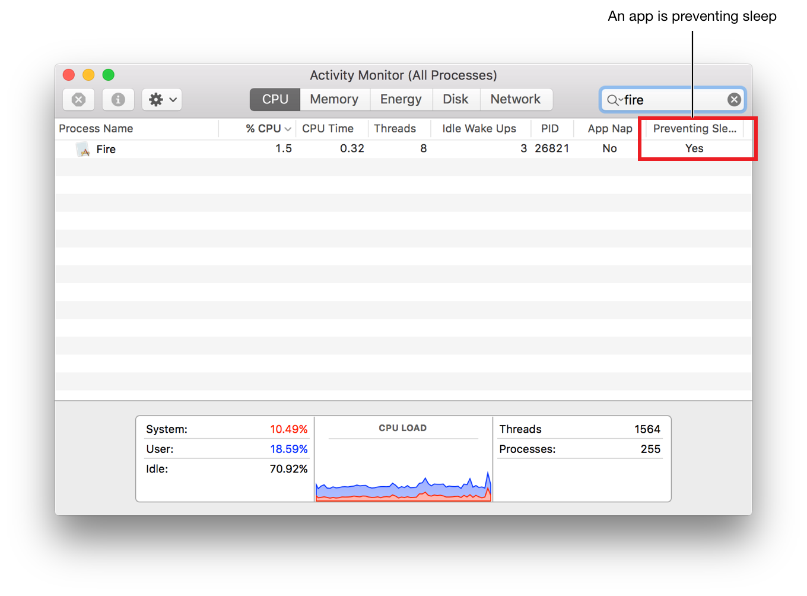

> 导航：[总目录](../../../README.md) · [documentation](../../../_indexes/documentation.md) · [Energy Efficiency Guide for Mac Apps](index.md)

## Prioritize Work at the App Level

You can distinguish discretionary work that your app initiates on its own from lengthy user-initiated activities, such as exporting files or recording audio. Doing so allows the system to make intelligent decisions about how to properly manage your app, including when it should be placed in App Nap.

> [!NOTE]
> 

### Inform the System About Lengthy User-Initiated Activities

Use an [NSProcessInfo](https://developer.apple.com/library/archive/documentation/LegacyTechnologies/WebObjects/WebObjects_3.5/Reference/Frameworks/ObjC/Foundation/Classes/NSProcessInfo/Description.html#//apple_ref/occ/cl/NSProcessInfo) object to classify the different types of work your app performs. Before performing asynchronous operations, call the [beginActivityWithOptions:reason:](https://developer.apple.com/documentation/foundation/nsprocessinfo/1415995-beginactivitywithoptions) method, and pass the returned object to [endActivity:](https://developer.apple.com/documentation/foundation/processinfo/1411321-endactivity) when the activity is finished.

The `options` parameter for the [beginActivityWithOptions:reason:](https://developer.apple.com/documentation/foundation/nsprocessinfo/1415995-beginactivitywithoptions) method describes the type of activity your app is performing. If your app is doing lengthy user-initiated work, pass the [NSActivityUserInitiated](https://developer.apple.com/documentation/foundation/nsactivityoptions/nsactivityuserinitiated) or [NSActivityUserInitiatedAllowingIdleSystemSleep](https://developer.apple.com/documentation/foundation/processinfo/activityoptions/1414902-userinitiatedallowingidlesystems) constant, as demonstrated in Listing 9-1. Denoting user-initiated work prevents the system from deferring the operations or putting your app in App Nap. If your app is performing discretionary or maintenance work, pass the [NSActivityBackground](https://developer.apple.com/documentation/foundation/nsactivityoptions/nsactivitybackground) constant.

__Listing 9-1__Calling the `beginActivityWithOptions` method to inform the system of a user activity

Objective-C

1. `NSOperationQueue *myQueue = [[NSOperationQueue alloc] init];`
2. `id myActivity = [[NSProcessInfo processInfo]`
3. `beginActivityWithOptions: NSActivityUserInitiated`
4. `reason: @"Batch processing files"];`
5. `[myQueue addOperationWithBlock:^{`
6. `// Perform batch processing of files here`
7. `[[NSProcessInfo processInfo] endActivity:myActivity];`
8. `}];`

Swift

1. `let myQueue = NSOperationQueue()`
2. `let myActivity = NSProcessInfo.processInfo().beginActivityWithOptions(`
3. `NSActivityOptions.UserInitiated,`
4. `reason: "Batch processing files")`
5. `myQueue.addOperationWithBlock() {`
6. `// Perform batch processing of files here`
7. `NSProcessInfo.processInfo().endActivity(myActivity)`
8. `}`
9. `)`

For long-running synchronous operations, call the [performActivityWithOptions:reason:usingBlock:](https://developer.apple.com/documentation/foundation/processinfo/1418048-performactivity) method instead. Again, specify the type of activity—user-initiated or background—and perform its work inside the block. The method runs the block synchronously and automatically begins and ends the activity around the block.

> [!NOTE]
> 

### Determine When Your App Is Preventing Sleep

Launch Activity Monitor in `/Applications/Utilities/` and check the Preventing Sleep column (Figure 9-1). If this column isn’t visible, choose View > Columns > Power Assertion to display it.

__Figure 9-1__Using Activity Monitor to determine when an app is preventing sleep

You can also use Terminal to see whether your processes have any power assertions in effect while running your app. To do so, enter the command `pmset -g assertions`. In Listing 9-2, prevention of user idle and system sleep are asserted by an app. The debug string `"Batch processing files"` reported in the output is supplied in the `reason` parameter to [beginActivityWithOptions:reason:](https://developer.apple.com/documentation/foundation/nsprocessinfo/1415995-beginactivitywithoptions), as shown in Listing 9-1.

__Listing 9-2__Testing for power management assertions

1. `$ pmset -g assertions`
2. `Assertion status system-wide:`
3. `BackgroundTask 0`
4. `PreventUserIdleDisplaySleep 0`
5. `PreventSystemSleep 0`
6. `PreventDiskIdle 0`
7. `PreventUserIdleSystemSleep 1`
8. `ExternalMedia 0`
9. `UserIsActive 0`
10. `ApplePushServiceTask 0`
11. `Listed by owning process:`
13. `pid 3741(Fire): [0x00001ae700010591] 00:13:44 PreventUserIdleSystemSleep`
14. `named: "Batch processing files"`

[Avoid Extraneous Content Updates](UsingEfficientGraphics.md#apple-f4xwc4dqnrsv64tfmyxwi33df52wszbpkridimbqgeztsmrzfvbuqmrxfvjvomi)

[Prioritize Work at the Task Level](PrioritizeWorkAtTheTaskLevel.md#apple-f4xwc4dqnrsv64tfmyxwi33df52wszbpkridimbqgeztsmrzfvbuqmzvfvjvomi)
