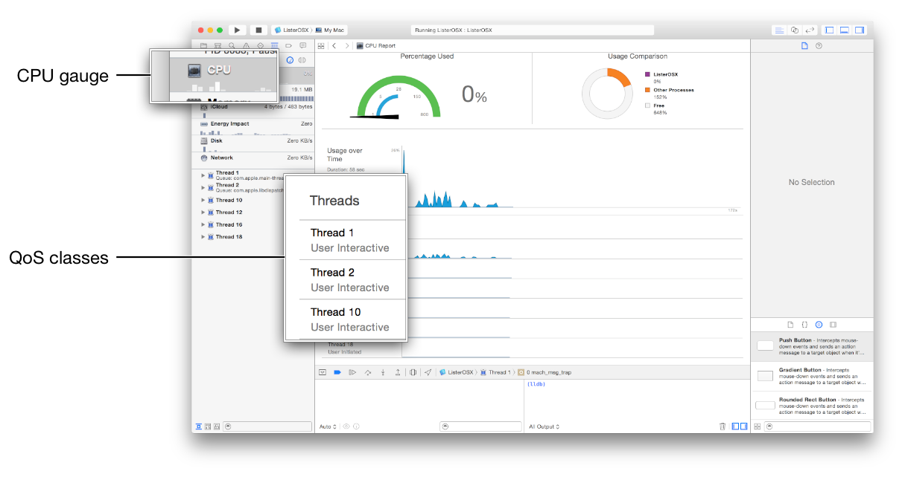

> 导航：[总目录](../../../README.md) · [documentation](../../../_indexes/documentation.md) · [Energy Efficiency Guide for Mac Apps](index.md)

## Prioritize Work at the Task Level

Apps and processes compete to use finite resources—CPU, memory, network interfaces, and so on. In order to remain responsive and efficient, the system needs to prioritize tasks and make intelligent decisions about when to execute them.

Work that directly impacts the user, such as UI updates in the active app, is extremely important and takes precedence over other work that may be occurring in the background. This higher priority work often uses more energy, as it may require substantial and immediate access to system resources.

As a developer, you can help the system prioritize work more effectively by categorizing your app’s work, based on importance. Even if you’ve implemented other efficiency measures, such as deferring work until an optimal time, the system still needs to perform some level of prioritization. Therefore, it is still important to categorize the work your app performs.

### About Quality of Service Classes

OS X implements a variety of resource management attributes, which can be adjusted in order to improve the responsiveness and efficiency of the system. For example, you can adjust the CPU scheduler and I/O priorities for a task, provide a threshold for timer coalescing, and denote whether the CPU should operate in a throughput- or efficiency-oriented mode. These attributes, however, can be difficult to access and configure. A much simpler solution is to utilize quality of service (QoS) levels—known as classes—in your app.

A _quality of service (QoS) class_ allows you to categorize work to be performed by `NSOperation`, `NSOperationQueue`, `NSTask`, `NSThread`, dispatch queues, and pthreads (POSIX threads). By assigning a QoS to work, you indicate its importance, and the system prioritizes it and schedules it accordingly. For example, the system performs work initiated by a user sooner than background work that can be deferred until a more optimal time. In some cases, system resources may be reallocated away from the lower priority work and given to the higher priority work.

Because higher priority work is performed more quickly and with more resources than lower priority work, it typically requires more energy than lower priority work. Accurately specifying appropriate QoS classes for the work your app performs ensures that your app is responsive as well as energy efficient.

### Choosing a Quality of Service Class

The system uses QoS information to adjust priorities such as scheduling, CPU and I/O throughput, and timer latency. As a result, the work performed maintains a balance between performance and energy efficiency.

When you assign a QoS to a task, consider how it affects the user and how it affects other work. As shown in Table 10-1, there are four primary QoS classes, each corresponding to a level of work importance.

__Table 10-1__Primary QoS classes (shown in order of priority)

| QoS Class | Type of work and focus of QoS | Duration of work to be performed |
| --- | --- | --- |
| User-interactive | Work that is interacting with the user, such as operating on the main thread, refreshing the user interface, or performing animations. If the work doesn’t happen quickly, the user interface may appear frozen. Focuses on responsiveness and performance. | Work is virtually instantaneous. |
| User-initiated | Work that the user has initiated and requires immediate results, such as opening a saved document or performing an action when the user clicks something in the user interface. The work is required in order to continue user interaction. Focuses on responsiveness and performance. | Work is nearly instantaneous, such as a few seconds or less. |
| Utility | Work that may take some time to complete and doesn’t require an immediate result, such as downloading a PDF or importing data. Utility tasks typically have a progress bar that is visible to the user. Focuses on providing a balance between responsiveness, performance, and energy efficiency. | Work takes a few seconds to a few minutes. |
| Background | Work that operates in the background and isn’t visible to the user, such as indexing, synchronizing, and backups. Focuses on energy efficiency. | Work takes significant time, such as minutes or hours. |

> [!IMPORTANT]
> 

### Special Quality of Service Classes

In addition to the primary QoS classes, there are two special types of QoS (described in Table 10-2). In most cases, you won’t be exposed to these classes, but there is still value in knowing they exist.

__Table 10-2__Special QoS classes

| QoS Class | Description |
| --- | --- |
| Default | The priority level of this QoS falls between user-initiated and utility. Work that has no QoS information assigned is treated as default. The GCD global queue runs at this level. This QoS is not intended to be used to classify work. |
| Unspecified | This represents the absence of QoS information and cues the system that an environmental QoS should be inferred. Threads can have an unspecified QoS if they use legacy APIs that may opt the thread out of QoS. |

### Specify a QoS for Operations and Queues

If your app uses operations and queues to perform work, you can specify a QoS for that work. The [NSOperation](https://developer.apple.com/documentation/foundation/nsoperation) and [NSOperationQueue](https://developer.apple.com/documentation/foundation/operationqueue) classes both possess a `qualityOfService` property, of type `NSQualityOfService`, which can be set to one of the following values:

- `NSQualityOfServiceUserInteractive`
- `NSQualityOfServiceUserInitiated`
- `NSQualityOfServiceUtility`
- `NSQualityOfServiceBackground`

Listing 10-1 shows how to set the QoS for an operation.

__Listing 10-1__Setting the quality of service of an operation

Objective-C

1. `NSOperation *myOperation = [[NSOperation alloc] init];`
2. `myOperation.qualityOfService = NSQualityOfServiceUtility;`

Swift

1. `let myOperation: NSOperation = MyOperation()`
2. `myOperation.qualityOfService = .Utility`

> [!NOTE]
> 

### Quality of Service Inference and Promotion

Note that QoS is not a static setting for operations and queues, and could fluctuate over time depending on a variety of criteria. For example, situations may occur where the QoS of an operation and the QoS of a queue don’t match, an operation and a dependent operation don’t match, or an operation has no QoS assigned. In these scenarios, a QoS may be inferred.

Numerous rules govern how QoS inference and promotion occurs with regard to queues (see Table 10-3) and operations (see Table 10-4).

__Table 10-3__`NSOperationQueue` QoS inference and promotion rules

| Situation | Result |
| --- | --- |
| A queue has no QoS assigned and an operation with a QoS is added to the queue. | The queue and its other operations, if any, remain unaffected. |
| A queue has a QoS assigned, and an operation with a QoS is added to the queue. | The QoS of the queue is promoted if the QoS of the new operation is higher.  Any of the queue’s operations with a lower QoS are also promoted.  Any operations with a lower QoS that are added to the queue in the future will infer the higher QoS. |
| The QoS of a queue is raised by changing the value of the queue’s `qualityOfService` property. | Any of the queue’s operations with a lower QoS are promoted to the higher QoS.  Any operations with a lower QoS that are added to the queue in the future will infer the higher QoS. |
| The QoS of a queue is lowered by changing the value of the queue’s `qualityOfService` property. | Any of the queue’s operations remain unaffected.  Any operations that are added to the queue in the future will infer the lower QoS, unless they have a higher QoS assigned, in which case they will retain their assigned QoS level. |

__Table 10-4__`NSOperation` inference and promotion rules

| Situation | Result |
| --- | --- |
| An operation has no QoS assigned. | The operation infers the QoS of the parent operation, queue, `[NSProcessInfo performActivityWithOptions:reason:usingBlock:]` block, or thread, if any.  In a situation where an operation is created on the main thread, a QoS of `NSQualityOfServiceUserInitiated` is inferred. |
| An operation with a QoS is added to a queue with a higher QoS. | The QoS of the operation is promoted to match the QoS of the queue. |
| The QoS of a queue containing an operation is promoted. | The operation infers the new QoS of the queue if it is higher than the current QoS of the operation. |
| Another operation becomes dependent (child) on the operation (parent). | The parent operation infers the QoS of the child operation if that QoS is higher. |
| The QoS of the operation is raised by changing the operation’s `qualityOfService` property. | The operation infers the new QoS.  Any child operations are promoted to the new QoS if it is higher.  Other operations in the operation’s queue that are in front of the operation are promoted to the new QoS if it is higher. |
| The QoS of the operation is lowered by changing the operation’s `qualityOfService` property. | The operation infers the new QoS.  Any child operations remain unaffected.  The queue of the operation remains unaffected. |

### Adjust the QoS of a Running Operation

Once an operation is running, you can change its QoS in one of the following ways:

- Change the [qualityOfService](https://developer.apple.com/documentation/foundation/operation/1413553-qualityofservice) property of the operation. Note that doing this also changes the QoS of the thread that’s running the operation.
- Add a new operation with a higher QoS to the running operation’s queue. This will promote the QoS of the running operation to match the QoS of the operation.
- Use [addDependency:](https://developer.apple.com/documentation/foundation/nsoperation/1412859-adddependency) to add an operation with a higher QoS to the running operation as a dependent.
- Use [waitUntilFinished](https://developer.apple.com/documentation/foundation/nsoperation/1409256-waituntilfinished) or [waitUntilAllOperationsAreFinished](https://developer.apple.com/documentation/foundation/nsoperationqueue/1407971-waituntilalloperationsarefinishe). This will promote the QoS of the running operation to match the QoS of the caller.

### Specify a QoS for Dispatch Queues and Blocks

If your app uses GCD, QoS classes can be applied to dispatch queues and blocks.

### Dispatch Queues

For dispatch queues, you can specify a QoS by calling [dispatch_queue_attr_make_with_qos_class](https://developer.apple.com/documentation/dispatch/1453028-dispatch_queue_attr_make_with_qo) when creating the queue. First, create a dispatch queue attribute for the QoS, and then provide that attribute when you create the queue, as shown in Listing 10-2.

__Listing 10-2__Assigning a QoS to a GCD dispatch queue

Objective-C

1. `dispatch_queue_attr_t qosAttribute = dispatch_queue_attr_make_with_qos_class(DISPATCH_QUEUE_CONCURRENT, QOS_CLASS_UTILITY, 0);`
2. `dispatch_queue_t myQueue = dispatch_queue_create("com.YourApp.YourQueue", qosAttribute);`

Swift

1. `let qosAttribute = dispatch_queue_attr_make_with_qos_class(DISPATCH_QUEUE_CONCURRENT, QOS_CLASS_UTILITY, 0)`
2. `let myQueue = dispatch_queue_create("com.YourApp.YourQueue", qosAttribute)`

Table 10-5 shows how GCD QoS classes map to Foundation QoS equivalents.

__Table 10-5__GCD to Foundation QoS mappings

| GCD QoS classes (defined in sys/qos.h) | Corresponding Foundation QoS classes |
| --- | --- |
| `QOS_CLASS_USER_INTERACTIVE` | `NSQualityOfServiceUserInteractive` |
| `QOS_CLASS_USER_INITIATED` | `NSQualityOfServiceUserInitiated` |
| `QOS_CLASS_UTILITY` | `NSQualityOfServiceUtility` |
| `QOS_CLASS_BACKGROUND` | `NSQualityOfServiceBackground` |

QoS is an immutable attribute of a dispatch queue, and can’t be changed once the queue has been created. To retrieve the QoS that’s assigned to a dispatch queue, call `dispatch_queue_get_qos_class`.

__Listing 10-3__Retrieving the QoS of a GCD dispatch queue

Objective-C

1. `qosClass = dispatch_queue_get_qos_class(myQueue, &relative);`

Swift

1. `let qosClass = dispatch_queue_get_qos_class(myQueue, &relative)`

### Global Concurrent Queues

In the past, GCD has provided high, default, low, and background global concurrent queues for prioritizing work. Corresponding QoS classes should be used in place of these queues. Table 10-6 describes the mappings between these queues and QoS classes.

__Table 10-6__GCD global concurrent queue to QoS mappings

| Global queue | Corresponding QoS class |
| --- | --- |
| Main thread | User-interactive |
| DISPATCH_QUEUE_PRIORITY_HIGH | User-initiated |
| DISPATCH_QUEUE_PRIORITY_DEFAULT | Default |
| DISPATCH_QUEUE_PRIORITY_LOW | Utility |
| DISPATCH_QUEUE_PRIORITY_BACKGROUND | Background |

A global concurrent queue exists for each QoS class. To retrieve the global concurrent queue corresponding to a given QoS, call [dispatch_get_global_queue](https://developer.apple.com/documentation/dispatch/1452927-dispatch_get_global_queue) and pass it the desired QoS class. Listing 10-4, for example, retrieves the global concurrent queue for the utility QoS class.

__Listing 10-4__Getting the global concurrent queue for a QoS

Objective-C

1. `utilityGlobalQueue = dispatch_get_global_queue(QOS_CLASS_UTILITY, 0);`

Swift

1. `utilityGlobalQueue = dispatch_get_global_queue(QOS_CLASS_UTILITY, 0)`

Queues that don’t have a QoS assigned and don’t target a global concurrent queue infer a QoS class of unspecified.

### Dispatch Blocks

The GCD block API allows QoS classes to be applied at the block level, such as when calling [dispatch_async](https://developer.apple.com/documentation/dispatch/1453057-dispatch_async), [dispatch_sync](https://developer.apple.com/documentation/dispatch/1452870-dispatch_sync), [dispatch_after](https://developer.apple.com/documentation/dispatch/1452876-dispatch_after), [dispatch_apply](https://developer.apple.com/documentation/dispatch/1453050-dispatch_apply), or [dispatch_once](https://developer.apple.com/documentation/dispatch/1447169-dispatch_once). You do this when you create the block, as shown in Listing 10-5.

__Listing 10-5__Assigning a QoS when creating a dispatch block

Objective-C

1. `dispatch_block_t myBlock;`
2. `myBlock = dispatch_block_create_with_qos_class)(`
3. `0, QOS_CLASS_UTILITY, -8, ^{…});`
4. `dispatch_async(myQueue, myBlock);`

Swift

1. `let myBlock = dispatch_block_create_with_qos_class(0, QOS_CLASS_UTILITY) {`
2. `...`
3. `}`
4. `dispatch_async(myQueue, myBlock)`

### Priority Inversions

When high-priority work becomes dependent on lower priority work, or it becomes the result of lower priority work, a _priority inversion_ occurs. As a result, blocking, spinning, and polling may occur.

In the case of synchronous work, the system will try to resolve the priority inversion automatically by raising the QoS of the lower priority work for the duration of the inversion. This will occur in the following situations:

- When `dispatch_sync()` and `dispatch_wait()` are called for a block on a serial queue.
- When `pthread_mutex_lock()` is called while the mutex is held by a thread with lower QoS. In this situation, the thread holding the lock is raised to the QoS of the caller. However, this QoS promotion does not occur across multiple locks.

In the case of asynchronous work, the system will attempt to resolve the priority inversions occurring on a serial queue.

> [!IMPORTANT]
> 

### Specify a QoS for Tasks and Threads

Tasks and threads also support QoS.

### NSTask and NSThread

Both [NSTask](https://developer.apple.com/library/archive/documentation/LegacyTechnologies/WebObjects/WebObjects_3.5/Reference/Frameworks/ObjC/Foundation/Classes/NSTask/Description.html#//apple_ref/occ/cl/NSTask) and [NSThread](https://developer.apple.com/library/archive/documentation/LegacyTechnologies/WebObjects/WebObjects_3.5/Reference/Frameworks/ObjC/Foundation/Classes/NSThread/Description.html#//apple_ref/occ/cl/NSThread) possesses a `qualityOfService` property, of type `NSQualityOfService`. These classes will not infer a QoS based on the context of their execution, so the value of this property may only be changed before the task or thread has started. Reading the `qualityOfService` of a task or thread at any time will provide its current value.

### The Main Thread and the Current Thread

The main thread is automatically assigned a QoS based on its environment. In an app, the main thread runs at a QoS level of user-interactive. In an XPC service, the main thread runs at a QoS of default. To retrieve the QoS of the main thread, call the `qos_class_main` function, as shown in Listing 10-6.

__Listing 10-6__Retrieving the QoS of the main thread

Objective-C

1. `qosClass = qos_class_main();`

Swift

1. `let qosClass = qos_class_main()`

To retrieve the QoS of the currently running thread, call the `qos_class_self` function, as shown in Listing 10-7.

__Listing 10-7__Retrieving the QoS of the current thread

Objective-C

1. `qosClass = qos_class_self();`

Swift

1. `let qosClass = qos_class_self()`

### pthreads

You can assign a QoS class when creating a pthread by using an attribute, as shown in Listing 10-8, which creates a utility pthread.

__Listing 10-8__Creating a pthread with a QoS

Objective-C

1. `pthread_attr_t qosAttribute;`
2. `pthread_attr_init(&qosAttribute);`
3. `pthread_attr_set_qos_class_np(&qosAttribute, QOS_CLASS_UTILITY, 0);`
4. `pthread_create(&thread, &qosAttribute, f, NULL);`

Swift

1. `var thread = pthread_t()`
2. `var qosAttribute = pthread_attr_t()`
3. `pthread_attr_init(&qosAttribute)`
4. `pthread_attr_set_qos_class_np(&qosAttribute, QOS_CLASS_UTILITY, 0)`
5. `pthread_create(&thread, &qosAttribute, f, nil)`

To change the QoS of a pthread, call pthread_set_qos_class_self_np and pass it the new QoS to apply, as shown in Listing 10-9.

__Listing 10-9__Changing the QoS of a pthread

Objective-C

1. `pthread_set_qos_class_self_np(QOS_CLASS_BACKGROUND,0);`

Swift

1. `pthread_set_qos_class_self_np(QOS_CLASS_BACKGROUND, 0)`

### About CloudKit and Quality of Service

If your app uses the CloudKit framework, it’s worth noting that certain CloudKit classes implement custom QoS behavior by default.

- [CKOperation](https://developer.apple.com/documentation/cloudkit/ckoperation) is a subclass of the [NSOperation](https://developer.apple.com/documentation/foundation/nsoperation) class. Although the `NSOperation` class has a default QoS level of `NSQualityOfServiceBackground`, `CKOperation` objects have a default QoS level of `NSQualityOfServiceUtility`. At this level, network requests are treated as discretionary when your app isn’t in use.
- [CKContainer](https://developer.apple.com/documentation/cloudkit/ckcontainer) is a subclass of the [NSObject](https://developer.apple.com/library/archive/documentation/LegacyTechnologies/WebObjects/WebObjects_3.5/Reference/Frameworks/ObjC/Foundation/Classes/NSObject/Description.html#//apple_ref/occ/cl/NSObject) class. Interactions with `CKContainer` objects occur at a QoS level of `NSQualityOfServiceUserInitiated` by default.
- [CKDatabase](https://developer.apple.com/documentation/cloudkit/ckdatabase) is a subclass of the `NSObject` class. Interactions with `CKContainer` objects occur at a QoS level of `NSQualityOfServiceUserInitiated` by default.

For information about CloudKit classes, see _[CloudKit Framework Reference](https://developer.apple.com/documentation/cloudkit)_.

### Debugging Quality of Service Classes

There are several ways you can evaluate your code in order to determine whether a particular QoS has been applied.

### Xcode

By setting breakpoints in Xcode or pausing your app while testing, you can inspect your app with the CPU usage gauge in the debug navigator in order to confirm that requested QoS classes are being applied. See Figure 10-1.

__Figure 10-1__QoS classes in the Xcode CPU gauge

### powermetrics

Use the powermetrics tool to analyze your app and determine how much time is being allocated to different QoS classes.

In Listing 10-10, metrics are retrieved for the running tasks on a device. The results show that an app is running primarily at a QoS level of user-interactive (`19.96`), with much less user-initiated (`0.62`), utility (`0.0`), and background (`0.0`) work occurring. As a result, the app is using more energy than if it were running more work at the lower QoS classes. If the breakdown provided for your app is not what you expect, then you should investigate further. Consider running [spindump](#apple-f4xwc4dqnrsv64tfmyxwi33df52wszbpkridimbqgeztsmrzfvbuqmzvfvjvomzq) to analyze your code.

__Listing 10-10__Example of QoS inspection via the powermetrics tool

1. `$ sudo powermetrics --show-process-qos --samplers tasks`
2. `*** Sampled system activity (Fri Feb 20 11:55:48 2015 -0800) (5004.56ms elapsed) ***`
4. `*** Running tasks ***`
6. `Name ID CPU ms/s User% Deadlines (<2 ms, 2-5 ms) Wakeups (Intr, Pkg idle) QOS (ms/s) Default Maint BG Util Lgcy U-Init U-Intr`
7. `ListerOSX 8083 21.05 79.16 0.00 0.00 10.19 4.60 0.00 0.00 0.00 0.00 0.43 0.62 19.96`

See powermetrics(1) Mac OS X Manual Page for information on using this tool.

### spindump

Use the spindump tool with the `-timeline` option to sample and profile your app in order to determine which QoS class applies as a specific portion of code executes at a given time. Listing 10-11 shows that a thread is running at a QoS level of user-initiated.

__Listing 10-11__Example of QoS inspection via the spindump tool

1. `$ sudo spindump -timeline ListerOSX`
3. `Thread 0x48e64c 1000 samples (1-1000) priority 37`
4. `<thread QoS user initiated, IO policy standard>`
5. `1000 thread_start + 13 (libsystem_pthread.dylib + 5149) [0x7fff8c3aa41d] 1-1000`
6. `1000 _pthread_start + 176 (libsystem_pthread.dylib + 12773) [0x7fff8c3ac1e5] 1-1000`
7. `1000 _pthread_body + 131 (libsystem_pthread.dylib + 12904) [0x7fff8c3ac268] 1-1000`

See spindump(8) Mac OS X Manual Page for information on using this tool.

[Prioritize Work at the App Level](PrioritizeWorkAtTheAppLevel.md#apple-f4xwc4dqnrsv64tfmyxwi33df52wszbpkridimbqgeztsmrzfvbuqmzwfvjvomi)

[Manage Tasks with CTS and GCD](DiscretionaryTasks.md#apple-f4xwc4dqnrsv64tfmyxwi33df52wszbpkridimbqgeztsmrzfvbuqmzufvjvomi)
