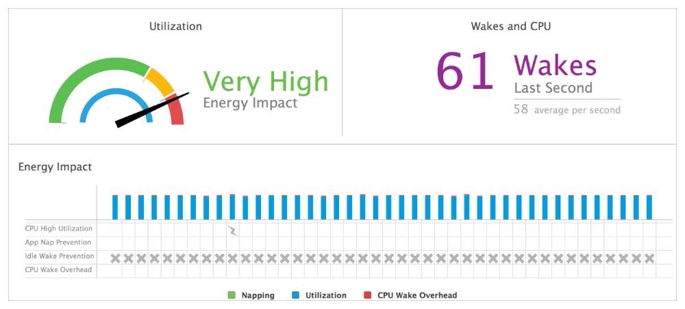
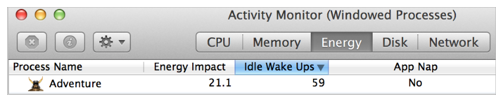

> 导航：[总目录](../../../README.md) · [documentation](../../../_indexes/documentation.md) · [Energy Efficiency Guide for Mac Apps](index.md)

## Minimize Timer Usage

You can reduce your app’s energy usage by implementing energy-efficient APIs instead of timers.

- The `NSBackgroundActivityScheduler` API lets you schedule both repeating and non-repeating tasks energy efficiently. See [Schedule Background Activity](SchedulingBackgroundActivity.md#apple-f4xwc4dqnrsv64tfmyxwi33df52wszbpkridimbqgeztsmrzfvbuqmzsfvjvomi).
- The `NSURLSession` API provides the ability to perform out-of-process background URL sessions and receive notifications when they are complete. See [Schedule Background Networking](SchedulingNetworkActivity.md#apple-f4xwc4dqnrsv64tfmyxwi33df52wszbpkridimbqgeztsmrzfvbuqmztfvjvomi).
- The XPC Activity API can be used to request centralized scheduling of discretionary tasks in your app. See [Defer Tasks with XPC Activity](CentralizedTaskScheduling.md#apple-f4xwc4dqnrsv64tfmyxwi33df52wszbpkridimbqgeztsmrzfvbuqmznknltc).

If you must use timers, employ them efficiently.

### The High Cost of Timers

A timer lets you schedule a delayed or periodic action. A timer waits until a certain interval has elapsed and then fires, performing a specific action such as sending a message to its target object. Waking the system from an idle state incurs an energy cost when the CPU and other systems are awakened from their low-power, idle states. If a timer causes the system to wake, it incurs that cost.

Apps often use timers unnecessarily. If you use timers in your app, consider whether you truly need them. For example, some apps use timers to poll for state changes when they should respond to events instead. Other apps use timers as synchronization tools when they should use semaphores or other locks to achieve the greatest efficiency. Some timers are executed without suitable timeouts, causing them to continue firing when they’re no longer needed. Regardless of the scenario, if there are many timer-invoked wakeups, the energy impact is high, as shown in Figure 7-1.

__Figure 7-1__The Energy Impact gauge in Xcode showing the impact of excessive wakeups from idle

### Get Event Notifications Without Using Timers

Some apps use timers to monitor for key presses, mouse locations, changes to file contents, network availability, and other state changes. Timers prevent the CPU from going to or staying in the idle state, which increases energy usage and consumes battery power.

Instead of using timers to watch for events, use a more efficient service, such as a dispatch source. See Listing 7-1.

__Listing 7-1__Recommended: Use an energy-efficient dispatch source to obtain file change notifications

Objective-C

1. `const char *myFile = [@"/Path/To/File" fileSystemRepresentation];`
2. `int fileDescriptor = open(myFile, O_EVTONLY);`
3. `dispatch_queue_t myQueue = dispatch_get_main_queue();`
4. `const uint64_t dispatchFlags = DISPATCH_VNODE_DELETE | DISPATCH_VNODE_WRITE;`
5. `dispatch_source_t mySource = dispatch_source_create(DISPATCH_SOURCE_TYPE_VNODE, fileDescriptor, dispatchFlags, myQueue);`
6. `dispatch_source_set_event_handler(mySource, ^{`
7. `[self checkForFile];`
8. `});`
9. `dispatch_resume(mySource);`

Swift

1. `let myFile = @"/Path/To/File"`
2. `let fileDescriptor = open(myFile.fileSystemRepresentation, O_EVTONLY)`
3. `let myQueue = dispatch_get_main_queue()`
4. `let dispatchFlags = DISPATCH_VNODE_DELETE | DISPATCH_VNODE_WRITE`
5. `let mySource = dispatch_source_create(DISPATCH_SOURCE_TYPE_VNODE, fileDescriptor, dispatchFlags, myQueue)`
6. `dispatch_source_set_event_handler(mySource) {`
7. `self.checkForFile()`
8. `}`
9. `dispatch_resume(mySource)`

Use event notifications for system-provided services whenever possible. Table 7-1 provides a list of common system notifications along with their corresponding coding approaches.

__Table 7-1__Obtaining event notifications for system services

| Event to be notified about | Approach to follow for obtaining event notifications | Described in |
| --- | --- | --- |
| Updates to files | Configure a dispatch source. | [Dispatch Sources](https://developer.apple.com/library/archive/documentation/General/Conceptual/ConcurrencyProgrammingGuide/GCDWorkQueues/GCDWorkQueues.html#//apple_ref/doc/uid/TP40008091-CH103) in _[Concurrency Programming Guide](../../General/Concurrency%20Programming%20Guide/Introduction.md#apple-f4xwc4dqnrsv64tfmyxwi33df52wszbpkridimbqga4daojr)_ |
| Updates to systemwide files or directories | Create an event stream with the File System Events API. | _[File System Events Programming Guide](../../Darwin/File%20System%20Events%20Programming%20Guide/Introduction.md#apple-f4xwc4dqnrsv64tfmyxwi33df52wszbpkridimbqga2teobz)_ |
| Interprocess messages | Use XPC Services. | [Creating XPC Services](https://developer.apple.com/library/archive/documentation/MacOSX/Conceptual/BPSystemStartup/Chapters/CreatingXPCServices.html#//apple_ref/doc/uid/10000172i-SW6) in _[Daemons and Services Programming Guide](../../Mac%20OSX/Daemons%20and%20Services%20Programming%20Guide/About%20Daemons%20and%20Services.md#apple-f4xwc4dqnrsv64tfmyxwi33df52wszbpgeydambqge3te2i)_ |
|  | Use the [NSDistributedNotificationCenter](https://developer.apple.com/documentation/foundation/nsdistributednotificationcenter) class. | _[NSDistributedNotificationCenter Class Reference](https://developer.apple.com/documentation/foundation/nsdistributednotificationcenter)_ |
|  | Use the `notify_register`, `[notify_post](../../../Darwin/Reference/usr_APIs/notify/CompositePage.md#apple-f4xwc4dqnrsv64tfmyxwgl3govxggl3on52gsztzl5yg643u)`, and other notification functions. | _[Darwin Notification API Reference](https://developer.apple.com/documentation/darwinnotify/darwin_notification_api)_ |
| Changes to a disk or volume | Register for disk arbitration notifications. | _[Disk Arbitration Programming Guide](../../Disk%20Arbitration%20Programming%20Guide/About%20Disk%20Arbitration.md#apple-f4xwc4dqnrsv64tfmyxwi33df52wszbpkridimbqga4tgmjq)_ |
| The availability of hot-pluggable devices | Create an IOKit notification object. | [Finding and Accessing Devices](https://developer.apple.com/library/archive/documentation/DeviceDrivers/Conceptual/AccessingHardware/AH_Finding_Devices/AH_Finding_Devices.html#//apple_ref/doc/uid/TP30000379) in _[Accessing Hardware From Applications](../../Device%20Drivers/Accessing%20Hardware%20From%20Applications/Introduction%20to%20Accessing%20Hardware%20From%20Applications.md#apple-f4xwc4dqnrsv64tfmyxwi33df52wszbpkridgmbqgaydgnzw)_ |
| Network events | Use the Apple Push Notification service. | _[Local and Remote Notification Programming Guide](https://developer.apple.com/library/archive/documentation/NetworkingInternet/Conceptual/RemoteNotificationsPG/index.html#//apple_ref/doc/uid/TP40008194)_ |
|  | Use Bonjour. | _[DNS Service Discovery Programming Guide](../../Networking/DNS%20Service%20Discovery%20Programming%20Guide/Introduction%20to%20DNS%20Service%20Discovery.md#apple-f4xwc4dqnrsv64tfmyxwi33df52wszbpkridgmbqgaydsnru)_ and _[NSNetServices and CFNetServices Programming Guide](../../Networking/NSNetServices%20and%20CFNetServices%20Programming%20Guide/About%20NSNetServices%20and%20CFNetServices.md#apple-f4xwc4dqnrsv64tfmyxwi33df52wszbpkridimbqgazdomzw)_ |
|  | Use the network reachability and connection APIs. | [Determining Reachability and Getting Connected](https://developer.apple.com/library/archive/documentation/Networking/Conceptual/SystemConfigFrameworks/SC_ReachConnect/SC_ReachConnect.html#//apple_ref/doc/uid/TP40001065-CH204) in _[System Configuration Programming Guidelines](../../Networking/System%20Configuration%20Programming%20Guidelines/Introduction%20to%20System%20Configuration%20Programming%20Guidelines.md#apple-f4xwc4dqnrsv64tfmyxwi33df52wszbpkridimbqgaytanrv)_ |
| Events generated by the mouse, keyboard, and other input devices | Use event monitors. | [Monitoring Events](https://developer.apple.com/library/archive/documentation/Cocoa/Conceptual/EventOverview/MonitoringEvents/MonitoringEvents.html#//apple_ref/doc/uid/10000060i-CH15) in _[Cocoa Event Handling Guide](../../Cocoa/Cocoa%20Event%20Handling%20Guide/Introduction.md#apple-f4xwc4dqnrsv64tfmyxwi33df52wszbpgeydambqga3da2i)_ |

### Use GCD Tools for Synchronization Instead of Timers

Grand Central Dispatch (GCD) provides dispatch queues, dispatch semaphores, and other synchronization features that are more efficient than timers.

The code in Listing 7-2 performs work on one thread while another thread and a completion handler use a timer to periodically check whether work on the first thread has completed. Until the work in the first thread is completed, the `usleep` timer in the second thread continually wakes the system only to determine whether the work in the first thread has completed.

__Listing 7-2__Not recommended: Using an energy-inefficient timer as a synchronization tool

Objective-C

1. `BOOL workIsDone = NO;`
3. `/* thread one */`
4. `void doWork(void) {`
5. `/* wait for network ... */`
6. `workIsDone = YES;`
7. `}`
9. `/* thread two: completion handler */ /*** Not Recommended ***/`
10. `void waitForWorkToFinish(void) {`
11. `while (!workIsDone) {`
12. `usleep(100000); /* 100 ms */ /*** Not Recommended ***/`
13. `}`
14. `[WorkController workDidFinish];`
15. `}`

Swift

1. `var workIsDone = false`
3. `/* thread one */`
4. `func doWork() {`
5. `/* wait for network ... */`
6. `workIsDone = true`
7. `}`
9. `/* thread two: completion handler */ /*** Not Recommended ***/`
10. `func waitForWorkToFinish() {`
11. `while (!workIsDone) {`
12. `usleep(100000) /* 100 ms */ /*** Not Recommended ***/`
13. `}`
14. `WorkController.workDidFinish()`
15. `}`

The code in Listing 7-3 performs synchronization much more efficiently with a serial dispatch queue.

__Listing 7-3__Recommended: Using an energy-efficient dispatch queue to synchronize threads

Objective-C

1. `myQueue = dispatch_queue_create("com.myapp.myq", DISPATCH_QUEUE_SERIAL);`
2. `dispatch_block_t block;`
3. `block = dispatch_block_create(0, ^{`
4. `/* wait for network ... */`
5. `});`
7. `/* thread one */`
8. `void beginWork(void) {`
9. `dispatch_async(myQueue, block);`
10. `};`
12. `/* thread two */`
13. `void waitForWorkToFinish(void) {`
14. `dispatch_block_wait(block, DISPATCH_TIME_FOREVER);`
15. `Block_release(block);`
16. `[WorkController workDidFinish];`
17. `};`

Swift

1. `let myQueue = dispatch_queue_create("com.myapp.myq", DISPATCH_QUEUE_SERIAL)`
2. `let block = dispatch_block_create(0) {`
3. `/* wait for network ... */`
4. `}`
6. `/* thread one */`
7. `func beginWork() {`
8. `dispatch_async(myQueue, block)`
9. `}`
11. `/* thread two */`
12. `func waitForWorkToFinish() {`
13. `dispatch_block_wait(block, DISPATCH_TIME_FOREVER)`
14. `WorkController.workDidFinish()`
15. `}`

Without continually waking the system, the completion method on thread two waits for the work on the first thread to finish.

Similarly, the code in Listing 7-4 demonstrates how to perform a long-running operation on one thread, and additional work on another thread once the long-running operation completes. This technique could be used, for example, to prevent blocking work from occurring on the main thread of your app.

__Listing 7-4__Recommended: Using asynchronous dispatch queues to perform work on multiple threads

Objective-C

1. `dispatch_async(thread2_queue) {`
2. `/* do long work */`
3. `dispatch_async(thread1_queue) {`
4. `/* continue with next work */`
5. `}`
6. `};`

Swift

1. `dispatch_async(thread2_queue) {`
2. `/* do long work */`
3. `dispatch_async(thread1_queue) {`
4. `/* continue with next work */`
5. `}`
6. `}`

> [!NOTE]
> 

### If You Must Use a Timer, Employ It Efficiently

Games and other graphics-intensive apps often rely on timers to initiate screen or animation updates. OS X has many programming interfaces that delay processes for specified periods of time. Any method or function to which you pass a relative or absolute deadline is a timer API. For example:

- High-level timer APIs include dispatch timer sources, [CFRunLoopTimerCreate](https://developer.apple.com/documentation/corefoundation/1543570-cfrunlooptimercreate) and other CFRunLoopTimer functions, the [NSTimer](https://developer.apple.com/library/archive/documentation/LegacyTechnologies/WebObjects/WebObjects_3.5/Reference/Frameworks/ObjC/Foundation/Classes/NSTimer/Description.html#//apple_ref/occ/cl/NSTimer) class, the [performSelector:withObject:afterDelay:](https://developer.apple.com/library/archive/documentation/LegacyTechnologies/WebObjects/WebObjects_3.5/Reference/Frameworks/ObjC/Foundation/Classes/NSObject/Description.html#//apple_ref/occ/instm/NSObject/performSelector:withObject:afterDelay:) method, [CVDisplayLinkStart](https://developer.apple.com/documentation/corevideo/1457193-cvdisplaylinkstart) and other `CVDisplayLink` functions, and the [NSProgressIndicator](https://developer.apple.com/documentation/appkit/nsprogressindicator) class.
- Low-level timer APIs include the functions `sleep`, `usleep`, `nanosleep`, `pthread_cond_timedwait`, `select`, `poll`, `kevent`, [dispatch_after](https://developer.apple.com/documentation/dispatch/1452876-dispatch_after), and [dispatch_semaphore_wait](https://developer.apple.com/documentation/dispatch/1453087-dispatch_semaphore_wait).

If you determine that your app indeed requires a timer, follow these guidelines for drawing the least amount of energy:

- Use timers economically by specifying suitable timeouts.
- Invalidate repeating timers when they’re no longer needed.
- Set tolerances for when timers should fire.

### Specify Suitable Timeouts

Many functions include a timeout parameter and exit when the timeout is reached. Passing a time interval to these functions causes them to operate as timers, with all the energy consumption of timers.

If your app uses an inappropriate timeout value, that usage can waste energy. For example, in the code in Listing 7-5, a timeout value of 500 nanoseconds from the current time (`DISPATCH_TIME_NOW`) is passed to the [dispatch_semaphore_wait](https://developer.apple.com/documentation/dispatch/1453087-dispatch_semaphore_wait) function. Until the semaphore is signaled, the code performs no useful work while `dispatch_semaphore_wait` continually times out.

If your app uses the [DISPATCH_TIME_FOREVER](https://developer.apple.com/documentation/dispatch/dispatch_time_forever) constant, that usage can block a function indefinitely, allowing the function to resume only when needed. The code in Listing 7-6 passes the `DISPATCH_TIME_FOREVER` constant to `dispatch_semaphore_wait`. The function blocks until it receives the semaphore.

__Listing 7-5__Not recommended: Set a timeout that isn’t acted upon by the app

Objective-C

1. `while (YES) {`
2. `dispatch_time_t timeout = dispatch_time(DISPATCH_TIME_NOW, 500 * NSEC_PER_SEC);`
3. `long semaphoreReturnValue = dispatch_semaphore_wait(mySemaphore, timeout);`
4. `if (havePendingWork) {`
5. `[self doPendingWork];`
6. `}`
7. `}`

Swift

1. `repeat {`
2. `let timeout = dispatch_time(DISPATCH_TIME_NOW, 500 * Double(NSEC_PER_SEC))`
3. `let semaphoreReturnValue = dispatch_semaphore_wait(mySemaphore, timeout)`
4. `if (havePendingWork) {`
5. `self.doPendingWork()`
6. `}`
7. `} while true`

__Listing 7-6__Recommended: Block indefinitely until a semaphore is received

Objective-C

1. `while (YES) {`
2. `dispatch_time_t timeout = DISPATCH_TIME_FOREVER;`
3. `long semaphoreReturnValue = dispatch_semaphore_wait(mySemaphore, timeout);`
4. `if (havePendingWork) {`
5. `[self doPendingWork];`
6. `}`
7. `}`

Swift

1. `repeat {`
2. `let timeout = DISPATCH_TIME_FOREVER`
3. `let semaphoreReturnValue = dispatch_semaphore_wait(mySemaphore, timeout)`
4. `if (havePendingWork) {`
5. `self.doPendingWork()`
6. `}`
7. `} while true`

In most cases, blocking indefinitely (as in Listing 7-6) is more suitable than specifying a time value. But if your app does need to wait for a timeout, specify a semaphore value that represents a meaningful state change, such as an error condition or a network timeout.

### Invalidate Repeating Timers You No Longer Need

If you use a repeating timer, invalidate or cancel it when you no longer need it. Forgetting to stop timers probably wastes more energy than anything else in OS X, and it is one of the simplest problems to fix.

The code in Listing 7-7 uses a repeating [NSTimer](https://developer.apple.com/library/archive/documentation/LegacyTechnologies/WebObjects/WebObjects_3.5/Reference/Frameworks/ObjC/Foundation/Classes/NSTimer/Description.html#//apple_ref/occ/cl/NSTimer) timer. When the timer is no longer needed, the code calls the [invalidate](https://developer.apple.com/library/archive/documentation/LegacyTechnologies/WebObjects/WebObjects_3.5/Reference/Frameworks/ObjC/Foundation/Classes/NSTimer/Description.html#//apple_ref/occ/instm/NSTimer/invalidate) method to stop the timer from firing again, avoiding unnecessary energy use.

__Listing 7-7__Recommended: Invalidating a timer when it is no longer needed

Objective-C

1. `NSTimer *myTimer = [[NSTimer alloc] initWithFireDate:date`
2. `interval:1.0`
3. `target:self`
4. `selector:@selector(timerFired:)`
5. `userInfo:nil`
6. `repeats:YES];`
8. `/* Do work until the timer is no longer needed */`
10. `[myTimer invalidate]; /* Recommended */`

Swift

1. `var myTimer = NSTimer.initWithFireDate(date, interval: 1.0, target: self, selector:"timerFired:", userInfo:nil repeats: true)`
3. `/* Do work until the timer is no longer needed */`
5. `myTimer.invalidate() /* Recommended */`

For a repeating dispatch timer, use the [dispatch_source_cancel](https://developer.apple.com/documentation/dispatch/1385604-dispatch_source_cancel) function to cancel the timer when it’s no longer needed. For a repeating `CFRunLoop` timer, use the [CFRunLoopTimerInvalidate](https://developer.apple.com/documentation/corefoundation/1542231-cfrunlooptimerinvalidate) function.

### Specify a Tolerance for Batching Timers Systemwide

Specify a tolerance for the accuracy of when your timers fire. The system will use this flexibility to shift the execution of timers by small amounts of time—within their tolerances—so that multiple apps’ timers can be executed at the same time. Using this approach dramatically increases the amount of time that the processor spends idling while users detect no change in system responsiveness.

You can use the `setTolerance:` method to specify a tolerance for your timer, as shown in Listing 7-8. The tolerance of 10 percent is set by `setTolerance:0.3` compared to `interval:3.0`.

__Listing 7-8__Recommended: Set a tolerance for `NSTimer` timers

Objective-C

1. `[myTimer setTolerace:0.3];`
2. `[[NSRunLoop currentRunLoop] addTimer:myTimer forMode:NSDefaultRunLoopMode];`

Swift

1. `myTimer.tolerance(0.3)`
2. `NSRunLoop.currentRunLoop().addTimer(myTimer, forMode:NSDefaultRunLoopMode)`

The example in Listing 7-9 shows how you can set a tolerance of 10 percent using the last parameter of the [dispatch_source_set_timer](https://developer.apple.com/documentation/dispatch/1385606-dispatch_source_set_timer) function.

__Listing 7-9__Recommended: Set a tolerance for dispatch timers

Objective-C

1. `dispatch_source_t myDispatchSourceTimer = dispatch_source_create(DISPATCH_SOURCE_TYPE_TIMER, 0, 0, myQueue);`
2. `dispatch_source_set_timer(myDispatchSourceTimer, DISPATCH_TIME_NOW, 1 * NSEC_PER_SEC, NSEC_PER_SEC / 10);`
3. `dispatch_source_set_event_handler(myDispatchSourceTimer, ^{`
4. `[self timerFired];`
5. `}`
6. `);`
7. `dispatch_resume(myDispatchSourceTimer);`

Swift

1. `let myDispatchSourceTimer = dispatch_source_create(DISPATCH_SOURCE_TYPE_TIMER, 0, 0, myQueue)`
2. `dispatch_source_set_timer(myDispatchSourceTimer, DISPATCH_TIME_NOW, 1 * Double(NSEC_PER_SEC), Double(NSEC_PER_SEC) / 10)`
3. `dispatch_source_set_event_handler(myDispatchSourceTimer) {`
4. `self.timerFired()`
5. `}`
7. `dispatch_resume(myDispatchSourceTimer)`

You can specify a tolerance of 10 percent of the timer interval for CFRunLoop timers using the `CFRunLoopTimerSetTolerance` function, as shown in Listing 7-10. The tolerance of 10 percent is set by the second argument to `CFRunLoopTimerSetTolerance`, compared with the third argument to [CFRunLoopTimerCreate](https://developer.apple.com/documentation/corefoundation/1543570-cfrunlooptimercreate).

__Listing 7-10__Recommended: Set a tolerance for `CFRunLoop` timers

Objective-C

1. `CFRunLoopTimerRef myRunLoopTimer = CFRunLoopTimerCreate(kCFAllocatorDefault, fireDate, 2.0, 0, &timerFired, NULL);`
2. `CFRunLoopTimerSetTolerance(myRunLoopTimer, 0.2);`
3. `CFRunLoopAddTimer(CFRunLoopGetCurrent(), myRunLoopTimer, kCFRunLoopDefaultMode);`

Swift

1. `myRunLoopTimer = CFRunLoopTimerCreate(kCFAllocatorDefault, fireDate, 2.0, 0, 0, &timerFired, NULL)`
2. `CFRunLoopTimerSetTolerance(myRunLoopTimer, 0.2)`
3. `CFRunLoopAddTimer(CFRunLoopGetCurrent(), myRunLoopTimer, kCFRunLoopDefaultMode)`

After you specify a tolerance for a timer, it may fire anytime between its scheduled fire date and the scheduled fire date, plus the tolerance. The timer won’t fire before the scheduled fire date. For repeating timers, the next fire date is always calculated from the original fire date in order to keep future fire times on track with their original schedule.

A general guideline is to set the tolerance to at least 10 percent of the interval for a repeating timer, as in the three examples above. Even a small amount of tolerance has a significant positive impact on the energy usage of your app.

> [!NOTE]
> 

### Recognize and Address Timer Issues

While developing and testing your app, you have two tools that can help you determine whether timers in your app are hurting energy performance: the Energy Impact gauge in Xcode and the Energy pane in Activity Monitor.

__Energy Impact gauge.__ When you build and run your app in Xcode, you can check the timer firings with the Energy Impact gauge. Open the debug navigator (choose View > Navigators > Show Debug Navigator). Select the Energy Impact gauge. The Wakes and CPU area reports how often a timer has fired in the last second. A very high number of wakeups results in a very high energy impact, as shown in [Figure 7-1](#apple-f4xwc4dqnrsv64tfmyxwi33df52wszbpkridimbqgeztsmrzfvbuqnjnknltcni).

__Activity Monitor.__ When testing, check timer firings by launching Activity Monitor while your app is running. Click the Energy button in Activity Monitor and choose View > Column > Idle Wake Ups, and view the status of your app. The number in the Idle Wake Ups column reports how many times per second a timer fired, averaged over the sample interval, as illustrated in Figure 7-2.

__Figure 7-2__Activity Monitor showing the energy impact of excessive wakeups from idle

If your app has more than one wakeup per second when it should be idle, investigate why with the `timerfires` command-line tool. Supply the tool with the ID of the process you’re investigating, and pass the `-s` flag to enable stack traces. The tool logs all the places where the app has awakened because of a timer. For more information on `timerfires`, see timerfires(1) Mac OS X Manual Page.

In the Terminal output shown in Listing 7-11, MyApp has a 2 Hz Core Foundation (`CF`) timer that’s executing a routine called `timerFired` in its application delegate. A Grand Central Dispatch (`dispatch`) timer is also executing a routine called `updateWidgets`. MyApp also calls the `usleep` timer, as shown in the stack trace. With this information, the developer of MyApp can investigate those calls to see whether they are responsible for excessive wakeups.

__Listing 7-11__Debugging excessive timer firing with the `timerfires` tool

1. `$ sudo timerfires -p <pid> -s`
2. `TIME(ms) PID PROCESS TYPE TIMER ROUTINE`
3. `` 435 1603 MyApp CF MyApp`-[AppDelegate timerFired:] ``
4. `` 933 1603 MyApp CF MyApp`-[AppDelegate timerFired:] ``
5. `` 1055 1603 MyApp dispatch MyApp`-[AppModel updateWidgets:] ``
6. `` 1435 1603 MyApp CF MyApp`-[AppDelegate timerFired:] ``
7. `` 1935 1603 MyApp CF MyApp`-[AppDelegate timerFired:] ``
8. `` 2055 1603 MyApp dispatch MyApp`-[AppModel updateWidgets:] ``
9. `` 2435 1603 MyApp CF MyApp`-[AppDelegate timerFired:] ``
10. `3004 1603 MyApp sleep`
11. `` libsystem_kernel.dylib`__semwait_signal+0xa ``
12. `` libsystem_c.dylib`usleep+0x36 ``
13. `` MyApp`-[AppModel pollForChange]+0x1a ``
14. `` libdispatch.dylib`_dispatch_call_block_and_release+0xc ``

[Minimize I/O](MinimizingIO.md#apple-f4xwc4dqnrsv64tfmyxwi33df52wszbpkridimbqgeztsmrzfvbuqmrwfvjvomi)

[Avoid Extraneous Content Updates](UsingEfficientGraphics.md#apple-f4xwc4dqnrsv64tfmyxwi33df52wszbpkridimbqgeztsmrzfvbuqmrxfvjvomi)
