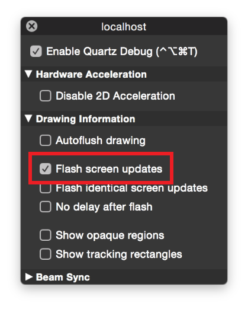

> 导航：[总目录](../../../README.md) · [documentation](../../../_indexes/documentation.md) · [Energy Efficiency Guide for Mac Apps](index.md)

## Avoid Extraneous Content Updates

If your app uses only standard windows and controls, you probably don’t need to worry much about extraneous updates to content, as the system APIs are designed to maximize energy efficiency. However, if you have custom windows and controls, be sure your drawing code performs efficiently. Your app shouldn’t refresh content unnecessarily, such as when your app is hidden or obscured, or through excessive use of animations.

Every time your app updates (or “draws”) content to screen, it requires the CPU, GPU, and screen to be active. Extraneous or inefficient drawing can pull system resources out of low-power states or prevent them from powering down all together, resulting in significant energy use.

### Optimize Content Refreshes

Follow these guidelines to optimize content refreshes:

- Reduce the number of views your app uses.
- Reduce the use of opacity, such as in views that exhibit a translucent blur. If you need to use opacity, avoid using it over content that changes frequently. Otherwise, energy cost is magnified, as both the background view and the translucent view must be updated whenever content changes.
- Draw to smaller portions of the screen—only the portions that are changing. To do this, use [needsToDrawRect:](https://developer.apple.com/documentation/appkit/nsview/1483570-needstodrawrect) or [getRectsBeingDrawn:count:](https://developer.apple.com/documentation/appkit/nsview/1483772-getrectsbeingdrawn) to identify the specific area to update, and pass the result to [drawRect:](https://developer.apple.com/documentation/appkit/nsview/1483686-draw).
- Eliminate drawing when your app or its content is not visible, such as when your app's content is obscured by other views, clipped, or offscreen.
- Eliminate drawing during window resizing.

If your app uses Auto Layout:

- Don’t create redundant constraints.
- Don’t remove and add constraints needlessly. Keep track of constraints you need to change with instance variables (`ivars`).
- If you need to modify constraints, try to set things up to change only the constraints’ constants (instead of changing whole constraints).

For guidelines on updating content efficiently, see _[Drawing Performance Guidelines](../Drawing%20Performance%20Guidelines/Introduction%20to%20Drawing%20Performance%20Guidelines.md#apple-f4xwc4dqnrsv64tfmyxwi33df52wszbpgeydambqge2tc2i)_, as well as [Optimizing View Drawing](https://developer.apple.com/library/archive/documentation/Cocoa/Conceptual/CocoaViewsGuide/Optimizing/Optimizing.html#//apple_ref/doc/uid/TP40002978-CH11) in _[View Programming Guide](../../Cocoa/View%20Programming%20Guide/Introduction%20to%20View%20Programming%20Guide%20for%20Cocoa.md#apple-f4xwc4dqnrsv64tfmyxwi33df52wszbpkridimbqgazdsnzy)_.

### Detect Extraneous Updates

The Quartz Debug utility is part of the Graphics Tools for Xcode package, available in the [Downloads section](https://developer.apple.com/downloads/index.action) of the Developer site. This utility helps you debug graphics-related issues in your apps. One feature identifies areas of the screen that are about to be updated by painting them yellow. After a brief pause, the screen update occurs. By enabling this feature and monitoring your app, you can identify views that are updating unexpectedly.

__To enable view debugging in the Quartz Debug app__

1. Launch Quartz Debug.
2. Press Command-1 or choose Window > Quartz Debug Settings.
3. Select the Enable Quartz Debug checkbox.
4. Select the “Flash screen updates” checkbox.

   

Immediately, yellow rectangles begin flashing over any portions of the screen that are about to be updated. When you’re done, quit Quartz Debug or deselect the “Flash screen updates” checkbox to turn this feature off.

[Minimize Timer Usage](Timers.md#apple-f4xwc4dqnrsv64tfmyxwi33df52wszbpkridimbqgeztsmrzfvbuqnjnknltc)

[Prioritize Work at the App Level](PrioritizeWorkAtTheAppLevel.md#apple-f4xwc4dqnrsv64tfmyxwi33df52wszbpkridimbqgeztsmrzfvbuqmzwfvjvomi)
