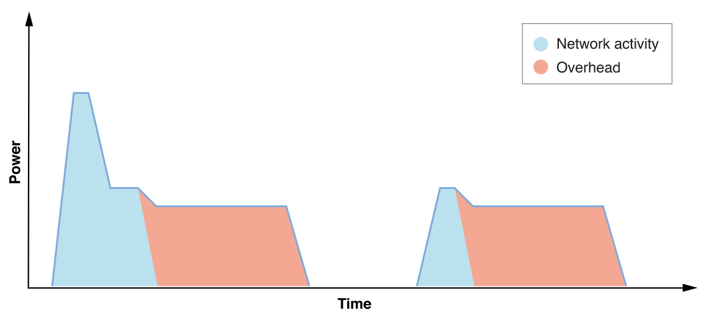

> 导航：[总目录](../../../README.md) · [documentation](../../../_indexes/documentation.md) · [Energy Efficiency Guide for iOS Apps](index.md)

## Energy and Networking

Almost all iOS apps perform network operations of some kind, and it’s essential that networking be employed efficiently. This means eliminating overhead cost whenever possible by reducing and scheduling transactions, and using efficient APIs.

> [!NOTE]
> 

### Device Networking Overhead

Whenever your app performs network operations, there is substantial overhead cost involved. Networking hardware, such as cellular and Wi-Fi radios, are powered down by default to conserve battery. These resources must be powered up to perform activity. Then, they remain up for the duration of the activity and for an additional period of time in anticipation of more work. Sporadic network transactions result in high overhead and can quickly deplete the device’s battery. See Figure 8-1.

__Figure 8-1__Example of overhead due to recurring network activity

### Networking Variable Effect on Energy

A variety of factors affect the amount of energy required to perform network operations on a device.

- Cellular network activity requires significantly more energy than activity over Wi-Fi.
- Poor or fluctuating signal conditions may result in slower or problematic transactions, which must be retried.
- Low network throughput (bandwidth) means radios have to stay on longer to perform transactions.
- Even geographic location and choice of cellular provider can impact energy consumption, as signal conditions and throughput can vary.

As a result, a device’s technical specs typically provide battery life estimates for a variety of scenarios. For example, the specs for iPhone 6s indicate Internet use of up to 10 hours on 3G and LTE, and 11 hours on Wi-Fi. App usage ultimately determines how much network traffic occurs. The more efficient the network use by apps, the longer the device battery life.

[React to Low Power Mode on iPhones](LowPowerMode.md#apple-f4xwc4dqnrsv64tfmyxwi33df52wszbpkridimbqge2tenbtfvbuqmzrfvjvomi)

[Minimize Networking](MinimizeNetworking.md#apple-f4xwc4dqnrsv64tfmyxwi33df52wszbpkridimbqge2tenbtfvbuqmjxfvjvomi)
