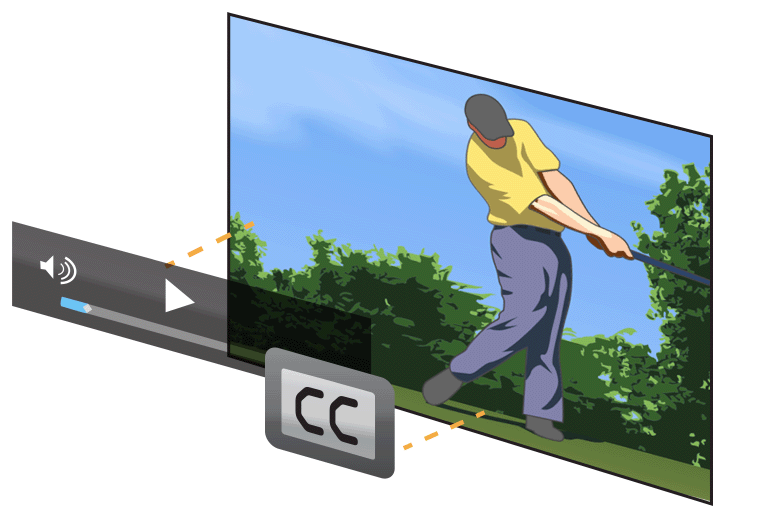

> 导航：[总目录](../../../README.md) · [documentation](../../../_indexes/documentation.md) · [Energy Efficiency Guide for iOS Apps](index.md)

## Restrict UI When Playing Full-Screen Video

iOS is optimized to conserve energy by managing resources efficiently while playing full-screen video. However, additional layers of UI above or below a playing video can degrade this optimization by ramping up additional resources, such as the GPU.

The standard set of video controls provided by the `AVPlayerViewController` class automatically hide during media playback. Apps should avoid adding additional layers (even hidden ones) above full screen video without good reason. Displaying controls and other UI elements over a full-screen video when the user requests them—such as via a tap—is fine and expected behavior. However, these elements should be removed when the user isn’t interacting with them.

> [!NOTE]
> 

[Avoid Extraneous Graphics and Animations](AvoidExtraneousGraphicsAndAnimations.md#apple-f4xwc4dqnrsv64tfmyxwi33df52wszbpkridimbqge2tenbtfvbuqmjzfvjvomi)

[Reduce Location Accuracy and Duration](LocationBestPractices.md#apple-f4xwc4dqnrsv64tfmyxwi33df52wszbpkridimbqge2tenbtfvbuqmrufvjvomi)
