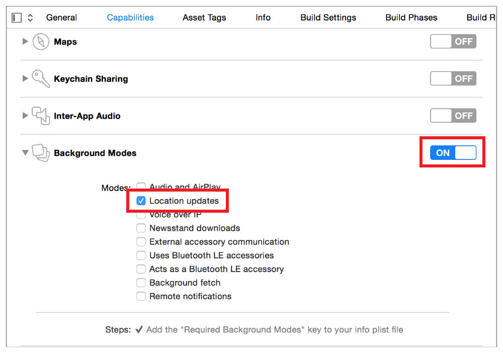

> 导航：[总目录](../../../README.md) · [documentation](../../../_indexes/documentation.md) · [Energy Efficiency Guide for iOS Apps](index.md)

## Reduce Location Accuracy and Duration

Using location-based information in your app is a great way to keep the user connected to the surrounding world. However, improper or unnecessary use of location can prevent the device from sleeping, keep location hardware powered up, drain the user’s battery, and create a poor user experience. Follow best practices to optimize use of location services for energy efficiency.

> [!NOTE]
> 

### Request Quick Location Updates

If your app just needs a quick fix on the user’s location, it’s best to call the `requestLocation` method of the location manager object, as shown in Listing 14-1. Doing so automatically stops location services once the request has been fulfilled, letting location hardware power down if not being used elsewhere. Location updates requested in this manner are delivered by a callback to the [locationManager:didUpdateLocations:](https://developer.apple.com/documentation/corelocation/cllocationmanagerdelegate/1423615-locationmanager) delegate method, which you must implement in your app.

__Listing 14-1__Efficiently requesting a single location update

Objective-C

1. `-(void)viewDidLoad {`
2. `// Create a location manager object`
3. `self.locationManager = [[CLLocationManager alloc] init];`
5. `// Set the delegate`
6. `self.locationManager.delegate = self;`
7. `}`
9. `-(void)getQuickLocationUpdate {`
10. `// Request location authorization`
11. `[self.locationManager requestWhenInUseAuthorization];`
13. `// Request a location update`
14. `[self.locationManager requestLocation];`
15. `// Note: requestLocation may timeout and produce an error if authorization has not yet been granted by the user`
16. `}`
18. `-(void)locationManager:(CLLocationManager *)manager`
19. `didUpdateLocations:(NSArray *)locations {`
20. `// Process the received location update`
21. `}`

Swift

1. `override func viewDidLoad() {`
2. `// Create a location manager object`
3. `self.locationManager = CLLocationManager()`
5. `// Set the delegate`
6. `self.locationManager.delegate = self`
7. `}`
9. `func getQuickLocationUpdate() {`
10. `// Request location authorization`
11. `self.locationManager.requestWhenInUseAuthorization()`
13. `// Request a location update`
14. `self.locationManager.requestLocation()`
15. `// Note: requestLocation may timeout and produce an error if authorization has not yet been granted by the user`
16. `}`
18. `func locationManager(manager: CLLocationManager, didUpdateLocations locations: [CLLocation]) {`
19. `// Process the received location update`
20. `}`

> [!NOTE]
> 

### Stop Location Services When You Aren’t Using Them

With the exception of navigation apps that offer turn-by-turn directions, most apps don’t need location services to be on all the time. Turn location services on only when they’re needed. Then, leave them on just long enough to get a location fix and turn them off again. Unless the user is in a moving vehicle, the current location shouldn’t change frequently enough to be an issue. You can always start location services again later if you need another update.

To stop standard location updates, call the [stopUpdatingLocation](https://developer.apple.com/documentation/corelocation/cllocationmanager/1423695-stopupdatinglocation) method of the location manager object. See Listing 14-2.

__Listing 14-2__Stopping location updates when no longer needed

Objective-C

1. `-(void)getLocationUpdate {`
2. `// Create a location manager object`
3. `self.locationManager = [[CLLocationManager alloc] init];`
5. `// Set the delegate`
6. `self.locationManager.delegate = self;`
8. `// Request location authorization`
9. `[self.locationManager requestWhenInUseAuthorization];`
11. `// Start location updates`
12. `[self.locationManager startUpdatingLocation];`
13. `}`
15. `-(void)locationManager:(CLLocationManager *)manager`
16. `didUpdateLocations:(NSArray *)locations {`
17. `// Get a fix on the user's location`
18. `...`
20. `// Stop location updates`
21. `[self.locationManager stopUpdatingLocation];`
22. `}`

Swift

1. `func getLocationUpdate() {`
2. `// Create a location manager object`
3. `self.locationManager = CLLocationManager()`
5. `// Set the delegate`
6. `self.locationManager.delegate = self`
8. `// Request location authorization`
9. `self.locationManager.requestWhenInUseAuthorization()`
11. `// Start location updates`
12. `self.locationManager.startUpdatingLocation()`
13. `}`
15. `func locationManager(manager: CLLocationManager, didUpdateLocations locations: [CLLocation]) {`
16. `// Get a fix on the user's location`
17. `...`
19. `// Stop location updates`
20. `self.locationManager.stopUpdatingLocation()`
21. `}`

### Reduce Accuracy of Standard Location Updates Whenever Possible

Standard location updates let you specify a degree of accuracy ranging from a few meters to a few kilometers by setting the [desiredAccuracy](https://developer.apple.com/documentation/corelocation/cllocationmanager/1423836-desiredaccuracy) property of the location manager object, as shown in Listing 14-3. Requesting higher accuracy than you need causes Core Location to power up additional hardware and waste power for unnecessary precision. Unless your app _really_ needs to know the user’s position within a few meters, don’t set the accuracy level to best (`kCLLocationAccuracyBest`) or nearest ten meters (`kCLLocationAccuracyNearestTenMeters`). Also, be aware that Core Location typically provides more accurate data than you have requested. For example, when specifying an accuracy level of three kilometers (`kCLLocationAccuracyThreeKilometers`), you may receive accuracy within a hundred meters or so.

> [!IMPORTANT]
> 

__Listing 14-3__Specifying accuracy for location updates

Objective-C

1. `-(void)getLocationUpdate {`
2. `// Create a location manager object`
3. `self.locationManager = [[CLLocationManager alloc] init];`
5. `// Set the delegate`
6. `self.locationManager.delegate = self;`
8. `// Request location authorization`
9. `[self.locationManager requestWhenInUseAuthorization];`
11. `// Set an accuracy level. The higher, the better for energy.`
12. `self.locationManager.desiredAccuracy = kCLLocationAccuracyThreeKilometers;`
14. `// Start location updates`
15. `[self.locationManager startUpdatingLocation];`
16. `}`

Swift

1. `func getLocationUpdate() {`
2. `// Create a location manager object`
3. `self.locationManager = CLLocationManager()`
5. `// Set the delegate`
6. `self.locationManager.delegate = self`
8. `// Request location authorization`
9. `self.locationManager.requestWhenInUseAuthorization()`
11. `// Set an accuracy level. The higher, the better for energy.`
12. `self.locationManager.desiredAccuracy = kCLLocationAccuracyThreeKilometers`
14. `// Start location updates`
15. `self.locationManager.startUpdatingLocation()`
16. `}`

### Stop Location Updates if Accuracy Doesn’t Match Expectations

If your app isn’t receiving updates with the expected level of accuracy, your app should examine the updates it is receiving and determine whether accuracy is improving or staying about the same over time. If accuracy isn’t improving, it’s possible that the desired level of accuracy simply isn’t available at the moment. In this case, stop location updates and try again later so your app doesn’t continuously cause location hardware to draw power.

### Auto-Pause and Specify an Activity Type When Receiving Location Updates in the Background

If your iOS app must continue monitoring location while it’s in the background, enable background mode in the Xcode Project > Capabilities pane. Select the checkbox for Location updates, as shown in Figure 14-1.

__Figure 14-1__Enabling background location updates in an app

In iOS 9 and later, regardless of deployment target, you must also set the [allowsBackgroundLocationUpdates](https://developer.apple.com/documentation/corelocation/cllocationmanager/1620568-allowsbackgroundlocationupdates) property of the location manager object to `YES``true` in order to receive background location updates. By default, this property is `NO``false`, and it should remain this way until a time when your app actively requires background location updates.

Make sure the location manager object’s [pausesLocationUpdatesAutomatically](https://developer.apple.com/documentation/corelocation/cllocationmanager/1620553-pauseslocationupdatesautomatical) property is set to `YES``true` to help conserve power.

Set the `activityType` property to let Core Location know what type of location activity your app is performing at a given time—for example, if your app is performing fitness tracking or automotive navigation. See [CLActivityType](https://developer.apple.com/documentation/corelocation/clactivitytype) for a list of activity types.

Specifying these settings helps the location manager determine the most appropriate time to perform location updates. For example, background location updates may be auto-paused if the system determines that the user isn’t moving.

See Listing 14-4.

> [!IMPORTANT]
> 

__Listing 14-4__Enabling auto-pause and classifying activity type for background location updates

Objective-C

1. `-(void)startBackgroundLocationUpdates {`
2. `// Create a location manager object`
3. `self.locationManager = [[CLLocationManager alloc] init];`
5. `// Set the delegate`
6. `self.locationManager.delegate = self;`
8. `// Request location authorization`
9. `[self.locationManager requestWhenInUseAuthorization];`
11. `// Set an accuracy level. The higher, the better for energy.`
12. `self.locationManager.desiredAccuracy = kCLLocationAccuracyThreeKilometers;`
14. `// Enable automatic pausing`
15. `self.locationManager.pausesLocationUpdatesAutomatically = YES;`
17. `// Specify the type of activity your app is currently performing`
18. `self.locationManager.activityType = CLActivityTypeFitness;`
20. `// Enable background location updates`
21. `self.locationManager.allowsBackgroundLocationUpdates = YES;`
23. `// Start location updates`
24. `[self.locationManager startUpdatingLocation];`
25. `}`
27. `-(void)locationManager:(CLLocationManager *)manager`
28. `didUpdateLocations:(NSArray *)locations {`
29. `// Perform location-based activity`
30. `...`
32. `// Stop location updates when they aren't needed anymore`
33. `[self.locationManager stopUpdatingLocation];`
35. `// Disable background location updates when they aren't needed anymore`
36. `self.locationManager.allowsBackgroundLocationUpdates = NO;`
37. `}`

Swift

1. `func startBackgroundLocationUpdates() {`
2. `// Create a location manager object`
3. `self.locationManager = CLLocationManager()`
5. `// Set the delegate`
6. `self.locationManager.delegate = self`
8. `// Request location authorization`
9. `self.locationManager.requestWhenInUseAuthorization()`
11. `// Set an accuracy level. The higher, the better for energy.`
12. `self.locationManager.desiredAccuracy = kCLLocationAccuracyThreeKilometers`
14. `// Enable automatic pausing`
15. `self.locationManager.pausesLocationUpdatesAutomatically = true`
17. `// Specify the type of activity your app is currently performing`
18. `self.locationManager.activityType = CLActivityTypeFitness`
20. `// Enable background location updates`
21. `self.locationManager.allowsBackgroundLocationUpdates = true`
23. `// Start location updates`
24. `self.locationManager.startUpdatingLocation()`
25. `}`
27. `func locationManager(manager: CLLocationManager, didUpdateLocations locations: [CLLocation]) {`
28. `// Perform location-based activity`
29. `...`
31. `// Stop location updates when they aren't needed anymore`
32. `self.locationManager.stopUpdatingLocation()`
34. `// Disable background location updates when they aren't needed anymore`
35. `self.locationManager.allowsBackgroundLocationUpdates = false`
36. `}`

### Defer Location Updates When Running in the Background

On supported devices with GPS hardware, you can let the location manager defer the delivery of location updates when your app is in the background. For example, a fitness app that tracks the user’s location on a hiking trail can defer updates until the user has moved a certain distance or a certain period of time has elapsed. Then, it can process the updates all at once. You can use [deferredLocationUpdatesAvailable](https://developer.apple.com/documentation/corelocation/cllocationmanager/1423830-deferredlocationupdatesavailable) to determine if a device supports deferred location updates.

To defer updates, call the location manager object’s [allowDeferredLocationUpdatesUntilTraveled:timeout:](https://developer.apple.com/documentation/corelocation/cllocationmanager/1620547-allowdeferredlocationupdatesunti) method and pass it a distance and time that may elapse before the next location update is received. This method is typically called in the [locationManager:didUpdateLocations:](https://developer.apple.com/documentation/corelocation/cllocationmanagerdelegate/1423615-locationmanager) delegate method in order to defer again, if appropriate, when a deferred location update is received.

When a deferred location update is received, the [locationManager:didFinishDeferredUpdatesWithError:](https://developer.apple.com/documentation/corelocation/cllocationmanagerdelegate/1423537-locationmanager) delegate method is also called, and your app can use this as an opportunity to adjust behavior accordingly—such as increasing or decreasing the deferral distance and time—for the next update. See Listing 14-5.

__Listing 14-5__Deferring background location updates based on distance and time

Objective-C

1. `-(void)startHikeLocationUpdates {`
2. `// Create a location manager object`
3. `self.locationManager = [[CLLocationManager alloc] init];`
5. `// Set the delegate`
6. `self.locationManager.delegate = self;`
8. `// Request location authorization`
9. `[self.locationManager requestWhenInUseAuthorization];`
11. `// Specify the type of activity your app is currently performing`
12. `self.locationManager.activityType = CLActivityTypeFitness;`
14. `// Start location updates`
15. `[self.locationManager startUpdatingLocation];`
16. `}`
18. `-(void)locationManager:(CLLocationManager *)manager`
19. `didUpdateLocations:(NSArray *)locations {`
20. `// Add the new locations to the hike`
21. `[self.hike addLocations:locations];`
23. `// Defer updates until the user hikes a certain distance or a period of time has passed`
24. `if (!self.deferringUpdates) {`
25. `CLLocationDistance distance = self.hike.goal - self.hike.distance;`
26. `NSTimeInterval time = [self.nextUpdate timeIntervalSinceNow];`
27. `[self.locationManager allowDeferredLocationUpdatesUntilTraveled:distance timeout:time];`
28. `self.deferringUpdates = YES;`
29. `} }`
31. `-(void)locationManager:(CLLocationManager *)manager`
32. `didFinishDeferredUpdatesWithError:(NSError *)error {`
33. `// Stop deferring updates`
34. `self.deferringUpdates = NO;`
36. `// Adjust for the next goal`
37. `}`

Swift

1. `func startHikeLocationUpdates() {`
2. `// Create a location manager object`
3. `self.locationManager = CLLocationManager()`
5. `// Set the delegate`
6. `self.locationManager.delegate = self`
8. `// Request location authorization`
9. `self.locationManager.requestWhenInUseAuthorization()`
11. `// Specify the type of activity your app is currently performing`
12. `self.locationManager.activityType = CLActivityTypeFitness`
14. `// Start location updates`
15. `self.locationManager.startUpdatingLocation()`
16. `}`
18. `func locationManager(manager: CLLocationManager, didUpdateLocations locations: [CLLocation]) {`
19. `// Add the new locations to the hike`
20. `self.hike.addLocations(locations)`
22. `// Defer updates until the user hikes a certain distance or a period of time has passed`
23. `if (!deferringUpdates) {`
24. `distance: CLLocationDistance = hike.goal - hike.distance`
25. `time: NSTimeInterval = nextUpdate.timeIntervalSinceNow()`
26. `locationManager.allowDeferredLocationUpdatesUntilTraveled(distance, timeout:time)`
27. `deferringUpdates = true;`
28. `} }`
30. `func locationManager(manager: CLLocationManager, didFinishDeferredUpdatesWithError error: NSError!) {`
31. `// Stop deferring updates`
32. `self.deferringUpdates = false`
34. `// Adjust for the next goal`
35. `}`

### Restrict Location Updates to Specific Regions or Locations

Some apps don’t need to receive continuous location updates, and just need to know when the user is within a certain distance of a location. For example, a grocery app may display new coupons whenever the user nears the store. There are several Core Location APIs that can keep your app informed.

> [!NOTE]
> 

### Region and Beacon Monitoring

Core Location provides two methods for detecting a user’s entry to and exit from specific regions.

- Geographical region monitoring provides entry and exit notifications for a specified location on the Earth.
- Beacon monitoring provides entry and exit notifications when the user is within range of low-powered Bluetooth devices that are advertising iBeacon information.

For detailed information on using these techniques, see [Region Monitoring and iBeacon](https://developer.apple.com/library/archive/documentation/UserExperience/Conceptual/LocationAwarenessPG/RegionMonitoring/RegionMonitoring.html#//apple_ref/doc/uid/TP40009497-CH9) in _[Location and Maps Programming Guide](../../User%20Experience/Location%20and%20Maps%20Programming%20Guide/About%20Location%20Services%20and%20Maps.md#apple-f4xwc4dqnrsv64tfmyxwi33df52wszbpkridimbqga4tiojx)_.

### Visit Monitoring

Visit monitoring allows an app to receive entry and exit notifications for specific locations the user visits frequently or for long periods of time such as home, work, or a favorite coffee shop.

To begin monitoring for visits, assign a delegate to the location manager object and call its [startMonitoringVisits](https://developer.apple.com/documentation/corelocation/cllocationmanager/1618692-startmonitoringvisits) method. Note that calling this method enables _all_ visit updates in your app, not just ones for the current delegate. When enabled, visit events are delivered to the [locationManager:didVisit:](https://developer.apple.com/documentation/corelocation/cllocationmanagerdelegate/1621529-locationmanager) method of the delegate. If your app isn’t running when a visit event is delivered, your app is relaunched automatically. When visit location updates are no longer required, call [stopMonitoringVisits](https://developer.apple.com/documentation/corelocation/cllocationmanager/1618693-stopmonitoringvisits), as shown in Listing 14-6.

__Listing 14-6__Using visit monitoring to receive updates tied to a specific location

Objective-C

1. `-(void)startVisitMonitoring {`
2. `// Create a location manager object`
3. `self.locationManager = [[CLLocationManager alloc] init];`
5. `// Set the delegate`
6. `self.locationManager.delegate = self;`
8. `// Request location authorization`
9. `[self.locationManager requestAlwaysAuthorization];`
11. `// Start monitoring for visits`
12. `[self.locationManager startMonitoringVisits];`
13. `}`
15. `-(void)stopVisitMonitoring {`
16. `[self.locationManager stopMonitoringVisits];`
17. `}`
19. `-(void)locationManager:(CLLocationManager *)manager didVisit:(CLVisit *)visit {`
20. `// Perform location-based activity`
21. `...`
22. `}`

Swift

1. `func startVisitMonitoring() {`
2. `// Create a location manager object`
3. `self.locationManager = CLLocationManager()`
5. `// Set the delegate`
6. `self.locationManager.delegate = self`
8. `// Request location authorization`
9. `self.locationManager.requestAlwaysAuthorization()`
11. `// Start monitoring for visits`
12. `self.locationManager.startMonitoringVisits()`
13. `}`
15. `func stopVisitMonitoring() {`
16. `self.locationManager.stopMonitoringVisits()`
17. `}`
19. `func locationManager(manager: CLLocationManager, didVisit visit: CLVisit!) {`
20. `// Perform location-based activity`
21. `...`
22. `}`

### Register for Significant-Change Location Updates Only as a Last Resort

If GPS-level accuracy isn’t critical for your app, you don’t need continuous tracking, and region or visit monitoring isn’t more appropriate for your app, you can use the significant-change location service instead of the standard one.

> [!IMPORTANT]
> 

To start significant-change location updates, call the [startMonitoringSignificantLocationChanges](https://developer.apple.com/documentation/corelocation/cllocationmanager/1423531-startmonitoringsignificantlocati) method of the location manager object. When you’re done, call [stopMonitoringSignificantLocationChanges](https://developer.apple.com/documentation/corelocation/cllocationmanager/1423679-stopmonitoringsignificantlocatio), as shown in Listing 14-7.

> [!NOTE]
> 

__Listing 14-7__Requesting significant-change location updates

Objective-C

1. `-(void)startSignificantChangeLocationUpdates {`
2. `// Create a location manager object`
3. `self.locationManager = [[CLLocationManager alloc] init];`
5. `// Set the delegate`
6. `self.locationManager.delegate = self;`
8. `// Request location authorization`
9. `[self.locationManager requestAlwaysAuthorization];`
11. `// Start significant-change location updates`
12. `[self.locationManager startMonitoringSignificantLocationChanges];`
13. `}`
15. `-(void)locationManager:(CLLocationManager *)manager didUpdateLocations:(NSArray *)locations {`
16. `// Perform location-based activity`
17. `...`
19. `// Stop significant-change location updates when they aren't needed anymore`
20. `[self.locationManager stopMonitoringSignificantLocationChanges];`
21. `}`

Swift

1. `func startSignificantChangeLocationUpdates() {`
2. `// Create a location manager object`
3. `self.locationManager = CLLocationManager()`
5. `// Set the delegate`
6. `self.locationManager.delegate = self`
8. `// Request location authorization`
9. `self.locationManager.requestAlwaysAuthorization()`
11. `// Start significant-change location updates`
12. `self.locationManager.startMonitoringSignificantLocationChanges()`
13. `}`
15. `func locationManager(manager: CLLocationManager, didFinishDeferredUpdatesWithError error: NSError!) {`
16. `// Perform location-based activity`
17. `...`
19. `// Stop significant-change location updates when they aren't needed anymore`
20. `self.locationManager.stopMonitoringSignificantLocationChanges()`
21. `}`

[Restrict UI When Playing Full-Screen Video](HideControlsInFullScreenVideo.md#apple-f4xwc4dqnrsv64tfmyxwi33df52wszbpkridimbqge2tenbtfvbuqmrqfvjvomi)

[Reduce the Frequency of Motion Updates](MotionBestPractices.md#apple-f4xwc4dqnrsv64tfmyxwi33df52wszbpkridimbqge2tenbtfvbuqmzyfvjvomi)
