> 导航：[总目录](../../../README.md) · [documentation](../../../_indexes/documentation.md) · [Energy Efficiency Guide for iOS Apps](index.md)

## Measure Energy Impact with Instruments

> [!IMPORTANT]
> 

The Instruments app, which is included with Xcode, gathers data from your running app and presents it in a graphical timeline. You gather data about performance areas such as your app’s CPU usage, disk activity, network activity, and graphics operations. By viewing the data together, you can analyze different aspects of your app’s performance to identify potential areas of improvement.

> [!NOTE]
> 

### Use the Energy Diagnostics Profiling Template

The Energy Diagnostics profiling template monitors factors that affect energy usage on an iOS device, including CPU activity, network activity, screen brightness, and more. Identify the areas where usage is highest, and see if you can reduce impact in those areas. For example, you might find opportunities to defer discretionary or network tasks until more energy efficient times, such as when the device is plugged in or on Wi-Fi.

__To monitor the energy impact of an app__

1. Launch Instruments and create a new trace document that targets your device and app with the Energy Diagnostics profiling template.

   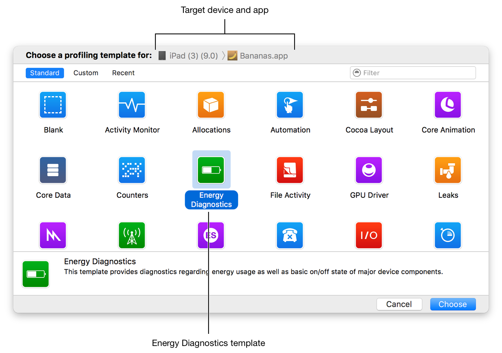
2. Click the Record button () or press Command-R to begin recording a trace.

   > [!TIP]
   > 
3. Use the app normally on the device, while allowing energy data to be collected.
4. Click the Stop button () or press Command-R again when complete.
5. Go through the collected data and look for spikes or areas of otherwise unusual or unexpected activity. Then, review the code in these areas to determine whether improvements can be made.

   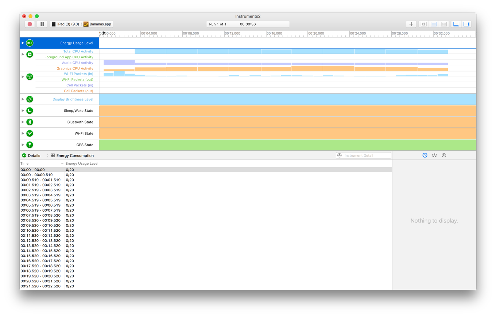

> [!TIP]
> 

### Log Energy Usage Directly on an iOS Device

Without tethering your device to Instruments (either wirelessly or wired), you can log energy-related data under normal use in order to take realistic measurements. With energy logging enabled, your iOS device records energy-related data unobtrusively while the device is used. Because logging is efficient, you can log all day. Logging continues even while the device is in sleep mode. However, if the device’s battery drains completely or the iOS device is powered off, the log data is lost.

__To log energy data in iOS__

1. Go to Settings > Developer > Logging on your device.

   > [!NOTE]
   > 

   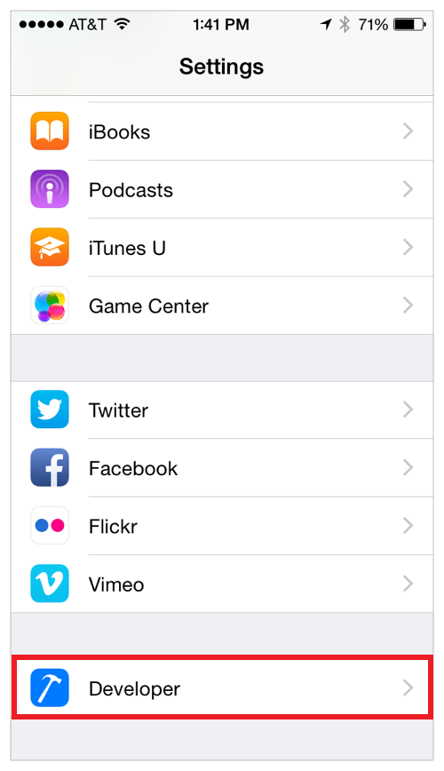

   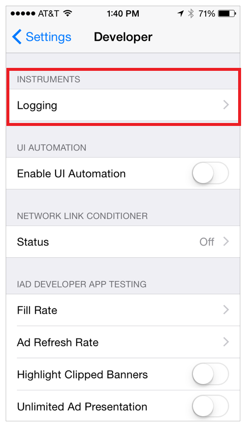
2. Enable energy logging.

   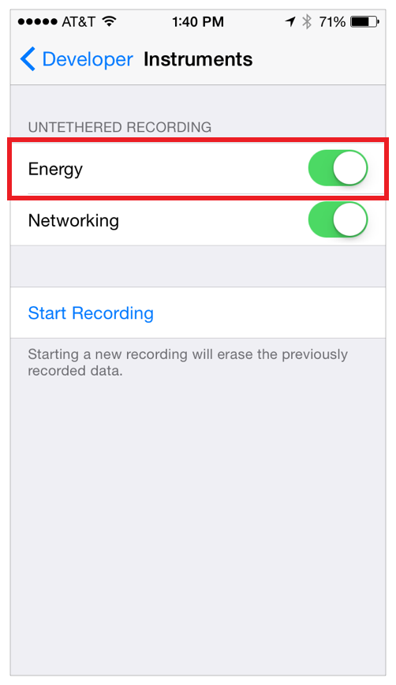
3. Tap Start Recording.

   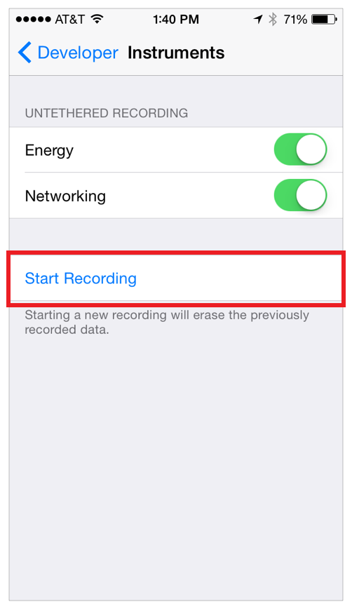
4. Use your device normally.
5. When you’re done, return to Settings > Developer > Logging and tap Stop Recording.

   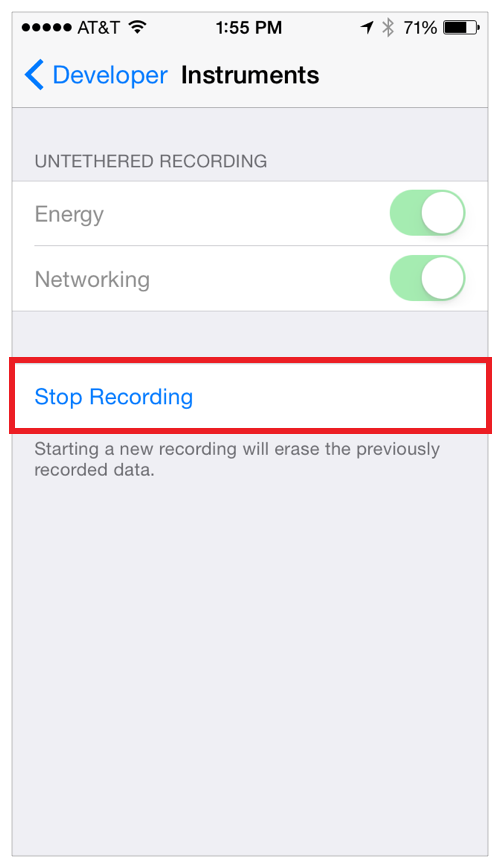

__To import logged energy data from an iOS device__

1. Launch Instruments and create a new trace document that targets your device and app with the Energy Diagnostics profiling template.

   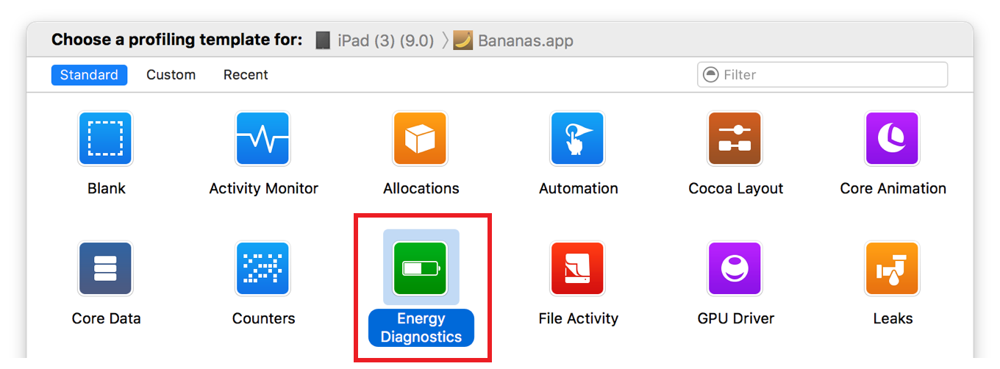
2. Choose File > Import Logged Data from Device.

   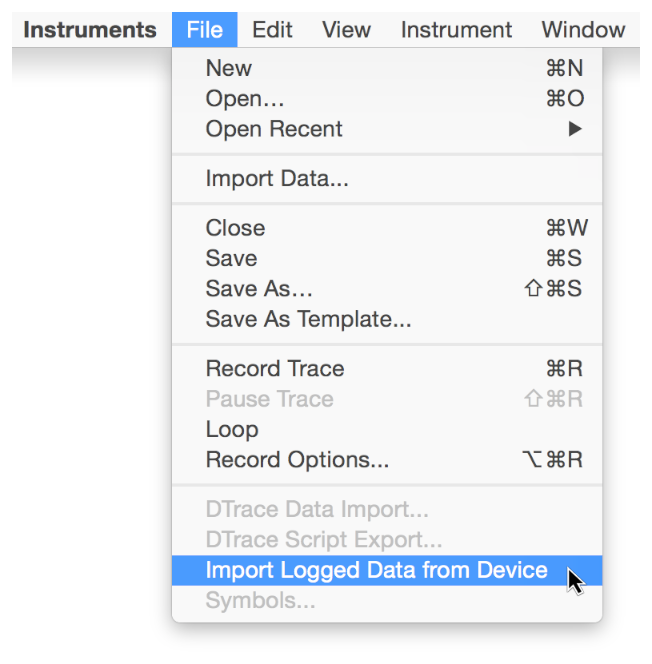

   The logged data is imported and displayed in the timeline and detail panes.

   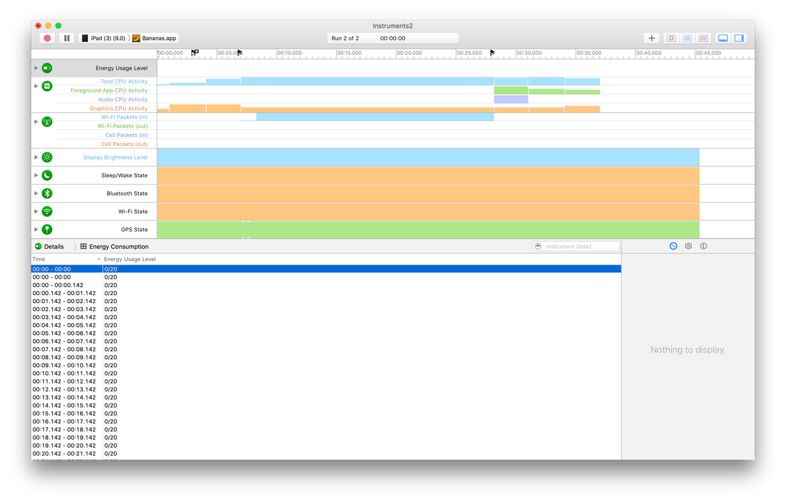

### Use Other Profiling Templates and Instruments to Measure Energy Use

A variety of factors affect the energy used by an iOS app. Although the Energy Diagnostics profiling template analyzes a range of statistics, you can use other profiling templates and instruments to examine and assess your app’s energy impact.

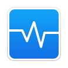

__Activity Monitor Profiling Template.__ Use this template to monitor overall CPU, disk I/O, and network usage.

__Core Animation Profiling Template.__ Use this template to measure graphics performance and CPU usage. Enable the Flash Updated Regions setting of the template’s Core Animation instrument to see each screen update occurring in your app and watch for unnecessary or unexpected updates.

__GPU Driver Profiling Template.__ Use this template to measure GPU driver statistics and sample active CPU usage.

__Location Energy Instrument.__ Use this instrument to measure the energy impact and duration of requests to Core Location.

__Metal System Trace Profiling Template.__ Use this template to measure the performance of iOS Metal applications by tracing information from the application, driver, and GPU layers.

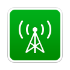

__Network Profiling Template.__ Use this template to analyze the TCP/IP and UDP/IP connections your app uses.

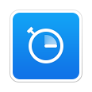

__Time Profiler Profiling Template.__ Use this template to perform low-overhead time-based sampling of running processes. Time Profiler watches the running threads in your app and takes samples at regular intervals. A complete backtrace is collected for each sample, allowing you to drill down into a sample to find exactly where in your code large amounts of time are being spent.

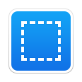

__Your Custom Template Here.__ The templates and instruments above provide high value by analyzing multiple aspects of your app, which may affect energy. If you prefer to focus in on a more specific area, however, you can add individual instruments to the Blank profiling template. For example, you might add the CPU Activity instrument since energy usage is tied closely to how much CPU your app uses over time. If you think you might need to perform the same type of analysis again, be sure and save your configuration as a template. See [Save a Trace Document as a Profiling Template](https://developer.apple.com/library/archive/documentation/DeveloperTools/Conceptual/InstrumentsUserGuide/WorkingwithProfileDocuments.html#//apple_ref/doc/uid/TP40004652-CH9-SW8) in _[Instruments User Guide](https://developer.apple.com/library/archive/documentation/DeveloperTools/Conceptual/InstrumentsUserGuide/index.html#//apple_ref/doc/uid/TP40004652)_.

Again, with all templates and instruments, monitor for spikes or areas of high or unexpected activity, and see whether you can improve those areas to reduce network, CPU, and other resource utilization.

[Measure Energy Impact with Xcode](MonitorEnergyWithXcode.md#apple-f4xwc4dqnrsv64tfmyxwi33df52wszbpkridimbqge2tenbtfvbuqmzufvjvomi)

[Test Performance](TestPerformance.md#apple-f4xwc4dqnrsv64tfmyxwi33df52wszbpkridimbqge2tenbtfvbuqnbqfvjvomq)
