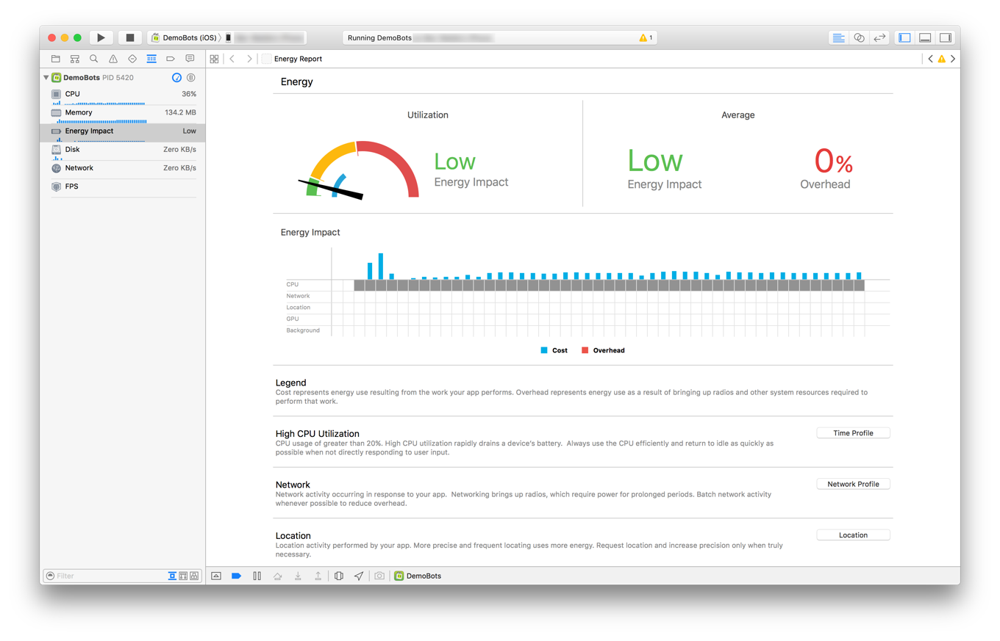
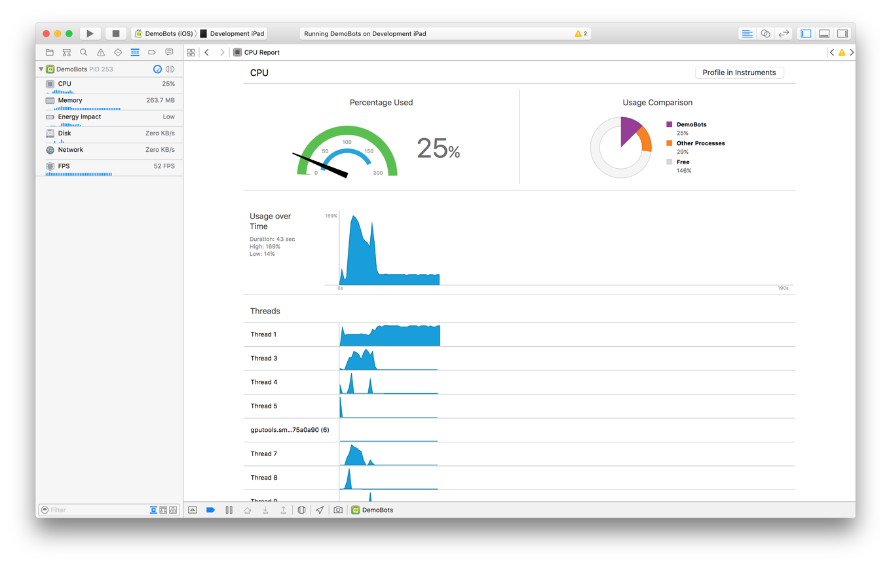
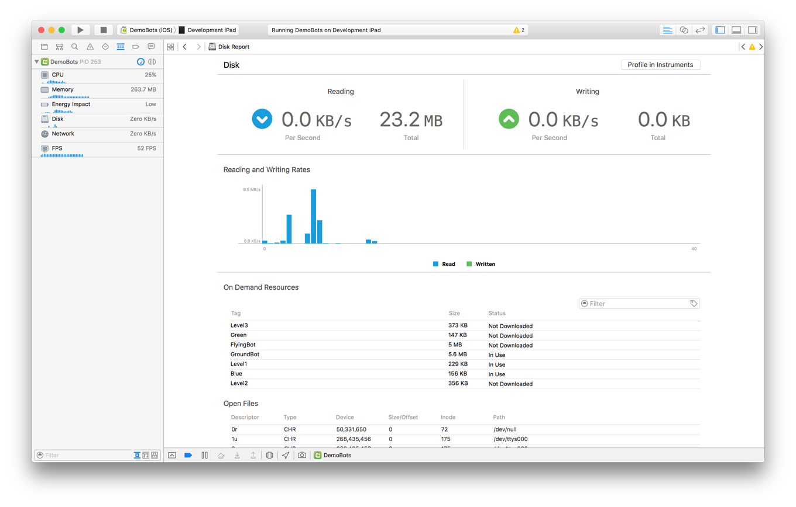
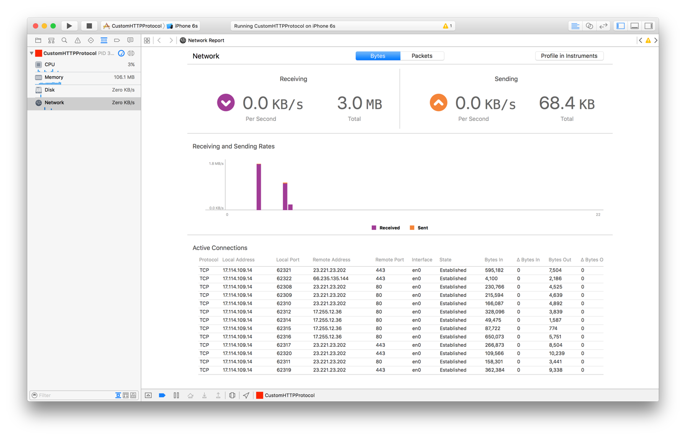

> 导航：[总目录](../../../README.md) · [documentation](../../../_indexes/documentation.md) · [Energy Efficiency Guide for iOS Apps](index.md)

## Measure Energy Impact with Xcode

There’s no better time to diagnose your app’s energy footprint than when you are in the process of developing your app. Xcode includes a number of features that can help.

### Debugging Gauges

The debug navigator in Xcode (choose View > Navigators > Show Debug Navigator) provides a series of gauges that let you analyze the energy impact of your app while testing it within Xcode. These gauges are displayed when your app has been launched by Xcode and is actively running or paused.

- __Energy impact gauge.__ Provides live information about your app’s energy usage as it runs, and displays a graph of recent energy-related activity. The following areas are represented by the gauge in an Energy Impact table.

  - _Cost and overhead._ Blue bars illustrate the energy your app itself uses to perform work. Red bars show additional energy used by system resources that must be powered up to perform your app’s work.
  - _CPU._ A gray square in this row indicates that your app has used the CPU to perform work.
  - _Network._ A gray square in this row indicates that your app has performed network operations.
  - _Location._ A gray square in this row indicates that your app has utilized location services.
  - _GPU._ A gray square in this row indicates that your app has used the GPU to perform graphics-related activity, such as drawing content on screen or playing an animation.
  - _Background._ A gray square in this row indicates that your app is in a background state, but is still keeping the system awake.

  Information gathered in all of these areas is used to present an energy rating for your app. When the user interacts with your app, energy impact should be low unless the user has chosen to initiate an intensive operation. When the user isn’t interacting with your app, there should be no energy impact.

  > [!NOTE]
  > 

  __Figure 20-1__The Energy gauge in Xcode
  
- __CPU gauge.__ Monitors your app and reports on its current and historical CPU usage. Spikes that occur when your app is supposed to have low CPU activity or when your app is idle may indicate problem areas where optimizations can be made.

  __Figure 20-2__The CPU gauge in Xcode
  
- __Disk usage gauge.__ Alerts you to disk read and write activity and files your app has opened. Use this gauge to identify unexpected or recurring small I/O activity.

  __Figure 20-3__The disk usage gauge in Xcode
  
- __Network usage gauge.__ Accounts for all inbound and outbound network traffic. Look for discretionary activity that your app performs directly, and consider updating it to be performed by the system at more energy-optimal times.

  __Figure 20-4__The network usage gauge in Xcode
  

> [!TIP]
> 

### Debugging

Knowing how to test and debug your app can go a long way toward helping you identify potential energy problems and areas for improvement. See _[Debugging with Xcode](https://developer.apple.com/library/archive/documentation/DeveloperTools/Conceptual/debugging_with_xcode/chapters/about_debugging_w_xcode.html#//apple_ref/doc/uid/TP40015022)_ for common debugging techniques.

Activity tracing also makes finding bugs faster and easier by logging trace messages as your app runs. When a problem occurs, follow these messages to identify the code that produced the failure. For information on activity tracing, see the session _WWDC 2014: Fix Bugs Faster Using Activity Tracing_.

[Observe Signs of Energy Leaks](SignsofEnergyLeaks.md#apple-f4xwc4dqnrsv64tfmyxwi33df52wszbpkridimbqge2tenbtfvbuqmzsfvjvomi)

[Measure Energy Impact with Instruments](MonitorEnergyWithInstruments.md#apple-f4xwc4dqnrsv64tfmyxwi33df52wszbpkridimbqge2tenbtfvbuqmztfvjvomi)
