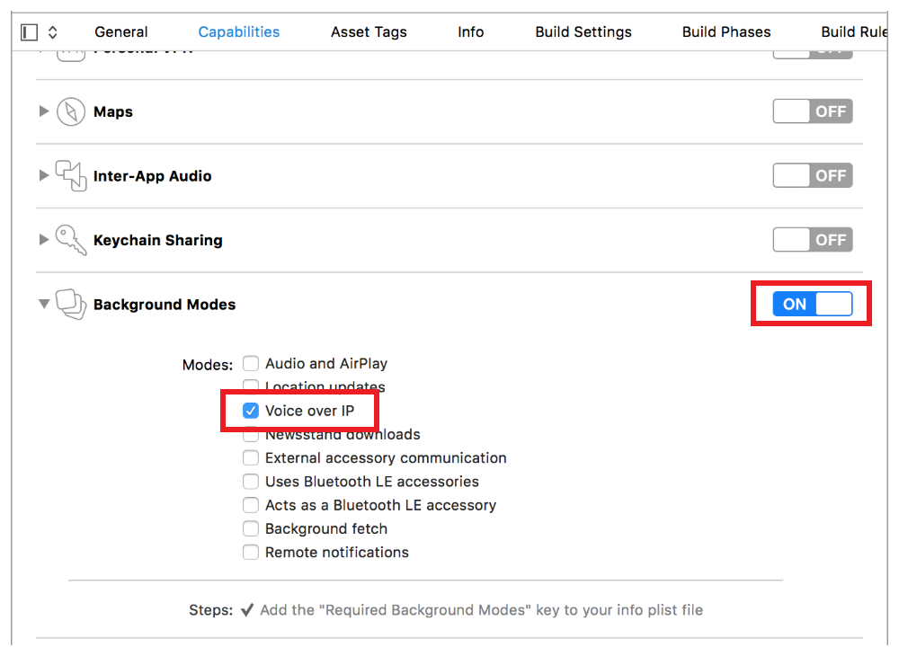
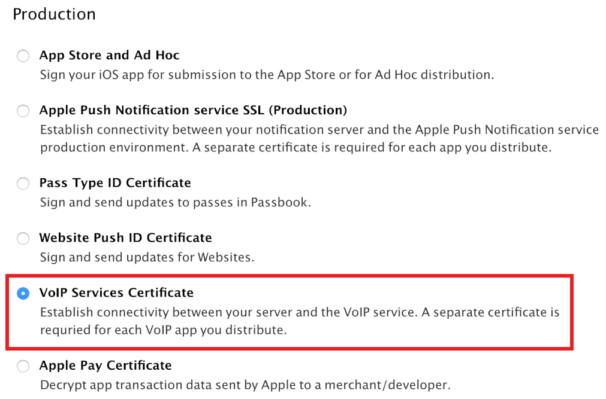

> 导航：[总目录](../../../README.md) · [documentation](../../../_indexes/documentation.md) · [Energy Efficiency Guide for iOS Apps](index.md)

## Voice Over IP (VoIP) Best Practices

A Voice over Internet Protocol (VoIP) app lets the user make and receive phone calls using an Internet connection instead of the device’s cellular service. Because a VoIP app relies heavily on the network, it’s no surprise that making calls results in high energy use. When not in active use, however, a VoIP app should be completely idle to conserve energy.

### Use VoIP Push Notifications to Avoid Persistent Connections

In the past, a VoIP app had to maintain a persistent network connection with a server to receive incoming calls and other data. This meant writing complex code that sent periodic messages back and forth between the app and the server to keep a connection alive, even when the app wasn’t in use. This technique resulted in frequent device wakes that wasted energy. It also meant that if a user quit the VoIP app, calls from the server could no longer be received.

Instead of persistent connections, developers should use the PushKit framework—APIs that allows an app to receive pushes (notifications when data is available) from a remote server. Whenever a push is received, the app is called to action. For example, a VoIP app could display an alert when a call is received, and provide an option to accept or reject the call. It could even begin taking precursory steps to initiate the call, in the event the user decides to accept.

There are many advantages to using PushKit to receive VoIP pushes:

- The device is woken only when VoIP pushes occur, saving energy.
- Unlike standard push notifications, which the user must respond to before your app can perform an action, VoIP pushes go straight to your app for processing.
- VoIP pushes are considered high-priority notifications and are delivered without delay.
- VoIP pushes can include more data than what is provided with standard push notifications.
- Your app is automatically relaunched if it’s not running when a VoIP push is received.
- Your app is given runtime to process a push, even if your app is operating in the background.

> [!NOTE]
> 

### Prepare to Receive VoIP Push Notifications

Like all apps that support background operation, your VoIP app must have background mode enabled in the Xcode Project > Capabilities pane. Select the checkbox for Voice over IP, as shown in Figure 11-1.

__Figure 11-1__Enabling the VoIP background mode in an app

You must also create a certificate for your VoIP app. Each VoIP app requires its own individual VoIP Services certificate, mapped to a unique App ID. This certificate allows your notification server to connect to the VoIP service. Visit the Apple Developer [Member Center](https://developer.apple.com/certificates) and create a new VoIP Services Certificate. See Figure 11-2. Download the certificate and import it into the Keychain Access app.

__Figure 11-2__Creating a VoIP certificate in the Apple Developer Member Center

### Configure VoIP Push Notifications

To configure your app to receive VoIP push notifications, link to the PushKit framework in your app delegate (or some other location in your app). Then, create a `PKPushRegistry` object, set its delegate to `self`, and register to receive VoIP pushes. See Listing 11-1.

__Listing 11-1__Registering for VoIP push notifications

Objective-C

1. `// Link to the PushKit framework`
2. `#import <PushKit/PushKit.h>`
4. `// Trigger VoIP registration on launch`
5. `- (BOOL)application:(UIApplication *)application didFinishLaunchingWithOptions:(NSDictionary *)launchOptions {`
6. `[self voipRegistration];`
7. `return YES;`
8. `}`
10. `// Register for VoIP notifications`
11. `- (void) voipRegistration {`
12. `dispatch_queue_t mainQueue = dispatch_get_main_queue()`
13. `// Create a push registry object`
14. `PKPushRegistry * voipRegistry = [[PKPushRegistry alloc] initWithQueue: mainQueue];`
15. `// Set the registry's delegate to self`
16. `voipRegistry.delegate = self;`
17. `// Set the push type to VoIP`
18. `voipRegistry.desiredPushTypes = [NSSet setWithObject:PKPushTypeVoIP];`
19. `}`

Swift

1. `// Link to the PushKit framework`
2. `import PushKit`
4. `// Trigger VoIP registration on launch`
5. `func application(application: UIApplication, didFinishLaunchingWithOptions launchOptions: NSDictionary?) -> Bool {`
6. `self.voipRegistration()`
7. `return true`
8. `}`
10. `// Register for VoIP notifications`
11. `func voipRegistration {`
12. `let mainQueue = dispatch_get_main_queue()`
13. `// Create a push registry object`
14. `let voipRegistry: PKPushRegistry = PKPushRegistry(mainQueue)`
15. `// Set the registry's delegate to self`
16. `voipRegistry.delegate = self`
17. `// Set the push type to VoIP`
18. `voipRegistry.desiredPushTypes = [PKPushTypeVoIP]`
19. `}`

Next, implement a delegate method to handle updated push credentials. If your app receives both standard push notifications and VoIP pushes, then your app will receive two separate push tokens. Both tokens must be passed to the server in order to receive notifications. See Listing 11-2.

__Listing 11-2__Handling updated push notification credentials

Objective-C

1. `// Handle updated push credentials`
2. `- (void)pushRegistry:(PKPushRegistry *)registry didUpdatePushCredentials: (PKPushCredentials *)credentials forType:(NSString *)type {`
3. `// Register VoIP push token (a property of PKPushCredentials) with server`
4. `}`

Swift

1. `// Handle updated push credentials`
2. `func pushRegistry(registry: PKPushRegistry!, didUpdatePushCredentials credentials: PKPushCredentials!, forType type: String!) {`
3. `// Register VoIP push token (a property of PKPushCredentials) with server`
4. `}`

Finally, set up a delegate method to process pushes. If your app isn’t running when the push is received, your app will be launched automatically. See Listing 11-3.

__Listing 11-3__Handling incoming push notifications

Objective-C

1. `// Handle incoming pushes`
2. `- (void)pushRegistry:(PKPushRegistry *)registry didReceiveIncomingPushWithPayload:(PKPushPayload *)payload forType:(NSString *)type {`
3. `// Process the received push`
4. `}`

Swift

1. `// Handle incoming pushes`
2. `func pushRegistry(registry: PKPushRegistry!, didReceiveIncomingPushWithPayload payload: PKPushPayload!, forType type: String!) {`
3. `// Process the received push`
4. `}`

> [!NOTE]
> 

[Defer Networking](DeferNetworking.md#apple-f4xwc4dqnrsv64tfmyxwi33df52wszbpkridimbqge2tenbtfvbuqmjyfvjvomi)

[Avoid Extraneous Graphics and Animations](AvoidExtraneousGraphicsAndAnimations.md#apple-f4xwc4dqnrsv64tfmyxwi33df52wszbpkridimbqge2tenbtfvbuqmjzfvjvomi)
