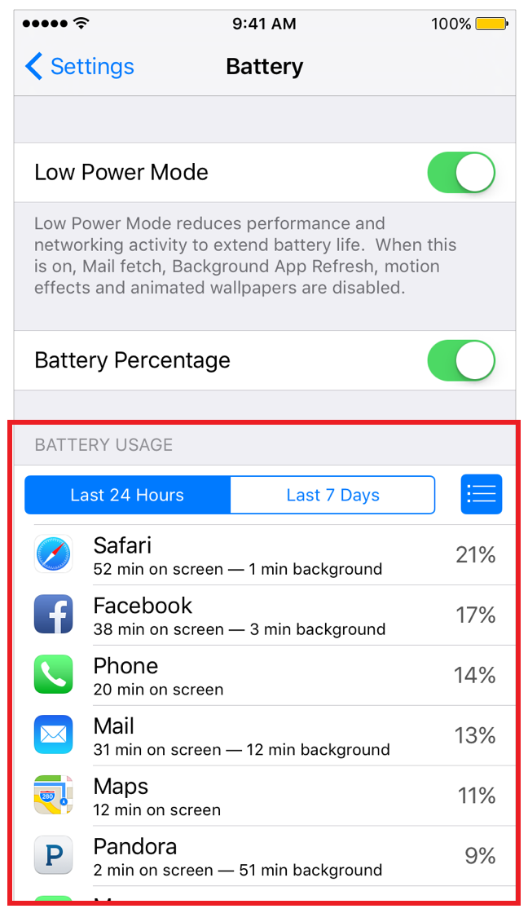

> 导航：[总目录](../../../README.md) · [documentation](../../../_indexes/documentation.md) · [Energy Efficiency Guide for iOS Apps](index.md)

## Observe Signs of Energy Leaks

When testing and debugging your app, watch for these signs of excessive energy use:

- Battery drain
- Activity when you expect your app to be idle
- An unresponsive or slow user interface
- Large amounts of work on the main thread
- High use of animations
- High use of view opacity
- Swapping
- Memory stalls and cache misses
- Memory warnings
- Lock contention
- Excessive context switches
- Excessive use of timers
- Excessive drawing to screen
- Excessive or repeated small disk I/O
- High-overhead communication, such as network activity with small packets and buffers
- Preventing device sleep

### See Which Apps Use Energy on a Device

Users can manage certain energy-related factors, such as screen brightness and active network hardware, by adjusting their device’s settings. They can also open Settings > Battery to see which apps have consumed the most energy recently. See Figure 19-1.

__Figure 19-1__Battery usage by app in iOS

[Apple Watch Best Practices](AppleWatchExtensionBestPractices.md#apple-f4xwc4dqnrsv64tfmyxwi33df52wszbpkridimbqge2tenbtfvbuqmzwfvjvomi)

[Measure Energy Impact with Xcode](MonitorEnergyWithXcode.md#apple-f4xwc4dqnrsv64tfmyxwi33df52wszbpkridimbqge2tenbtfvbuqmzufvjvomi)
