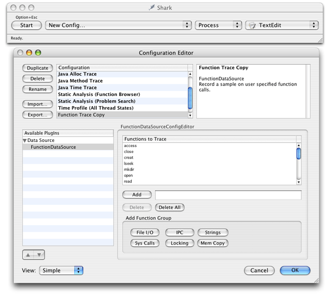
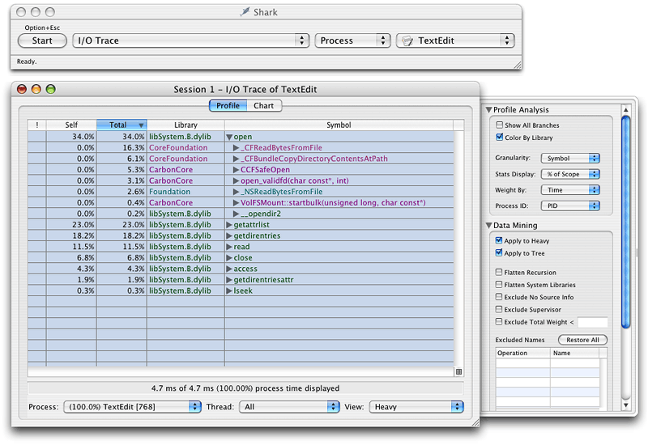
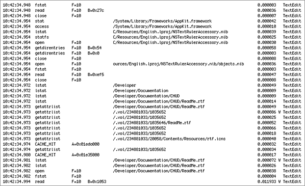

> 导航：[总目录](../../../README.md) · [documentation](../../../_indexes/documentation.md) · [File-System Performance Guidelines](Introduction%20to%20File-System%20Performance%20Guidelines.md)


[Next](Mapping%20Files%20Into%20Memory.md)[Previous](Overview%20of%20OS%20X%20File%20Systems.md)

# Examining File-System Usage

OS X comes with several tools for examining how your application uses the file system. You can sample your application to see what file-system calls it makes. You can watch the file-system calls at the system level and you can examine overall file-system statistics.

As you gather information, consider using multiple tools to gather your data from different angles. Both Shark and `fs_usage` can provide a lot of information about your application’s file-system interactions, but that information is typically very complimentary. Seeing the same behavior in different ways can provide you with better data for isolating the real problems.

The Shark application lets you selectively find out what file system-related function calls your application makes. When you set up your session configuration, you can tell Shark exactly which function calls you want it to watch. You can specify high-level or low-level calls in your application. Shark even defines a set of default POSIX file I/O functions to watch. This list of functions includes `access`, `close`, `creat`, `lseek`, `mkdir`, `open`, `read`, `readv`, `rename`, `rmdir`, `truncate`, `unlink`, `write`, `writev`, `getattrlist`, `setattrlist`, `getdirentries`, and `getdirentriesattr`. A list of system calls includes all the file I/O calls plus `fcntl`, `flock`, `fstat`, `fsync`, `link`, `lstat`, `lstatv`, and `stat`.

Figure 1 shows the Shark Configuration Editor window, which you display by selecting New Config from the sampling configuration popup menu. Before you begin your session, you must create a configuration that includes the functions you want to trace. Once you select the functions, click OK to dismiss the Configuration Editor window. Shark adds your new configuration to the sampling configuration popup menu. Select it and begin sampling.

__Figure 1__  Sampling file I/O with Shark



Disk accesses tend to be slow operations, so minimizing unneeded reads, caching data, or minimizing the number of files examined can improve your application’s performance. When you finish sampling, Shark displays the sample window in heavy view mode to highlight the functions you were tracking (Figure 2). You can expand each function to see the points from which it was called.

__Figure 2__  File I/O samples for TextEdit



Shark does not identify the parameters passed to any functions, nor does it display the time taken by each operation to execute. If you need this sort of information, you should use `fs_usage` in addition to or instead of Shark. See [Analyzing File Interactions in Detail](#apple-f4xwc4dqnrsv64tfmyxwi33df52wszbpgiydambrhe4dsljzg4ytanq) for more details.

The `fs_usage` tool presents an ongoing display of system-call usage statistics related to file-system activity, including page-ins and errors. By default this includes all current processes running on the system, including `fs_usage` itself. However, you can limit the statistics gathering to include or exclude a specified list of processes.

The `fs_usage` tool is well suited for the following operations:

- detecting redundant file operations
- discovering what files your application touches during launch
- discovering which files are taking a long time to read
- discovering where bad file-related calls are being made

You can also use `fs_usage` to identify the file-access patterns used by your application. Examining these patterns might point out places where you could optimize your code’s behavior. For example, a slow-launching application might be trying to read from preferences stored on a network file server. Rather than read the preferences from the server each time, you might decide to cache those preferences locally and write them back to the server as needed.

The `fs_usage` tool formats its output according to the size of your window. A narrow window displays fewer columns of data. Use a wide window for maximum data display. The `-w` parameter forces all columns to be displayed regardless of the size of the window. Figure 3 shows the output of `fs_usage` using the `-w` parameter.

__Figure 3__  Example of “fs_usage -w” output



The `fs_usage` tool continuously generates a large amount of data with millisecond granularity. The output is not updated in place (as with, say, `top`); instead, each new line of data is appended to the existing data. When running `fs_usage` for very brief periods of time or during a very specific activity, viewing the information in the Terminal window is possible but time consuming. In most cases, you will probably want to redirect the output of `fs_usage` to a file so that you can go back and examine it later or run it through a script.

The columns of `fs_usage` output have no headings and are separated by spaces. You can interpret the type of data in each column by its format. [Table 1](#apple-f4xwc4dqnrsv64tfmyxwi33df52wszbpgiydambrhe4dsljrgaytimzzfvbecsscjjcuira) describes these columns. If you run the tool without the `-w` option, some of these columns may be missing.

__Table 1__  Columns of “fs_usage” output

| Column Number | Example | Description |
| 1 | `14:56:52.386` | Timestamp, giving the time of day when the call occurred. In wide mode, this field has millisecond granularity. |
| 2 | `fstat`, `CACHE_HIT`, or `PAGE_IN` | The operation that was detected. Usually, this is the name of a file-system routine or a specific system event, such as a page-in. |
| 3 | `A=0x45e2a000` | Fault address. If the prior column is `CACHE_HIT`, `PAGE_IN` or another system event, this specifies the address being faulted. |
| 3 | `F=58` | File descriptor associated with the call described in the second column (for example, `fstat` or `open`); in this example, `58` is the file descriptor. |
| 4 | `O=0x5000` or `B=0x78` or `[45]` | This column can contain one of three values. It can contain the file offset specified to `lseek` or `ftruncate` (shown as `O=0x5000`). It can contain the number of bytes requested by the call (shown as `B=0x78`). Finally, if the call results in an error, it contains an `errno` value between brackets (see the header file `errno.h` for a list of error codes). |
| 5 | `/Network` | The pathname of the file accessed. This value may be truncated but will always display the end of the pathname. Carbon developers should read Technical Q&A QA1113: [The “/.vol” Directory and “volfs”](https://developer.apple.com/qa/qa2001/qa1113.html) for additional information on how to interpret Carbon File Manager calls. |
| 6 | `0.000459W` | Elapsed time (in microseconds) spent in the system call. A `W` after the time indicates that the process was scheduled out during this file activity (probably because it was waiting for a disk or network I/O operation to complete). In this case, the elapsed time includes the wait time. |
| 7 | `TextEdit` | The name of the executable or application package that made the system call. (Note that Code Fragment Manager applications are named after the native process that launches them, `LaunchCFMApp`.) |

Carbon and Cocoa applications can obtain additional information from `fs_usage` using the `DYLD_IMAGE_SUFFIX` environment variable. Setting this variable to the value “`_debug`“ causes the dynamic linker to use the debug version of the Carbon libraries. Running `fs_usage` against these libraries causes the tool to display the name of the Carbon File Manager routine that was called in addition to the underlying system routine.

The `sc_usage` tool displays an ongoing sample of system statistics for a given process, including the number of system calls and page faults. The tool adds new system calls to the list as they are generated by the application being watched. The counts displayed are both the cumulative totals since `sc_usage` was launched and the delta changes for this sample period. The `sc_usage` tool also displays the following information:

- the amount of CPU time consumed by the process and by each routine
- the absolute time during which the process is waiting
- the cumulative time a thread has been blocked (identified by number)
- the current scheduling priority for the thread
- the number of page-ins, copy-on-write operations, zero-fill faults, and faults that hit in the page cache
- global state, including the number of preemptions, context switches, threads, faults, and system calls found during the sampling period

[Listing 1](#apple-f4xwc4dqnrsv64tfmyxwi33df52wszbpgiydambrhe4dsljrgaytcmrwfvbeeq2jijfekri) shows some sample `sc_usage` output for the TextEdit application.

__Listing 1__  Sample output from sc_usage

```
TextEdit          0 preemptions    0 context switches    1 thread     13:23:55
                  0 faults         0 system calls                      0:00:30

TYPE                            NUMBER        CPU_TIME   WAIT_TIME
------------------------------------------------------------------------------
System         Idle                                      0:05.643( 0:00.965)
System         Busy                                      0:00.285( 0:00.038)
TextEdit       Usermode                       0:00.029

zero_fill                        17           0:00.000   0:00.000

mach_msg_trap                   213           0:00.003   0:02.944( 0:01.003) W
gettimeofday                      4           0:00.000
mk_timer_create                   9           0:00.000
mk_timer_destroy                  9           0:00.000
mk_timer_arm                     19           0:00.000
mk_timer_cancel                   3           0:00.000
mach_port_insert_member          13           0:00.000
mach_port_extract_membe          13           0:00.000
vm_deallocate                    17           0:00.000   0:00.000
```

Be aware that the `mach_msg_trap` kernel routine will always be the system call with the greatest amount of CPU time used. This call indicates that the application is blocked and waiting for something to happen, such as a system event.

[Next](Mapping%20Files%20Into%20Memory.md)[Previous](Overview%20of%20OS%20X%20File%20Systems.md)

