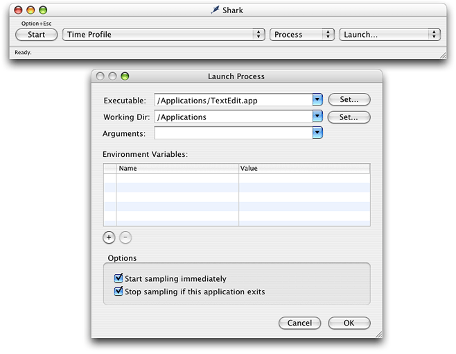

> 导航：[总目录](../../../README.md) · [documentation](../../../_indexes/documentation.md) · [Launch Time Performance Guidelines](Introduction%20to%20Launch%20Time%20Performance%20Guidelines.md)


[Next](Minimizing%20File%20Access%20At%20Launch%20Time.md)[Previous](Launch%20Time%20Tips.md)

# Gathering Launch Time Metrics

The following sections describe some techniques for gathering launch-time performance metrics.

One of the more important measurements you can make during your application launch cycle, is how long it takes before your application is ready to process user commands. The following sections describe several techniques for measuring the launch speed of your application.

One way to gather information about your application’s launch performance is to use checkpoints. Checkpoints let you bracket any block of code you want to monitor with identifying information. In the simplest case, you can insert a checkpoint at the beginning of your `main` function and again right after your initialization code finishes and record the time at which those checkpoints were encountered.

If you need a fine grain view of your application launch, you can write checkpoint code that retrieves the current time from the system and write it to a log file. If you do not need quite so much detail, you can implement a simpler form of checkpoint using file-system calls. In this technique, you call a function that touches the file system and then use `fs_usage` to record the time that call was made.

The following code snippet uses the `stat` system function as a checkpoint to mark the beginning of the launch cycle for the TextEdit application. The function attempts to touch a non-existent file, which in this case is just a string with the name of the checkpoint. The call itself fails but registers as an attempt to access a file and therefore shows up in the output from `fs_usage`.

```
struct stat statbuf;
stat("START:launch TextEdit", &statbuf);
```

With this code inserted into your application, you can then open a Terminal window and launch `fs_usage` with the `-w` option. You might want to redirect the output from `fs_usage` through the `grep` tool to report entries only from your application. For example, to report entries from the TextEdit application, you would use the following command:

```
% sudo fs_usage -w | grep TextEdit
```

With `fs_usage` running, launch your application. In the output from `fs_usage`, look for a `stat` call with the name of your checkpoint. For example, inserting the checkpoint “`START: launch TextEdit`“ at the beginning of the TextEdit application yields output similar to the following:

```
14:13:59.689 stat   [  2]   START:launch TextEdit   0.000081   TextEdit
```

You can then use the timestamp on the left to determine the amount of time elapsed between the two checkpoints. This information tells you the elapsed time taken to execute the code between those two checkpoints.

For more information on using `fs_usage`, see [Using fs_usage to Review File I/O](Minimizing%20File%20Access%20At%20Launch%20Time.md#apple-f4xwc4dqnrsv64tfmyxwi33df52wszbpgiydambrha2toljzg44dkoi).

One way to measure the speed of any operation, including launch times, is to use system routines to get the current time at the beginning and end of the operation. Once you have the two time values, you can take the difference and log the results.

The advantage of this technique is that it lets you measure the duration of specific blocks of code. OS X includes several different ways to get the current time:

- 

  `mach_absolute_time` reads the CPU time base register and is the basis for other time measurement functions.
- 

  The Core Services `UpTime` function provides nanosecond resolution for time measurements.
- 

  The BSD `gettimeofday`function (declared in `<sys/time.h>`)provides microsecond resolution. (Note, this function incurs some overhead but is still accurate for most uses.)
- 

  In Cocoa, you can create an NSDate object with the current time at the beginning of the operation and then use the `timeIntervalSinceDate:` method to get the time difference.

If you are writing a Cocoa application, you can use hooks in the AppKit framework to shutdown your application immediately after it finishes launching. Setting the `NSQuitAfterLaunch` environment variable to any value causes a Cocoa-based application to exit immediately after completing its launch cycle. You can use this variable in conjunction with `fs_usage` to record the initial and final activity times of the application.

Sampling your application launch can identify where your application is spending its time. Sampling records which functions were called at regular intervals during your application’s runtime. Using this data, you can identify operations that might be taking too much time and target them for optimization.

The Shark application provides a graphical interface for gathering call stack data at program launch time. To gather this data, do the following:

1. Launch Shark.
2. Set the sampling configuration to Time Profile.
3. Select Process from the target popup menu. Another popup menu appears with a list of running processes and a “Launch” option. (See Figure 1.)
4. Select the Launch option to display the Launch Process window.
5. From the Launch Process window, select the process you want to launch along with any arguments or environment variables you need to launch the program.
6. Make sure the “Start sampling immediately” check box is enabled.
7. Click OK to dismiss the Launch Process window. Shark immediately launches the selected process and begins sampling.
8. When your application is done launching, click the Stop button (or use the Option+Esc hotkey) to stop sampling and view the results.

__Figure 1__  Sampling the launch of an application with Shark



In addition to gathering sample data, you can also use shark to trace specific function calls, including malloc calls, at launch time. For more information about Shark, see the Shark User Manual.

Another way to gather launch-time performance metrics is to use the `sample` command-line tool. Like Sampler, the `sample` tool periodically samples an application and creates a runtime graph of the functions that were called. You can use the sampled data to see get a more detailed view of what your application was doing during launch.

You must run `sample` with the `-wait` option to generate information for a launching application. The `-wait` option tells `sample` to wait for the existence of the process and to begin sampling it with the specified interval and duration when it appears. For example, you could use the following command to sample the launch of the TextEdit application for 5 seconds at 10 millisecond intervals.

```
sample TextEdit 5 10 -wait
```

When calling the `sample` tool, let the sampled application continue running until the sampling period is over. When the `sample` tool writes out its report, it uses the application’s symbol table to identify the routines that were called. If you quit the application before the sampling period is over, the symbol information may become unavailable. You can also use the `-mayDie` option to try to locate the symbol information explicitly.

[Next](Minimizing%20File%20Access%20At%20Launch%20Time.md)[Previous](Launch%20Time%20Tips.md)

