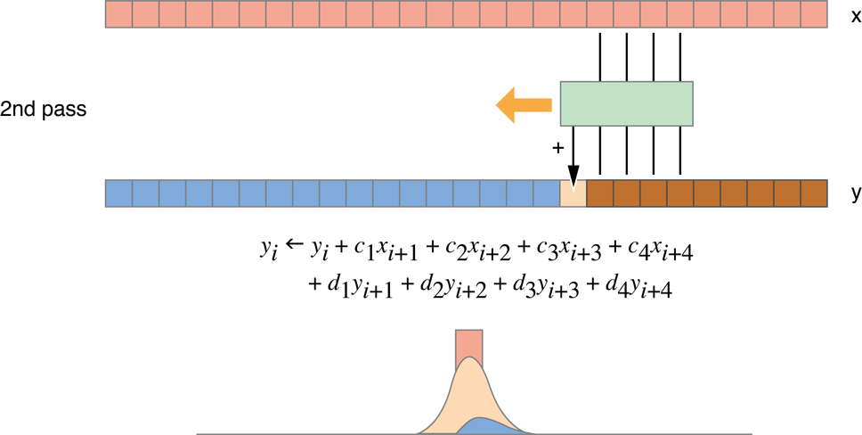
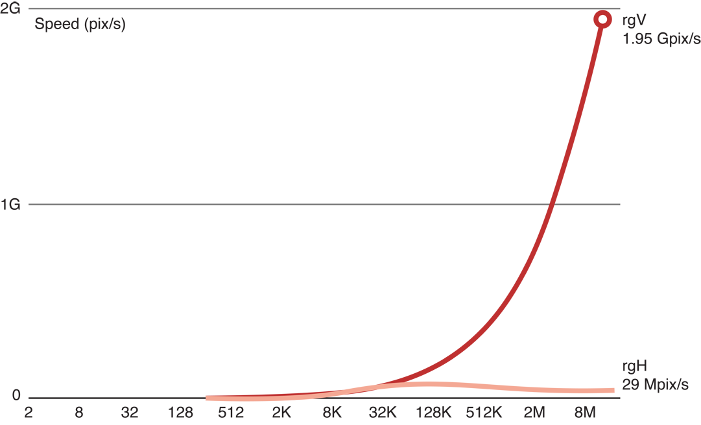

> 导航：[总目录](../../../README.md) · [documentation](../../../_indexes/documentation.md) · [OpenCL Programming Guide for Mac](About%20OpenCL%20for%20OS%20X.md)


[Next](Improving%20Performance%20On%20the%20CPU.md)[Previous](Autovectorizer.md)

# Tuning Performance On the GPU

GPUs and CPUs have fundamentally different architectures and so require different optimizations for OpenCL. A CPU has a relatively small number of processing elements and a large amount of memory (both a large cache and a much larger amount of RAM available on the circuit board). A GPU has a relatively large number of processing elements and usually has less memory than a CPU. Therefore, the code that runs fastest on a GPU will be designed to take up less memory and take advantage of the GPU’s superior processing power. In addition, GPU memory access is fast when the access pattern matches the memory architecture, so the code should be designed with this in mind.

It is possible to write OpenCL code that can run efficiently on both a CPU and a GPU. However, to obtain optimal performance it is usually necessary to write different code for each type of device.

This chapter focuses on how to improve performance on the GPU. It begins by describing the significant performance improvements on the GPU that can be obtained through tuning (see [Why You Should Tune](#apple-f4xwc4dqnrsv64tfmyxwi33df52wszbpkridimbqga4dgmjsfvbuqmrsfvjvooa)), lists APIs you can use to time code execution (see [Measuring Performance On Devices](#apple-f4xwc4dqnrsv64tfmyxwi33df52wszbpkridimbqga4dgmjsfvbuqmrsfvjvonq)), describes how you can estimate the optimal performance of your GPU devices (see [Generating the Compute/Memory Access Peak Benchmark](#apple-f4xwc4dqnrsv64tfmyxwi33df52wszbpkridimbqga4dgmjsfvbuqmrsfvjvoni)), describes a protocol that can be followed to tune GPU performance (see [Tuning Procedure](#apple-f4xwc4dqnrsv64tfmyxwi33df52wszbpkridimbqga4dgmjsfvbuqmrsfvjvomjx)), then steps through an example in which performance improvement is obtained. (See [Improving Performance On the CPU](Improving%20Performance%20On%20the%20CPU.md#apple-f4xwc4dqnrsv64tfmyxwi33df52wszbpkridimbqga4dgmjsfvbuqmjrgmwvgvzx) for suggestions for optimizing performance on the CPU.)See [Table 14-1](#apple-f4xwc4dqnrsv64tfmyxwi33df52wszbpkridimbqga4dgmjsfvbuqmrsfvjvomi) at the end of the chapter for generally applicable suggestions for measuring and improving performance on most GPUs.

Tuning your OpenCL code for the GPU can result in a two- to ten-fold improvement in performance. [Figure 14-1](#apple-f4xwc4dqnrsv64tfmyxwi33df52wszbpkridimbqga4dgmjsfvbuqmrsfvjvomy) illustrates typical improvements in processing speed obtained when an application that executes a Gaussian blur on a 16 MP image was optimized. The process followed to optimize this code is described in [Example: Tuning Performance Of a Gaussian Blur](#apple-f4xwc4dqnrsv64tfmyxwi33df52wszbpkridimbqga4dgmjsfvbuqmrsfvjvona).

__Figure 14-1__  Improvement expected

!

Before you decide to optimize code:

1. Decide whether the code really needs to be optimized. Optimization can take significant time and effort. Weigh the costs and benefits of optimization before starting any optimization effort.
2. Estimate optimal performance. Run some simple kernels on your GPU device to estimate its capabilities. You can use the techniques described in [Measuring Performance On Devices](#apple-f4xwc4dqnrsv64tfmyxwi33df52wszbpkridimbqga4dgmjsfvbuqmrsfvjvonq) to measure how long kernel code takes to run. See [Generating the Compute/Memory Access Peak Benchmark](#apple-f4xwc4dqnrsv64tfmyxwi33df52wszbpkridimbqga4dgmjsfvbuqmrsfvjvoni) for examples of code you can use to test memory access speed and processing speed.
3. Generate or collect sample data to feed through each iteration of optimization. Run the unoptimized original code through the sample code and save the results. Then run each major iteration of the optimized code against the same data and compare the results to the original results to ensure your output has not been corrupted by the changed code.

The point of optimizing an OpenCL application is to get it to run faster. At each step of the optimization process, you need to know how fast the optimized code takes to run. To determine how much time it takes a kernel to execute:

- Start a timer just before you call the kernel:

  `cl_timer gcl_start_timer(void);`

  Call this function to start the timer. It returns a `cl_timer` that you use to stop the timer.
- Stop the timer immediately after the kernel returns:

  `double gcl_stop_timer(cl_timer timer);`

  Call this function to stop the timer created when you called the `gcl_start_timer` function. It returns the elapsed time in seconds since the call to `cl_start_timer` associated with the `timer` parameter.

Measuring the execution time of several consecutive calls to the same kernel(s) usually improves the reliability of results. Because “warming-up” the device also improves consistency of benchmarking results, it’s recommended that you call the code that enqueues the kernel at least once before you begin timing. [Listing 14-1](#apple-f4xwc4dqnrsv64tfmyxwi33df52wszbpkridimbqga4dgmjsfvbuqmrsfvjvomjq) stores performance information about a kernel that it enqueues. Notice how the loop index starts at `-2` but the timer is started when the index has been incremented to `0`. :

__Listing 14-1__  Sample benchmarking loop on the kernel

```
const int iter = 10; // number of iterations to benchmark
cl_timer blockTimer;
for (int it = -2; it < iter; it++) { // Negative values not timed: warm-up
  if (it == 0) {                     // start timing
    blockTimer = gcl_start_timer(void);
  }
  <code to benchmark>
}
clFinish(queue); 
gcl_stop_timer(blockTimer);

// t = execution time for one iteration (s)
double t = blockTimer / (double)iter;
```


Before you optimize your code, you need to estimate how fast your particular GPU device is when accessing memory and when executing floating point operations. You can use two simple kernels to benchmark these capabilities:

- Copy kernel

  The kernel in [Listing 14-2](#apple-f4xwc4dqnrsv64tfmyxwi33df52wszbpkridimbqga4dgmjsfvbuqmrsfvjvomjr) reads a large image (results shown in this chapter come from processing a 16 megapixel (MP) image) stored in an input buffer and copies the image to an output buffer. Running this code gives a good indication of the best possible memory access speed to expect from a GPU.

  __Listing 14-2__  Copy kernel

```
kernel void copy(global const float * in,
                 global float * out,
                 int w,int h)
{
  int x = get_global_id(0); // (x,y) = pixel to process
  int y = get_global_id(1); // in this work item
  out[x+y*w] = in[x+y*w]; // Load and Store 
}
```

  [Figure 14-2](#apple-f4xwc4dqnrsv64tfmyxwi33df52wszbpkridimbqga4dgmjsfvbuqmrsfvjvomjs) graphs copy kernel speed as a function of image size. Running the copy kernel on our GPU, we were able to copy 13.5 gigapixels per second. This is a good indication of the maximum speed of memory access on this device.

  __Figure 14-2__  Copy kernel performance

  !
- MAD kernel

  In a Multiply plus ADd (_MAD_) kernel such as [Listing 14-3](#apple-f4xwc4dqnrsv64tfmyxwi33df52wszbpkridimbqga4dgmjsfvbuqmrsfvjvomjt), a large graphic image is read in, some floating point operations are performed on the image data, and the results are saved to an output buffer. The MAD kernel can be used to estimate optimal processing speed of the GPU, but when using the MAD kernel, you must add in enough floating point operations to ensure that memory constraints do not mask floating point capabilities.

  __Listing 14-3__  MAD kernel with 3 flops

```
kernel void mad3(global const float * in,
                 global float * out,
                 int w,int h) {
  int x = get_global_id(0);
  int y = get_global_id(1);
  float a = in[x+y*w];           // Load
  float b = 3.9f * a * (1.0f-a); // Three floating point ops
  out[x+y*w] = b;                // Store
}
```

The MAD benchmark shows the compute/memory ratio in the case of a single sequence of dependent operations. Compute kernels can reach much higher compute/memory ratios when they execute several independent dependence chains. For example, a matrix \* matrix multiply kernel can process nearly 2 Tflop/s on the same GPU.

As shown in [Figure 14-3](#apple-f4xwc4dqnrsv64tfmyxwi33df52wszbpkridimbqga4dgmjsfvbuqmrsfvjvomju), when we added three floating point operations to the copy kernel code (the top (red) line), we were still able to process 11.9 GP/s. This indicates that with only three flops, processing remains memory-bound.

__Figure 14-3__  MAD/copy kernel performance with 3 flops

!

[Figure 14-4](#apple-f4xwc4dqnrsv64tfmyxwi33df52wszbpkridimbqga4dgmjsfvbuqmrsfvjvomjv) shows that when we added six floating point operations to the copy kernel code (the top (red) line), we are still able to process 11.8 GP/s. This indicates that with six flops, processing is still memory-bound.

__Figure 14-4__  MAD/copy kernel performance with 6 flops

!

[Figure 14-5](#apple-f4xwc4dqnrsv64tfmyxwi33df52wszbpkridimbqga4dgmjsfvbuqmrsfvjvomjw) shows that after we added 24 floating point operations to the copy kernel code (the red line), processing slowed to 10.1 GP/s. Because the reduction of processing speed is large enough to be considered significant, this result indicates that this kernel is a good benchmark for computational processing for this GPU.

__Figure 14-5__  MAD/copy kernel performance with 24 flops

!

[Figure 14-6](#apple-f4xwc4dqnrsv64tfmyxwi33df52wszbpkridimbqga4dgmjsfvbuqmrsfvjvomjy) shows a typical process for optimizing a kernel that runs efficiently on the GPU:

__Figure 14-6__  Tuning procedure

!!

1. Choose an efficient algorithm. OpenCL runs most efficiently if the algorithm is optimized to take advantage of the capabilities of all devices it runs on. See [Choosing An Efficient Algorithm](#apple-f4xwc4dqnrsv64tfmyxwi33df52wszbpkridimbqga4dgmjsfvbuqmrsfvjvomq) for suggestions about how to evaluate potential algorithms.
2. Write code that runs efficiently on all target device(s). Each family of GPUs has a unique architecture. To get optimal performance from a GPU, you need to understand that GPU’s architecture. For example, some GPU families perform best when memory access blocks are set to certain sizes, other GPU families work best when the number of items in a workgroup is a multiple of a particular number, and so on. Consult the manufacturer’s literature for any GPU you wish to support to get details about that GPU’s architecture. This document provides only general principles that should apply to most GPUs.

   See [Table 14-1](#apple-f4xwc4dqnrsv64tfmyxwi33df52wszbpkridimbqga4dgmjsfvbuqmrsfvjvomi) for suggestions.

   It’s usually best to write scalar code first. In the second iteration, parallelize it. Next, create a version that minimizes memory usage.
3. Make sure to validate the results generated by each code version.
4. Benchmark. You can use the techniques described in [Measuring Performance On Devices](#apple-f4xwc4dqnrsv64tfmyxwi33df52wszbpkridimbqga4dgmjsfvbuqmrsfvjvonq) to measure the speed of the benchmark code and your application code. If the performance is good enough, you are done.
5. Identify bottlenecks.
6. Find a solution or workaround.
7. Repeat this process until your performance approaches the optimization target.

Consider the following when choosing an algorithm for your OpenCL application:

- The algorithm should be massively parallel, so that computation can be carried out by a large number of independent work items. For data parallel calculations on a GPU, OpenCL works best where many work items are submitted to the device.
- Minimize memory usage. The GPU has huge computing power; kernels are usually memory-bound. Consequently, algorithms with the fewest memory accesses or algorithms with a high compute-to-memory ratio are usually best for OpenCL applications. The compute-to-memory ratio is the ratio between the number of floating-point operations and the number of bytes transferred to and from memory.

  Try to maximize the number of independent dependency chains by grouping the computation of several output elements into one single work item.
- Moving data to or from OpenCL devices is expensive. OpenCL is most efficient on large datasets.

  OpenCL gives you complete control over memory allocation and host-device memory transfers. Your program will run much faster if you allocate memory on the OpenCL device, move your data to the device, do as much computation as possible on the device, then move it off—rather than repeatedly going through write-compute-read cycles.

  To avoid slow host-device transfers:

  - Whenever possible, aggregate several transfers into a single, larger transfer.
  - Design algorithms to keep the data on the device as long as possible.
- For data-parallel calculations on a GPU, OpenCL works best where there are a lot of work items submitted to the device; however, some algorithms are much more efficient than others.
- Use OpenCL built-in functions whenever possible. Optimal code will be generated for these functions.
- Balance precision and speed. GPUs are designed for graphics, where the requirements for precision are lower. The fastest variants are exposed in the OpenCL built-ins as `fast_`, `half_`, `native_` functions. The program build options provide control of some speed optimizations.
- Allocating and freeing OpenCL resources (memory objects, kernels, and so on) takes time. Reuse these objects whenever possible instead of releasing them and recreating them repeatedly. Note, however, that image objects can be reused only if they are the same size and pixel format as needed by the new image.
- Take advantage of the memory subsystem of the device.

  When using memory on an OpenCL device, the local memory shared by all the work items in a single workgroup is faster than the global memory shared by all the workgroups on the device. Private memory, available only to a single work item, is even faster.

  On the GPU, the memory access pattern is the most important factor. Use faster memory levels (local memory, registers) to counter the effects of a sub-optimal pattern and to minimize accesses to the slower global memory.
- Experiment with your code to find the kernel size that works best.

  Using smaller kernels can be efficient because each tiny kernel uses minimal resources. Breaking a job down into many small kernels allows for the creation of very large, efficient workgroups. On the other hand, it may require between 10-100 μs to start each kernel. When each kernel exits, the results must be stored in global memory. Because reading and writing to global memory is expensive, concatenating many small kernels into one large kernel may save considerable overhead.

  To find the kernel size that provides optimal performance, you will need to experiment with your code.
- OpenCL events on the GPU are expensive.

  You can use events to coordinate execution between queues, but there is overhead to doing so. Use events only where needed; otherwise take advantage of the in-order properties of queues.
- Avoid divergent execution:

  All threads scheduled together on a GPU must execute the same code. As a consequence, when executing a conditional, all threads execute both branches but their output is disabled when they are false branch. It is best to avoid conditionals (replace them with `a?x:y` operators) or use built-in functions.

The following example steps through the process of optimizing an application that performs a Gaussian blur on an image on a GPU. You can follow a similar protocol when tuning your GPU code.

1. Estimate optimal performance.
2. Generate test code. It’s probably easiest to write a reference version of the code on the host, save the result, then write code to compare the verified output to the output generated by your optimized code.
3. Choose an algorithm to implement our Gaussian blur:

   There are three possibilities:

   - Classic Two-Dimensional Convolution

     [Figure 14-7](#apple-f4xwc4dqnrsv64tfmyxwi33df52wszbpkridimbqga4dgmjsfvbuqmrsfvjvomjz) depicts the creation of a two-dimensional convolution using a 31 x 31 kernel for sigma=5. This translates to 31 times 31, or 961 input pixels for each pixel output. One addition and one multiplication is used for each input for a total of 961+1 I/O or 2 times 961 flops per pixel. These results are shown in the second row of [Table 14-1](#apple-f4xwc4dqnrsv64tfmyxwi33df52wszbpkridimbqga4dgmjsfvbuqmrsfvjvomi).

     __Figure 14-7__  Classic two-dimensional convolution

     !
   - Separable Two-Dimensional Convolution

     In this case, the algorithm is separable. It can be divided into two one-dimensional filters-one horizontal and one vertical, as shown in [Figure 14-8](#apple-f4xwc4dqnrsv64tfmyxwi33df52wszbpkridimbqga4dgmjsfvbuqmrsfvjvomrq). By separating the dimensions, you reduce the cost in memory and processing goes down to 64 read/write operations and 124 flops per pixel. These results are shown in the third row of [Table 14-1](#apple-f4xwc4dqnrsv64tfmyxwi33df52wszbpkridimbqga4dgmjsfvbuqmrsfvjvomi).

     The 1D convolution with a kernel of size 31 that requires reading 31 input values for each output pixel, then performing 1 addition and 1 multiplication for each input. That’s 31 + 1 I/O and 2 times 31 = 62 flops. Double this to get the numbers for the two passes. (This is specific to sigma=5.)

     __Figure 14-8__  Separable two-dimensional convolution

     !!
   - Recursive Gaussian Filter

     This algorithm does not compute the exact Gaussian blur, only a good approximation of it. As shown in [Figure 14-9](#apple-f4xwc4dqnrsv64tfmyxwi33df52wszbpkridimbqga4dgmjsfvbuqmrsfvjvomrr), it requires four passes (two horizontal, two vertical), but reduces processing to 10 read/write operations and 64 flops per pixel. These results are shown in the fourth row of [Table 14-1](#apple-f4xwc4dqnrsv64tfmyxwi33df52wszbpkridimbqga4dgmjsfvbuqmrsfvjvomi).

     __Figure 14-9__  Recursive Gaussian filter passes

     !

     __Figure 14-10__  Recursive Gaussian filter

     !

     [Table 14-1](#apple-f4xwc4dqnrsv64tfmyxwi33df52wszbpkridimbqga4dgmjsfvbuqmrsfvjvomi) compares the compute-to-memory ratio results of the 2D Convolution, Separable Convolution, and Recursive Gaussian iterations. (The top row shows the results of a simple copy.) It looks like Recursive Gaussian algorithm performs best:

     __Table 14-1__  Comparing algorithms

     | Algorithm | Memory  (float R+W) | Compute  (flops) | C/M  Ratio | Estimate  (MP/s) |
     | _Copy_ | 2 | 0 | 0 | 14,200 |
     | _2D Convolution_ | 962 | 1,922 | 2 | 30 |
     | _Separable Convolution_ | 64 | 124 | 2 | 443 |
     | _Recursive Gaussian_ | 10 | 64 | 6 | 2,840 |

     The first column depicts the number of memory accesses per pixel. The second column depicts the number of flops per pixel. The third column depicts the compute:memory ratio. The last column shows the number of megapixels each algorithm can be expected to process per second; numbers were obtained by taking the ratio of I/O with respect to the copy kernel. The copy kernel processes 14,200 MP/s with 2 I/O per pixel. A kernel with 64 I/O per pixel will be 32 times slower, so it will process 14200/32 = 443 MP/s.
4. The first version of code that performs the Gaussian blur using the recursive Gaussian algorithm looks like [Listing 14-4](#apple-f4xwc4dqnrsv64tfmyxwi33df52wszbpkridimbqga4dgmjsfvbuqmrsfvjvomrv).

   __Listing 14-4__  Recursive Gaussian implementation, version 1

```
// This is the horizontal pass.
// One work item per output row
// Run one of these functions for each row of the image
// (identified by variable y).
kernel void rgH(global const float * in,global float * out,int w,int h)
{
  int y = get_global_id(0); // Row to process
  // Forward pass
  float i1,i2,i3,o1,o2,o3,o4;
  i1 = i2 = i3 = o1 = o2 = o3 = o4 = 0.0f;

  // In each iteration of the loop, read one input value and
  // store one output value.
  for (int x=0;x<w;x++)
  {
    float i0 = in[x+y*w]; // Load
    float o0 = a0*i0 + a1*i1 + a2*i2 + a3*i3
               - c1*o1 - c2*o2 - c3*o3 - c4*o4; // Compute new output
    out[x+y*w] = o0; // Store
    // Rotate values for next pixel.
    i3 = i2; i2 = i1; i1 = i0;
    o4 = o3; o3 = o2; o2 = o1; o1 = o0;
  }
  // Backward pass
  ...
}
```

   

```
// This is the vertical pass.
// One work item per output column
// Run one of these functions for each column of the image
//   (identified by variable x).
kernel void rgV(global const float * in,global float * out,int w,int h)
{
  int x = get_global_id(0); // Column to process
  // Forward pass
  float i1,i2,i3,o1,o2,o3,o4;
  i1 = i2 = i3 = o1 = o2 = o3 = o4 = 0.0f;
  for (int y=0;y<h;y++)
  {
    float i0 = in[x+y*w]; // Load
    float o0 = a0*i0 + a1*i1 + a2*i2 + a3*i3
        - c1*o1 - c2*o2 - c3*o3 - c4*o4;
    out[x+y*w] = o0; // Store
    // Rotate values for next pixel
    i3 = i2; i2 = i1; i1 = i0;
    o4 = o3; o3 = o2; o2 = o1; o1 = o0;
  }
  // Backward pass
  ...
}
```

   This iteration produces results like those shown in [Figure 14-11](#apple-f4xwc4dqnrsv64tfmyxwi33df52wszbpkridimbqga4dgmjsfvbuqmrsfvjvomrt).

   __Figure 14-11__  Benchmark of Recursive Gaussian implementation, version 1

   !

   The vertical pass is fast, but the horizontal pass is not:

   

   The problem is that inside the GPU we have scheduled about 16 million functions to be called in groups of about 300 work items at the same time, each simultaneously requesting a memory access with a different address. This is an example of a _memory access pattern_. The GPU hardware is optimized for certain kinds of memory accesses. Other kinds of accesses are conflicting. These will be serialized and will run much slower.

   Specifically, in image processing, when consecutive work items access consecutive pixels in the same row, as in [Figure 14-12](#apple-f4xwc4dqnrsv64tfmyxwi33df52wszbpkridimbqga4dgmjsfvbuqmrsfvjvomru), processing is very fast:

   __Figure 14-12__  Consecutive work items accessing consecutive addresses

   !

   However, in cases where memory accesses end up in the same bank, as in [Figure 14-13](#apple-f4xwc4dqnrsv64tfmyxwi33df52wszbpkridimbqga4dgmjsfvbuqmrsfvjvomrx) (in image processing this is where consecutive work items access consecutive pixels in the same column) processing is slow:

   __Figure 14-13__  Where memory accesses end up in the same bank, processing is slow

   !

   The solution is to transpose the array so that what was horizontal becomes vertical. We can process the transposed image, then transpose the result back into the proper orientation:

   `rgV + transpose + rgV + transpose = rgV + rgH`

   To transpose, we copy the pixels being transposed:

   __Figure 14-14__  A transpose is really a copy

   !

   The transpose should be almost as fast as the copy kernel. However, although access to the input buffer is fast, access to the output buffer is slower:

   

   We estimate the performance of the transpose kernel by adding two I/O operations for the transpose for each pass. That comes to 10 + 2 \* 2 = 14.

   __Table 14-2__  Estimated results of transpose kernel

   | Algorithm | Memory  (float R+W) | Compute  (flops) | C/M  Ratio | Estimate  (MP/s) |
   | V+T+V+T | 14 | 64 | 4.6 | 2,030 |

   When we run the code, we see that as the image height gets larger, processing gets slower:

   __Figure 14-15__  Results of benchmarking the transpose kernel

   !

   To speed this up, we can move the processing to faster memory. Inside the GPU are _processing cores_ (the top boxes in [Figure 14-16](#apple-f4xwc4dqnrsv64tfmyxwi33df52wszbpkridimbqga4dgmjsfvbuqmrsfvjvomzr)). Each GPU processing core has Arithmetic Logic Units (ALUs), registers, and local memory. The processing core is connected to the global memory. The global memory is connected to the host. Each layer of memory is about ten times faster than the one below it.

   __Figure 14-16__  GPU memory hierarchy

   !

   In this iteration, we will move processing to the local memory. We’ll have a work group—a block of work items—loading a small block of the image, storing it in local memory, then when all the work items in the group are finished performing the Gaussian recursion on the pixels in local memory, we move all of them out to the output buffer.

   __Figure 14-17__  Moving blocks of the image to local memory

   !

   The code to do this looks like [Listing 14-5](#apple-f4xwc4dqnrsv64tfmyxwi33df52wszbpkridimbqga4dgmjsfvbuqmrsfvjvomzt):

   __Listing 14-5__  Move the work items to local memory then transpose

```
kernel void transposeL(global const float * in,
                               global float * out,
                               int w,int h)
{
  local float aux[256];            // Block size is 16x16

  // bx and by are the workgroup coordinates.
  // They are mapped to bx and by blocks in the image.
  int bx = get_group_id(0),        // (bx,by) = input block
      by = get_group_id(1);

  // ix and iy are the pixel coordinates inside the block.
  int ix = get_local_id(0),        // (ix,iy) = pixel in block
      iy = get_local_id(1);
  in += (bx*16)+(by*16)*w;         // Move to origin of in,out blocks
  out += (by*16)+(bx*16)*h;

  // Each work item loads one value to the temporary local memory,
  aux[iy+ix*16] = in[ix+w*iy];     // Read block

  // Wait for all work items.
  // This barrier is needed to make sure all work items in the workgroup
  // have executed the aux[…] = in[…] instruction, and that all values
  // in aux are correct. Then we can proceed with the out[…] = aux[…].
  // This is needed because each work item will set one value of aux
  // and then read another one, which was set by another item.
  // If we don’t synchronize at this point, we may read an aux value that
  // has not yet been set.
  barrier(CLK_LOCAL_MEM_FENCE);     // Synchronize

  // Move the value from the local memory back out to global memory.
  // Because copying to consecutive memory, the writes are fast.
  out[ix+h*iy] = aux[ix+iy*16];    // Write block
}
```

   Unfortunately, this change did not make the code run faster.

   __Figure 14-18__  Results of moving the work to local memory and then transposing.

   !

   The problem is that now we have created another memory access pattern when we copy the results from rows in local memory to columns in output (global) memory.

   __Figure 14-19__  Memory Access Pattern now occurs on the output side

   !

   To solve this, change the work groups to map pixels to copy diagonally:

   __Figure 14-20__  Skew block mapping

   !

   To convert the code to skew the input and output copy, just change one line:

   __Listing 14-6__  Change the code to move diagonally through the image

```
kernel void transposeLS(global const float * in,
                             global float * out,
                             int w,int h)
{
  local float aux[256];           // Block size is 16x16
  int bx = get_group_id(0),       // (bx,by) = input block
  by = get_group_id(1);
  int ix = get_local_id(0),       // (ix,iy) = pixel in block
  iy = get_local_id(1);
  // This is the line we changed:
  by = (by+bx)%get_num_groups(1); // Skew mapping

  in += (bx*16)+(by*16)*w; // Move to origin of in,out blocks
  out += (by*16)+(bx*16)*h;
  aux[iy+ix*16] = in[ix+w*iy];    // Read block
  barrier(CLK_LOCAL_MEM_FENCE);   // Synchronize
  out[ix+h*iy] = aux[ix+iy*16];   // Write block
}
```

   Benchmarking proves that this version is faster:

   __Figure 14-21__  Benchmark of the skewed code

   !

   Running the transposed code in local memory does make the Gaussian blur significantly faster:

   __Figure 14-22__  Benchmark of the transposed, skewed code

   !

   Still, processing is not occuring as quickly as our original speed estimate would indicate. The problem is that because of the sequential nature of the recursive Gaussian loop, we don’t have enough work groups to saturate the GPU. We would need to change the algorithm to increase the parallelism level in order to increase performance to meet our original estimate.

Some general principles for improving the efficiency of your OpenCL code running on a GPU:

- Building an OpenCL program is computationally expensive and should ideally occur only once in a process.

  Be sure to take advantage of tools in OS X v10.7 or later that allow you to compile once and then run many times. If you do choose to compile a kernel during runtime, you will need to execute that kernel many times to amortize the cost of compiling it. You can save the binary after the first time the program is run and reuse the compiled code on subsequent invocations, but be prepared to recompile the kernel if the build fails because of an OpenCL revision or a change in the hardware of the host machine.

  You can also use bitcode generated by the OpenCL compiler instead of source code. Using compiled bitcode will increase processing speed and alleviates the need for you to ship source code with your application.
- Use OpenCL built-in functions whenever possible. Optimal code will be generated for these functions.
- Balance precision and speed. GPUs are designed for graphics, where the requirements for precision are lower. The fastest variants are exposed in the OpenCL built-ins as `fast_`, `half_`, `native_` functions. The program build options allow control of some speed optimizations.
- Avoid divergent execution. On the GPU, all threads scheduled together must execute the same code. As a consequence, when executing a conditional, all threads execute both branches, with their output disabled when they are in the wrong branch. It is best to avoid conditionals (replace them with `a?x:y` operators) or use built-in functions.
- Try to use image objects instead of buffers. In some cases (for certain memory access patterns), the different hardware data path the GPU uses when accessing images may be faster than if you use buffers. Using images rather than buffers is especially important when you use 16-bit floating-point data (`half`).

[Next](Improving%20Performance%20On%20the%20CPU.md)[Previous](Autovectorizer.md)

