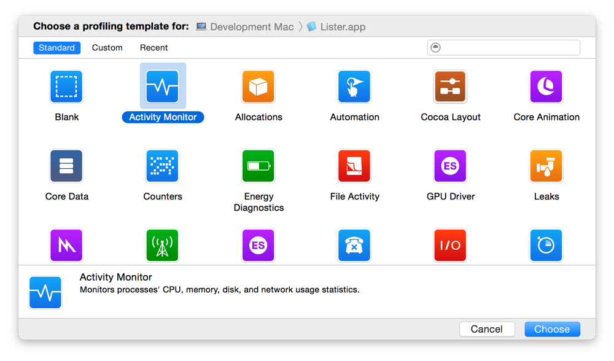
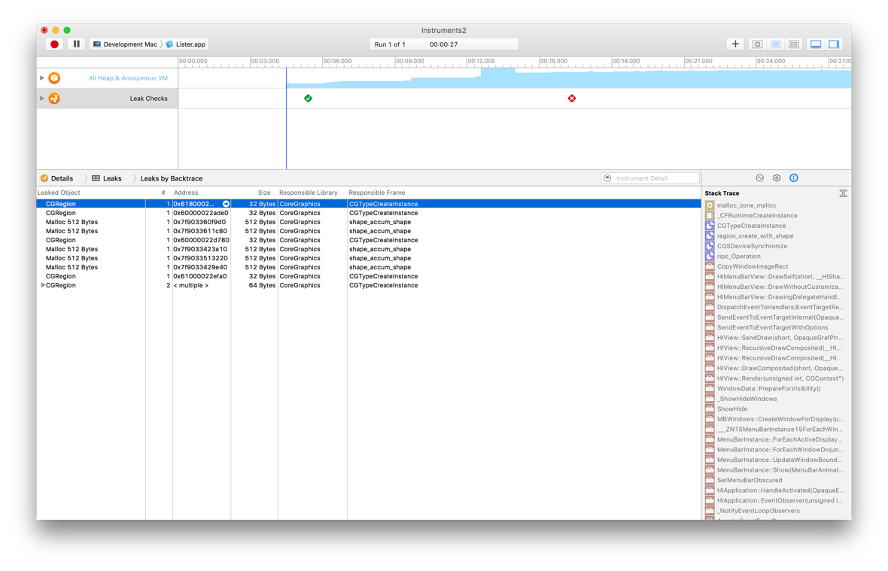
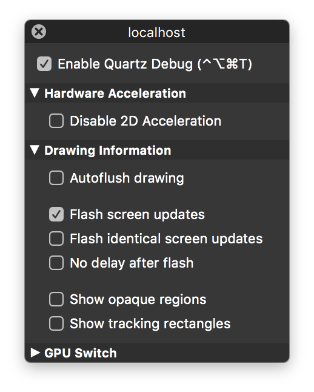

> 导航：[总目录](../../../README.md) · [documentation](../../../_indexes/documentation.md) · [Performance Overview](Introduction.md)


[Next](Document%20Revision%20History.md)[Previous](Performance%20Tools.md)

# Doing an Initial Performance Evaluation

So, you have some code and you want to see if it is suffering from performance problems. Where do you start? Not all problems are immediately visible. You might notice that an operation took several seconds to perform, but you might not notice an operation that consumed too many CPU cycles or allocated too much memory. This is where Apple’s performance tools come into play. They can help you see aspects of your program that are easily overlooked.

The following sections provide a brief overview of how to use some key tools when starting to analyze your program. These tools are good for identifying potential problems and can provide a significant amount of performance data. Remember, though, that there may be other tools that provide more specific information related to the problem. Running your application with several other tools can help you confirm whether a particular area is a problem.

For more information about the performance tools in general, including where to get them, see [Performance Tools](Performance%20Tools.md#apple-f4xwc4dqnrsv64tfmyxwi33df52wszbpkridimbqgaytimjqfvbuqmrqguwueq2jjfeecqkk).

The `top` tool is an important tool for identifying potential problem areas in a process. This tool displays a periodically sampled set of statistics on system usage. Using `top` and understanding its output are an excellent way to identify potential performance problems.

The `top` tool displays periodically updated statistics on CPU usage, memory usage (in various categories), resource usage (such as threads and ports), and paging events. In the default mode, `top` displays CPU and memory utilization of all system processes. You can use this information to see how much memory your program is using and what percentage of the CPU time it is using. An idle program should not use any CPU time and an active one should consume a proportionate amount of CPU time based on the complexity of the task.

Listing 4-1 shows a typical statistical output from `top`. For application developers, the statistics you should be most interested in are the CPU usage, resident private memory usage (`RPRVT`), and pagein/pageout rates. These values tell you some key things about your application’s resource usage. High CPU usage may mean that your application’s tasks are not tuned appropriately. Increased memory usage and page-in/page-out rates may indicate a need to reduce your application’s memory footprint.

__Listing 4-1__  Typical output of top

```
Processes:  36 total, 2 running, 34 sleeping... 81 threads
Load Avg:  0.24, 0.27, 0.23     CPU usage:  12.5% user, 87.5% sys, 0.0% idle
SharedLibs: num =   77, resident = 10.6M code, 1.11M data, 4.75M LinkEdit
MemRegions: num = 1207, resident = 16.4M + 4.94M private, 22.2M shared
PhysMem:  16.0M wired, 25.8M active, 48.9M inactive, 90.7M used, 37.2M free
VM:  476M + 39.8M   6494(6494) pageins, 0(0) pageouts

  PID COMMAND      %CPU   TIME      #TH #PRTS #MREGS RPRVT  RSHRD  RSIZE  VSIZE
  318 top           0.0%  0:00.36   1    23    13   172K   232K   380K  1.31M
  316 zsh           0.0%  0:00.08   1    18    12   168K   516K   628K  1.67M
  315 Terminal      0.0%  0:02.25   4   112    50  1.32M  3.55M  4.88M  31.7M
  314 CPU Monito    0.0%  0:02.08   1    63    35   896K  1.34M  2.14M  27.9M
  313 Clock         0.0%  0:01.51   1    57    38  1.02M  2.01M  2.69M  29.0M
  312 Dock          0.0%  0:03.72   2    77    78  2.18M  2.28M  3.64M  30.0M
  311 Finder        0.0%  0:07.68   4    86   171  7.96M  9.15M  15.1M  52.1M
  308 pbs           0.0%  0:01.37   4    76    40   928K   684K  1.77M  15.4M
  285 loginwindow   0.0%  0:07.19   2    70    58  1.64M  1.93M  3.45M  29.6M
  282 cron          0.0%  0:00.00   1    11    14    88K   228K   116K  1.50M
  245 sshd          0.0%  0:02.48   1    10    15   176K   312K   356K  1.41M
  222 SecuritySe    0.0%  0:00.14   2    21    24   476K   828K  1.29M  3.95M
  209 automount     0.0%  0:00.03   2    13    20   336K   748K   324K  4.36M
  200 nfsiod        0.0%  0:00.00   1    10    12     4K   224K    52K  1.22M
  199 nfsiod        0.0%  0:00.00   1    10    12     4K   224K    52K  1.2
[...]
```

In its header area, `top` displays statistics on the global state of the system. This information includes load averages; total process and thread counts; and total memory, broken down into various categories such as private, shared, wired, and free. It also includes global information concerning the system frameworks. At regular intervals, `top` updates these statistics to account for recent system activity.

Table 4-1 describes the columnar data that appears in the CPU and memory utilization mode using the `-w` parameter. For detailed information about how `top` reports information, see the `top` man page.

__Table 4-1__  Output from top using the -w option

| Column | Description |
| `PID` | The BSD process ID. |
| `COMMAND` | The name of the executable or application package. (Note that Code Fragment Manager applications are named after the native process that launches them, `LaunchCFMApp`.) |
| `%CPU` | The percentage of CPU cycles consumed during the interval on behalf of this process (both kernel and user space). |
| `TIME` | The amount of CPU time (_minute_:_seconds_._hundredths_) consumed by this process since it was launched. |
| `#TH` | The number of threads owned by this process. |
| `#PRTS (delta)` | The number of Mach port objects owned by this process. (To display the delta value relative to the value first displayed when `top` was launched, use the `-w` parameter.) |
| `#MREG` | The number of memory regions. |
| `VPRVT` | The private address space currently allocated. (This value is displayed only with the `-w` parameter.) |
| `RPRVT (delta)` | The total amount of resident private memory. (To display the delta value relative to the previous sample, use the `-w` parameter when running `top`.) |
| `RSHRD (delta)` | The resident shared memory. (To display the delta value relative to the previous sample, use the `-w` parameter when running `top`.) |
| `RSIZE (delta)` | The total resident memory as real pages that this process currently has associated with it. Some may be shared by other processes. (To display the delta value relative to the previous sample, use the `-w` parameter when running `top`.) |
| `VSIZE (delta)` | The total address space currently allocated, including shared memory. (To display the delta value relative to the previous sample, use the `-w` parameter when running `top`.)  This value is mostly irrelevant for OS X processes. Every application has a large virtual size because of the shared region used to hold framework and library code. |

The `RPRVT` data (for resident private pages) is a good measure of how much real memory an application is using. The `RSHRD` column (for resident shared pages) shows the resident pages of all the shared mapped files or memory objects that are shared with other processes.

Table 4-2 shows the columns displayed in the event-counting mode, which is enabled with either the `-e`, `-d`, or `-a` option on the command line. You can use these options to gain additional insight about specific behaviors of your application. For example, you can correlate the number of page faults with the amount of memory your application is using to determine if your application’s memory footprint might be too big.

__Table 4-2__  Output from top using the -d option

| Column | Description |
| `PID` | The BSD process ID. |
| `COMMAND` | The name of the executable or application package. (Note that Code Fragment Manager applications are named after the native process that launches them, `LaunchCFMApp`.) |
| `%CPU` | The percentage of CPU cycles consumed during the interval on behalf of this process (both kernel and user space). |
| `TIME` | The amount of CPU time consumed by this process (_minute_:_seconds_._hundredths_) since it was launched. |
| `FAULTS` | The total number of page faults. |
| `PAGEINS` | The number of page-ins, requests for pages from a pager (each page-in represents a 4 kilobyte I/O operation). |
| `COW_FAULTS` | The number of faults that caused a page to be copied (generally caused by copy-on-write faults). |
| `MSGS_SENT` | The number of Mach messages sent by the process. |
| `MSGS_RCVD` | The number of Mach messages received by the process. |
| `BSDSYSCALL` | The number of BSD system calls made by the process. |
| `MACHSYSCALL` | The number of Mach system calls made by the process. |
| `CSWITCH` | The number of context switches to the process (the number of times the process has been given time to run by the kernel’s scheduler). |

Instruments is an incredibly powerful tool you can use to gather performance data and analyze your app’s overall behavior. Instruments can show you different types of performance information, such as memory and CPU usage, graphed side by side. Seeing information in this way makes it easier to identify trends and relationships between seemingly different metrics.

When you first launch Instruments, you are asked to select a starting template for your document (Figure 4-1) and choose an app to profile. Each template is preconfigured with one or more instruments that are designed to gather data for specific situations. For example, the Leaks template includes both the Allocations instrument and the Leaks instrument, letting you see both the total number of memory blocks that were allocated and the subset of those memory blocks that are considered leaks. You can add more instruments to a document at any time but the common configurations provided by the templates are usually sufficient for typical tasks.

__Figure 4-1__  Choosing an Instruments template



Figure 4-2 shows an example of data gathered by the Leaks template after a recording run. The timeline and detail panes are configurable and filterable, so you can look at data that is most interesting to you.

__Figure 4-2__  Examining the recorded data



For detailed information about how to use Instruments and for information about the types of performance data you can gather, see _[Instruments User Guide](https://developer.apple.com/library/archive/documentation/DeveloperTools/Conceptual/InstrumentsUserGuide/index.html#//apple_ref/doc/uid/TP40004652)_.

Quartz Debug is an important tool for determining the efficiency of your drawing code. The tool collects information from your program’s drawing calls to find out where your program is drawing and whether it is redrawing content unnecessarily. Figure 4-3 shows the Quartz Debug options window.

__Figure 4-3__  Quartz Debug options



With the Flash screen updates option enabled, Quartz Debug shows you visually where your code is drawing. It places a yellow rectangle over an area where a redraw operation is about to occur and then pauses briefly before redrawing the content. This flickering yellow pattern can point out places where you are drawing more than is necessary. For example, if you update only a small portion of a custom view, you probably do not want to be forced to redraw the entire view. Alternatively, if you see a system control being redrawn several times in succession, it might point out the need to hide that control before changing its attributes.

The “Flash identical screen updates” option displays red over any areas whose resulting bits are identical to the current content. You can use this option to detect redundant drawing operations in your code.

[Next](Document%20Revision%20History.md)[Previous](Performance%20Tools.md)

