> 导航：[总目录](../../../README.md) · [documentation](../../../_indexes/documentation.md) · [vDSP Programming Guide](Introduction.md)


# Using Fourier Transforms

The vDSP API provides Fourier transforms for transforming one-dimensional and two-dimensional data between the time domain and the frequency domain.

To boost performance, vDSP functions that process frequency-domain data expect a _weights array_ of complex exponentials (sometimes called twiddle factors) to exist prior to calling the function. Once created, this FFT weights array can be used over and over by the same Fourier function and can be shared by several Fourier functions.

FFT weights arrays are created by calling [vDSP_create_fftsetup](https://developer.apple.com/documentation/kernel/1580009-vdsp_create_fftsetup) (single-precision) or [vDSP_create_fftsetupD](https://developer.apple.com/documentation/accelerate/1449974-vdsp_create_fftsetupd) (double-precision). Before calling a function that processes in the frequency domain, you must call one of these functions. The caller specifies the required array size to the setup function. The setup functions:

- Create a data structure to hold the array.
- Build the array.
- Return a pointer to the data structure (or `NULL` if storage for this structure could not be allocated).

The pointer to the data structure is then passed as an argument to subsequent Fourier functions. You must check the value of the pointer before supplying the pointer to a frequency domain function. A returned value of zero is the only explicit notification that the array allocation failed.

Argument `log2n` to these functions is the base-2 logarithm of `n`, where `n` is the number of complex unit circle divisions the array represents, and thus specifies the largest number of elements that can be processed by a subsequent Fourier function. Argument `log2n` must equal or exceed argument `log2n` supplied to any functions using the weights array. Functions automatically adjust their strides through the array when the table has more resolution, or larger `n`, than required.

Thus, a single call to [vDSP_create_fftsetup](https://developer.apple.com/documentation/kernel/1580009-vdsp_create_fftsetup) or [vDSP_create_fftsetupD](https://developer.apple.com/documentation/accelerate/1449974-vdsp_create_fftsetupd) can serve a series of calls to FFT functions as long as `n` is large enough for each function called and as long as the weights array is preserved.

For example, if you need to call [vDSP_fft_zrip](https://developer.apple.com/documentation/kernel/1579997-vdsp_fft_zrip) for 256 data points, you must call `vDSP_create_fftsetup` with `logn` of at least 8. If you also need to call `vDSP_fft_zrip` for a set of 2048 data points, the value of `logn` must be at least 11. So you could generate this table once for both sets as follows:

```
FFTsetup setup; vDSP_create_fftsetup( 11, 0 ); /* supports up to 2048 (2**11) points  */
...
vDSP_fft_zrip( setup, small_set, 1, 8, FFT_FORWARD); /* 256 (2**8) points  */
...
vDSP_fft_zrip( setup, large_set, 1, 11, FFT_FORWARD); /* 2048 (2**11) points  */
```

Reusing a weights array for similarly sized FFTs is economical. However, using a weights array built for an FFT that processes a large number of elements can degrade performance for an FFT that processes a smaller number of elements.

For a more complete example of [vDSP_create_fftsetup](https://developer.apple.com/documentation/kernel/1580009-vdsp_create_fftsetup) and FFT functions, see _[vDSP Examples](https://developer.apple.com/library/archive/samplecode/vDSPExamples/Introduction/Intro.html#//apple_ref/doc/uid/DTS10004300)_.

The discrete Fourier transform functions in the vDSP API provide a unique case in data formatting to conserve memory. Real-to-complex discrete Fourier transforms write their output data in special packed formats so that the complex output requires no more memory than the real input.

Applications that call the real FFT may have to use two transformation functions, one before the FFT call and one after. This is required if the input array is not in the even-odd split configuration.

A real array `A = {A[0],...,A[n]}` must be transformed into an even-odd array `AEvenOdd = {A[0],A[2],...,A[n-1],A[1],A[3],...A[n]}` by means of the call [vDSP_ctoz](https://developer.apple.com/documentation/kernel/1579975-vdsp_ctoz).

The result of a real FFT on `AEvenOdd` of dimension `n` is a complex array of dimension `2n`, with a very special format:

`{[DC,0],C[1],C[2],...,C[n/2],[NY,0],Cc[n/2],...,Cc[2],Cc[1]}`

where:

- Values `DC` and `NY` are the DC and Nyquist components (real values)
- Array `C` is complex in a split representation
- Array `Cc` is the complex conjugate of `C` in a split representation

For a real array `A` of size `n` , the results, which are complex, require `2 * n` spaces. However, much of this data is either always zero or is redundant, so this data can be omitted. Thus, to fit this result into the same space as the input array, the algorithm throws away these unnecessary values. The real FFT stores its results as follows:

`{[DC,NY],C[1],C[2],...,C[n/2]}.`

The following sections describe the packing formats in more detail, for one-dimensional and two-dimensional arrays.

Due to its inherent symmetry, the forward Fourier transform of `n` floating-point inputs from the time domain to the frequency domain produces `n/2 + 1` unique complex outputs. Because data point `n/2 - i` equals the complex conjugate of point `n/2 + i`, the first half of the frequency data by itself (up to and including point `n/2 + 1`) is sufficient to preserve the original information.

In addition, the FFT data packing takes advantage of the fact that the imaginary parts of the first complex output (element zero) and of the last complex output (element `n/2`, the Nyquist frequency), are always zero.

This makes it possible to store the real part of the last output where the imaginary part of the first output would have been. The zero-valued imaginary parts of the first and last outputs are implied.

For example, consider this eight-point real vector as it exists prior to being transformed to the frequency domain ([Figure 2-1](#apple-f4xwc4dqnrsv64tfmyxwi33df52wszbpkridimbqga2tcnbxfvbuqmznge2tqnzr)).

__Figure 2-1__  Eight point real vector

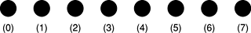

Transforming these eight real points to the frequency domain results in five complex values ([Figure 2-2](#apple-f4xwc4dqnrsv64tfmyxwi33df52wszbpkridimbqga2tcnbxfvbuqmznge2tqnzw)).

__Figure 2-2__  Results of an eight-point real-to-complex DFT

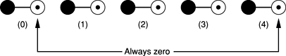

The five complex values are packed in the output vector shown in [Figure 2-3](#apple-f4xwc4dqnrsv64tfmyxwi33df52wszbpkridimbqga2tcnbxfvbuqmznge2tqobq)

__Figure 2-3__  Packed format of an eight-point real-to-complex DFT

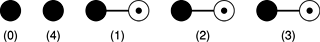

Notice that the real part of output four is stored where the imaginary part of output zero would have been stored with no packing. The imaginary parts of the first output and the last output, always zero, are implied.

Two-dimensional real-to-complex DFTs are packed in a similar way. When processing two-dimensional real inputs, the DFTs first transform each row and then transform down columns. As each row is transformed, it is packed as previously described for one-dimensional transforms.

For example, to transform an 8-by-8 real image to the frequency domain, first each row is transformed and packed as shown in [Figure 2-4](#apple-f4xwc4dqnrsv64tfmyxwi33df52wszbpkridimbqga2tcnbxfvbuqmznge2tqobu)

__Figure 2-4__  Interim format of an 8-by-8 real-to-complex DFT

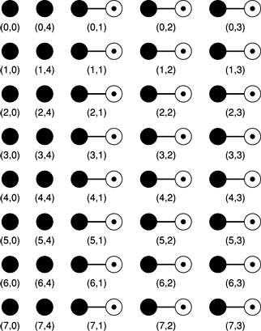

Notice that each row is packed like the one-dimensional transform in the earlier example. Packing yields 16 real values and 24 complex values in a total of 64 `sizeof(float)` memory locations, the size of the original matrix.

After each row is processed and packed, the DFT then transforms each column. Since the first pass leaves real values in columns zero and one, these two columns are transformed from real to complex using the same packing method vertically that was used horizontally on each row. Thus, transforming these 16 real values yields six complex points and four real points, occupying the 16 memory locations in columns zero and one.

The remaining three columns of complex values are transformed complex-to-complex, yielding 24 complex points as output, and requiring 48 memory locations to store. This brings the total storage requirement to 64 locations, the size of the original matrix. The completed 8-by-8 transform's format is shown in [Figure 2-5](#apple-f4xwc4dqnrsv64tfmyxwi33df52wszbpkridimbqga2tcnbxfvbuqmznge2tqoby)

__Figure 2-5__  Packed format of an 8-by-8 real-to-complex 2D DFT

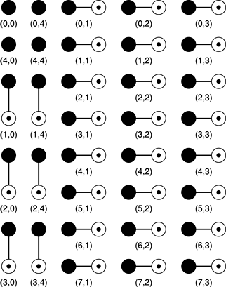

To provide the best possible execution speeds, the vDSP library's functions don't always adhere strictly to textbook formulas for Fourier transforms, and must be scaled accordingly. The following sections specify the scaling for each type of Fourier transform implemented by the vDSP Library. The scaling factors are also stated explicitly in the formulas that accompany the function definitions in the reference chapter.

The scaling factors are summarized in [Figure 2-6](#apple-f4xwc4dqnrsv64tfmyxwi33df52wszbpkridimbqga2tcnbxfvbuqmznge2tqojs) which shows the implemented values in terms of the mathematical values. The sections that follow describe the scaling factors individually.

__Figure 2-6__  Summary of the scaling factors

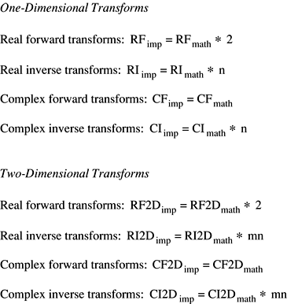

[Figure 2-7](#apple-f4xwc4dqnrsv64tfmyxwi33df52wszbpkridimbqga2tcnbxfvbuqmznge3dcojv) shows the mathematical formula for the one-dimensional forward Fourier transform.

__Figure 2-7__  1D forward Fourier transforms, general formula

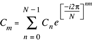

The values of the Fourier coefficients returned by the real forward transform as implemented (`RF`imp) are equal to the mathematical values (`RF`math) times 2:

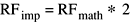

[Figure 2-8](#apple-f4xwc4dqnrsv64tfmyxwi33df52wszbpkridimbqga2tcnbxfvbuqmznge3denru) shows the mathematical formula for the inverse Fourier transform.

__Figure 2-8__  1D inverse Fourier transforms, general formula

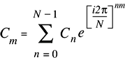

The values of the Fourier coefficients returned by the real inverse transform as implemented (`RI`imp) are equal to the mathematical values (`RI`math) times `N`:

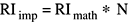

[Figure 2-7](#apple-f4xwc4dqnrsv64tfmyxwi33df52wszbpkridimbqga2tcnbxfvbuqmznge3dcojv) shows the mathematical formula for the one-dimensional forward Fourier transform.

The values of the Fourier coefficients returned by the complex forward transform as implemented (`CF`imp) are equal to the mathematical values (`CF`math):

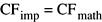

The values of the Fourier coefficients returned by the complex inverse transform as implemented (`CI`imp) are equal to the mathematical values (`CI`math) times `N`:

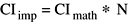

[Figure 2-9](#apple-f4xwc4dqnrsv64tfmyxwi33df52wszbpkridimbqga2tcnbxfvbuqmznge3dgnrv) shows the mathematical formula for the 2-dimensional forward Fourier transform.

__Figure 2-9__  2D forward Fourier transforms, general formula

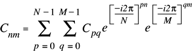

The values of the Fourier coefficients returned by the 2-dimensional real forward transform as implemented (`RF2D`imp) are equal to the mathematical values (`R2DF`math) times 2:

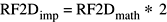

[Figure 2-10](#apple-f4xwc4dqnrsv64tfmyxwi33df52wszbpkridimbqga2tcnbxfvbuqmznge3dimry) shows the mathematical formula for the 2-dimensional inverse Fourier transform.

__Figure 2-10__  2D inverse Fourier transforms, general formula

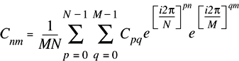

The values of the Fourier coefficients returned by the 2-dimensional real inverse transform as implemented (`RF2D`imp) are equal to the mathematical values (`R2DF`math) times `MN`:

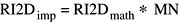

[Figure 2-9](#apple-f4xwc4dqnrsv64tfmyxwi33df52wszbpkridimbqga2tcnbxfvbuqmznge3dgnrv) shows the mathematical formula for the 2-dimensional forward Fourier transform.

The values of the Fourier coefficients returned by the 2-dimensional complex forward transform as implemented (`CF2D`imp) are equal to the mathematical values (`CF2D`math):

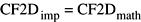

[Figure 2-10](#apple-f4xwc4dqnrsv64tfmyxwi33df52wszbpkridimbqga2tcnbxfvbuqmznge3dimry) shows the mathematical formula for the 2-dimensional inverse Fourier transform.

The values of the Fourier coefficients returned by the 2-dimensional complex inverse transform as implemented (`CI2D`imp) are equal to the mathematical values (`CI2D`math) times `MN`:

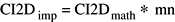

Using complex two-dimensional transforms as an example, when transforming data from the time domain to the frequency domain with [vDSP_fft_zop](https://developer.apple.com/documentation/accelerate/1450581-vdsp_fft_zop), no scaling factor is introduced. Transforming the image from the frequency domain to the time domain with `vDSP_fft_zop`, however, introduces a factor of `N`, where `N` is the vector length.

In the following example, a vector is transformed to the frequency domain, an inverse transform reconstructs it in the time domain, and then it is scaled by `1/N` to recover the original input (perhaps altered by machine rounding errors).

__Listing 2-1__  Scaling example

```
    ~
    ~
scale = 1.0/((float) FFT_LENGTH) ;
    ~
    ~
/* to the frequency domain */
vDSP_fft_zop(   setup,
           &A,
           1,
           &B,
           1,
           FFT_LENGTH_LOG2,
           FFT_FORWARD,
           ) ;

/* back to the time domain */
vDSP_fft_zop(   setup,
           &B,
           1,
           &A,
           1,
           FFT_LENGTH_LOG2,
           FFT_INVERSE,
           ) ;

/*scale the result */
vDSP_vsmul(     A.realp,
           1,
           &scale,
           A.realp,
           1,
           FFT_LENGTH/2.0f
           ) ;

vDSP_vsmul(     A.imagp,
           1,
           &scale,
           A.imagp,
           1,
           FFT_LENGTH/2.0f
           ) ;
    ~
    ~
```


