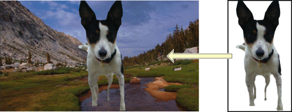

> 导航：[总目录](../../../README.md) · [documentation](../../../_indexes/documentation.md) · [vImage Programming Guide](Introduction%20to%20vImage%20Programming%20Guide.md)

[Next](Performing%20Image%20Transformation%20Operations.md)[Previous](Performing%20Histogram%20Operations.md)

# Performing Alpha Compositing Operations

Alpha compositing is a realm of image processing operations that blend two or more images to create a final composite image. The __alpha channel__ defines the degree to which the various images are blended.

Quartz 2D and most modern video cards do an excellent job of alpha compositing. vImage provides these functions for completeness. Developers who want to do image compositing should understand the principles of alpha compositing.

This chapter describes how to use the alpha compositing functions in vImage. By reading this chapter, you’ll:

- Learn the basics of alpha compositing with vImage
- Learn the difference between premultiplied and non-premultiplied alpha compositing
- Learn to convert back and forth between premultiplied and non-premultiplied alpha formats

## Alpha Compositing

Alpha compositing is a common image processing routine used to blend two or more images to create a final composite image. Alpha compositing is built upon the concept of layers — each image used in the composite image has a certain hierarchical layer. The image’s alpha channel determines how much of the images in layers underneath it can be seen at its own layer. In other words, the alpha channels control the transparency of the image, and alpha compositing uses the alpha channel to appropriately blend this image with another to exhibit this transparency. [Figure 6-1](#apple-f4xwc4dqnrsv64tfmyxwi33df52wszbpkridgmbqgaytambrfvbuqmrqhawvgvzs) illustrates this concept.

__Figure 6-1__  Example of composited layers

## Premultiplied Versus Non-Premultiplied Alpha Compositing

As with the commonly-used red, green, and blue channels, the alpha channel is a 2D array of pixel intensities. Depending on the image’s pixel format, its intensities may span the ranges of 0 to 255 (integers), or 0 to 1 (floats). In a _premultiplied alpha composite_, the values of the the alpha channel are multiplied to each of the of color channels, which alleviates the need to process the alpha channel any further. In a _non-premultiplied alpha composite_, the alpha channel still needs to be composited.

[Next](Performing%20Image%20Transformation%20Operations.md)[Previous](Performing%20Histogram%20Operations.md)
