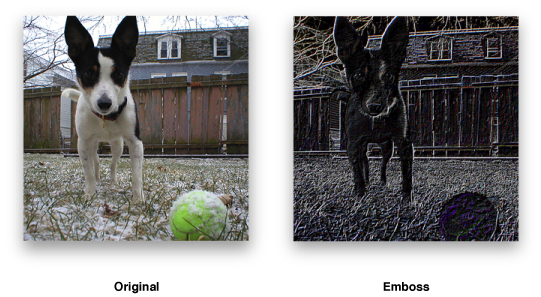
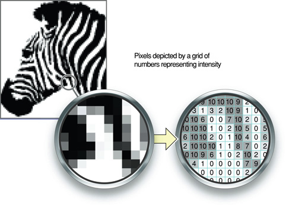
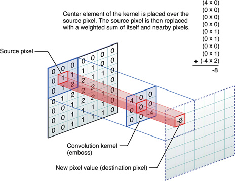
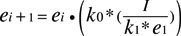
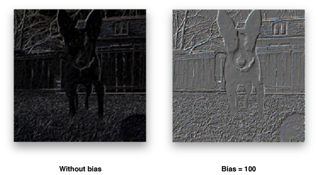
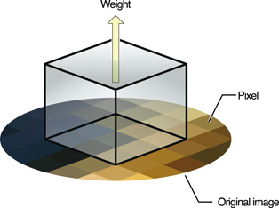
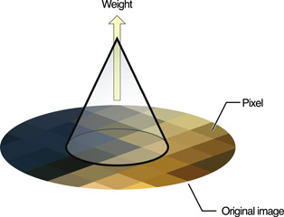
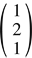
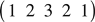
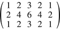

> 导航：[总目录](../../../README.md) · [documentation](../../../_indexes/documentation.md) · [vImage Programming Guide](Introduction%20to%20vImage%20Programming%20Guide.md)


[Next](Performing%20Geometric%20Operations.md)[Previous](Overview%20of%20vImage.md)

# Performing Convolution Operations

_Convolution_ is a common image processing technique that changes the intensities of a pixel to reflect the intensities of the surrounding pixels. A common use of convolution is to create image filters. Using convolution, you can get popular image effects like blur, sharpen, and edge detection—effects used by applications such as Photo Booth, iPhoto, and Aperture.

If you are interested in efficiently applying image filters to large or real-time image data, you will find the vImage functions useful. In terms of image filtering, vImage’s convolution operations can perform common image filter effects such as embossing, blurring, and, posterizing.

vImage convolution operations can also be useful for sharpening or otherwise enhancing certain qualities of images. Enhancing images can be particularly useful when dealing with scientific images. Furthermore, since scientific images are often large, using these vImage operations can become necessary to achieve suitable application performance. The kinds of operations that you’d tend to use this on are edge detection, sharpening, surface contour outlining, smoothing, and motion detection.

This chapter describes convolution and shows how to use the convolution functions provided by vImage. By reading this chapter, you’ll:

- See the sorts of effects you can get with convolution
- Learn what a kernel is and how to construct one
- Get an introduction to commonly used kernels and high-speed variations
- Find out, through code examples, how to apply vImage convolutions functions to an image

## Convolution Kernels

Figure 2-1 shows an image before and after processing with a vImage convolution function that causes the emboss effect. To achieve this effect, vImage performs convolution using a grid-like mathematical construct called a _kernel_.

__Figure 2-1__  Emboss using convolution



Figure 2-2 represents a 3 x 3 kernel. The height and width of the kernel do not have to be same, though they must both be odd numbers. The numbers inside the kernel are what impact the overall effect of convolution (in this case, the kernel encodes the emboss effect). The kernel (or more specifically, the values held within the kernel) is what determines how to transform the pixels from the original image into the pixels of the processed image. It may seem non-intuitive how the nine numbers in this kernel can yield an effect such as the previous emboss example. Convolution is a series of operations that alter pixel intensities depending on the intensities of neighboring pixels. vImage handles all the convolution operations based on the kernel that you supply. The kernel provides the actual numbers that are used in those operations (see [Figure 2-4](#apple-f4xwc4dqnrsv64tfmyxwi33df52wszbpkridgmbqgaytambrfvbuqmrqguwvgvzu) for the steps involved in convolution). Using kernels to perform convolutions is known as _kernel convolution_.

__Figure 2-2__  3 x 3 kernel


Convolutions are per-pixel operations—the same arithmetic is repeated for every pixel in the image. Bigger images therefore require more convolution arithmetic than the same operation on a smaller image. A kernel can be thought of as a two-dimensional grid of numbers that passes over each pixel of an image in sequence, performing calculations along the way. Since images can also be thought of as two-dimensional grids of numbers (or pixel intensities—see Figure 2-3), applying a kernel to an image can be visualized as a small grid (the kernel) moving across a substantially larger grid (the image).

__Figure 2-3__  An image is a grid of numbers



The numbers in the kernel represent the amount by which to multiply the number underneath it. The number underneath represents the intensity of the pixel over which the kernel element is hovering. During convolution, the center of the kernel passes over each pixel in the image. The process multiplies each number in the kernel by the pixel intensity value directly underneath it. This should result in as many products as there are numbers in the kernel (per pixel). The final step of the process sums all of the products together, divides them by the amount of numbers in the kernel, and this value becomes the new intensity of the pixel that was directly under the center of the kernel. Figure 2-4 shows how a kernel operates on one pixel.

__Figure 2-4__  Kernel convolution



Even though the kernel overlaps several different pixels (or in some cases, no pixels at all), the only pixel that it ultimately changes is the source pixel underneath the center element of the kernel. The sum of all the multiplications between the kernel and image is called the weighted sum. To ensure that the processed image is not noticeably more saturated than the original, vImage gives you the opportunity to specify a divisor by which to divide the weighted sum—a common practice in kernel convolution. Since replacing a pixel with the weighted sum of its neighboring pixels can frequently result in a much larger pixel intensity (and a brighter overall image), dividing the weighted sum can scale back the intensity of the effect and ensure that the initial brightness of the image is maintained. This procedure is called normalization. The optionally divided weighted sum is what becomes the value of the center pixel. The kernel repeats this procedure for each pixel in the source image.

__Note:__ To perform normalization, you must pass a divisor to the convolution function that you are using. Divisors that are an exact power of two may perform better in some cases. You can supply a divisor only when the image’s pixel type is `int`. floating-point convolutions do not make use of divisors. You can directly scale the floating-point values in the kernel to achieve the same normalization.

The data type used to represent the values in the kernel must match the data used to represent the pixel values in the image. For example, if the pixel type is `float`, then the values in the kernel must also be `float` values.

Keep in mind that vImage does all of this arithmetic for you, so it is not necessary to memorize the steps involved in convolution to be able to use the framework. It is a good idea to have an idea of what is going on so that you can tweak and experiment with your own kernels.

## Deconvolution

Deconvolution is an operation that approximately undoes a previous convolution—typically a convolution that is physical in origin, such as diffraction effects in a lens. Usually, deconvolution is a sharpening operation.

There are many deconvolution algorithms; the one vImage uses is called the Richardson-Lucy deconvolution.

The goal of Richardson-Lucy deconvolution is to find the original value of a pixel given the post-convolution pixel intensity and the number by which it was multiplied (the kernel value).

Due to these requirements, to use vImage’s deconvolution functions you must provide the convolved image and the kernel used to perform the original convolution. Represented as `k` in the following equation, the kernel serves as a way of letting vImage know what type of convolution it should undo. For example, sharpening an image (a common use of deconvolution) can be thought of as doing the opposite of a blur convolution. If the kernel you supply is not symmetrical, you must pass a second kernel to the function that is the same as the first with the axes interchanged.

Richardson-Lucy deconvolution is an iterative operation; your application specifies the number of iterations desired. The more iterations you make, the greater the sharpening effect (and the time consumed). As with any sharpening operation, Richardson-Lucy amplifies noise, and at some number of iterations the noise becomes noticeable as artifacts. Figure 2-5 shows the Richardson-Lucy algorithm expressed mathematically.

__Figure 2-5__  Richardson-Lucy deconvolution equation



In this equation:

- _I_ is the starting image.
- _ei_ is the current result and _ei + 1_ is being calculated; _e0_ is 0.
- _k0_ represents the kernel.
- _k1_ is a second kernel to be used if _k[0]_ is asymmetrical. If _k[0]_ is symmetrical, _k[0]_ is used as _k[1]_.
- The \* operator indicates convolution.
- The . operator indicates multiplication of each element in one matrix by the corresponding element in the other matrix.

As with convolution, vImage handles all the individual steps of deconvolution, thus it is not necessary to memorize the steps involved. When deconvolving, all you must provide is the original convolution kernel (plus an additional inverted convolution kernel if the original kernel is not symmetrical).

## Using Convolution Kernels

Now that you better understand the structure of kernels and the process behind convolution, it’s time to actually use a few vImage convolution functions. This section shows you how to perform the emboss shown in [Figure 2-1](#apple-f4xwc4dqnrsv64tfmyxwi33df52wszbpkridgmbqgaytambrfvbuqmrqguwvgvzx), and also explains the differences between convolving with and without bias.

### Convolving

vImage takes care of the specific convolution operations for you. Your job is to provide the kernel, or in other words, describe the effect that convolution should produce. Listing 2-1 shows how to use convolution to produce an emboss effect. To illustrate this effect, convolving the leftmost image in [Figure 2-1](#apple-f4xwc4dqnrsv64tfmyxwi33df52wszbpkridgmbqgaytambrfvbuqmrqguwvgvzx) produces the embossed image on the right. You could use the same code to produce a different effect, such as sharpening, by specifying the appropriate kernel.

__Listing 2-1__  Producing an emboss effect

```
int myEmboss(void *inData,
 unsigned int inRowBytes,
 void *outData,
 unsigned int outRowBytes,
 unsigned int height,
 unsigned int width,
 void *kernel,
 unsigned int kernel_height,
 unsigned int kernel_width,
 int divisor ,
 vImage_Flags flags )
{
    uint_8 kernel = {-2, -2, 0, -2, 6, 0, 0, 0, 0}; // 1
    vImage_Buffer src = { inData, height, width, inRowBytes }; // 2
    vImage_Buffer dest = { outData, height, width, outRowBytes }; // 3
    unsigned char bgColor[4] = { 0, 0, 0, 0 }; // 4
    vImage_Error err; // 5

    err = vImageConvolve_ARGB8888(    &src,     //const vImage_Buffer *src
                                        &dest,    //const vImage_Buffer *dest,
                                        NULL,
                                        0,    //unsigned int srcOffsetToROI_X,
                                        0,    //unsigned int srcOffsetToROI_Y,
                                        kernel,    //const signed int *kernel,
                                        kernel_height,     //unsigned int
                                        kernel_width,    //unsigned int
                                        divisor,    //int
                                        bgColor,
                                       flags | kvImageBackgroundColorFill
                                       //vImage_Flags flags
                                    );

    return err;
}
```

Here’s what the code does:

1. Declares the emboss kernel as an `int` array. The data type of the kernel values should match the intended data type of the corresponding vImage function. Because the code sample calls `vImageConvolve_ARGB8888`, the kernel values should be unsigned, 8-bit integers (`uint_8`). vImage expects the kernel elements to be in the array in left-to-right, 1st row, 2nd row, 3rd row order (see [Figure 2-2](#apple-f4xwc4dqnrsv64tfmyxwi33df52wszbpkridgmbqgaytambrfvbuqmrqguwvgvzw) to see how this ordered).
2. Declares `vImage_Buffer` data structure for the source image information. Image data is store as an array of bytes (`inData`). The other members store the height, width, and bytes-per-row of the image. This data allows vImage to know how large the image data array is, and how to properly handle it.
3. Declares a `vImage_Buffer` data structure for the destination image information as done previously with the source image.
4. Declares a `Pixel8888`-formatted pixel to represent the background color for the destination image (black in this case).
5. Declares a `vImage_Err` data type to store the convolution function’s return value.

After that, the code sends the declared values as parameters to the `vImageConvolve_ARGB8888` function where vImage handles the processing and stores the result in `dest`. The `vImageConvolve_ARGB8888` function is only one of several convolution functions available in vImage. vImage typically offers four variants of the same function—each for a different image format. The `ARGB8888` suffix lets you know this function is intended for interleaved (full-color) images, where each pixel is a grouping of four 8-byte integers representing the alpha (A), red (R), green (G), and blue (B) channels. For more details on the image formats vImage uses, refer to [Image Formats Available in vImage](Overview%20of%20vImage.md#apple-f4xwc4dqnrsv64tfmyxwi33df52wszbpkridgmbqgaytambrfvbuqmrqgiwvgvzs).

In order for vImage to acknowledge the appropriate flags, the sample `myEmboss` function accepts a `vImage_Flags` parameter. This parameter represents a composite of one or more flags that the caller of `myEmboss` submitted. When the example then calls the vImage `vImageConvolve_ARGB8888` function, it passes those same flags, but this time combined with an additional specific flag constant, `kvImageBackgroundColorFill`. It does this by using the OR bitwise operator (`|`) to combine several flags into single composition of flags that can be represented with one variable. This is the standard way to signal flags to vImage. This code example requests that vImage use the provided background image color (along with whichever flags were initially passed to the function).

To become familiar with kernel effects, try using the values from the following two kernels in your own code. Figure 2-6 shows the kernel for producing a Gaussian blur, and Figure 2-7 shows a Prewitt filter, which is a kernel for edge detection.

__Figure 2-6__  A kernel for Gaussian blur


__Figure 2-7__  A kernel for edge detection


### Convolving with Bias

vImage gives you the option to perform convolution with bias or without. Bias is the value that you can add to each element in a convolution result to add additional influence from neighboring pixels. Since with certain convolutions it is possible to get negative numbers (which are not representable in a 0–255 format), bias prevents the signal from drifting out of range. You can choose to add a bias of 127 or 128 to allow some negative numbers to be representable (with an implicit +127 or +128 in their value). The overall effect of a bias brightens or darkens the image.

For every standard convolution function in vImage (such as `vImageConvolve_PlanarF`), there is a corresponding version that uses bias, indicated by “`WithBias`” in the function name (`vImageConvolveWithBias_PlanarF`, for example). Using the biased functions is virtually identical to the non biased functions, with the exception of the additional `bias` parameter you must pass to the convolution functions that use bias. The data type for the `bias` parameter must match that of the pixel data in the image. See _[vImage Convolution Reference](https://developer.apple.com/documentation/accelerate/vimage/vimage_operations/convolution)_ for details on using these functions.

__Figure 2-8__  Bias versus No Bias



### Using High-Speed Filters

vImage also offers functions for specific types of convolution that can be significantly faster than general convolution. Starting in OS X v.10.4, you have the option to use the supplied box and tent filter functions for integer formats `Planar_8` and `ARGB8888`. These filters perform blur operations. The functions’ names are from their shape when graphed in a cartesian coordinate system. They are equivalent to convolving with certain simple kernels, but you do not need to supply any kernel. These functions can be orders of magnitude faster than performing an equivalent convolution using custom kernels.

__Note:__ vImage does not provide floating-point versions of these functions because the constant cost algorithm relies on exact arithmetic to be robust. Rounding differences in the floating-point computation can leave artifacts in the image in low intensity areas near high intensity areas.

Box filters blur images by replacing each pixel in an image with the un-weighted average of its surrounding pixels. The operation is equivalent to applying a convolution kernel filled with all 1s. The box functions available in vImage are [vImageBoxConvolve_Planar8](https://developer.apple.com/documentation/accelerate/1515941-vimageboxconvolve_planar8) and [vImageBoxConvolve_ARGB8888](https://developer.apple.com/documentation/accelerate/1515945-vimageboxconvolve_argb8888). Each resulting pixel is the mean of surrounding pixels as defined by the kernel height and width.

__Figure 2-9__  Box filter



You use tent filters to blur each pixel of an image with the weighted average of its surrounding pixels. The tent functions available in vImage are [vImageTentConvolve_Planar8](https://developer.apple.com/documentation/accelerate/1515934-vimagetentconvolve_planar8) and [vImageTentConvolve_ARGB8888](https://developer.apple.com/documentation/accelerate/1515935-vimagetentconvolve_argb8888). These blur operations are equivalent to applying a convolution kernel filled with values that decrease with distance from the center. As with [vImageBoxConvolve_Planar8](https://developer.apple.com/documentation/accelerate/1515941-vimageboxconvolve_planar8) and [vImageBoxConvolve_ARGB8888](https://developer.apple.com/documentation/accelerate/1515945-vimageboxconvolve_argb8888), you do not need to pass any kernel to the function — just the height and width. Specifically, for an M x N kernel size, the kernel would be the product of an M x 1 column matrix and a 1 x N row matrix. Each would have 1 as the first element, then values increasing by 1 up to the middle element, then decreasing by 1 to the last element.

__Figure 2-10__  Tent filter



For example, suppose the kernel size is 3 x 5. Then the first matrix is



and the second is



The product is



The 3 x 5 tent filter operation is equivalent to convolution with the above matrix.

### Using Multiple Kernels

vImage allows you to apply multiple kernels in a single convolution. The `vImageConvolveMultiKernel` functions allow for you to specify four separate kernels—one for each channel in the image. This allows for a greater level of control when applying filters to an image since you can operate on the red, green, blue, and alpha channels individually. For example, you can use multikernel convolutions to resample the color channels of an image differently to compensate for the positioning of RGB phosphors on the screen. Since each of the four kernels can operate on a single channel, the `vImageConvolveMultiKernel` functions are available only for interleaved image formats.

The use of these functions is identical to convolution with a single kernel, except that you must supply an array of pointers to the four kernels instead of one single kernel.

## Deconvolving

As with the operations behind convolution, vImage takes care of performing the previously mentioned Richardson-Lucy algorithm for you. Your job is to provide the kernel (referred to as the point spread function) of the initial convolution. Listing 2-2 shows how to deconvole an emboss effect. You could use the same code to deconvolve various effects, such as blurring, by specifying the appropriate kernel. Note that unlike the convolution operations, there is an additional kernel parameter. This parameter can be `NULL` unless the height and width of the kernel are not the same size. If the kernel height and width are unequal, you must supply an identical kernel, but with its rows and columns inverted.

Listing 2-2 is an example of how to use vImage to deconvolve an `ARGB8888`-formatted image.

__Listing 2-2__  Deconvolving an embossed image

```
int myDeconvolve(void *inData,
 unsigned int inRowBytes,
 void *outData,
 unsigned int outRowBytes,
 unsigned int height,
 unsigned int width,
 void *kernel,
 unsigned int kernel_height,
 unsigned int kernel_width,
 int divisor,
 int iterationCount,
 vImage_Flags flags )
{
    //Prepare data structures
    uint_8 kernel = {-2, -2, 0, -2, 6, 0, 0, 0, 0}; // 1
    vImage_Error err; // 2
    unsigned char bgColor[4] = { 0, 0, 0, 0 }; // 3
    vImage_Buffer src = { inData, height, width, inRowBytes }; // 4
    vImage_Buffer dest = { outData, height, width, outRowBytes }; // 5

    //Send data to vImage for processing

    err = vImageRichardsonLucyDeConvolve_ARGB8888(    &src,     // 6
                                        &dest,    //const vImage_Buffer *dest,
                                        NULL,
                                        0,    //unsigned int srcOffsetToROI_X,
                                        0,    //unsigned int srcOffsetToROI_Y,
                                        kernel,    //const signed int *kernel,
                                        NULL, //assumes symmetric kernel
                                        kernel_height,     //unsigned int kernel_height,
                                        kernel_width,    //unsigned int kernel_width,
                                        0, //height of second kernel
                                        0, //width of second kernel
                                        divisor,    //int
                                        0, //for second kernel
                                        bgColor,
                                        iterationCount, //uint32_t
                                        kvImageBackgroundColorFill | flags
                                        //vImage_Flags
                                    );

    //Report result
    return err; // 7
}
```

Here’s what the code does:

1. Specifies the kernel used in the original convolution that vImage should deconvolve. The example uses a symmetrical kernel (both the height and width are 3), and therefore it isn’t necessary to supply a second kernel to vImage.
2. Declares the `vImage_Error` structure to capture the result of the deconvolution function.
3. Declares a `Pixel8888`-formatted pixel to represent the background color for the destination image (black in this case).
4. Declares a `vImage_Buffer` data structure for the source image information. Image data is received as an array of bytes (`inData`). The other members store the height, width, and bytes-per-row of the image. This data allows vImage to know how large the image data array is, and how to properly handle it.
5. Declares a `vImage_Buffer` data structure for the destination image information as done previously with the source image.
6. Supplies the previously declared data structures to vImage for processing. Note how the example supplies the `vImageRichardsonDeConvolve_ARGB8888` function with a `NULL` parameter for the second kernel. This is because the first kernel is symmetric, and therefore inverted kernel is not necessary.
7. Returns the same `vImage_Error` data structure returned from deconvolution.

Deconvolution is an iterative process. You can specify how many times that you would like vImage to perform the deconvolution. Depending on how many iterations you choose, the image result may vary, so it may be worth experimenting with several iterations to see which one yields ideal results.

[Next](Performing%20Geometric%20Operations.md)[Previous](Overview%20of%20vImage.md)
