> 导航：[总目录](../../../README.md) · [documentation](../../../_indexes/documentation.md) · [vImage Programming Guide](Introduction%20to%20vImage%20Programming%20Guide.md)


[Next](Performing%20Morphological%20Operations.md)[Previous](Performing%20Convolution%20Operations.md)

# Performing Geometric Operations

Unlike convolutions, which enhance or filter images, geometric operations distort the geometry of images. Image rotation, scaling, and resizing are examples of geometric operations. They involve changing the shape of an image by modifying its geometric properties, such as the height, width, and the angles in its form.

Developers who are in search of efficient ways to alter the geometric properties of images in real time will find these vImage operations useful. In particular, vImage’s geometric operations are well suited for:

- Applying arbitrary rotations to large images in real time
- Changing the perspective of large images in real time
- Scaling large images efficiently

vImage’s geometry transforms usually look better than what you get from Quartz 2D or Core Image since vImage uses Lanczos resampling methods by default (rather than simpler approaches like linear interpolation). This makes vImage’s transforms less susceptible to Moire patterns and offer better image fidelity.

This chapter describes the various classes of geometric operations vImage offers, and explains how to use them. By reading this chapter you’ll:

- See the types of effects geometric operations can produce
- Learn how resampling works and why it can be necessary when performing geometric operations
- Find out, through code samples, how to apply vImage geometric operations to images

## Geometric Operations Overview

Although often simple conceptually, geometric operations (such as rotating an image by an arbitrary angle) can be computationally expensive. vImage provides both high-level and low-level functions for performing these operations efficiently. vImage offers several types of geometric operations, each meant to distort the geometry of the initial image in a different way.

Here are some of the geometric operations available in vImage:

- Affine warp
- Horizontal reflect
- Vertical reflect
- Horizontal shear
- Vertical shear
- Rotation
- Scale

Affine Warp shows one of the available scaling functions.

__Figure 3-1__  Scaling

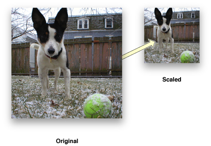

This function scales images in `ARGB8888` format:

```
vImageScale_ARGB8888( inBuffer, outBuffer, NULL, flags );
```

The function scales the image by comparing the height and width of the original image (passed through the `inBuffer` parameter) and the height and width of the destination image (passed through the `outBuffer` parameter).

All of the geometric operations that vImage provides are examples of affine transformations. An affine transformation is the most general of linear transformations on an image. Under this transformation, all parallel lines in an image remain parallel. Figure 3-2 shows a basic affine transformation (notice how all parallelism is maintained).

__Figure 3-2__  An affine transformation

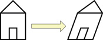

Affine transformations work by mapping each pixel in the source image (based on its [_x_, _y_] coordinate location) to a new location [_x’_, _y’_] in the destination image based on this simple arithmetic formula:

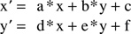

Affine transformations can also be described in terms of matrix arithmetic. The transformation is determined by an affine transform matrix

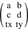

according to the formula

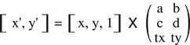

_tx_ and _ty_ are each symbols for individual values. The additional component “1” on the right side is not part of the location of the source pixel; it is added here to represent the affine transformation as a matrix multiplication. In fact, it is customary to add an extra coordinate to the result vector and represent the affine transformation as

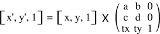

This makes it easier to calculate the inverse transformation, since the 3 x 3 matrix can be inverted.

The affine transformation can be decomposed into two less general transformations: a linear transformation followed by a translation (in both the _x_ and _y_ directions). The linear transformation is defined as

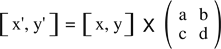

The translation simply adds _tx_ to the x-coordinate, and _ty_ to the y-coordinate.

The `vImage_AffineTransform` structure, which contains an affine transformation matrix, is the same as the `CGAffineTransform` data type. See _[CGAffineTransform Reference](https://developer.apple.com/documentation/coregraphics/cgaffinetransform-rb5)_ for the functions used for creating and manipulating matrices.

Unlike convolutions, geometric operations distort the geometry of images. As a result, the number of pixels in the output image might differ from the number of pixels in the input image. Take, for example, the affine warp shown in Figure 3-3.

__Figure 3-3__  Affine warp

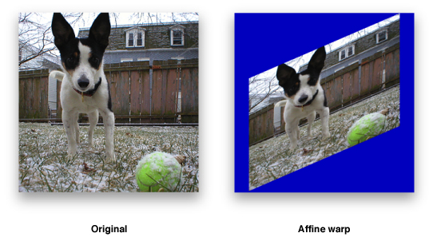

In this example it’s clear that area of the output image is different from the original image because the height, width, and angles have been changed. When an image processing function is unable to maintain a one-to-one mapping between each pixel in the source image and each pixel in the destination image, it must use something called a resampling filter to get the desired pixel values in the destination image. You will learn how vImage handles resampling filters in greater detail in the next section.

## Resampling

Changing the dimensions of a digital image (as done in scaling and rotation) can potentially create unintended features to appear in the image. Many of these features occur when trying to evaluate pixels at fractional pixel locations. Most of the vImage geometric functions use a process known as _resampling_ in order to avoid creating artifacts, such as interference patterns, in the destination image. vImage performs resampling using kernels, which combine data from a target pixel and other nearby pixels to calculate a value for the destination pixel. This is very similar to convolution.

However, in the geometric operations, the resampling kernel must itself be resampled during the process of pairing kernel values against the sampled pixel data. vImage must evaluate the kernel at fractional pixel locations (“in-between” pixels), in addition to integral pixel locations. Consequently, instead of using an M x N matrix for the kernel (as the convolution operations do), the operations use a kernel function that can be evaluated at both fractional and integral pixel locations. This resampling kernel function is called a _resampling filter_, or simply a filter.

For almost all geometric operations, vImage supplies a default resampling filter. The default resampling filters are implementations of the commonly used Lanczos resampling method. The Lanczos resampling method usually produces better-looking results than simpler approaches such as linear interpolation. However, the Lanczos method can produce ringing effects near regions of high frequency signals (such as line art). vImage provides two variations to choose from. If you do not set the `kvImageHighQualityResampling` flag for the call, vImage uses a `Lanczos3` filter. If you do set the flag, vImage uses a `Lanczos5` filter. A `Lanczos5` filter does higher-quality resampling than a `Lanczos3` filter but is slower to use.

The `Rotate` functions use resampling. The `Rotate90` functions do not.

The shear functions are a special case. They can use a default filter, but they also permit you to specify a custom filter of your own. You can use this feature when you need increased control over the operation.

__Listing 3-1__  Creating a default resampling filter for a shear function

```
ResamplingFilter filter = vImageNewResamplingFilter( float scale, vImage_Flags kvImageNoFlags )
```

The procedure is different if you want to provide a custom resampling filter. Because the shear functions operate on a line-by-line basis, a resampling kernel used with a shear function is one-dimensional, a 1 x N matrix. Consequently, the resampling filter for a shear function can be modeled as a one-dimensional function _y = f(x)_. When using a custom filter, you must provide a routine that evaluates your function _f(x)_ on an array of _x_ values. At the same time you can, if desired, normalize the filter over the given array of _x_ values. (This is the main reason your routine is required to evaluate your filter on an array of _x_ values, rather than a single _x_ value. It also improves performance.) To normalize the filter over an array of _x_ values, you scale the filter values so that they add up to 1.0. If you do not do this, interference patterns may emerge in the resulting image.

### Creating a Resampling Filter

When you call a shear function, you must pass a parameter of type `ResamplingFilter`, regardless of whether you want to use a custom resampling filter or not.

If you want to use a default resampling filter, you create it by calling `vImageNewResamplingFilter` (as previously seen in [Listing 3-1](#apple-f4xwc4dqnrsv64tfmyxwi33df52wszbpkridgmbqgaytambrfvbuqmrqgywvgvzs)). This creates a new `ResamplingFilter` object that represents a default filter—a `Lanczos3` filter if you do not set the `kvImageHighQualityResampling` flag, or a `Lanczos5` filter if you do set that flag. You do not need to provide a filter function when you make this call.

The same `ResamplingFilter` object can be used in multiple shear function calls. However, the filter includes a scaling factor. If you want to use a different scaling factor, you must create a new filter.

When you are done using a `ResamplingFilter` object created by a call to `vImageNewResamplingFilter`, dispose of it by calling `vImageDestroyResamplingFilter`. Do not attempt to directly deallocate the object’s memory yourself.

If you want to create a `ResamplingFilter` object that represents your custom resampling filter, you create it by calling `vImageNewResamplingFilterForFunctionUsingBuffer`. You must pass a pointer to your custom filter function. `vImageNewResamplingFilterForFunctionUsingBuffer` creates the `ResamplingFilter` object in a buffer that you allocate directly. See _[vImage Geometry Reference](https://developer.apple.com/documentation/accelerate/vimage/vimage_operations/geometry)_ for the details of usage. When you are done using the object, you must deallocate its memory yourself. Do not pass a `ResamplingFilter` object created by `vImageNewResamplingFilterForFunctionUsingBuffer` to `vImageDestroyResamplingFilter`.

To get the size of the buffer required for a custom `ResamplingFilter` object, call `vImageGetResamplingFilterSize`. Both the default `ResamplingFilter` and the custom `ResamplingFilter` objects include a scale factor that you provide. This scale factor is used to scale the transformed image in the shear operation.

### A Sample Custom Resampling Filter

Listing 3-2 shows how to declare and use a custom resampling filter function. The underlying filter function is `y = 1.0 – |x|`. The custom filter must evaluate that function on an array of _x_ values. The filter may not be normalized over that range of _x_ values. You can normalize it within the routine by dividing by the sum of the result values, as shown. This routine does not use `userData`.

__Listing 3-2__  Using a custom filter function

```
void MyLinearInterpolationFilterFunc(const float* xArray,
 float* yArray,
 int count,
 void* userData )
{
    int i;
    float sum = 0.0f;
    //Calculate kernel values
    for( i = 0; i < count; i++ )
    {
        float unscaledResult = 1.0f - fabs( xArray[i] );    //LERP
        yArray[i] = unscaledResult;
        sum += unscaledResult;
    }
    //Make sure the kernel values sum to 1.0. You can use some other  value here.
    //Values other than 1.0 will cause the image to lighten or darken.
    sum = 1.0f / sum;
    for( i = 0; i < count; i++ )
        yArray[i] *= sum;
}
```

## Frequently Used Operations

Rotations and scaling are the most common geometric operations, and vImage’s scaling and rotation functions are particularly suited for developers that need these scalings to look as clean as possible. Applications that manage photo layout (like iPhoto’s digital photo books) are perfect candidates for this. Listing 3-3 shows how to rotate an image that is in `ARGB8888` format.

__Listing 3-3__  Rotating an image by a specified angle using vImageRotate_ARGB8888

```
int MyRotateFilter(void *inData, unsigned int inRowBytes, void *outData, unsigned int outRowBytes, unsigned int height, unsigned int width, void *kernel, unsigned int kernel_height, unsigned int kernel_width, int colorChannel, vImage_Flags flags )
{
    vImage_Buffer in = { inData, height, width, inRowBytes };
    vImage_Buffer out = { outData, height, width, outRowBytes };
    TransformInfo *info = kernel;
    float angle = info->rotate * 2.0f * M_PI / 360.0f;
    Pixel_8888 backColor;

    backColor[0] = UCHAR_MAX * info->a;
    backColor[1] = UCHAR_MAX * info->r;
    backColor[2] = UCHAR_MAX * info->g;
    backColor[3] = UCHAR_MAX * info->b;

    return vImageRotate_ARGB8888( &in, &out, NULL, angle, backColor, flags );
}
```

### Rotation

When performing rotation, vImage maps the center point of the source image to the center point of the destination image. No scaling is done. Depending on the relative sizes of the source image and destination image, parts of the source image may be clipped, and areas outside the source image may appear in the destination image. Figure 3-4 shows a rotated photo of a dog, but portions of the image appear clipped since they now reside outside the image buffer (these regions are colored with a caller-supplied background color).

__Figure 3-4__  Rotated image with clipping

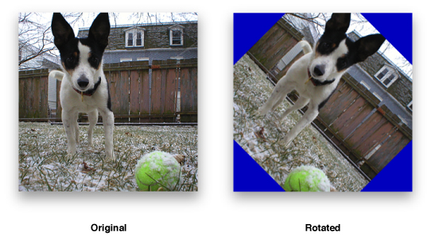

### 90 Degree Rotation

This rotation operation rotates a source image by either 0, 90, 180, or 270 degrees (depending on a value you supply). vImage maps the center point of the source image to the center point of the destination image. No scaling or resampling is done. Depending on the relative sizes of the source image and destination image, parts of the source image may be clipped, and areas outside the source image (colored with a background color you supply) may appear in the destination image (as seen in [Figure 3-4](#apple-f4xwc4dqnrsv64tfmyxwi33df52wszbpkridgmbqgaytambrfvbuqmrqgywvgvzw)).

Because no resampling is done—instead, individual pixels are copied unchanged to new locations—this function places certain restrictions on the pixel heights and widths of the source and destination buffers, so that it can map the center of the source to the center of the destination precisely. The restrictions are these:

- If you are rotating an image 90 or 270 degrees, the height in pixels of the source image and the width of the destination image must both be even or both be odd; and the width of the source image and the height of the destination image must both be even or both be odd.
- If you are rotating an image 0 or 180 degrees, the height in pixels of the source image and the destination image must both be even or both be odd; and the width of the source image and the destination image must both be even or both be odd.

If your images do not meet these restrictions, you can use the general (higher-level) `Rotate` function instead.

### Horizontal Reflections

A horizontal reflection creates a mirror image of the input image by reflecting about the y-axis of the image. This can be thought of as placing an imaginary line from the top of the image to the bottom, and swapping each pixel on one side with the corresponding pixel on the other side. Figure 3-5 shows an example of a horizontal reflection operation.

__Figure 3-5__  Horizontal reflect

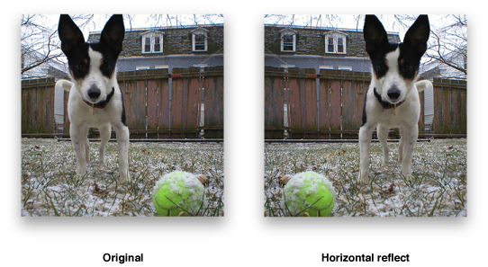

### Vertical Reflections

A vertical reflection is identical to a horizontal reflect, except it reflects about the x-axis instead. Figure 3-6 shows an example of a vertical reflection operation.

__Figure 3-6__  Vertical reflect

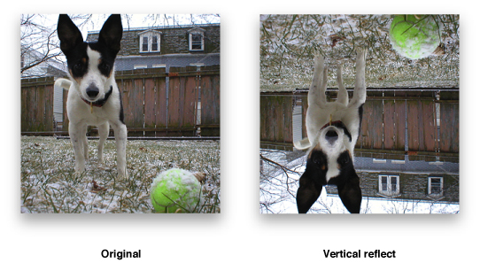

### Horizontal Shear

vImage’s horizontal shear function does shearing, translation, and scaling (in the horizontal dimension only) on a source image. The shear functions (and `Rotate90`) serve as the foundation upon which many of vImage’s other functions are implemented. In a simple horizontal shearing operation (no scaling or translation), a rectangular region of interest is mapped into a parallelogram whose top and bottom are parallel to the original rectangle, and whose sides are slanted at a particular slope. The height of the parallelogram is the same as the height of the original rectangle.

The operation starts at the bottom of the rectangle and shifts each row of pixels to the right by an amount proportional to that row’s distance from the bottom of the rectangle. The shift amount may be fractional for some rows, and so resampling must be done to assign appropriate pixel values without introducing interference patterns or other artifacts.

vImage allows you to specify the resampling filter. It can either be a default supplied by vImage—a Lanczos kernel—or a custom resampling filter you provide. In either case you pass a `ResamplingFilter` object to the horizontal shear function. The `ResamplingFilter` object you supply must contain the information necessary to calculate the resampling filter. It also contains a scale factor, which scales the transformed image in the horizontal direction.

In addition to simple shearing and scaling, the vImage horizontal shearing function allows you to specify a horizontal translation value, which shifts the transformed image to the left or the right in the destination buffer.

As the region of interest is sheared, translated, and scaled, source pixels from outside the region of interest (but inside the source image) may appear in the destination buffer. In fact, vImage shears, translates, and scales as much of the source image as it needs to in order to attempt to fill the destination buffer. In addition, areas from outside the source image may appear in the destination image. These are assigned colors using either the background color fill technique or the edge extend technique, depending on a flag setting.

The size (number of rows and number of columns) of the destination buffer is also used to determine the size of the region of interest in the source buffer. The origin of both the region of interest and the destination buffer are assumed to be in the lower-left corner. If there is no translation, then the lower-left corner of the region of interest (not necessarily of the source image, which may be different) is mapped to the lower-left corner of the destination image. (The `vImage_Buffer` data pointer points to the top-left corner of the image, as always.)

Figure 3-7 shows the photo after a horizontal shear operation with no translation component.

__Figure 3-7__  Horizontal shear

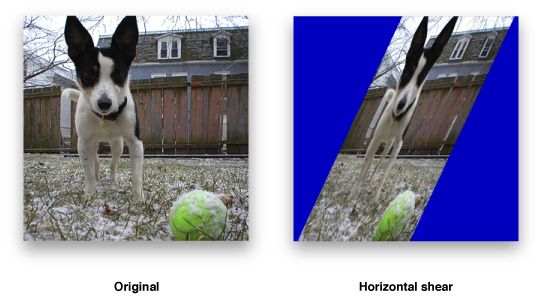

### Vertical Shear

vImage’s vertical shear function does shearing, translation, and scaling (in the vertical dimension only) on a source image. In a simple vertical shearing operation (no scaling or translation), a rectangular region of interest is mapped into a parallelogram whose left and right edges are parallel to the original rectangle, and whose top and bottom edges are slanted at a particular slope. The width of the parallelogram is the same as the width of the original rectangle, and the height of the parallelogram (the height of any column) is the same as the height of the original rectangle.

The vertical shear starts at the left edge of the rectangle and shifts each row of pixels up by an amount proportional to that row’s distance from the bottom of the rectangle. The shift amount may be fractional for some rows, and so resampling must be done to assign appropriate pixel values without introducing interference patterns or other artifacts.

vImage allows you to specify the resampling filter. It can either be a default filter supplied by vImage—a Lanczos kernel—or a custom resampling filter supplied by the user. In either case you pass a `ResamplingFilter` object to the vertical shear function. The `ResamplingFilter` object you supply must contain the information necessary to calculate the resampling filter. It also contains a scale factor, which scales the transformed image in the vertical direction.

In addition to simple shearing and scaling, the vImage vertical shearing function allows you to specify a vertical translation value, which shifts the transformed image up or down in the destination buffer.

As the region of interest is sheared, translated, and scaled, source pixels from outside the region of interest (but inside the source image) may appear in the destination buffer. In fact, vImage shears, translates, and scales as much of the source image as it needs to in order to attempt to fill the destination buffer. In addition, areas from outside the source image may appear in the destination image. These outside areas are assigned colors using either the background color fill technique or the edge extend technique, depending on a flag setting.

Figure 3-8 shows a picture after a vertical shear operation.

__Figure 3-8__  Vertical shear

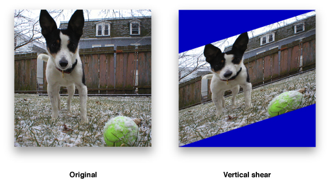

### Affine Warp

Using functions such as [vImageAffineWarp_ARGB8888](https://developer.apple.com/documentation/accelerate/1509182-vimageaffinewarp_argb8888) you can perform customized affine transformations that combine the effects of various rotations, shears, and reflections into a single function call. You do this by first constructing a `vImage_AffineTransform` data type which represents your affine transformation matrix. You can then pass this as a parameter (along with the rest of your image data) to the various affine warp functions vImage offers.

[Next](Performing%20Morphological%20Operations.md)[Previous](Performing%20Convolution%20Operations.md)
