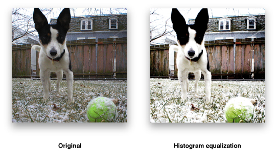

> 导航：[总目录](../../../README.md) · [documentation](../../../_indexes/documentation.md) · [vImage Programming Guide](Introduction%20to%20vImage%20Programming%20Guide.md)


[Next](Performing%20Alpha%20Compositing%20Operations.md)[Previous](Performing%20Morphological%20Operations.md)

# Performing Histogram Operations

Histogram operations calculate histograms of images or manipulate a histogram to modify an image. A __histogram__ is a statistic that shows the frequency of a certain occurrence within a data set. In the graphics domain, histograms can be used to plot the frequencies of certain pixel intensities.

Developers who are interested in the following will find histograms useful:

- Image calibration
- Image contrasting
- Normalizing image intensity

## Histogram Operations Overview

There are a number of reasons to apply histogram operations to an image. An image may not make full use of the possible range of intensity values—for example, most of its pixels may be fairly dark, making details difficult to see. Changing the image so that it has a more uniform histogram can improve contrast. Also, it may be easier to compare two images (with respect to texture or other aspects) if you change each histogram to match some standard histogram.
Histogram operations are point operations: that is, the intensity of a destination pixel depends only on the intensity of the source pixel, modified by values that are the same over the entire image. Two pixels of the same intensity always map to two pixels of the same (but presumably altered) intensity. If the original image has N different intensity values, the transformed image will have at most N different intensity levels represented.

The vImage histogram functions either calculate histograms or perform one of these point operations:

- Contrast stretching transforms an image so that its intensity values stretch out along the full range of intensity values. It is best used on images in which all the pixels are concentrated in one area of the intensity spectrum, and intensity values outside that area are not represented.
- Ends-in contrast stretching is a more complex version of the contrast stretch operation. These types of functions are best used on images that have some pixels at or near the lowest and highest values of the intensity spectrum, but whose histogram is still mainly concentrated in one area.

  The ends-in contrast stretch functions map all intensities less than or equal to a certain level to 0; all intensities greater than or equal to a certain level to 255; and perform a contrast stretch on all the values in between. The two given intensity values do not directly define the low and high levels; percentages do: the ends-in contrast stretch operation must find intensity levels such that a certain percent of pixels are below one of the intensity values, and a certain percent are above the other intensity value.
- __Histogram equalization__ transforms an image so that it has a more uniform histogram. A truly uniform histogram is one in which each intensity level occurs with equal frequency. These functions approximate that histogram. [Figure 5-1](#apple-f4xwc4dqnrsv64tfmyxwi33df52wszbpkridgmbqgaytambrfvbuqmrqg4wvgvzs) is an example of equalization.

  __Figure 5-1__  Example of equalization

  
- _Histogram specification_ transforms an image so that its histogram more closely resembles a given histogram. This is a method of image calibration. You can make two images have the same tonal qualities by changing one image to conform to the histogram of another. This may help them to look like they were shot on the same day with the same film and light conditions.

## Using Histogram Operations

Listing 5-1 shows how you can apply an equalization operation to a `Planar8` image.

__Listing 5-1__  Histogram equalization example

```
int MyEqualization(void *inData, unsigned int inRowBytes, void *outData, unsigned int outRowBytes, unsigned int height, unsigned int width, void *kernel, unsigned int kernel_height, unsigned int kernel_width, int divisor, vImage_Flags flags )
{
    vImage_Error err; // 1
    vImage_Buffer src = { inData, height, width, inRowBytes }; // 2
    vImage_Buffer       dest = { outData, height, width, outRowBytes }; // 3

    err = vImageEqualization_Planar8(    &src,
                                        &dest,
                                        flags
                                    ); // 4
    return err; // 5
}
```

Here’s what the code does:

1. Declares a `vImage_Err` data type to store the equalization function’s return value.
2. Declares a `vImage_Buffer` data structure for the source image information. Image data is stored as an array of bytes (`inData`). The other members store the height, width, and bytes-per-row of the image. This data allows vImage to know how large the image data array is so that vImage knows how to properly handle it.
3. Declares a `vImage_Buffer` data structure for the destination image information as it did previously the source image.
4. Calls vImage’s equalization function an stores the result in the `vImage_Error` data type it previously declared.
5. Passes any potential error codes up to the calling function.

## Common Applications

Histograms are useful for calibrating images obtained from different sources. Say, for example, you have images that are oversatured in a specific channel. You can apply a histogram specification at calibrate the image to a histogram that meets your goals.

In the field of scientific imaging, histograms can be useful in interpreting subtle qualities of an image. For example, for a graphic of a thermodynamic reading, imagine how useful it would be to analyze the histogram and tell how frequently colors of a certain intensity occur. You would be able to determine how “warm” or “cold” a region was based on the values in the histogram.

In general, histogram operations save you time when you need to analyze pixel intensity data from an image, or get an image to conform to a specific color setting.

[Next](Performing%20Alpha%20Compositing%20Operations.md)[Previous](Performing%20Morphological%20Operations.md)
