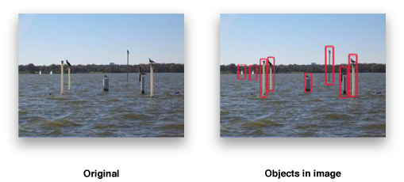
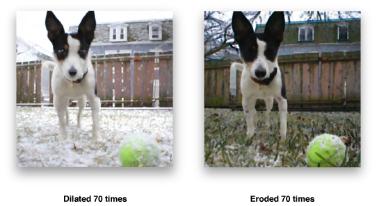
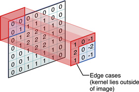

> 导航：[总目录](../../../README.md) · [documentation](../../../_indexes/documentation.md) · [vImage Programming Guide](Introduction%20to%20vImage%20Programming%20Guide.md)


[Next](Performing%20Histogram%20Operations.md)[Previous](Performing%20Geometric%20Operations.md)

# Performing Morphological Operations

Morphological operations alter the intensities of specific regions of an image. Unlike the convolution or geometric operations which affect an entire image, morphological operations isolate certain sections of an image (acknowledging them as either foreground or background) and then expands or contracts just those regions to achieve a desired effect.

Developers who are looking for efficient ways to enhance or isolate qualities of an image that are found in either the foreground or the background of an image will find the morphological operations in vImage useful. For example, you can apply morphological operations to scientific images of the terrain of Mars to perform topological analyses that isolate the craters and valleys along the planet’s surface. In general, morphological operations are well-suited for:

- Isolating background features from foreground features in an image (and vice-versa)
- Performing feature detection
- Performing motion planning of an object along a surface with visible obstacles

This chapter describes the basics of image processing using morphology. By reading this chapter, you’ll:

- See the types of tasks morphological operations can perform
- Learn how images and objects differ, and how vImage operates upon objects
- Find out, through code samples, how to apply morphological operations to images

## Objects

The target of vImage morphological operations differs from that of the other types of operations found in vImage. Instead of applying an operation to an entire image, vImage applies morphological operations to an _object_. An object is composed of either the brightest pixels in an image or the darkest pixels in the image, where brightness is defined relative to the particular image.

Figure 4-1 shows objects outlined in an image.

__Figure 4-1__  Example of objects in an image



Morphological functions change the shape of an object by performing dilation, erosion, maximum, and minimum operations. Dilation expands objects. Erosion contracts them. Maximum is a special case of dilation, while minimum is a special case of erosion. As with convolution, the precise nature of the expanding or shrinking is determined by a kernel the calling function provides. The number of rows and number of columns of the image does not change after applying a morphological operation.

When you define bright pixels as the object, dark pixels become the background. In this case dilation expands objects with erosion contracts them. When you define dark pixels as the object, bright pixels become the background. In this case, dilation contracts objects and erosion expands them.

__Figure 4-2__  Examples of object dilation and erosion



You can use morphological functions on grayscale images, where the source image is planar (single-channel) or on full-color images. The kernel itself (explained in more detail in the following section) is always planar.

## Kernels

Each morphological function requires that you pass it a convolution kernel that determines how the values of neighboring pixels are used to compute the value of a destination pixel. A kernel is a packed array, without padding at the ends of the rows. See also [Convolution Kernels](Performing%20Convolution%20Operations.md#apple-f4xwc4dqnrsv64tfmyxwi33df52wszbpkridgmbqgaytambrfvbuqmrqguwvgvzrga). The elements of the array must be of type `uint8_t` (for the `Planar8` and `ARGB8888` formats) or of type `float` (for the `PlanarF` and `ARGBFFFF` formats). The height and the width of the array must both be odd numbers.

For example, a 3 x 3 convolution kernel for a `Planar8` image consists of an array of nine 8-bit (1-byte) values, arranged consecutively. The first three values represent the first row of the kernel, the next three values the second row, and the last three values the third row.

Morphology functions perform clipping to prevent overflow for the `Planar8` and `ARGB8888` formats. Saturated clipping maps all intensity levels above 255, to 255, all intensity levels below 0, to 0, and leaves intensity levels between 0 and 255, inclusive, unchanged.

When the pixel to be transformed is near the edge of the image—not merely the region of interest, but the entire image of which it is a part—the kernel may extend beyond the edge of the image, so that there are no existing pixels beneath some of the kernel elements. This scenario is known as an _edge case_, as illustrated in Figure 4-3.

__Figure 4-3__  Example of an edge case



In this case the morphology functions make use of only that part of the kernel which overlaps the source buffer. The other kernel elements are ignored.

vImage performs morphological operations on full-color images in the following way:

- It separates the image into four planar images each (one planar image for each of alpha, red, green, and blue)
- It applies the desired morphological operation to each color plane separately, treating the planar images as grayscale. (If the `kvImageLeaveAlphaUnchanged` flag is set, the morphological operation is not performed on the alpha channel.)
- It recombines the results into a full-color image.

## Operation Types

There are three main types of morphological operations: dilation, erosion, and maximizing/minimizing.

- Dilation

  Dilation of a source image (region of interest) by a kernel is defined in the following way:

  1. For each source pixel, place the kernel over the image so that the center element of the kernel lies over the source pixel.
  2. For each pixel in the kernel, subtract the value of that pixel from the value of the source pixel underneath it. Negative intermediate values are permitted.
  3. Take the minimum of all the values calculated in step 2.
  4. Add the value of the center pixel of the kernel. The result is the value of the destination pixel.

  The general effect of dilation is to take each bright pixel in source image and expand it into the shape of the kernel, flipped horizontally and vertically. The contribution of the source pixel to the kernel-shaped region depends on two things: the brightness of the source pixel (brighter pixels contribute more) and the values of the kernel pixels (pixels that are dark, relative to the center of the kernel, contribute more to their locations in the kernel-shaped region than pixels that are bright). The following is an example of how to use a dilation filter for an image in `ARGB8888` format.

  __Listing 4-1__  Dilation filter example

  ```
  int MyDilateFilter(void *inData, unsigned int inRowBytes, void *outData, unsigned int outRowBytes, unsigned int height, unsigned int width, void *kernel, unsigned int kernel_height, unsigned int kernel_width, int divisor, vImage_Flags flags )
  {
      vImage_Buffer    in = { inData, height, width, inRowBytes };
      vImage_Buffer        out = { outData, height, width, outRowBytes };
      const int        xOffset = 0;
      const int        yOffset = 0;

      return  vImageDilate_ARGB8888( &in, &out, xOffset, yOffset, kernel, kernel_height, kernel_width, flags );
  }
  ```
- Erosion

  Erosion of a source image (region of interest) by a kernel is defined similarly to dilation:

  1. For each source pixel, place the kernel over the image so that the center element of the kernel lies over the source pixel.
  2. For each pixel in the kernel, subtract the value of that pixel from the value of the source pixel underneath it. Negative intermediate values are permitted.
  3. Take the minimum of all the values calculated in Step 2.
  4. Add the value of the center pixel of the kernel. The result is the value of the destination pixel.

  Listing 4-2 shows how to erode an image.

  __Listing 4-2__  Erosion filter example

  ```
  int MyErodeFilter(void *inData, unsigned int inRowBytes, void *outData, unsigned int outRowBytes, unsigned int height, unsigned int width, void *kernel, unsigned int kernel_height, unsigned int kernel_width, int divisor, vImage_Flags flags )
  {
      vImage_Buffer    in = { inData, height, width, inRowBytes };
      vImage_Buffer        out = { outData, height, width, outRowBytes };
      const int        xOffset = 0;
      const int        yOffset = 0;

      return  vImageErode_ARGB8888( &in, &out, xOffset, yOffset, kernel, kernel_height, kernel_width, flags );
  }
  ```

  Instead of expanding objects, erosion tends to spread dark pixels around, causing them to eat away (erode) at objects. The morphological operation known as max is a special case of the dilate operation in which all the values of the kernel are the same. (It does not matter what specific value is used, so for convenience it is assumed to be 0.) Similarly, the min operation is a special case of the erode operation in which all the values of the kernel are the same.

  Two other well-known morphological operations, open and close, are not directly performed by vImage. In vImage, you can accomplish an open operation by using an erode operation followed by a dilate operation. The close operation is a dilate operation followed by an erode operation. If all the values of the kernel are the same, then you can perform the open operation by using a min operation followed by a max operation, and the close operation by using a max operation followed by a min operation.

[Next](Performing%20Histogram%20Operations.md)[Previous](Performing%20Geometric%20Operations.md)
