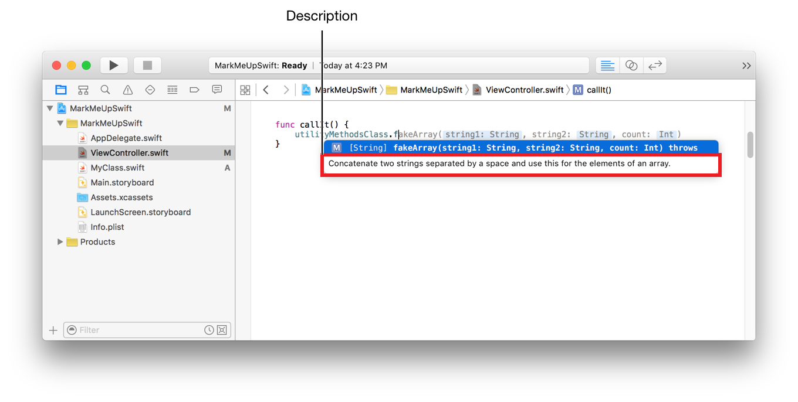

> 导航：[总目录](../../README.md) · [documentation](../../_indexes/documentation.md) · [Playground Reference](XCPlayground%20Module%20Reference.md)

[Previous](XCPlayground%20Module%20Reference.md)

## Markup Overview

Use markup to create playgrounds that show formatted text in rendered documentation mode and to show Quick Help for your Swift code symbols.

Markup for playgrounds includes page level formatting for headings and other elements, formatting spans of characters, showing inline images, and several other features.

For example, Figure 1-1 shows two screenshots of the same playground. The page on the left-hand side of the figure shows the markup in the source editor view for the playground. The right-hand side of the figure shows the playground in rendered documentation mode.

__Figure 1-1__Markup in playgrounds

Markup for Swift symbols is used for Quick Help and for the description shown in symbol completion.

For example, the description in the markup in Figure 1-2 is used for the description in symbol completion shown in Figure 1-3.

__Figure 1-2__Markup for Swift symbols

__Figure 1-3__Custom description in code completion

The Quick Help shown in Figure 1-4 is generated from the same markup shown above in Figure 1-2.

__Figure 1-4__Custom Quick Help

[Markup Functionality](https://developer.apple.com/library/archive/documentation/Swift/Reference/Playground_Ref/Chapters/MarkupFunctionality.html#//apple_ref/doc/uid/TP40016497-CH54-SW1)

Copyright © 2018 Apple Inc. All rights reserved.
[Terms of Use](http://www.apple.com/legal/terms/site.html) |
[Privacy Policy](http://www.apple.com/privacy/) |
[Updated: 2017-06-05](https://developer.apple.com/library/archive/documentation/Swift/Reference/Playground_Ref/Chapters/RevisionHistory.html#//apple_ref/doc/uid/TP40016497-CH99-SW1)

[Previous](XCPlayground%20Module%20Reference.md)
