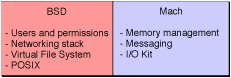

> 导航：[总目录](../../../README.md) · [documentation](../../../_indexes/documentation.md) · [Porting UNIX/Linux Applications to OS X](Introduction%20to%20Porting%20UNIX-Linux%20Applications%20to%20OS%20X.md)


[Next](%28Re%29designing%20for%20Portability.md)[Previous](Distributing%20Your%20Application.md)

# Additional Features

Although many parts of OS X are the same as other UNIX-based operating systems, OS X also includes many things that set it apart. This chapter lists some of the key details that distinguish OS X from most other UNIX-based operating systems. These may not be important for a basic port of a simple application, but the more robust your application and the more tightly it integrates with the underlying operating system, the more important it is to understand the additional functionality provided by the operating system. Most of the information here is covered only as an overview, with references to more detailed documentation where appropriate.

This chapter is of interest to all varieties of developers, though different developers will have different interests, depending on the nature of your application.

AppleScript is a technology that does for GUI applications what shell scripts do for command-line applications. The scripts control applications using a relatively straightforward messaging protocol (whose commands are application-dependent).

AppleScript Studio is a suite of tools—Xcode, Interface Builder, and the Cocoa application framework—that together allow you to create whole applications written entirely in AppleScript.

For more information on AppleScript and AppleScript Studio, see the AppleScript documentation at [http://developer.apple.com/](https://developer.apple.com/).

OS X provides much of the audio functionality normally associated with third-party MIDI and audio toolkits. This gives developers a simple platform for developing dynamic audio applications. For end users, it minimizes the configuration that is normally required to get high-end audio applications to work. As a UNIX developer, it means that if you have been looking for a platform to develop a robust audio application on, you now have one. Among the high-level features of the OS X Core Audio subsystem are these:

- Native multi-channel audio with plug-in support
- Native MIDI
- Audio Hardware Abstraction Layer (HAL)
- A built-in USB class driver compliant with the USB audio specification
- A simplified driver model
- A direct relation with the I/O Kit through the `IOAudioDevice` class that enables rapid device-driver development

If you are developing applications that need access to the audio layer of OS X, you can pursue the extensive resources available at [http://developer.apple.com/audio/](https://developer.apple.com/audio/).

The boot sequence in OS X offers a number of advanced features that are not yet common in other UNIX-based and UNIX-like operating systems. These differences are significant enough to warrant their own document: _[Daemons and Services Programming Guide](../../Mac%20OSX/Daemons%20and%20Services%20Programming%20Guide/About%20Daemons%20and%20Services.md#apple-f4xwc4dqnrsv64tfmyxwi33df52wszbpgeydambqge3te2i)_.

In that document, you will learn about legacy startup items (the recommended way to start daemons prior to v10.4), `launchd` (the recommended way in v10.4 and later), and why you should start your daemons with these mechanisms instead of modifying `rc` files.

Often on a UNIX-based system, you find system configuration files in `/etc`. This is still true in OS X, but configuration information is also found in other places. Networking, printing, and user system configuration details are, by default, regulated by the NetInfo database. Applications usually make use of XML property lists (plists) to hold configuration information. You can view many example property lists by looking in `~/Library/Preferences`.

If changing a configuration file in `/etc` does not have your desired effect, then that information is probably regulated by information in the NetInfo database or by an application’s property list.

For example, users and groups are not handled with files in `/etc`. To create a user, you instead should use the Accounts preferences pane or NetInfo Manager. NetInfo Manager can also be used to create groups.

OS X implements an object-oriented programming model for developing device drivers. This technology is called the I/O Kit. It is a collection of system frameworks, libraries, tools, and other resources. This model is different from the model traditionally found on a BSD system. If your code needs to access any devices other than disks, you use the I/O Kit. I/O Kit programming is done using a restricted subset of C++ that omits features unsuitable for use within a multithreaded kernel. By modeling the hardware connected to an OS X system and abstracting common functionality for devices in particular categories, the I/O Kit streamlines the process of device-driver development. I/O Kit information and documentation is available at [http://developer.apple.com/](https://developer.apple.com/).

The OS X file system is similar to other UNIX-based operating systems, but there are some significant differences in the file system structure and in case sensitivity. These differences are described in the sections that follow.

The file-system structure of OS X is similar to a BSD-style system. A quick glance at `hier` should comfort you. When in doubt as to where to put things, you can put them where you would in a BSD-style system.There are a few directories that you might not recognize. These differences are described in more detail in [File System Organization](Porting%20File%2C%20Device%2C%20and%20Network%20I-O.md#apple-f4xwc4dqnrsv64tfmyxwi33df52wszbpkridimbqgazdqnjufvbegskhivfegra).

The default behavior of the OS X Finder is to hide the directories that users normally would not be interested in, as well as invisible files, such as those preceded by a dot (`.`). This appearance is maintained by the Finder to promote simplicity in the user interface. As a developer, you might want to see the dot files and your complete directory layout. The `/usr/bin/defaults` tool allows you to override the default behavior of hiding invisible files. To show all of the files that the Finder ordinarily hides, type the following command in the shell:

```
defaults write com.apple.Finder AppleShowAllFiles true
```

Then restart the Finder either by logging out and back in or by choosing Force Quit from the Apple Menu.

There are a couple of other simple ways to view the contents of hidden folders without modifying the default behavior of the Finder itself. You can use the `/usr/bin/open` command or the Finder Go to Folder command. With `open` you can open a directory in the Finder, hidden or not, from the shell. For example, `open /usr/include` opens the hidden folder in a new Finder window. If you are in the Finder and want to see the contents of an invisible folder hierarchy, choose Go to Folder from the Go menu, or just press command-~, and type in the pathname of your desired destination.

For information on how to lay out the directory structure of your completed Mac apps, consult _OS X Human Interface Guidelines_ and _[Mac Technology Overview](../../Mac%20OSX/Mac%20Technology%20Overview/About%20Developing%20for%20Mac.md#apple-f4xwc4dqnrsv64tfmyxwi33df52wszbpkridimbqgaytanrx)_.

OS X supports Mac OS Extended (HFS+), the traditional Macintosh volume format, and the UNIX File System (UFS). HFS+ is recommended and is what most users have their system installed on. Some more server-centric installations have their system installed on UFS. If you develop on UFS, you should thoroughly test your code on HFS+ as well. Although the HFS+ file system preserves case, it is not case sensitive. This means that if you have two files whose names differ only by case, the HFS+ file system regards them as the same file. In designing your application, you should therefore not attempt to put two objects with names that differ only by case in the same directory—for example Makefile and makefile.

However, developing on HFS+ does not necessarily ensure that your application will work on UFS. It is far too easy to write code in which your program opens a file as org.mklinux.formattool.prefs one time and as org.MkLinux.formattool.prefs another time and gets completely different results.

Also, do not assume that a bug is unimportant simply because you have seen it only on UFS. Other file systems have similar properties, including potentially an NFS, SMB, or AFP share, particularly when those shares are being served by something other than a Mac. Thus, a bug that occurs on one file system will likely occur on others.

The core of any operating system is its kernel. Though OS X shares much of its underlying architecture with BSD, the OS X kernel, known as XNU, differs significantly. XNU is based on the Mach microkernel design, but it also incorporates BSD features. It is not technically a microkernel implementation, but still has many of the benefits of a microkernel, such as Mach interprocess communication mechanisms and a relatively clean API separation between various parts of the kernel.

Why is it designed like this? With pure Mach, the core parts of the operating system are user space processes. This gives you flexibility, but also slows things down because of message passing performance between Mach and the layers built on top of it. To regain that performance, BSD functionality has been incorporated in the kernel alongside Mach. The result is that the kernel combines the strengths of Mach with the strengths of BSD.

How does this relate to the actual tasks the kernel must accomplish? [Figure 9-1](#apple-f4xwc4dqnrsv64tfmyxwi33df52wszbpkridimbqgazdqnjwfvbeeq2fizcegsq) illustrates how the kernel’s different personalities are manifested.

__Figure 9-1__  XNU personalities



The Mach aspects of the kernel handle

- Memory management
- Mach messaging and Mach inter process communication (IPC)
- Device drivers

The BSD components

- Manage users and permissions
- Contain the networking stack
- Provide a virtual file system
- Maintain the POSIX compatibility layer

See Inside _[Kernel Programming Guide](../../Darwin/Kernel%20Programming%20Guide/About%20This%20Document.md#apple-f4xwc4dqnrsv64tfmyxwi33df52wszbpkridgmbqgaydsmbv)_ for more information on why you would (or wouldn’t) want to program in the kernel space, including a discussion on the kernel extension (KEXT) mechanism.

Open Directory is the built-in OS X directory system that system and application processes can use to store and find administrative information about resources and users. Open Directory includes components such as OpenLDAP and Kerberos for providing local and remote authentication.

By default, each OS X computer runs client and server processes, but the server only serves to the local client. You can also bind client computers to servers other than the local server over a number of protocols including LDAP. Information is then accessed in a hierarchical scheme. In such a scheme, each client computer accesses the union of the information provided first by its local server and then by any higher-level servers it is bound to.

Directory Services is the default way that OS X stores user and some network information. When a user is added, the system automatically adds their information to a local database using Open Directory. Traditional tools such as `adduser` either do not exist or do not work as you might expect. You can add users and groups in several ways:

- Through the Users pane of System Preferences
- Through `/Applications/Utilities/Directory` (for adding groups)
- From the command line (see [Example: Adding a User From the Command Line](#apple-f4xwc4dqnrsv64tfmyxwi33df52wszbpkridimbqgazdqnjwfvbeeq2eijdeera))

You can find more information on NetInfo in the manual pages for `netinfo`, `nidump`, `nicl`, `nifind`, `niload`, `niutil`, and `nireport` on a computer running OS X v10.4 or earlier. NetInfo is no longer supported in OS X v10.5 and later. You should use Directory Service functionality instead.

You can find more information on Directory Service in _[Open Directory Programming Guide](https://developer.apple.com/library/archive/documentation/Networking/Conceptual/Open_Directory/Introduction/Introduction.html#//apple_ref/doc/uid/TP40000917)_ and the manual pages `DirectoryService`, `dscl`, `dsconfigldap`, `dsexport`, `dsimport`, and `dsperfmonitor`.

This section shows a simple example of using the Directory Service command-line tool, `dscl`, to add a user to the system. The example specifies some of the properties that you would normally associate with any user.

1. Create a new entry in the local (`/`) domain under the category `/users`.

   `dscl . -create /Users/portingunix`
2. Create and set the shell property to `bash`.

   `dscl . -create /Users/portingunix UserShell /bin/bash`
3. Create and set the user’s full name.

   `dscl . -create /Users/portingunix RealName "Porting Unix Applications To OS X"`
4. Create and set the user’s ID.

   `dscl . -create /Users/portingunix UniqueID 503`
5. Create and set the user’s group ID property.

   `dscl . -create /Users/portingunix PrimaryGroupID 1000`
6. Create and set the user home directory. (Despite the name `NFSHomeDirectory`, this can also be used for a path to a home directory on a local volume.)

   `dscl . -create /Users/portingunix NFSHomeDirectory /Network/Servers/techno/Users/portingunix`

   or

   `dscl . -create /Users/portingunix NFSHomeDirectory /Users/portingunix`
7. Set the password.

   `dscl . -passwd /Users/portingunix PASSWORD`

   _or_

   `passwd portingunix`
8. To make that user useful, you might want to add them to the admin group.

   `dscl . -append /Groups/admin GroupMembership portingunix`

This is essentially what System Preferences does when it makes a new user, but the process is presented here so you can see more clearly what is going on behind the scenes with the database. A look through the hierarchies using `dscl` interactively also helps you understand how the database is organized.

OS X, beginning in version 10.2, uses the Common UNIX Printing System (CUPS) as the basis of its printing system. CUPS is a free software (open source) print system that is also popular in Linux and UNIX circles. For more information on CUPS, see the OS X Printing website at [http://developer.apple.com/printing](https://developer.apple.com/printing).

Bonjour is an implementation of the IETF ZeroConf working draft. Bonjour has three basic parts:

- IP assignment
- Multicast DNS
- Service discovery

You can see the first part, IP assignment, simply by plugging two computers together using a crossover cable and setting them up to use DHCP to obtain an address. Upon failing to obtain an address, the computers choose an IP number randomly from within the range reserved for ZeroConf numbers, then ARP to see if anyone has that address already, repeating this process as needed until a free address is found. This means that a relatively large number of machines can choose their own IP numbers without any administration.

Multicast DNS is a service that allows you to look up the Zeroconf IP number assigned to a particular machine without an established DNS infrastructure. Your computer sends out a request using IP multicast, asking who responds for a particular host name. The host in question then responds. That host could be a computer, a printer, or any other device that might reasonably exist on an IP-based network.

Service discovery is a way to query local machines (using multicast DNS) or a DNS server to see what machines (computers, printers, and so on) support a given service. If you are writing a service, you can register the service using Bonjour. Then anyone else who makes a request sees that your machine supports that service.

The service discovery portion of Bonjour is independent of the IP assignment portion. Thus, Bonjour can also be used for service discovery on a more traditional, configured IP network.

For more information about Bonjour, see _[DNS Service Discovery Programming Guide](../../Networking/DNS%20Service%20Discovery%20Programming%20Guide/Introduction%20to%20DNS%20Service%20Discovery.md#apple-f4xwc4dqnrsv64tfmyxwi33df52wszbpkridgmbqgaydsnru)_.

With OS X, you can run shell scripts in its native `sh` compatible shell, `bash`, or the included `csh` and `tcsh`. You can also run Ruby, Perl, Python, Tcl, PHP, and other scripts you have developed. In addition, OS X provides an Apple-specific scripting language, AppleScript. Although AppleScript is immensely powerful and can be used to build applications itself, it is designed mainly to communicate with graphical components of the operating system. There are other uses you can find for it, but it is not a replacement for UNIX-style scripting languages. You can use it, though, to put a GUI front end onto your traditional scripts.

AppleScript conforms to the Open Scripting Architecture (OSA) language and can be used from the command line through the `osascript` command. Other languages can be made OSA compliant to enable interaction with the operating system.

OS X implements the Common Data Security Architecture (CDSA). If you need to use Authorization Services, Secure Transport, or certificates within the scope of CDSA, online documentation is available at [http://developer.apple.com/](https://developer.apple.com/).

In addition, OS X provides OpenSSL and PAM to ease porting of applications from other UNIX-based operating systems to OS X.

By default, there is no root user password in OS X. This is a deliberate design decision to maximize security and to simplify the user interface. Your applications should not assume that a user needs superuser access to the system. For power users and developers, `sudo` is provided to run privileged applications in the shell. Privileged applications can also be run by members of the admin group. By default, the admin group is included in the list of “sudoers” (which can be found in the file `/etc/sudoers`). You can assign users to the admin group in System Preferences:

1. Click the Users button.
2. Select a user from the list and click Edit User, or make a new user.
3. Click the Password tab.
4. Check Allow user to administer this computer.
5. That user can now use administrative applications as well as `sudo` in the shell.

Although it is generally considered unsafe practice to log in as the root user, it is mentioned here because the root user is often used to install applications during development. If during development you need to enable the root user for yourself.

In OS X prior to version 10.5:

1. Launch `/Applications/Utilities/NetInfo Manager`.
2. Choose Domain > Security > Authenticate.
3. As prompted, enter your administrator name and password.
4. Now choose Domain > Security > Enable Root User. The first time you do this, you need to select a root password.

In OS X version 10.5 and later:

1. Launch `/Applications/Utilities/Directory Utility`.
2. Click the lock icon to authenticate yourself.
3. Select Edit > Enable Root User. The first time you do this, you need to select a root password.

Alternatively, you can use `sudo passwd root` from the shell and set the appropriate root password.

[Next](%28Re%29designing%20for%20Portability.md)[Previous](Distributing%20Your%20Application.md)

