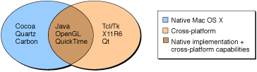

> 导航：[总目录](../../../README.md) · [documentation](../../../_indexes/documentation.md) · [Porting UNIX/Linux Applications to OS X](Introduction%20to%20Porting%20UNIX-Linux%20Applications%20to%20OS%20X.md)

[Next](Using%20Traditional%20UNIX%20Graphical%20Environments.md)[Previous](Using%20OS%20X%20Native%20Application%20Environments.md)

# Choosing a Graphical Environment for Your Application

OS X offers many options for transforming your applications with a graphical user interface from a UNIX code base to a native OS X code base, or even for wrapping preexisting command-line tools or utilities with a graphical front end, making them available to users who never want to go to the command line.

This chapter describes some of the issues you will face when porting a GUI application to OS X or adding a GUI wrapper around a command line application. It also describes the various GUI environments supported by OS X and gives advantages and disadvantages of each.

In choosing a graphical environment to use in bringing a UNIX-based application to OS X, you will need to answer the questions posed in the following sections:

- [What Kind of Application Are You Porting?](#apple-f4xwc4dqnrsv64tfmyxwi33df52wszbpkridimbqgazdqnjrfvbuuqsfizduiqy)
- [How Well Does It Need to Integrate With OS X?](#apple-f4xwc4dqnrsv64tfmyxwi33df52wszbpkridimbqgazdqnjrfvbuuqsiizcuosi)
- [Does Your Application Require Cross-Platform Functionality?](#apple-f4xwc4dqnrsv64tfmyxwi33df52wszbpkridimbqgazdqnjrfvbuuqsgifeemri)

These questions should all be evaluated as you weigh the costs and benefits of each environment. You may already be using a cross-platform toolkit API. If you aren’t doing so, you may want to port your application to a native API such as Carbon or Cocoa.

If you are a commercial developer adding a new graphical user interface to a command-line application and want to take advantage of the greatest strengths of OS X, you will probably want to use the Cocoa API. In some cases, you may want to use a different API for reasons such as cross-platform compatibility.

If you decide to use a nonnative API, like X11R6, to provide a user interface for your Mac app, it is important to remember that users and developers with a UNIX background might be perfectly content to just have the application running in OS X. Traditional Macintosh users, however, will pass up an application with a traditional UNIX interface for a more integrated and modern interface. Whether you target a straight port to the Darwin layer or a more robust transformation of your application to take advantage of other OS X technologies (like the Cocoa frameworks) is your decision.

Are you bringing a preexisting code base to OS X, or are you adding new functionality—for example a graphical interface—to a command-line application? If you already have a code base written to a particular API, and that API is supported in OS X, you probably want to continue using that API for any large, complex application unless you desire features of another API.

For simple applications, or for applications where you are wrapping a command-line utility with a graphical user interface, you need to evaluate what API to use. Reading the next two sections will help you recognize the benefits and drawbacks of each technology.

Who are you marketing your application to? If they are traditional UNIX users that just want to run, for example, a gene-sequencing application alongside Microsoft Office, then it may be sufficient to just install an X Window System on their OS X computer. You would simply port your X11R6-based application to OS X, leaving your code as it stands (aside from the little changes you may need to make to make it compile in OS X). For more information on X11 in OS X, see [X11R6](Using%20Traditional%20UNIX%20Graphical%20Environments.md#apple-f4xwc4dqnrsv64tfmyxwi33df52wszbpkridimbqgazdqnjtfvkfawcsivddcmbz).

If you are an in-house developer of UNIX applications, this may be as far as you want to go, particularly if you want to maintain the same user experience across multiple platforms. However, you may still want to use Carbon or Cocoa APIs to improve the overall look of the UI to make it easier to use.

If you sell an application, some customers might at first be happy just to have it on their platform. However, if a competing product is released using OS X native functionality, customers are likely to gravitate to that product.

A hot topic in the science and technology industries is not only bringing a code base to OS X, but also giving that application an OS X native user interface. This is not a decision to be made trivially for an application with a complex GUI and a large code base, but it is one that can make or break a product’s success in the market. The individual discussions of the APIs that follow should help you to make a well-informed decision.

If you’re an open source software developer, you will probably gravitate toward a basic port of the X11 application. However, you should consider creating a native GUI if your application is likely to be used by consumers such as a word processor or a web browser.

If you have an application that must work on multiple platforms, OS X has you set up for success. You have many options; some are built in and shipped with every version of the operating system; others require the installation of additional components. [Figure 5-1](#apple-f4xwc4dqnrsv64tfmyxwi33df52wszbpkridimbqgazdqnjrfvbuuqsgirbuosa) depicts the distinction between the cross-platform APIs that are native and those that aren’t.

__Figure 5-1__  Graphical environments

You can see that OS X includes some standard cross-platform APIs: Java, OpenGL, and QuickTime. There are also commercial and free implementations of some of the traditional UNIX technologies. If you are building a cross-platform application, you should evaluate which platforms you are targeting with your application and determine which API allows you to bring your UNIX-based application to OS X. [Table 5-1](#apple-f4xwc4dqnrsv64tfmyxwi33df52wszbpkridimbqgazdqnjrfvbuuqscircuqsq) lists the platforms on which OS X cross-platform technologies run.

__Table 5-1__   Platforms of cross-platform technologies

| API | Platforms |
| [OpenGL](Using%20OS%20X%20Native%20Application%20Environments.md#apple-f4xwc4dqnrsv64tfmyxwi33df52wszbpkridimbqgazdqnjsfvkfawcsivddcmjr) | OS X, UNIX-based systems, Windows |
| [QuickTime](Using%20OS%20X%20Native%20Application%20Environments.md#apple-f4xwc4dqnrsv64tfmyxwi33df52wszbpkridimbqgazdqnjsfvbeeq2cifeeerq) | OS X, Windows |
| [Qt](Using%20Traditional%20UNIX%20Graphical%20Environments.md#apple-f4xwc4dqnrsv64tfmyxwi33df52wszbpkridimbqgazdqnjtfvkfawcsivddcmby) | OS X (Native & X11), UNIX-based systems, Windows |
| [Tcl/Tk](Using%20Traditional%20UNIX%20Graphical%20Environments.md#apple-f4xwc4dqnrsv64tfmyxwi33df52wszbpkridimbqgazdqnjtfvkfawcsivddcmbx) | OS X (Native & X11), UNIX-based systems, Windows |
| [wxWidgets](Using%20Traditional%20UNIX%20Graphical%20Environments.md#apple-f4xwc4dqnrsv64tfmyxwi33df52wszbpkridimbqgazdqnjtfvjvomi) | OS X (Native & X11), UNIX-based systems, Windows |
| [X11R6](Using%20Traditional%20UNIX%20Graphical%20Environments.md#apple-f4xwc4dqnrsv64tfmyxwi33df52wszbpkridimbqgazdqnjtfvkfawcsivddcmbz) | OS X, UNIX-based systems |

In the next two chapters, you’ll find brief descriptions of each of the technologies available to you for your application’s graphical user interface.

[Next](Using%20Traditional%20UNIX%20Graphical%20Environments.md)[Previous](Using%20OS%20X%20Native%20Application%20Environments.md)

