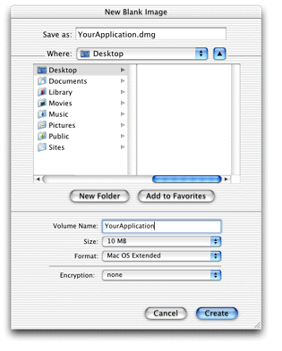

> 导航：[总目录](../../../README.md) · [documentation](../../../_indexes/documentation.md) · [Porting UNIX/Linux Applications to OS X](Introduction%20to%20Porting%20UNIX-Linux%20Applications%20to%20OS%20X.md)


[Next](Additional%20Features.md)[Previous](Porting%20File%2C%20Device%2C%20and%20Network%20I-O.md)

# Distributing Your Application

Developing an application is only part of the story. You must now get it out there for people to use. Given that this is a UNIX-based operating system, you could just `tar` and `gzip` your file. That’s fine if your end users are mostly UNIX users, but this doesn’t meet the needs of more general users. To complete the transition, you should package you application like other Mac apps. This chapter walks you through some of those details since they are probably new to you as a UNIX developer.

This chapter is important for all non-command-line developers, whether your application is an end-user commercial suite or an open source tool.

Most applications in OS X do not need to use an installer. To make installation and removal easy, OS X provides bundles.

A bundle is basically a directory that contains an application. Unlike normal folders, however, it appears to the user like an ordinary file. The user can double-click a bundle, and the application will launch. Since the bundle is really a directory, it can contain all the support files that are needed for the application.

The reason to use bundles is somewhat obvious if you have installed many applications in OS X: applications in the form of a bundle can be installed simply by dragging the application to the destination folder in the Finder.

There are, however, some situations where bundles are problematic. An application that installs kernel extensions, startup items, system-wide preference panes, or any other system-wide resources cannot be installed by dragging the application, since those resources need to be in a separate place on the drive.

If your application requires installing a startup item, the only practical way to install your application is the use of an installer. OS X makes this easy using PackageMaker. Other commercial solutions are also available from various third parties such as Stuffit InstallerMaker from Aladdin Systems and Installer VISE from MindVision.

In most cases, however, it is preferable to install system-wide components the first time your application is launched. You can do this using Authorization Services, as described in the book _[Authorization Services Programming Guide](../../Security/Authorization%20Services%20Programming%20Guide/Introduction%20to%20Authorization%20Services%20Programming%20Guide.md#apple-f4xwc4dqnrsv64tfmyxwi33df52wszbpkridgmbqgaydsojv)_, available from the Apple Technical Publications website.

For more information about how to create a bundle, see _[Bundle Programming Guide](../../Core%20Foundation/Bundle%20Programming%20Guide/Introduction.md#apple-f4xwc4dqnrsv64tfmyxwi33df52wszbpgeydambqgezdg2i)_.

There are two main applications for compressing your application: Disk Utility (or Disk Copy in older versions of OS X) and PackageMaker. Disk Utility allows you to create compressed disk images (similar to an ISO file, but compressed), whereas PackageMaker creates packages that can be installed using the OS X installer.

The recommended form of application distribution is a compressed disk image. A compressed disk image preserves resource forks that may be present, allows drag-and-drop installation, allows license display, and even allows encryption of data, if required.

If your application is a single application bundle, simply put it and any relevant documentation on a disk image with Disk Utility, then compress it and distribute it.

If you have an application that requires administrator privileges to install into privileged directories or requires more than a simple drag-and-drop installation, use PackageMaker (`/Developer/Applications/PackageMaker`) to build installer packages for Apple’s Installer application.

The basics of using Disk Utility to make a disk image are given in the next section. For help using PackageMaker, choose PackageMaker Help from the PackageMaker Help menu.

The following steps help you package your application as a disk image (`.dmg` file) for distribution on OS X.

1. Open `/Applications/Utilities/Disk Utility.app` by double-clicking it.
2. From the Image menu, choose New Blank Image. Disk Utility opens a new window with customization options as in [Figure 8-1](#apple-f4xwc4dqnrsv64tfmyxwi33df52wszbpkridimbqgazdqnjvfvbegskdifbusra).
3. In the “Save as” text box, enter the name of the compressed file that you will distribute. By default, a`.dmg` suffix is appended to the name you enter. Although it is not required, it is a good idea to retain this suffix for clarity and simplicity.
4. In the Volume Name text field, enter the name of the volume that you want to appear in the Finder of a user’s computer. Usually this name is the same as the name of the compressed file without the `.dmg` suffix.
5. In the file browser, set the location to save the file on your computer. This has nothing to do with the installation location on the end user’s computer, only where it saves it on your computer.
6. Set the Size pop-up menu to a size that is large enough to hold your application.
7. Leave the Format set to Mac OS Extended (the HFS+ file format).
8. Leave Encryption set to none. If you change it, the end user must enter a password before the image can be mounted, which is not the normal way to distribute an application.
9. Click Create.

__Figure 8-1__  Disk Utility options



Once you have a disk image, mount it by double-clicking it. You can now copy your files to that mounted image. When you have everything on the image that you want, you should make your image read-only. Again from Disk Utility, perform these steps:

1. Unmount the disk image by dragging the volume to the Trash, clicking the eject button next to the device in a Finder window, or selecting the mounted volume and choosing Eject from the Finder’s File menu.
2. Choose Convert Image from the Image menu.
3. In the file browser, select the disk image you just modified and click Convert.
4. Choose a location to save the resulting file, change the image format to read-only, and click Convert.

You now have a disk image for your application that is easy to distribute.

If you find yourself regularly creating disk images, you may find it helpful to automate this process. While a complete script is beyond the scope of this document, this section includes a code snippet to get you started.

For more information on hdiutil, see `hdiutil`.

__Listing 8-1__  Automatic Disk Image Creation using `hdiutil`

```
# Create an initial disk image (32 megs)
hdiutil create -size 32m -fs HFS+ -volname "My Volume" myimg.dmg

# Mount the disk image
hdiutil attach myimg.dmg

# Obtain device information
DEVS=$(hdiutil attach myimg.dmg | cut -f 1)
DEV=$(echo $DEVS | cut -f 1 -d ' ')

# Unmount the disk image
hdiutil detach $DEV

# Convert the disk image to read-only
hdiutil convert myimg.dmg -format UDZO -o myoutputimg.dmg
```


Once you have an application, how do you get the word out? First, let Apple know about it. To get your application listed on Apple’s main download page for OS X, go to [http://www.apple.com/downloads/macosx/submit/](http://www.apple.com/downloads/macosx/submit/) and fill out the appropriate information about your application. You should also go to [http://guide.apple.com/](http://guide.apple.com/) and at the bottom of the page, click Submit a Product to get your application listed in the Apple Guide. You might then also want to send notices to [http://www.versiontracker.com/](http://www.versiontracker.com/)and Macintosh news sites like [http://www.macworld.com/](http://www.macworld.com/) and [http://www.macnn.com/](http://www.macnn.com/).

[Next](Additional%20Features.md)[Previous](Porting%20File%2C%20Device%2C%20and%20Network%20I-O.md)

