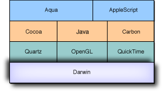

> 导航：[总目录](../../../README.md) · [documentation](../../../_indexes/documentation.md) · [Porting UNIX/Linux Applications to OS X](Introduction%20to%20Porting%20UNIX-Linux%20Applications%20to%20OS%20X.md)

[Next](Preparing%20to%20Port.md)[Previous](Introduction%20to%20Porting%20UNIX-Linux%20Applications%20to%20OS%20X.md)

# Overview of OS X

OS X is a modern operating system that combines the power and stability of UNIX-based operating systems with the simplicity and elegance of the Macintosh. For years, power users and developers have recognized the strengths of UNIX and its offshoots. While UNIX-based operating systems are indispensable to developers and power users, consumers have rarely been able to enjoy their benefits because of the perceived complexity. Instead consumers have lived with a generation of desktop computers that could only hope to achieve the strengths that UNIX-based operating systems have had from the beginning.

This chapter is for anyone interested in an overview of OS X—its lineage and its open source core, called Darwin. Here you will find background information about OS X and how your application fits in.

Although this document covers the basic concepts in bringing UNIX applications to OS X, it is by no means comprehensive. This section is provided to give you a hint on where to look for additional documentation by outlining how OS X came to be. Knowing a little about the lineage of OS X will help you to find more resources as the need arises.

Part of the history of OS X goes back to Berkeley Software Distributions (BSD) UNIX of the late seventies and early eighties. Specifically, it is based in part on BSD 4.4 Lite. On a system level, many of the design decisions are made to align with BSD-style UNIX systems. Most libraries and utilities are from FreeBSD ([http://www.freebsd.org/](http://www.freebsd.org/)), but some are derived from NetBSD ([http://www.netbsd.org/](http://www.netbsd.org/)). For future development, OS X has adopted FreeBSD as a reference code base for BSD technology. Work is ongoing to more closely synchronize all BSD tools and libraries with the FreeBSD-stable branch..

Although OS X must credit BSD for most of the underlying levels of the operating system, OS X also owes a major debt to Mach. The kernel is heavily influenced in its design philosophy by Carnegie Mellon’s Mach project. The kernel is not a pure microkernel implementation, since the address space is shared with the BSD portion of the kernel and the I/O Kit.

In figuring out what makes OS X tick, it is important to recognize the influences of NEXTSTEP and OPENSTEP in its design. Apple’s acquisition of NeXT in 1997 was a major key in bringing OS X from the drawing board into reality. Many parts of OS X of interest to UNIX developers are enhancements and offshoots of the technology present in NEXTSTEP. From the file system layer to the executable format and from the high-level Cocoa API to the kernel itself, the lineage of OS X as a descendant of NEXTSTEP is evident.

Although it shares its name with earlier versions of the Mac OS, OS X is a fundamentally new operating system. This does not mean that all that went before has been left out. OS X still includes many of the features that Mac OS 9 and earlier versions included. Although your initial port to OS X may not use any of the features inherited from Mac OS 9, as you enhance the application, you might take advantage of some of the features provided by technologies like ColorSync or the Carbon APIs. Mac OS 9 is also the source of much of the terminology used in OS X.

The word _Darwin_ is often used to refer to the underpinnings of OS X. In fact, in some circles OS X itself is rarely mentioned at all. It is important to understand the distinction between the two—how they are related and how they differ.

Darwin is the core of the OS X operating system. Although Darwin can stand alone as an independent operating system, it includes only a subset of the features available in OS X. [Figure 1-1](#apple-f4xwc4dqnrsv64tfmyxwi33df52wszbpkridimbqgazdqnbyfvbuuqsfizduqsi) shows how Darwin is related to OS X as a whole.

__Figure 1-1__  Darwin’s relation to OS X

Darwin is an open source project. With it, you as a developer gain access to the foundation of OS X. Its openness also allows you to submit changes that you think should be reflected in OS X as a whole. Darwin has been released as a separate project that runs on PowerPC-based Macintosh computers as well as x86-compatible computers. Although it could be considered a standalone operating system in its own right, many of the fundamental design decisions of Darwin are governed by its being embedded within OS X. In bringing your applications to the platform, you should target OS X version 10.1.4 (Darwin 5.4) or later.

OS X itself is not an Open Source project. As you can see from [Figure 1-1](#apple-f4xwc4dqnrsv64tfmyxwi33df52wszbpkridimbqgazdqnbyfvbuuqsfizduqsi), there are many parts of OS X that are not included in the Open Source Darwin components. Part of your job while porting is deciding where your application will fit in OS X.

If you are a developer whose tool is a command-line tool (or has a useful subset that is a command-line tool), you can, of course, simply port your application as a command-line tool or service, which is usually not that complicated. By doing this you gain a small benefit, in that it is now available to OS X users who are familiar with the UNIX command-line environment. You will not be able to market it to OS X users as a whole though, since many users do not even know how to access the command line on their computers.

The basic steps in porting a UNIX application to OS X typically include:

1. Port to the command line.
2. Provide a graphical user interface (GUI).

In bringing your UNIX application to OS X, you are entering a world where great emphasis is placed on user interactions. This brings you many opportunities and benefits as a developer, but also some responsibilities.

Porting to OS X has three primary benefits:

- stable long-term customer base
- good inroad into education
- powerful developer tools

Bringing UNIX applications to OS X can be very profitable if done correctly. Well-designed Macintosh applications of years past are the standards of today. PhotoShop, Illustrator, and Excel are all applications that first made their name on the Macintosh. Now is the time to win the hearts of Macintosh users with the next great application. In a word, possibly millions of paying customers!

Macintosh users are willing to spend their money on great applications because they know that Apple strives to give them a high-quality user environment. Apple developers are known for providing great applications for that environment.

For years, Apple has been known for its commitment to education. OS X targets the education market for developers and is an ideal platform for learning for students. With its standards-based technologies as well as home-grown technologies, you have an ideal platform for use in educational application deployment and development.

OS X also provides benefits in a development environment. Apple strives for standards first, then it adds that little bit that makes it better on a Mac. As a developer, you have access to many of the development tools and environments that you have on other platforms, like Java, OpenGL, POSIX libraries, and the BSD TCP/IP stack, but you also have built-in benefits like the Apache Web server on every computer, the Cocoa object-oriented development environment, a PDF-based display system (Quartz), Kerberos, QuickTime, a dynamic core audio implementation, and a suite of world-class developer tools. By adding a native OS X front end to your application, you can achieve a cost-effective new deployment platform with minimal additional development effort.

OS X adds tremendous value both to you and your customers on a standards-based operating system.

Along with benefits come responsibilities. If you have decided to make a full-featured Mac app, here are some guidelines to keep in mind.

- An OS X user should never have to resort to the command line to perform any task in an application with a graphical user interface. This is especially important to remember since the BSD user environment may not even be installed on a user’s system. The libraries and kernel environment are of course there by default, but the tools may not be.
- If you are making graphical design decisions, you need to become familiar with the _OS X Human Interface Guidelines_, available from the Apple developer website. These are the standards that Macintosh users expect their applications to live up to. Well-behaved applications from Apple and third-party developers give the Macintosh its reputation as the most usable interface on the planet.

The responsibilities boil down to striving for an excellent product from a user’s perspective. OS X gives you the tools to make your applications shine.

[Next](Preparing%20to%20Port.md)[Previous](Introduction%20to%20Porting%20UNIX-Linux%20Applications%20to%20OS%20X.md)

