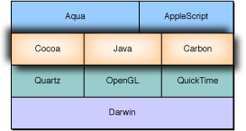
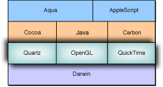

> 导航：[总目录](../../../README.md) · [documentation](../../../_indexes/documentation.md) · [Porting UNIX/Linux Applications to OS X](Introduction%20to%20Porting%20UNIX-Linux%20Applications%20to%20OS%20X.md)


[Next](Choosing%20a%20Graphical%20Environment%20for%20Your%20Application.md)[Previous](Compiling%20Your%20Code%20in%20OS%20X.md)

# Using OS X Native Application Environments

OS X includes three high-level native development environments that you can use for your application’s graphical user interface: Carbon, Cocoa, and Java. These environments are full-featured development environments in their own right, and you can write complete applications in any one of these environments.

In addition to these technologies, you can also use OpenGL, X11, Qt, Tcl/Tk, wxWidgets, and a number of other traditional UNIX graphics technologies when writing applications for OS X. In each case, there are tradeoffs. This chapter explains these tradeoffs and shows how they affect you as a programmer as well as your users.

In the context of this document, Carbon, Cocoa, and Java are presented as a way to write a GUI wrapper for a UNIX-based tool.

Writing to these environments lets you build an application that is indistinguishable from any other native Mac app. The Java or Cocoa frameworks are probably the environments that you will use in bringing UNIX applications to OS X, although the Carbon frameworks are used by some developers. The following sections outline all three.

A good general rule is that if you decide to port your application from X11 to a native GUI environment, Carbon is a good choice for C and other procedural X11 applications, while Cocoa is a good choice if your application uses high-level toolkits such as Tcl/Tk or Qt. Cocoa is also a good choice for wrapping command-line applications with a GUI.

__Figure 4-1__  High-level graphics technologies



If you decide to port your cross-platform application to a native OS X GUI environment, you should carefully consider how best to do this port in a way that is maintainable. For some helpful tips, you should also read [(Re)designing for Portability](%28Re%29designing%20for%20Portability.md#apple-f4xwc4dqnrsv64tfmyxwi33df52wszbpkridimbqgazdqnjxfvkfawcsivddcmbr).

Cocoa is an object-oriented framework that incorporates many of OS X’s greatest strengths. Based on the highly-respected OpenStep frameworks, it allows for rapid development and deployment with both its object-oriented design and integration with the OS X development tools. Cocoa is divided into two major parts: Foundation and the Application Kit. Foundation provides the fundamental classes that define data types and collections; it also provides classes to access basic system information like dates and communication ports. The Application Kit builds on that by giving you the classes you need to implement graphical event-driven user interfaces.

Cocoa also provides file system abstraction that makes things such as file browsers look like Mac users expect. If you are developing a commercial application, you should use these. If you are developing an in-house application that will largely be used by people familiar with UNIX, the layout may be confusing, so these APIs may not be appropriate. See [Presenting File Open and Save Dialog Boxes](Porting%20File%2C%20Device%2C%20and%20Network%20I-O.md#apple-f4xwc4dqnrsv64tfmyxwi33df52wszbpkridimbqgazdqnjufvbegskhjjbuqra) for more information.

The native language for Cocoa is Objective-C, which provides object-oriented extensions to standard C and Objective-C++. _[The Objective-C Programming Language](../../Cocoa/The%20Objective-C%20Programming%20Language/Introduction.md#apple-f4xwc4dqnrsv64tfmyxwi33df52wszbpkridgmbqgaytcnrt)_ describes the grammar of Objective-C and presents the concepts behind it. Objective-C is supported in gcc 2.95 and 3. Most of the Cocoa API is also accessible through Java. Cocoa is also the basis for AppleScript Studio, an application environment for script-based GUI development.

Additional Cocoa information, including sample code, can be found at [http://developer.apple.com/](https://developer.apple.com/). Cocoa documentation including tutorials is available at [http://developer.apple.com/](https://developer.apple.com/).

- Rapid development environment
- Object-oriented framework design
- Excellent integration with OS X developer tools
- Very robust feature set
- Can take advantage of existing C, C++, Objective-C, and Java code
- Similar level of abstraction to high level toolkits such as Qt, Tcl/Tk, and so on

- Cross-platform deployment requires having a separate, non-Cocoa code base for the GUI portion
- Requires integrating Java, Objective C, or Objective C++ into your code base for the GUI layer
- Requires knowledge of Java, Objective C, or Objective C++
- Very different level of abstraction from raw X11 programming
- Potential performance penalties if used incorrectly

When designing an application from the ground up in Cocoa, you are in an object-oriented environment. You can also take advantage of Cocoa’s object-oriented nature when converting preexisting code, as you can use the Cocoa frameworks to wrap the functionality of C or C++ code.

The Objective-C language has been extended to understand C++. Often this is called Objective-C++, but the functionality remains basically the same. Because Cocoa understands Objective-C++, you can call native C and C++ code from Cocoa. This is one example of how you can take advantage of your code base while adding a Macintosh front end. An example is provided below of how Objective-C wraps together C, C++, and Objective-C++ functionality. [Listing 4-1](#apple-f4xwc4dqnrsv64tfmyxwi33df52wszbpkridimbqgazdqnjsfvbuuqsiifduiri) shows the Objective-C main class.

__Listing 4-1__  `main.m`

```objc
#import <AppKit/AppKit.h>

int main(int argc, const char *argv[]) {
    return NSApplicationMain(argc, argv);
}
```

This gets everything started when the user double-clicks the application icon. A call is then sent to invoke a `HelloController` object by the NIB, a file that holds interface information. The listings for `HelloController.m` and `HelloController.h` follow.

__Listing 4-2__  `HelloController.m`

```objc
#import "HelloController.h"

@implementation HelloController

- (void)doAbout:(id)sender
{
    NSRunAlertPanel(@"About",@"Welcome to Hello World!",@"OK",NULL,NULL);
}

- (IBAction)switchMessage:(id)sender
{
        int which=[sender selectedRow]+1;
        [helloButton setAction:NSSelectorFromString([NSString stringWithFormat:@"%@%d:",@"message",which])];
}

- (void)awakeFromNib
{
    [[helloButton window] makeKeyAndOrderFront:self];
}

@end
```


__Listing 4-3__  `HelloController.h`

```objc
#import <AppKit/AppKit.h>

@interface HelloController : NSObject
{
    id helloButton;
    id messageRadio;
}
- (void)doAbout:(id)sender;
- (void)switchMessage:(id)sender;
@end
```

The communication between the C, C++, and the Objective-C code is handled as shown in [Listing 4-4](#apple-f4xwc4dqnrsv64tfmyxwi33df52wszbpkridimbqgazdqnjsfvbeeq2fifeeqri). The header file `SayHello.h` is shown in [Listing 4-5](#apple-f4xwc4dqnrsv64tfmyxwi33df52wszbpkridimbqgazdqnjsfvbeeq2kivdeisi).

__Listing 4-4__  `SayHello.mm`

```objc
#import "SayHello.h"
#include "FooClass.h"
#include <Carbon/Carbon.h>

@implementation SayHello

- (void)message1:(id)sender
{
    NSRunAlertPanel(@"Regular Obj-C from Obj-C",@"Hello, World! This is a regular old NSRunAlertPanel call in Cocoa!",@"OK",NULL,NULL);
}

- (void)message2:(id)sender
{
    int howMany;
    NSString *theAnswer;
    Foo* myCPlusPlusObj;
    myCPlusPlusObj=new Foo();
    howMany=myCPlusPlusObj->getVariable();
    delete myCPlusPlusObj;
    theAnswer=[NSString stringWithFormat:@"Hello, World! When our C++ object is queried, it tells us that the number is %i!",howMany];
    NSRunAlertPanel(@"C++ from Obj-C",theAnswer,@"OK",NULL,NULL);
}

- (void)message3:(id)sender
{
    Alert(128,NULL); //This calls into Carbon
}

@end
```


__Listing 4-5__  `SayHello.h`

```objc
#import <AppKit/AppKit.h>

@interface SayHello : NSObject
{
}

- (void)message1:(id)sender;
- (void)message2:(id)sender;
- (void)message3:(id)sender;
@end
```

The C++ class wrapped by these Cocoa calls is shown in [Listing 4-6](#apple-f4xwc4dqnrsv64tfmyxwi33df52wszbpkridimbqgazdqnjsfvbeeq2gizeuusq). The header file, `FooClass.h`, is shown in [Listing 4-7](#apple-f4xwc4dqnrsv64tfmyxwi33df52wszbpkridimbqgazdqnjsfvbeeq2cjfbeuri).

__Listing 4-6__  `FooClass.cpp`

```c
#include "FooClass.h"
Foo::Foo()
{
 variable=3;
}

int Foo::getVariable()
{
 return variable;
}
```


__Listing 4-7__  `FooClass.h`

```
class Foo {
public:
    Foo();
    int getVariable();
    void * objCObject;
private:
    int variable;
};
```

You should be careful when writing code using Cocoa, because the same constructs that make it easy for the developer tend to degrade performance when overused. In particular, heavy use of message passing can result in a sluggish application.

The ideal use of Cocoa is as a thin layer on top of an existing application. Such a design gives you not only good performance and ease of GUI design, but also minimizes the amount of divergence between your UNIX code base and your OS X code base.

Carbon is an environment designed to bring existing Mac OS applications to OS X. It can be used to bring an X11 application to a native OS X environment, since the basic drawing primitives are at a similar level of abstraction.

Carbon also offers relatively straightforward file I/O with a few enhancements that are unavailable through POSIX APIs, such as aliases (which behave like a cross between a symbolic link and a hard link). Carbon presents the file system differently to the user than UNIX applications do. This is the layout that Mac users are used to seeing, and thus you should use it if possible when developing a commercial application for broad-scale deployment.

However, if your users are predominantly UNIX users (for example, if you are an in-house developer in a corporate environment), the use of the Carbon file API may not be appropriate, since volumes appear as they do in the Finder, rather than being organized according to the file system hierarchy.

- Well-documented feature set
- Integration with OS X developer tools
- Very robust feature set
- Simple C and C++ integration
- Similar abstraction level to X11
- Procedural design rather than object-oriented

- No cross-platform deployment without a separate non-Carbon code base
- Slightly more effort required to take advantage of native OS X technologies
- Procedural design rather than object-oriented

In case you’re wondering, that isn’t a typo. Procedural design in a GUI can be both a benefit and a drawback.

Procedural design can be a benefit in terms of being able to easily integrate into any environment, regardless of language. It is also a benefit because it fits many styles of graphical programming well.

Procedural design can be a drawback, however, when dealing with more complex GUI designs where it would be more convenient to have the methods more closely tied to the data on which they operate.

With some code it is simple to abstract the display code from the underlying computational engine, but often this isn’t the case. Especially for graphics-intensive applications, you may want to take advantage of directly calling the core graphic functionality of your targeted operating system. You still need to wrap this functionality in a higher-level API to display it to the screen and allow user interaction, but for times where you need to push pixels in very specific ways, OS X offers you access to three first-class graphics technologies: Quartz, OpenGL, and QuickTime.

__Figure 4-2__  Low-level graphics technologies



Quartz is the graphical system that forms the foundation of the imaging model for OS X. Quartz gives you a standards-based drawing model and output format. Quartz provides both a two-dimensional drawing engine and the OS X windowing environment. Its drawing engine leverages the Portable Document Format (PDF) drawing model to provide professional-strength drawing. The windowing services provide low-level functionality such as window buffering and event handling as well as translucency. Quartz is covered in more detail in _[Mac Technology Overview](../../Mac%20OSX/Mac%20Technology%20Overview/About%20Developing%20for%20Mac.md#apple-f4xwc4dqnrsv64tfmyxwi33df52wszbpkridimbqgaytanrx)_ and at ([http://developer.apple.com/](https://developer.apple.com/)).

- PostScript-like drawing features
- PDF-based
- Included color management tools
- Unified print and imaging model

- No cross-platform deployment

OpenGL is an industry-standard 2D and 3D graphics technology. It provides functionality for rendering, texture mapping, special effects, and other visualization functions. It is a fundamental part of OS X and is implemented on many other platforms.

Given its integration into many modern graphics chipsets and video cards, it is of special interest for programs that require intricate graphic manipulation. OpenGL’s homepage gives more information on the technology in general at [http://www.opengl.org](http://www.opengl.org/).

Apple’s OpenGL page, at [https://developer.apple.com/devcenter/mac/resources/opengl/](https://developer.apple.com/devcenter/mac/resources/opengl/), gives more information on how it is integrated into OS X and explains the enhancements that the OS X OpenGL implementation provides.

- Cross-platform technology
- Native OS X integration
- Included with every installation of OS X
- Very robust feature set for handling graphics

- Some level of integration at an application level is required

QuickTime is a powerful multimedia technology for manipulating, enhancing, storing, and delivering graphics, video, and sound. It is a cross-platform technology that provides delivery on Mac OS as well as Windows. More information on the technology can be found at [http://developer.apple.com/quicktime/](https://developer.apple.com/quicktime/).

- Robust feature set for manipulating sound and video
- Cross-platform development

- Not supported on other UNIX-based systems.

Note that while QuickTime itself is not supported on UNIX-based systems, the QuickTime file format is supported by various third-party utilities.

[Next](Choosing%20a%20Graphical%20Environment%20for%20Your%20Application.md)[Previous](Compiling%20Your%20Code%20in%20OS%20X.md)

