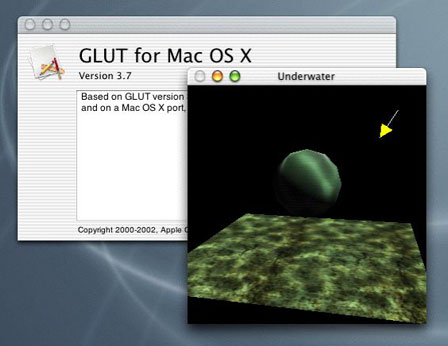

> 导航：[总目录](../../../README.md) · [documentation](../../../_indexes/documentation.md) · [Porting to Mac OS X from Windows Win32 API](Porting%20to%20Mac%20OS%20X%20from%20Windows%20Win32%20API.md)

[Next](Internationalization.md)[Previous](Drawing%202D%20Graphics%20in%20Mac%20OS%20X.md)

# 3D Graphics in Mac OS X

3D graphics are integral to many game, animation, and modeling products, and Mac OS X provides top-quality support for 3D in the form of the cross-platform OpenGL graphics environment. Depending on the graphics acceleration hardware installed, Mac OS X provides full support for OpenGL 3D v1.3 (OpenGL v1.2 for Mac OS X v10.1x and earlier). If your application supports OpenGL, you should have no problem porting your OpenGL code to Mac OS X. Maya, a high-end photo realistic 3D animation system, and Quake III, one of the most popular first-person shooter games available today, are two examples of cutting-edge OpenGL programs that have been ported to Apple's implementations of OpenGL.

OpenGL itself is a hardware-independent API that provides no support for windowing tasks or obtaining user input. Apple's implementation provides four APIs for working with OpenGL:

- NSGL, for use with the object-oriented Cocoa application environment
- the AppleGL Library (AGL), for use with the procedural Carbon application environment
- CGL (the core OpenGL API), for use with full-screen graphics applications only
- the OpenGL Utility Toolkit (GLUT), for use with legacy GLUT code

Since you are porting your C or procedural C++ code to Mac OS X, you will probably want to investigate the AGL API. It is a higher-level API that enables you to do graphics rendering inside a window. AGL automatically loads the necessary libraries for the routines that your application uses, as well as enabling you to choose the best renderer for a given pixel format. If you wish, you can select specific renderers or specify criteria by which the renderer is chosen. AGL also handles the choosing of renderers when a graphics image spans multiple monitors.

Be aware that OpenGL does not allow direct access to any of its frame buffers. Instead, you must use the appropriate OpenGL functions, such as `glReadPixels`, to read the frame buffer into system memory. Apple has optimized the routines that access and work with OpenGL, and these routines provide higher performance than most programmers could achieve even if they had direct access to the OpenGL frame buffers.

OpenGL is a cross-platform standard, but be aware that not all hardware renderers support all the OpenGL extensions. At run time, applications must check the OpenGL version or extensions string for the current renderer to determine what features the current renderer supports.

Mac OS X version 10.2 (Jaguar) supports 33 new OpenGL extensions and includes a number of other improvements. You may want to require customers to have Mac OS X version 10.2 or later to run your application.

Since you are making your application cross-platform, consider using QuickTime to simplify your Win32 and Mac OS X code bases. QuickTime includes functions that enable you to open files in dozens of graphics formats. You can simplify your code on both platforms by using QuickTime to open texture files.

OpenGL is an open graphic standard implemented on Windows, Mac OS, Linux, and other platforms. The best web site for documentation, links, and other resources is the OpenGL web site, at [http://www.opengl.org](http://www.opengl.org/). In addition, you should use the resources listed below to get started with OpenGL on Mac OS X.

|  |  |
| --- | --- |
| _OpenGL for Mac OS_ book | _[OpenGL Programming Guide for Mac](../../Graphics%20Imaging/OpenGL%20Programming%20Guide%20for%20Mac/About%20OpenGL%20for%20OS%20X.md#apple-f4xwc4dqnrsv64tfmyxwi33df52wszbpkridimbqgaytsobx)_ |
| AGL API Reference | Inside Carbon: OpenGL |
| OpenGL Extensions Guide | [http://developer.apple.com/opengl/extensions.html](https://developer.apple.com/opengl/extensions.html) |
| list of OpenGL extensions supported by Mac OS X v10.3 | [http://developer.apple.com/opengl/panther.html](https://developer.apple.com/opengl/panther.html) |
| OpenGL sample code from the Mac OS X Development Tools suite | located on a Mac OS X hard disk at `/Developer/Examples/OpenGL/GLUT` |
| OpenGL Shader Builder and OpenGL Profiler tools | located on a Mac OS X hard disk at `/Developer/Applications` |
| OpenGL man pages | type "`man <commandname>`" from a Terminal window--for example, "`man glClear`" (see `gl.h` for command names) |
| OpenGL header files | located on a Mac OS X hard disk at `/System/Library/Frameworks/OpenGL.framework` and `/System/Library/Frameworks/AGL.framework`--in particular, `agl.h` (includes `gl.h`), `glu.h`, `glut.h`, `OpenGL.h` (for full-screen graphics), `glext.h` (for OpenGL extensions) |
| OpenGL sessions at WWDC 2002 | \* session 504--OpenGL: Graphics Programmability  \* session 505--OpenGL: Integrated Graphics 1  \* session 506--OpenGL: Integrated Graphics 2  \* session 513--OpenGL: Advanced 3D  available for purchase at [http://developer.apple.com/adctv/](https://developer.apple.com/adctv/)  \* session 514--OpenGL: Performance and Optimization |

[Next](Internationalization.md)[Previous](Drawing%202D%20Graphics%20in%20Mac%20OS%20X.md)

