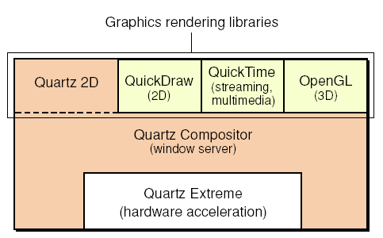

> 导航：[总目录](../../../README.md) · [documentation](../../../_indexes/documentation.md) · [Porting to Mac OS X from Windows Win32 API](Porting%20to%20Mac%20OS%20X%20from%20Windows%20Win32%20API.md)

[Next](3D%20Graphics%20in%20Mac%20OS%20X.md)[Previous](Porting%20to%20Mac%20OS%20X%20from%20Windows%20Win32%20API.md)

# Drawing 2D Graphics in Mac OS X

2D graphics are a big part of most applications. Except for the parts of a window drawn automatically by the user interface, you are responsible for drawing everything in your application's window. The portion of the Win32 API devoted to the Graphic Device Interface (abbreviated here as the Win32/GDI) provides routines that are analogous to those provided by QuickDraw (Apple's original graphic drawing environment for the Mac OS), but they are structured differently.

Since this Guide is written for programmers porting existing Win32/GDI code to Mac OS X, this document concentrates on explaining the QuickDraw API, the Mac OS X API that is the closest structurally to your existing code. However, depending on your situation, you may want to consider using the more powerful Quartz 2D API. See "Introduction to Quartz 2D," later in this document, for a brief description of Quartz 2D and a summary of its advantages, which include vector-based, resolution-independent graphics, sophisticated drawing based on paths and complex transformations, and built-in support for creating PDF documents.

This Guide is primarily concerned with the Win32/GDI API and Apple's QuickDraw API, both of which are well over 15 years old. During this time, these two APIs have evolved to provide graphics capabilities that have repeatedly tested the limits of the day's computers. The capabilities of both computers and their video displays have increased by more than a factor of 100 since these two drawing environments were created. This means that both of them are complicated by routines and concepts that, being outdated, clutter the API landscape and make it more difficult to describe how to move Win32/GDI drawing code to the Mac OS X platform.

Because of these limiting factors, this document necessarily omits some aspects of both drawing environments, especially those that are no longer in common use. For the sake of clarity, this document ignores certain special-case situations and simplifies certain details. For example, this document ignores the subject of indexed color, since virtually all computers now display 16 or 24-bit "direct" color. Also, this document refers to both device-dependent bitmaps (DDBs) and device-independent bitmaps (DIBs) as "bitmaps," and it does not mention how both platforms automatically map a "pure" color into the closest equivalent available on the display device being used.

The core portion of the Mac OS X graphics and windowing environment is called Quartz. To achieve various benefits (including implementation of backward compatibility), Quartz is implemented in two pieces, a rendering API (Quartz 2D) and a window server (Quartz Compositor). This modularity enables Quartz 2D to coexist with other APIs, one of which is QuickDraw, the API that you are most likely to use when you port your Win32 application to Mac OS X.

The core of the Mac OS X drawing and windowing architecture is called Quartz. It has two pieces:

- Quartz 2D--one of several graphics libraries that provide 2D text- and graphics-rendering services
- Quartz Compositor--the window server and Quartz Extreme, the component that interfaces to the computer's graphics-acceleration hardware

As you can see from the diagram below, QuickDraw is one of the graphics rendering libraries that you can use for drawing graphics under Mac OS X.

 

Under Mac OS X, QuickDraw thinks it is drawing directly to the graphics memory, just as it did in the earlier versions of Mac OS. In actuality, though, it is drawing to an off-screen graphics buffer. The Quartz Compositor combines this off-screen buffer with other graphics information (for example, soft-edge shadows and window transparency information) to produce the final pixmap. The Quartz Compositor delivers the final graphics image to the graphics hardware in a way that minimizes the delay in displaying changes to the screen, while maintaining the highest possible image quality (by preventing screen flicker and other visual artifacts).

Just as the Win32 platform added new graphics capabilities as display hardware became more powerful, so did the Mac OS platform. The original QuickDraw, which handled only one-bit black-and-white graphics, was replaced by the more powerful Color QuickDraw, which handles both indexed and direct color graphics. The Color QuickDraw API is an almost perfect superset of the original QuickDraw API, though some irregularities exist.

_Inside Macintosh: Imaging with QuickDraw_ is the reference book you will use for learning QuickDraw. In it, the section on Color QuickDraw is an extension to the section on the original QuickDraw API; this means that you need to read both sections, even though you are interested in Color QuickDraw only.

Two problems that confront anyone learning a new platform are learning the overall approach the new technology uses and relating concepts from the old technology to those of the new technology. This section addresses both concerns through the use of some introductory text about the most-used parts of the QuickDraw drawing environment and through tables that compare how the Win32/GDI and QuickDraw environment compare to each other.

While programming, you need a way to refer to a window. Under Win32, you identify a window through its _display context_. (Granted, in some cases you are manipulating the _device context_ of the graphics hardware, but this Guide simplifies things by always using the term "display context.") In QuickDraw, you refer to a window by its `CGrafPort` (a programming shorthand for "color graphics port").

In QuickDraw, drawing commands have a slightly different form from their Win32 counterparts. While Win32 drawing commands always take a display context as their first argument, QuickDraw commands do not. Instead, QuickDraw always assume that any drawing command is intended for the current graphics port. Therefore, to draw into a different window, you must first "set the graphics port" (that is, set the `CGrafPort` of the desired window to be the current port), then issue the drawing commands for the new window.

There is one terminology difference you need to be aware of. Whereas the Win32/GDI API simply speaks of bitmaps, which can be black-and-white (one bit per pixel) or color (multiple bits per pixel), past and current versions of the Mac OS operating systems--and their documentation--use separate terms: _bitmap_ for a one-bit black-and-white pixel image, and _pixmap_ for a color pixel image.

Table 1 summarizes the differences regarding windows under the Win32/GDI and QuickDraw drawing environments.

__Table 1__  Comparison of window basics.

| _Win32/GDI_ | _QuickDraw_ |
| The data structure that allows drawing in a window is a device context or a display context (abbreviated as DC). | The data structure that allows drawing in a window is a color graphics port, also called a `CGrafPort`. |
| A display context (usually) represents the client area of a window. | The `CGrafPort` represents the client area of a window. |
| All drawing routines include the name of the DC they are drawn to. | Drawing routines do not include the name of the window's `CGrafPort`. Instead, you make a window the current graphics port. All subsequent drawing occurs in the current port. |
| A memory device context is used as an offscreen bitmap. | To draw in an offscreen pixel map, you must create a "graphics world," or `GWorld` , and make it the current graphics port. Subsequent drawing occurs into the `GWorld` until the graphics port is changed. |
| It is possible, though not recommended, to access and change the bitmap associated with a DC. | It is possible to access and change the pixel map associated with a `CGrafPort`. See text for details. |

If you are interested in accessing the pixel map associated with a `CGrafPort`, see the documentation for the following routines: `GetWindowPort`, `LockPortBits`, `GetPortPixMap`, `LockPixels`, `GetPixBaseAddr`, `GetPixRowBytes`, `UnlockPixels`, and `UnlockPortBits`.

Apple has always controlled both the hardware and the operating-system software of its computers, so it was able to ensure that pixels are "square" – that is, that a pixel displayed on the screen is exactly as tall as it is wide. Because of this, the designers of QuickDraw did not have to deal with both logical and device coordinate systems, which possibly (in older computers) were not identical.

In QuickDraw, there is only one coordinate system, and it is a simple one. Unless you specify otherwise, the point (0,0) is the upper left corner of the client area of a window (if you are talking about the "local" coordinate system of a given window) or of the desktop itself.

Another subtle but very important difference between the Win32/GDI and QuickDraw coordinate systems is the relationship between the abstract coordinate grid and the pixels and lines drawn in relation to them. On the Win32 side, pixels (which have a measurable diameter) are drawn so that their centers correspond to the intersection of the appropriate horizontal and vertical grid lines, and the thickness of drawn lines straddle their corresponding coordinate lines.

In QuickDraw, pixels and lines are drawn in the spaces _between_ coordinate lines. To be specific, they are drawn immediately to the right of and below the points that define them. The original QuickDraw engineers felt that this method leads to less confusion when questioning whether, for example, a 10-by-10 square drawn with its upper left corner at (0,0) includes the pixel corresponding to the point (10, 10). In QuickDraw, the answer is "yes," while in Win32/GDI, the answer is "no," and Win32 programmers must keep this "up to but not including" rule in mind.

Table 2 summarizes the differences regarding coordinate systems between the Win32/GDI and QuickDraw drawing environments.

__Table 2__  Comparison of coordinate systems.

| _Win32/GDI_ | _QuickDraw_ |
| Device contexts can use logical coordinates that do not have a 1:1 relationship to the physical display (that is, scaling can occur). | Coordinates in the programming model have a one-to-one relationship to the physical display. |
| Has multiple mapping modes, in which increasing x values may indicate movement to the right or left, and increasing y values may indicate movement up or down. | Has fixed coordinate system: increasing x values move to the right, and increasing y values move down. Equivalent to Win32 MM_TEXT mode. Points may be described using either local (window) or global (desktop) coordinates. |
| Pixels are drawn at the intersection of the imaginary lines that define the logical coordinate system. That is, the imaginary lines that define point (x0, y0) go through the center of the pixel drawn at (x0, y0). | In QuickDraw, the intersection of the two imaginary lines that define point (x0, y0) is "ideal" — that is, it has no height or depth. Pixels, which have measurable height and depth, are drawn in the squares between the imaginary lines that define the coordinate system. In particular, the pixel corresponding to (x0, y0) is drawn to the right of and below the ideal point at (x0, y0). |

Win32/GDI pens have evolved over time, so you now have different kinds of pens available for use — stock pens, logical pens, and geometric and cosmetic extended pens. In contrast, QuickDraw has only one kind of pen.

Just as QuickDraw always draws into the current port, it always draws with the current pen, and you use such routines as `PenSize`, `PenPixPat`, and `PenMode` to change the pen's size, pixel pattern, and drawing mode. If you have pens that you use frequently, you should create subroutines for defining them; that way, you can switch between pens with a single subroutine call.

In QuickDraw, a pen can draw in a solid color, optionally modified by an arbitrary one-bit pattern, or it can draw using an arbitrary pixmap. In addition, the drawing process can also be modified by the use of different transfer modes, though these are infrequently used.

The QuickDraw pen always has a pen pattern, a pen mode, a foreground color, and a background color, all of which affect how pen drawing works. The pen pattern, unlike the Win32/GDI hatch pattern, is defined by the programmer and can take on any value. QuickDraw defaults to using a solid black pen pattern and the `patCopy` pen mode, which results in an easy-to-understand pen that draws in the `CGrafPort`'s foreground color. However, the pen's behavior can become quite complex:

- If the pen pattern is a bitmap, depending on the pen mode used, a pixel "touched" by the pen can become the foreground color or the background color, it can be inverted, or it can remain unchanged.
- If the pen pattern is a pixmap, the pixmap itself is used to draw whatever line or area that is requested by the pen-drawing command. In this case, any pixel touched by the pen is replaced by the appropriate pixel from the pixmap.
- Also, when the pen is used to draw a line or outline a shape, it does not draw with its width straddling the path. Instead, the upper left corner of the pen is dragged along the path, meaning that "ink" is always deposited below and to the right of the current point on the path.

If your application makes heavy use of drawing features not found in QuickDraw, you should consider porting your Win32 application to Mac OS X using the Quartz 2D API. See "Using Quartz 2D," later in this document, for details.

Table 3 summarizes the most important differences regarding pens between the Win32/GDI and QuickDraw drawing environments. This summary should make the process of learning about QuickDraw pens easier.

__Table 3__  Comparison of Win32 geometric pens and QuickDraw pens.

| _Win32/GDI_ | _QuickDraw_ |
| A DC includes attributes that point to the current pen and brush (which are separate data structures from the DC). | A `CGrafPort` contains attributes that describe the current pen and its color or pixel pattern. |
| The cross-section of a geometric pen is square. | The cross-section of a QuickDraw pen is rectangular--that is, its width and height can be different from each other. |
| A geometric pen can draw in a solid color and erase using background color. | A pen can draw in a solid color and erase using background color. |
| A geometric pen is specified by a width value; the line drawn is (usually) centered on the "ideal" line described by the drawing command. | A pen is described by width and height values; the pen draws in such a way that the upper left corner of the pen's rectangular cross-section traces the "ideal" line described by the drawing command. |
| A geometric pen, using a hatched brush, can draw a solid color modified by a predefined hatch pattern. | A pen can draw with a solid color and any pattern. |
| A geometric pen can specify dash, endcap, and line join styles. | QuickDraw has no equivalent, though Quartz 2D (a more advanced drawing environment) does. |
| By using a pattern brush, a geometric pen can draw using an arbitrary bitmap as its "ink." | By using a color pixel pattern (`PixPat`), a pen can draw using an arbitrary bitmap as its "ink." |
| The drawing process can be modified by using a DC's drawing mode attribute. | The drawing process can be modified by using different transfer modes. |

Though the Win32/GDI and QuickDraw environments have roughly the same capabilities when it comes to drawing geometric shapes, each environment structures the drawing process differently. QuickDraw does not have an equivalent to the Win32/GDI brush. Instead, when you are drawing shapes, you use a different command depending on how you wish to draw its interior, and the drawing can be accomplished with either the pen or an arbitrary bitmap or pixmap.

The verb at the beginning of each shape-drawing command's name indicates how the drawing is accomplished:

- Commands starting with "Frame" (for example, `FrameOval` ) draw the outline of the shape using the pen and its behavior as described earlier; the interior of the shape is not affected.
- Commands starting with "Paint" (for example, `PaintOval` ) paints the shape's interior using the pen and its behavior described earlier. The outline of the shape is not stroked by the pen.
- Commands starting with "FillC" (for example, `FillCOval` ) fills the shape's interior using an arbitrary pixel pattern (not the pen pattern). Any pixel touched by the pen is replaced by the appropriate color pixel from the pixmap. The command for setting this _pixel_ pattern is `PenPixPat`.

Table 4 summarizes the most important differences regarding geometric shapes between the Win32/GDI and QuickDraw drawing environments.

__Table 4__  Comparison of geometric shapes.

| _Win32/GDI_ | _QuickDraw_ |
| Geometric shapes available: rectangles, ellipses, chords, pie-shaped wedges, rounded rectangles. | Geometric shapes available: rectangles, ovals, arcs and wedges, rounded rectangles. |
| To draw a basic geometric shape (for example, an ellipse) without filling it, you must draw it with the display context's brush filled to the background color. In this case, the drawing command is `Ellipse`. | To draw an outlined shape, QuickDraw uses commands that begin with "Frame" — in this case, `FrameOval`. |
| To draw an ellipse filled with a solid color, you must set the display context's brush to the given color and call the `Ellipse` command. | To draw a filled shape, QuickDraw uses commands that begin with "Paint" — in this case, `PaintOval`. This command paints the interior of the ellipse with the current foreground color. If you specify a one-bit pattern and a Boolean transfer mode, you can fill the oval with a result that is based on the pattern and weighted mixes of the foreground and background colors. |
| To draw an ellipse filled with a color bitmap, you must set the display context's brush to a pattern brush and call the `Ellipse` command. | QuickDraw uses commands that begin with "FillC" — in this case, `FillCOval`. This command requires, in addition to the description of the bounding rectangle, a reference to the pixel pattern to be used. |
| Win32 has an `InvertRect` command but no other commands for erasing or inverting geometric shapes. | QuickDraw has additional commands for erasing and inverting each geometric shape (in this example, `EraseOval` and `InvertOval`). |

In QuickDraw, the drawing of polygons mirrors the drawing of geometric shapes in most respects (see [Table 5](#apple-f4xwc4dqnrsv64tfmyxwi33df52wszbpgiydambsgm2tkljrgaytanjt), below). One difference from the Win32/GDI model is that in QuickDraw, you must explicitly create the polygon as a data structure before you can draw it.

__Table 5__  Comparison of polygons.

| _Win32/GDI_ | _QuickDraw_ |
| A polygon is defined by an array of points, which is one of the parameters of the `Polygon` command. | In QuickDraw, you must create a polygon data structure before you can draw using it. You do this using an `OpenPoly` command, followed by line-drawing commands, followed by a `ClosePoly` command. |
| As with geometric shapes, you create outline, color-filled, and bitmap-filled polygons with the same command, but with different brush settings. | As with geometric shapes, you have multiple polygon commands. `FramePoly` draws the polygon with the pen. `PaintPoly` draws the polygon with the pan and fills its interior with a solid color. `FillCPoly` draws the polygon with the pen and fills its interior with a pixel map (color bitmap). |
| Win32/GDI has no commands for erasing or inverting a polygon. | As with geometric shapes, QuickDraw includes `ErasePoly` and `InvertPoly` commands. |

A QuickDraw region performs the same task as a Win32/GDI path in that you can use either to draw lines and fill areas based on a prerecorded set of graphic operations (see Table 6).

__Table 6__  Comparison of Win32/GDI paths and QuickDraw regions.

| _Win32/GDI_ | _QuickDraw_ |
| A Win32/GDI path is the union of an arbitrary collection of graphical outlines that can be filled or stroked. | A QuickDraw region is a data structure that separates all points into those included in the region and those not included in the region. You can stroke its outline with a pen, paint its interior with a solid color or pixel pattern, use it as a mask for another drawing operation, or test for the presence of a mouse click inside it. |
| You must create a Win32/GDI path before you can draw using it. You do this using a `BeginPath` command, followed by a series of drawing commands, followed by an `EndPath` command. | You must create a QuickDraw region before you can draw using it. You do this using a `OpenRgn` command, followed by a series of drawing commands, followed by an `CloseRgn` command. |
| Use the `StrokePath` command to draw an outline using a Win32/GDI path and the current pen. | Use the `FrameRgn` command to draw an outline using a QuickDraw region and the current pen. |
| Use the `StrokeAndFillPath` command to draw with the current pen and fill with either a solid color or a bitmap. | Use the `PaintRgn` command to draw with the current pen and fill with a solid color. Use the `FillRgn` command to draw with the current pen and fill with a pixel map (color bitmap). |
| You can convert a Win32/GDI path to a clipping region for a given DC. | You can use a QuickDraw region as a clipping region for the current `CGrafPort` . You do not need to convert it to another form for this purpose. |
| There are no Win32/GDI equivalents to the commands mentioned at right. | QuickDraw includes `EraseRgn` and `InvertRgn` commands. |

QuickDraw regions can also perform the same drawing and clipping tasks as Win32/GDI regions (see Table 7). When creating a QuickDraw region, you can use certain drawing commands that cannot be used to create a Win32/GDI region. However, this difference is largely negated by the fact that you can create a Win32/GDI path that is equivalent to the QuickDraw region, then convert it to a Win32/GDI region.

__Table 7__  Comparison of Win32/GDI regions and QuickDraw regions.

| _Win32/GDI_ | _QuickDraw_ |
| A Win32/GDI region is a data structure that separates all points into those included in the path and those not included in the path. You can stroke its outline with a pen, paint its interior with a brush, use it as a mask for another drawing operation, or test for the presence of a mouse click inside it. | A QuickDraw region is a data structure that separates all points into those included in the region and those not included in the region. You can stroke its outline with a pen, paint its interior with a solid color or pixel pattern, use it as a mask for another drawing operation, or test for the presence of a mouse click inside it. |
| You create Win32/GDI regions like you do Win32/GDI paths, but your drawing operations are limited to ellipses, polygons, rectangles, and rounded rectangles. You can also convert a Win32/GDI path (which is more versatile) to a Win32/GDI region. | Like Win32/GDI regions, QuickDraw regions are created by a series of drawing operations, but QuickDraw regions can be created using all the shape-drawing commands. |
| You can create a region from the union, intersection, difference, or XOR of two other regions. | You can create a region from the union, intersection, difference, or XOR of two other regions. |

On most computer systems, if you issue drawing commands that write directly to video memory, such commands will occasionally do so just as the video hardware is reading its memory and displaying the results. This results in unintended visual artifacts or "glitches" that degrade the quality of the display. The classic solution for this problem is to first draw the image in an offscreen bitmap, then transfer that image to video memory in one fast operation (called a bit-block transfer, or _bitblt_).

When Apple engineers created Color QuickDraw, they added a new data structure called a `GWorld` (a shortened version of the phrase "graphics world"). A `GWorld` behaves like a Win32/GDI offscreen bitmap, and in Color QuickDraw, you set the graphics port for both (on-screen) windows and (offscreen) and `GWorld`s with the command `SetGWorld`. You can learn about `GWorld`s and how to use them in the "Offscreen Graphics Worlds" chapter of _Inside Macintosh: Imaging with QuickDraw_.

As part of the Quartz drawing architecture, QuickDraw automatically draws into an offscreen bitmap; in fact, it cannot be used in any other way. Therefore, you do not need to use `GWorld`s if your only intent is to prevent visual artifacts from occurring in your display. However, there still are reasons to use `GWorld` s. If, for example, you need to draw a complicated image that you will be reusing, you can first draw the image into a `GWorld` and then save the result for reuse.

QuickDraw has one drawing command, `CopyBits`, that performs the same functions as the `BitBlt` and `StretchBlt` commands in Win32/GDI. Though `CopyBits` is most often used simply to copy a pixmap to new location, be aware that you can also use it to transform the image in various ways during the copy process; see the “Color QuickDraw” chapter of _Inside Macintosh: Imaging with QuickDraw_ for details.

Table 8 summarizes the differences regarding bit-block transfers between the Win32/GDI and QuickDraw drawing environments.

__Table 8__  Comparison of bit-block transfer commands in Win32/GDI and QuickDraw.

| _Win32/GDI_ | _QuickDraw_ |
| `BitBlt` transfers pixels from a source device context to a destination device context, modified by one of 256 raster operations that combines each source bit, the corresponding pattern bit (from the current brush), and the corresponding destination bit. | `CopyBits` transfers pixels from a source `CGrafPort` to a destination `CGrafPort`, modified by one of 18 source transfer modes that combines each source bit and its corresponding destination bit. If the source and destination areas are not the same size, `CopyBits` resizes the source area to fit the destination area. |
| `StretchBlt` behaves like `BitBlt` , but it stretches the source bitmap to fit the dimensions of the destination bitmap. | See above. |
| `PatBlt` copies a 1-bit pattern (from the current brush) into a destination device context, modified by one of 16 raster operations that combines each pattern bit with its corresponding destination bit. | You can use `FillRect` to achieve a similar result to that of `PatBlt`. |
| `MaskBlt` (not available on Windows 98 and earlier versions) transfers pixels from a source device context to a destination device context, modified by a 1-bit mask and a ROP4 raster operator | `CopyMask` and `CopyDeepMask` (available on all versions of Mac OS) transfer pixels from a source `CGrafPort` to a destination `CGrafPort`, modified by a pixel mask. Each resulting pixel is a blending of the source and destination pixels as determined by the value of the corresponding mask pixel. If the mask contains color pixels, the blending is computed per color component. `CopyDeepMask` behaves like `CopyMask`, but in addition, it allows you to select special transfer modes and to pass in a mask-clipping region (as in `CopyBits`). |
| `PlgBlt` (not available on Windows 98 and earlier versions) transfers pixels from a source device context to a destination device context, modified by a 1-bit mask and optional shearing, rotation, and mirror-image operations. | QuickDraw has no equivalent to `PlgBlt`, though Quartz 2D (a more advanced drawing environment) can perform arbitrary 2D transformations on pixmaps, including many not available to `PlgBlt`. |

Just as the Win32/GDI drawing environment has metafiles, a mechanism for storing and playing back a set of drawing commands, QuickDraw has its equivalent: the _picture record_ (also called a QuickDraw picture, or `PICT`). And, just as the original `.wmf` format was largely replaced by the enhanced `.emf` metafile, the original `PICT` format was largely replaced by a color-based "version 2" `PICT` format.

As with everything else in QuickDraw, `PICT` s are measured in pixels, and you can easily retrieve the size of the `PICT` from its header. You create `PICT` s by executing the `OpenCPicture` command, some drawing commands, then finally the `CloseCPicture` command. Later, you can draw them into a rectangular portion of a window or `GWorld` using the `DrawPicture` command.

The `PICT` format is also a standard format for the Clipboard. Along with the plain-text format, every Mac OS X application should be able to cut, copy, and paste `PICT` resources.

Very little needs to be said about using QuickDraw to draw text, since you will probably use functions outside QuickDraw to do so. However, QuickDraw does include a `DrawText` command for simple text drawing. Just as there is only one pen associated with a `CGrafPort` , you also have only one "text tool" to work with, but you can change the font, style, size, and drawing mode of the current `CGrafPort` before using the `DrawText` command.

Table 9 summarizes the differences regarding text between the Win32/GDI and QuickDraw drawing environments.

__Table 9__  Comparison of basic text drawing.

| _Win32/GDI_ | _QuickDraw_ |
| `TextOut` draws text in the current font to the location specified in the command's arguments. | `DrawText` draws text in the current font at the current pen location. (Use `MoveTo` to move the pen to a given location.) |
| `DrawText` draws text into a specified rectangle. | Use `TXNDrawCFStringTextBox` or `TXNDrawUnicodeTextBox` in the Multilingual Text Engine (MLTE) API to draw text into a specified rectangle. |

Quartz 2D is Apple's newest two-dimensional drawing and windowing technology, available only under Mac OS X. It uses the Adobe PDF format as its internal graphics model, thus providing a rich 2D imaging model for graphics, as well as greatly simplifying the creation of PDF files.

Among the features available in Quartz 2D but not in QuickDraw are:

- vector-based, resolution-independent 2D drawing
- Bezier curves
- path-based drawing of graphics and text
- arbitrary 2D transformations of vector shapes (also called paths), text, and pixmaps
- transparency as an attribute of drawing
- contexts, an abstraction that enables the same drawing code to draw to the screen, a printer, or a PDF file
- per-context thread-safe drawing (all drawing for a given context must occur in the same thread)

Porting an application to a new platform always has its own challenges, and these determine what development choices you have. When you port your Win32 application to Mac OS X, you have three choices:

- to port using QuickDraw only
- to port using QuickDraw, with occasional uses of Quartz 2D
- to port using Quartz 2D only

The Mac OS X implementation of QuickDraw includes two routines, `QDBeginCGContext` and `QDEndCGContext` , that enable you to switch to Quartz 2D temporarily for graphic operations that are not available in QuickDraw.

To compete with other Mac OS X applications similar to yours, you will eventually want to rewrite your application to use Quartz 2D exclusively. If your schedule allows it, you may want to consider porting your Win32 code directly to Quartz 2D instead of QuickDraw. This will give you a stronger initial product that will be easier to upgrade in the future.

The following paragraphs describe several miscellaneous issues you should be aware of while porting a Win32 application to QuickDraw:

- Given the fact that QuickDraw graphics are always double-buffered under Mac OS X, the drawing process alone does not determine when the drawn graphics will become visible. If you want to control exactly when they are drawn to screen, first perform the drawing, then call the `QDFlushPortBuffer` routine.
- As mentioned earlier, you do not need to use `GWorld` s simply to prevent unsightly visual artifacts; Mac OS X's built-in double-buffering does this automatically.
- First-time users of the `CopyBits` routine may have trouble getting the desired result. If you're using `CopyBits` to copy a source pixmap, unchanged, to a destination pixmap, you need to make sure that the foreground color is set to black, the background color is set to white, and the source mode is `srcCopy` . For details, read the text at the top of page 4-34 of the _Imaging with QuickDraw_ book.
- Because Apple controls the hardware on which Mac OS X runs, Mac OS X "knows" more about the display hardware available to it than the Win32 operating systems do. Mac OS X does not need to deal with device-dependent bitmaps (DDBs), device-independent bitmaps (DIBs), and DIB sections.
- Some Win32 programmers have reported that `CopyBits` , when used to stretch an image, produces results that are visibly different from those produced by `StretchBlt` . This difference occurs because of the different algorithms used to stretch an image. If you use `StretchBlt` in your Win32 code, be sure to check the visual appearance of the ported code that uses `CopyBits`.
- In indexed color modes under Mac OS X, black and white have fixed palette positions that cannot be changed. Unfortunately, the index values for black and white are reversed from what they are under Win32. If this situation applies to you, you will need to change your application so that it displays black and white correctly in its ported Mac OS X version.
- Although QuickDraw routines specify point coordinates with the horizontal component first--that is, with the x coordinate specified first--the QuickDraw points are stored in memory with the vertical component first--that is, with the y value stored at a lower memory location than the x value. Of course, you shouldn't be accessing memory directly anyway.

Your main reference for QuickDraw is _Inside Macintosh: Imaging with QuickDraw_. In addition to the link for this book, you may find some of the other links below helpful.

|  |  |
| --- | --- |
| The QuickDraw documentation page (includes links to _Imaging with QuickDraw_ and QuickDraw API documentation) | [http://developer.apple.com/documentation/macos8/MultimediaGraphics/QuickDraw/quickdraw.html](https://developer.apple.com/documentation/macos8/MultimediaGraphics/QuickDraw/quickdraw.html) |
| QuickDraw Text book | _QuickDraw Text Reference_ |
| links to `QDBeginCGContext` and `QDEndCGContext` documentation | _QuickDraw Reference_ |
| QuickDraw Text Anti-Aliasing using Quartz 2D | [http://developer.apple.com/qa/qa2001/qa1193.html](https://developer.apple.com/qa/qa2001/qa1193.html) |
| links to Quartz Primer, Drawing with Quartz 2D, Quartz 2D API reference | _Quartz 2D Reference Collection_  _[Quartz 2D Programming Guide](../../Graphics%20Imaging/Quartz%202D%20Programming%20Guide/Introduction.md#apple-f4xwc4dqnrsv64tfmyxwi33df52wszbpkridgmbqgaytanrw)_  _[Quartz Display Services Reference](https://developer.apple.com/documentation/coregraphics/quartz_display_services)_ |
| links to What's New with Quartz 2D documentation, Quartz Extreme information | [http://developer.apple.com/quartz/](https://developer.apple.com/quartz/) |

[Next](3D%20Graphics%20in%20Mac%20OS%20X.md)[Previous](Porting%20to%20Mac%20OS%20X%20from%20Windows%20Win32%20API.md)

