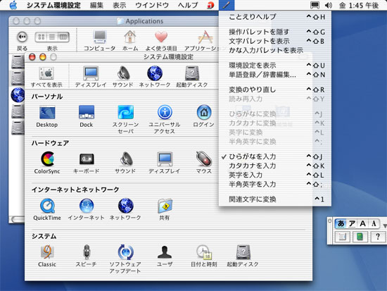
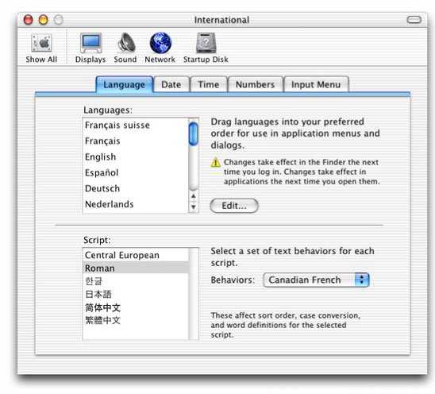

> 导航：[总目录](../../../README.md) · [documentation](../../../_indexes/documentation.md) · [Porting to Mac OS X from Windows Win32 API](Porting%20to%20Mac%20OS%20X%20from%20Windows%20Win32%20API.md)


[Next](Printing%20for%20Carbon%20Applications.md)[Previous](3D%20Graphics%20in%20Mac%20OS%20X.md)

# Internationalization

Mac OS X is fully internationalized--that is, it has built-in support for the input, display, and manipulation of text in a wide variety of languages. Mac OS X also makes it easy for third-party applications to participate fully in its internationalized environment. Because of these factors, this Guide strongly recommends that even if your application does not initially support multiple languages or _locales_ (culturally defined geographic regions), you should structure your application so that you can add such support later. Doing so takes little extra effort and promises considerable future rewards.



Ever since the introduction of the Macintosh computer in 1984, Apple has committed itself to creating computers that support all of the world's major languages and locales (as well as many of the minor ones, too). Beginning with the Carbon application environment, which encouraged MacOS 9 developers to create their software in a way that would ease their transition to Mac OS X, Apple delivered a software architecture that provided even deeper support for localized software.

This section explains various terms and technologies related to Mac OS X internationalization. It is a necessary prelude to learning how to internationalize your Win32 application during the process of porting it to Mac OS X.

For the purposes of this discussion, we distinquish between the terms _localization_ and _internationalization_ as follows:

_Localization_ is the process of changing an existing software product to make it suitable for use in a new language or locale. This process includes changing all user-visible text to a different language, replacing inappropriate images and sounds with locally-acceptable alternatives, and changing various formats and units of measurement to those used in a given locale. If the users of a given locale feel comfortable using an application because it meets their expectations regarding language, culture, and data formatting, you can say that the application has been successfully _localized_ for that locale.

_Internationalization_ (the subject of this page) is the process of designing and implementing a new software product so that it is easy to localize. This means taking advantage of operating-system features that facilitate localization instead of hard-coding the product to one locale.

Mac OS X resources, like their Windows counterparts, contain data needed by a software product--for example, text, icons, images, property lists, and data files. Unlike Win32 applications, which store resources in one or more dynamic link libraries (DLLs), Mac OS X stores some resources individually (for example, sound and image files), while other resources are stored in container files (for example, all of the application's text strings for a given language).

As you will see in the next subsection, resource files must be stored in specific locations. In addition, Mac OS X places restrictions on certain resources, including the specification of what resources must go into a given file and the name and location of that file.

[Porting to Mac OS X from Windows Win32 API](Porting%20to%20Mac%20OS%20X%20from%20Windows%20Win32%20API.md#apple-f4xwc4dqnrsv64tfmyxwi33df52wszbpgeydambqge4talkdjbceqsskirba) stated that a bundle is a directory in the file system that contains executable code and related resources. Mac OS X supports several varieties of bundles. The type of bundle of interest here is called an _application bundle_, which is a directory that contains all the executable code and resources needed to implement an application. To simplify matters for the user, the Finder treats an application bundle like an executable file, not a folder--when a user double-clicks it, the Finder runs the application (as opposed to opening the folder).

One key fact to keep in mind is that Apple's development tool suite assumes that your application bundle is structured according to certain guidelines. Following these guidelines simplifies your code and automatically makes your application internationalized--that is, it ensures that your application can easily be localized to additional languages and locales.

The following figure shows the directory structure of a typical application bundle.

```
MyApp/
 MyApp /* alias to Contents/MacOS/MyApp */
 Contents/
 . MacOS/
 . . MyApp
 . . Helper Tool
 . Info.plist
 . PkgInfo
 . Resources/
 . . MyApp.icns
 . . Hand.tiff
 . . Horse.jpg
 . . WaterSounds/
 . . en_US.lproj/
 . . . MyApp.nib
 . . . bird.tiff
 . . . Bye.txt
 . . . house.jpg
 . . . house-macos.jpg
 . . . house-macosclassic.jpg
 . . . InfoPlist.strings
 . . . Localizable.strings
 . . . CitySounds/
 . . en_GB.lproj
 . . . MyApp.nib
 . . . bird.tiff
 . . . Bye.txt
 . . . house.jpg
 . . . house-macos.jpg
 . . . house-macosclassic.jpg
 . . . InfoPlist.strings
 . . . Localizable.strings
 . . . CitySounds/
 . . Japanese.lproj/
 . . . MyApp.nib
 . . . bird.tiff
 . . . Bye.txt
 . . . house.jpg
 . . . house-macos.jpg
 . . . house-macosclassic.jpg
 . . . InfoPlist.strings
 . . . Localizable.strings
 . . . CitySounds/
 . Frameworks/
 . PlugIns/
 . SharedFrameworks/
 . SharedSupport/
```

The actual executable file is stored at `Contents/MacOS/MyApp`, while all the resources are stored in the directory `Content/Resources`.

In a bundled application, all the resources associated with a given language or locale are stored in a single directory, named _<language name or country or language abbreviation>_`.lproj`, within the Resources directory. For example, the directory for Japanese resources is named `Japanese.lproj` (`Japanese` is a language name), while the directory for the British version of resources for the English language is named `en_GB.lproj` (`en_GB` is a locale abbreviation, as specified by the ISO 3166 standard). A third way of specifying a localization directory involves indicating a language by its two-letter abbreviation, as specified by the ISO 639 standard; an example of this would be `en` for English.

As expected, each file in a `.lproj` directory has a counterpart with the same name in every other `.lproj` directory. Each such file has its content specialized for a different language or locale, but it must have the same name as its counterparts.

Before you can understand how to add international support to your application, you must first understand how Mac OS X presents the issue of international support to both the user and the developer.

Users express their language and locale preferences through the International module of the System Preferences application. In the Languages panel of this module (see below), users can drag and drop names in the Languages scrolling list to indicate which language they prefer to work in (the language at the top of the list) and, if that language is not available, what other languages they prefer to use.



For example, with the settings shown above, the user has expressed her desire to see all software display text, numbers, and data according to the conventions assumed by people who identify with the Swiss dialect of French. If that is not possible, she prefers her software to display using French conventions. If that is not possible, she prefers English, Spanish, and so on down the list.

Mac OS X ensures that each application satisfies the user's language preferences to the best of the application's ability. One application, for example, may display its text and menus in Swiss French because it contains Swiss French resources. Another one (which lacks Swiss French, French, and Spanish resources but contains English resources) displays its text and menus in English because English is the closest that it can get to matching the user's preferences.

It is important to note this central assumption of Mac OS X users: All they have to do is set their language preferences in this one location. Once they have done this, _whenever users open an application, Mac OS X will automatically use the resources within the application that best match their language preferences_.

Like the user, you also have a set of responsibilities that, once carried out, provide you with certain benefits. The benefit for you is the same as for the user: Mac OS X will automatically use the most appropriate resources to display your application's text and data as closely as possible to the user's language preferences.

To give a concrete example, you never have to write any code that checks some language-preference variable and, based on that value, retrieves the most appropriate version of the label for Button 3. Instead, you simply execute a procedure that tells Mac OS X to retrieve the label for Button 3. Mac OS X examines the user's language preferences and returns the Button 3 label string for the language that best matches the user's preferences.

Because of the way that Mac OS X handles language issues, Mac OS X applications are both "language-neutral" and "language-blind." Being language-neutral means that your application can display different languages equally well. Being language-blind means that it neither knows nor cares what language it is displaying to the user; it also means that your application contains no code that is tied to a given language.

Though the topic of Unicode was covered in [Using Text in Mac OS X](Using%20Text%20in%20Mac%20OS%20X.md#apple-f4xwc4dqnrsv64tfmyxwi33df52wszbpgiydambsgm3dalkdjbcemr2ejfda), one piece of information bears repeating here: Unicode is the basis of all text storage and manipulation in Mac OS X. Unicode makes it possible for Mac OS X to use the same system and application code to display such widely different scripts as Arabic, traditional Chinese, Italian, and Russian.

This section talks about how to internationalize your application--that is, how to design and implement it to be language-neutral. (Localization, the process of modifying an application to make it acceptable to people in a given locale, is a complex process that will not be covered here.) This Guide recommends that you internationalize your application by following the steps below, even if your application initially supports only one language or locale.

You must do the following things to internationalize your application:

- Internationalize static user-interface resources.
- Internationalize dynamic user-interface resources.
- Write code that retrieves localized resources.

Static user-interface resources are easy to find--they are the ones that you specify while building user-interface elements using Interface Builder. The output of Interface Builder is a file that ends with a suffix of `.nib`.

If a static user-interface element contains text or images that are locale-specific, the `.nib` file that contains them must be placed in the appropriate `.lproj` directory, and you must create a separate `.nib` file for each locale you are supporting. You will use Interface Builder to create each new version of the `.nib` while you are working on. For performance as well as for ease in localization, Apple recommends that you save all your menus in one `.nib` file and that you save each window or dialog in its own `.nib` file.

Languages vary by as much as 30 percent in terms of how much space a given phrase or sentence needs for it to be displayed on-screen. When you are localizing your user interface for additional languages, use Interface Builder if at all possible. By doing so, you can change an interface element's size and position as needed to accommodate any changes in text size.

Some resources, usually images and sounds, are the same for all locales but cannot be handled by using Interface Builder to insert them into your application. In such cases, you should store them directly in the Resources directory of your application bundle.

If user-visible text wasn't specified using Interface Builder, your code must somehow be displaying it dynamically. Mac OS X provides a way for you to write one set of code that will always retrieve the most appropriate localized string to your users. To do this, you must put all user-visible strings, formatted in a certain way, into a file with a name that ends with `.strings`. You must place this file within the appropriate `.lproj` directory, with one version of the file for each locale you are supporting. You can simplify your code slightly if you place these strings in a file named `Localized.strings`. A `.strings` file stores strings in key/value pairs, where the key is a string that is used to look up its associated value string, which is the actual string you want to display.

Most non-text resources have some meaning to the user (for example, the `house.jpg` image file in the application bundle shown earlier) and will be different for each culture. This means that they need to be placed inside the appropriate `.lproj` directory. This Guide recommends that, unless you absolutely know that a resource should be displayed the same way everywhere in the world, you place such non-text resources in `.lproj` directories.

To retrieve localized resources for use in your application, you will use functions from the CFBundle API. The structure of bundles is subject to change in the future. For this reason, it is important that you use functions from the CFBundle API for retrieving resources instead of hard-coding file pathnames into your application.

The CFBundle API uses the function `CFBundleCopyLocalizedString` to retrieve localized strings from a `.strings` file, although it is easier to use the supplied `CFCopyLocalizedString` macro, which calls `CFBundleCopyLocalizedString`. `CFLocalizedString` gets strings from the appropriate version of the current bundle's `Localizable.strings`, although variations of this macro can retrieve strings from other `.strings` files and other bundles.

When you hand `CFLocalizedString` the appropriate key string, it returns with the corresponding value string. For example, the Italian version of `Localizable.strings` for the Apple-supplied application TextEdit contains the following lines:

```
/* Message indicating file couldn't be opened; %@ is the filename. */
"Could not open file %@." = "Non posso aprire il documento %@.";
```

As a second example, the French version of Localizable`.strings` for TextEdit contains:

```
/* Message indicating file couldn't be opened; %@ is the filename. */
"Could not open file %@." = "Impossible d'ouvrir le fichier %@.";
```

When the TextEdit application wants to display a dialog to the user indicating that the requested file `foo.txt` cannot be opened, it calls `CFLocalizedString` with the key string `Could not open file %@.` as one of its arguments. If the user's preference is for Italian, `CFLocalizedString` returns the string `Non posso aprire il documento foo.txt.` If, however, the user's preference is for French, CFLocalizedString returns the string `Impossible d'ouvrir le fichier foo.txt.`

Because there are many types of non-string resources, the CFBundle API provides functions that return the location of the desired resource. Once your application knows the resource's location, it can then take the necessary steps to properly display the resource.

The functions that you will use most often are `CFBundleCopyResourceURL` and `CFBundleCopyResourceURLsOfType`. The first function returns the location of a specific resource. Using the example of the `MyApp` bundle, calling `CFBundleCopyResourceURL` and asking for the resource of type `jpg` named `house` causes the function to return the pathname to the correct localized version of `house.jpg`). The second function returns an array of locations for all localized resources of a given type (for example, all localized JPEG files). Again, using the MyApp bundle as an example, calling `CFBundleCopyResourceURLsOfType` and asking for all resources of type `jpg` causes the function to return an array of pathnames for the correct localized versions of `house.jpg` and `house-macos.jpg`.

Translating all the user-visible text of an application is one of the major tasks associated with localizing an application. Because language translators usually aren't programmers and because the process of manually changing text may introduce errors, tools exist to help the various parties involved in the translation process. Two such tools are AppleGlot, from Apple Computer, and PolyGlot, a third-party product.

AppleGlot can pull localizable information from Mac OS X software into a text file, enabling linguistic translators to easily translate the strings into the target language using only a text editor. AppleGlot can then reinsert the translated strings back into the application.

AppleGlot also supports incremental localization.When software already localized by AppleGlot is later enhanced or modified, subsequent use of AppleGlot highlights only the new or changed items that potentially require localization. AppleGlot supports Cocoa and Carbon applications, shared libraries, and frameworks.

Mac OS X expects to see all Unicode text encoded in the UTF-16 format. Some text editors store Unicode in the UTF-8 format, so be sure that anyone who handles user-visible text uses a text editor that can be configured to save text in the UTF-16 format. On the Mac OS side, one such text editor is Apple's TextEdit.

The Windows platform stores Unicode text in "little-endian" form--that is, with the lower byte of the Unicode character in the lower memory location. The Mac OS X and UNIX platforms store Unicode in "big-endian" form, which stores the upper byte in the lower memory location. If you have Win32 (little-endian) Unicode text that you want to use when you port your application to Mac OS X, you must first convert the text to its big-endian equivalent.

Some Win32 applications contain their own custom support for multiple languages. If that is the case with your application, Apple recommends that you convert it to use localized `.nib` and `.strings` resources. However, if you do not have the resources to do that, you may want to port your existing international-support code to Mac OS X for the first version of your product, then add Mac OS X-style international support to your next release.

The links below point to the documentation you will need to get started with internationalizing your application.

|  |  |
| --- | --- |
| Mac OS X Localization Page (including links to AppleGlot) | [http://developer.apple.com/intl/localization/](https://developer.apple.com/intl/localization/) |
| Getting Started with Internationalization | _[Getting Started with Internationalization](https://developer.apple.com/library/archive/referencelibrary/GettingStarted/GS_Internationalization/_index.html#//apple_ref/doc/uid/TP30001113)_ |
| _Bundle Services Concepts and Tasks_ | [http://developer.apple.com/documentation/CoreFoundation/Conceptual/CFBundles/index.html](https://developer.apple.com/documentation/CoreFoundation/Conceptual/CFBundles/index.html) |
| Bundle Services API documentation | _[Bundle Programming Guide](../../Core%20Foundation/Bundle%20Programming%20Guide/Introduction.md#apple-f4xwc4dqnrsv64tfmyxwi33df52wszbpgeydambqgezdg2i)_ |
| PowerGlot | [http://www.powerglot.com/](http://www.powerglot.com/) |

[Next](Printing%20for%20Carbon%20Applications.md)[Previous](3D%20Graphics%20in%20Mac%20OS%20X.md)

