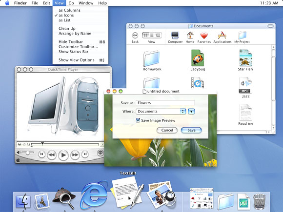
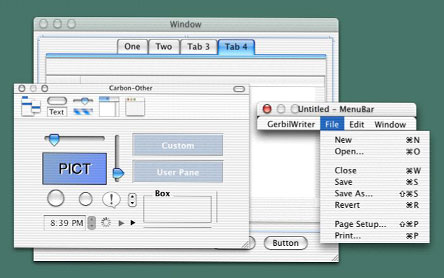
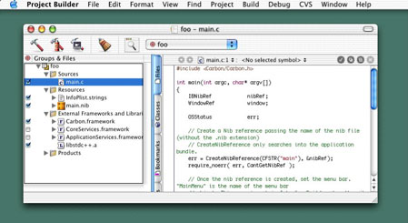

> 导航：[总目录](../../../README.md) · [documentation](../../../_indexes/documentation.md)

[Next](Drawing%202D%20Graphics%20in%20Mac%20OS%20X.md)

# Porting to Mac OS X from Windows Win32 API

Apple provides many programming resources for creating Mac OS X applications, and which one you choose depends upon your needs, preferences, and constraints. If you are unfamiliar with the Mac OS X platform, the process of choosing the right approach can be time-consuming and confusing.

The purpose of this Guide is to get you started porting an existing procedural Win32 application written in C or C++ to Mac OS X. You are, of course, encouraged to explore Apple's various APIs and choose the ones that best fit your needs.

Your first step is to familiarize yourself with the Mac OS X hardware and software environments, which are very different from the Windows environment. There are two books that you absolutely must read: _[Mac Technology Overview](../../Mac%20OSX/Mac%20Technology%20Overview/About%20Developing%20for%20Mac.md#apple-f4xwc4dqnrsv64tfmyxwi33df52wszbpkridimbqgaytanrx)_ and _Apple Human Interface Guidelines_. A third book, [Learning Carbon](http://www.oreilly.com/catalog/learncarbon/), is also highly recommended because it teaches Mac OS X development through the construction of a simple C-based Mac OS X application. You will find further details on these books in the [For Further Information](#apple-f4xwc4dqnrsv64tfmyxwi33df52wszbpgeydambqge4taljzg44tgni) section at the end of this introduction.

After a brief discussion of several important topics, this Guide will introduce you to the procedural APIs that you are most likely to use in the following areas:

- [Drawing 2D Graphics in Mac OS X](Drawing%202D%20Graphics%20in%20Mac%20OS%20X.md#apple-f4xwc4dqnrsv64tfmyxwi33df52wszbpgiydambsgm2tklkcifbegrsdjfba)
- [3D Graphics in Mac OS X](3D%20Graphics%20in%20Mac%20OS%20X.md#apple-f4xwc4dqnrsv64tfmyxwi33df52wszbpgiydambsgm2tmlkcifbeuq2kjbea)
- [The Mac OS X User Interface](The%20Mac%20OS%20X%20User%20Interface.md#apple-f4xwc4dqnrsv64tfmyxwi33df52wszbpgiydambsgm3dclkdjfauor2bizba)
- [Using Text in Mac OS X](Using%20Text%20in%20Mac%20OS%20X.md#apple-f4xwc4dqnrsv64tfmyxwi33df52wszbpgiydambsgm3dalkdjbcemr2ejfda)
- [Internationalization](Internationalization.md#apple-f4xwc4dqnrsv64tfmyxwi33df52wszbpgiydambsgm2tolkcifbekq2iirca)
- [Printing for Carbon Applications](Printing%20for%20Carbon%20Applications.md#apple-f4xwc4dqnrsv64tfmyxwi33df52wszbpgiydambsgm3dglkdivduirskivfa)
- [Networking in Mac OS X](Networking%20in%20Mac%20OS%20X.md#apple-f4xwc4dqnrsv64tfmyxwi33df52wszbpgiydambsgm2tslkcifbesq2civca)
- [Multiprocessing](Multiprocessing.md#apple-f4xwc4dqnrsv64tfmyxwi33df52wszbpgiydambsgm2tqlkdjbceoskdineq)

To best understand the recommendations presented in this guide for porting your Win32 application to Mac OS X, you first need to understand how Mac OS X hardware and software differ from their Windows counterparts. The resources listed in this document's introduction are your best source for this information. However, the sections below introduce key Mac OS X concepts that are important to know about before reading any of the other pages of this guide.

Of course, the biggest news is Mac OS X itself and the fact that its foundation is Darwin, a BSD flavor of UNIX. This means that Mac OS X enjoys all the benefits of a robust UNIX system, including protected memory, preemptive multitasking, BSD system services, and the full BSD tool set.

Mac OS X implements many of the POSIX APIs, which gives you access to a number of powerful UNIX tools and APIs. In addition, you can call supported POSIX routines from the Carbon and Cocoa application environments (explained below) and, in some cases, vice versa.

On top of its UNIX foundation, Mac OS X also includes the visual interface that users see and use every day. This includes the Aqua user interface and the Finder, the primary application through which users find and manage directories, applications, and documents. Macintosh users are very particular about how their applications look and behave, so you need to ensure that your ported application matches their expectations.

Although the Aqua interface looks very different from the Windows interface, the constituent elements of both platforms are very similar. The behaviors of some Aqua interface elements, however, differ subtly from their Windows components, so be sure to check _Inside Mac OS X: Aqua Human Interface Guidelines_ to make sure that your application behaves the way that Mac users expect.

Because of Mac OS X's UNIX foundations, file access is governed by the traditional UNIX owner/group/other permissions system; a user's ability to access and change files is governed by the user's access privileges and the permissions system.

In addition, Mac OS X enhances file system integrity and security through the use of multiple file-system _domains_. There are four domains on a computer running Mac OS X: user, local, system, and network. Each of these domains has separate needs regarding accessibility and security. Any location on the computer or network belongs to one of these four domains, and Mac OS X automatically sets the permissions on files based upon the domain that they're are a part of.

Although Mac OS X ships using Apple's Hierarchical File System Plus (HFS+), Mac OS X also supports the BSD standard file system format (UFS), NFS (an industry standard for networked file systems), ISO 9660 (used for CD-ROM), MS-DOS, smb (a Windows file sharing standard), AFP (Mac OS file sharing), and the UDF file system (used by DVDs).

One thing that should be pointed out concerns the case-sensitivity of the HFS+ file system. For historical reasons, HFS+ is case-insensitive but case-preserving (unlike most implementations of UNIX, which are always case-sensitive). Case-preserving means that the code that implements the HFS+ file system will never change the case of any of the letters in a filename; however, filename matching and comparisons are done in a case-insensitive way.

Mac OS X supports multiple application environments--that is, environments you can use to develop your applications. They are

- Cocoa--a set of object-oriented application APIs, implemented in Objective-C,
- Carbon--a set of procedural APIs evolved from the traditional Mac OS system interfaces,
- Java--the APIs of Sun Microsystems' Java language platform,
- BSD--the APIs available via the Darwin Open Source portion of Mac OS X,
- Classic--a runtime environment to enable users access to applications written for Mac OS 9 and earlier versions,

Wherever possible, it is recommended that you develop applications using the Cocoa environment. However, Carbon is a good choice when your application is already implemented in C or C++ code that has been written in a procedural (as opposed to object-oriented) style.

Event handling under Carbon should be familiar to anyone who knows how to program Win32 applications. Though the Carbon event model uses a different set of terms and has structural differences from its Win32 counterpart, the overall structure of a Carbon application is similar to that of a Win32 application. In both cases, the operating system sends to the application those events that belong to it and routes them to the appropriate targets. Each target has a software routine associated with it. When a target receives an event, its associated software routine either handles the event or hands it back to the operating system, which handles the event in a standard way.

The Carbon equivalent of a Win32 MSG structure is an _event_, which is manipulated through a data type called an _event reference_. In Carbon, an event is an opaque data structure (referenced using an `EventRef`), much like a Win32 window `HANDLE`--that is, you do not know how is represented internally, but the operating system provides ways to access data associated with it. Carbon enables you to get certain data from an `EventRef`:

- the event class, which specifies the source of the event (for example, the keyboard, a control, or the menu system)
- the event kind, which specifies a specific event within a given class of events
- the event time, which is the time at which the event occurred
- event-specific parameters, which vary depending on the event

Carbon provides routines for getting the event class, kind, and time. In addition, once you know which event you have, you can ask for the value associated with any of its parameters by using the Carbon Event Manager function `GetEventParameter`. You can use this function to get a parameter's value by specifying (among other things) the parameter's name and type. With `GetEventParameter`, you always know the type of the value returned.

Just as in Win32 applications, various interface objects in Mac OS X applications--for example, windows, controls, and drop-down lists--can receive events. These interface objects are called _event targets_. When an event occurs, its event reference is delivered to the most specific target, which may handle the event or pass it to a less specific target. For example, a mouse click delivered when the mouse pointer is over a window's button is delivered to the button, not the enclosing window (which is a less specific target).

In Win32 applications, each window has a window procedure associated with its window class when the window is defined. When an event belonging to a window occurs, the system gives the event's data to the window procedure, and the procedure executes. If the procedure does not know how to handle the event, it causes the system to handle it by executing the `DefWindowProc` procedure.

The Win32 environment handles events using code that works at the window level--that is, a window procedure contains code that handles all the events belonging to that window class. In contrast, Carbon handles events at the event level--that is, you write code that handles an event or a group of events, then you attach it to a given event target.

Part of initializing a target involves installing all its event handlers, creating what is called a _handler stack_. When an event is sent to its target, the target passes the event to the handler stack, and the first handler that matches it gets to handle the event. Each event target has a default handler (placed at the bottom of the handler stack), which provides default behavior for a given class of target.

With its use of event handlers, Carbon provides a finer level of control than Win32 does. However, for ease of porting, you can adapt your existing window procedures to work well in the Carbon environment. You do this by installing it in such a way that it handles all the appropriate events for the given target.

The following table summarizes the structural differences between event handling on Win32 and on Mac OS X:

|  |  |  |
| --- | --- | --- |
|  | _Win32_ | _Mac OS X_ |
| _Mechanism for reporting events_ | MSG structure | event reference |
| _Name of handler_ | window procedure | event handler |
| _How handler is associated with target_ | specified as parameter when window class is defined | `InstallEventHandler` invoked during target (window, button, etc.) initialization |
| _How specific event is identified_ | message field of `DefWindowProc` | event kind (derived from the event type) |
| _How unhandled events are processed_ | window procedure calls `DefWindowProc` | event handler returns a "not handled" value |

An application bundle is a highly structured set of files that must be configured correctly for an application to work properly. It is recommended that you use Interface Builder and XCode for developing all your Mac OS X applications. These two programs include numerous features that

- streamline the process of designing, building, and debugging your application,
- organize the files needed by your application,
- enable you to create application bundles without knowing many of the low-level details involved,

This application provides a GUI (graphical user interface) for the following actions:

- building your application's windows and menus from a palette of interface elements,
- customizing these elements to fit your needs,
- giving these elements identifiers that your code will use to reference them,

You will use Interface Builder to translate your application's visual appearance into the visual appearance of a well-designed Mac OS X application. Interface Builder stores the results of your work in a "nib" file. Later, your finished application will read this file to re-create your application's visual appearance.

Xcode is Apple's IDE (integrated development environment) for creating, designing, debugging, and deploying various kinds of Mac OS X software. For porting Win32 applications, you should use Xcode to create a nib-based Carbon application.

When you create a new project, Xcode creates a directory for your project and populates it with the appropriate folders and files. This directory contains all the files that are associated with your project, making it easy for you to backup your project or move it to another location.

Xcode uses the gcc compiler from the GNU Compiler Collection, so you can use Xcode for projects written in C, C++, and Objective-C (as well as Java and other languages). Xcode analyzes your source-code files at each build operation and creates the necessary make file automatically, so you don't have to maintain one yourself.

As part of the build operation, Xcode assembles the many files associated with a Mac OS X application into an application bundle. Once your project builds successfully, you can deploy it immediately by dragging the bundle's icon to the desired location.

A bundle is a directory in the Mac OS X file system that stores executable code and software resources related to that code but is displayed in the Finder as a single icon. There are several kinds of bundles; you will be most interested in the _application bundle_, which is the kind of bundle used to package and distribute Mac OS X applications.

Bundles decrease user confusion and keep the file system from appearing cluttered. In addition, they help make sure that an application always uses the proper versions of any needed libraries, and they make it possible for a single application to contain support for multiple geographical locales.

When users double-click an application bundle's icon, Mac OS X executes the associated application. Mac OS X uses bundles to store an application and all the files it needs, including character strings in multiple languages, images, plug-ins, shared libraries, frameworks, and arbitrary data files (also called _resources_).

One of the primary purposes of this Guide is to direct you to the resources that will bring you up to speed on Mac OS X as quickly as possible. Unless you are very familiar with the architecture of Mac OS X, you should first read _Inside Mac OS X: System Overview_. A PDF of this book is freely available from Apple through the Internet.

Eventually, you will also need to read the book _Inside Mac OS X: Aqua Human Interface Guidelines_ to understand the Mac OS X user interface. _Inside Carbon_ makes a good second book to read because it introduces you to the actual process of creating a simple Mac OS X application.

This section, "For Further Information," ends each page of this Guide and offers pointers to the most relevant documentation and resources for porting your Win32 applications to Mac OS X. To make it as easy as possible for you to get started with Mac OS X, Apple makes all of its documentation and tools available free. (Apple charges for access to videotaped Worldwide Developer Conference sessions.)

|  |  |
| --- | --- |
| _Mac OS X Technology Overview_ | _[Mac Technology Overview](../../Mac%20OSX/Mac%20Technology%20Overview/About%20Developing%20for%20Mac.md#apple-f4xwc4dqnrsv64tfmyxwi33df52wszbpkridimbqgaytanrx)_ and |
| _Inside Mac OS X: Aqua Human Interface Guidelines_ (REQUIRED) | _Apple Human Interface Guidelines_ |
| _Learning Carbon_ book | [http://www.oreilly.com/catalog/learncarbon/](http://www.oreilly.com/catalog/learncarbon/) (published by O'Reilly)_(HIGHLY RECOMMENDED)_ |
| Apple Developer Connection (Apple's support program for developers; includes free membership level and access to free Mac OS X Developer Tools suite) | [http://developer.apple.com](https://developer.apple.com/) |
| Developer Tools page | [http://developer.apple.com/tools/index.html](https://developer.apple.com/tools/index.html) |
| New to Carbon Programming page | _[Carbon Overview](../../Carbon/Carbon%20Overview/Introduction%20to%20Carbon%20Overview.md#apple-f4xwc4dqnrsv64tfmyxwi33df52wszbpkridgmbqgaydsojq)_ |
| Worldwide Developers Conference sessions on Mac OS X (available for purchase) | [http://developer.apple.com/adctv/](https://developer.apple.com/adctv/) |

[Next](Drawing%202D%20Graphics%20in%20Mac%20OS%20X.md)

