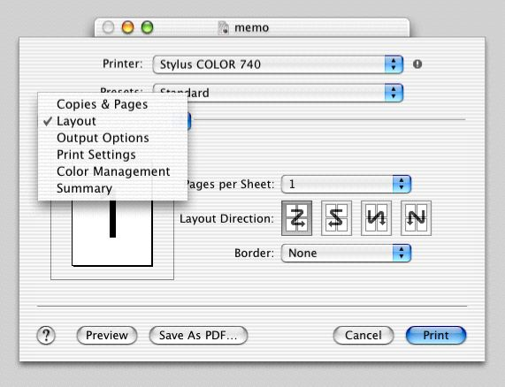
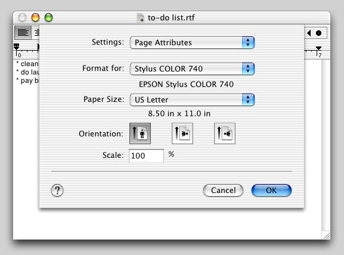
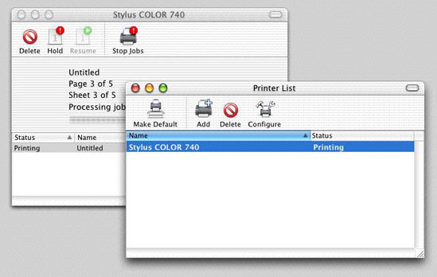

> 导航：[总目录](../../../README.md) · [documentation](../../../_indexes/documentation.md) · [Porting to Mac OS X from Windows Win32 API](Porting%20to%20Mac%20OS%20X%20from%20Windows%20Win32%20API.md)

[Next](Multiprocessing.md)[Previous](Internationalization.md)

# Printing for Carbon Applications

Printing under Mac OS X and Carbon is very similar to printing under Win32. In addition to having separate setup tasks before the printing begins and cleanup tasks after it has finished, the main print loop for both platforms is essentially the same:

1. Declare the beginning of the print job (`StartDoc` for Win32, `PMSessionBeginDocument` for Mac OS X).
2. Declare the beginning of a page (`StartPage` for Win32, `PMSessionBeginPage` for Mac OS X).
3. Issue (largely) the same drawing commands as you would to the screen, "drawing" instead to an image area meant for a printer.
4. Declare the end of a page (`EndPage` for Win32, `PMSessionEndPage` for Mac OS X).
5. Declare the end of the print job (`EndDoc` for Win32, `PMSessionEndDocument` for Mac OS X).

In addition, you must create routines that handle all the errors that might occur during printing.

The three dialogs and windows that are associated with Mac OS X printing are not that different in function from their Windows counterparts. These are the Print dialog, the Page Setup dialog, and the Print Center windows.

The first, the Print dialog, enables the user to set the various parameters associated with the document about to be printed. This dialog can display different panes depending on which menu item user selects from the Features pop-up menu. Some panes are standard to all Print dialogs, while others are specific to the printer or the application. You can add your own panes by implementing them as printing dialog extensions (PDEs); see the _Extending Printing Dialogs_ and _Printing Plug-In Interfaces Reference_ books for details.

Users invoke the Page Setup dialog only if they want to change the default values of certain formatting properties. As with the Print dialog, you can add application-specific panes to the Page Setup dialog.

Print Center is a utility supplied with Mac OS X; its function is to enable users to view and manipulate printers and their print jobs. This utility displays a single window named Printer List (see below). Users can see a printer's current print jobs and can suspend them, delete them, or change the order in which they print.

The Carbon Printing Manager is the API you should use to implement printing when you port your Win32 application to Mac OS X, and the book _Supporting Printing in Your Carbon Application_ is the best starting place for understanding how to do so. The subsections that follow give an overview of the actions your application must take to prepare for and perform printing. (Names in parentheses are the names of Carbon Printing Manager routines that you will use.) You will see that the process is similar in structure to that of printing in a procedural Win32 application.

When the user executes the Page Setup menu item, your application should do the following:

1. Create a printing session object (`PMCreateSession`).
2. Obtain a valid page format object for the document (custom routine from your application).
3. Specify that the Page Setup dialog should display itself as a sheet (`PMSessionUseSheets`).
4. Display the Page Setup dialog (`PMSessionPageSetupDialog`).
5. Save the values from this dialog for future use.
6. Release the printing session object (`PMRelease`) and handle any errors.

When the user executes the Print menu item, your application should do the following:

1. Create a printing session object (`PMCreateSession`).
2. Create a a valid page format object (`PMCreatePageFormat`), if one doesn't exist.
3. Create a print settings object (`PMCreatePrintSettings)`.
4. Display the Print dialog. (Here, the user clicks either the Print button or the Cancel button, and the appropriate actions occur.)
5. Release the printing session object (`PMRelease`), set the print settings object to `NULL`, and handle any errors.

When the user clicks the Print button, your application should execute its print-loop code.

Your print-loop code should do the following:

1. Determine the maximum number of pages that can possibly be printed, then give that information to the computer.
2. Calculate the page numbers of the first and last pages to be printed using data from the Print dialog (`PMGetFirstPage`, `PMGetLastPage`), then give that information to the computer.
3. Create a new print job (`PMSessionBeginDocument`).
4. Set up a loop for drawing each page in the specified range. (Steps 5 through 12 are performed for each page.)
5. Tell the printing system that the code that follows begins a new page (`PMSessionBeginPage`).
6. Save the current graphics port (`GetPort`).
7. Get the graphics printing port for the page to be printed (`PMSessionGetGraphicsContext`).
8. Set that graphics port to be the current QuickDraw graphics port (`SetPort`).
9. Get the rectangle that defines the area in which drawing can occur (`GetPortBounds`).
10. Call the code that draws the current page.
11. Restore the previous graphics port (S`etPort`, using the value from step 6).
12. End the current page (`PMSessionEndPage`).
13. Once steps 5 through 12 have been performed for all the requested pages, signal the completion of the print job (`PMSessionEndDocument`).

You need to write code that handles all the errors that might occur during printing. Part of this support includes a procedure to display alerts with their messages in the human language that most closely matches the user's language preferences. See [Internationalization](Internationalization.md#apple-f4xwc4dqnrsv64tfmyxwi33df52wszbpgiydambsgm2tolkcifbekq2iirca) for details on how to do this properly.

Because Mac OS X stores document pages as PDF files during the spooling process, it is very easy to add support for saving a document as a PDF. You can do this as follows:

1. Direct your printing code to print to a file instead of a printer.
2. Add code that gets the desired filename and file location from the user.
3. Decide whether or not the Page Setup and Print dialogs should be part of the "save as PDF" process. If you decide they should not be (the usual case), you must add code that automatically adds reasonable page-related values to substitute for those normally provided by the Page Setup and Print dialogs.
4. Start the printing process.

By adding these changes, you can use the same code to print a document or save it as a PDF file.

The links below point to the documentation you will need to get started with implementing printing using the Carbon Printing Manager.

|  |  |
| --- | --- |
| Mac OS X Printing page | [http://developer.apple.com/printing/](https://developer.apple.com/printing/) |
| Mac OS X Printing Documentation page | [http://developer.apple.com/printing/](https://developer.apple.com/printing/) |
| the Carbon Printing Manager documentation page | _Carbon Printing Manager Reference_ |
| _About the Mac OS X Printing System_ | _Mac OS X Printing System Overview_ |
| _Extending Printing Dialogs_ | _[Extending Printing Dialogs](../../Printing/Extending%20Printing%20Dialogs/Introduction%20to%20Extending%20Printing%20Dialogs.md#apple-f4xwc4dqnrsv64tfmyxwi33df52wszbpkridgmbqgaydsnzz)_ |
| _Printing Plug-In Interfaces Reference_ | _Printing Plug-in Interfaces Reference_ |
| Carbon Printing Manager header files | `PMApplication.h`, `PMCore.h`, `PMDefinitions.h` (see note below) |

[Next](Multiprocessing.md)[Previous](Internationalization.md)

