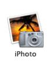
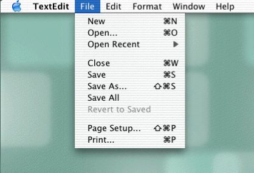
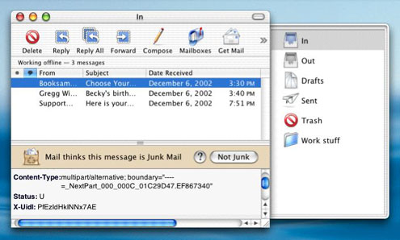
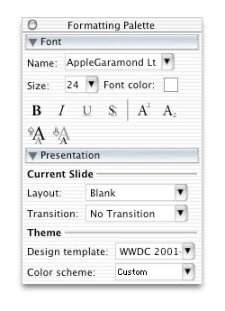
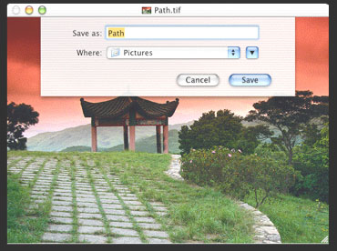
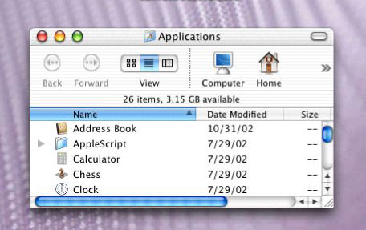
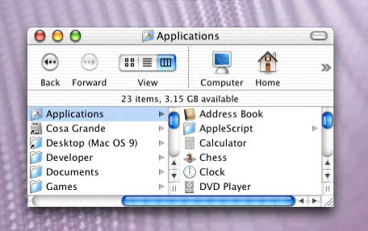
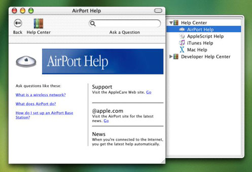

> 导航：[总目录](../../../README.md) · [documentation](../../../_indexes/documentation.md) · [Porting to Mac OS X from Windows Win32 API](Porting%20to%20Mac%20OS%20X%20from%20Windows%20Win32%20API.md)

[Next](Document%20Revision%20History.md)[Previous](Using%20Text%20in%20Mac%20OS%20X.md)

# The Mac OS X User Interface

The user interface is one of the most important aspects of your application. Whether you like it or not, the visual appearance of your application gives users a strong first impression of its quality and your programming skill. As users continue working with your application, its ease of use will, one way or the other, influence what people will say about not just your application but your company as well.

Macintosh users are accustomed to software with a consistent, familiar, Mac-like interface. Does your application look like what your Mac customers expect it to look like? Do interface elements behave correctly, and are they in the right place? Will Mac users immediately feel comfortable with your application, or will they be confused and irritated by its nonstandard approach? One thing is certain: If you do a literal element-by-element porting of your Win32 application's user interface to Mac OS X, you will lose a lot of potential customers.

This document will give you the nuts-and-bolts information you need to know to start porting your application's user interface to Mac OS X. After that, the one book you need to read, cover to cover, is _Apple Human Interface Guidelines_.

But first, you need to learn more about your new customers.

Mac users are accustomed to user interfaces that are aesthetically pleasing, easy to understand, and easy to use. You should design your user interface with this in mind so your application will be appealing to a Macintosh User audience. Apple provides numerous resources discussing User Inteface Design that are presented on the Mac OS X User Experience web site at the address [http://developer.apple.com/ue/](https://developer.apple.com/ue/). You should review the contents of this site and the guidelines presented there in detail when designing your appliction's user interface.

What can you do to make your ported MacOS X application a winner in the user interface arena? Get to know your new audience, and hire people who can help you. Here are some suggestions to get you started:

- Hire a consultant who has experience with Mac OS X user interface design. (Remember that Mac OS X is significantly different from previous versions of the Mac operating system, so recent experience is necessary.)
- Study the Mac OS X applications that will compete with yours.
- Study the applications that are a part of Mac OS X--for example, TextEdit and iTunes.
- Read a tutorial book on Mac OS X. (This is a good way to learn the basics that every Mac user takes for granted.)
- Read _MacAddict_ and _Macworld_ magazines, especially the software reviews.
- Visit a Macintosh users group and talk to people there.

Although it is possible to build a Mac OS X application using only a compiler and a text editor, it's definitely not a good use of your time. Apple provides a free, downloadable suite of powerful development tools for Mac OS X. The most important programs in this suite are Interface Builder, for creating the user interface, and Xcode, for writing, compiling, and debugging your application. (Other development environments are available for Mac OS X; CodeWarrior, from MetroWerks, is one such IDE.)

Since this document is concerned with the Mac OS X user interface, the overview of application development below emphasizes the use of Interface Builder, even though you will spend far more time with Xcode. This overview is necessarily brief.

Before you begin serious work with either Interface Builder or Xcode, you should study at least one of the following two books: _Learning Carbon_, available from the book publisher O'Reilly, or _Converter: Creating a User Interface with Interface Builder_, a short book available from the Apple web site. Each of these resources introduces you to the Mac OS X development process by walking you through the construction of a simple application.

Here are the steps you take to create a new Mac OS X application:

1. _Create a new Xcode project._ The Mac OS X development system organizes all the components related to a given application into something called a _project_. Begin by selecting the "New Project..." menu item, then choosing one of the project templates from the list presented. You will want to choose the "nib-based Carbon application" project template. (In a later step, you will use Interface Builder to build your user interface and then save it as a _nib file_. Later, your application will use the data from this file to create its user interface.)
2. _Open the nib file associated with this project._ You can do so by double-clicking on the file `main.nib` in the project window that appears after you have created the new project. This launches Interface Builder.
3. _Drag controls into your application window._ Interface Builder displays a default empty window and a prebuilt menu bar. You begin your design by dragging interface elements called _controls_ from the control palette to the window. (An application can, of course, have multiple windows, but this description assumes a single-window application.)
4. _Set the attributes for each control in its Info window._ This process configures the control, setting its appearance and some of its behavior. In addition, you also specify information that later enables you to access the control from your application's code.
5. _Configure the menu bar and its menu items._ You can add and delete menus and menu items from the prebuilt menu bar. You then use the Info window to set the attributes for individual menu items.
6. _From Xcode, build and run the application._ The first time you build the application, Xcode generates the bundle that forms the basis of your application. Although the application has no content or custom behavior, it implements many default Mac OS X behaviors. Controls and menu items generate _events_ (messages, in Windows terminology) when you interact with them.
7. _Write event handlers and other code._ You must write an event handler for each control and each application-specific menu item.
8. _Write code to implement the main window's event handler._ This enables controls to receive the events that belong to them.
9. _Debug your application._ Xcode includes a visual interface to gdb, the GNU debugger.

One important point: The best way to move your user interface to Mac OS X is to re-create it as part of the Xcode/Interface Builder development process. Fortunately, Interface Builder includes features that show you exactly where to place interface elements for them to conform to Apple's spacing and placement guidelines. Also, the Aqua interface includes two different sizes of certain interface elements (text fields and buttons, for example). Both these features make it easier and faster to design a good-looking window or dialog.

Aqua is the name of the distinctive Mac OS X user interface. Although its visual appearance is strictly 21st-century, it provides all the elements that characterize a modern graphical user interface. There are some elements in the Win32 user interface that do not appear in the Aqua user interface (as well as some in Aqua that are not available in Win32), but Aqua contains a streamlined set of elements that are more than adequate for any project.

It's important to know what the differences are between your current platform and Mac OS X. This section summarizes those differences, which will help you to be productive more quickly.

The first difference you need to know about is terminology. Certain elements are functionally identical (or almost so) on both the Win32 and Mac OS X platforms but are called by different names. Table 1, below, lists these terminology differences.

__Table 1__  Terminology differences between Win32 and Mac OS X UI elements.

| _Win32_ | _Mac OS X_ |
| _Desktop and Icons_ |  |
| taskbar | Dock |
| Quick Launch bar | Dock |
| shortcut (icon) | alias |
| window button (in the Taskbar) | tile (in the Dock) |
| _Windows and Dialogs_ |  |
| Minimize, Maximize/Restore, and Close buttons | close, minimize, and zoom buttons |
| scroll box | scroller |
| size grip | resize control |
| dialog box | dialog |
| message box | alert |
| secondary window (a term that includes property sheets, inspectors, dialog boxes, palette windows, message boxes, and pop-up windows) | utility window (a floating, modeless window with no title bar; used for property sheets, inspectors, palettes, and other uses, but not dialogs) |
| Properties window (for folders and files) | Info window (for folders and files) |
| Open dialog box (used to browse the file system) | Open dialog |
| Save As dialog box | Save dialog |
| control panel | preference pane (a pane of the System Preferences application used to set the preferences related to a specific service) |
| _Controls_ |  |
| command button | push button |
| option button | radio button |
| check box | checkbox |
| list box | scrolling list |
| drop-down listbox | command pop-down menu |
| text box (edit control) | text input field |
| drop-down combo box | combo box |
| slider (trackbar control) | slider control |
| tree view control | data browser (list view) |
| "+/-" button in a tree view control | disclosure triangle |
| _Miscellaneous_ |  |
| ToolTip | help tag |

One of the most pervasive terminology differences that you will encounter is the term _event_. In Mac OS X terminology, a Carbon event is the same thing as a Win32 message--namely, the data that a control receives when some system or user action occurs. (Because of its object-oriented nature, the Cocoa application environment handles events in a similar but not identical manner.)

As you can see from Table 2 and [Table 3](#apple-f4xwc4dqnrsv64tfmyxwi33df52wszbpgiydambsgm3dcljrgaytanzu) (below), both Win32 and Mac OS X have several user interface elements that the other does not. However, the differences are minor. You should be able to adapt your Win32 user interface to Mac OS X with little extra work. And who knows? You may find some of the Mac-only elements extremely useful in your ported application.

__Table 2__  Win32 UI elements with no Mac OS X equivalent.

| _Win32_ | _Notes_ |
| _Windows_ |  |
| menu bar | The menu bar at the top of the Mac OS X Desktop performs the same function. |
| title-bar icon menu | The application's menu in the Mac OS X menu bar contains similar menu items. |
| _Controls_ |  |
| list view control | Can be created using the List Manager. |
| tree view control | The Mac OS X list-view data browser control is not an exact match, but you can use it for the same purposes as a tree view control. |
| rich-text box | Use the editable rich-text box in the Multilingual Text Editor (MLTE) API. |
| spin box | Consider using a text entry field or a combo box with a pop-up menu. |
| date-picker control | Can be created manually. |
| WebBrowser control | In most cases, the built-in Help Viewer can perform the same functions. |
| toolbar/status bar | Either create the toolbar within the window manually, or use utility windows. |
| _Help_ |  |
| balloon tip | Use help tag or alert, depending on the situation. |

__Table 3__  Mac OS X UI elements with no Win32 equivalent.

| _Mac OS X_ | _Description_ |
| _Windows_ |  |
| proxy icon | This is the icon immediately to the left of the window title. It represents the window's contents in drag-and-drop operations. |
| _Controls_ |  |
| column-view data browser | A control that enables you to navigate a hierarchical structure as a series of columns, with the items in one column representing the contents of the single highlighted item in the column to the left (see the second screenshot in the "Controls" section, below). The Mac OS X Finder uses this control as one way of viewing the contents of the hard disk. |
| pop-up menu | Similar to a drop-down combo box that allows only entries from the drop-down list box. |
| placard | Small informational panel, often placed to the left of a horizontal scroll bar; can include a pop-up menu. |
| bevel button | A large push button that can behave like a radio button or checkbox; it can also have a pop-up menu. |
| pop-up icon button | A variation on a pop-up bevel button. |
| image well | A rectangular area, displaying an icon or picture, that serves as a target for a drag-and-drop operation. The visual appearance of an image well is that the image is displayed in a rectangular depression slightly below the level of the window's surface. |
| disclosure button | Used in a window or dialog to display or hide additional information and controls that only some users will want to see. |
| relevance control | Used to indicate the relevance of a query result to the original query. |
| _Miscellaneous_ |  |
| Command key (on keyboard) | The key used for keyboard shortcuts; distinct from the Control key. |

With the general discussion of Mac users, Aqua, and the Mac OS X development process completed, it's time to look more closely at the Mac OS X user interface and how it differs from the Win32 user interface. The subsections that follow, coupled with a thorough reading of _Inside Macintosh OS X: Aqua Human Interface Guidelines,_ will give you the background you need to approach the Mac OS X user interface with confidence.

The topics that this section will cover are:

- the desktop
- the Dock
- icons
- menus
- windows
- dialogs
- controls
- mouse
- keyboard
- help
- miscellaneous

In its role as the idealized surface upon which windows, dialogs, and utility windows (palettes) lie, "the desktop" is familiar to both Mac OS and Windows users. As is the case with some Windows-based computers, certain Apple computers can be connected to multiple display monitors; in such cases, the desktop is said to "span" multiple monitors.

One of the most significant differences between Windows and the Mac OS (historically, as well as in Mac OS X) is the relationship on the desktop between a software application and the documents associated with it. From the beginning, the Apple user interface guidelines stressed the importance of using metaphors to everyday physical objects as a way of helping users understand unfamiliar software applications. As a result, most applications display each document in a separate window, which users find familiar because it mirrors their experience with paper documents. The emphasis is on the document, and the underlying software is largely invisible. The application itself does not have a window, and its presence is visible to the user only in the display's menus and menu items.

In contrast, Microsoft developed the Multiple-Document Interface (MDI) as the user interface for software applications that can manipulate multiple documents simultaneously. In this interface, the application has its own window, and its open documents may or may not be visible inside the client area of the application's window.

What does this mean for you as a developer porting your Win32 application to Mac OS X? Of course, this approach to UI issues makes Mac OS X applications easier to understand and use. From a programming standpoint, however, this different approach does not change your job much. Both platforms retain the same concepts: an application owning multiple, simultaneously open document windows, with input events being routed to the window that should receive them. Because of this, the basic architecture of your application does not need to change when you port it to Mac OS X.

If you have an MDI application, there is one structural simplification you will want to make. Since, on the Mac OS X side, there is no parent window enclosing your document windows, you will need to remove from your original code those menu items or commands that manage the visibility and placement of documents within the parent window (for example, menu items for tiling and cascading document windows).

As a Win32 developer, you may not be familiar with the Mac OS X desktop object called the Dock, which is a "shelf" (usually at the bottom of the desktop) on which large application icons called _Dock tiles_ are visible. The Dock always contains tiles for applications that are currently executing. However, it also contains tiles for applications that the user wants to keep easily accessible. The user can easily see which applications are currently executing, because they have a small black triangle next to their tile. Tiles are placed into the Dock by either the user or by Apple (although the Finder and Trash tiles are permanent occupants of the Dock).

As a developer, you have no influence over the Dock's contents. However, you can add menu items to the pop-up menu that appears when you press and hold down the left mouse button while pointing to your application's tile in the Dock.

For further information regarding the Dock, including important behaviors to implement, see the Mac OS X Environment chapter of _Apple Human Interface Guidelines_.

No visual element in Mac OS X is more distinctive than its photo-illustrative icons. Mac OS X icons are 128 by 128 pixels in size, with anti-aliasing, alpha channels, and translucency effects available to enhance the icon's appearance. Though they are, in fact, illustrations, they look like photographs.

Mac OS X helps users recognize the function of a given icon by specifying that each icon must belong to one of several icon genres:

- user application
- utility
- viewer/player/accessory
- document
- preference
- plug-in
- hardware
- removable media

In addition, Apple encourages the use of _icon families_--that is, icons that are associated with a given application. Each application should have, in addition to the icon for the application itself, icons for some or all the following categories: document, preferences, plug-in, and perhaps other application-specific icons. All the icons in an icon family should conform to certain guidelines (for example, document icons are rectangular with the upper right corner curling forward in a triangle shape), and they should all be visually related through some common graphic element.

For further information regarding icons, including important behaviors to implement, see the Icons chapter of _Apple Human Interface Guidelines_..

One seemingly great difference between the Windows and Mac OS platforms is the latter's use of a single menu bar at the top of the primary display, instead of menu bars at the top of each application window. Though the effect is visually different, there is very little difference functionally. On both platforms, users see a menu bar that is associated with the active document--the only difference is where that menu bar is located on the desktop. In Mac OS X, when the user switches to a document governed by a different application, the system automatically displays the menu bar (and the menus' contents) of the newly active application.

Programmatically, you create your menus and menu items under Mac OS X the same way you do under Windows, using Interface Builder or another IDE.

Here are some notes about individual menus within Mac OS X:

- Because a Mac OS X window does not have a menu bar, it doesn't have a document menu or an application menu (the icon-based menu on the left side of a document's or MDI application's menu bar, respectively). Many of the functions on these menus are contained in the Apple and Application menus (see below).
- The Apple menu, denoted by the blue Apple logo on the left side of the menu bar, is a system-wide menu available at all times. The menu is defined by Apple, and you cannot modify it.
- The Application menu appears immediately to the right of the Apple menu. Its name is the name of the currently active application. (For example, if TextEdit is the active application, the menu immediately to the right of the Apple menu is named "TextEdit".) The application menu contains menu items for your application's About window and Preferences dialog, as well as the Services and Quit menu items. Your application may choose to use system-wide services made available from the Services submenu, or it may provide its own services to other applications. For more details on this, see _Inside Mac OS X: Setting up Your Application to Use the Services Menu_.
- You should include File, Edit, Window, and Help menus in your application. In general, your application-specific menus should appear on the right hand of the menu bar after the Window menu.
- At the extreme right end of the menu bar, Apple embeds several non-menu items called _menu bar status items_. These items relate to hardware and network settings. You should not place any status items in this area; instead, you can attach them to your application's tile in the Dock.

For further information regarding menus, see the Windows chapter of _Apple Human Interface Guidelines_.

It is generally accepted that multiple window types help users visually distinguish a window's use by its appearance. Mac OS X uses the following kinds of windows:

- document windows
- drawers
- utility windows (palettes)
- dialogs

Dialogs are, technically speaking, windows. However, because their function is radically different from the other kind of windows, they are discussed separately.

There are a number of well defined recommended behaviors for Mac OS X windows, and users expect to see them. Some of these defined behaviors are provided automatically by the operating system itself--for example, the behaviors that define the movement and resizing of windows. You must implement certain behaviors and, in some cases, decide whether they should be implemented. Here are some examples:

- the size and placement of new windows
- the conditions under which scroll bars appear, and their scrolling behavior
- automatic scrolling of window content under certain conditions
- click-through (the behavior that results from clicking a control in an inactive window)
- the behavior of the zoom button

For further information regarding windows and drawers, see the Windows chapter of _Apple Human Interface Guidelines_.

Document windows provide a visual interpretation of file-based user data. If your application does not have documents as such, you will probably use a document window to represent the application itself.

A drawer is a child window that slides out from a parent window; the user can open or close it while the parent window is open. You usually employ a drawer to display frequently-accessed controls that don't need to be visible all the time. (If controls do need to be visible all the time, you should place them in a utility window or a Mac OS X-style toolbar.)

To see a good example of a drawer, open the Mac OS X Mail application (found in the Applications folder). Click the Mailboxes icon at the top of the Mail window to see the drawer, which contains the icons for the In, Out, and Trash mailboxes, as well as icons for user-created mailboxes.

Utility windows (also called palettes) float above document windows; they most often provide tools, controls, or settings that affect the active document window. You are responsible for creating and maintaining them.

Mac OS X utility windows differ from their Windows counterparts in several significant ways:

- They have a drag strip that enables users to reposition them on the desktop, but the drag strip usually does not have a text title.
- When your application is in the background (that is, its windows are inactive but visible), its utility windows should be hidden from view. (You are responsible for implementing this behavior.)
- In addition to application-specific utility windows, Mac OS X also supports system-wide utility windows, which remain visible even when the parent application is hidden from view.

Dialogs are windows that your application uses to get information from the user. Dialogs that present information to the user but accept no information back are called _alerts_ (in Windows terminology, message boxes). The Windows platform can display two kinds of dialogs, modeless and modal. Mac OS X distinguishes between two different kinds of modal dialogs:

- _Application-modal dialogs_. These are similar to Windows modal dialogs in that no work can be accomplished in the application before this dialog is closed.
- _Document-modal dialogs_. These dialogs must be closed before the user can continue working in the document to which the dialog is attached. The user can, however, work in other documents belonging to the same application.

Document-modal dialogs have a distinctive physical appearance; in Apple terminology, they are called _sheets_. A sheet appears to grow out from the document window's title bar, and when it is closed, it disappears in the same way.

For further information regarding dialogs and sheets, including important behaviors to implement, see the Dialogs chapter of _Apple Human Interface Guidelines_.

Browsing the file system and saving files are two important user activities, and Mac OS X provides the Open and Save dialogs for this purpose. You will use the Navigation Services API to create the open and save dialogs for your application. As of this writing, the current version of the Navigation Services API is 3.0, so be sure to ignore older Apple documentation about the earlier versions of Navigation Services. Mac OS X also provides dialogs that assist the user in choosing a printer, setting up a print job, and printing the document.

As stated earlier, Mac OS X includes a versatile set of controls for building your user interface. Most of the controls you are familiar with have equivalents in Mac OS X. In those cases where there are no equivalents (see Table 2, above), there are still ways to provide equivalent behavior when you port your application to Mac OS X.

Beginning with Mac OS X version 10.2 (Jaguar), Apple began using a new API for drawing controls called HIView. This method, which is similar to the Win32 implementation of controls as child windows, largely replaces the older Control Manager API used in earlier versions of the Mac OS. It should be noted that you will still need to use the Control Manager API for certain controls--for example, the list box, scrolling text field, and data browser controls.

HIView is an object-oriented API that offers a number of advantages over the Control Manager. Through a process called _compositing_, HIView can draw complex controls faster. In addition, you can subclass HIView controls to create controls with custom behavior. HIView is a Quartz 2D-based API, but you can still use it along with QuickDraw calls.

You should become familiar with a very useful and versatile Mac OS X control that is not available in Windows, the _data browser_. It can take two forms: a list view (shown above, for displaying and changing data arranged in rows and columns) and a column view (shown below, which Mac OS X uses as one of its ways of displaying a hierarchy of files in the Finder).

If you have designed your product to work with a two-button mouse, then you may have concerns about the one-button mouse that ships with every Macintosh computer. Mac OS X provides complete support for multi-button mouse devices, as well as for computer mice that include a scroll wheel.

It is true that every Mac ships with a one button mouse; but, this is not a problem that you will need to work around. Many Mac users know that you can display the Mac's contextual menu (a pop-up menu) by holding down the Control key and clicking the mouse button. Mac OS X was designed so that the default behavior for clicking a mouse's right button is to display the contextual menu. This means that your Win32 application's right mouse button behavior maps quite naturally to Mac OS X. Because some users do not use contextual menus, Apple strongly recommends that all menu items that appear from clicking the right and middle mouse buttons also be available somewhere within your application's menus.

Some technical notes: Mac OS X supports three-button mice through the `kEventParamMouseButton` parameter, which is delivered as part of a mouse-down or mouse-up event. Also, Mac OS X supports the scroll wheel through the `kEventMouseWheelMoved` event, which is sent to the system event queue whenever the mouse wheel is moved. See the "Mouse Events" section of _Inside Mac OS X: Handling Carbon Events_ for details.

Apple has traditionally emphasized direct manipulation over typing, with the result that Mac OS users do not expect to see keyboard equivalents (shortcuts) for every menu item. For those who find it difficult to use the mouse, Apple has included a Full Keyboard Access option, which enables users to access menus, controls, and the Dock from the keyboard.

Mac OS X keyboard equivalents are characterized by their use of the Command key, an extra key on the keyboards of Apple computers that has no equivalent on Windows computers. (Apple keyboards also have a Control key, as well as an Option key that doubles as an Alt key.) Apple specifies standard keyboard equivalents, most often the Command key and a single unshifted letter key, for menu items common to most or all applications (for example, Command plus the letters z, x, c, and v for the undo, cut, copy, and paste operations). Mac OS X indicates that a menu item has a shortcut by listing the shortcut name, flush right, after the text of the menu item. (See the screen shot in the "Menu" section, above.)

You can find Apple's lists of reserved and recommended keyboard equivalents in the "Keyboard Equivalents" section of _Inside Mac OS X: Aqua Human Interface Guidelines_. If you want to add your own keyboard equivalents for operations not in the list of reserved and recommended keyboard equivalents, Apple advises that you do so only for operations that users are likely to use frequently.

Few Mac OS X applications make use of function keys, and most Mac users don't associate function keys with specific system-wide behavior (as opposed to Windows users, who likely associate the F1 key with invoking an application's help function). For these reasons, you should not map any functions to the F1 through F12 keys. Instead, create keyboard shortcuts that use the Command key in combination with other non-function keys.

Apple's philosophy of help is that users turn to it when all else has failed. They know what they want to do but not how to do it, and they are frustrated. You should make your help system task-oriented, so that users can quickly find the help they need. Also, by limiting each help page to covering one simple task and writing descriptive help-page titles, you can increase the likelihood that your users will be able to find exactly the right help page.

The Help menu is an important part of the Mac OS X user interface. When you write your help documentation (in a format called a _help book_), Mac OS X automatically adds the Help menu and, under it, a menu item named "<your-application-name> Help". When a user selects this menu item, Mac OS X opens your help documentation.

There are two ways that you can invoke your help function from within the application itself. First, you can design your application so that, when users point at certain interface elements and invoke the contextual menu, the top menu item opens a selected page of your help book. Second, you can add a Help button to one of your application's windows or dialogs; when the user clicks this button, the system displays a selected page from your help book.

Help Viewer is the part of Apple Help that displays help books, which contain help documentation implemented as HTML 3.2-compliant web pages. In addition to displaying help books, Help Viewer also provides a built-in search facility that helps users find specific help pages and returns a list of possible help topics of interest sorted by relevance.

Apple Help makes it possible for you to offer your customers a rich, friendly experience when they need help using your application. To see Apple Help at its best, examine the opening help pages of the applications that ship with Mac OS X. You will see that they present a sophisticated and yet friendly introduction to each application's help function. In particular, from the Finder, invoke the Mac Help menu item from the Help menu and explore the help documentation for Mac OS X. After that, click the Help Center icon and invoke the help documentation for AppleScript, AirPort, iMovie, and iTunes. Each has a different personality and structure; all of them contain ideas you may want to adopt when you design your help documentation.

There are five steps that you must take to create the help book for your application:

1. Design the structure of your help book.
2. Write the help pages in HTML.
3. Add enhancements to improve the usefulness of your help book.
4. Index your help book using the Apple Help Indexing Tool.
5. Register your help book to make it part of the Mac OS X help system, and place its files in the correct location.

You will find details on how to do these things in _Providing User Assistance with Apple Help_.

There are several ways you can enhance your help book to make it more useful. The Help Viewer adds the following non-HTML capabilities:

- launching another application from a hyperlink in your help text
- displaying pictures, sounds, and movies using QuickTime
- adding "do this for me" actions to your help pages using the AppleScript scripting language

You can add the following items to make your help book more useful:

- _HTML anchor tags_: These make it possible for you to open Apple Help to a specific location under program control.
- _Description tags_: When Apple Help displays the result of the search, these tags give additional information about each help item found.
- _Keywords_: You can specify lists of keywords that are synonyms for each other. Help Viewer broadens its search by adding synonyms to the search terms that the user specifies. This increases the accuracy of users' searches, since they will be directed to the right help topic regardless of which synonym they use when phrasing their query.
- _ROBOTS meta tags_: You can add this tag to influence how the Apple Help Indexing Tool indexes different parts of your help book. Doing so will result in an index that returns better search results.
- _Help URLs_: These are special URLs, visible to the user as hyperlinks, that enable users to open other help books, HTML pages, or text files. In addition, you can create help URLs that open the main Apple Help Center page or that automatically run a search query using arguments that you specify.

Finally, you can enhance your help book by maintaining certain pages on a remote server anywhere on the Internet. In this way, you can keep critical information updated, while still keeping it a part of your application's help function. (Of course, this assumes that users have Internet access.) See "Preparing an Index for Remote Pages" in the book _Providing User Assistance with Apple Help_ for details.

Here are some miscellaneous items relating to the user interface:

- Ease of use, customization and WYSIWYG (what you see is what you get) are key parts of the Mac OS X user experience. Mac users expect objects on the desktop to behave in predictable and consistent ways. In particular, they expect to be able to change the names and locations of applications and folders without that causing, directly or indirectly, anything on their computer to stop working properly. For this reason, your application will be expected to recover gracefully if users make such changes.
- In some cases, the structure of Mac OS X isolates your application from the effects of user-initiated changes; for example, changing the name of an application icon or enclosing folder does not prevent it from working. In other cases, you will need to design robustness into your application. If possible, you should avoid hard-coding absolute path names into your application. Possible alternatives include using relative path names, checking multiple places for a given file, and asking the user to find a lost file (and then remembering the new location).
- The correct place to store application-specific and user-specific settings that need to be remembered is in a preferences property list, which is maintained by Mac OS X. Using the routines described in `CFPreferences.h`, you can set and retrieve such values.
- A good way to store pointers and other data related to a given window is to use the `SetWindowProperty` and `GetWindowProperty` routines to attach any reasonable number of values to that window. You can find these routines by looking in the `MacWindows.h` file within the HIToolbox framework (use the UNIX `locate` command to find this file).
- Mac OS X applications will be used in international locations, and your application should be "language-blind"-- that is, it should not know or care what language it is using to displaying its information. Users specify, in order of decreasing preference, the language they want to see used in menus and dialogs, and Mac OS X automatically uses whatever available language resource best matches those preferences. If you create your application according to Mac OS X guidelines, your application will automatically display menu and dialog text in the preferred language without you having to keep track of what languages are available or what language the user prefers. Part of implementing this behavior involves placing all user-visible strings in a file called `Localizable.strings`, as described in the "Internationalization" chapter of _Inside Mac OS X: System Overview_.
- Mac OS X does not have a technology for embedding software objects from different applications into the same document (such as Microsoft's OLE). If your Win32 application uses OLE, you will need to decide whether or not to provide similar capabilities in your Mac OS X version and, if so, how to implement them. From a user interface perspective, the lack of such a facility in Mac OS X simplifies both the user interface and the code underneath it.
- Apple's user interface guidelines discourage the use of group boxes (rectangles used to group related controls). Rather, you should use space or separator lines to achieve the same effect, but with less visual clutter.
- Mac OS X provides two standard ways to abort an operation using the keyboard: pressing the Escape key, and pressing the Command-. (period) key combination. Both methods should invoke the same functionality.

Your main reference for Mac OS X user interface issues is _Inside Mac OS X: Aqua Human Interface Guidelines_. In addition to the links to this book, you may find some of the other links below helpful.

|  |  |
| --- | --- |
| Apple Human Interface Guidelines | _Apple Human Interface Guidelines_ |
| A Quick Tour of XCode: Designing a User Interface | _[A Tour of Xcode](../../Developer%20Tools/A%20Tour%20of%20Xcode/Introduction.md#apple-f4xwc4dqnrsv64tfmyxwi33df52wszbpkridgmbqgaydqojq)_ |
| Key User Experience Differences between Windows and Mac OS X | [http://developer.apple.com/ue/switch/windows.html](https://developer.apple.com/ue/switch/windows.html) |
| Apple User Experience page | [http://developer.apple.com/ue/](https://developer.apple.com/ue/) |
| Apple Aqua page | [http://developer.apple.com/ue/aqua/](https://developer.apple.com/ue/aqua/) |
| links to documentation on Apple Help, including _Providing User Assistance with Apple Help_ | _Apple Help Reference_ |
| _Introducing HIView_ | _[HIView Programming Guide](../../Carbon/HIView%20Programming%20Guide/Introduction%20to%20HIView%20Programming%20Guide.md#apple-f4xwc4dqnrsv64tfmyxwi33df52wszbpkridgmbqgaydsmrt)_ |
| HIView reference documentation | _HIView Reference_ |
| _Event Manager Reference_ | _Event Manager Reference_ |
| _Handling Carbon Windows and Controls_ | _[Handling Carbon Windows and Controls](../../Carbon/Handling%20Carbon%20Windows%20and%20Controls/Introduction%20to%20Handling%20Carbon%20Windows%20and%20Controls.md#apple-f4xwc4dqnrsv64tfmyxwi33df52wszbpkridgmbqgaytambu)_ |
| Navigation Services (Open and Save dialogs) | [http://developer.apple.com/documentation/Carbon/Reference/Carbon_Spec_Porting/Navigation_Services.html](https://developer.apple.com/documentation/Carbon/Reference/Carbon_Spec_Porting/Navigation_Services.html) |
| List Manager documentation | [http://developer.apple.com/documentation/Carbon/Reference/Carbon_Spec_Porting/List_Manager.html](https://developer.apple.com/documentation/Carbon/Reference/Carbon_Spec_Porting/List_Manager.html) |
| Data Browser Control technical note | [http://developer.apple.com/technotes/tn/tn2009.html](https://developer.apple.com/technotes/tn/tn2009.html) |
| preferences property list | located on a Mac OS X hard disk at `/System/Library/Frameworks/ CoreFoundation.framework/Headers/CFPreferences.h` |
| _Inside Mac OS X: Setting up Your Carbon Application to Use the Services Menu_ | _[Setting Up Your Carbon Application to Use the Services Menu](../../Carbon/Setting%20Up%20Your%20Carbon%20Application%20to%20Use%20the%20Services%20Menu/Introduction%20to%20Setting%20Up%20Your%20Carbon%20Application%20to%20Use%20the%20Services%20Menu.md#apple-f4xwc4dqnrsv64tfmyxwi33df52wszbpkridgmbqgaydsojt)_ |
| Developer Tools page | [http://developer.apple.com/tools/index.html](https://developer.apple.com/tools/index.html) |

[Next](Document%20Revision%20History.md)[Previous](Using%20Text%20in%20Mac%20OS%20X.md)

