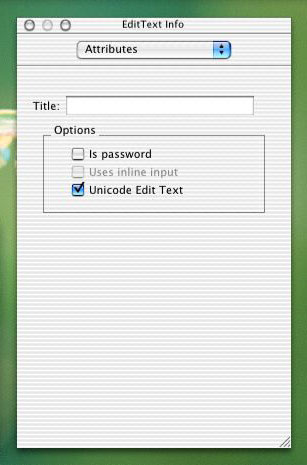

> 导航：[总目录](../../../README.md) · [documentation](../../../_indexes/documentation.md) · [Porting to Mac OS X from Windows Win32 API](Porting%20to%20Mac%20OS%20X%20from%20Windows%20Win32%20API.md)

[Next](The%20Mac%20OS%20X%20User%20Interface.md)[Previous](Networking%20in%20Mac%20OS%20X.md)

# Using Text in Mac OS X

Given the Macintosh's strong roots in desktop publishing, it should come as no surprise that Mac OS X provides powerful APIs for manipulating and displaying multilingual, styled, static, and editable text. Of course, since you are porting an existing Win32 application to Mac OS X, you may not be interested in Mac OS X's advanced text features. Still, it's nice to know what's available, and that's what this section is about.

Depending on your situation, you may not even need know about the Mac OS X text APIs. If your use of text is limited to providing simple text-entry fields and labeling user-interface elements, you can do that from Interface Builder. If your application uses text in more sophisticated ways, you need to read this section.

The most important thing you need to know about Mac OS X's use of text is that, like the Win32 platform, Mac OS X always stores its strings in Unicode. Since your application probably uses Unicode for encoding text, you should be comfortable with Mac OS X's use of Unicode.

Like Win32, Mac OS X provides several APIs for static and editable text. If your needs are simple, Mac OS X provides easy-to-use routines that get the job done. Other, more complex APIs give you additional capabilities and greater control. Somewhere along this spectrum, you should able to find routines that roughly correspond to the Win32 routines in your original code.

Although some Mac OS X routines take Unicode strings as arguments, most manipulate text stored as a `CFString` ("CF" is an abbreviation for Core Foundation, which is the part of Mac OS X that defines fundamental data structures and types used by Carbon and Cocoa). Here are some things to remember about `CFStrings`:

- A `CFString` is a "pure" string--that is, it does not include any text styles or formatting.
- A `CFString` "object" is an opaque data type that represents a string as an array of Unicode characters. Most text-manipulating APIs in Mac OS X use `CFStrings`.
- The String Services API (part of the Core Foundation software) includes the routines that manage converting between `CFStrings` and pure Unicode, comparing and searching `CFStrings`, manipulating `CFStrings`, and related functions.

Mac OS X provides built-in support for multilingual text, including

- multiple languages in the same document with no restrictions on language intermixing
- text highlighting that behaves correctly even in complex situations involving multiple languages of dissimilar type
- automatic support for Roman, Japanese, Semitic, Chinese, Indic, and other languages

If you simply need to draw static text (that is, text that cannot be edited), your best choice is `DrawThemeTextBox`, which is part of the Appearance Manager API. This routine can only draw unstyled text, but the text is drawn in a font that matches a selected theme. Look for documentation on this and related routines in the file `appearance.h`. If the text you need to draw is part of your user interface, use the StaticText control on the Carbon-Controls pane of the Interface Builder controls palette.

Multilingual Text Engine (MLTE) contains more capable text-drawing routines. Its basic routine is `TXNDrawCFStringTextBox`, which takes a `CFString` as input. Since you are probably using Unicode strings in your application, you may want to use `TXNDrawUnicodeTextBox`, which takes a plain Unicode string as input.

For the most powerful text-drawing routines, you need to use Apple Type Services for Unicode Imaging (ATSUI). The text-drawing routine is `ATSUDrawText`, although you must first use other ATSUI routines to set up the drawing operation.

Mac OS X includes three APIs that you can use to provide editable text in your applications. The simplest, EditUnicodeTextControl, is sufficient for most situations. The second, MLTE, provides all the functionality most developers will need. Very few developers will need to use the third, ATSUI. The following sections describe these APIs.

The EditUnicodeTextControl is the simplest control for editable Unicode text. (Remember, Mac OS X uses Unicode strings throughout the system, so you need to be sure that you capture any text the user enters as Unicode text.) The routine you use to create an EditUnicodeTextControl is called `CreateEditUnicodeTextControl`; you can find it in the file `ControlDefinitions.h`.

If the text box you need is part of your user interface, use the EditText control on the Carbon-Controls pane of the Interface Builder controls palette. In the Attributes pane on the Info window for the EditText control, be sure to check the option titled "Unicode Edit Text."

MLTE provides a straightforward interface for providing multilingual Unicode styled text editing to your application. Built on top of ATSUI, MLTE includes support for

- document-wide tabs, justification, and margins
- text handling of any length (constrained only by memory)
- displaying text in all the languages that Mac OS X supports
- text-editing and drag-and-drop behavior as defined by the Apple user interface guidelines
- inline input of Japanese, Chinese, and other languages
- inclusion of sounds, images, and video within a text field
- scroll-bar handling and printing
- advanced font features
- 32 levels of undo and redo

ATSUI is the type technology that underlies all text drawing in Mac OS X. Although other APIs built on top of ATSUI provide simpler text-drawing functions, ATSUI provides an extremely high level of typographic control.

ATSUI enables sophisticated rendering of Unicode 3.2-encoded text (including such features as kerning, ligatures, and optical alignment). It automatically handles many of the complexities inherent in text layout, including how to correctly render text in bidirectional and vertical script systems.

ATSUI introduces new objects that enable it to provide higher levels of control and flexibility. Some examples are

- _style objects_, which are sets of font-related characteristics (called _style run attributes_) that are to be applied to a run of text
- _text layout objects_, which associate style runs, a buffer of text, and various default values to provide a software object that you can manipulate with ATSUI routines

ATSUI includes routines that enable you to perform various font, text styling, and layout functions. Among them are

- drawing and highlighting text based on the scripts (fonts/language conventions) involved
- discovering what fonts are available and which one most closely fits a set of requirements
- obtaining information about a given font and individual glyphs within a font
- creating and manipulating style objects and text layout objects
- manipulating style run attributes and associating them with runs of text
- determining the correct insertion point based on where the text has been clicked
- obtaining the spatial boundaries of a laid-out line of text
- calculating soft line breaks in a range of text

Because ATSUI uses Mac OS X's Quartz 2D graphics engine for all of its drawing, ATSUI users can access Quartz's image scaling, rotation, and transformation features.

One technical note: By reallocating and reusing `ATSUStyle` records, you can speed up the drawing of ATSUI-based text. See "Improving ATSUI text drawing performance" for details.

Mac OS X includes a number of other APIs related to text, fonts, and strings. In addition to the ones already discussed, here are the ones that you are most likely to use:

- Apple Text Services for Fonts (also called ATS): Used to determine what fonts are available on the current computer.
- Text Encoding Conversion Manager: Used to convert text between non-Unicode encodings and Unicode.
- Unicode Utilities: Used to determine text boundaries within a Unicode string, convert keystrokes to Unicode text, and determine the alphabetical order of two Unicode strings (taking into account the alphabetizing rules of the geographic locale under which the user is operating).

|  |  |
| --- | --- |
| Appearance Manager | _Appearance Manager Reference_ |
| Apple Text Services for Fonts (ATS) | _Apple Type Services for Fonts Reference_ |
| Apple Text Services for Unicode Imaging (ATSUI) | _ATSUI Reference_ |
| "Improving ATSUI text drawing performance" Technical Note | [http://developer.apple.com/qa/qa2001/qa1027.html](https://developer.apple.com/qa/qa2001/qa1027.html) |
| Multilingual Text Engine (MLTE) | _Multilingual Text Engine Reference_ |
| String Services (CFStrings) | _[String Programming Guide for Core Foundation](../../Core%20Foundation/String%20Programming%20Guide%20for%20Core%20Foundation/Introduction%20to%20Strings%20Programming%20Guide%20for%20Core%20Foundation.md#apple-f4xwc4dqnrsv64tfmyxwi33df52wszbpgeydambqgeztc2i)_ |
| Text Encoding Conversion Manager | _[Text Encoding Conversion Manager Reference](https://developer.apple.com/documentation/coreservices/carbon_core/text_encoding_conversion_manager)_ |
| appearance.h (DrawnThemeTextBox) | located on the main hard disk of a computer running Mac OS X, at `/System/Library/Frameworks/Carbon.framework/Frameworks/ HIToolbox.framework/Headers/appearance.h` |
| ControlDefinitions.h | located on the main hard disk of a computer running Mac OS X, at `/System/Library/Frameworks/Carbon.framework/Frameworks/ HIToolbox.framework/Headers/ControlDefinitions.h` |
| Unicode Utilities | _[Unicode Utilities Reference](https://developer.apple.com/documentation/coreservices/carbon_core/unicode_utilities)_ |

[Next](The%20Mac%20OS%20X%20User%20Interface.md)[Previous](Networking%20in%20Mac%20OS%20X.md)

