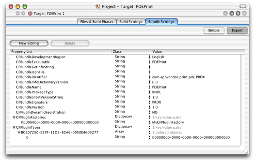
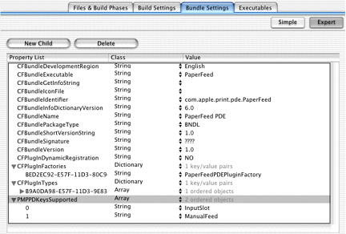

> 导航：[总目录](../../../README.md) · [documentation](../../../_indexes/documentation.md) · [Extending Printing Dialogs](Introduction%20to%20Extending%20Printing%20Dialogs.md)


[Next](Core%20Tasks.md)[Previous](Printing%20Dialog%20Extension%20Concepts.md)

# Creating a Plug-in Project

This chapter shows you how to configure a Project Builder project to build a printing dialog extension. Project Builder is Apple’s integrated development environment (IDE) for Mac OS X.

To use Project Builder, you should install the latest release of Mac OS X developer tools. All of the software development applications and utilities discussed in this book are available on the Mac OS X Developer Tools CD. You can also download them from the Apple Developer Connection website, [http://developer.apple.com/tools/](https://developer.apple.com/tools/).

If you prefer to use another IDE, you need to make sure that your printing dialog extension has the following characteristics:

- Core Foundation plug-in architecture

  The executable and its associated resources must be bundled as a Core Foundation plug-in, which means it needs to have the correct bundle structure and property list entries.
- C calling conventions

  The compiler must generate executable code that uses the standard C calling conventions. This applies to any function that might be called—by name or through a pointer—from outside the executable.
- Mach-O binary format

  The executable code must be packaged using the Mach object file (Mach-O) format.

You can create a Project Builder plug-in project in one of two ways—using the sample project that accompanies this book or using a project template.

Apple Technical Publications has created a sample project for developers who want to write a printing dialog extension. All of the source code examples in this book are adapted from this project.

The project defines two targets:

1. _PDEPrint_ builds `PDEPrint.plugin`, a printing dialog extension that adds a custom pane to the Print dialog.
2. _AppUsingSheets_ builds an application that you can use to test PDEPrint.

The core data types and functions that can be used in all printing dialog extensions are factored into a set of source files named `PDECore.*` and `PDEUtilities.*` . You should be able to use this source code in a real-world project with little or no modification.

The remaining data types, functions, and resources are in a set of files named `PDECustom.*` and `PDEPrint.*`. These files can serve as the basis for the custom components of a real-world project, but you will need to adapt and extend them to fit your specific requirements.

To view or download the current version of the sample project, see _[PDEProject](../../../samplecode/PDEProject/PDEProject.md#apple-f4xwc4dqnrsv64tfmyxwi33df52wszbpirkfgmjqgaydanzugu)_ in the ADC Reference Library.

Project Builder ships with a number of project templates, including a plug-in template that’s suitable for starting a new project from scratch.

To use this template:

1. Choose New Project from the Project Builder File menu.
2. Select the template CFPlugIn Bundle.
3. Specify the project name and desired location for the new project folder.

For your printing dialog extension to operate correctly, several important associations must be defined as key-value pairs in its information property list. In this section you will learn how to define these associations using Project Builder.

An information property list is a dictionary of key-value pairs. The keys must be strings, and the values must be valid property list types. For example, the required key-value pairs in the property list for a printing plug-in have values of type CFString, CFArray, and CFDictionary.

Project Builder generates the information property list for a target, using the information you supply in the target’s bundle settings pane.

Figure 4-1 shows the property list entries for a printing dialog extension.

__Figure 4-1__  Bundle properties for a printing dialog extension



Listing 4-1 shows an XML representation of the same information, extracted from the `Info.plist` file generated by Project Builder.

__Listing 4-1__  XML representation of the bundle settings for a printing dialog extension

```xml
<plist version="0.9">
    <dict>
        <key>CFBundleDevelopmentRegion</key>
        <string>English</string>
        <key>CFBundleExecutable</key>
        <string>PDEPrint</string>
        <key>CFBundleGetInfoString</key>
        <string>1.0</string>
        <key>CFBundleIdentifier</key>
        <string>com.appvendor.print.pde.PRDX</string>
        <key>CFBundleInfoDictionaryVersion</key>
        <string>6.0</string>
        <key>CFBundleName</key>
        <string>PDEPrint</string>
        <key>CFBundlePackageType</key>
        <string>BNDL</string>
        <key>CFBundleShortVersionString</key>
        <string>1.0</string>
        <key>CFBundleSignature</key>
        <string>PRDX</string>
        <key>CFBundleVersion</key>
        <string>1.0</string>
        <key>CFPlugInDynamicRegistration</key>
        <string>NO</string>
        <key>CFPlugInFactories</key>
        <dict>
            <key>00000000-0000-0000-0000-000000000000</key>
            <string>MyCFPluginFactory</string>
        </dict>
        <key>CFPlugInTypes</key>
        <dict>
            <key>BCB07250-E57F-11D3-8CA6-0050E4603277</key>
            <array>
                <string>00000000-0000-0000-0000-000000000000</string>
            </array>
        </dict>
    </dict>
</plist>
```

To edit the bundle settings using Project Builder, open your project file and navigate to the bundle settings editor:

1. Click the Targets tab (or press Command-4).
2. Select the name of the desired target in the Targets list.
3. Click the Bundle Settings tab.
4. Click the Expert button.

Now you’re ready to edit existing properties (or add new ones). To edit an existing property, double-click the key or value you want to change.

All of the properties you need to change are discussed in the following sections.

`CFBundleIdentifier` is the unique identifier string for the bundle. The bundle identifier can be used to locate the bundle at runtime using the function `CFBundleGetBundleWithIdentifier`.

Listing 4-2 shows an example of a bundle identifier.

__Listing 4-2__  A bundle identifier

```
        <key>CFBundleIdentifier</key>
        <string>com.appvendor.print.pde.PRDX</string>
```

Using the bundle settings editor, replace `com.appvendor.print.pde.PRDX` with a unique bundle identifier in the form of a Java-style package name—for example, `com.mycompany.pde.foo`.

`CFPlugInFactories` is a list of one or more factory functions that can construct an instance of a specific interface type. The factory list is implemented as a dictionary. Each key-value pair consists of a unique factory ID and the name of a factory function.

Most printing dialog extensions have only one factory function, and therefore have only a single entry in their factory list. This case is illustrated in Listing 4-3.

__Listing 4-3__  A factory list with a single factory

```
        <key>CFPlugInFactories</key>
        <dict>
            <key>00000000-0000-0000-0000-000000000000</key>
            <string>MyCFPluginFactory</string>
        </dict>
```

You need to supply both the identifier and the function name. The identifier must be a textual representation of a universally unique identifier (UUID) that you generate.

Using the bundle settings editor, replace `00000000-0000-0000-0000-000000000000` with your actual identifier, and replace `MyCFPluginFactory` with your actual factory function.

To learn more about UUIDs, see _Inside Carbon: Core Foundation Utility Services Concepts_.

`CFPlugInTypes` is a list of the interface types that the plug-in implements (not including `IUnknownVTbl`). The list is implemented as a dictionary. Each key-value pair consists of an interface ID paired with an array of one or more factory IDs.

Printing dialog extensions come in three flavors, as shown in Table 4-1.

__Table 4-1__  Printing dialog extension plug-in interface types

| Interface type | UUID |
| Application pane for the Page Setup dialog | `B9A0DA98-E57F-11D3-9E83-0050E4603277` |
| Application pane for the Print dialog | `BCB07250-E57F-11D3-8CA6-0050E4603277` |
| Printer module pane for the Print dialog | `BDB091F4-E57F-11D3-B5CC-0050E4603277` |

Most printing dialog extensions implement only a single type of interface with a single factory. This case is illustrated in Listing 4-4.

__Listing 4-4__  An interface types list with a single type and factory

```
        <key>CFPlugInTypes</key>
        <dict>
            <key>BCB07250-E57F-11D3-8CA6-0050E4603277</key>
            <array>
                <string>00000000-0000-0000-0000-000000000000</string>
            </array>
        </dict>
```

You need to supply both identifiers. The first identifier should be the UUID in Table 4-1 that corresponds to the specific interface your printing dialog extension implements. The second identifier should be the UUID you created for the associated factory in [Defining the Plug-in Factories](#apple-f4xwc4dqnrsv64tfmyxwi33df52wszbpkridgmbqgaydsnzzfvbuqmrqguwueqkkizduessk).

PostScript printer description (PPD) files are created by printer vendors to specify the set of features available in their PostScript printers. When a print queue is created for a PostScript printer, the printing system parses the contents of the appropriate PPD file looking for the data structures—identified by PPD main keywords—that specify the features and default settings the printer provides. The printing system uses this information to build a Printer Features pane for the printer.

A printer vendor can write a printing dialog extension that handles the settings for one or more PostScript printer features. You register PPD main keywords by adding them to the information property list of your printing dialog extension. If you register the PPD main keyword for a PostScript feature, the printing system omits the feature from the Printer Features pane.

You should make sure that keywords are unique with respect to the printer. Conflicts between printing dialog extensions that support the same keyword are not detected by the printing system. You should also make sure your extension loads only for the specific printer for which it is intended.

Figure 4-2 shows the bundle settings for a printing dialog extension that supports two paper feed options—input slot and manual feed.

__Figure 4-2__  Bundle settings for a printing dialog extension that supports paper-feed features



To register the PPD main keywords, you add a new key-value pair to the information property list. The key is `PMPPDKeysSupported`, and the value is an array that contains the keywords (in any order).

Here’s how it’s done:

1. Select the last entry (`CFPlugInTypes`), and click New Sibling.
2. Type `PMPPDKeysSupported`, making sure the case is correct.
3. Choose Array from the Class pop-up menu.
4. Click the disclosure triangle next to `PMPPDKeysSupported`. Then click the New Child button (when you click the disclosure triangle, the New Sibling button changes to New Child.)
5. Double-click the text box in the Value column, type the PPD main keyword, then make sure its class is set to String. For example, if the PPD main keyword is `*InputSlot`, type `InputSlot`.
6. For each additional PostScript feature you handle, add another child to the `PMPPDKeysSupported` property, then repeat the previous step.

At runtime your printing dialog extension code must add the setting for each PostScript feature you handle to the print settings ticket, using the mechanism described in [Handling PostScript Features](Custom%20Tasks.md#apple-f4xwc4dqnrsv64tfmyxwi33df52wszbpkridgmbqgaydsnzzfvbuqmrqg4wugqkdijeeiqse).

If you are not familiar with Project Builder, the O’Reilly publication _Learning Carbon_ provides a good introduction to its basic features.

For detailed information about using PostScript printer description files in Mac OS X, see _[Using PostScript Printer Description Files](../Using%20PostScript%20Printer%20Description%20Files/Introduction%20to%20Using%20PostScript%20Printer%20Description%20Files.md#apple-f4xwc4dqnrsv64tfmyxwi33df52wszbpkridimbqgaydsnrq)_.

[Next](Core%20Tasks.md)[Previous](Printing%20Dialog%20Extension%20Concepts.md)

