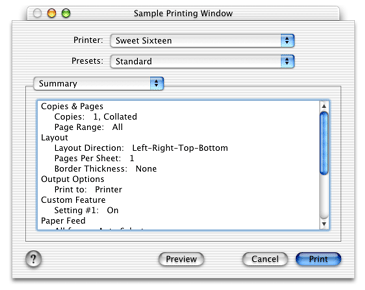

> 导航：[总目录](../../../README.md) · [documentation](../../../_indexes/documentation.md) · [Extending Printing Dialogs](Introduction%20to%20Extending%20Printing%20Dialogs.md)


[Next](Integration%20Tasks.md)[Previous](Core%20Tasks.md)

# Custom Tasks

This chapter shows you how to implement a set of custom data types and functions that add unique behavior to your printing dialog extension. You can use the source code in this chapter in a real-world project, but you will need to adapt and extend the code to fit your specific requirements.

All the code examples in this chapter are adapted from a complete sample project for writing a printing dialog extension. To view or download the current version of the sample project, see _[PDEProject](../../../samplecode/PDEProject/PDEProject.md#apple-f4xwc4dqnrsv64tfmyxwi33df52wszbpirkfgmjqgaydanzugu)_ in the ADC Reference Library.

A graphical editor like Apple’s Interface Builder is an important tool for designing and constructing a user interface. As a visual designer, you can use an editor to create a prototype of the interface. As a developer, you can use the same editor to fill in the details and construct an archive that can be instantiated at runtime. Tools of this type are especially important when you need to manage many localized versions of a single interface.

This section shows how to use Interface Builder to design a custom pane for your printing dialog extension. Interface Builder saves your design as an XML archive using the `.nib` filename extension. The archive is a static representation of the interface that can be efficiently loaded into memory when needed.

Designing an interface with Interface Builder is straightforward and intuitive. You drag Carbon controls from a palette into a Carbon window, position and group the controls as needed, and use an Info window to adjust their attributes. You save the Carbon window as an archive, and install the archive in an appropriate location inside the plug-in bundle.

The following procedure shows how to design the interface for a printing dialog extension using Interface Builder.

1. Decide on a 4-byte signature (or creator code) that identifies your interface.
2. Open Interface Builder and create a new Carbon window.
3. Open the Info window (Tools > Show Info or Commmand-Shift-I).
4. Set the width and height of the Carbon window in pixels. These values might change as you refine your design.
5. For each control in your interface:

   1. Drag a control from the Controls palette into position inside your Carbon window.
   2. Set the control signature to your 4-byte interface signature.
   3. Set the control ID to a unique positive integer.
   4. Enter the title string.
   5. Enter text for a help tag, and specify where the help tag should appear.
6. Save your layout in a project subdirectory for localized resources—for example, `Resources/English.lproj/`.

This brief procedure shows how to localize your interface for additional languages or dialects.

For each new locale:

1. Duplicate your original localized resources folder, and rename the new folder appropriately. The name of the nib file inside the new folder should remain the same.
2. Open the new nib file using Interface Builder, and for each control in the interface:

   1. Enter the localized title string.
   2. Resize the control as needed to accomodate the new title.
   3. Enter the localized help tag.

At runtime, you construct the interface as follows:

1. Call `CreateWindowFromNib` to instantiate a localized version of the interface in a Carbon window.
2. Find the individual controls in the window, and embed them inside the dialog pane, adjusting their coordinates as needed.

These tasks are described in detail in [Open](Core%20Tasks.md#apple-f4xwc4dqnrsv64tfmyxwi33df52wszbpkridgmbqgaydsnzzfvbuqmrqgywueqsdinduoqsi) and [Embedding Your Controls in a Dialog Pane](#apple-f4xwc4dqnrsv64tfmyxwi33df52wszbpkridgmbqgaydsnzzfvbuqmrqg4wugqkdincusrkd).

Interface Builder is available on the latest Mac OS X Developer Tools CD, or from the Apple Development Tools site at [http://developer.apple.com/tools/](https://developer.apple.com/tools/).

For general information about localizing human interfaces, see _[Getting Started with Internationalization](https://developer.apple.com/library/archive/referencelibrary/GettingStarted/GS_Internationalization/_index.html#//apple_ref/doc/uid/TP30001113)_.

You need to define several unique identifiers used to locate external resources such as nib files and tickets, and integer constants that are passed to the printing system to specify the dimensions of your pane.

Listing 6-1 shows how to define several identifiers associated with your bundle property list and your nib file.

__Listing 6-1__  Custom identifiers

```
#define  kMyBundleSignature     "PRDX"// 1
#define  kMyBundleCreatorCode   'PRDX'// 2
#define  kMyBundleIdentifier \
            CFSTR("com.appvendor.pde." kMyBundleSignature)// 3

#define  kMyPaneKindID  kMyBundleIdentifier// 4
#define  kMyNibFile     CFSTR("PDEPrint")// 5
#define  kMyNibWindow   CFSTR("PDEPrint")// 6
```

Here’s what the definitions in Listing 6-1 represent:

1. A string representation of the unique 4-byte signature of an application-hosted printing dialog extension. This signature is used as a suffix when defining keys for extended data in a print settings or page format ticket, as described in [Defining Custom Ticket Keys](#apple-f4xwc4dqnrsv64tfmyxwi33df52wszbpkridgmbqgaydsnzzfvbuqmrqg4wviucykjcummjxga).
2. An OSType representation of the same 4-byte signature. An application uses this code to retrieve its extended data, as described in [Data Retrieval](Integration%20Tasks.md#apple-f4xwc4dqnrsv64tfmyxwi33df52wszbpkridgmbqgaydsnzzfvbuqmrqhawviucykjcummjxgm). Printer module–hosted printing dialog extensions do not need to define this constant.
3. A Core Foundation string used by your printing dialog extension to specify its bundle when calling the function `CFBundleGetBundleWithIdentifier`. This string must be the same unique identifier used in the `CFBundleIdentifier` property.
4. A Core Foundation string that represents your custom pane. This string should be a unique identifier in the form of a Java-style package name. In [Prologue](Core%20Tasks.md#apple-f4xwc4dqnrsv64tfmyxwi33df52wszbpkridgmbqgaydsnzzfvbuqmrqgywviucykjcummjsha), this string is passed back to the printing system.
5. A Core Foundation string that represents the name of your nib file (without the `.nib` extension.) In [Open](Core%20Tasks.md#apple-f4xwc4dqnrsv64tfmyxwi33df52wszbpkridgmbqgaydsnzzfvbuqmrqgywueqsdinduoqsi), this string is passed to the function `CreateNibReferenceWithCFBundle`.
6. A Core Foundation string that represents the name of your nib-based Carbon window. In [Open](Core%20Tasks.md#apple-f4xwc4dqnrsv64tfmyxwi33df52wszbpkridgmbqgaydsnzzfvbuqmrqgywueqsdinduoqsi), this string is passed to the function `CreateWindowFromNib`.

A ticket key is a unique string identifier that’s used to access a data item in a print job ticket.

An application using a printing dialog extension must observe some restrictions when defining ticket keys for either the print settings or page format ticket.

A key must

- start with the appropriate prelude string defined below in Table 6-1
- end with a custom 4-byte code that represents the data item

__Table 6-1__  Prelude strings for ticket keys defined by applications

| Printing dialog | Associated ticket | Prelude string for ticket key |
| Page Setup | Page format | `com.apple.print.PageFormatTicket`. |
| Print | Print settings | `com.apple.print.PrintSettingsTicket`. |

Listing 6-2 shows how you can define custom keys for the print settings or page format tickets, assuming that you are storing a single data item in each ticket.

__Listing 6-2__  Examples of two custom ticket keys

```
#define kMyAppPageFormatKey \
        CFSTR("com.apple.print.PageFormatTicket." kMyBundleSignature)

#define kMyAppPrintSettingsKey \
        CFSTR("com.apple.print.PrintSettingsTicket." kMyBundleSignature)
```


If your printer module uses a printing dialog extension to implement one of the standard sets of printing features listed in [Table 1-1](Printing%20Features%20and%20Printing%20Dialog%20Panes.md#apple-f4xwc4dqnrsv64tfmyxwi33df52wszbpkridgmbqgaydsnzzfvbuqmrqgiwueqsdijeeerce), you should use the Apple-defined ticket keys for those features.

If you are implementing a custom printing feature, you need to define a custom ticket key for the feature. By convention, a custom key should be an identifier in the form of a Java-style package name. For example, if you are writing a printer module for a printer that has a custom toner-saving option, you might define the ticket key as follows:

```
#define kMySaveTonerKey CFSTR("com.mycompany.pm.savetoner")
```


The printing system needs to know the vertical and horizontal extent (in pixel units) of your custom pane. A printing dialog extension passes these values back to the printing system when its prologue function is called.

The values you provide can be arbitrarily large. The printing system takes the values into account—along with a number of other constraints—when it determines the actual size of your pane.

Listing 6-3 illustrates how to define the two constant values passed to the printing system in [Prologue](Core%20Tasks.md#apple-f4xwc4dqnrsv64tfmyxwi33df52wszbpkridgmbqgaydsnzzfvbuqmrqgywviucykjcummjsha).

__Listing 6-3__  Vertical and horizontal extent of your custom pane in pixels

```
enum {
    kMyMaxV = 80,
    kMyMaxH = 478
};
```

In Mac OS X version 10.2 and later, you can adjust the dimensions of your pane when the initialize function is called. If you do so, and the user displays your pane, the dialog will reflect the adjusted height. For example, you might decide to increase the height of your pane and display additional controls whenever the destination printer is a PostScript printer. For information about using this feature, see [Initialize](Core%20Tasks.md#apple-f4xwc4dqnrsv64tfmyxwi33df52wszbpkridgmbqgaydsnzzfvbuqmrqgywviucykjcummjshe).

The use of contexts in a printing dialog extension is discussed in [Defining a Context](Core%20Tasks.md#apple-f4xwc4dqnrsv64tfmyxwi33df52wszbpkridgmbqgaydsnzzfvbuqmrqgywugskijbcucr2d) and in [Prologue](Core%20Tasks.md#apple-f4xwc4dqnrsv64tfmyxwi33df52wszbpkridgmbqgaydsnzzfvbuqmrqgywviucykjcummjsha). The sample project factors its context data into two parts:

- A generic context contains state information used in the generic code that’s supplied for you in finished form.
- A custom context contains state information used in the custom code that you need to adapt for your custom pane.

Listing 6-4 shows how you could define your custom context for a pane that contains one or more controls—for example, a checkbox. The data type `MyCustomContextBlock` represents the state of this checkbox in a single instance of your pane.

__Listing 6-4__  Data types for a custom context

```
typedef struct {
    ControlRef checkbox;
} MyControls;

typedef struct {
    Boolean selected;
} MySettings;

typedef struct {
    MyControls controls;
    MySettings settings;
} MyCustomContextBlock;

typedef MyCustomContextBlock *MyCustomContext;
```


The following sections describe the custom functions in the sample project. If you’re using the sample project as the basis for a real-world project, then you need to implement all the functions presented here. These functions are called from the code described in [Implementing the Required Callbacks](Core%20Tasks.md#apple-f4xwc4dqnrsv64tfmyxwi33df52wszbpkridgmbqgaydsnzzfvbuqmrqgywviucykjcummjsg4).

You don’t have to use a custom context. If you do, you need to allocate memory for a new custom context each time a new dialog is created.

Listing 6-5 shows how your printing dialog extension can create and release an instance of its custom context. The generic code described in [Prologue](Core%20Tasks.md#apple-f4xwc4dqnrsv64tfmyxwi33df52wszbpkridgmbqgaydsnzzfvbuqmrqgywviucykjcummjsha) and [Terminate](Core%20Tasks.md#apple-f4xwc4dqnrsv64tfmyxwi33df52wszbpkridgmbqgaydsnzzfvbuqmrqgywviucykjcummjtgq) can’t perform these tasks, because the implementation details of your custom context are private.

__Listing 6-5__  Managing an instance of your custom context

```
extern MyCustomContext MyCreateCustomContext()
{
    MyCustomContext context = calloc (1, sizeof (MyCustomContextBlock));// 1
    return context;
}

extern void MyReleaseCustomContext (MyCustomContext context)
{
    free (context);// 2
}
```

Here’s what the code in Listing 6-5 does:

1. Allocates zeroed storage for a new custom context. The initialization of your context data is handled in other custom functions.
2. Frees the storage for the custom context.

Listing 6-6 implements a custom function that provides the title of your custom pane. The printing system displays this title in two places in the dialog—the pane pop-up menu and the Summary pane.

This implementation gets a localized copy of the title string using the Core Foundation Bundle Services macro `CFCopyLocalizedStringFromTableInBundle`. The string is retained for re-use, and can be released by passing in `FALSE`.

__Listing 6-6__  Providing your custom pane title

```
extern CFStringRef MyGetCustomTitle (Boolean stillNeeded)
{
    static CFStringRef sTitle = NULL;

    if (stillNeeded)// 1
    {
        if (sTitle == NULL)// 2
        {
            sTitle = CFCopyLocalizedStringFromTableInBundle (
                CFSTR("Custom Feature"),// 3
                CFSTR("Localizable"),// 4
                MyGetBundle(),// 5
                CFSTR("the custom pane title"));// 6
        }
    }
    else
    {
        if (sTitle != NULL)
        {
            CFRelease (sTitle);// 7
            sTitle = NULL;
        }
    }

    return sTitle;
}
```

Here’s what the code in Listing 6-6 does:

1. Checks `stillNeeded` to see if the caller wants to get or release the string.
2. Checks to see if a copy of the title string already exists.
3. Supplies the lookup key for the title string.
4. Supplies the name of the localized strings file (without the `.strings` extension) to be searched.
5. Supplies a reference to your plug-in bundle.
6. Supplies a comment to assist translators.
7. Releases the string because the caller passed in `FALSE`.

Listing 6-7 implements a custom function that embeds your nib-based controls—in this case, a checkbox—inside the dialog pane provided by the printing system.

The utility function `MyEmbedControl`described in [Embedding a Nib-Based Control](Utility%20Functions.md#apple-f4xwc4dqnrsv64tfmyxwi33df52wszbpkridgmbqgaydsnzzfvbuqmrqhewugssbireuissd) is used to position and embed each control.

__Listing 6-7__  Embedding nib-based controls in a dialog pane

```swift
extern OSStatus MyEmbedCustomControls (
    MyCustomContext context,
    WindowRef nibWindow,
    ControlRef userPane
)

{
    static const ControlID controlID = { kMyBundleCreatorCode, 4001 };// 1
    OSStatus result = noErr;

    if (context != NULL)
    {
        result = MyEmbedControl (// 2
            nibWindow,
            userPane,
            controlID,
            &(context->controls.checkbox)
        );

        if (context->controls.checkbox != NULL) {
            SetControlValue (// 3
                context->controls.checkbox,
                context->settings.checkbox
            );
        }
    }

    return result;
}
```

Here’s what the code in Listing 6-7 does:

1. Defines the signature and ID for the control. These values should match the signature and ID assigned to this control in the nib file.
2. Embeds the control inside your dialog pane. `MyEmbedControl` passes back a reference to the control, which is saved in the custom context. For an implementation of `MyEmbedControl`, see [Embedding a Nib-Based Control](Utility%20Functions.md#apple-f4xwc4dqnrsv64tfmyxwi33df52wszbpkridgmbqgaydsnzzfvbuqmrqhewugssbireuissd).
3. Initializes the value of the control.

The purpose of sychronization is explained in [Sync](Core%20Tasks.md#apple-f4xwc4dqnrsv64tfmyxwi33df52wszbpkridgmbqgaydsnzzfvbuqmrqgywviucykjcummjtga). In the sample project, the actual work of synchronization is done in two custom functions described in [Updating Your Pane](#apple-f4xwc4dqnrsv64tfmyxwi33df52wszbpkridgmbqgaydsnzzfvbuqmrqg4wviucykjcummjwgq) and [Updating a Ticket](#apple-f4xwc4dqnrsv64tfmyxwi33df52wszbpkridgmbqgaydsnzzfvbuqmrqg4wviucykjcummjwgu).

Your custom sync functions need to agree on the data types used to represent your pane settings, both in memory and in the ticket. The sample project uses the data structure `MySettings` in memory, and `CFData` in the ticket.

Listing 6-8 implements a custom function that reads your data from the print settings ticket, and uses it to update the controls in your pane.

__Listing 6-8__  A custom function to update your pane

```swift
extern OSStatus MySyncPaneFromTicket (
    MyCustomContext context,
    PMPrintSession session
)

{
    CFDataRef data = NULL;
    CFIndex length = 0;
    OSStatus result = noErr;
    PMTicketRef ticket = NULL;

    result = MyGetTicket (session, kPDE_PMPrintSettingsRef, &ticket);// 1

    if (result == noErr)
    {
        result = PMTicketGetCFData (// 2
            ticket,
            kPMTopLevel,
            kPMTopLevel,
            kMyAppPrintSettingsKey,
            &data
        );

        if (result == noErr)
        {
            length = CFDataGetLength (data);

            if (length == sizeof(MySettings))// 3
            {
                CFDataGetBytes (// 4
                    data,
                    CFRangeMake(0,length),
                    (UInt8*) &(context->settings)
                );
            }
            else
            {
                result = kPMKeyNotFound;
            }
        }

        if (result == kPMKeyNotFound)
        {
            context->settings.checkbox = FALSE;// 5
            result = noErr;
        }
    }

    if ((result == noErr) && (context->controls.checkbox != NULL))// 6
    {
        SetControlValue (
            context->controls.checkbox,
            context->settings.checkbox
        );
    }

    return result;
}
```

Here’s what the code in Listing 6-8 does:

1. Gets a reference to the print settings ticket using the utility function described in [Getting a Ticket Reference](Utility%20Functions.md#apple-f4xwc4dqnrsv64tfmyxwi33df52wszbpkridgmbqgaydsnzzfvbuqmrqhewugssbijcegq2g).
2. Checks the ticket for your custom data item. If the item exists, a reference to the data is passed back. Otherwise the result code `kPMKeyNotFound` is returned. For more information about retrieving data from tickets, see [Accessing Ticket Data](Integration%20Tasks.md#apple-f4xwc4dqnrsv64tfmyxwi33df52wszbpkridgmbqgaydsnzzfvbuqmrqhawviucykjcummjxgq).
3. Checks to make sure the ticket data has the expected length.
4. Copies the bytes into your custom context.
5. Initializes the setting to its default value. This code executes when the ticket has no data item for this setting, or the data item found is not the correct size.
6. Uses your context to update the control. The Control Manager takes care of redrawing the control.

Listing 6-9 implements a custom function that reads the current values of the controls in your pane, and updates your data in the print settings ticket.

__Listing 6-9__  A custom function that updates the print settings ticket

```swift
extern OSStatus MySyncTicketFromPane
(
    MyCustomContext context,
    PMPrintSession session
)

{
    CFDataRef data = NULL;
    OSStatus result = noErr;
    PMTicketRef ticket = NULL;

    result = MyGetTicket (session, kPDE_PMPrintSettingsRef, &ticket);// 1
    if (result == noErr)
    {
        if (context->controls.checkbox != NULL) {
            context->settings.checkbox =
                GetControlValue (context->controls.checkbox);// 2
        }

        data = CFDataCreate (// 3
            kCFAllocatorDefault,
            (UInt8*) &context->settings,
            sizeof(MySettings)
        );

        if (data != NULL)
        {
            result = PMTicketSetCFData (// 4
                ticket,
                kMyBundleIdentifier,
                kMyAppPrintSettingsKey,
                data,
                kPMUnlocked
            );

            CFRelease (data);
        }
    }

    return result;
}
```

Here’s what the code in Listing 6-9 does:

1. Gets a reference to the print settings ticket, using the utility function described in [Getting a Ticket Reference](Utility%20Functions.md#apple-f4xwc4dqnrsv64tfmyxwi33df52wszbpkridgmbqgaydsnzzfvbuqmrqhewugssbijcegq2g).
2. Reads the current value of the control.

   You might choose to validate the control settings at this point. If you find an error, you should provide feedback and return the result code `kPMDontSwitchPDEError` to prevent the user from switching to another pane.
3. Creates a `CFData` representation of your settings data.
4. Adds a new ticket entry—or updates an existing ticket entry—with the current settings data. For more detailed information about storing data in tickets, see [Accessing Ticket Data](Integration%20Tasks.md#apple-f4xwc4dqnrsv64tfmyxwi33df52wszbpkridgmbqgaydsnzzfvbuqmrqhawviucykjcummjxgq).

When a user selects the Summary pane in a printing dialog, each active printing dialog extension is polled for its summary text.

In Figure 6-1, the Summary pane tells the user that the checkbox in the Custom Feature pane is now selected.

__Figure 6-1__  The Summary pane in the Print dialog



Listing 6-10 implements a custom function that supplies the summary text for the Custom Feature setting in Figure 6-1. This function copies localized descriptions of the title and current value of the setting into two summary arrays.

__Listing 6-10__  Custom function to supply summary text for a setting

```swift
extern OSStatus MyGetSummaryText (
    MyContext context,
    CFMutableArrayRef titleArray,
    CFMutableArrayRef valueArray
)

{
    CFStringRef title = NULL;
    CFStringRef value = NULL;

    OSStatus result = kPMInvalidPDEContext;// 1

    title = CFCopyLocalizedStringFromTableInBundle (// 2
        CFSTR("Setting #1"),
        CFSTR("Localizable"),
        MyGetBundle(),
        CFSTR("the title of our first setting"));

    if (title != NULL)
    {
        SInt16 controlValue = GetControlValue (context->controls.item1);// 3
        if (controlValue == 0)
        {
            value = CFCopyLocalizedStringFromTableInBundle (
                CFSTR("Off"),
                CFSTR("Localizable"),
                MyGetBundle(),
                CFSTR("the value of setting #1 when not selected"));
        }
        else
        {
            value = CFCopyLocalizedStringFromTableInBundle (
                CFSTR("On"),
                CFSTR("Localizable"),
                MyGetBundle(),
                CFSTR("the value of setting #1 when selected"));
        }

        if (value != NULL)// 4
        {
            CFArrayAppendValue (titleArray, title);
            CFArrayAppendValue (valueArray, value);
            CFRelease (value);// 5
            result = noErr;// 6
        }

        CFRelease (title);
    }

    return result;
}
```

Here’s what the code in Listing 6-10 does:

1. Sets the default result code to a non-zero value.
2. Gets the appropriate localized string from the `Localizable.strings`  file in the plug-in bundle.
3. Gets the current integer value of the checkbox, assumed to be zero or one.
4. Appends each string to the end of the corresponding array. This transaction is done only if both strings are defined.
5. Releases the value string. Releasing the string is safe to do because `CFArrayAppendValue` retained it.
6. Sets the result code to `noErr`. This is done only after both arrays have been successfully updated.

A PostScript printer module can use a printing dialog extension to present features described in a PostScript printer description (PPD) file. At runtime, the printing dialog extension must tell the printing system what PostScript code needs to be emitted for these features.

The printing dialog extension does this by adding entries to a special dictionary called PPDDict. The Ticket Services function `PMTicketGetPPDDict` obtains PPDDict from the print settings ticket.

For each PPD feature it presents, the printing dialog extension adds a key-value pair to PPDDict. The key is the PPD Main keyword for that feature, and the value is the PPD Option keyword that corresponds to the feature’s setting. Adding this key-value pair to PPDDict causes the printing system to insert the PostScript code corresponding to that Main-Option keyword pair when it generates the PostScript code for the print job.

For example, consider a PostScript feature that allows the user to route printed pages to an upper or lower output bin. Listing 6-11 shows the PPD entry for this feature.

__Listing 6-11__  PPD entry for the output bin feature

```
*OpenUI *OutputBin/Output Bin: PickOne
*OrderDependency: 50 AnySetup *OutputBin
*DefaultOutputBin: Upper
*OutputBin Upper/Upper: "1 dict dup /OutputFaceUp false put setpagedevice"
*OutputBin Lower/Lower: "1 dict dup /OutputFaceUp true put setpagedevice"
*CloseUI: *OutputBin
```

If you use a printing dialog extension to present this feature and allow users to modify its setting, you need to do the following:

1. Add an output bin control to your custom pane.
2. Use the mechanism described in [Registering PPD Main Keywords](Creating%20a%20Plug-in%20Project.md#apple-f4xwc4dqnrsv64tfmyxwi33df52wszbpkridgmbqgaydsnzzfvbuqmrqguwugsscijceir2i) to ensure that output bin appears only in your pane, and not in the Printer Features pane.
3. In your custom `MySyncPaneFromTicket` function, get the current bin setting from the print settings ticket. In your custom `MySyncTicketFromPane` function, update the ticket with the current bin setting.

The following sections show how to implement the synchronization tasks described in step 3.

Listing 6-12 implements a function that gets PPDDict in a print settings ticket and uses PPDDict to get the current bin selection.

__Listing 6-12__  Getting a PostScript setting

```
typedef enum {LOWER, UPPER} MyBinType;

OSStatus MyGetOutputBin (CFTicketRef printSettings, MyBinType *bin)
{
    CFMutableDictionaryRef ppdDict = NULL;
    OSStatus result = noErr;

    result = PMTicketGetPPDDict (
        printSettings, kPMTopLevel, kPMTopLevel, &ppdDict);// 1

    if (result == noErr)
    {
        CFStringRef str = NULL;

        if (CFDictionaryGetValueIfPresent (
            ppdDict, CFSTR("OutputBin"), &str)
                && CFGetTypeID (str) == CFStringGetTypeID())// 2
        {
            if (CFStringCompare (
                str, CFSTR("Upper"), 0) == kCFCompareEqualTo)// 3
                { *bin = UPPER; }
            else
                { *bin = LOWER; }
        }
    }
    else
    {
        *bin = UPPER;// 4
    }

    return result;
}
```

Here’s what the code in Listing 6-12 does:

1. Gets a reference to PPDDict in the print settings ticket.
2. Finds the desired key-value pair and verifes that its value is a CFString.
3. Finds out which bin is selected, and passes back the appropriate value.
4. Initializes the setting to a hard-coded default value because there is no valid entry already in PPDDict. A more appropriate implementation would obtain the default setting for this feature from the current PPD file.

Listing 6-13 implements a function that gets PPDDict from a print settings ticket, and uses the current bin selection to update the output bin setting in PPDDict.

__Listing 6-13__  Updating a PostScript setting

```
OSStatus MySetOutputBin (CFTicketRef printSettings, MyBinType bin)
{
    CFMutableDictionaryRef ppdDict = NULL;
    OSStatus result = noErr;

    result = PMTicketGetPPDDict (
        printSettings, kPMTopLevel, kPMTopLevel, &ppdDict);// 1

    if (result == noErr)
    {
        switch (bin)// 2
        {
        case LOWER:
        CFDictionarySetValue (
            ppdDict, CFSTR("OutputBin"), CFSTR("Lower"));

        case UPPER:
        default:
        CFDictionarySetValue (
            ppdDict, CFSTR("OutputBin"), CFSTR("Upper"));
        }
    }

    return result;
}
```

Here’s what the code in Listing 6-13 does:

1. Gets a reference to PPDDict from the print settings ticket.
2. Updates the bin setting in PPDDict.

[Next](Integration%20Tasks.md)[Previous](Core%20Tasks.md)

