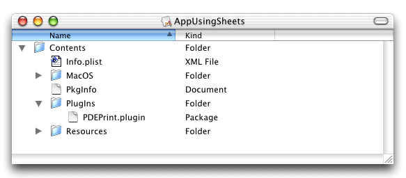

> 导航：[总目录](../../../README.md) · [documentation](../../../_indexes/documentation.md) · [Extending Printing Dialogs](Introduction%20to%20Extending%20Printing%20Dialogs.md)


[Next](Utility%20Functions.md)[Previous](Custom%20Tasks.md)

# Integration Tasks

Your printing dialog extension is taking shape, and now you’re wondering how to integrate it with your other software. This chapter shows you how applications and printer modules deploy and communicate with their printing dialog extensions.

The first two sections [Integrating With an Application](#apple-f4xwc4dqnrsv64tfmyxwi33df52wszbpkridgmbqgaydsnzzfvbuqmrqhawviucykjcummjwhe) and [Integrating With a Printer Module](#apple-f4xwc4dqnrsv64tfmyxwi33df52wszbpkridgmbqgaydsnzzfvbuqmrqhawviucykjcummjwha) describe tasks that include installation, localization, and registration.

The last section [Accessing Ticket Data](#apple-f4xwc4dqnrsv64tfmyxwi33df52wszbpkridgmbqgaydsnzzfvbuqmrqhawviucykjcummjxgq) desribes data communication tasks.

A printing dialog extension hosted by an application should be packaged inside the application bundle, and should be localized for the same languages and regions as the application. The host and plug-in share settings data using several different printing APIs.

You should install an application-hosted printing dialog extension somewhere inside the application bundle.

If you want to locate the plug-in at runtime using the function `CFBundleCopyBuiltInPlugInsURL`, you should install it inside a subfolder named PlugIns, as illustrated in Figure 7-1.

__Figure 7-1__  A plug-in installed inside an application bundle



In the sample project, the target AppUsingSheets has a build phase called Copy Files that installs the plug-in in this manner.

If you localize a printing dialog extension for a specific language or region, make sure the application has an `.lproj` directory for the same locale.

For example, the application bundle in [Figure 7-1](#apple-f4xwc4dqnrsv64tfmyxwi33df52wszbpkridgmbqgaydsnzzfvbuqmrqhawueq2jincuissi) contains directories named `English.lproj` for both the application and the printing dialog extension.

An application needs to register its printing dialog extension with Core Foundation Plug-in Services. Registration should be done once, prior to displaying the printing dialog for the first time.

Listing 7-1 implements a function that an application can use to register a printing dialog extension.

__Listing 7-1__  Locating and registering a printing dialog extension

```
OSStatus MyRegisterPDE (CFStringRef plugin)// 1
{
    OSStatus result = kPMInvalidPDEContext;

    CFURLRef pluginsURL = CFBundleCopyBuiltInPlugInsURL (// 2
        CFBundleGetMainBundle());

    if (pluginsURL != NULL)
    {
        CFURLRef myPluginURL = CFURLCreateCopyAppendingPathComponent (// 3
            NULL,
            pluginsURL,
            plugin,
            false);

        if (myPluginURL != NULL)
        {
            if (CFPlugInCreate (NULL, myPluginURL) != NULL) {// 4
                result = noErr;
            }

            CFRelease (myPluginURL);
        }

        CFRelease (pluginsURL);
    }

    return result;
}
```

Here’s what the code in Listing 7-1 does:

1. Receives a string that names a printing dialog extension bundle, such as `“PDEPrint.plugin”`.
2. Gets a Core Foundation URL that specifies the location of the folder that contains the bundle.
3. Appends the bundle name to this URL, and returns a new URL—a fully qualified path to the printing dialog extension.
4. Registers the plug-in with Core Foundation Plug-in Services. The function `CFPlugInCreate` takes two arguments—an optional allocation function, and a fully qualified path.

All printing dialog extensions store their private settings data in a job ticket, as described in [Synchronizing User Settings With a Ticket](Custom%20Tasks.md#apple-f4xwc4dqnrsv64tfmyxwi33df52wszbpkridgmbqgaydsnzzfvbuqmrqg4wviucykjcummjtga). Because applications do not have direct access to tickets, a host application must query a `PMPageFormat` or `PMPrintSettings` object to retrieve the data.

The section [Defining Custom Ticket Keys](Custom%20Tasks.md#apple-f4xwc4dqnrsv64tfmyxwi33df52wszbpkridgmbqgaydsnzzfvbuqmrqg4wviucykjcummjxga) explains how an application-hosted printing dialog extension needs to define the keys it uses to store its extended data in a ticket. To retrieve this data later, an application must supply the same 4-byte code found at the end of the ticket key. For example, if the ticket key ends with `PRDX` then the application must use the 4-byte code `PRDX`. The bytes must be ASCII characters in the range 0x20-0x7F.

Listing 7-2 illustrates how an application retrieves data from a `PMPrintSettings` object.

__Listing 7-2__  Retrieving extended data from a print settings ticket

```
OSStatus MyGetPDEData (
    PMPrintSettings printSettings,
    MySettings *mysettingsP
)

{
    UInt32 bufferSize = sizeof(*mysettingsP);// 1
    UInt32 extendedDataSize = 0;
    OSStatus result = noErr;

    result = PMGetPrintSettingsExtendedData (// 2
                printSettings,
                kMyBundleCreatorCode, // 3
                &extendedDataSize,
                kPMDontWantData);

    if (result == noErr)
    {
        if (bufferSize == extendedDataSize)// 4
        {
            result = PMGetPrintSettingsExtendedData (// 5
                printSettings,
                kMyBundleCreatorCode,
                kPMDontWantSize,
                mysettingsP);
        }
        else
        {
            result = kPMInvalidPDEContext;// 6
        }
    }

    return result;
}
```

Here’s what the code in Listing 7-2 does:

1. Declares an integer whose value is the expected number of bytes.
2. Checks for the existence of your extended data. On return, `bufferSize` contains the actual number of bytes of extended data in the ticket.
3. Provides the 4-byte code used to find the data.
4. Checks to see if the actual byte count is equal to the expected byte count. If so, the ticket contains your data.
5. Copies the data directly into the caller’s buffer.
6. Sets the result code to indicate an exception. Another course of action might be to return default settings.

For printing dialog extensions hosted by printer modules, the integration tasks are conceptually similar to those discussed in [Integrating With an Application](#apple-f4xwc4dqnrsv64tfmyxwi33df52wszbpkridgmbqgaydsnzzfvbuqmrqhawviucykjcummjwhe). However, there are some important differences in the way these tasks are performed.

The Mac OS X printing system expects all printer modules, and their printing dialog extensions, to reside in `/Library/Printers/` or in one of its subfolders. For housekeeping purposes, printer vendors generally place all their vendor-specific files in a subfolder.

If a printing dialog extension is used by a single printer module, it’s a good idea to install it in a PlugIns folder inside the printer module bundle.

Custom printing dialog extensions that implement PostScript features should reside in `/Library/Printers/PPD Plugins`/. For more information about using printing dialog extensions to implement PostScript features, see [Registering PPD Main Keywords](Creating%20a%20Plug-in%20Project.md#apple-f4xwc4dqnrsv64tfmyxwi33df52wszbpkridgmbqgaydsnzzfvbuqmrqguwugsscijceir2i) and [Handling PostScript Features](Custom%20Tasks.md#apple-f4xwc4dqnrsv64tfmyxwi33df52wszbpkridgmbqgaydsnzzfvbuqmrqg4wugqkdijeeiqse).

At runtime, the printing system asks a printer module for the location of each of its printing dialog extensions relative to the base path `/Library/Printers/`.

All printer modules must supply a callback function of type `PMCreatePrintingDialogExtensionsPathsProcPtr` that provides these locations. The printing system calls this function after it loads your printer module.

With this information, the printing system performs two important services:

- It registers each extension with Core Foundation Plug-in Services.
- It remembers the custom extensions that must be loaded for the default printer when the Print dialog is displayed.

Listing 7-3 shows how to write a function that creates an empty array, inserts a single path expression, and passes the array to the printing system.

__Listing 7-3__  Providing the locations of the printing dialog extensions hosted by a printer module

```
OSStatus MyCreatePrintingDialogExtensionsPaths
(
    PMContext pmContext,
    CFArrayRef *pdePaths
)

{
    OSStatus status = noErr;

    CFMutableArrayRef cfArray = CFArrayCreateMutable (
        CFAllocatorGetDefault(), 0, &kCFTypeArrayCallBacks);// 1

    if ( cfArray != NULL && pdePaths != NULL)
    {
        CFArrayAppendValue (cfArray,
            CFSTR("MyPrinterCo/PrintQuality.plugin"));// 2
    }
    else
        status = memFullErr;

    *pdePaths = cfArray;// 3
    return (status);
}
```

Here’s what the code in Listing 7-3 does:

1. Creates a mutable array of variable size with zero entries. Core Foundation arrays may contain references to mixed types, but in this case the printing system expects an array of strings.
2. Appends to the array a relative path expression—note the absence of a leading `“/”`. The implied full path specifies the location of a custom printing dialog extension that’s associated with this printer module.
3. Passes the array back to the printing system, which is responsible for releasing the array and its contents when it is no longer needed.

Printer modules have direct access to tickets, and can easily find the printer settings placed there by printing dialog extensions.

For each ticket item, the printer module and its printing dialog extension must agree on the ticket type, the key, and the data type of the item. This agreement ensures that the printer module can locate and retrieve its data.

The section [Defining Custom Ticket Keys](Custom%20Tasks.md#apple-f4xwc4dqnrsv64tfmyxwi33df52wszbpkridgmbqgaydsnzzfvbuqmrqg4wviucykjcummjxga) explains how ticket keys for data items that represent custom printing features are defined.

The section [Getting a Ticket Value](#apple-f4xwc4dqnrsv64tfmyxwi33df52wszbpkridgmbqgaydsnzzfvbuqmrqhawviucykjcummjugm) explains in greater detail how printer modules retrieve data from a ticket.

Mac OS X applications can print without using dialogs, so your printing dialog extension might never get called. Consequently, printer modules should be prepared to handle missing ticket items and supply appropriate default values as needed.

This section explains how printing plug-ins—including printing dialog extensions—can access their custom data in a ticket.

Ticket Services provides a number of functions for setting items in a ticket based on the item’s data type, such as `PMTicketSetSInt32` and `PMTicketSetCFString`. You should use the appropriate `PMTicketSet` function for the data type you are setting.

If you call the appropriate `PMTicketSet`function and the item does not exist, a new one is added to the ticket. If the item already exists, its value is updated. If the item is locked and can’t be updated, the status `kPMItemIsLocked` is returned. Items can be locked by clients. You can check the locked state of a ticket by calling the function `PMTicketGetLockedState.`

The first four parameters of every `PMTicketSet` function are the following:

1. The ticket (`PMTicketRef`) in which to put the data.
2. A string (`CFStringRef`) that specifies the client ID.

   You should provide a string that uniquely identifies your plug-in, such as its bundle identifier.
3. A string (`CFStringRef`) that specifies the key for this ticket item.

   When available, you should provide one of the keys defined in the Carbon Printing Manager for ticket items. If you supply a custom key, you should avoid using the same key in different parts of the job ticket. Otherwise, you may not be able to retrieve the item later, due to the search semantics. The ticket is searched from the job ticket level down (page format, print settings, and so forth). `PMTicketGet`functions return the value for the first instance of the key.
4. The item data.

   The last parameter to every `PMTicketSet` function is a `Boolean` that specifies whether the item is locked (`TRUE`) or unlocked (`FALSE`).

Listing 7-4 shows how to use a `PMTicketSet` function to insert or update an item (a key-value pair) in a ticket. In this case, the item is unlocked (`kPMUnlocked`) and the client setting the item is identified by the constant `kMyPrinterModuleID`.

__Listing 7-4__  Setting an integer value in a ticket

```
#define kMyPrinterModuleID CFSTR("com.mycompany.myprintermodule")

result = PMTicketSetSInt32 (
    ticketRef,
    kMyPrinterModuleID,
    kPMQualityKey,
    qualityValue,
    kPMUnlocked
);
```


As a convenience for developers, Ticket Services provides a number of `PMTicketGet` functions for specific types of ticket data—for example, `PMTicketGetSInt32` and `PMTicketGetCFString`. You can also use the generic function `PMTicketGetItem`.

The first four parameters of every `PMTicketGet` function specify

- the ticket reference (`PMTicketRef`)
- the document number (`UInt32`) associated with the item
- the page number (`UInt32`) associated with the item
- the lookup key (`CFStringRef`) for the item

The other parameters in a `PMTicketGet` function are specific to the data you are fetching. You need to specify a pointer to the storage for the data to be fetched by the function.

Listing 7-5 shows how a printing dialog extension hosted by a printer module can get a `CFString` value stored in a print settings ticket.

__Listing 7-5__  Getting a `CFString` value in a print settings ticket

```
CFStringRef myCFString;

err = PMTicketGetCFString (printSettingsTicket,
                            kPMTopLevel,
                            kPMTopLevel,
                            kMyTicketKey,
                            &myCFString);
```

Listing 7-6 shows how to retrieve the unadjusted paper rectangle from a paper info ticket that’s inside a print settings ticket. First, you need to call the function `PMTicketGetTicket` to retrieve the paper info ticket from the print settings ticket. If there isn’t an error when you retrieve the paper info ticket, use the function `PMTicketGetPMRect` to get the value.

__Listing 7-6__  Getting the unadjusted page rectangle in a paper info ticket

```
PMRect unadjustedPage;
PMTicketRef paperInfoTicket = NULL;

result = PMTicketGetTicket (printSettingsTicket,
                            kPMPaperInfoTicket,
                            kPMTopLevel,
                            &paperInfoTicket);

if (result == noErr && paperInfoTicket != NULL) {
        result = PMTicketGetPMRect (paperInfoTicket,
                            kPMTopLevel,
                            kPMTopLevel,
                            kPMUnadjustedPageRectKey,
                            &unadjustedPage);
}
```


For more information about the functions in Ticket Services, see _Ticket Services Reference_.

[Next](Utility%20Functions.md)[Previous](Custom%20Tasks.md)

