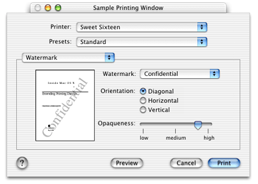
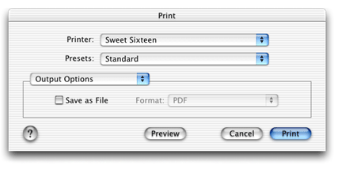

> 导航：[总目录](../../../README.md) · [documentation](../../../_indexes/documentation.md) · [Extending Printing Dialogs](Introduction%20to%20Extending%20Printing%20Dialogs.md)

[Next](Printing%20Dialog%20Extension%20Concepts.md)[Previous](Printing%20Features%20and%20Printing%20Dialog%20Panes.md)

# Interface Guidelines for Custom Panes

Each pane in a printing dialog is a self-contained human interface that enables a user to control the settings for a named set of printing features. This chapter presents guidelines for the design of this interface. The guidelines presented here will help you design an interface that’s effective, visually pleasing, and consistent with other dialog components.

Figure 2-1 illustrates a possible design for a custom pane that presents settings for a watermark printing feature. As you read this chapter, consider how this interface design might be improved.

__Figure 2-1__  An example of a custom pane

Here are some things to do first, before you begin designing a custom pane.

- Get acquainted with Aqua.

  If this is your first attempt at designing a Mac OS X human interface, you should get acquainted with Aqua, the set of visual features and design standards that creates the distinctive look and feel of Mac OS X. The principal source of information about Aqua is the publication _Apple Human Interface Guidelines_.
- Learn about dialogs in Mac OS X.

  You should understand the basic features of application-modal and document-modal (or sheet) dialogs in Mac OS X. A good place to start is the “Dialogs” chapter in _Apple Human Interface Guidelines_. The section on positioning controls in dialogs and windows is especially useful.
- Choose the appropriate printing dialog.

  The Page Setup and Print dialogs cover two distinct areas of printing functionality. Study a few of the standard panes, and make sure you understand why a pane appears in one dialog or the other.
- Choose appropriate printing features to implement.

  A printing feature that depends on a specific printer capability, such as color options, should always be handled by a printer module—not an application.
- Take a fresh look at your existing interface.

  A custom interface designed for a different operating system or windowing environment won’t necessarily work well in Mac OS X.
- Get professional help.

  Consider using a specialist to design your interface. A professional visual designer can help you present your printing technology in the best possible light.

It’s important to present your interface in a simple, direct manner.

- Name your pane carefully.

  Make sure the title of your custom pane clearly and succinctly describes the set of printing features it supports. Don’t use jargon or technical language. For example, call it “Paper Options” instead of “Media Options.”
- Know your audience.

  If the target audience for your interface includes novice users, keep your interface as simple as possible. Minimize the number of controls. Avoid technical terms such as halftone, saturation, and gamma.

  If the target audience includes professional users, give them the advanced interface they require, but separate the advanced features from the frequently used features. For example, most people won’t need access to controls for specifying precise percentages of cyan, yellow, and magenta.
- Center the interface.

  The interface should be center-biased. That is, controls and other interface elements should tend to be horizontally centered, with the exception of controls that must be visually aligned to indicate functional grouping. Examples and more details about interface layout are available in _Apple Human Interface Guidelines_.
- Provide feedback and communication.

  Any change in the value, position, or state of a control should be accompanied by some sort of feedback—visual or otherwise. Feedback helps people determine desired settings, and it is especially important for controls that affect print quality and color management.

The interface should look and act in a consistent manner with respect to the dialog in which it appears.

- Use familiar terms.

  If elements of your human interface have the same meaning as those used in standard panes, try to use the same names, phrases, and terminology that Apple uses to describe the element.
- Preserve existing functionality.

  When overriding a standard pane, you should preserve the appearance, placement, and behavior of the existing controls. People prefer to see the same controls in the same location.
- Avoid duplication.

  Avoid multiple paths to the same feature. In other words, don’t refer to or control the same printing feature in two places.

Dependency relationships sometimes exist between two or more printing features. A change in the setting of one feature might cause another feature to become invalid, or it might change the possible choices. Dependencies can exist in an interface whenever it contains two or more controls.

An interface should always provide feedback that indicates where dependencies exist, and prevents the user from making invalid choices.

For example, the Output Options pane in the Print dialog (shown in Figure 2-2) allows you to choose a file format only when Save as File is selected.

__Figure 2-2__  Output Options pane in the Print dialog

To _localize_ means to adapt a human interface to meet the language, cultural, and other requirements of a specific geopolitical place or region. When localizing text, you localize for a standard language (such as English) or for one or more regional dialects (such as US English and British English).

To localize your human interface, you need to do the following:

1. Decide which languages and dialects you want to support (this is both a marketing and a technical decision).
2. Translate the text strings used in your interface into the various languages and dialects.
3. Create a visual layout of your human interface, showing the length and location of each string with respect to the associated control or other graphic element.
4. Choose the summary text you will provide when a user displays the Summary pane. Your summary text communicates the titles and current values of the settings in your human interface.
5. Translate the short strings used in your summary text into the various languages and dialects you support.
6. If you provide user assistance, you should localize your help text as well.
7. Configure your software so that the correct layout, summary text, and help text appear in the dialog at runtime.

For more information about localizing human interfaces, see _[Getting Started with Internationalization](https://developer.apple.com/library/archive/referencelibrary/GettingStarted/GS_Internationalization/_index.html#//apple_ref/doc/uid/TP30001113)_.

In Mac OS X, the printing dialogs have built-in user assistance implemented with a round help button in the lower-left corner. When a user clicks this button, the printing system uses Help Viewer to provide general information about the dialog.

You should consider providing additional user assistance for your custom pane. This is particularly important if you are introducing a new printing feature or a new type of control.

Here are a few general suggestions:

- Add graphics to the interface to illustrate what the current settings do.

  For example, the Watermark pane in [Figure 2-1](#apple-f4xwc4dqnrsv64tfmyxwi33df52wszbpkridgmbqgaydsnzzfvbuqmrqgmwviucykjcummrqg4) displays a graphic that previews the effect of the current settings.
- Use help tags to provide immediate assistance.

  If the cursor remains positioned over a control for a few seconds, you can display a help tag. Help tags are short messages displayed _in situ_ to explain the meaning of your control in a few words.

  If you use Interface Builder to construct your human interface, you can use the Info window to associate a string of help text with each control. Interface Builder also allows you to choose on which side of the control the help tag appears.
- Provide in-depth assistance with Help Viewer.

  You can use Help Viewer to provide additional user assistance when your pane is visible. To provide this service, you need to do the following:

  1. Design HTML content for your custom pane.
  2. Write a Carbon event handler that detects a help-button click, launches Help Viewer, and displays your help content.
  3. Install the event handler when your Open function is called, and remove the handler in your Close function.

  To learn how to package HTML content for Apple Help, see _[Apple Help Programming Guide](../../Carbon/Apple%20Help%20Programming%20Guide/Introduction%20to%20Apple%20Help%20Programming%20Guide.md#apple-f4xwc4dqnrsv64tfmyxwi33df52wszbpkridgmbqgaydsmbt)_.

  [Handling the Help Event in a Printing Dialog](Utility%20Functions.md#apple-f4xwc4dqnrsv64tfmyxwi33df52wszbpkridgmbqgaydsnzzfvbuqmrqhewviucykjcummjwhe) explains how to implement a help event handler in your printing dialog extension.

You can design the interface for your custom pane using Interface Builder, Apple’s powerful interface development tool. Interface Builder is a straightforward and intuitive application that lets you

- drag controls from a palette into a layout window
- position and group the controls in compliance with the Aqua layout guidelines
- adjust the attributes of the controls (signature, size, visibility, etc.)
- save a static description of the interface in a `.nib` file that you incorporate into your project

To learn more about using Interface Builder to design an interface, see [Designing the Interface for a Custom Pane](Custom%20Tasks.md#apple-f4xwc4dqnrsv64tfmyxwi33df52wszbpkridgmbqgaydsnzzfvbuqmrqg4wugsscinaumq2d).

If you’re new to developing software for Mac OS X, or you want to learn more about the Mac OS X user experience, see [http://developer.apple.com/ue/](https://developer.apple.com/ue/).

[Next](Printing%20Dialog%20Extension%20Concepts.md)[Previous](Printing%20Features%20and%20Printing%20Dialog%20Panes.md)

