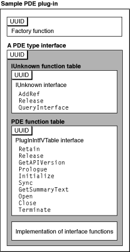
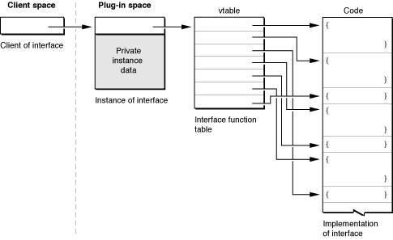

> 导航：[总目录](../../../README.md) · [documentation](../../../_indexes/documentation.md) · [Extending Printing Dialogs](Introduction%20to%20Extending%20Printing%20Dialogs.md)

[Next](Creating%20a%20Plug-in%20Project.md)[Previous](Interface%20Guidelines%20for%20Custom%20Panes.md)

# Printing Dialog Extension Concepts

This chapter describes printing dialog extensions in greater detail and explains how they are used in the printing system.

You should read this chapter if you are not familiar with printing dialog extensions or if you want to reinforce your understanding of the basic concepts.

A printing dialog extension is a code module implemented as a plug-in. The printing system loads, manages, and unloads these plug-ins as needed, whenever an application user displays a printing dialog. This section provides a brief overview of the functional components that enable a printing dialog extension to operate successfully in the Mac OS X environment.

Carbon APIs usually describe a set of functions that you use to request system services. Your code calls the functions as needed, but you aren’t aware of—or concerned with—their implementation.

Plug-in APIs are different. A plug-in does not call the functions described in the APIs, it implements them. The functions that a printing dialog extension implements are made available to its client—the printing system—using function tables that contain pointers to the executable code.

Figure 3-1 illustrates the functional components in a printing dialog extension.

__Figure 3-1__  Functional components of a printing dialog extension

The functional components in Figure 3-1 include the following:

- a factory function

  Core Foundation Plug-in Services uses the factory function to construct an instance of a base interface called `IUnknownVTbl`, which is used in turn to create instances of all other interfaces in a plug-in.
- two function tables

  The printing system uses these tables to call the functions you provide to implement the two required interfaces.
- the three functions in the `IUnknownVTbl` interface

  All Core Foundation plug-ins must implement these three functions. Plug-in Services uses them for reference-counting and to construct the other interfaces the plug-in implements.
- the first three functions in the `PlugInIntfVTable` interface

  All printing plug-ins must implement these functions. The printing system uses them for reference-counting and version control.
- the last seven functions in the `PlugInIntfVTable` interface

  All printing dialog extensions must implement these functions. The printing system calls them to do the work of initializing the pane and the parameter settings, managing the controls, and saving the settings.

Table 3-1 summarizes the programming interfaces that all printing dialog extensions implement.

__Table 3-1__  The required programming interfaces

| Type | Description |
| `CFPlugInFactoryFunction` | Entry point for a CF plug-in |
| `IUnknownVTbl` | Base interface for a CF plug-in |
| `PlugInIntfVTable` | Base interface for a printing dialog extension |

The specification for a programming interface describes the layout, calling syntax, and semantics of a set of functions. How does a plug-in make a programming interface available to clients at runtime?

Plug-ins provide access to an interface using a data structure called an _instance_. An instance contains a pointer to the interface function table (sometimes called a vtable), and possibly some data that’s private to the instance.

The diagram in Figure 3-2 shows how the caller—in this case, the printing system—gains access to your executable code.

__Figure 3-2__  Using an instance to provide an interface to a plug-in client

A printing dialog extension implements two distinct interfaces, as illustrated in [Figure 3-1](#apple-f4xwc4dqnrsv64tfmyxwi33df52wszbpkridgmbqgaydsnzzfvbuqmrqgqwugskiivcucqsf).Therefore it must supply at least two instances to the printing system, one for each interface.

When the printing system asks for an interface at runtime, you construct an instance and pass its address back to the caller. Note that the caller wants access only to your executable code—the caller knows nothing about your private instance data.

In [Plug-in Tasks](Core%20Tasks.md#apple-f4xwc4dqnrsv64tfmyxwi33df52wszbpkridgmbqgaydsnzzfvbuqmrqgywviucykjcummjwgq) you will learn when and how to construct a new instance for each of the two required interfaces.

As a plug-in, a printing dialog extension must have an information property list containing a prescribed set of key-value pairs, or associations. These entries contain configuration data used by various system services at runtime.

Several entries in the property list are used to discover and make use of the capabilities of a printing dialog extension:

- `CFBundleIdentifier` is a string that uniquely identifies the bundle. A printing dialog extension uses this identifier to locate resources within its bundle at runtime.
- `CFPlugInTypes` is a dictionary that identifies the types of custom panes being implemented, and identifies the factory function for each type.

  The printing system uses this information to discover three types of panes—Page Setup and Print dialog panes hosted by applications, and Print dialog panes hosted by printer modules.
- `CFPlugInFactories` associates factory UUIDs with factory function names.
- `CFPlugInDynamicRegistration` is configured to direct Plug-in Services to use `CFPlugInTypes` and `CFPlugInFactories` for static registration.

In [Editing the Bundle Properties](Creating%20a%20Plug-in%20Project.md#apple-f4xwc4dqnrsv64tfmyxwi33df52wszbpkridgmbqgaydsnzzfvbuqmrqguwviucykjcummjwge) you will learn how to define these property list entries.

This section discusses some key aspects of the collaboration between Core Foundation Plug-in Services, the printing system, and the printing dialog extension at runtime.

When an application asks the printing system to display a new printing dialog, the printing system locates, loads, and activates the appropriate set of printing dialog extensions for the destination printer. To perform these tasks, the printing system collaborates with Core Foundation Plug-in Services, which maintains a registry of of all available printing dialog extensions.

The availability requirements for printing dialog extensions differ. An application-hosted printing dialog extension needs to be available only when the application is running. A printer module–based printing dialog extension needs to be available as long any associated printer queues exist.

Consequently, applications and printer modules register their printing dialog extensions with Core Foundation Plug-in Services in different ways:

- An application calls the function `CFPlugInCreate,` passing it a URL that specifies the location of the plug-in bundle. When the application terminates, its printing dialog extension is no longer available.
- A printer module passes the location of the plug-in bundle to the printing system, which takes care of registration. The printing system also maintains the association between the printing dialog extension and one or more printer queues.

To learn more about how applications and printer modules register printing dialog extensions, see [Integration Tasks](Integration%20Tasks.md#apple-f4xwc4dqnrsv64tfmyxwi33df52wszbpkridgmbqgaydsnzzfvbuqmrqhawviubz).

When an application asks the printing system to display a dialog, a set of printing dialog extensions are selected and loaded. The selection process must take into account a number of variables—the destination printer, the printer module, the dialog, rules of precedence, and so on.

Once a printing dialog extension is activated, the printing system calls its functions to initialize, (possibly) display, and release its custom pane.

- The `Prologue` function provides basic information about the pane—such as its size—and allocates memory for private data a printing dialog extension needs to maintain.
- The `Initialize` function initializes settings and provides additional information about the capabilities of the printing dialog extension.
- The `Sync` function maintains the correspondence between the pane settings and the associated parameter values recorded in a job ticket.
- The `GetSummaryText` function provides localized descriptions of each printing feature, along with its current value, for display in a Summary pane.
- The `Open` function performs any tasks deemed necessary just before the pane becomes visible, such as constructing the interface and installing Carbon event handlers.
- The `Close` function performs any tasks deemed necessary just before the pane is hidden, such as removing Carbon event handlers.
- The `Terminate` function performs tasks related to tearing down the human interface (such as releasing resources and memory) and preparing the plug-in to be unloaded.

Before its pane is made visible, a printing dialog extension creates a set of Carbon controls and embeds them inside a specialized container control called a user pane. The printing system can manipulate the user pane and its contents as a unit, without knowing or caring what’s inside. The Control Manager draws the embedded Carbon controls and performs standard event-handling.

A printing dialog extension can use a Carbon event handler to register an event-handling function for any of its controls. The event-handling function is called whenever a user interacts with the corresponding control. The embedding hierarchy ensures that the proper event-handling function is called.

In Mac OS X, applications can choose to support document-modal (or sheet) printing dialogs. Sheet dialogs make it possible to display the same printing dialog in several document windows at the same time. Printing dialog extensions must support this possibility, which means they must be reentrant.

When the printing system creates a new dialog, each printing dialog extension allocates a block of memory for private state information specific to the dialog. A _context_ is a pointer to this memory. The printing system maintains the correspondence between a context and the dialog pane to which it applies, passing the correct context to the printing dialog extension as needed.

To learn more about contexts, see [Defining a Custom Context](Custom%20Tasks.md#apple-f4xwc4dqnrsv64tfmyxwi33df52wszbpkridgmbqgaydsnzzfvbuqmrqg4wugskijbcucr2d).

The Mac OS X printing system uses an opaque object called a _ticket_ to maintain information associated with a print job. Printing dialog extensions use tickets to share their settings data with the host application or printer module, with the printing system, and potentially with other printing dialog extensions.

In general, printing plug-ins—such as printing dialog extensions and printer modules—have direct access to tickets via Ticket Services. Applications cannot directly access tickets. Instead, applications must query a `PMPageFormat` or `PMPrintSettings` object to retrieve ticket data.

Almost all printing dialog extensions introduce new printing features. For each new feature, you need to define

- a parameter or setting
- a data format to represent the parameter in a ticket
- a ticket key to use when accessing the parameter in a ticket

A printing dialog extension must use Core Foundation base types to represent its settings in a ticket. The following base types are permitted—CFString, CFNumber, CFDate, CFBoolean, CFArray, CFDictionary, and CFData. CFData can be used to represent data that does not correspond to one of the other Core Foundation base types.

To learn more about how printing dialog extensions use tickets, see [Accessing Ticket Data](Integration%20Tasks.md#apple-f4xwc4dqnrsv64tfmyxwi33df52wszbpkridgmbqgaydsnzzfvbuqmrqhawviucykjcummjxgq).

Both printer modules and applications can host a printing dialog extension that implements—and possibly overrides another implementation of—one of the standard sets of printing features listed in [Table 1-1](Printing%20Features%20and%20Printing%20Dialog%20Panes.md#apple-f4xwc4dqnrsv64tfmyxwi33df52wszbpkridgmbqgaydsnzzfvbuqmrqgiwueqsdijeeerce).

When implementing a standard feature set, the printing system ignores your custom title and uses the localized name of the feature set to identify your pane in the dialog.

The parameters for a standard feature set are considered to be public data if the printing system defines the keys and data types used to store the parameters in a ticket. If you implement a feature with a public parameter, you must add an entry to the appropriate ticket using the system-defined key and data type.

In addition to the supplying the same public data, your printing dialog extension can store its private data in the same ticket, using its own keys and data types.

If your printing dialog extension overrides a standard pane, you should extend—but not replace—the interface in the standard pane. Your customers benefit when you retain the appearance, placement, and behavior of the existing controls.

If several registered printing dialog extensions implement the same set of standard printing features, the printing system uses precedence rules to determine which one is actually used in the dialog.

There are three levels of precedence:

1. Application
2. Printer module
3. Printing system

For example, an application-hosted printing dialog extension always takes precedence over printer modules or the printing system, regardless of the registration order.

The printing dialog extension that gets precedence must provide an implementation—in other words, it must display its interface within the assigned pane and provide the public data for all standard printing features.

If the user switches printers from inside the dialog, the printing system unloads all printing dialog extensions and rebuilds the dialog, re-applying the precedence rules.

PostScript printers have a number of features typically not available in raster printers. These features are defined in PostScript printer description (PPD) files supplied by printer vendors. PPD files contain keywords and other information to specify features and default settings for a PostScript printer. PPD files are created for specific printers or for printer families.

The purpose of the Printer Features pane in the Print dialog is to provide a default interface for the PostScript features defined in the PPD file associated with the destination printer.

Printer vendors are strongly encouraged to write printing dialog extensions that selectively override the Printer Features pane. For example, a custom pane could handle features that users often overlook, or features that would benefit from a well-designed human interface.

The setting for each PostScript feature you handle must be added to the print settings ticket, using the mechanism described in [Handling PostScript Features](Custom%20Tasks.md#apple-f4xwc4dqnrsv64tfmyxwi33df52wszbpkridgmbqgaydsnzzfvbuqmrqg4wugqkdijeeiqse).

To learn how printing dialog extensions declare the PPD features they implement, see [Registering PPD Main Keywords](Creating%20a%20Plug-in%20Project.md#apple-f4xwc4dqnrsv64tfmyxwi33df52wszbpkridgmbqgaydsnzzfvbuqmrqguwugsscijceir2i).

For general information about PPD files, see _[Using PostScript Printer Description Files](../Using%20PostScript%20Printer%20Description%20Files/Introduction%20to%20Using%20PostScript%20Printer%20Description%20Files.md#apple-f4xwc4dqnrsv64tfmyxwi33df52wszbpkridimbqgaydsnrq)_.

[Next](Creating%20a%20Plug-in%20Project.md)[Previous](Interface%20Guidelines%20for%20Custom%20Panes.md)

