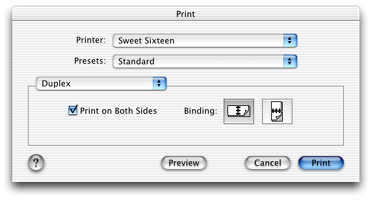
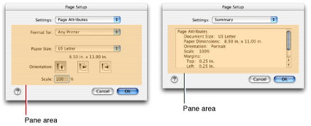
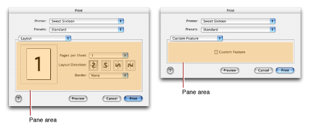

> 导航：[总目录](../../../README.md) · [documentation](../../../_indexes/documentation.md) · [Extending Printing Dialogs](Introduction%20to%20Extending%20Printing%20Dialogs.md)

[Next](Interface%20Guidelines%20for%20Custom%20Panes.md)[Previous](Introduction%20to%20Extending%20Printing%20Dialogs.md)

# Printing Features and Printing Dialog Panes

This chapter describes standard printing features, their relation to printing dialog panes, and the various ways of adding new panes to printing dialogs.

Throughout this chapter, the term “printing dialog” always refers specifically to the Page Setup and Print dialogs, which are introduced and discussed in detail in _Mac OS X Printing System Overview_.

Apple has identified a number of printing features common to many printers and applications. For convenience, similiar features are organized into named sets, as listed in Table 1-1.

__Table 1-1__  Standard sets of printing features

| Name | Features |
| Page Attributes | Formatting printer, paper size, orientation, scale |
| Copies & Pages | Copies per page, page range, collation |
| Layout | Page layout and border options |
| Duplex | Print on both sides, binding options |
| Output Options | Output to file in various formats |
| Paper Feed | Paper source tray selection |
| Error Handling | PostScript errors, tray switching |
| Printer Features | Features declared with PPD file keywords |
| Color Options | Color-matching system |
| Paper Type & Quality | Media types, paper quality levels |

Each feature set has a corresponding set of parameters of various types. These parameters are used during the execution of a print job to control and refine the output.

The printing dialogs allow an application user to view and change control settings that represent the current values of these parameters. For example, Duplex is implemented in the Print dialog as shown in Figure 1-1.

__Figure 1-1__  Duplex pane in the Print dialog

Duplex has two parameters:

1. Print on both sides (Boolean)
2. Long-edge or short-edge binding (enumeration)

A checkbox control represents the Boolean parameter, and two button controls represent the binding choices. Both buttons are disabled unless the checkbox is selected.

A pane is a rectangular region inside a dialog window, in which a set of related controls are displayed together. Printing dialogs present a list of available panes using a pop-up menu, and allow the user to choose one for display.

A pane has the following characteristics:

- It has a _title_—a string that names the set of printing features it implements. The title appears in the pane pop-up menu, and also in the Summary pane.
- It has a set of controls, closely aligned to the parameters of a set of features provided by the destination printer or the application.
- It allows the user to examine and change settings for these controls.

From a user’s perspective, all of the panes in a printing dialog look integrated and seem to have equal weight. The area allocated to each pane depends on its contents, and is limited only by the maximum width and height permitted by the printing system.

The Apple-supplied printing dialog panes in Mac OS X are called _standard panes_. These panes implement standard sets of printing features, and give users a consistent interface as they switch between different applications and printers.

Table 1-2 lists the standard panes in Mac OS X. These panes implement most of the feature sets listed in [Table 1-1](#apple-f4xwc4dqnrsv64tfmyxwi33df52wszbpkridgmbqgaydsnzzfvbuqmrqgiwueqsdijeeerce).

__Table 1-2__  The standard panes in Mac OS X

| Pane | Dialog | PostScript |
| Page Attributes | Page Setup |  |
| Copies & Pages | Print |  |
| Layout | Print |  |
| Duplex | Print |  |
| Output Options | Print |  |
| Paper Feed | Print | Y |
| Error Handling | Print | Y |
| Printer Features | Print | Y |

Panes implemented by third-party application developers and printer vendors are called _custom panes_. Custom panes can implement standard feature sets found in [Table 1-1](#apple-f4xwc4dqnrsv64tfmyxwi33df52wszbpkridgmbqgaydsnzzfvbuqmrqgiwueqsdijeeerce), or custom printing features for a specific application or printer.

When a custom pane implements a standard feature set, the printing system uses the standard name to identify the pane. However, the printing system never modifies the appearance of the user interface inside a custom pane.

A pane’s dimensions are constrained by the maximum size of the dialog. The Page Setup and Print dialogs both display their panes in the central part of the window, but the two dialogs have different widths and layouts. To get a sense of where a pane appears in each dialog, it’s useful to view some examples.

Figure 1-2 shows two examples of panes in the Page Setup dialog. The shaded area indicates the actual pane rectangle.

__Figure 1-2__  Panes in the Page Setup dialog

Figure 1-3 shows two examples of panes in the Print dialog. The dialog surrounds the pane with a group box that is slightly larger than the pane—the shaded area indicates the actual pane rectangle.

__Figure 1-3__  Panes in the Print dialog

The pane on the right probably looks unfamiliar—clearly it’s not a standard pane. This is a custom pane implemented with a printing dialog extension.

Adding a custom pane to a printing dialog is said to extend the dialog, because the pane—together with the software that implements it—adds functionality that goes beyond what Mac OS X provides.

What’s involved in extending a printing dialog?

At minimum, you need to

- define new parameters for any custom printing features
- design a human interface
- develop software that manages the interface and its parameters

While the practice is discouraged, Carbon applications that run in Mac OS X can still use the `AppendDITL` function to extend a printing dialog. This approach is fully documented in [Tech Note 1080](https://developer.apple.com/technotes/tn/tn1080.html), “Adding Items to the Printing Manager’s Dialogs”.

The application provides callback functions to initialize the dialog, append new items to it, draw the items, handle user actions on the appended items, and so on. The printing system displays the added controls inside a new dialog pane that’s named for the application. The application can host only a single custom pane in each dialog.

Using the `AppendDITL` function is the only solution for application developers who want to maintain a common code base for Mac OS 9 and Mac OS X. In Mac OS X it has some drawbacks—for example, an application using this mechanism cannot display the dialog as a sheet.

A Cocoa application can extend the Print dialog by adding a custom NSView to an NSPrintPanel object, using the `setAccessoryView` method. The custom view is displayed when the user selects the application’s pane in the Print dialog. The printing system resizes the pane to accommodate the NSView you add.

In similiar fashion, a Cocoa application can extend the Page Setup dialog by adding a custom NSView to an NSPageLayout object.

For more information on how to add accessory views to printing dialogs in a Cocoa application, see _[Printing Programming Guide for Mac](../../Cocoa/Printing%20Programming%20Guide%20for%20Mac/About%20Printing%20on%20the%20Mac.md#apple-f4xwc4dqnrsv64tfmyxwi33df52wszbpgeydambqga4dg2i)_.

The _printing dialog extension_ is a Mac OS X printing plug-in API that allows applications and printer modules to take advantage of advanced features in the printing system as they extend the printing dialogs. For a complete specification of this API, see _Printing Plug-in Interfaces Reference_.

Applications and printer modules can use printing dialog extensions to

- provide one or more custom dialog panes, each with a custom title
- support document-modal (or sheet) printing dialogs
- supply descriptions of custom pane settings in the Summary pane
- override a standard pane with a custom pane

Printer modules can also use printing dialog extensions to

- implement standard feature sets that have no standard pane, such as Color Options
- provide custom panes for PostScript features defined in PPD files

It’s worth noting that Apple uses printing dialog extensions to implement almost all the standard panes. (The one exception is Summary, a special pane that contains information about other panes.)

If you want to extend a printing dialog and you’re not sure how to proceed, here are some recommendations.

Cocoa applications should use the approach described in [Accessory Views in Cocoa](#apple-f4xwc4dqnrsv64tfmyxwi33df52wszbpkridgmbqgaydsnzzfvbuqmrqgiwueqsdirdesq2j).

If your Carbon application runs in Mac OS X exclusively, the choice is easy—you should always use a printing dialog extension.

For Carbon applications that run in both Mac OS 9 and Mac OS X:

- You can use the approach described in [Appending Dialog Items in Carbon](#apple-f4xwc4dqnrsv64tfmyxwi33df52wszbpkridgmbqgaydsnzzfvbuqmrqgiwviucykjcummzs) , although you won’t be able to take advantage of some advanced printing features in Mac OS X.
- You can write a printing dialog extension, maintain two chunks of code, and determine at runtime which to use.

[Next](Interface%20Guidelines%20for%20Custom%20Panes.md)[Previous](Introduction%20to%20Extending%20Printing%20Dialogs.md)

