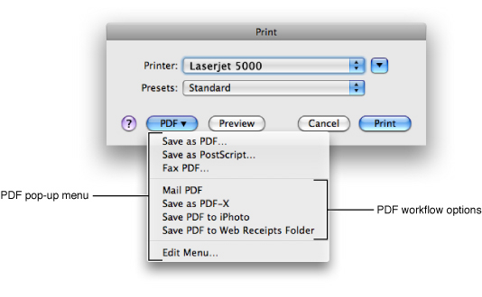

> 导航：[总目录](../../../README.md) · [documentation](../../../_indexes/documentation.md) · [Providing PDF Workflow Options in the Print Dialog](Introduction%20to%20Providing%20PDF%20Workflow%20Options%20in%20the%20Print%20Dialog.md)


[Next](Document%20Revision%20History.md)[Previous](Introduction%20to%20Providing%20PDF%20Workflow%20Options%20in%20the%20Print%20Dialog.md)

# Creating PDF Workflow Options

You can access PDF workflow options by clicking the PDF button in the Print dialog, as shown in Figure 1-1.

__Figure 1-1__  A Print dialog that provides PDF workflow options



The PDF button is always visible. When the button is pressed, the PDF pop-up menu appears. In addition to several built-in options, this menu contains a section for additional PDF workflow options. Menu options appear in this section of the menu if the system detects items in one or more of these directories:

- `/Library/PDF Services`

  The printing system installs several items in this directory.
- `~/Library/PDF Services`

  Users can place items in this directory. The tilde (~) character indicates the user’s home directory.
- `/Network/Library/PDF Services`

  A system administrator can place items in this directory, to make custom PDF workflow options available to many users.

You can add workflow options to the PDF pop-up menu simply by adding items to the one of these directories. The type of item placed in the directory determines what the item does when the user selects the corresponding option from the PDF pop-up menu. For example, if the item is a folder alias, then the PDF is copied to that location. The name of the item appears as an option in the PDF pop-up menu, so it is important that the item is named appropriately.

You can place the following items in a PDF Services directory:

- A folder
- An alias to a folder
- An application or an alias to an application
- A UNIX tool or an alias to a UNIX tool
- A compiled AppleScript file or an alias to a compiled AppleScript file
- An Automator workflow

Each item’s behavior is described in the sections that follow.

You can use a folder to add a submenu to the PDF workflow pop-up menu in the Print dialog. You should place the folder inside one of the PDF Services directories described above. A folder of this type typically contains one or more PDF workflow items. When the user displays the PDF pop-up menu, the user sees a submenu containing the workflow items in the folder.

Example:

A user creates a folder named “My Workflows”, adds a custom workflow item to the folder, and drags the folder into the `~/Library/PDF Services` directory. When the user displays the PDF pop-up menu in the Print dialog, the user sees a submenu named “My Workflows”. Inside the submenu is a PDF workflow item. If the user chooses the item, The printing system creates a PDF file and the workflow is performed.

A folder alias triggers a copy action. The printing system creates a PDF and then places the PDF into the resolved folder alias provided. The name of the generated PDF file is the document's title as specified by the printing application with a .pdf extension. If there is a naming conflict, the name is made unique within the folder by appending a serial number.

Example:

A user creates an alias of their iDisk Public folder and drags it to the `~/Library/PDF Services` directory. The user then renames the alias to something meaningful, such as “Copy PDF to Public Folder.” This item now appears as a choice in the PDF pop-up menu in the Print dialog. When the user chooses “Copy PDF to Public Folder" from the menu, the printing system creates a PDF file and copies it to the user’s iDisk Public folder.

An application or application alias triggers an open event with the spooled PDF file. It is the application's responsibility to delete the file when the user closes the PDF document. Existing applications do not know that the PDF spool file should be deleted and so the PDF file is left in the `/tmp` directory.

Example:

A user creates an alias of the Adobe Acrobat application and drags it o the `~/Library/PDF Services` directory. The user then renames the alias to something meaningful, such as “Open PDF With Acrobat.” This item now appears as a choice in the PDF pop-up menu in the Print dialog. When the user chooses “Open PDF With Acrobat” from the menu, the printing system creates a PDF file and then opens the PDF in Acrobat.

What the user can do to the PDF depends on the application. Users who want to edit PDF files, can provide an alias to Adobe Illustrator or Adobe Photoshop. Users who want to examine the PDF stream can provide an alias to a text editor such as BBEdit or TextEdit.

A tool is a file that is not an application and has at least one execute bit set. Tools can be written in C, Perl, Python, Bash, or using any other language that can create an executable file.

A UNIX tool or tool alias triggers an action by the tool on the PDF file. Tools are passed three parameters:

- the title of the PDF document
- a string that specifies the CUPS print options for the print job
- the path to the spooled PDF file

The tool can perform any processing based on these parameters, usually creating a new file, and then the tool should delete the spooled PDF file.

Example:

The code listing shown in Listing 1-1 defines a script that executes the pdfcrypt tool available from [http://www.sanface.com/pdfcrypt.html](http://www.sanface.com/pdfcrypt.html%20).

The code in Listing 1-1 encrypts the PDF file with the password “snooker.” When the encrypted file is opened in Preview, the user is prompted for the password.

__Listing 1-1__  Code that encrypts a PDF

```
#!/bin/sh
#
# usage: pdfcrypt title options inputfile
#
/usr/bin/pdfcrypt -input="$3" -output="/Users/rich/$1.pdf" -pass="snooker"
open -a "Preview" "/Users/rich/$1.pdf"
rm "$3"
```


A compiled data fork AppleScript is executed from within the printing application. The script is sent an open event with the PDF spool file as the document to be opened.

Example:

A user creates an AppleScript and saves the compiled AppleScript (or an alias to it) in the `~/Library/PDF Services` directory. The user names the AppleScript file appropriately. For the AppleScript shown in Listing 1-2 an appropriate name would be “Send PDF via Email” because the AppleScript file opens a new message in the Mail application and attaches the PDF file.

__Listing 1-2__  An AppleScript that creates an email message and attaches a PDF file

```
on open these_items
tell application "Mail"
set composeMessage to (make new outgoing message with properties {visible:true})
tell composeMessage
tell content
repeat with aFile in these_items
make new attachment with properties {file name:aFile} at before the first character
end repeat
end tell
end tell
end tell
end open
```


Introduced in OS X v10.4, the Automator application makes it easy to automate repetitive tasks. Automator lets you skip the programming and scripting that is sometimes required to create workflows. Individual steps called actions can be assembled into a complete task by dragging items into an Automator workflow pane. When the workflow executes, data is piped from one action to the next until the desired result is achieved. For more information about developing Automator workflows, see _[Automator Programming Guide](../../Apple%20Applications/Automator%20Programming%20Guide/Introduction%20to%20Automator%20Programming%20Guide.md#apple-f4xwc4dqnrsv64tfmyxwi33df52wszbpkridimbqgaytinjq)_.

Example:

A user launches Automator and selects PDF in the Library list. The Action list shows a set of actions which accept PDF files as input. The user drags an action such as “Watermark PDF” into the workflow pane as the first action, and configures the action. Optionally, the user could add other actions to process the output of the first action as needed.

To save the workflow so that it appears in the Print dialog, the user can follow these steps:

1. In Automator, choose File > Save As Plug-in.
2. Assign a meaningful name such as “Add Watermark to PDF” to the workflow.
3. From the pop-up menu, choose Print Workflow and click Save.

Automator saves the workflow as an application in the `~Library/PDF Services` folder.

[Next](Document%20Revision%20History.md)[Previous](Introduction%20to%20Providing%20PDF%20Workflow%20Options%20in%20the%20Print%20Dialog.md)

