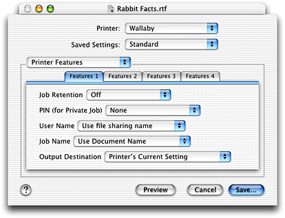
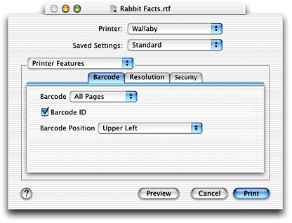

> 导航：[总目录](../../../README.md) · [documentation](../../../_indexes/documentation.md) · [Using PostScript Printer Description Files](Introduction%20to%20Using%20PostScript%20Printer%20Description%20Files.md)


[Next](PPD%20Files%20Tasks.md)[Previous](Introduction%20to%20Using%20PostScript%20Printer%20Description%20Files.md)

# PPD Concepts

A PostScript printer description (PPD) file is a text file that contains keywords and other information to specify printer features, options, and settings. PPD files are created by printer vendors for a specific PostScript printer or printer family, and must comply with Adobe’s _PostScript Printer Description File Format Specification_. OS X parses the contents of a PPD file to discover the features provided by a printer, and then uses that information to build a user interface and supply PostScript code to invoke the feature settings chosen by the user.

This chapter

- provides an overview of PostScript printer description (PPD) files and the important keywords for OS X
- describes the Printer Features pane that can appear in the Print dialog for a PostScript printer
- shows how OS X searches for and chooses PPD files

There are two types of keywords in a PPD file: main and options. _Main keywords_ describe a printer’s features, such as page size (`*PageSize`) and font (`*Font`). _Option keywords_ describe the options associated with a feature, such as `Letter` and `Legal` for `*PageSize`. [Listing 2-1](#apple-f4xwc4dqnrsv64tfmyxwi33df52wszbpkridgmbqgaydcobzfvbecssjjbcemra) shows an excerpt from a PPD file. In each case, the main keyword `*TraySwitch` is followed by an option keyword and the PostScript code to invoke that option.

Main keywords have two subclasses: default and query keywords. _Default keywords_ always have `Default` in the prefix and indicate the default setting for a feature associated with a main keyword, such as `*DefaultTraySwitch`.

_Query keywords_ are associated with PostScript code that can be downloaded to a printer to get information about the printer’s current state. For example, the query keyword `*?TraySwitch` in [Listing 2-1](#apple-f4xwc4dqnrsv64tfmyxwi33df52wszbpkridgmbqgaydcobzfvbecssjjbcemra) is followed by PostScript code that, when executed in the printer, sets the paper tray used by the printer. A main keyword does not need an associated query keyword, but a query keyword is always associated with a main keyword.

__Listing 1-1__  An example PPD file entry for the tray switch option

```
*OpenUI *TraySwitch/Tray Switching: Boolean
*OrderDependency: 20 AnySetup *TraySwitch
*DefaultTraySwitch: False
*TraySwitch True/True: "1 dict dup /TraySwitch true put setpagedevice"
*TraySwitch False/False: "1 dict dup /TraySwitch false put setpagedevice"
*?TraySwitch: "
   save
   currentpagedevice /TraySwitch get
   {(True)}{(False)}ifelse = flush
   restore
"
*End
*CloseUI: *TraySwitch
```

Some main keywords in a PPD file are included to build the interface that allows a user to choose the settings for a print job. These are called _structure keywords_. The two keyword pairs that are important for OS X PPD files are `*OpenGroup/*CloseGroup` and `*OpenUI/*CloseUI`. You need to know about these keywords if you want to take advantage of the Printer Features pane (see [The Printer Features Pane in the Print Dialog](#apple-f4xwc4dqnrsv64tfmyxwi33df52wszbpkridgmbqgaydcobzfvbegskcjffeksq)).

The `*OpenGroup/*CloseGroup` keywords are optional and are used to group features that should appear together in the user interface. A string value must be provided with the `*OpenGroup/*CloseGroup` keywords to specify the name of the group. [Listing 2-2](#apple-f4xwc4dqnrsv64tfmyxwi33df52wszbpkridgmbqgaydcobzfvbeeq2gircemsi) shows an excerpt from a PPD file that describes a group. The first line `*OpenGroup: Finishing/Finishing Options` and the last line `*CloseGroup: Finishing` enclose a list of features that should appear in the user interface as a group. The translation string `Finishing Options` specifies the label to use in the user interface for the group.

__Listing 1-2__  Specifying a group of Finishing features in a PPD file

```
*OpenGroup: Finishing/Finishing Options
*OpenUI *FoldType/Fold Type: PickOne
*DefaultFoldType: None
*FoldType Fan/Fan: "% postscript code to invoke Fan fold "
*FoldType Saddle/Saddle: "% postscript code to invoke Saddle fold "
*FoldType Wing/Wing: "% postscript code to invoke Wing fold "
*FoldType None/None: "% postscript code to invoke no fold "
*CloseUI: *FoldType

*OpenUI *BannerSheet/Banner Sheet: Boolean
*DefaultBannerSheet False:
*BannerSheet True/True: "% postscript code to invoke a banner sheet "
*BannerSheet False/False: "% postscript code to turn off a banner sheet "
*CloseUI: *BannerSheet

*CloseGroup: Finishing
```

The `*OpenUI/*CloseUI` keywords are used to enclose keywords and values that describe printer features the user may select. In OS X, the `*OpenUI` keyword can take `Boolean` and `PickOne` options. A `PickOne` list is one in which a user may choose only one item from a list of available options. (The `PickMany` option is not supported even though it is listed in the _PostScript Printer Description File Format Specification_.)

[Listing 2-2](#apple-f4xwc4dqnrsv64tfmyxwi33df52wszbpkridgmbqgaydcobzfvbeeq2gircemsi) shows two features defined by the `*OpenUI` keyword— fold type and banner sheet. Fold type is a feature that has four options—fan, saddle, wing, and none. In OS X, the options appear on a pop-up menu titled Fold Type, with None as the default setting. Banner Sheet is a Boolean option that can be on (`True`) or off (`False`). The default is off. In OS X, this option appears as a checkbox labelled Banner Sheet.

Although [Listing 2-2](#apple-f4xwc4dqnrsv64tfmyxwi33df52wszbpkridgmbqgaydcobzfvbeeq2gircemsi) shows the `*OpenUI` features enclosed by the `*OpenGroup/*CloseGroup` keywords, the grouping keywords are optional. Grouping keywords provide printer vendors with the opportunity to control which features appear together in the user interface. You can find more information on defining groups in [Specifying Grouping in the Printer Features Pane](PPD%20Files%20Tasks.md#apple-f4xwc4dqnrsv64tfmyxwi33df52wszbpkridgmbqgaydcojqfvbuuqsgjjdugqq).

For more detailed information on PPD keywords and syntax, see _PostScript Printer Description File Format Specification_, available from Adobe Developer Support:

[http://partners.adobe.com/](http://partners.adobe.com/)

In OS X, Apple provides panes in the Print dialog for the most common printer features. These panes include Copies & Pages, Layout, Output Options, Paper Feed, Error Handling, Duplex, and Summary. Whether a pane appears in the Print dialog depends on the printer’s specific features. Two of these panes are available only for PostScript printers—Paper Feed and Error Handling. See _Inside OS X: About the OS X Printing System_ for a description and an example of each of these panes. What if your PostScript printer has some less than common features that are not in these Apple-provided panes? As a developer, you have two choices: create a custom pane or use the Printer Features pane provided by Apple for PostScript printers.

You can create a custom pane for a printer by writing a printing dialog extension (PDE). _Inside OS X: Extending Printing Dialogs_ provides details on writing a printing dialog extension. You should also see [Adding PPD Keywords to a PDE’s Information Property List](PPD%20Files%20Tasks.md#apple-f4xwc4dqnrsv64tfmyxwi33df52wszbpkridgmbqgaydcojqfvbuuqscirceosa) for information on what you must do to register the PPD keywords that are supported by your custom printing dialog extension.

Although the Printer Features pane does not give you as much control over the user interface as creating a custom pane does, it provides a fairly easy way for you to make features accessible in the user interface. This remainder of this section describes the Printer Features pane and discusses what you must do to have your printer’s features appear in this pane.

_Printer Features_ is a pane in the Print dialog that is available only for PostScript printers. [Figure 2-1](#apple-f4xwc4dqnrsv64tfmyxwi33df52wszbpkridgmbqgaydcobzfvbuuqsfifeesry) shows a sample Printer Features pane. For a feature to appear in this pane, the feature must be defined in the PostScript printer description file as follows.

- The feature must be defined with the `*OpenUI/*CloseUI` keywords.
- The `*OpenUI` keyword must have either the `Boolean` or `PickOne` option. The `PickMany` option is not supported.
- A `Boolean` option must explicitly define two options, `True` and `False`, otherwise it is treated as a `PickOne` option.
- Features can be grouped by enclosing their definitions with the `*OpenGroup/*CloseGroup` keywords, and specifying a name for the group. This is optional.

The OS X printing system follows these rules to construct the Printer Features pane:

- Features are organized within the Printer Features pane under tabs, as shown in [Figure 2-1](#apple-f4xwc4dqnrsv64tfmyxwi33df52wszbpkridgmbqgaydcobzfvbuuqsfifeesry). Tabs are labeled sequentially as Features 1, Features 2, and so forth, unless features are defined in groups. Then, the tabs are labelled with the group name. [Figure 2-2](#apple-f4xwc4dqnrsv64tfmyxwi33df52wszbpkridgmbqgaydcobzfvbecsseiffemsi) shows an example of tabs that are labelled with the group name specified using the `*OpenGroup/*CloseGroup` keywords.
- The interface elements (checkboxes and pop-up menus) are displayed left-justified in the tabbed pane in the order in which they are defined in the PPD file.
- No more than five features appear in a tabbed pane. If features are grouped and a group contains more than five features, new tabbed panes are created as needed. The additional tabs are labelled sequentially as Group Name 2, Group Name 3, and so forth.
- A `PickOne` list is displayed in the interface as a pop-up menu.
- A `Boolean` item is displayed in the interface as a checkbox. A checked item is `True`; an unchecked item is `False`.
- A `Boolean` item that does not have two, and only two, options one of which is `True` and the other `False`, is displayed as a pop-up menu.
- If a `PickMany` list is defined, it is ignored. This option is not currently supported.

__Figure 1-1__  A Printer Features pane in which the printing system groups the features



See [Specifying Grouping in the Printer Features Pane](PPD%20Files%20Tasks.md#apple-f4xwc4dqnrsv64tfmyxwi33df52wszbpkridgmbqgaydcojqfvbuuqsgjjdugqq) for more information on how printer vendors can use grouping keywords to control the layout of the Printer Features pane.

__Figure 1-2__  A Printer Features pane in which groups are specified in the PPD file



OS X searches for a PostScript printer’s PPD file when a user creates a print queue. OS X automatically searches for PPD files in the appropriate localized folder. First, it looks in the `en.lproj` folder in following locations, in this order:

- `/Library/Printers/PPDs/Contents/Resources/`
- `/System/Library/Printers/PPDs/Contents/Resources/`

If it finds a PPD file for the printer in the `en.lproj` folder, it then looks for the localized PPD file in the language folder for the currently active language. See [Installing PPD Files](PPD%20Files%20Tasks.md#apple-f4xwc4dqnrsv64tfmyxwi33df52wszbpkridgmbqgaydcojqfvbuuqsiifdeirq) for information on localized folders.

If OS X doesn’t find a PPD file for a PostScript printer in either location, it looks in the Classic System Folder, provided the Classic environment has been run once or the Classic System Folder has been selected at least once in the Startup Disk pane of System Preferences. In other words, OS X must know of the existence of the Classic System Folder.

`:System Folder:Extensions:Printer Descriptions:`

When a user adds a PostScript printer that’s connected through a bi-directional connection such as AppleTalk or USB, she can choose Auto Select, a printer model from the Printer Model pop-up menu, or Other. A user who chooses Other can select a PPD file that’s in a nonstandard location.

If a user chooses Auto Select, OS X makes the selection by matching the value of the PPD’s `*Product` keyword with the name returned by sending the printer a query. For example, a PPD file that contains this keyword and value.

`*Product: “(LaserWriter 8500)”`

identifies the printer model LaserWriter 8500. This must match the value of the `*Product` keyword returned from the printer in response to a PostScript query.

Users must select the PPD file for a line printer remote (lpr) printer from a pop-up menu. For best results, they should select the PPD file that’s provided specifically for that printer.

If an application is running in the Classic environment, the LaserWriter 8 driver looks for PPD files in the Classic System Folder:

`:System Folder:Extensions:Printer Descriptions:`

[Next](PPD%20Files%20Tasks.md)[Previous](Introduction%20to%20Using%20PostScript%20Printer%20Description%20Files.md)

