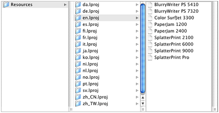
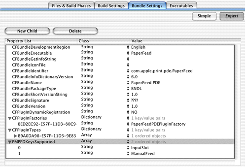

> 导航：[总目录](../../../README.md) · [documentation](../../../_indexes/documentation.md) · [Using PostScript Printer Description Files](Introduction%20to%20Using%20PostScript%20Printer%20Description%20Files.md)


[Next](Document%20Revision%20History.md)[Previous](PPD%20Concepts.md)

# PPD Files Tasks

This chapter describes the most common tasks printer vendors need to do with PPD files:

- [Installing PPD Files](#apple-f4xwc4dqnrsv64tfmyxwi33df52wszbpkridgmbqgaydcojqfvbuuqsiifdeirq). Make sure your PPD file is installed in the right place; otherwise OS X won’t find it.
- [Creating a Localized PPD File](#apple-f4xwc4dqnrsv64tfmyxwi33df52wszbpkridgmbqgaydcojqfvbuuqsfiffeesi). Find out what you need to do to the contents of a PPD file to customize it for your worldwide users.
- [Specifying Grouping in the Printer Features Pane](#apple-f4xwc4dqnrsv64tfmyxwi33df52wszbpkridgmbqgaydcojqfvbuuqsgjjdugqq). Control the grouping of nonstandard features in the generic interface OS X creates for your printer’s features.
- [Adding PPD Keywords to a PDE’s Information Property List](#apple-f4xwc4dqnrsv64tfmyxwi33df52wszbpkridgmbqgaydcojqfvbuuqscirceosa). Assure that features you want to appear in your custom printing dialog extension don’t show up in the Printer Features pane.
- [Changing PPD and PDE File Binding](#apple-f4xwc4dqnrsv64tfmyxwi33df52wszbpkridgmbqgaydcojqfvbuuqsgjbbuusi). Find out what to tell your users to do when they want to change the preferred language after PPD and PDE files are bound.

Unlike earlier versions of the Mac OS, OS X requires you to install the PPD files for a printer in localized folders. You must install a PPD file in the `en.lproj` folder, as the printing system uses the PPD files in this folder to determine which printers are supported.

Apple recommends you provide localized PPD files according to the following priority groups:

- Required: English
- Priority 1: French, German, and Japanese
- Priority 2: Dutch, Italian, and Spanish
- Priority 3: Brazilian Portuguese, Simplified Chinese, Korean, Traditional Chinese, Danish, Finnish, Norwegian, and Swedish

A localized PPD file should be installed into the folder appropriate for the language of the localized file. The naming convention for localized folders is the same as that used for localized bundle resources in OS X. Folders are named with an ISO 639 language code and an `.lproj` suffix. For example, PPD files localized for English and Korean should be in folders named `en.lproj` and `ko.lproj`. [Table 3-1](#apple-f4xwc4dqnrsv64tfmyxwi33df52wszbpkridgmbqgaydcojqfvbeeq2givfeiri) lists the ISO 639 codes for the Apple-recommended languages. You can find a complete list of ISO 639 country codes at this website:

[http://etext.lib.virginia.edu/tei/iso639.html](http://etext.lib.virginia.edu/tei/iso639.html)

If you provide a PPD file for a local variation of a language, such as Canadian French or Swiss German, you can use the ISO 3166 codes, as the ISO 639 codes do not differentiate between local variants.

__Table 2-1__  ISO 639 language codes, languages, and OS X deprecated folder names

| Code | Language | Deprecated Folder Name |
| en | Universal English | `English.lproj` |
| en_US | US English |  |
| fr | French | `French.lproj` |
| de | German | `German.lproj` |
| ja | Japanese | `Japanese.lproj` |
| nl | Dutch | `Dutch.lproj` |
| it | Italian | `Italian.lproj` |
| es | Spanish | `Spanish.lproj` |
| pt | Portuguese | `Portuguese.lproj` |
| zh_TW | Simplified Chinese |  |
| ko | Korean |  |
| zh_CN | Traditional Chinese |  |
| da | Danish | `Danish.lproj` |
| fi | Finnish |  |
| no | Norwegian |  |
| sv | Swedish | `Swedish.lproj` |

PPD files for all printer manufacturers should be installed in the following location, in the appropriate localized folders:

- `/Library/Printers/PPDs/Contents/Resources/`

Each PPD file should have its privileges set to Read Only for Owner, Group, and Everyone.

All localized third-party PPD files, regardless of printer manufacturer, must be installed in the same localized folder, as shown in [Figure 3-1](#apple-f4xwc4dqnrsv64tfmyxwi33df52wszbpkridgmbqgaydcojqfvbegskcireeoqy). When you install a localized PPD file, you should first check to see if the appropriate language folder exists. If it does not, you must create the folder in this directory:

- `/Library/Printers/PPDs/Contents/Resources/`

__Figure 2-1__  A PPD file must be installed the en.lproj folder



When OS X searches for a PPD file, it looks in the locations specified in [How OS X Searches for and Chooses PPD Files](PPD%20Concepts.md#apple-f4xwc4dqnrsv64tfmyxwi33df52wszbpkridgmbqgaydcobzfvbuuqsjizceuqq). If there is more than one localized PPD file installed for a printer, OS X chooses one, and it does so without user interaction.

The LaserWriter 8 driver does not access PPD files installed in OS X directories. If you also need to provide a PPD file for use with applications that run in the Classic environment, you should install the file in the Mac OS 9 System Folder:

- `System Folder:Extensions:Printer Descriptions:`

There are two things you need to do to create a localized version of a PPD file:

- specify the character encoding and language
- translate strings that are displayed in the user interface

One value you do not need to localize is `*DefaultPageSize`, as OS X does not use this value. The printing system sets a default paper size across a user’s set of printers, rather than on a printer by printer basis.

You need to specify the encoding and language in the PPD file by using the `*LanguageEncoding` and `*LanguageVersion` keywords. The encoding is used by the system to convert text strings from the encoding used in the PPD file to that currently in use on the computer. The conversion is done when the printer queue is created, using the language of the user at that time.

For most Roman languages, the supported `encodingOption` value for the `*LanguageEncoding` keyword is `ISOLatin1`. The most common encodings are listed in [Table 3-2](#apple-f4xwc4dqnrsv64tfmyxwi33df52wszbpkridgmbqgaydcojqfvbeeq2hi5euoqi). For more information see _PostScript Printer Description File Format Specification_. If you specify an encoding that Apple doesn’t support, MacRoman is used.

__Table 2-2__  Encoding option values

| Values | Encoding |
| `ISOLatin1` | Uses the ISOLatin1 encoding |
| `MacStandard` | Uses Macintosh standard encoding |
| `JIS83-RKSJ` | Uses RKSJ (also known as Shift–JIS) encoding and the JIS X0208-1983 character set |
| `UTF-8` | Uses a form of Unicode character encoding |

The `languageOption` value for the `*LanguageVersion` keyword should identify the language used in the PPD file. The encoding applies only to the translation strings, human-readable comments, and certain other values, such as the value for the optional keyword `*NickName`. For more information, see _PostScript Printer Description File Format Specification_.

You should provide translations for any keywords, options, and messages that appear in the interface. The _PostScript Printer Description File Format Specification_ describes the translation string syntax in detail. Although translation strings are optional according to the specification, you need to provide them to assure a good user experience for your worldwide customers.

A translation string must begin with a slash (/) and end with a colon (:) or a newline character, depending on the item for which it is a translation. The string appears after the option or message for which it is a translation.

[Listing 3-1](#apple-f4xwc4dqnrsv64tfmyxwi33df52wszbpkridgmbqgaydcojqfvbegskdizfekri) is an excerpt from a PPD file that’s localized for German. It shows the encoding string along with the items that need to be localized for a tray switching feature. An explanation for each numbered line follows the listing.

__Listing 2-1__  An excerpt from a PPD file that’s localized for German

```
*LanguageEncoding: ISOLatin1// 1

*OpenUI *TraySwitch/Zufuhrumschaltung:  Boolean// 2
*OrderDependency: 20 AnySetup *TraySwitch
*DefaultTraySwitch: False// 3
*TraySwitch True/Ein: "1 dict dup /TraySwitch true put setpagedevice"// 4
*TraySwitch False/Aus: "1 dict dup /TraySwitch false put setpagedevice"// 5
*?TraySwitch: "// 6
   save
   currentpagedevice /TraySwitch get
   {(True)}{(False)}ifelse = flush
   restore
"
*End
*CloseUI: *TraySwitch
```

Here are the explanations for the numbered lines in [Listing 3-1](#apple-f4xwc4dqnrsv64tfmyxwi33df52wszbpkridgmbqgaydcojqfvbegskdizfekri):

1. The language encoding is required. For German, it is `ISOLatin1`.
2. For the German version, Zufuhrumschaltung appears in the user interface instead of Tray Switching. Note the syntax—the translation string is delimited by a slash and a colon. It is then followed by the `*OpenUI` option `Boolean`.
3. You do not need to provide a translation for a keyword’s default value.
4. `/Ein` is the translation string for True, and it is followed by the PostScript code to invoke that option.
5. `/Aus` is the translation string for False, and it is followed by the PostScript code to invoke that option.
6. The PostScript invocation or query code must not be translated.

When a print queue is created by a user, OS X selects the localized version of a PPD file based on the user’s preferred languages listed in the International pane of System Preferences. After OS X finds the required PPD file in the `en.lproj` folder, it looks for an `.lproj` folder for the active language in the directories (see [Installation Path](#apple-f4xwc4dqnrsv64tfmyxwi33df52wszbpkridgmbqgaydcojqfvbegskijjdueqq)) in which PPD files for OS X can be installed. If OS X doesn’t find an `.lproj` folder for the active language, it looks for a folder for the next preferred language specified by the user. If OS X doesn’t find a folder for that language, it continues down the list of preferred languages until it finds an `.lproj` folder.

If you provide a PPD file in a language that is not listed in the International pane of System Preferences, the PPD file is not available automatically. There are two primary reasons why a language your PPD supports might not be listed in the International pane.

- Although Apple supports a wide variety of languages, it might not provide support for all of the languages at the initial release of a product.
- The user turned off the option to install the language.

To remedy either situation, a user can do the following:

1. Open the International pane of System Preferences.
2. In the Languages pane, click Edit.
3. Click the checkbox next to the language option that’s disabled but should be enabled. Then click OK.
4. Drag the language to the top of the Languages list.

In OS X version 10.1 and later, printer vendors can use grouping keywords in a PPD file to specify how features should be grouped in the Printer Features pane. As described in [The Printer Features Pane in the Print Dialog](PPD%20Concepts.md#apple-f4xwc4dqnrsv64tfmyxwi33df52wszbpkridgmbqgaydcobzfvbegskcjffeksq), the features you can group are limited to Boolean items and lists in which only one option can be selected at time. This section shows you how to specify a group that has two features: a pop-up menu (`PickOne`) for Fold Type and a checkbox `Boolean` for Banner Sheet.

[Listing 3-2](#apple-f4xwc4dqnrsv64tfmyxwi33df52wszbpkridgmbqgaydcojqfvbeeq2gircemsi) is an excerpt from a PPD file. Note that some of the lines in the listing are numbered. An explanation for each numbered line follows the listing.

__Listing 2-2__  Specifying a group of Finishing features in a PPD file

```
*OpenGroup: Finishing/Finishing Options// 1
*OpenUI *FoldType/Fold Type: PickOne// 2
*DefaultFoldType: None// 3
*FoldType Fan/Fan: "% postscript code to invoke Fan fold "// 4
*FoldType Saddle/Saddle: "% postscript code to invoke Saddle fold "
*FoldType Wing/Wing: "% postscript code to invoke Wing fold "
*FoldType None/None: "% postscript code to invoke no fold "
*CloseUI: *FoldType// 5

*OpenUI *BannerSheet/Banner Sheet: Boolean// 6
*DefaultBannerSheet False: // 7
*BannerSheet True/True: "% postscript code to invoke a banner sheet "// 8
*BannerSheet False/False: "% postscript code to turn off a banner sheet "
*CloseUI: *BannerSheet// 9

*CloseGroup: Finishing// 10
```

Here are the explanations for the numbered lines in [Listing 3-2](#apple-f4xwc4dqnrsv64tfmyxwi33df52wszbpkridgmbqgaydcojqfvbeeq2gircemsi):

1. When you define a group, the `*OpenGroup` keyword must be at the start of the group of features. The translation string value `Finishing Options` is the group’s name. This appears as the tab name in the Printer Features pane.
2. The `*OpenUI` keyword must be at the start of any feature that appears in the user interface. The option \*FoldType is the feature name. The string value after the slash (/)—`Fold Type` —is the translation string; it’s the text label that appears for that feature in the user interface. The option `PickOne` specifies a list of options from which only one can be selected. It is represented as a pop-up menu in the user interface.
3. The keyword `*DefaultFoldType` specifies the required default value, which in this case is the string value `None`. This is the option that’s selected when the user opens the Printer Features panel.
4. This line, and the other lines that begin with the keyword `*FoldType`, specifies an option that appears in the Fold Type pop-up menu. `*FoldType` must be followed by a string value; in this case, it is `Fan`. The translation string—`Fan`—appears after the slash. The translation string must be followed by the PostScript code that invokes this feature in the printer.
5. The `*CloseUI` keyword must be at the end of any feature that’s defined with the `*OpenUI` keyword. It must be followed by the main keyword for the feature name.
6. This line defines a `Boolean` feature. `*BannerSheet` is the feature name and the translation string `Banner Sheet` is the text label that appears in the user interface.
7. The keyword `*DefaultBannerSheet` specifies the required default value, which in this case is the Boolean value `False`.
8. This line and the next are very important for a Boolean feature. A Boolean feature must define two, and only two options. One must provide the value `True`, and the other must provide the value `False`. Each option must supply the PostScript code to invoke the feature associated with the option in the printer.
9. The `*OpenUI` keyword must be paired with `*CloseUI` keyword. Don’t forget to supply the main keyword for the feature name.
10. The keyword `*CloseGroup` specifies the end of a group. The string value `Finishing` indicates it is the end of the `Finishing` features.

The _PostScript Printer Description File Format Specification_ document contains additional details on the syntax needed to specify groups and options, as well as information on adding code that’s invoked when an option is selected.

A printing dialog extension (PDE) is a powerful and flexible way to extend the Print dialog in OS X. It lets you use any of the system services to draw, animate, or otherwise render a pane in the Print dialog to create a custom user interface for specific features. You can find details for writing a PDE in _Inside OS X: Extending Printing Dialogs_. The purpose of this section is to show you how to register PPD keywords that are supported by your custom printing dialog extension. If you don’t register the PPD keywords, the features associated with the keywords appear in the Printer Features pane.

You add the supported PPD keywords to the PDE’s information property list in Project Builder, when you are writing the PDE. When the finished PDE is loaded for a specific printer, the OS X printing system (specifically, the Printer Features printing dialog extension provided by Apple) checks the information property list. Features corresponding to PPD keywords that are included in the information property list are not displayed in the Printer Features panes. Instead, the features on the PDE’s property list are displayed in the pane created by your PDE.

You should make sure keywords are unique with respect to the printer. Conflicts between PDEs that support the same keyword are not detected by the printing system. You should also make sure your PDE loads only for the specific printer for which it is intended. If every PDE loads only for the proper printer then there won’t be multiple PDEs trying to handle the same feature for a given printer.

[Figure 3-2](#apple-f4xwc4dqnrsv64tfmyxwi33df52wszbpkridgmbqgaydcojqfvbeeq2cjbduusi) shows an information property list as it appears in Property List Editor. It is a property list for a PDE that supports two paper feed options for a PostScript printer—input slot and manual feed. The property `PMPPDKeysSupported` is an array with two string values, `InputSlot` and `ManualFeed`. The PPD for the printer should contain the media selection keywords `*InputSlot` and `*ManualFeed`.

__Figure 2-2__   An information property list for a PDE that supports paper–feed features



To add PPD keywords to the property list for a PDE, do the following:

1. Open the PDE project in Project Builder.
2. Click the name of the PDE target in the Targets list, then click the Bundle Settings tab.
3. Click the Expert button, then click New Sibling.
4. Type `PMPPDKeysSupported` in the Property List column.

   The search for this keyword is case–sensitive, so make sure the case is correct.
5. Choose Array from the Class pop-up menu.
6. Click the disclosure triangle next to `PMPPDKeysSupported`, then click the New Child button.

   When you click the disclosure triangle, the New Sibling button changes to New Child.
7. Double-click the text box in the Value column, type the PPD keyword, then make sure its Class is set to String.

   For example, if the PPD keyword is `*InputSlot`, type `InputSlot`.
8. For each additional PPD keyword, add another child to the `PMPPDKeysSupported` property, then repeat Step 7.

To make sure you added the keywords properly, do the following:

1. Build the project.
2. Open a document in any application, then choose Print from the File menu.
3. Look at the items in the pop-up menu.

   If there is a Printer Features menu item in the Print dialog, make sure the features you expect to be in the pane provided by your PDE are not also in the Printer Features pane. Then, make sure the pane provided by your PDE is listed as an item in the pop-up menu.

A PPD file and printing dialog extension for a printer are bound to a printer queue when the queue is created. When the operating system determines the language and encoding of the PPD file, it parses the file, and then saves the PPD for use by the printing system. If the PPD file is changed after the printer queue is created, the changes in the PPD file are not reflected in the Print dialog unless the user deletes and then recreates the printer queue.

Similarly, if the user changes the preferred language, the change is not reflected in the Print dialog associated with a printer queue that’s already setup. The user must delete and recreate the printer queue for the language change to take effect.

[Next](Document%20Revision%20History.md)[Previous](PPD%20Concepts.md)

