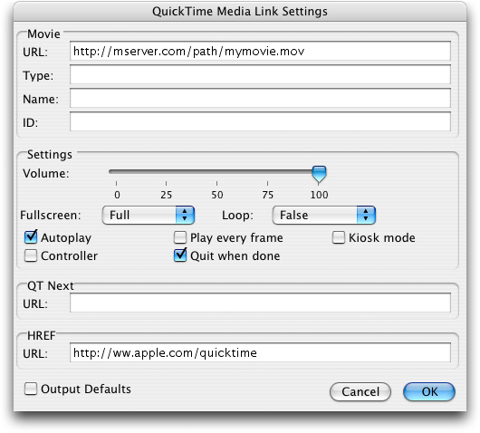

> 导航：[总目录](../../../README.md) · [documentation](../../../_indexes/documentation.md) · [HTML Scripting Guide for QuickTime](Introduction.md)


[Next](Document%20Revision%20History.md)[Previous](Introduction.md)

# HTML Scripting

You can use HTML to communicate with the QuickTime browser plug-in or ActiveX control when displaying QuickTime-compatible content in a browser. This allows you to control many aspects of QuickTime behavior, such as image scaling, audio volume, autoplay, looping, linking a series of movies, launching QuickTime Player, and opening a specified URL when the user clicks the movie.

The HTML5 `<audio>` and `<video>` elements can also be used to play a great deal of QuickTime content. These elements accept a smaller set of control attributes and do not invoke the QuickTime plug-in, or any plug-in at all. Safari uses QuickTime as its native display engine for audio and video, but other browsers use other engines.

If you choose to use QuickTime in other browsers, or you need to use QuickTime-specific attributes, your HTML must cause a browser to load the QuickTime plug-in or ActiveX control. This typically involves using either the `<EMBED>` tag, the `<OBJECT>` tag, or both tags together. Using the `<EMBED>` and `<OBJECT>` tags also allows you to use QuickTime to display multimedia that may not be QuickTime-specific, such as MP3 or MPEG-4, and control playback using QuickTime-specific attributes.

Apple provides a utility JavaScript file that you can include in your webpages. This script contains functions you can call to automatically generate the correct tags at run time.

The main method for controlling QuickTime from HTML is the use of attributes within the `<EMBED>` and `<OBJECT>` tags. More than 30 attributes are recognized specifically by QuickTime.

Attributes can be combined in thousands of ways; some particularly useful examples are included in the section [Applications and Examples](#apple-f4xwc4dqnrsv64tfmyxwi33df52wszbpkridimbqgaytkmrvfuzc2qlqobwgsy3boruw63ttmfxgirlymfwxa3dfom).

Standards for the Web are continuously evolving, and standards for Internet multimedia in particular are a work in progress. We are currently in a transition period, changing from one set of best practices to another, and you may need to choose among different techniques depending on your situation.

The `<EMBED>` tag is one of the oldest surviving elements for specifying multimedia. It is not a W3C standard. It has a number of defects, but is still universally supported by browsers and yields predictable results.

The `<OBJECT>` tag is a W3C standard. The `<OBJECT>` tag is widely regarded as having defects as well, but is also universally supported, with a few significant differences in implementation—Internet Explorer uses a `Classid` attribute that can cause other browsers to reject the syntax that Explorer requires.

The HTML5 `<audio>` and `<video>` elements are the preferred method for including audio or video in a Webpage, but these elements are not yet universally supported, and there are still unresolved codec issues at this writing. Some browsers will not play any media using these tags, and not all browsers currently support the same set of codecs.

At the time this document was originally written, the best results could be obtained by using a combination of the `<OBJECT>` element with a nested `<EMBED>` tag to handle the differences in implementation of the `<OBJECT>` tag. This remains a viable approach, but we are currently in transition towards greater standardization, and look forward to a time when your HTML can include a `<video>` element as simply and reliably as you use an `` element today.

That time is not quite yet, however.

Consequently, all three methodologies are described in this document: `<EMBED>`, `<OBJECT>` and `<EMBED>` together, and `<video>` or `<audio>`.

In support of the goal of simplifying and standardizing the delivery of Internet-based media, QuickTime Player X and later have removed support for some non-standard media types, such as sprite media.

The easiest way to embed movies in a webpage is to use the Apple-provided JavaScript utility to generate the required tags. This has four main advantages over typing the tags manually:

- It requires much less code.
- It works seamlessly with Internet Explorer for Windows, versions 6 and later.
- It allows your HTML to pass verification testing.
- The script is maintained and updated by Apple engineers, so your HTML may not need to be modified when browser updates require changes.

Download the JavaScript file, `ac_quicktime.js`, from sample code project _[HTML Video Example](../../../samplecode/HTML%20Video%20Example/HTML%20Video%20Example.md#apple-f4xwc4dqnrsv64tfmyxwi33df52wszbpirkfgnbqgaydonzsgm)_. Include it in your webpage by inserting the following line of code into your HTML head:

```
<script src="ac_quicktime.js" language="javascript"> </script>
```

Wherever you want QuickTime content to appear in your webpage, place a line of JavaScript that calls the function `QT_WriteOBJECT( )`, passing the URL of the QuickTime content, the width and height of the display area, the preferred ActiveX version (typically left blank) and any optional QuickTime attributes. A simple example follows.

```
<script language="javascript">
    QT_WriteOBJECT('MyMovie.mov' , '320', '240' , '');
</script>
```

At run time, this will generate the correct tags and insert them into your webpage. This example passes the URL `MyMovie.mov`, the filename of a QuickTime movie in the same directory as the webpage. The allocated width is 320 pixels, and the allocated height is 240 pixels. The ActiveX version is left blank, so it defaults to the most recent version.

Optional QuickTime attributes are passed as name/value pairs, that is, the name of the attribute is passed, followed by the value. An example follows.

```
<script language="javascript">
    QT_WriteOBJECT('../Movies/MyMovie.mov' , '100%', '95%', '', 'AUTOPLAY', 'True', 'SCALE', 'Aspect') ;
</script>
```

In this example, the URL is `../Movies/MyMovie.mov`, the allocated width is 100% of the browser window, the allocated height is 95% of the browser window, the ActiveX version is left blank, the AUTOPLAY attribute is set to True, and the SCALE attribute is set to Aspect. The movie will autoplay, scaled to fill almost the entire browser window, while preserving the movie’s aspect ratio.

In rare instances, you may want to pass different attributes to the `<OBJECT>` and `<EMBED>` tags, or pass a attribute to only the one of the tags. You can do this by prefacing the name of the attribute with `#obj` or `#emb`.

The following example passes different movies to the `<OBJECT>` and `<EMBED>` tags in the `QTNEXT` attribute. In this example, after MyMovie.mov plays, viewers whose browsers executed the `<OBJECT>` tag (typically users of Internet Explorer for Windows) will see IEUsers.mov, while all others will see AllOthers.mov

```
<script language="javascript">
    QT_WriteOBJECT('MyMovie.mov' , '100%', '95%', '', '#objQTNEXT1', 'IEUsers.mov', '#embQTNEXT1', 'AllOthers.mov') ;
</script>
```

In addition to the `QT_WriteOBJECT` function, the JavaScript utility provides three other functions, which use the same input syntax as `QT_WriteOBJECT`.

`QT_GenerateOBJECTText` generates the same output as `QT_WriteOBJECT`, but instead of inserting it into your HTML, it returns the output as a text string, allowing you to inspect it or modify it.

`QT_WriteOBJECT_XHTML` generates and inserts the `OBJECT` and `EMBED` tags in your file using strict XHTML syntax, and should be used if you are embedding QuickTime in XHTML rather than HTML.

`QT_GenerateOBJECTText_XHTML` generates the same output as `QT_WriteOBJECT_XHTML`, but instead of inserting it into your XHTML, it returns it as a text string.

If you use the Apple-provided JavaScript file to embed content in your webpages, you can skip ahead to Summary of QuickTime Attributes and Attributes in Detail to learn what optional attributes are available, then read Applications and Examples for some real-world examples.

You should read the intervening sections of this document if you prefer to code your HTML by hand, or if you want to know more about what’s going on behind the scenes.

QuickTime includes plug-ins for browsers in various formats, including Netscape-style plug-ins, ActiveX controls, and Safari plug-ins. These plug-ins allow you to display QuickTime-compatible content in a browser window, or to launch the QuickTime Player application from a webpage. These plug-ins are installed automatically when QuickTime is installed.

In addition, Safari uses QuickTime as its native display engine for audio and video when not using a plug-in.

There are five tags that can be used to open QuickTime-compatible content in a browser window:

- `<A HREF=url > </A>` (direct download)
- `<EMBED>` `</EMBED>` (plug-in content embedded in a webpage)
- `<OBJECT``>``</OBJECT>` (plug-in content embedded in a webpage)
- `<AUDIO> </AUDIO>` (HTML5 audio embedded in a webpage)
- `<VIDEO> </VIDEO>` (HTML5 video embedded in a webpage)

While all of these tags work, they are not functionally equivalent. The differences are explained in the following sections, [Using the <A> Tag (Direct Download)](#apple-f4xwc4dqnrsv64tfmyxwi33df52wszbpkridimbqgaytkmrvfuzc2vltnfxgo5dimvwhiqlhorkgcz2enfzgky3uirxxo3tmn5qwi), [Using the HTML5 <audio> and <video> Tags](#apple-f4xwc4dqnrsv64tfmyxwi33df52wszbpkridimbqgaytkmrvfuzc2u2xgm4q), and [Using the <EMBED> and <OBJECT> Tags](#apple-f4xwc4dqnrsv64tfmyxwi33df52wszbpkridimbqgaytkmrvfuzc2vltnfxgo5dimvwhirknijcuiz3umfxgi3duj5beurkdkrtxivdbm5zq).

The easiest and most common way to tell a browser to load content is to link to a URL using the `<A>` tag, as shown in this example:

`<A` `HREF=url``>` `Link` `Text` `</A>`

When the user clicks on the link text, the browser loads the specified URL.

Equivalent ways to directly open content in a browser include using JavaScript to open or replace a window (passing the URL of the content as the `SRC` parameter for the window), or opening a frameset and passing the URL of the content as the `SRC` parameter for a frame.

All of these methods specify the URL of the content and tell the browser to open the file in a window or frame, leaving the manner of display entirely to the browser. This is fine when the content is an HTML page, but problematic for multimedia content such as QuickTime movies.

If the URL points to something the browser can display, such as a JPEG or another HTML page, the browser loads and displays it. If the URL points to something the browser needs help to display, such as a QuickTime movie, MP3 audio, or MPEG-4 video file, the browser checks a list of plug-ins or applications that are registered for that type of file; if it finds a plug-in, it loads the plug-in and passes either the file or the URL; if it finds only an application, it may launch the application and pass it the file, ask the user for permission to do so, or simply download the file to disk for the user to open later, depending on the browser type and user settings.

There are several reasons why you should _not_ use the `<A>` tag, JavaScript, or a frameset to link directly to the URL of QuickTime content:

1. You cannot specify what plug-in or application should be used. If more than one plug-in is registered for the specified file type, you cannot predict or control which is loaded.
2. If QuickTime is not installed, the user is not prompted to download it. The browser simply reports that it cannot display file _X_ because it is an unsupported type.
3. The `<A>` tag does not allow you to pass attributes to a plug-in, so you cannot control QuickTime using this tag, even if the browser chooses to display the content using QuickTime.
4. Many browsers download the entire file specified by the URL before invoking a plug-in, which prevents the movie from playing as it downloads (known as Fast Start or progressive download).
5. The `<A>` tag loads the specified URL in its own window or frame; you cannot surround the displayed media with text or images in the same window or frame.

We recommend that you _do_ _not_ use the `<A>` tag to play QuickTime content. Use the `<EMBED>` and `<OBJECT>` tags instead. If you chose to use the `<A>` tag to display QuickTime content, follow these guidelines for best results:

1. Use only QuickTime-specific media files, such as QuickTime movies (.mov) or QuickTime image files (.qtif). Other media types are less likely to be registered exclusively by QuickTime.

   If you wish to use QuickTime to play other file types, such as MP3 audio (.mp3) or MPEG-4 video (.mp4), open the files in QuickTime Player Pro or some other QuickTime editor and save them as QuickTime movie files, then link to the movie files.
2. Always save QuickTime movies with the `.mov` file extension.
3. Be sure that your web server is configured with the `.mov` file extension corresponding the MIME type `video/quicktime.`
4. Include a notice on your webpage that QuickTime is needed to view the specified content; include a link to the QuickTime download site (`www.apple.com/quicktime/download/`), and inform your viewers that it is a free download.

   For a free “Get QuickTime -- Free Download” GIF and usage guidelines, see [www.apple.com/about/webbadges/](http://www.apple.com/about/webbadges/).

__Figure 1-1__  Get QuickTime


Using the HTML5 `<audio>` and `<video>` tags is the preferred way to include audio or video in a Webpage. Since these elements cause media to be displayed using the browser’s native display engine, they do not invoke a plug-in. These elements are not yet universally supported, however. In addition, while Safari uses the QuickTime engine for display, other browsers do not. Consequently, even browsers that support the `<audio>` and `<video>` elements may not support some QuickTime media.

Before using the `<audio>` or `<video>` elements to include media in a Webpage, do the following:

- Make sure that all browsers you plan to support have implemented the HTML5 `<audio>` and `<video>` elements. If they have not, include separate code for the non-compliant browsers.
- Make sure your audio and video use only broadly supported media and codecs so they will play properly in all browsers, whether or not QuickTime is used. Currently this means video media using the H.264 codec and audio media using the AAC/HE-AAC codec. Do not include sprites, VR, or other media.
- Make sure you do not rely on QuickTime plug-in attributes. Use only the supported `<audio>` and `<video>` attributes.

Safari supports the `src`, `autobuffer`, `autoplay`, and `controls` attributes for the `<audio>` and `<video>` tags, as well as the `height`, `width`, and `loop` attributes for video.

__Example:__

```
<video src="MyMPEG4Movie.mp4" height="320" width="240">
   Your browser does not support the HTML5 video element
</video>
```

The example above plays an MPEG-4 movie using the browser’s native display engine or shows an error message. Instead of an error message, you might insert an `<OBJECT>` tag for use by a browser that doesn’t support the `<video>` tag, as shown in the following example.

__Example 2:__

```
<video src="MyMPEG4Movie.mp4" height="320" width="240">

   <OBJECT CLASSID="clsid:02BF25D5-8C17-4B23-BC80-D3488ABDDC6B"
   CODEBASE="http://www.apple.com/qtactivex/qtplugin.cab"
   HEIGHT="320"
   WIDTH="240"
   >

   <PARAM NAME="src" VALUE="MyMPEG4Movie.mp4" >

   </OBJECT>

</video>
```


Although the preferred method for including audio or video is use of the HTML5 `<audio>` and `<video>` elements, you may prefer to use other techniques, either because they are more universally supported or because your media requires QuickTime for reliable playback.

The best way to get a browser to load the QuickTime plug-in and pass attributes to it is to use the Apple-provided JavaScript (see [Doing It the Easy Way](#apple-f4xwc4dqnrsv64tfmyxwi33df52wszbpkridimbqgaytkmrvfuzc2u2xge)).

If you choose to code the HTML yourself, the best cross-browser method is to use a combination of the `<EMBED>` tag and the `<OBJECT>` tag. By using both tags, you can write HTML that is optimized for all browsers and provides the most consistent user experience on Windows and the Mac OS, whether using Internet Explorer, FireFox, Safari, AOL, or other browsers.

You can use either the `<EMBED>` tag or the `<OBJECT>` tag alone, but Internet Explorer for Windows behaves differently from other browsers in both cases, so the user experience will be inconsistent, depending on the browser and operating system.

Using both tags allows you to specify the URL of the media file to play, the file’s MIME type, the QuickTime ActiveX control for Windows, where to get QuickTime if it is not installed, and the area on the webpage to allot to the plug-in. This allows you to embed multimedia content anywhere in a page and to design the page accordingly.

This example shows the basic syntax for for embedding a QuickTime movie in a webpage:

```
<EMBED
SRC="MyMovie.mov"
HEIGHT=yy WIDTH=xx
TYPE="video/quicktime"
PLUGINSPAGE="http://www.apple.com/quicktime/download/"
/>
```

The `SRC` attribute is set to the movie’s URL. In the example above, the movie is in the same folder as the HTML page, so the relative URL is simply the filename of the movie.

`WIDTH` should be set to the movie width. For an audio movie with a control bar, `WIDTH` should be set to an aesthetically pleasing size for your webpage. A width of at least 150 pixels is recommended to allow the user to scrub through the movie by dragging the play head.

`HEIGHT` should be set to the movie height plus 16 pixels, assuming the movie control bar is displayed. An audio movie should have a height of 16, which is the height of the controller.

`TYPE` should be set to the QuickTime movie MIME type: `video/quicktime.`

`PLUGINSPAGE` should always be set to the download page for QuickTime: `http://www.apple.com/quicktime/download/.`

The preceding example should cause the browser to load the QuickTime plug-in, begin downloading the movie file, and pass the incoming data to QuickTime. If the `<EMBED>` tag contains additional attributes, their names and values are also passed to the QuickTime plug-in.

If the user’s computer does not have QuickTime installed, the browser should offer to get the necessary plug-in from Apple using the `PLUGINSPAGE` URL.

There is one notable exception to this standard behavior. Internet Explorer for Windows no longer supports the `PLUGINSPAGE` attribute for the `<EMBED>` tag. If the user does not have QuickTime installed, Internet Explorer for Windows will not offer to get it unless the `<OBJECT>` tag is used. If QuickTime is installed, however, the `<EMBED>` tag works consistently in all common browsers.

Here is the basic syntax for embedding a QuickTime movie in a webpage using the `<OBJECT>` tag, intended for use by Internet Explorer for Windows:

```
<OBJECT CLASSID="clsid:02BF25D5-8C17-4B23-BC80-D3488ABDDC6B"
CODEBASE="http://www.apple.com/qtactivex/qtplugin.cab"
HEIGHT=yy
WIDTH=xx
>

<PARAM NAME="src" VALUE="MyMovie.mov" >

</OBJECT>
```

`CLASSID` is set to the Microsoft-authorized ID for the QuickTime ActiveX control: `clsid:02BF25D5-8C17-4B23-BC80-D3488ABDDC6B.` This causes Internet Explorer to load the QuickTime ActiveX control if it is installed, regardless of the media file type.

`CODEBASE` is set the URL for the QuickTime ActiveX control: `http://www.apple.com/qtactivex/qtplugin.cab.` If QuickTime is not installed on the user’s system, Internet Explorer offers to download it from this address.

`WIDTH` should be set to the movie width. For an audio movie with a control bar, `WIDTH` should be set to an aesthetically pleasing size for your webpage. A width of at least 150 pixels is recommended to allow the user to scrub through the movie by dragging the play head.

`HEIGHT` should be set to the movie height plus 16 pixels, assuming the movie control bar is displayed. An audio movie should have a height of 16, which is the height of the controller.

The URL of the QuickTime movie is passed as the value of a `<PARAM>` element whose name is set to `src.` The example shows a relative URL to a movie file in the same folder as the surrounding webpage.

The preceding example should cause Internet Explorer for Windows to load the QuickTime AciveX control, begin downloading the movie file, and pass the incoming data to QuickTime. If the `<OBJECT>` tagset contains additional `<PARAM>` elements, their names and values are also passed to QuickTime.

Here is the basic syntax for embedding a QuickTime movie in a webpage by combining the `<EMBED>` and `<OBJECT>` tags. This is the recommended syntax for using QuickTime in a browser.

```
<OBJECT CLASSID="clsid:02BF25D5-8C17-4B23-BC80-D3488ABDDC6B"
CODEBASE="http://www.apple.com/qtactivex/qtplugin.cab"
HEIGHT=yy
WIDTH=xx
>

<PARAM NAME="src" VALUE="MyMovie.mov" >

<EMBED
SRC="MyMovie.mov"
HEIGHT=yy WIDTH=xx
TYPE="video/quicktime"
PLUGINSPAGE="http://www.apple.com/quicktime/download/"
/>

</OBJECT>
```

As you can see, the `<EMBED>` tag is simply nested inside the `<OBJECT>` tagset, after all `<PARAM>` elements and before the closing `</OBJECT>` tag.

The preceding HTML example causes Internet Explorer for Windows to load the QuickTime ActiveX control based on the value of `CLASSID`, or offer to download it from the URL specified in `CODEBASE` if the QuickTime ActiveX control is not already installed.

Browsers other than IE/Win ignore the `<OBJECT>` tag and its `<PARAM>` elements because they do not support the `CLASSID` or `CODEBASE` attributes; instead they interpret the `<EMBED>` tag within the `<OBJECT>` tagset. They load the QuickTime plug-in or ActiveX control based on the MIME type (`video/quicktime`) associated with the file extension (`.mov`) specified in the `SRC` attribute URL. If QuickTime is not installed, these browsers offer to download the QuickTime plug-in from the URL specified in the `PLUGINSPAGE` attribute.

All browsers use the `HEIGHT` and `WIDTH` attributes to reserve screen space for the movie and pass any other attributes to QuickTime.

Any additional attributes should be included in both the `<EMBED>` and `<OBJECT>` tags, using slightly different syntax. Parameters are passed in the `<EMBED>` tag using the syntax `ParamName="ParmValue"`. Parameters are passed in the `<OBJECT>` tagset as separate `<PARAM>` tags, using the syntax `<PARAM` `name="ParamName"` `value="ParamValue">`. For example:

```
<OBJECT CLASSID="clsid:02BF25D5-8C17-4B23-BC80-D3488ABDDC6B"
HEIGHT=yy
WIDTH=xx
CODEBASE="http://www.apple.com/qtactivex/qtplugin.cab"
>

<PARAM NAME="src" VALUE="MyMovie.mov" >
<PARAM NAME="autoplay" VALUE="true" >

<EMBED
HEIGHT=yy
WIDTH=xx
TYPE="video/quicktime"
PLUGINSPAGE="http://www.apple.com/quicktime/download/"
SRC="MyMovie.mov"
AUTOPLAY="true"
/>

</OBJECT>
```

This example sets the attribute named `AUTOPLAY` to the value `true` for both the `<EMBED>` tag and the `<OBJECT>` tagset.

Some versions of Internet Explorer for Windows do not display embedded QuickTime content immediately, but instead present the user with a dialog box similar to the one shown below.


After the user clicks OK, the QuickTime ActiveX control loads, and the media plays (if the AUTOPLAY attribute is set True) but the user must still press the spacebar or Enter key in order to interact with the movie controller.

It is possible to prevent this dialog box from appearing, and also possible to activate the QuckTime movie controller for interaction immediately, without requiring the user to first push a key. The simplest way to accomplish this is to use the Apple-provided JavaScript to generate the `<OBJECT>` and `<EMBED>` tags at runtime. See Doing It the Easy Way.

Alternatively, you can include a JavaScript file of your own that uses the document.write() function to generate the required `<OBJECT>` and `<EMBED>` tags. Note that it is strongly recommended that the JavaScript code reside in an external file, not as in-line JavaScript within the HTML page itself.

The previous section describes how to use the `<EMBED>` and `<OBJECT>` tags together so that the user’s browser loads the QuickTime plug-in or ActiveX control (or offers to download it if it is not already installed). Once this is accomplished, the browser passes any attributes specified in the `<EMBED>` or `<OBJECT>` to QuickTime from the HTML. These attributes allow you to control QuickTime using HTML.

There are over 30 attributes defined for controlling QuickTime, allowing you to specify details of how the movie should be presented, what to do after the movie completes, and how to respond to various types of user interaction. Table 1-1 lists the available attributes and summarizes their functions. A more detailed description of each attribute follows.

This section lists the attributes that can be used with the `<EMBED>` and `<OBJECT>` tags to control QuickTime. The following section describes each attribute in more detail.

__Table 1-1__  QuickTime <EMBED> and <OBJECT> attributes

| Attribute Name | Function | Legal Values |
| ALLOWEMBEDTAGOVERRIDES | Allow attribute values to be set more than once | True | False |
| AUTOHREF | Load the URL specified in `HREF` without waiting for a mouse click | True | False |
| AUTOPLAY | Start playing movie automatically, do not wait for user to press Play button | True | False | @HH:MM:SS:FF |
| BGCOLOR | Set background color for area alloted to QuickTime but not occupied by movie | #rrggbb | ColorName |
| CONTROLLER | Show or hide the movie controller bar | True | False |
| CORRECTION | Specify whether to perform full perspective correction in QTVR | None | Full |
| DONTFLATTENWHENSAVING | If saving is allowed, save with dependencies | True |
| ENABLEHREF (introduced in QuickTime 7.1.5) | Allow a QuickTime movie to issue URLs to the browser. | True | False |
| ENABLEJAVASCRIPT | Initialize JavaScript connections between HTML and plug-in | True | False |
| ENDTIME | Stop playing a movie at a specified point in the movie timeline | HH:MM:SS:FF |
| FOV | Sets the initial vertical field of view for a VR panorama | Degrees |
| GOTO | Play a movie from a numbered list specified in `QTNext` | ItemNumber |
| HOTSPOTn | Associate a URL with a QTVR hotspot | HotSpotNumber |
| HREF | Specify a URL to load when the user clicks on the movie | URL |
| KIOSKMODE | Do not include the Save option in the movie controller bar | True |
| LOOP | Make a movie loop or play alternately forward and backward | True | False | Palindrome |
| MOVIEID | Associate a number with a movie so it can be targeted by wired actions from another movie | IDNumber |
| MOVIENAME | Associate a name with a movie so it can be targeted by wired actions from another movie | MovieName |
| MOVIEQTLIST | Create a default XML-format `QTList` for a movie | XML-List |
| NODE | Set the initial node for a multinode QTVR scene | NodeNumber |
| PAN | Set the initial pan angle for a QTVR panorama | Degrees |
| PLAYEVERYFRAME | Do not drop frames if there is not enough real time to decompress and display them; mutes audio, may play slowly | True | False |
| POSTDOMEVENTS | Emit DOM events that can be listened for in JavaScript, such as when the plug-in is instantiated or when movie playback ends. See _JavaScript Scripting Guide for QuickTime_. | True |
| QTNEXT | Specify a numbered list of movies to play or a single URL to open | n="<url> T<target>" | GOTOn |
| QTSRC | Load a file or stream different from the one specified in the SRC attribute | URL |
| QTSRCCHOKESPEED | Limit outgoing bandwidth from server to specified bits per second | NumberOfBitsPerSecond |
| QTSRCDONTUSEBROWSER | Download movie using QuickTime's URL handler instead of using the browser | True |
| SAVEEMBEDTAGS | Preserve current attribute values when loading new movie instead of starting with defaults | True |
| SCALE | Scale movie to fit in a rectangle, adjust aspect ratio, or set a size scaling factor | ToFit | Aspect | n |
| SHOWLOGO | Show the QuickTime logo until media is available to display | True | False |
| STARTTIME | Begin playing at time offset into the movie | HH:MM:SS:FF |
| TARGET | Play movie in QuickTime Player, named frame, or replace current movie | quicktimeplayer | TargetFrameName | myself |
| TARGETCACHE | Store movie loaded using TARGET attribute in a cache | True |
| TILT | Set tilt angle for initial view in a QTVR movie | Degrees |
| URLSUBSTITUTE | Dynamically replace specified string in all QuickTime-generated URLs with another specified string | "<FindString>:<ReplaceWithString>" |
| VOLUME | Set audio volume level | 0 - 255 |
| WMODE | This has the effect of setting the background color to transparent. | transparent |

Legal values specified in italics are not literal values; they are a names that describe the range of legal values. For example, _n_ is any integer, _HH:MM:SS:FF_ is a time value in hours:minutes:seconds:frames (1/30 of a second), _Degrees_ is a value from 0 - 360, _URL_ is a valid URL, _SomeName_ is a string that names something, and _SomeNumber_ is a numeric value for something.

For parameters whose only legal value shown in the table is `True` , the parameter is boolean with a default value of `False.` You do not need to explicitly set these parameter values to `False;` they are set `False` by omission.

This section provides a detailed description of each of the parameters that can be used to control QuickTime from HTML, including syntax and usage. In all cases, syntax differs when the parameter is used within the `<EMBED>` tag and when it is used inside the `<OBJECT>` tagset.

Within the `<EMBED>` tag, the syntax for setting a parameter is _ParamName=”ParamValue”._ For example:

```
AutoPlay="true"
```

Inside the `<OBJECT>` tagset, the same parameter is set using a `<PARAM>` tag with syntax `<PARAM Name="ParamName"``Value="ParamValue"`. For example:

```
<PARAM Name="Autoplay" Value="true" >
```

Any number of parameters can be included in the `<EMBED>` tag. Each of these parameters becomes a separate `<PARAM>` tag when used inside the `<OBJECT>` tagset.

Normally a parameter is set using both the `<EMBED>` and the `<OBJECT>` tags to ensure that it is set properly for all browsers and operating systems. Listing 1-1 gives an example of HTML that sets the `AutoPlay` parameter `True` and the `Controller` parameter `False.`

__Listing 1-1__  Setting AutoPlay and Controller using both <EMBED> and <OBJECT> syntax

```
<OBJECT CLASSID="clsid:02BF25D5-8C17-4B23-BC80-D3488ABDDC6B"
CODEBASE="http://www.apple.com/qtactivex/qtplugin.cab"
HEIGHT=yy
WIDTH=xx
>

<PARAM NAME="src" VALUE="MyMovie.mov" >
<PARAM NAME="AutoPlay" VALUE="true" >
<PARAM NAME="Controller" VALUE="false" >

<EMBED SRC="MyMovie.mov"
HEIGHT=yy WIDTH=xx
TYPE="video/quicktime"
PLUGINSPAGE="http://www.apple.com/quicktime/download/"
AUTOPLAY="true"
CONTROLLER="false"
/>

</OBJECT>
```


A detailed description of each QuickTime HTML attribute follows.

_AllowEmbedTagOverrides_ = `True` | `False`

Allows attribute values to be set more than once. This attribute is set `False` by default. Use this attribute to set the value of another attribute temporarily, then reset it, or to set one value for versions of QuickTime prior to 5.01 and another value for newer versions of QuickTime. This is particularly useful for the `AutoPlay` attribute, which was a `Boolean` prior to QuickTime 5.01 and accepts a timecode for later versions. For example:

```
AutoPlay="true"
AllowEmbedTagOverrides="true"
AutoPlay="@00:00:03:00"
AllowEmbedTagOverrides="false"
```

_AutoHREF_ = `True` | `False` (default is `False`)

If `True,` causes any URL specified in the `HREF` attribute to load immediately, without waiting for a mouse click. See also: `HREF`

_AutoPlay_ = `True` | `False` | _”@HH:MM:SS:FF”_ (default is user-selected)

Starts the movie playing automatically if set to `True;` does not start the movie until the user presses the Play button if set to `False;` starts when the movie download reaches a specified point in the movie timeline if set to a timecode (starts at that point in the timeline immediately if the movie is on a local disk). If not set explicitly, defaults to user preferences.

The user can set movies to autoplay (or not) as part of his or her QuickTime preferences; the AutoPlay attribute overrides the user preferences for this movie.

The syntax for specifying a timecode is the ”@” character followed by _Hours:Minutes:Seconds:30ths_ of a second. For example, to set the movie to start playing at 1 minute, fifteen and 1/30th seconds into the movie timeline, your HTML looks like this:

```
AUTOPLAY = "@00:01:15:01"
```

or

```
<PARAM Name="AUTOPLAY" Value="@00:01:15:01" >
```

Note that the separator between seconds and 30ths of a second is a colon (`SS:FF`), not a decimal point (`SS.FF`). This differs from the timecode display in QuickTime Player’s Info window, which uses the decimal point instead.

Versions of QuickTime prior to 5.01 do not autoplay if a timecode is used. See also: `AllowEmbedTagOverrides.`

_BGCOLOR=__#rrggbb_ | _ColorName_

If the rectangle specified by `HEIGHT` and `WIDTH` is larger than the movie, this sets the background color for the exposed part of the rectangle. You can specify the color as a hexadecimal triplet of red, green, and blue values. QuickTime 4 and later also accept color names in place of some RGB values, as shown in the following table.

__Table 1-2__  Color names and values

| Color name | RGB value |
| BLACK | #000000 |
| GREEN | #008000 |
| SILVER | #COCOCO |
| LIME | #00FF00 |
| GRAY | #808080 |
| OLIVE | #808000 |
| WHITE | #FFFFFF |
| YELLOW | #FFFF00 |
| MAROON | #800000 |
| NAVY | #000080 |
| RED | #FF0000 |
| BLUE | #0000FF |
| PURPLE | #800080 |
| TEAL | #008080 |
| FUCHSIA | #FF00FF |
| AQUA | #00FFFF |

Some versions of QuickTime attempt to interpret color names they do not recognize as hexadecimal numbers, so “`ORANGE`,” for example, may be interpreted as `#00A00E`. To avoid this, use only the names listed in the preceding table. For all other colors, enter the hexadecimal RGB value directly.

_CONTROLLER_`True` | `False`

Include a controller with the movie (or not). Default is `True` unless the movie is a `.swf` (Flash animation) file or a VR movie (a panorama or object movie).

_CORRECTION_ = `"None"` | `"Full"` (VR only, default is `Full)`

Shows a VR panorama with no correction for warping (fastest) or provides full correction for horizontal and vertical warping.

_DONTFLATTENWHENSAVING_ = `True` (default is `False)`

If set to `True,` the plug-in does not make self-contained copies of data that is included by reference when saving a movie on the user’s system. This is useful only in certain special circumstances, and its effect varies depending on the movie’s internal characteristics and the user’s capabilities.

This attribute takes effect only when a movie is saved from the QuickTime plug-in or ActiveX control. This attribute has no effect if the movie is already flattened (saved normally and self-contained), or if the movie is authored to disallow saving, or if `KioskMode` has been set to `True,` or if the user does not have the ability to save movies (requires QuickTime Pro or equivalent).

If a movie depends on external files (using a path and filename data reference or a relative URL data reference), setting this attribute `True` prevents the user from easily saving a playable copy of the movie. If the movie contains absolute URL data references, the saved copy will be playable as long as the user has a network connection and the movie data remains on the server at the specified URL, but not otherwise.

If the movie is self-contained, but contains repeated references to the same internal sample data, setting `DontFlattenWhenSaving` to `True` prevents the file from expanding when saved (flattening the movie would create a unique copy of the sample data for each repeated reference).

_ENABLEHREF_ = `True` | `False` (default is `True)`

Some movies are capable of generating URLs (from an HREFTrack, VR hotspots, or wired sprite actions, for example). Setting `ENABLEHREF` to `False` will prevent the movie from issuing any URLs whatsoever.

The `ENABLEHREF` attribute was added in QuickTime 7.1.5. The following restrictions were placed on all QuickTime URLs at this time: URLs cannot cross local/remote zone boundaries. In other words, a local movie (file:// protocol) can invoke only local URLs, such as another local movie, and remote movies (http://, https://, or rtsp:// protocol) can invoke only remote URLs, such as another remote movie or a webpage. Furthermore, remote URLs are restricted to http://, https://, and rtsp:// protocols. Other protocols, such as javascript://, are prohibited.

Movies played in QuickTime 7.1.5 or later will not issue URLs that violate these restrictions, regardless of when the movies were authored.

_ENABLEJAVASCRIPT_ = `True` | `False` (default is `False)`

Enables communications between HTML and JavaScript for Netscape 4 browsers. (This can take several seconds, but only if the page is being viewed using a Netscape ver. 4.x browser.) This does not involve significant delays for other browsers, so it is enabled by default for all other browsers. If your HTML page contains JavaScript that communicates with a QuickTime movie, you should set `EnableJavaScript` to `True` for that movie, in the unlikely event that it might be viewed using Netscape 4.x..

_ENDTIME_ = "Time” (_Hours:Minutes:Seconds:Thirtieths)_

Causes the movie to stop playing at the specified point in the movie timeline. Furthermore, the user will not be able to play the movie beyond the specified point. See also: `STARTTIME`. Note that the separator between Seconds and Thirtieths is a colon, not a decimal point. Example:

```
ENDTIME = "00:01:15:01"
```

or

```
<PARAM Name="ENDTIME" Value="00:01:15:01" >
```

Notice also that, unlike the `AutoPlay` attribute, you do not precede the timecode with the `"@"` character when setting the `EndTime` attribute.

_FOV_ = `"Angle"` (VR only)

Sets the initial vertical field of view in degrees for a VR movie. The valid range for _Angle_ is dependent on the movie (you cannot set the vertical field of view taller than the natural field of view when the movie is zoomed all the way out). Example:

```
FOV="22.25"
```

or

```
<PARAM Name="FOV" Value="22.25" >
```

_GoTo__n_

Go to item _n_ of a list passed to the QTNext attribute. The original movie, specified in the `Src` or `QTSrc` attribute, is implicitly item `0`. For example, to play `MovieOne,` followed by `MovieTwo` and `MovieThree`, then repeat `MovieTwo` and `MovieThree` indefinitely, your HTML looks like this:

```
Src="MovieOne.mov"
QTNext1="MovieTwo.mov"
QTNext2="MovieThree.mov"
QTNext3=GoTo1
```

or

```
<PARAM Name="Src" Value="MovieOne.mov">
<PARAM Name="QTNext1" Value="MovieTwo.mov">
<PARAM Name="QTNext2" Value="MovieThree.mov">
<PARAM Name="QTNext3" Value="GoTo1">
```

Items in the list may be movies or other URLs.

See also: _QTNEXT._

_HOTSPOTn_ = _Url_ (VR only)

Links the specified VR hot spot to a URL. When the user clicks the hot spot, QuickTime passes the URL to the browser. This works only with “blob” hot spots, not “node” hot spots or hard-coded URL hot spots. The valid range for _n_ is the set of assigned hot spot values in the VR movie. A `TARGETn` attribute can be used in combination with `HOTSPOTn.` See `TARGET.`

_HREF_ = _Url_

Clicking in the display area of the movie loads the specified URL. The URL can be a webpage or a QuickTime movie (javascript:// URLs are no longer supported). You can use this in conjunction with the `TARGET` attribute to cause the URL to load in another frame or window, in the QuickTime plug-in itself, or in the QuickTime Player application.

To make the URL specified in the `HREF` attribute load when the movie loads, instead of when the user clicks the movie, set the `AutoHREF` attribute to `True.`

You can add QuickTime extensions to a URL, allowing you to pass additional information to QuickTime. To use a QuickTime URL extension, enclose the URL in angle brackets (`<URL>`) and surround the URL and all of its extensions in quotes (`"<URL>``T<target>``E<parameters>"`).

To specify a target as part of the URL, use the `T<target>` extension. For example, to specify an HREF that replaces the current movie with a new movie, using the `T<target>` extension, your HTML looks like this:

```
HREF="<MyNewMovie.mov> T<myself>"
```

or

```
<PARAM Name="href" Value="<MyNewMovie.mov> T<myself>" >
```

You can also use URL extensions to pass a complete set of parameters to be used with a new movie. This is useful when the movie that contains the HREF needs to be handled differently than the movie that will load when the HREF executes (for example, the movies may be scaled differently or one may need a controller while the other does not).

To pass new parameters for a movie specified in a URL, use the `E<parameters>` extension. For example, to cause QuickTime to replace a movie with a new movie that autoplays and loops with no controller, your HTML looks like this:

```
HREF="<MyNewMovie.mov> T<myself> E<autoplay=true loop=true controller=false>"
```

or

```
<PARAM
Name="href"
Value="<MyNewMovie.mov> T<myself> E<autoplay=true loop=true controller=false>"
>
```

See also: `TARGET`, `AutoHREF`.

_KIOSKMODE_ = `True` (Default is `False`)

If set `True,` the plug-in does not allow the user to save a copy of the movie. Settings for this parameter are local to the webpage; they do not affect the movie’s internal Disable Saving feature.

_LOOP_ = `True` | `False` | `Palindrome` (default is `False`)

If set `True,` the movie loops endlessly. If set to `Palindrome,` the movie loops back and forth, first playing forward, then backward.

_MOVIEID_ = `n`

Assigns an integer ID to the movie. Allows the movie to be targeted by wired actions from another movie. This is similar to `MOVIENAME`, but uses a number instead of a text string.

_MOVIENAME_ = `Name`

Assigns an name to the movie. Allows the movie to be targeted by wired actions from another movie. For example, one movie can act as a controller for another movie. This is similar to `MOVIEID`, but uses a name instead of a numerical ID.

_NODE_ = `n` (VR only)

Specifies the initial node for a multi-node VR scene.

_PAN_ = `Angle` (VR only)

Specifies the initial pan angle, in degrees, for a VR panorama.

_PLAYEVERYFRAME_ = `True | False` (default `False`)

If set `True`, QuickTime will render every frame of visual content, even if it is unable to do so while maintaining synchronization with other media or the movie timeline. Setting this attribute `True` mutes the audio.

_POSTDOMEVENTS_ = `True` (default `False`)

If set `True`, the QuickTime plug-n emits DOM events that can be listened for in JavaScript. DOM events are emitted when the plug-in is loaded and ready to interact with JavaScript, at various points in the movie download, when a movie starts or stops playing, and so on. For more information, see _JavaScript Scripting Guide for QuickTime_.

_QTNEXTn_ = `"URL"`

Specifies an ordered list of movies to play when the current movie completes, where `n` is an integer from 1-255 and `“URL”` is the URL of a movie to play.

_QTSRC_ = _Url_

Causes the plug-in to ignore the movie specified in the `SRC` parameter; instead QuickTime plays the file specified in `QTSRC`. This allows you to specify one file to cause the browser to load QuickTime, then tell QuickTime to play another file, even if the browser would not normally choose QuickTime for the file you want to play.

This is useful for playing media other than QuickTime movies, such as MP3 audio, MPEG-4 video, and SMIL files.

`QTSRC` is also useful for specifying `rtsp://` streams. Browsers typically choose a single application to handle all `rtsp://` URLs, regardless of the file type or MIME type. Setting the `SRC` parameter to the `http://` URL of a QuickTime movie, and setting `QTSRC` to the `rtsp://` URL, causes the browser to load QuickTime, then causes QuickTime to load the `rtsp://` URL.

Note that the browser may download the file specified in the `SRC` parameter, even though the plug-in ignores it. For this reason, you should always specify a small file in the `SRC` parameter when using `QTSRC`.

See also: [Playing Non-QuickTime Content in QuickTime](#apple-f4xwc4dqnrsv64tfmyxwi33df52wszbpkridimbqgaytkmrvfuzc2udmmf4ws3thjzxw4ulvnfrwwvdjnvsug33oorsw45djnzixk2ldnnkgs3lf), `QTSRCCHOKESPEED`.

_QTSRCCHOKESPEED_ = _NumberOfBitsPerSecond_ | `movierate`

Specifies the maximum HTTP or FTP bandwidth used to download a file specified in the `QTSRC` parameter. This limits server load and peak bandwidth usage when a movie is downloaded by viewers with fast Internet connections. Setting the special value `movierate` limits the bandwidth used for downloading to the actual bandwidth of the movie, without requiring you to specify a particular number.

For example, suppose your movie server has a T1 connection to the Internet. This is sufficient for up to 28 simultaneous outgoing movies playing at 56Kbits/second, regardless of the length of the movies. But a single user with his own T1 connection can take up all your outgoing bandwidth while downloading a single movie, for as long as it takes for the whole movie to download. By setting `QTSRCCHOKESPEED` to 56000, you limit the bandwidth used by any one viewer to 56000 bits per second.

`QTSRCChokeSpeed` is also useful for reserving bandwidth for RTP streaming when loading a movie over HTTP that contains both streaming and nonstreaming tracks. Any self-contained nonstreaming tracks are limited to the specified bandwidth, reserving the remaining bandwidth for the realtime streams.

This parameter affects only movies specified in the `QTSRC` parameter; files specified in the `SRC` parameter are generally downloaded by the browser outside of QuickTime’s control.

As of this writing (QuickTime 7), `QTSRCCHOKESPEED` limits the download speed of data only in self-contained movies. Any data contained in external files, including alternate or reference movies, is unaffected.

_QTSRCDONTUSEBROWSER_ = `True` (default is `False`)

If `True`, the URL specified in the `QTSRC` parameter is loaded using QuickTime’s internal methods, instead of using the browser to fetch the file. This prevents the browser from caching the file, which speeds access to local movies and can help prevent viewers from copying movies by dragging them from the browser’s cache.

As of this writing (QuickTime 7), `QTSRCDONTUSEBROWSER` affects download of only the actual movie specified in `QTSRC`. Any data contained in external files, including alternate or reference movies, may be loaded through the browser.

_SCALE_ = `ToFit` | `Aspect` | _n_ (default is 1)

Scales movie dimensions. `ToFit` scales the movie to fit the rectangle allocated in the `<EMBED>` tag; `Aspect` scales the movie to fill as much of the rectangle as possible while preserving the movie’s aspect ratio; _n_ scales the movie by a factor of _n._ For example, to play a movie at double its normal size, set `Scale` to 2; to play a movie at half size, set `Scale` to 0.5.

_SHOWLOGO_ = `True` | `False` (default is `True`)

Tells the plug-in to show the QuickTime logo while waiting for media to load, prior to there being enough media to display. If set false, the logo is not displayed.

_SAVEEMBEDTAGS_ = `True` | `False` (default is `False`)

Tells the plug-in to apply the current `<EMBED>` tag parameter values to a new movie. This causes a movie specified in an `HREF`, `HOTSPOT`, or `QTNEXT` parameter to be played using the current plug-in settings. This overrides any setting embedded in the specified movie by applications such as Plug-in Helper. If this parameter is set `False,` some current parameters may still be inherited, but most are reset to their defaults when the new movie loads.

_STARTTIME_ = _HH:MM:SS:FF__(Hours:Minutes:Seconds:Thirtieths)_

If set, causes the movie to start playing at the specified offset into the movie’s timeline. If the movie is being delivered over a network, it will not start until the movie file has downloaded to the specified start point. The user will not be able to play parts of the movie prior to this point in the timeline.

Note that the separator between seconds and thirtieths is a colon, not a decimal point. Note also that, unlike the `AUTOPLAY` parameter, `STARTTIME` does not use a ”@” character at the beginning of the timecode.

See also: _ENDTIME_

_TARGET[n]_ = _FrameName_ | `myself` | `quicktimeplayer`

Optional extension to the `HREF` and `HotSpot`_n_ parameters. Causes a URL to load in the named target.

If a frame name is specified, the browser loads the URL in the named frame. If no frame of that name exists, the browser may create a new window with that name and open the URL there. The browser may display the URL directly or choose a plug-in or helper application, depending on the file or MIME type of the URL and the browser settings.

If `TARGET` is set to `myself,` the URL replaces the current movie. The URL must specify something that QuickTime can play.

If `TARGET` is set to `quicktimeplayer,` the URL loads in the QuickTime Player application. The URL must specify something that QuickTime can play.

If you use `TARGET` with `HOTSPOT`, append the same value _n_ to `TARGET` that you used to identify the hot spot. For example:

```
HotSpot127="NorthSide.mov" Target127="myself"
HotSpot23="SouthSide.mov" Target23="myself"
Hotspot254="Description.html" Target254="TextFrame"
```

or

```
<PARAM Name="HotSpot127" Value="NorthSide.mov" >
<PARAM Name="Target127" Value="myself" >
<PARAM Name="HotSpot23" Value="SouthSide.mov" >
<PARAM Name="Target23" Value="myself" >
<PARAM Name="HotSpot254" Value="Description.html" >
<PARAM Name="Target254" Value="TextFrame" >
```

A target can also be specified as part of a URL, using the syntax `"<URL>``T<Target>"`. For example:

```
HREF="<Description.html> T<TextFrame>"
```

or

```
<PARAM Name="HREF" value="<Description.html> T<TextFrame>" >
```

Note that the syntax requirements are very strict when including the target as part of the URL. The URL itself must be surrounded by angle brackets, the target must be surrounded by angle brackets preceded by an uppercase `T` with no space, and the URL and target must be jointly surrounded by quotes.

See also: `HOTSPOT`, `HREF`, `TARGETCACHE`.

_TARGETCACHE_ = `True` | `False`

If set to `True,` a URL loaded using the `TARGET` parameter is stored in cache.

_TILT_ = _Angle_ (VR only)

Sets the initial vertical tilt angle, in degrees, for a VR movie. The valid range is dependent on the vertical field of view of the movie, but is typically –42.5 to +42.5 for a cylinder.

_URLSubstitute[n]_ = _”<FindString>:<ReplaceWithString>”_

Replaces every instance of _FindString_ with _ReplaceWithString_ inside any `HREF` tracks, sprite action URLs, or VR hotspot URLs. Both _FindString_ and _ReplaceWithString_ must be surrounded by angle brackets, the two must be separated by a colon, and they must be jointly surrounded by quotes. The optional value _n_ may be any integer from 1 to 999 and may be omitted if only one `URLSubstitute` parameter is specified. Use this parameter to repurpose QuickTime movies with embedded URLs without editing the movies. For example:

```
URLSubstitute1 = "<OldISP.com/users/MyHomePage/>:<MyDomain.com/>"
URLSubstitute2 = "<movies/>:<media/movies/>"
```

_VOLUME_ = _Percent_ (0–300)

Sets audio volume from 0 to 300% of the user’s system sound setting. Values greater than 100 may cause clipping and distortion.

_WMODE_ = transparent

Sets the background color to transparent. This allows visual media to be composited onto other visual elements of a website for apparently “windowless” display. This commonly results in disabling QuickTime’s ability to use hardware acceleration for video rendering and may significantly impact performance, so it should not be used without careful consideration.

This section describes some applications of HTML scripting for QuickTime and provides examples.

There are three ways to deliver QuickTime content through a browser: from a local disk, as a progressive download over a network, or as one or more real-time streams. There are advantages and considerations with each method.

Local disk delivery is simple and places very few limits on movie size or bandwidth. Not all QuickTime movies can be delivered by progressive download or as real-time streams, but any movie can generally be downloaded in some manner and played from a local disk.

The primary concern with delivering QuickTime content as a website on a disk is that browsers are typically optimized to work over networks, not with local content. Browsers typically cache incoming multimedia to disk and play it from disk. This works well over a network, but locally it can result in the browser copying a file from the local disk into a cache on the same disk and simultaneously trying to play the movie from the cache; the combined bandwidth demands on the disk may result in a long delay before the movie begins, as the browser may stall until the entire file has been copied into the cache. To prevent this, use the `QTSRC` parameter and the `QTSRCDontUseBrowser` parameter to tell QuickTime download the movie directly, bypassing the browser. Listing 1-2 shows how this is done.

__Listing 1-2__  Preventing unnecessary local caching by the browser

```
<OBJECT CLASSID="clsid:02BF25D5-8C17-4B23-BC80-D3488ABDDC6B"
CODEBASE="http://www.apple.com/qtactivex/qtplugin.cab"
HEIGHT=yy
WIDTH=xx
>

<PARAM NAME="SRC" VALUE="SmallMovie.mov" >
<PARAM NAME="QTSRC" VALUE="MyMovie.mov" >
<PARAM NAME="QTSRCDontUseBrowser" VALUE="True" >

<EMBED SRC="SmallMovie.mov"
QTSRC="MyMovie.mov"
QTSRCDontUseBrowser="True"
HEIGHT=yy WIDTH=xx
TYPE="video/quicktime"
PLUGINSPAGE="http://www.apple.com/quicktime/download/"
/>

</OBJECT>
-- or (the easy way) --
<script language="javascript">
QTWriteObject('SmallMovie.mov', 'xx', 'yy', '', 'QTSRC', 'MyMovie.mov', 'QTSRCDONTUSEBROWSER', 'True');
</script>
```

In the preceding example, a small movie file named `SmallMovie.mov` is used to entice the browser to load the QuickTime plug-in. This should be a very small movie file, such as would be created by opening a single-pixel GIF in QuickTime Player (Pro version) and saving as a self-contained movie. The actual movie to be played is passed in the `QTSRC` parameter, and QuickTime is told not to use the browser to obtain the movie by the `QTSRCDontUseBrowser` parameter.

Another problem with websites on a disk is absolute addressing of local URLs; this problem is not specific to QuickTime, but it is a common irritant. The absolute URL of a local file includes the disk name and possibly a drive letter that may not be knowable in advance. For example, a movie located on a CD might have an absolute URL of `File:///D:\Movies\MyMovie.mov` on one computer, but have a different drive letter, or no drive letter, when mounted on a different computer.

The usual answer is to use relative addressing. Relative addressing specifies the path from the document containing the link to the desired document. For example, if a movie in the Sites\Movies folder is referenced by a webpage in the Sites\HTML folder, the relative path would be `..\Movies\MyMovie.mov.`

In cases where a relative path is problematic, such as a URL that is used in a JavaScript included in multiple folders with different relative paths to the target file, root-relative addressing may be useful. This requires the HTML author to know the location of the target file relative to the root file of the disk, but this may be acceptable for use on a CD or DVD, for example. Root-relative addresses begin with the forward slash character (/). For example, the root-relative path to our example file might be `/Sites\Movies\MyMovie.mov.`

Progressive download, or fast start, is the easiest and often the best way to deliver QuickTime content over the Internet. The user experience is very similar to streaming video, but it is more robust and supports a richer set of media types.

To use progressive download, simply place a QuickTime movie on a web server, verify that the server’s MIME type table includes an entry for the `.mov` file extension set to `video/quicktime`, and embed the movie in a webpage using an `http://` URL, as shown in Listing 1-3.

__Listing 1-3__  Embedding a movie for progressive download from a web server

```

<OBJECT CLASSID="clsid:02BF25D5-8C17-4B23-BC80-D3488ABDDC6B"
CODEBASE="http://www.apple.com/qtactivex/qtplugin.cab"
HEIGHT=yy
WIDTH=xx
>

<PARAM NAME="src" VALUE="MyMovie.mov" >

<EMBED SRC="MyMovie.mov"
HEIGHT=yy WIDTH=xx
TYPE="video/quicktime"
PLUGINSPAGE="http://www.apple.com/quicktime/download/"
/>

</OBJECT>
-- or (the easy way) --
<script language="javascript">
QTWriteObject('MyMovie.mov', 'xx', 'yy', '');
</script>
```

The movie should play as it downloads over the network, provided the network bandwidth is greater than the movie data rate.

If the bandwidth is less than the movie data rate, the viewer sees the first frame of the movie and a progress bar indicating how much has downloaded and how much remains. The viewer can press the Play button at any time to play as much of the movie as has downloaded. This does not interrupt the download. If the `AutoPlay` parameter is set `True,` the movie will begin playing as soon as QuickTime calculates that the remaining data will arrive by the time it is needed. This allows you to deliver movies of arbitrary quality to viewers with any speed connection, albeit with delay in some cases.

For a movie to play as it downloads over a network (progressive download), the movie must be saved with the movie header information (also known as the Movie atom) at the beginning of the file, with the media data stored in order of presentation, either in separate files or interleaved in the movie file. This is the default manner in which QuickTime movies are stored, but you may encounter movies that are not stored this way.

Sometimes the movie header information is stored at the end of a file, in which case the entire file must download before the movie can begin playing. If you experience a long delay before a movie begins, this may be the problem. If you examine the file using a hex editor or a sophisticated text editor, you will see the string `'moov'` near the beginning of a properly formatted movie file. If the `'moov'` string is located near the end of the file, the movie will not fast start and cannot play as it downloads. In most cases, the solution is simply to open the movie in a QuickTime editor, such as QuickTime Player (Pro version), and save the movie as a self-contained file. This process defaults to save the movie header at the beginning of the file, followed by interleaved data.

Real-time streams deliver movies at a fixed data rate, so, for example, a one-minute movie streams across a network in the same one minute that it takes to play. Streaming allows you to transmit live data, such as the output of a camera and microphone, or simulated live data, such as a playlist of recordings, in real time. If you need to send live transmissions, streaming is the delivery method to use.

Streaming is designed to support multicasting, which allows you to send a single stream to multiple receivers simultaneously, much like a radio or television broadcast. The combination of live transmission and multicasting make streaming an ideal solution for efficient viewing by an audience over an IP network, as there is only a single copy of the stream on any part of the network, instead of a copy for each viewer.

Multicasting is not fully supported over the Internet at this time, but it is supported by most routers and can be enabled on most corporate or educational campuses.

A streaming movie arrives as a stream of time-stamped packets. After a packet is displayed, or if a packet is delayed in transit and arrives after it should be displayed, the packet is discarded. A local copy of the whole movie is not stored. This makes streaming movies inherently more difficult to copy than progressive-download movies and is one of the main reasons some people choose streaming instead of progressive download for pre-recorded movies.

The fixed data rate of real-time streams also makes for very predictable server load and bandwidth requirements.

QuickTime streaming supports audio, video, and text (including `HREF` tracks). Other media types, such as Flash, VR Panoramas, and animated sprites, must be delivered locally or by progressive download.

Streaming movies are requested using one protocol on one set of ports, and delivered using a different protocol on another set of ports. Streaming movies are specified using `RTSP://` (real time streaming protocol) URLs. Movies are delivered as one or more streams, typically using `RTP://` protocol, which in turn uses UDP datagram packets; however if the viewer is behind a firewall or NAT router that does not allow incoming traffic on the RTP ports, or does not allow incoming UDP traffic, the streams may be delivered using HTTP on port 80 instead.

If you are configuring a router that uses Network Address Translation, or NAT (sometimes called “masquerading”) and want to allow streaming content, open ports 6970-6999 to incoming RTP/UDP traffic, in response to outgoing RTSP requests on port 554.

Not all web servers can send realtime streams. A streaming server must be capable of handling RTSP requests and delivering standards-compliant RTP streams. Streaming server software and web server software can run simultaneously on a single computer, however. Streaming server software for OS X, as well as open source streaming server software for other operating systems, are available from Apple at [http://www.apple.com/quicktime/streamingserver/](http://www.apple.com/quicktime/streamingserver/).

For a movie to be transmitted as one or more real-time streams, the movie must have a data rate less than the available network bandwidth. If the user has a slower connection than the movie’s data rate, the movie breaks up or does not play. Use compression software to compress your movies to one or more desired bandwidths. Most compression software supports the creation of “reference movies,” playable QuickTime movies that detect the user’s connection speed and select the best streaming movie available from a set of movies compressed at different rates.

In addition, QuickTime movies must be “hinted” for streaming. The process of hinting creates a hint track for each media stream. The hint track is used by the streaming server to determine how to divide the movie data into packets. Most applications that create QuickTime movies can be configured to create movies with hint tracks as part of the compression process. You can also add hint tracks to an existing movie by opening the movie in a QuickTime editor such as QuickTime Player (Pro version) and exporting as a hinted QuickTime movie.

If you have the Mac OSX Server software, you can use QTSS Publisher to compress media for transmission over the Internet at a particular bandwidth, add hint tracks to your movies, generate playlists, upload files to your streaming server, and generate the necessary HTML to embed the movies in a web site, all automatically.

Adding hint tracks increases the file size of a movie somewhat, so movies with hint tracks should generally not be used for progressive download, although there is nothing that actually prevents this.

Once you have hinted a movie and uploaded it to a streaming server, you are ready to embed the movie in your webpage. Programs such as QTSS Publisher can generate the necessary HTML for you. If you need to generate or modify the HTML yourself, you should read the rest of this section.

Simply embedding the URL of a streaming movie in your webpage does not produce predictable results, because many browsers route all `RTSP://` URLs to whatever application has most recently registered as being able to handle `RTSP://` protocol. The user may have multiple applications or plug-ins registered for RTSP, and you cannot rely on QuickTime being the most recent to register.

The solution is to embed a small progressive-download movie; this causes the browser to load QuickTime, and you can then make QuickTime request the real-time streams. There are several variations on this technique:

- Create a reference movie—a small movie that detects the user’s connection speed and chooses an appropriate stream from a list of URLs. See [Reference Movies](#apple-f4xwc4dqnrsv64tfmyxwi33df52wszbpkridimbqgaytkmrvfuzc2utfmzsxezlomnsu233wnfsxg).
- Use any small movie in the `SRC` parameter and specify the streaming URL in the `QTSRC` parameter. See [QTSRC and ClassID](#apple-f4xwc4dqnrsv64tfmyxwi33df52wszbpkridimbqgaytkmrvfuzc2ukuknjegylomrbwyyltoneui).
- Embed a QuickTime Media Link—a small XML file that specifies the streaming URL—saved with the `.mov` file extension, so it appears to the web server and browser to be a QuickTime movie. See [QuickTime Media Links](#apple-f4xwc4dqnrsv64tfmyxwi33df52wszbpkridimbqgaytkmrvfuzc2ulvnfrwwvdjnvsu2zlenfquy2lonnzq).
- Create a text file that contains `RTSPtext` followed by an RTSP URL and save it with the `.mov` file extension, so it appears to the web server and browser to be a QuickTime movie, then embed this “movie” in your webpage. See [Text Hacks](#apple-f4xwc4dqnrsv64tfmyxwi33df52wszbpkridimbqgaytkmrvfuzc2vdfpb2eqyldnnzq).

A reference movie is a small QuickTime movie that contains a list of URLs and associated minimum requirements, typically a list of QuickTime movies compressed at different data rates and the minimum data rate required for each movie. When the user plays a reference movie, the reference movie checks the user’s system capabilities and loads the appropriate URL. It is possible to create reference movies that provide different content depending on the user’s Internet connection speed, screen bit-depth (number of colors available), CPU (Intel or non-Intel), and so on.

Most compression software has an option for creating a reference movie automatically when you choose to compress a QuickTime movie at multiple data rates.

There are also free utilities available for download on the Internet that can create reference movies, including MakeRefMovie (developer.apple.com/quicktime/quicktimeintro/tools/) and XMLtoRefMovie (www.hoddie.net).

Once you have a reference movie, embed it as you would a progressive-download movie:

__Listing 1-4__  Embedding a reference movie

```

<OBJECT CLASSID="clsid:02BF25D5-8C17-4B23-BC80-D3488ABDDC6B"
CODEBASE="http://www.apple.com/qtactivex/qtplugin.cab"
HEIGHT=yy
WIDTH=xx
>

<PARAM NAME="src" VALUE="RefMovie.mov" >

<EMBED SRC="RefMovie.mov"
HEIGHT=yy WIDTH=xx
TYPE="video/quicktime"
PLUGINSPAGE="http://www.apple.com/quicktime/download/"
/>

</OBJECT>
-- or (the easy way) --
<script language="javascript">
QTWriteObject('RefMovie.mov', 'xx', 'yy', '');
</script>
```

The reference movie seamlessly replaces itself with the movie that best matches the user’s computer. To the user, the experience of playing a reference movie is generally indistinguishable from playing the movie that the reference movie selects.

Because QuickTime loads any URL in the reference movie internally, without using the browser, you can safely reference RTSP URLs of streaming movies that you want to be played by QuickTime.

If any movies on the reference movie’s list have dissimilar pixel dimensions, be sure to allocate enough height and width to accomodate the largest movie, including any controller, and set the background color to best fill any unused portion of the allocated space (see `BGCOLOR`).

One of the most versatile techniques for scripting QuickTime in HTML is to use a poster movie. A poster movie is a small QuickTime movie, typically a still image, with an associated `HREF`. When the viewer clicks the poster movie, QuickTime loads the URL specified in the `HREF`. You can use this technique to achieve several tasks:

- Give the user warning before downloading a multi-megabyte movie.
- Allow the user to choose from a selection of movies without downloading them first.
- Launch the QuickTime Player application.
- Play a movie in full-screen mode (uses QuickTime Player).
- Load a webpage or other URL, optionally in a named frame or window.
- Play streaming content.
- Use QuickTime to play content that is not QuickTime-specific, such as MP3 audio or MPEG-4 video.

A poster movie is generally a still image, but it can also be a short clip (in which case it typically loops). A poster movie serves three main purposes: it causes the browser to load QuickTime, it reserves a space on the page for a movie to play, and it acts as a button that responds to the user.

You can turn almost any still image, such as a JPEG or GIF, into a QuickTime movie simply by opening the image in a QuickTime editor and saving as a self-contained movie. Alternatively, you can copy a single frame or a short clip from a QuickTime movie and save it as a self-contained movie. You can also copy a frame from a movie and paste it into an image editing program such as PhotoShop. This allows you to do things such as add text to the image (”Click here to launch the movie”). You can save the image in any format that QuickTime can import, then open the image in QuickTime and save as a self-contained movie.

If the poster movie is used to launch another movie that will display in the same space, the poster movie should be same size as the movie that will replace it (plus 16 pixels vertically, if the movie that replaces it will have a controller). So, for example, if you copy a frame from a movie and paste it into a graphics editor, you should normally add an 8-pixel stripe to the top and bottom of the poster before saving it.

Embedding a poster movie is essentially the same as embedding other QuickTime movies, with the following additions:

- A poster movie is displayed without a controller (`CONTROLLER="False"`).
- A poster movie has an HREF parameter, specifying its action (`HREF="URL"`).
- A poster movie has a TARGET parameter, specifying its target (`TARGET="Target"` or `T<target>`).
- If the poster movie is a short clip, rather than a still image, it needs to autoplay and usually to loop (`AutoPlay="True"``Loop="True"` or `Loop="Palindrome"`).

An example of the HTML for a poster movie is shown in Listing 1-5

__Listing 1-5__  Poster that turns into a movie

```

<OBJECT CLASSID="clsid:02BF25D5-8C17-4B23-BC80-D3488ABDDC6B"
CODEBASE="http://www.apple.com/qtactivex/qtplugin.cab"
HEIGHT=yy
WIDTH=xx
>

<PARAM NAME="src" VALUE="PosterMovie.mov" >
<PARAM NAME="CONTROLLER" VALUE="False" >
<PARAM NAME="AutoPlay" VALUE="True" >
<PARAM NAME="Loop" VALUE="True" >
<PARAM NAME="HREF" VALUE="URL" >
<PARAM NAME="TARGET" VALUE="myself" >

<EMBED SRC="PosterMovie.mov"
HEIGHT=yy WIDTH=xx
TYPE="video/quicktime"
PLUGINSPAGE="http://www.apple.com/quicktime/download/"
CONTROLLER="False"
AUTOPLAY="True"
LOOP="True"
HREF="URL"
TARGET="myself"
/>

</OBJECT>
-- or (the easy way) --
<script language="javascript">
QTWriteObject('PosterMovie.mov', 'xx', 'yy', '', 'CONTROLLER', 'False', 'AUTOPLAY', 'True', 'LOOP', 'True', 'HREF', 'Url', 'TARGET', 'Myself');
</script>
```

When embedding a poster using the target value `myself,` allocate the correct height and width for the largest movie that will play, including any controller.

You can embed multiple poster movies on a single page, each with a different `HREF` parameter value, to give the user a menu of larger movie files without loading any large files until the user requests one.

The `HREF` parameter associated with a poster movie determines what happens when the poster is clicked. The `HREF` parameter can be set either to a URL or a line of JavaScript.

When the `TARGET` parameter is set to `Myself,` the URL loads in the QuickTime plug-in, replacing the poster movie. When set to `QuickTimePlayer,` the URL loads in the QuickTime Player application.

If the `TARGET` parameter is set to `Myself` or `QuickTimePlayer,` QuickTime handles any URL passed in the `HREF` parameter directly.

To play RTSP streams or file types other than QuickTime movies (such as `.mp3`, `.mp4`, `.swf`, `.png`, or `.wav`), use a poster movie with the `TARGET` parameter set either to `Myself` or `QuickTimePlayer.` Because QuickTime handles the URL directly for these `TARGET` settings, the stream or file opens in QuickTime, regardless of the application or plug-in registered with the browser to handle that file type or protocol.

If the `TARGET` parameter is set to a frame or window name, or is not set, QuickTime passes the URL to the browser for resolution. In this case, the URL should always specify something the browser can display directly, such as a webpage.

If the `HREF` parameter contains a line of JavaScript, QuickTime passes it to the browser.

To load a QuickTime movie in a named frame or window, or in a new window created by JavaScript, create a small HTML page that embeds the movie directly and pass the URL of the page in the `HREF` tag. This indirection is necessary because the browser handles the URL in these cases, so the `<EMBED>` and `<OBJECT>` tags are required to assure that the browser uses QuickTime to display the movie.

You can cause the `HREF` parameter to execute when the poster movie is loaded, instead of waiting until a user clicks the movie, by setting the `AutoHREF` parameter to `True.`

To launch QuickTime Player from a webpage, embed a poster movie in the webpage with the URL of the content in the `HREF` parameter and the `TARGET` parameter set to `QuickTimePlayer.` For example:

```

<OBJECT CLASSID="clsid:02BF25D5-8C17-4B23-BC80-D3488ABDDC6B"
CODEBASE="http://www.apple.com/qtactivex/qtplugin.cab"
HEIGHT=yy
WIDTH=xx
>

<PARAM NAME="src" VALUE="PosterMovie.mov" >
<PARAM NAME="CONTROLLER" VALUE="False" >
<PARAM NAME="HREF" VALUE="URL" >
<PARAM NAME="TARGET" VALUE="QuickTimePlayer" >

<EMBED SRC="PosterMovie.mov"
HEIGHT=yy WIDTH=xx
TYPE="video/quicktime"
PLUGINSPAGE="http://www.apple.com/quicktime/download/"
CONTROLLER="False"
HREF="URL"
TARGET="QuickTimePlayer"
/>

</OBJECT>
-- or (the easy way) --
<script language="javascript">
QTWriteObject('PosterMovie.mov', 'xx', 'yy', '', 'CONTROLLER', 'False', 'HREF', 'Url', 'TARGET', 'QuickTimePlayer' );
</script>
```

The `HREF` parameter can point to anything that QuickTime can play—a QuickTime movie, a SMIL file, a Flash `.swf` file, an MP3 audio file or MPEG-4 video file, and so on.

You can pass parameters to the QuickTime Player application by creating a QuickTime Media Link, a small XML file that includes the movie’s URL and the parameters you wish to pass. This XML file is saved with the `.mov` file extension and its URL is passed in the `HREF` parameter (with the `TARGET` parameter set to `QuickTimePlayer).` For details, see [QuickTime Media Links](#apple-f4xwc4dqnrsv64tfmyxwi33df52wszbpkridimbqgaytkmrvfuzc2ulvnfrwwvdjnvsu2zlenfquy2lonnzq).

One of the main reasons for launching QuickTime Player from a webpage is to play a movie in full-screen mode. You can accomplish this in two different ways:

- Create a QuickTime Media Link file that specifies one of the full-screen modes.
- Create a movie with the full-screen attribute set internally, using an application such as LiveStage Pro, or Automator.

You can use QuickTime to play media that are not formatted as QuickTime movie files. There are several ways to do this, all having one thing in common: they get the browser to load QuickTime, then tell QuickTime what media to play.

Use the `<OBJECT>` tag, with the `ClassID` attribute, to get Internet Explorer for Windows to load QuickTime. Include the `<EMBED>` tag, with the `SRC` parameter set to a QuickTime movie file, to get other browsers to load QuickTime. Pass the URL of the media you want QuickTime to play in the `QTSRC` parameter. An example is shown in listing 1-6

__Listing 1-6__  Playing non-QuickTime media using ClassID and QTSRC

```

<OBJECT CLASSID="clsid:02BF25D5-8C17-4B23-BC80-D3488ABDDC6B"
CODEBASE="http://www.apple.com/qtactivex/qtplugin.cab"
HEIGHT=yy
WIDTH=xx
>

<PARAM NAME="src" VALUE="VerySmall.mov" >
<PARAM NAME="QTSRC" VALUE="My.mp4" >

<EMBED SRC="VerySmall.mov"
HEIGHT=yy WIDTH=xx
TYPE="video/quicktime"
PLUGINSPAGE="http://www.apple.com/quicktime/download/"
QTSRC="My.mp4"
/>

</OBJECT>
-- or (the easy way) --
<script language="javascript">
QTWriteObject('VerySmall.mov', 'xx', 'yy', '', 'QTSRC', 'My.mp4');
</script>
```

The movie whose URL is passed in the `SRC` parameter should be a very small file, but it should be a QuickTime movie. This file is used to cause the browser to load QuickTime; it is never displayed, but some browsers will download it, and the HTML will fail in some browsers if the file does not exist or is not a QuickTime movie.

The `QTSRC` parameter can specify any type of file or stream that QuickTime can play. QuickTime currently supports over 40 different media types and file formats transparently, including most common audio, video, and still image formats.

A QuickTime Media Link is a small XML text file that tells QuickTime what media to play. It can be saved with the file extension `.mov` and treated for all intents and purposes as a QuickTime movie. This allows you to use a text file that appears to the browser as a QuickTime movie.

The easiest way to create such a file is to export a movie from QuickTime Player (Pro version) choosing Movie to QuickTime Media Link. This brings up a panel similar to the one shown in Figure 1-2 below.

__Figure 1-2__  QuickTime Media Link export



The export creates a text file in XML format that QuickTime understands. You can also create this kind of file by hand. The syntax is shown in the following example:

```xml
<?xml version="1.0"?>
<?quicktime type="application/x-quicktime-media-link"?>

<embed
autoplay="true"
controller="false"
fullscreen="full"
href="http://www.apple.com/quicktime/"
quitwhendone="true"
src="http://myserver.com/path/My.mov"
/>
```

As you can see, the syntax is very similar to the `<EMBED>` tag syntax used in HTML. In addition to supporting many of the HTML parameters that the QuickTime plug-in understands, the XML file can specify a full-screen graphics mode and whether the QuickTime Player application should quit when the movie finishes. The following parameters and values are currently supported:

```
 autoplay - true | false
 controller - true | false
 fullscreen - normal | double | half | current | full
 href - url
 kioskmode - true | false
 loop - true | false | palindrome
 movieid - integer
 moviename - string
 playeveryframe - true | false
 qtnext - url
 quitwhendone - true | false
 src - url (required)
 type - mime type
 volume - 0 (mute) - 100 (max)
```

Note the following differences between XML and HTML versions of these parameters:

- The `qtnext` attribute only supports one URL (unlike the plugin).
- All specified attributes require values (`AutoPlay=True` is valid; `AutoPlay` alone is not).

You can embed the XML file in your webpage as you would any QuickTime movie, using the `<OBJECT>` and `<EMBED>` tags. You can also pass it to QuickTime Player using the `HREF` and `TARGET` parameters (`TARGET="QuickTimePlayer"`).

In addition to the preferred XML syntax described above, QuickTime supports a small assortment of text files that can masquerade as movies for the purposes of getting a browser to load QuickTime. The text files have an eight-character header, consisting of a four-character type followed by the four characters `text.` The header is case sensitive and must be typed exactly as shown. The header is followed by data of the type specified, such as an RTSP URL, a SMIL file, an SDP file, or a plain text file with optional QuickTime text descriptors.

In all cases, you create the text file by prepending the header string, followed by a space or carriage return, to a data file. You then change the file extension to `.mov` so web servers and browsers treat it as a QuickTime movie.

You can specify a streaming URL by creating a text file with the header `RTSPtext` followed by an RTSP URL. For example:

```
RTSPtext RTSP://Yourserver.com/StreamName
```

You can save a SMIL file with the `.mov` file extension, if you preface the file with the text `SMILtext.` For example:

```
SMILtext
<?xml version="1.0" encoding="ISO-8859-1" ?>
<!DOCTYPE smil PUBLIC "-//W3C//DTD SMIL 1.0//EN"
                      "http://www.w3c.org/TR/REC-smil/SMIL10.dtd">
<smil xmlns:qt="http://www.apple.com/quicktime/resources/smilextensions"
            qt:time-slider="true"
            qt:autoplay="true"
<head>
<layout>
<root-layout width="320" height="256" id="main" title="Movie Time"/>
<region top="0" left="0" width="320" height="256" id="video" fit="meet"/>
</layout>
</head>
<body>
<seq >
<video src="http://domain/path/filename" region="video" />
<video src="protocol://domain/path/filename" region="video" />
</seq>
</body>
</smil>
```

Note that there must be a space or a line break between `SMILtext` and the rest of the SMIL document.

You can save an SDP (session description protocol) file with the `.mov` file extension, if you preface it with the text `SDPtext`. Note that the first character of the four-character type is an ASCII blank (hex 20). For example:

```
 SDPtext
v=0
o=- 42945 9 IN IP4 0.0.0.0
s=Title of the Session
e=Session Contact <user@host.name>
t=0 0
a=type:broadcast
a=channel:Demo H.261 (Mbone)
a=tool:Broadcaster Software
a=cat:MBone/Others
m=video 57170 RTP/AVP 31 32 96
c=IN IP4 0.0.0.0/0
b=AS:2500
a=framerate:30
a=rtpmap:96 WBIH/90000
a=source:video 0.0.0.0 file 1 loop
m=audio 21116 RTP/AVP 0
c=IN IP4 0.0.0.0/0
b=AS:2500
a=source:audio 0.0.0.0 file 1 loop
```

You can pass a text file with the `.mov` file extension to QuickTime—optionally including QuickTime text descriptors—to be imported into a movie with a text track, by beginning the file with the text `TEXTtext` followed by a space or carriage return and the text or text plus descriptors. For example:

```
TEXTtext
{QTtext} {timeScale:30} {width:320} {height:240} {timeStamps:absolute} {language:1} {textEncoding:0}
{font:helvetica} {size:12} {plain} {justify:center} {dropShadow:off} {anti-alias:on}
{textColor: 65535, 65535, 65535} {backColor: 0, 0, 0}
[00:00:00.00]
{ScrollIn:on}
Produced by Fate
Directed by Chance
Special Effects by Accident
Any resemblance to actual people or events is beyond my ability.
[00:00:10.00]
```

[Next](Document%20Revision%20History.md)[Previous](Introduction.md)

