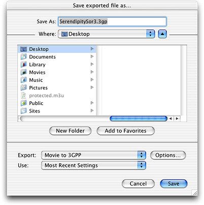
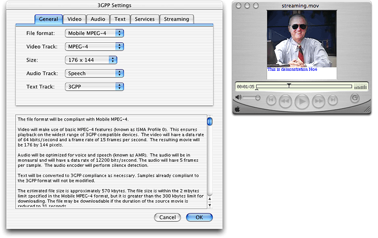
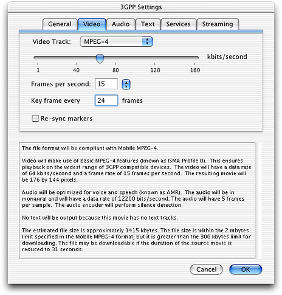
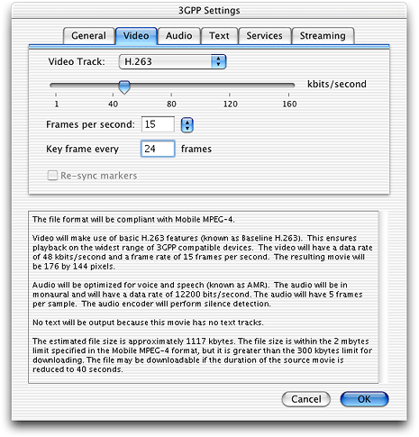
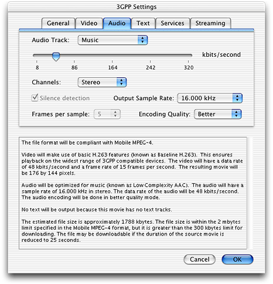
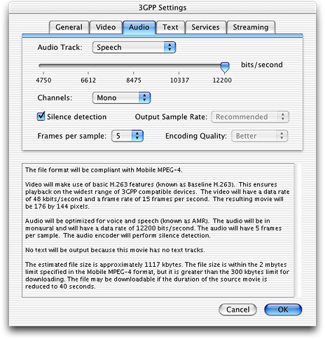
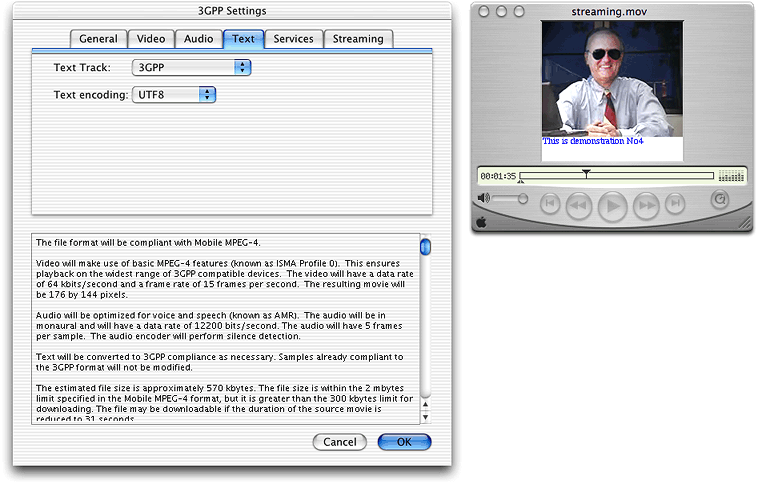
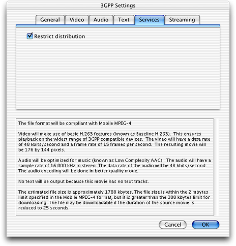

> 导航：[总目录](../../README.md) · [documentation](../../_indexes/documentation.md)


# What’s New in QuickTime 6.3 + 3GPP

Welcome to QuickTime 6.3 + 3GPP.

This document provides a list of the new features, changes, and enhanced capabilities that are available in QuickTime 6.3, including support for the 3rd Generation Partnership Project (3GPP). It also documents the changes in QuickTime 6.0.1, 6.0.2, 6.1, 6.1.1, and 6.2.

If you are a QuickTime API-level developer, content author, multimedia producer or Webmaster who is currently working with QuickTime, either on the Macintosh or Windows platform, you should read this document.

This document is intended to provide QuickTime developers with detailed information designed to support their programming and development efforts. It is designed to supplement the information provided in the QuickTime API Reference and the suite of QuickTime documentation available online, in both HTML and PDF formats.

Updates to the QuickTime technical documentation website are provided on a regular basis. Developers can also subscribe to various mailing lists for the latest news and information.

To sign up for any of Apple’s Developer Programs, refer to

```
http://developer.apple.com/membership/index.html
```

If you encounter any problems using QuickTime 6.3, please report them, using the standard Apple bug reporting mechanism described in the Release Notes accompanying the QuickTime 6.3 release. It is very important to include a copy of the file when you report such bugs.

As always, the standard way for Apple developers to determine which version of QuickTime is installed is by calling the Macintosh Toolbox `Gestalt` function. (This Mac OS function is also included in QuickTime for Windows.)

Listing 1-1 shows a code snippet that demonstrates how you can check the version of QuickTime that is installed––in this case, QuickTime 6.3. Note that the number 0x06308000 tests for the GM version of QuickTime 6.3 but fails on prerelease versions of QuickTime.

__Listing 1-1__  Determining which version of QuickTime is installed by calling the Gestalt function

```
{
    /* check the version of QuickTime installed */
    long version;
    OSErr result;
    result = Gestalt(gestaltQuickTime,&version);
    if ((result == noErr) && (version >= 0x06308000))
    {
        /* we have version 6.3! */
    }
}
```


QuickTime 6.3 is available as a standalone download for OS X and Windows. The download site is:

```
www.apple.com/quicktime/download/
```

The 3GPP component is available as a separate download. 3GPP support is provided as an add-on to the primary QuickTime package.

Macintosh users can also use Software Update in OS X to update to QuickTime 6.3 and to get the 3GPP component.

Windows users can open the QuickTime control panel, choose the Update Check panel, and click Update.

This software release updates QuickTime 6.0, 6.0.1, 6.0.2, 6.1, 6.1.1, or 6.2 to QuickTime 6.3.

For Macintosh:

- OS X v. 10.1.5; v. 10.2.3 or later
- PowerPC G3/400 MHz or higher
- At least 128 MB of RAM

For Windows:

- Windows 98, Me, 2000, XP
- Pentium or higher
- At least 128 MB of RAM

QuickTime 6.3 replaces and updates various point releases of QuickTime 6 for OS X and Windows.

Note that QuickTime 6.3 is a free upgrade for QuickTime 6 users. No new pro key is required; QuickTime 6 Pro keys are compatible with QuickTime 6.3.

QuickTime 6.3 + 3GPP comes shortly after the release of QuickTime 6.2. The QuickTime 6.2 was an OS X-only release, not for Windows, and required to provide:

- Foundation support for iTunes 4.
- An enhanced AAC audio encoder, which can be accessed by all tools via QuickTime APIs.

The QuickTime 6.2 update was required for users of iTunes 4, so that they could:

- Use music purchased from the iTunes Music Store in other applications.
- Within iTunes 4, import CDs into AAC, the new industry standard for high-quality digital audio.
- Get access as a QuickTime Pro user to an enhanced AAC encoder.

Table 1-1 summarizes the different point releases of QuickTime 6.

__Table 1-1__  QuickTime versions, platform support, and capsule feature summaries

| QuickTime version | OS X | WIN | Mac OS 9 | Notes |
| 6 | x | x | x | MPEG-4 and lots more. |
| 6.01 | x | x | x | Bug fix for QuickTime 6. Last version for all three platforms. |
| 6.03 |  |  | x | Bug fixes to address security issues. Mac OS 9 only. |
| 6.1 | x | x |  | Improved MPEG-4 video, full-screen modes, wired actions. |
| 6.2 | x |  |  | Support for iTunes 4, enhanced AAC codec, limited DRM. |
| 6.3 | x | x |  | Improved AAC codec, 3GPP support, which includes AMR codec. |

QuickTime 6.3 + 3GPP is a cross-platform release of QuickTime that is intended to provide support for Apple’s 3GPP partners, as well as for Apple’s applications software–– such as Keynote, iMovie, and iDVD.

The key features of QuickTime 6.3 fall into several functional areas, as described in this section.

QuickTime 6.3 specific features include:

- H.263 video support
- AAC audio support, with more control and bitrate options for encoding
- SD memory card support
- Support for 3GPP timed text, including Unicode text support
- MPEG-4 video codec enhancements with improvements to quality and performance

QuickTime 6.3 provides a number of key bug fixes for Apple’s Keynote, iMovie, and iDVD application software. In this release, the issues with correctness of audio/video synchronization of DV content are resolved for both iMovie and DVD. There are also significant performance enhancements for iMovie and Keynote.

For QuickTime OS X and Windows users, regular auto-detection for streaming transport is provided in this release. When the user clicks the Transport Setup... button in the Connection pane in System Preferences for QuickTime, a new dialog appears. A radio button, when selected, lets QuickTime automatically determine the best protocol and port ID.

This means that each time a QuickTime user fails to make a streaming connection, QuickTime will revert to another protocol, thus enabling users to find another network connection beyond the first one attempted. This improves QuickTime’s ability to connect users to important Apple streaming events, as well as eliminates the need for users to manually set the transport preferences.

Bug fixes reported against QuickTime 6.0, 6.0.1, 6.0.2, 6.1, 6.1.1, and 6.2 are also included in this release.

The primary goal of the QuickTime 6.3 + 3GPP update is to provide QuickTime support for 3GPP authoring, playback, and delivery.

This release enables end users to play and encode 3GPP-compatible files. Just as importantly, it also enables 3G wireless developers and QuickTime content authors to create 3GPP-compliant files. Content authors can use MPEG-4 video and MPEG-4 audio codecs to create these files.

Using iMovie, Final Cut Pro, QuickTime Pro, and any QuickTime-compatible application, end users and multimedia professionals alike can develop and personalize 3GPP content for distribution via 3G networks.

This release is part of Apple’s overall strategy to support and promote standards-based solutions in the marketplace––notably, with the addition of support for 3GPP authoring, playback, and delivery.

Toward that end, QuickTime 6.3 builds on Apple’s support of MPEG-4 as the standard for digital media streaming on the Internet and extends that with support for standards for mobile Internet streaming.

These standards for mobile digital media delivery are in place and have been defined as an extension of the MPEG-4 specification by the 3rd Generation Partnership Project (3GPP). For more information, refer to

```
http://www.3gpp.org
```


3GPP is a partnership project of a number of standards bodies, settting standards for third generation cellular telephony. These include standards for encoding, decoding, and transmitting digital video and audio to computers, cell phones, set-top boxes, and other devices, both wired and wireless, that are connected to the Internet.

Some of the standards are drawn from other organizations: MPEG-4 video, for example, from MPEG, and H.263 from the ITU. The file format used in 3GPP is from the same family as the MP4 file format. This family was based on the QuickTime file format.

The 3GPP standard is supported by a number of operators, including NTT DoCoMo, and manufacturers, including Nokia (for example, with the Nokia 3650) and Sony/Ericsson (for example, with the P800).

NTT DoCoMo, one of the largest cell phone providers in the world, has backed the 3GPP open standard and is already delivering 3GPP-compliant 3G cell phones to its more than 44 million subscribers in Japan. These phones enable users to view video clips, such as news and sports services.

The 3G-enabled handsets operate on a WCDMA/GSM (wideband code division multiple access/global system for mobile communications)-based network.

The phones have camera lenses that enable users to record short video clips and then email those video files to a computer or to another cell phone user.

DoCoMo has defined a set of constraints and extensions to ensure the quality of service and contents delivered through its network. QuickTime supports these constraints and extensions, specifically Mobile MP4.

DoCoMo extends the `.3gp` file format with a number of additions. Mobile MP4 adds:

- Author, Title, and Description user data atom types
- Restrictions on content
- Rules for establishing clip size

Using Apple’s Final Cut Pro, content developers and producers can create videos that can be viewed on DoCoMo’s cell phones.

Figure 1-1 illustrates how 3GPP files can move across the Internet via email or Bluetooth, Infra Red (IR), and USB connections to cell phones and computers. As shown in the diagram, Multimedia Messaging Service (MMS) is a standardized messaging service that allows users to send and receive messages, using a combination of text, audio, graphics, image, animation and video. Messages can be sent between mobile devices, as well as between devices and content servers.

__Figure 1-1__  3GPP files as they move from cell phone to computer on the Internet


The 3GPP Import/Export component adds support for the 3GPP (`.3gp`) file format to QuickTime as an extension to the MPEG4 (`.mp4`) file format support. It comes with an importer and exporter.

Note that QuickTime 6.3, with 3GPP support, will enable you to output both the current `.mov` format as well as the new `.3gp` file format.

The importer reads a `.3gp` file that contains video, audio, and/or text tracks and constructs a movie that can be played back in QuickTime.

The exporter will transcode video, audio, and text tracks in a movie as appropriate and write them out as a `.3gp` file. These components work in conjunction with the 3GPP timed text support and 3GPP exporter dialogs, as shown in the screen shots that follow in the next section.

DoCoMo defines three new user data atoms, in addition to the copyright atom defined in the MPEG-4 file format.

These new atoms have the same format as the MPEG-4 copyright atom. Each new atom type has a corresponding atom type in a QuickTime user data atom. The annotation text in each atom is in either UTF-8 or UTF-16. The language code is in ISO-639-2/T.

The mapping with QuickTime user data atom types is shown in [Table 1-2](#apple-f4xwc4dqnrsv64tfmyxwi33df52wszbpkridimbqgaydsmzyfvbuqmlhfuytkobvga3q).

__Table 1-2__  New user data atoms defined by DoCoMo

| Annotation | QuickTime | MP4 File Format | Mobile MP4 |
| Copyright | `©cpy` | `cprt` | `cprt` |
| Author | `©aut` | `N/A` | `auth` |
| Title | `©nam` | `N/A` | `titl` |
| Description | `©des` | `N/A` | `dscp` |

The 3GPP importer is based upon the MPEG-4 file importer. It reads in the movie resource and transforms the atoms to the ones that QuickTime processes.

On import from 3GPP, user data atoms of the above atom types in the source file are converted back to the QuickTime user data atom format. The language code is mapped into the Macintosh language code. The annotation text is converted into Macintosh encoding from Unicode.

The key differences from the MPEG-4 importer are as follows:

- In addition to the Copyright user data atom, the 3GPP importer handles Full Name, Author, and Description atoms. It also extends the annotation atom in order to support annotations from multiple languages.
- 3GPP handles AMR audio and H.263 video in addition to MPEG-4 video and AAC audio.

Some models of mobile phones have a capability of storing captured clips in an SD card, which is a type of compact memory card. In some cases, these clips are stored as SD video files, while in other cases, they are stored as 3GPP files.

The 3GPP importer recognizes an SD video file, with the file type `'sdv '` and the extension `.sdv`, as a 3GPP file. The 3GPP importer is also registered with the file type and aliased to the extension.

This allows you to open an `.sdv` file in QuickTime Player, which has a binding to the file type and extension. Thus, if you double-click such a file, it will launch QuickTime Player. The file will have the 3GPP file icon.

Like the 3GPP importer, the 3GPP exporter is based on the MPEG-4 file exporter. It works by modifying the atoms in the movie resource to conform to the 3GPP file format, and then writes them out, along with the media data.

On export to 3GPP, annotation user data atoms of the above atom types in the source movie are converted into the 3GPP/MPEG4 atom format. The language code is mapped into the ISO-639-2/T language code. The annotation text is converted into UTF-8.

The key differences from the MPEG-4 exporter are as follows:

- The 3GPP exporter adds an appropriate `ftyp` atom to specify the file format variation, based on the export dialog or setting.
- The exporter transcodes a text track to a 3GPP timed text track.
- The exporter converts Full Name, Author, and Description user data atoms to 3GPP format. The exporter can also extend the annotation atom handling to support multi-lingual annotation atoms.
- Support AMR for audio export is provided.
- The exporter adds the DoCoMo DRM atom that controls the redistribution of media beyond the receiving mobile terminal.
- The exporter configures the MPEG-4 codec to specify the Level 0 video profile necessary for 3GPP compliance.

The exporter works locally in the following steps:

1. It uses the exporter dialog to get the export settings 3GPP exporter dialog.
2. It uses the text transcoder to convert text samples to the tx3g samples.
3. It calls the appropriate audio and video codecs (for example, AMR and MPEG-4 video) to compress media data for the output `.3gp` file.

In QuickTime, the importer and exporter are accessible through the import/export command of QuickTime Player. The importer and exporter both rely on Toolbox and other QuickTime services. Externally, the import/export functionality is accessible through the standard movie import/export API available to any QuickTime application.

QuickTime 6.3 includes a number of new dialogs that allow QuickTime Pro users to export content to 3GPP, as discussed in this section.

The new Export Movie to 3GPP dialog, which allows you to save an exported file with the `.3gp` extension, is shown in Figure 1-2.

__Figure 1-2__  The new Export Movie to 3GPP dialog in QuickTime 6.3



Figure 1-3 shows the new 3GPP Settings dialog with the General pane selected, along with an outputted movie. The File format option shows Mobile MPEG-4 as selected in Figure 1-3. You would choose this option if you are generating content for an NTT DoCoMo mobile device. There are two other choices:

- 3GPP 5.1, which allows timed text tracks
- 3GPP 4.2, which allows audio and video only

The Video Track options are MPEG-4 (as shown in Figure 1-3) or H.263 and Pass Thru. Note that the video in the source movie is copied to its destination only if the source movie is encoded in MPEG-4 video or H.263.

For Mobile MPEG-4, the Size must be either 176 x 144 (as shown in Figure 1-3) or 128 x 96. If not, you can specify Current as the third Size option.

If the settings that you have selected are invalid, a warning appears at the bottom of the dialog and a more detailed explanation is given in the lower pane.

__Figure 1-3__  The new 3GPP Settings dialog in QuickTime 6.3 with the General pane selected, along with an outputted movie with a text track displayed



Figure 1-4 shows the Video pane selected in the 3GPP Settings dialog. Note that with Mobile MPEG-4 the range of video data should be less than 64 kbit/s.

__Figure 1-4__  The new 3GPP Settings dialog in QuickTime 6.3 with Video pane selected and MPEG-4 specified as the Video Track



If the Video Track selected is H.263, as shown in Figure 1-5, the same restrictions apply, that is, the data rate selected must be less than 64 kbit/s for Mobile MP4.

Note that support is provided in QuickTime 6.3 for H.263 Profile 0, Level 10 inside a .mp4 or .3gp file. It does not include short-headers, as defined by the MPEG-4 specification.

__Figure 1-5__  The new 3GPP Settings dialog in QuickTime 6.3 with the Video pane and the Video Track specified as H.263



Figure 1-6 shows the 3GPP Settings dialog with the Audio pane selected and the Audio Track specified as Music. If the file format is Mobile MPEG-4, the data rate has to be less than 80 kbit/s. With this setting, the audio data will be encoded in AAC.

A warning is issued if the data rate given for AAC audio with the Mobile MP4 file format is higher than 80 kbit/s, which is the maximum allowed.

__Figure 1-6__  The new 3GPP Settings dialog in QuickTime 6.3 with the Audio pane selected and the Audio Track specified as Music



In the 3GPP Settings dialog with the Audio pane selected and the Audio Track specified as Speech, shown in Figure 1-7, the data rate range can from 4.75 kbit/s to 12.2 kbit/s. With this setting, the audio data will be encoded in AMR.

Note that the Channel can only be Mono. If the Silence detection is checked, it means that the codec performs an optimization for silence, which is a feature of the AMR code supported in QuickTime 6.3.

__Figure 1-7__  The new 3GPP Settings dialog in QuickTime 6.3 with Audio pane selected and the Audio Track specified as Speech



Figure 1-8 shows the new 3GPP Settings dialog with the Text Track specified as 3GPP with Text encoding as UTF-8.

__Figure 1-8__  The new 3GPP Settings dialog in QuickTime 6.3 with the Text pane selected and the Text Track specified as 3GPP and Text encoding as UTF-8



Figure 1-9 shows the new 3GPP Settings dialog with the Services pane selected and the Restrict distribution checked.

When this is checked, it specifies that users on the receiving device are not allowed to copy the contents elsewhere. For some players or smaller devices, you will see a warning that says you cannot re-distribute the movie.

The option is available when targeting the Mobile MPEG-4 format for the NTT DoCoMo network.

__Figure 1-9__  The new 3GPP Settings dialog in QuickTime 6.3 with the Services pane selected and Restrict distribution checked



QuickTime 6.3 provides support for the Adaptive Multi-Rate (AMR) audio codec.

The AMR codec is a variable bit rate codec that operates at bit rates in the range of 4.75 kbit/s to 12.2 kbit/s for narrowband. It was standardized by the European Telecommunications Standards Institute (ETSI) in 1999.

QuickTime 6.3 also adds support for the `.amr` format, which is the standard format for files containing only AMR audio. QuickTime 6.3 doesn’t export this format but can import and play it.

Table 1-3 describes the characteristics of AMR.

__Table 1-3__  Characteristics of AMR Narrowband

| Features | AMR Narrowband |
| Date Standardized | 1999 |
| Bandwidth | 200-3400 Hz |
| Sampling Rate | 8000 Hz |
| Bit-rate (kb/s) audio samples | 4.75, 5.15, 5.9, _6.7\*_ ,_7.4\*_, 7.95, 10.2, _12.2\*_ |
| Type | ACELP |

Note that the bit rates followed by an asterisk (\*) in bold specify 2nd generation cellular standards, that is, European EFR GSM (12.2 kbits/s), North American EFR TDMA (7.4 kbits/s), and Japanese EFR PDC (6.7 kbits/s).

The AMR standard is a speech coding algorithm that operates, in its narrowband configuration, at variable bit rates in the range of 4.75 kbit/s to 12.2 kbit/s. Originally developed for the GSM System, the mobile telecommunication system used widely in Europe and Asia, it was later adopted by 3GPP as the mandatory codec for 3rd generation wireless systems that are based on the evolved GSM core network, such as WCDMA, EDGE, and GPRS.

The AMR codec can be contained in a QuickTime movie and a 3GPP file.

The format code of the AMR Narrowband codec data is `'samr'`, which matches the format code used within 3GPP files. Note that the sample description carried in a QuickTime movie is slightly different, but the `.3gp` importer and exporter take care of the description conversion.

The frames per sample setting basically groups together primitive AMR frames, in the range of 1 to 37 bytes, in the .3gp file format. This grouping makes the overhead of the movie smaller.

QuickTime 6.3 provides support for the AAC Low Complexity audio in 3GPP files that QuickTime imports and exports.

AAC is defined as part of the 3GPP specification as well as the Mobile MP4 specification from NTT DoCoMo. It is expected that DoCoMo will support AAC in its next generation mobile devices.

The 3GPP Specification (TS 26.234 Version 5.1.0) requires that the AAC Low Complexity decoder provides support for the sampling rates up to 48 KHz and a channel configuration of either monaural or stereo.

The Mobile MP4 also defines that the sampling rate is either 8KHz or 16KHz and the bit rate ranging from 8 kbits/s up to 80 kbits/s.

QuickTime 6.3 provides support for Sony’s Video Disk Unit (VDU). This importer allows QuickTime Player and other applications such as Final Cut Pro to import files that are available on the VDU.

The Sony VDU is an attachable FireWire disk recorder that uses a 40 GB hard disk drive as its recording media. The drive attaches directly to professional quality DVCAM camcorders through FireWire, and is capable of recording up to 3 hours of video/audio signals in parallel with tape recording.

The drive supports both camera and disk modes. In camera mode, it uses standard AVC protocols, while in disk mode it uses SBP-2. A user can record video directly onto the drive and then use it as a read-only FireWire drive to transfer the contents of a recorded video to a computer.

QuickTime 6.1 provides an extension to the AVI importer that allows users to import AVI files that are greater than 2 gigabytes (GB) in size.

In QuickTime 6.1, QuickTime Player provided a number of enhancements with regard to full-screen support. The following outlines the enhancements since QuickTime 6.0.2:

- Hardware scaling performed in full screen, when possible, instead of changing the monitor resolution. The result is a major speed increase moving in and out of full-screen mode.
- The play rate of the movie is respected before going into full-screen mode. If the movie is stopped before going full-screen, it will be stopped when QuickTime returns. If it is playing when full-screen mode is entered, QuickTime will keep playing when it returns (unless the movie has ended). This allows users to quickly toggle in and out of full-screen without disrupting playback.
- Speed improvements in full-screen.
- A hotkey is added in full-screen mode: command-control-F on the Macintosh and control-alt-F on Windows. This takes the user to the full-screen mode without a dialog.
- A new movie user data type (`'ptvs'`) is added. Content authors can add to a movie to request that QuickTime perform resolution switching on entering full-screen. Thus, if an author needs to override QuickTime’s hardware scaling, the author can still do it. QuickTime Player will respect the `'ptvs'` user data when entering full-screen.

Flags to two existing API calls, `BeginFullScreen` and `EndFullScreen`, were added in QuickTime 6.1.

Technote TN2068 discusses the changes made to these function calls, as well as the addition of the three new flags that can be used when initiating full-screen mode.

Technote TN2068 is available at

```
http://developer.apple.com/technotes/tn2002/tn2068.html
```

This call begins full-screen mode for a specified graphics device.

```
OSErr BeginFullScreen(Ptr  *restoreState,
                     GDHandle  whichGD,
                    short     *desiredWidth,
                    short     *desiredHeight,
                    WindowRef *newWindow,
                    RGBColor  *eraseColor,
                    long      flags);
```

This call ends full-screen mode for a graphics device.

```
OSErr EndFullScreen(Ptr  fullState,
                    long flags);
```


QuickTime 6.3 adds support for the 3GPP (`.3gp`) text sample format as an extension to the existing text track support. The 3GPP text sample format is very similar to the existing text sample format.

QuickTime extends the current media handler to recognize and convert on-the- fly sample descriptions that have a format type of `'tx3g'` and their associated samples.

The `'tx3g'` sample description includes a font table, default style, and background color that need to be converted.

In this sample, the following atoms are converted:

- `'styl'` ––style table
- `'hlit'`––highlight atom
- `'hclr'`––highlight color
- `'krok'`––karaoke
- `'blnk'`––a new atom with tx3g
- `'href'`––a new form of hypertext with tx3g

The text stored in tx3g samples is always Unicode, either UTF-8 or UTF-16.

A new XML importer and new XML exporter are introduced to support the new tx3g sample format. The format is closely aligned with the data format. The style information is formatted according to the w3c.org Cascading Style Sheet format.

Note that when exporting a text sample that does not have the default style information filled out (all zeros), the correct behavior is:

- `{font-size: 0}` // This value is whatever is in the data
- `{font-style: normal}` // 0 translates as normal
- `{font-weight: normal}` // 0 translates as normal
- `{color: 0%, 0%, 0%, 100%}` // 0 is converted to 0%

The media handler will determine the correct size to use at runtime based on the font family, language, and so on.

The following constants are supported in the timed text specification:

```
enum    {
    kTx3gSampleType             = 'tx3g',
    kTx3gFontTableAtomType      = 'ftab',
    kTx3gBlinkAtomType          = 'blnk'
};
```

In accordance with the 3GPP Specification for timed text, the following structs are supported:

```
struct Tx3gRGBAColor    {
    unsigned char   red;
    unsigned char   green;
    unsigned char   blue;
    unsigned char   transparency;
};

struct Tx3gStyleRecord  {
    unsigned short      startChar;
    unsigned short      endChar;
    unsigned short      fontID;
    unsigned char       fontFace;
    unsigned char       fontSize;
    Tx3gRGBAColor       fontColor;
};
typedef Tx3gStyleRecord *Tx3gStylePtr;
typedef Tx3gStylePtr *Tx3gStyleHandle;

struct Tx3gStyleTableRecord {
    unsigned short      count;
    Tx3gStyleRecord     table [kVariableLengthArray];
};
typedef Tx3gStyleTableRecord *Tx3gStyleTablePtr;
typedef Tx3gStyleTablePtr *Tx3gStyleTableHandle;

struct Tx3gFontRecord   {
    unsigned short      fontID;
    unsigned char       nameLength;
    unsigned char       name [kVariableLengthArray];
};
typedef Tx3gFontRecord *Tx3gFontRecordPtr;

struct Tx3gFontTableRecord  {
    unsigned short      entryCount;
    Tx3gFontRecord      fontEntries [kVariableLengthArray];
};
typedef Tx3gFontTableRecord *Tx3gFontTablePtr;
typedef Tx3gFontTablePtr *Tx3gFontTableHandle;
```

The following sample description is slightly different from the normal TextDescription, and follows the 3GPP Timed Text specification.

```
struct Tx3gDescription  {
    long                            descSize;
    long                            dataFormat;
    long                            resvd1;
    short                           resvd2;
    short                           dataRefIndex;

    unsigned long                   displayFlags;
    char                            horizontalJustification;
    char                            verticalJustification;
    Tx3gRGBAColor                   backgroundColor;
    Rect                            defaultTextBox;
    Tx3gStyleRecord                 defaultStyle;
};
typedef Tx3gDescription *Tx3gDescriptionPtr;
typedef Tx3gDescriptionPtr *Tx3gDescriptionHandle;
```


This section describes QuickTime TeXML, an XML-based format for constructing 3GPP-compliant timed text tracks in a QuickTime movie file.

This reflects the format supported by QuickTime 6.3.

To import an XML document in QuickTime TeXML to construct a movie, you follow these steps:

1. Create the XML document using a standard text editor.
2. Launch QuickTime Player and choose Import from the File menu. (Note that you can also just open an XML document in QuickTime Player via the Open menu item.)
3. Select the file that contains an XML fragment in QuickTime TeXML.

You can also generate an XML document from a 3GPP file or a QuickTime movie file that contains a text track. To do this, follow these steps:

1. Open such a file in QuickTime Player and choose Export from the File menu.
2. Choose Text to QuickTime TeXML as the export option.
3. Change the file name if necessary, and then click the Save button.

A document using this format must have the standard XML-processing instruction at the beginning, as follows:

```xml
<?xml version="1.0"?>
```

In addition, it must also have a processing instruction that tells QuickTime about the format, as follows:

```
<?quicktime type="application/x-quicktime-texml"?>
```


The Text Track Information specifies various parameters of the text track that you construct.

An XML document in this format must have the text3GTrack element as the root element. This element can have one or more sample elements. This element has the following attributes:

- `trackWidth` –– Required

  Specifies the width of the track as a fixed number. For example:

```
trackWidth="176.0"
```
- `trackHeight` –– Required

  Specifies the height of the track as a fixed number. For example:

```
trackHeight="40.0"
```
- `language` –– Required

  The human language of the text must be declared. The value is the three-character ISO 639-2/T language code. For example, if the language is English:

```
language="eng"
```

  If the language is Japanese:

```
language="jpn"
```
- `layer` –– Optional

  Specifies the layer of the track. Defaults to 0 (zero). The value is an integer. A smaller number means closer to the front.

```
layer="0"
```
- `timeScale` –– Optional

  Specifies the time scale of the track. Defaults to 600, which is the normal movie time scale. The value is an integer.

```
timescale="600"
```
- `transform` –– Optional

  Specifies the matrix of the track. Defaults to an identity matrix. The value is either one of the following forms:

  - `translate(x, y)` where `x` and `y` are integers
  - `matrix(1.0, 0.0, 0.0, 0.0, 1.0, 0.0, x, y, 1.0)` where `x` and `y` are fixed numbers.

```
transform="translate(0,100)"
<text3GTrack trackWidth="176.0" trackHeight="40.0"  language="eng"
      layer="0" timeScale="600" transform="translate(0,100)">
    . . .
</text3GTrack>
```


The sample information specifies a sample with various parameters. Each sample must have a sample declaration through the sample element. The sample declaration has a sample description section, as well as a sample-data section.

The sample element defines a sample, which can have one description element and one sampleData element.

This element has the following attributes:

- `duration` –– Required

The duration attribute must be present. The duration is an integer in time scale units. For example:

```
duration="600"
```

- `keyframe` –– Optional

The keyframe attribute specifies if this sample is a key frame. In the current implementation, a sample is always assumed to be a key frame.

```
keyframe="true"
```

For example:

```
<sample duration="600" keyframe="true">
    . . .
</sample>
```


The sample description specifies the parameters that go to the sample description. Each sample has a sample description section.

The sample description is given through the description element. This element must have a defaultTextBox element, a fontTable element, and a sharedStyles element.

The description element has the following attributes:

- `format` –– Required

The format must be declared through the format attribute. For 3GPP text tracks, the format must be tx3g.

```
format="tx3g"
```

- `displayFlags` –– Optional

  Specifies how text is rendered. Defaults to empty, meaning that no flags are set.

  The value of the attribute is a combination of the following words separated by ‘+’ (plus sign):

  - `scrollIn` and `scrollOut`

    The text scrolls into and out of the display region. The scroll delay is interpreted as the time before the scroll starts, if one of these is specified. It will be the time after the scroll in ends and the scroll out starts, if both of these are given.
  - `horizontal` or `vertical`

    Defines the orientation of scroll. Vertical is assumed if neither is specified.
  - `reverse`

    The scroll happens in the reverse direction. By default, the text scrolls in the direction of text rendering determined by the script system of the language.
  - `continuousKaraoke`

    Enables the Continuous Karaoke mode where the range of karaoke highlighting extends to include additional ranges rather than the highlighting moves onto the next range.
  - `writeTextVertically`

    Specifies the text to be rendered vertically. Not yet supported in QuickTime. However, the imported track has this information and will have the desired effect when exported into a .3gp file and played back on a player that is capable of vertical text rendering.

```
displayFlags="scrollIn+reverse"
```

- `horizontalJustification` –– Required

  Specifies the horizontal justification. The value is one of the following words: left, center, or right. For example:

```
horizontalJustification="left"
```

- `verticalJustification` –– Required

  Specifies the vertical justification. The value is one of the following words: top, center, or bottom. For example:

```
verticalJustification="top"
```

- `backgroundColor` –– Optional

  Specifies the background color in the text box for the sample. The value is a Cascading Style Sheet (CSS) style color specification with four component percentages (RGBA):

```
backgroundColor="100%, 100%, 100%, 100%"
<description format='tx3g' displayFlags="scrollIn+reverse"
         horizontalJustification="left" verticalJustification="top"
         backgroundcolor="100%, 100%, 100%, 100%">
    . . .
</description>
```


This element specifies the default text box to which the text is clipped. The element is required. It has the following attributes:

- `x` –– Optional

  Specifies the x coordinate value of the origin of the box. The value is an integer, and defaults to 0.

```
x="0"
```
- `y` –– Optional

  Specifies the y coordinate value of the origin of the box. The value is an integer, and defaults to 0.

```
y="0"
```
- `width` –– Optional

  Specifies the width of the box. The value is an integer, and defaults to 0.

```
width="176"
```
- `height` –– Optional

  Specifies the height of the box. The value is an integer, and defaults to 0.

```
height="40"
<defaultTextBox x="0" y="0" width="176"  height="40“/>
```


The fontTable element defines a set of fonts that are used in the sample. This element is required, and must contain at least one font element.

The font element specifies a font to be used in the sample. The actual font used when one of these names is used is terminal dependent. The element has the following attributes:

- `id` –– Required

  This attribute is required. The value is a number.
- `name` –– Required

  Specifies the name of the font. The value is a comma-separated list of font names, and may include one of the special names Serif, Sans-Serif, and Monospace.

```
<fontTable>
    <font id="1" name="Times"/>
</fontTable>
```


The styles used in the samples are declared in the sharedStyles element. This element is required. There must be at least one style element within the sharedStyles element.

The style element specifies a style to be used in the sample. The element has the following attributes:

- `id` –– Required

  This attribute is required. The value is a number.

  The value of the element is a modified form of the W3c.org Cascading Style Sheet (CSS) string. Each style is unique and not dependent on any other.

```
{font-table: 1}
```

This is the only modification on CSS. The value is the id of the font in the font table in sample description.

```
{font-size: 10}
{font-style:normal}
```

The value is either normal or italic.

```
{font-weight: normal}
```

The value is either normal or bold.

```
{text-decoration:normal}
```

The value is either normal or underline.

```
{color: 0%, 0%, 0%, 100%}
```

specifies the color component percentages in RGBA

```
{backgroundcolor: 100%, 100%, 100%, 100%}
<sharedStyles>
<style id="1">{font-table: 1} {font-size: 10} {font-style:normal}
    {font-weight: normal} {color: 0%, 0%, 0%, 100%}
    {text-decoration:underline}</style>
</sharedStyles>
```


The sample data includes text data and associated parameters. Each sample has a sample data section.

The sampleData element is required for each sample. This element can contain other elements that define the sample. The sampleData element can contain one or more of the following elements: text, highlight, blink, karaoke, and link.

This element has the following attributes:

- `scrollDelay` –– Optional

  Specifies the time before the scrolling starts in the time scale units of the track. The default value is 0. For example:

```
scrollDelay="200"
```
- `highlightColor` –– Optional

  Specifies the color of both static and dynamic (or karaoke) highlighting in this sample. If this attribute is not given, then inverse video is used for highlighting.

```
highlightColor="25%, 50%, 75%, 100%"
```
- `targetEncoding`

  Specifies the character encoding of the text stored in the sample. The value is either, utf8 or utf16.

```
targetEncoding="utf8"
<sampleData scrollDelay="200" highlightColor="25%,  50%, 75%, 100%"
        targetEncoding="utf8"
    . . .
</sampleData>
```


The text element specifies the text in the sample. This element is optional. The element has the following attributes:

- `styleID` –– Required

  Specifies the style to be used in this run of text. The value is the ID value of the style element whose style is to be applied to this text run.

```
styleID="1"
```

The value of the element is the text that is rendered as the sample is played. Whitespace, including line breaks and indentations, are preserved within this element.

A text element can also have one or more marker elements embedded in its character data content. The id value of such a marker element can be used as a value of the startMarker or endMarker attribute of the highlight, blink, karaoke, and link elements. A pair of marker elements specify the start and the end of text to which highlight, blink, or karaoke apply.

The marker element has the following attributes:

- `id` –– Required

  The value is a number.

```
<text styleID="1">This is an example
that spans two lines</text>
```

Embedded marker elements looks like this:

```
<text styleID="2"> This is part of
<marker id="m1"/> an example that spans <marker  id="m2"/> two lines</text>.
```


The highlight element specifies the highlighting on the text in the sample. This element is optional. It has the following attributes.

- `startMarker` –– Required

  Specifies the start of highlighting with a text marker. Required.

```
startMarker="1"
```

- `endMarker` –– Required

  Specifies the end of highlighting with a text marker.

```
endMarker="2"
<highlight startMarker="1" endMarker="2"/>
```


The blink element specifies the range of text that blinks. This element is optional. The default is no blinking. The element has the following attributes:

- `startMarker` –– Required

  Specifies the start of blinking with a text marker.

```
startMarker="1"
```
- `endMarker` –– Required

  Specifies the end of blinking with a text marker.

```
endMarker="2"
<blink startMarker="1" endMarker="2"/>
```


The karaoke element describes the dynamic highlighting, also known as Karaoke, in the current sample. This element is optional. The element must have one or more run elements as its child elements.

The run element defines a run of dynamic highlighting. It has the following attributes. The color for dynamic highlighting is determined by the value of the highlightColor attribute in the sampleData element.

- `duration` –– Required

  Specifies the duration of dynamic highlighting in the time scale of the track.

```
duration="40"
```
- `startMarker` –– Required

  Specifies the start of karoake with a text marker.

```
startMarker="1"
```
- `endMarker` –– Required

  Specifies the end of karoake with a text marker.

```
endMarker="3"
<karaoke startTime="0">
    <run duration="40 startMarker="1" endMarker="3"/>
</karaoke>
```


The link element represents a hypertext link embedded in the text. This element is optional. The element has the following attributes:

- `startMarker` –– Required

  Specifies the start of blinking with a text marker.

```
startMarker="1"
```
- `endMarker` –– Required

  Specifies the end of blinking with a text marker.

```
endMarker="2"
```
- `href` –– Optional

  Value is the URL string of the target of the hyper text link.

```
href=" http://www.somewhere.com"
```
- `altString` –– Optional

  The value is a string to be used for alternative display.

```
altString="buy some pub stuff today!"
<link startMarker="1" endMarker="2"
    href="http://www.somewhere.com"
    altString="buy some pub stuff today!"/>
```


The textBox element defines the text box for the sample. This overrides the box specified in the defaultTextBox element. This element is optional. If not present, the box specified in the defaultTextbox is assumed. It has the following attributes:

- `x` –– Optional

  Specifies the x coordinate value of the origin of the box. The value is an integer, and defaults to 0 .

```
x="20"
```
- `y` –– Optional

  Specifies the y coordinate value of the origin of the box. The value is an integer, and defaults to 0 .

```
y="20"
```
- `width` –– Optional

  Specifies the width of the box. The value is an integer, and defaults to 0 .

```
width="156"
```
- `height` –– Optional

  Specifies the height of the box. The value is an integer, and defaults to 0 .

```
height="20"
<textBox x="20", y="20", width="156",  height="20“/>
```


The following is an example of how you can construct a 3GPP timed text track that displays text, using two specific elements: highlight and blink. It also shows the usage of two other elements: karoake and link.

```xml
<?xml version="1.0"?>
<?quicktime type="application/x-quicktime-tx3g"?>

<text3GTrack trackWidth="176.0" trackHeight="60.0"  layer="0"
             language="eng" timeScale="600"
             transform="translate(0,100)">
    <sample duration="2400" keyframe="true">
        <description format="tx3g" displayFlags="ScrollIn"
                     horizontalJustification="Left"
                     verticalJustification="Top"
                     backgroundColor="0%, 0%, 0%, 100%">
            <defaultTextBox x="0" y="0" width="176"  height="60"/>
            <fontTable>
                <font id="1" name="Times"/>
            </fontTable>
            <sharedStyles>
                <style id="1">{font-table: 1} {font-size:  10}
                             {font-style:normal}
                              {font-weight: normal}
                             {color: 100%, 100%, 100%, 100%}</style>
            </sharedStyles>
        </description>
        <sampleData scrollDelay="200"
                          highlightColor="25%, 45%, 65%, 100%"
                          targetEncoding="utf8">
            <textBox x="10" y="10" width="156"  height="40"/>
            <text styleID="1">
This is a <marker id="1"/>simple<marker id="2"/>  run
of <marker id="3"/>text<marker id="4"/>.</text>
            <highlight startMarker="1" endMarker="2"/>
            <blink startMarker="3" endMarker="4"/>
       </sampleData>
    </sample>
    <sample duration="2400" keyframe="true">
        <description format="tx3g" displayFlags="ScrollOut"
                     horizontalJustification="Left"
                     verticalJustification="Top"
                     backgroundColor="0%, 0%, 0%, 100%">
            <defaultTextBox x="0" y="0" width="176"  height="60"/>
            <fontTable>
                <font id="1" name="Times"/>
            </fontTable>
            <sharedStyles>
                <style id="1">{font-table: 1} {font-size:  12}
                             {font-style: normal}
                              {font-weight: bold}
                             {color: 100%, 100%, 100%, 100%}</style>
            </sharedStyles>
        </description>
        <sampleData scrollDelay="2200"
                          highlightColor="25%, 45%, 65%, 100%"
                          targetEncoding="utf8">
            <text styleID="1">
This is <marker id="1"/>another<marker id="2"/>
<marker id="3"/>run<marker id="4"/>  of
<marker id="5"/>text<marker id="6"/>.</text>
            <karaoke startTime="0">
                <run duration="600" startMarker="1"  endMarker="2"/>
                <run duration="600" startMarker="3"  endMarker="4"/>
            </karaoke>
            <link startMarker="5" endMarker="6"
                  href="http://somewhere.com"
                  altString="buy some pub stuff today!"/>
        </sampleData>
    </sample>
</text3GTrack>
```


This section presents the Document Type Definition (DTD) of the QuickTime TeXML format.

```
<!--

    Document Type Definition (DTD) of QuickTime XML format for 3GPP  Text Track

    Date:                       31-Oct-2002

    Copyright: 2002 Apple Computer, Inc.


-->

<!ELEMENT       text3GTrack     (sample*)>
<!ATTLIST       text3GTrack
                trackWidth      CDATA           #REQUIRED
                trackHeight     CDATA           #REQUIRED
                language        CDATA           #REQUIRED
                layer           CDATA           #IMPLIED
                timeScale       CDATA           #IMPLIED
                transform       CDATA           #IMPLIED>

<!ELEMENT       sample          (description sampleData)>
<!ATTLIST       sample
                duration        CDATA           #REQUIRED
                keyframe        CDATA           #FIXED      "true">

<!ELEMENT       description     (defaultTextBox fontTable sharedStyles)>
<!ATTLIST       description
                format          CDATA           #FIXED      "tx3g"
                displayFlags    CDATA           #IMPLIED
            horizontalJustification (left|center|right)          "left"
            verticalJustification   (top|center|bottom)          "top">

<!ELEMENT       fontTable       (font+)>

<!ELEMENT       font            EMPTY>
<!ATTLIST       font
                id              CDATA               #REQUIRED
                name            CDATA               #REQUIRED>

<!ELEMENT       sharedStyles    (style+)>

<!ELEMENT       style           (#PCDATA)>
<!ATTLIST       style
                id              CDATA               #REQUIRED>

<!ELEMENT       defaultTextBox  EMPTY>
<!ATTLIST       defaultTextBox
                x               CDATA               #IMPLIED
                y               CDATA               #IMPLIED
                width           CDATA               #IMPLIED
                height          CDATA               #IMPLIED>

<!ELEMENT       sampleData  (textBox? text* highlight* blink*  karaoke? link*)>
<!ATTLIST       sampleData
                targetEncoding  %encoding           #REQUIRED
                scrollDelay     CDATA               #IMPLIED
                highlightColor                      CDATA                #IMPLIED>

<!ELEMENT       text            (#PCDATA|marker)*>
<!ATTLIST       text
                styleID         CDATA               #REQUIRED>

<!ELEMENT       marker          EMPTY>
<!ATTList       marker
                id              CDATA               #REQUIRED>

<!ELEMENT       highlight       EMPTY>
<!ATTLLIST      highlight
                startMarker     CDATA               #REQUIRED
                endMarker       CDATA               #REQUIRED>

<!ELEMENT       blink           EMPTY>
<!ATTLIST       blink
                startMarker     CDATA               #REQUIRED
                endMarker       CDATA               #REQUIRED>

<!ELEMENT       karaoke         (run+)>
<!ATTLIST       karaoke
                startTime       CDATA               #REQUIRED>

<!ELEMENT       run             EMPTY>
<!ATTLIST       run
                duration        CDATA               #REQUIRED
                startMarker     CDATA               #REQUIRED
                endMarker       CDATA               #REQUIRED>

<!ELEMENT       link            EMPTY>
<!ATTLIST       link
                startMarker     CDATA               #REQUIRED
                endMarker       CDATA               #REQUIRED
                href            CDATA               #IMPLIED
                altString       CDATA               #IMPLIED>

<!ELEMENT       textBox         EMPTY>
<!ATTLIST       textBox
                x               CDATA               #IMPLIED
                y               CDATA               #IMPLIED
                width           CDATA               #IMPLIED
                height          CDATA               #IMPLIED>

<!ENTITY        % encoding      "(utf8|utf16)">
```


