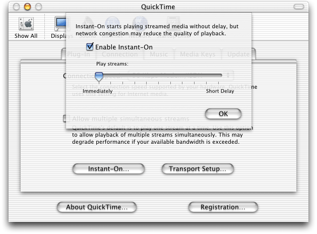
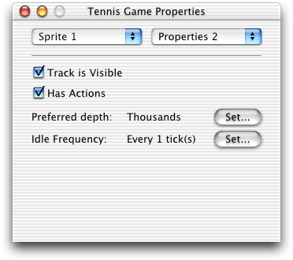
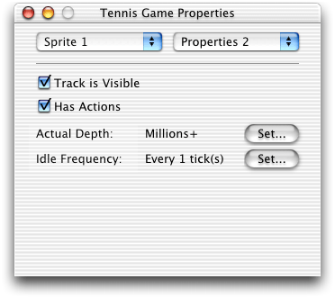

> 导航：[总目录](../../README.md) · [documentation](../../_indexes/documentation.md)


# What’s New in QuickTime 6

Welcome to QuickTime 6.

This document provides a list of the new features, changes,
and enhanced capabilities that are available in QuickTime 6. If
you are a QuickTime API-level developer, content author, multimedia
producer or Webmaster who is currently working with QuickTime, you should
read this document.

As always, the standard way for Apple developers to determine
which version of QuickTime is installed is by calling the Macintosh
Toolbox API `Gestalt` function. (This Mac
OS function is also included in QuickTime for Windows.)

[Listing 1-1](#apple-f4xwc4dqnrsv64tfmyxwi33df52wszbpkridimbqgaydsmzxfvbuqmlhfuytmnzxg44q) shows a code snippet that demonstrates how you can
check the version of QuickTime that is installed––in this case,
QuickTime 6. Note that the number 0x06008000 will test for the GM
version of QuickTime 6 but will fail on pre-release versions of QuickTime.

__Listing 1-1__  Determining
which version of QuickTime is installed by calling the Gestalt function

```
{
    /* check the version of QuickTime installed */
    long version;
    OSErr result;
    result = Gestalt(gestaltQuickTime,&version);
    if ((result == noErr) && (version >= 0x06008000))
    {
        /* we have version 6! */
    }
}
```


This document is intended to provide QuickTime developers
with detailed information designed to support their programming
and development efforts. It is designed to supplement the information
provided in the QuickTime API Reference and the suite of QuickTime
documentation which is available online, in both HTML and PDF formats,
for download at

```
http://developer.apple.com/techpubs/quicktime/qtdevdocs/RM/newsframe.htm
```

For other QuickTime developer documentation, you should refer
to

```
http://www.apple.com/quicktime/developer/
```

For complete QuickTime API documentation, refer to

```
http://developer.apple.com/techpubs/quicktime/qtdevdocs/RM/frameset.htm
```

Updates to the QuickTime
technical documentation website are provided on a regular basis;
developers can also subscribe to various mailing lists for the latest
news and information.

To sign up for any of Apple’s Developer Programs, refer
to

```
http://developer.apple.com/membership/index.html
```


If you encounter any problems using QuickTime 6, please report
them, using the standard Apple bug reporting mechanism described
in the Release Notes accompanying the QuickTime 6 release. It is
very important to include a copy of the file when you report such bugs.

QuickTime 6 is available for download for Mac OS 8 and 9,
Mac OS X, and Windows. The download site is:

```
www.apple.com/quicktime/download/
```

This is the first QuickTime release that has included an installer
for Mac OS X. Users of Mac OS X version 10.1.5 can install QuickTime
6 using the installer on the QuickTime download page.

Note that the QuickTime 6 installer for OS X will not work
on the Jaguar release of Mac OS X, including pre-release versions
of Jaguar that contain an earlier version of QuickTime 6. The released
version of Mac OS X that corresponds to Jaguar already contains
a slightly newer version of QuickTime 6 than the one available for
download.

If you have difficulty performing an installation over the
Web because of a firewall, or if you need to perform multiple installations
on a campus or business, you can download stand-alone installers
by following the links on the download page.

QuickTime Pro users should note that QuickTime 6 requires
new registration numbers. The registration numbers for QuickTime
5 or earlier versions do not unlock the pro features of QuickTime
6. For the pro version of QuickTime 6, you need to purchase new registration
numbers from Apple. The price is currently $29.99 USD.

If you need to uninstall QuickTime, run the installer, select
the custom install, and choose Uninstall from the pop-up menu.

If you need to install an earlier version of QuickTime, installers
for QuickTime 5 and QuickTime 4 are available from QuickTime support:

```
http://www.info.apple.com/usen/quicktime/
```


QuickTime 6 is the first major iteration of QuickTime that
is designed to support the International Organization for Standardization
(ISO) specification for MPEG-4 video and audio. This is a significant
advance beyond earlier versions of QuickTime, in that it allows multimedia
producers, content authors and video artists the capability of distributing `.mp4` files––in
native MPEG-4 video and audio format––across the Internet, so
that those files can be decoded and played on other players that
conform to the ISO MPEG-4 standard.

In one scenario, QuickTime authors will be able to simply
install QuickTime 6 and move through their normal workflow, and
then, in addition to having the option of encoding a file using
the Sorenson 3 or H.263 codec, authors will be able to output the
content of that file as an `.mp4` file.
This content could then, potentially, be played on any ISO-compliant device
available to end users.

In addition to support for the MPEG-4 standard, this release
of QuickTime also includes a number of new features and enhancements,
discussed in this document.

- Support for ISO-compliant MPEG-4 video and audio,
  both encode and decode. Developers, authors, and multimedia producers
  can now create and play back MPEG-4 video content, as well as MPEG-4
  audio encoded using Advanced Audio Coding (AAC). Discussed in the
  section [Support for MPEG-4](#apple-f4xwc4dqnrsv64tfmyxwi33df52wszbpkridimbqgaydsmzxfvbuqmlhfuytmmbxhe2q).
- QuickTime 6 also supports use of the MPEG-4 video and AAC
  audio codecs in QuickTime movies. In many cases, you can choose
  to create either a native `.mp4` file
  or a QuickTime `.mov` file
  using MPEG-4 compression. This allows you to mix MPEG-4 audio and
  video with other QuickTime media, such as VR panoramas, sprites,
  or Flash tracks. Discussed in the section [MPEG-4 and Web Developers](#apple-f4xwc4dqnrsv64tfmyxwi33df52wszbpkridimbqgaydsmzxfvbuqmlhfuytmmbyge2q).
- A new group of MPEG-4 settings dialogs in QuickTime Player
  that enable QuickTime Pro users who work with MP4 files to make
  a number of adjustments in video and audio tracks, streaming and
  compatibility. Discussed in the section [Working with MPEG-4 Files](#apple-f4xwc4dqnrsv64tfmyxwi33df52wszbpkridimbqgaydsmzxfvbuqmlhfuytmmbxhe4q).
- A new video codec for MPEG-4 video compression. The new codec
  is ISMA compliant and conforms to the Profile 0 standard of the
  MPEG-4 specification, with an extremely low data rate of 64 Kbits/second.
  The advantage that this new codec offers is interoperability with
  other systems. Interoperability is the primary goal of the new codec.
  Discussed in the section [New Video Codec for MPEG-4](#apple-f4xwc4dqnrsv64tfmyxwi33df52wszbpkridimbqgaydsmzxfvbuqmlhfuytmmbygazq).
- A new MPEG-4 audio codec that plays audio files of AAC and
  handles ISMA profile levels 0 and 1. In the current release both
  encode and decode are supported. Discussed in the section [MPEG-4 Audio Support](#apple-f4xwc4dqnrsv64tfmyxwi33df52wszbpkridimbqgaydsmzxfvbuqmlhfuytmmbyga3q).
- Support for native MPEG-4 streaming. Standard hinted MPEG-4
  files (`.mp4`) can be served
  directly, without converting to QuickTime Movie (`.mov`)
  files. Discussed in the section [Native MPEG-4 Streaming](#apple-f4xwc4dqnrsv64tfmyxwi33df52wszbpkridimbqgaydsmzxfvbuqmlhfuytmmbygeyq).
- A new, RTSP Instant-On enhancement to QuickTime streaming
  that provides near instantaneous start of streamed movies when the
  available network bandwidth significantly exceeds the data rate
  of the target media. Discussed in the section [RTSP Instant-On Enhancement to Streaming](#apple-f4xwc4dqnrsv64tfmyxwi33df52wszbpkridimbqgaydsmzxfvbuqmlhfuytmmbyge4q).
- Support for JPEG 2000, a high-quality, still-image compression
  and coding standard that uses state of the art compression techniques
  based on wavelet technology. Note that JPEG 2000 support is only
  provided on Mac OS X in the current release of QuickTime 6. Discussed
  in the section [JPEG 2000 Support](#apple-f4xwc4dqnrsv64tfmyxwi33df52wszbpkridimbqgaydsmzxfvbuqmlhfuytmmbygi3q).
- New and updated components related to Macromedia Flash 5 support
  in QuickTime. The Flash media handler and the Flash movie importer
  have been updated, and a new Flash Properties panel has been added
  to the QuickTime Player info panels. Discussed in the section [Flash 5 Support](#apple-f4xwc4dqnrsv64tfmyxwi33df52wszbpkridimbqgaydsmzxfvbuqmlhfuytmmbygmyq).
- A new QuickTime tasking mechanism and new APIs to handle idling
  of applications. Discussed in the section [New APIs for Tasking QuickTime](#apple-f4xwc4dqnrsv64tfmyxwi33df52wszbpkridimbqgaydsmzxfvbuqmlhfuytmmbygm2q).
- A new Carbon Movie Control mechanism for Mac OS X that makes
  the process of using QuickTime within a Carbon Event-based application
  easier and faster. Discussed in the section [New Carbon Movie Control](#apple-f4xwc4dqnrsv64tfmyxwi33df52wszbpkridimbqgaydsmzxfvbuqmlhfuytmmbygqzq).
- A new group of Sprite APIs, as well as a number of new wired
  actions and operands. Discussed in the section [Sprite API Changes](#apple-f4xwc4dqnrsv64tfmyxwi33df52wszbpkridimbqgaydsmzxfvbuqmlhfuytmmbygq3q).
- Support for writing and using variable bitrate (VBR)-enabled
  sound compressor components. Both the QuickTime Movie exporter component
  available in the export dialog (also known as the `ConvertMovieToFile` API
  dialog) and the Standard Sound compression dialog component have
  been updated to use and recognize VBR compressor components. Discussed
  in the section [VBR Sound Compression Support](#apple-f4xwc4dqnrsv64tfmyxwi33df52wszbpkridimbqgaydsmzxfvbuqmlhfuytmmbygu2q).
- A new API that provides tween components with an interrupt-safe
  interface. Discussed in the section [New Tween Component API](#apple-f4xwc4dqnrsv64tfmyxwi33df52wszbpkridimbqgaydsmzxfvbuqmlhfuytsnbtgmzq).
- New, enhanced effects dialogs. Effects may choose to implement
  custom controls to allow the user to more easily edit complex parameters
  that are ill-served by simple sliders or type in boxes. Effects
  may allow a custom control for either a single parameter, or for
  a group of parameters. Discussed in the section [Changes to Effects Dialog](#apple-f4xwc4dqnrsv64tfmyxwi33df52wszbpkridimbqgaydsmzxfvbuqmlhfuytsnbyha2a).
- A new improved None codec (also known as the Raw codec) that
  replaces the previous None codec with a more complete implementation.
  Discussed in the section [None Codec Enhancements](#apple-f4xwc4dqnrsv64tfmyxwi33df52wszbpkridimbqgaydsmzxfvbuqmlhfuytsnzsguya).
- Support for Exif JPEGs and Exif TIFFs, including support for
  thumbnails, which was previously only available in QuickTime 5 on
  Mac OS X 10.1, and is now available for QuickTime on Mac OS 9 and
  Windows. Discussed in the section [Additional Still Image Metadata Support in Mac OS 9 and Windows](#apple-f4xwc4dqnrsv64tfmyxwi33df52wszbpkridimbqgaydsmzxfvbuqmlhfuytsnzxgm4q).
- New QuickTime data handler-aware APIs that make using Apple
  and custom data handlers easier for third-party developers. Discussed
  in the section [Improved Movie Toolbox Support for Data Handlers](#apple-f4xwc4dqnrsv64tfmyxwi33df52wszbpkridimbqgaydsmzxfvbuqmlhfuzdanjsgiyq).
- New UserData APIs that can be useful in copying information
  from one UserData container to another [(page 152)](#apple-f4xwc4dqnrsv64tfmyxwi33df52wszbpkridimbqgaydsmzxfvbuqmlhfuzdcnbwhe4q).
- Support for a number of new features and enhancements in QuickTime
  for Java, including support for JDK 1.4 (Windows only), and the
  introduction of the `JQTCanvas` class,
  a new lightweight version of the `QTCanvas` class
  which supports scaling of Flash content. Discussed in the section [QuickTime for Java Enhancements](#apple-f4xwc4dqnrsv64tfmyxwi33df52wszbpkridimbqgaydsmzxfvbuqmlhfuzdcnrrg43a).
- A new, improved sequence grabber user interface which includes
  new settings available on all platforms. A new group of Sequence
  Grabber APIs are also included in QuickTime 6. Discussed in the
  sections [New Sequence Grabber User Interface](#apple-f4xwc4dqnrsv64tfmyxwi33df52wszbpkridimbqgaydsmzxfvbuqmlhfuzdcnzug4za) and [New Sequence Grabber APIs](#apple-f4xwc4dqnrsv64tfmyxwi33df52wszbpkridimbqgaydsmzxfvbuqmlhfuzdcnzwgu4q).
- New Image Compression APIs that allow compressors to supply
  the User Interface for their options within the compression dialog [(page 183)](#apple-f4xwc4dqnrsv64tfmyxwi33df52wszbpkridimbqgaydsmzxfvbuqmlhfuzdemzzgq3q), as
  well as new Image Decompression Manager APIs [(page 188)](#apple-f4xwc4dqnrsv64tfmyxwi33df52wszbpkridimbqgaydsmzxfvbuqmlhfuzdenjugaza).
- New media handler calls that developers can use to write media
  handlers that support keyboard focus. If you want to add interactive
  capabilities to your application, you need to use these media handler
  calls. Discussed in the section [New Media Handler APIs For Keyboard Focus](#apple-f4xwc4dqnrsv64tfmyxwi33df52wszbpkridimbqgaydsmzxfvbuqmlhfuzdeojrg44q).
- New APIs that provide a mechanism for preflighting operations
  on QuickTime content that may be restricted. Discussed in the section [New QuickTime Restrictions APIs](#apple-f4xwc4dqnrsv64tfmyxwi33df52wszbpkridimbqgaydsmzxfvbuqmlhfuzdgmjtgeza).
- New APIs for better controlling memory usage in movies in
  Mac OS X [(page 203)](#apple-f4xwc4dqnrsv64tfmyxwi33df52wszbpkridimbqgaydsmzxfvbuqmlhfuzdgmrtgu2a).
- Miscellaneous enhancements to QuickTime VR, and an additional
  movie errors API [(page 205)](#apple-f4xwc4dqnrsv64tfmyxwi33df52wszbpkridimbqgaydsmzxfvbuqmlhfuzdgmrxguzq).
- A new XML exporter––Export to QuickTime Media Link––which
  creates a small XML file that contains the URL of a movie, as well
  as other user settings. Discussed in the section [New XML Exporter](#apple-f4xwc4dqnrsv64tfmyxwi33df52wszbpkridimbqgaydsmzxfvbuqmlhfuzdgnbrheya).
- JavaScript support for ActiveX controls, Netscape 6 and browsers
  based on Mozilla. This means you can now use JavaScript to control
  QuickTime when Web pages are viewed using Internet Explorer for
  Windows, or any other browser that supports the COM interface to
  ActiveX controls. Discussed in the section [JavaScript Support for ActiveX, Netscape 6 and Mozilla](#apple-f4xwc4dqnrsv64tfmyxwi33df52wszbpkridimbqgaydsmzxfvbuqmlhfuzdgnjrga3q).
- Support for DVCPro PAL (DV format 4:1:1) on Mac OS X (10.1.2).

- Changes to the QuickTime Player user interface.
  Notably, the Hot Picks movie and the Channel pane have a new layout,
  with channel categories on the left and a movie on the right. Discussed
  in the section [User Interface Changes](#apple-f4xwc4dqnrsv64tfmyxwi33df52wszbpkridimbqgaydsmzxfvbuqmlhfuytmmbygizq).
- Changes to AppleScript and AppleScript terminology that are
  new in QuickTime 6. Most notably, QuickTime Player is now a recordable
  application. There are also a number of new commands, classes, and
  properties, and well as modifications to existing terminology elements.
  Discussed in the section [AppleScript Changes](#apple-f4xwc4dqnrsv64tfmyxwi33df52wszbpkridimbqgaydsmzxfvbuqmlhfuzdcnrxgqya).
- Changes to the QuickTime menu in the Windows system tray,
  which includes a number of new menu items. Discussed in the section [New QuickTime Menu in Windows](#apple-f4xwc4dqnrsv64tfmyxwi33df52wszbpkridimbqgaydsmzxfvbuqmlhfuzdgmrygi2q).

- New documentation on how to deal with the ever-increasing
  number of effect components. This section documents atoms that can
  be used for tagging effects into useful categories. Two groupings
  for effects are defined here: Major Class and Minor Class. Discussed
  in the section [QuickTime Effects Classes](#apple-f4xwc4dqnrsv64tfmyxwi33df52wszbpkridimbqgaydsmzxfvbuqmlhfuytsnrygu2q).
- Some effects with complex parameters would like to provide
  the user with groups of useful parameter values that can be easily
  selected. This section documents an optional mechanism that can
  be used by effects to define these “presets.” Discussed in the section [QuickTime Effects Presets](#apple-f4xwc4dqnrsv64tfmyxwi33df52wszbpkridimbqgaydsmzxfvbuqmlhfuytsnzqha3q).
- New and updated documentation on QuickTime XML importers.
  These importers, introduced in QuickTime 5, create movies based
  on the contents of certain kinds of XML files saved with the `.mov` file
  extension. XML files with the `.mov` file
  extension are treated by networks and operating systems as QuickTime
  movies. There are importers for three XML types currently built
  into QuickTime: SMIL importer, QuickTime media link importer, and
  component preflight importer. Discussed in the section [QuickTime XML Importers](#apple-f4xwc4dqnrsv64tfmyxwi33df52wszbpkridimbqgaydsmzxfvbuqmlhfuzdgmzsg42a).
- QuickTime 6 allows you to play current Shoutcast or Icecast
  streams that use MP3 compression. This section [Playing Shoutcast or Icecast Streams in QuickTime](#apple-f4xwc4dqnrsv64tfmyxwi33df52wszbpkridimbqgaydsmzxfvbuqmlhfuzdgnjtgy2q) discusses the various features
  of Shoutcast and Icecast streams, as well as what you need to know
  in order to deliver these streams in real-time over a network.

- Specific information about the different ways
  that you can use QuickTime 6 and MPEG-4, if you are a developer
  who creates websites, website authoring tools, or QuickTime movies
  that are intended for distribution over a network or the Internet. Discussed
  in the section [MPEG-4 and Web Developers](#apple-f4xwc4dqnrsv64tfmyxwi33df52wszbpkridimbqgaydsmzxfvbuqmlhfuytmmbyge2q).

QuickTime 6 supports ISO-compliant MPEG-4 video and audio,
both encode and decode. This means that you can create and play
back MPEG-4 video and audio content. In addition, you can play back
MPEG-4 audio encoded using Advanced Audio Coding (AAC).

Of notable importance is that an `.mp4` file
is not a QuickTime movie. It must be imported into QuickTime. You
can open `.mp4` files using
API functions that support importers, such as `NewMovieFromFile` or `NewMovieFromDataRef`,
or by calling an MPEG-4 importer directly. End users can open `.mp4` files
using QuickTime Player’s Open or Import commands, by drag-and-drop,
or using the QuickTime browser plug-in (see the section [MPEG-4 and Web Developers](#apple-f4xwc4dqnrsv64tfmyxwi33df52wszbpkridimbqgaydsmzxfvbuqmlhfuytmmbyge2q)).
Double-clicking an `.mp4` file
from the desktop may or may not open the file in QuickTime, as other
applications can register to handle this file type.

Using the Export to MPEG-4 option in the export dialog, you
can create an `.mp4` file containing
either video, audio, or both, as discussed in the section [Working with MPEG-4 Files](#apple-f4xwc4dqnrsv64tfmyxwi33df52wszbpkridimbqgaydsmzxfvbuqmlhfuytmmbxhe4q).

In February 1998, the International Standards Organization
(ISO) formally adopted the QuickTime file format as the starting
point for the MPEG-4 file format, the latest in a series of standards
for transmitting video and audio information. MPEG-4 differs from
MPEG-1 and MPEG-2 by adopting a component-based architecture for
multimedia, an approach similar to QuickTime’s architecture. Other
existing standards have less flexibility and treat multimedia as
just an array of picture elements.

MPEG-1, often simply called MPEG, is fairly common on the
Web and CD-ROMs, typically with the `.mpg` file
extension. MPEG-1 supports one kind of video compression and a few types
of audio compression. MPEG-1 allows coding of moving pictures and
associated audio for digital storage media at up to about 1.5 Mbit/second.
The content of an MPEG file is one or more MPEG streams. Elementary
audio and video streams can be multiplexed into a combined stream.

MPEG-1 was designed to provide VHS-quality video at T1 data
rates (single speed, or 1x, CD-ROM). It is the basis for the video
CD standard, which is little used in the United States or Europe
but is popular in Asia. Most commercial DVD players can play video
CDs, however, and the rapid spread of CD-R burners and DVD players
is currently fueling renewed interest in this format.

QuickTime can open and play MPEG-1 video on both Windows and
Macintosh (requires QuickTime 5 or later for Windows). It can then
export the video to other formats using any of the QuickTime compressors.
Currently, QuickTime treats the entire MPEG-1 stream as a single
sample, so you cannot cut or copy part of an MPEG-1 video unless
you convert it to a different compression format first.

MPEG-1 can also contain audio. The audio can be compressed
in two different formats: layer 2 (often called MPEG-1 audio) and
layer 3 (known as MP3). QuickTime plays both layer 2 and layer 3
audio without difficulty, including streaming MP3 such as ShoutCast. QuickTime
can also play multiplexed layer 2 audio (audio and video streams
combined), but it cannot export or extract layer 2 audio from a
multiplexed MPEG-1 stream.

QuickTime Player does not export to MPEG-1 streams, nor does
it compress audio or video using MPEG-1 compression. MPEG-1 compression
can be added to QuickTime with the Heuris MPEG codec (www.heuris.com/)
or with the MPEG-1 encoder included with Roxio Toast (www.roxio.com/).

The MPEG-4 standard was recently revised to MPEG-4 Version
2, which is the latest standardized version. (Note that amendments
to Version 2 have already been added, as the standard grows and
evolves.) In any case, the standard outlines file conventions and compression
formats not only for audio and video, but for text and multimedia integration.
Because the MPEG-4 file format is largely based on the QuickTime
file format, MPEG-4 files are potentially as diverse in content
as QuickTime movies. This is a rich and complex specification.

Software and hardware vendors will implement the MPEG-4 specification
in stages. The parts of the specification that are implemented by
a given MPEG-4 player are called a player profile.

A profile is, essentially, a grouping of technologies, defined
as “tools” in MPEG terminology. Profiles are a “normative”
part of the standard, in that an implementation must conform to
a profile in order to claim conformance to the standard itself.
Profiles are specified in such a way as to maximize interoperability.

A good example is the way in which this was applied to the
MPEG-1 Audio standard. There are three layers in MPEG-1 Audio. Layer
1 has the least complexity but the lowest compression performance,
while Layer 3 has the highest complexity but also the highest compression
performance. Profiles that include layer 3 also typically include
layers 1 and 2. In this case, interoperability is maximized because
a terminal implementing a profile which includes layer 3 can decode
layer 1, 2 and 3 bitstreams, while a layer 2 terminal can decode
only layer 1 and 2 bitstreams and a layer 1 decoder only a layer
1 bitstream.

No one currently implements the full MPEG-4 specification.
There are no widely distributed MPEG-4 video codecs. (There was
a codec available for Windows Media Player called MS MPEG-4, but
this was actually a proprietary Microsoft codec that was partly based
on a draft specification for MPEG-4. The early version released
by Microsoft was not compatible with the final standard, and has
since been renamed. Microsoft has also released a standard MPEG-4
codec, but it is not in an interoperable file format.)

QuickTime’s MPEG-4 video codec focuses on low-bandwidth
video for Internet delivery, with the goal of delivering near-television
quality over DSL and cable modems, and reasonable quality over dialup
modems.

QuickTime’s implementation of MPEG-4 is designed to be interoperable
with products from other standards-compliant vendors.

A diagram of the MPEG-4 system architecture is shown in [Figure 1-1](#apple-f4xwc4dqnrsv64tfmyxwi33df52wszbpkridimbqgaydsmzxfvbuqmlhfuytkojtgiza). The
items in bold in specific boxes indicate the various parts of the
architecture that QuickTime currently supports.

__Figure 1-1__  MPEG-4 system architecture

!

The MPEG-4 File Format (MP4), which is derived from the QuickTime
File Format, is a format that is designed to store MPEG-4 data in
a file. This process is outlined by Rob Koenen, chair of the MPEG-4
Requirements Group, in his document MPEG-4 Overview, which provides
a brief overview of the MPEG-4 File Format, as follows:

“The MP4 file format is designed to contain the media information
of an MPEG-4 presentation in a flexible, extensible format which
facilitates interchange, management, editing, and presentation of
the media. This presentation may be ‘local’ to the system containing
the presentation, or may be via a network or other stream delivery
mechanism. The file format is designed to be independent of any
particular delivery protocol while enabling efficient support for
delivery in general. The design is based on the QuickTime format
from Apple Computer Inc.”

The diagram shown in [Figure 1-2](#apple-f4xwc4dqnrsv64tfmyxwi33df52wszbpkridimbqgaydsmzxfvbuqmlhfuytkojtgi3a) gives an example of a
simple interchange file. Note that BIFS, an acronym for Binary Format
for Scene, specifies the Scene, and OD (Object Descriptor) specifies
the Stream Management.

__Figure 1-2__  A simple interchange file

!

The QuickTime file format is designed to accommodate the various
kinds of data that need to be stored in order to work with digital
media. Because the file format can be used to describe almost any
media structure, it is an ideal format for the exchange of digital
media between applications, regardless of the platform on which
the application may be running.

The
basic data unit in a QuickTime file is the atom. Each atom contains
size and type information along with its data. The size field indicates
the number of bytes in the atom, including the size and type fields.
The type field specifies the type of data stored in the atom and,
by implication, the format of that data.

Atom types are specified by a 32-bit integer, typically a
four-character code. Apple Computer reserves all four-character
codes consisting entirely of lowercase letters. Unless otherwise
stated, all data in a QuickTime movie is stored in big-endian (network)
byte ordering. All version fields must be set to 0, unless otherwise
stated. Atoms are hierarchical in nature. That is, one atom can
contain one or more other atoms of varying types.

For more detailed information, refer to the volume Inside
QuickTime: QuickTime File Format (351 pp, 2.3 MB), which is available
as a free download from Apple’s QuickTime API website in both
HTML and PDF formats at

```
http://developer.apple.com/techpubs/quicktime/qtdevdocs/RM/frameset.htm
```

The book begins with an introduction to QuickTime atoms, then
presents the structure of the QuickTime file format in detail. This
is followed by a series of code examples for manipulating a QuickTime
file using the QuickTime API. A series of appendixes describe some
common file formats that can be contained within a QuickTime file
as data. The book is intended primarily for developers who need
to work with QuickTime files outside the context of the QuickTime
environment.

The home page of the Moving Picture Experts Group (MPEG),
a working group of ISO/IEC in charge of the development of standards
for coded representation of digital audio and video, can be found
at

```
http://mpeg.telecomitalialab.com/
```

An in-depth presentation of MPEG-4 can be found at

```
http://www.cselt.it/mpeg/standards/mpeg-4/mpeg-4.htm
```

Answers to specific MPEG-4 questions can be found at

```
http://www.cselt.it/mpeg/faq.htm
```

MPEG-4 standards are in the 14496 series and the specifications
can be purchased from ISO at

```
http://www.iso.ch
```

The MPEG-4 implementation forum promotes MPEG-4 and is spearheading
licensing efforts at

```
http://www.m4if.org
```

The Internet Streaming Media Alliance (ISMA) is promoting
a specification and integration of products around a subset of MPEG-4
over IP networks at

```
http://www.isma.tv
```


A veritable alphabet soup of acronyms and terms has emerged
in the MPEG-4 specification, a sampling of which is shown here.

BIFS Binary Format
for Scene

CIF Common
Intermediate Format (352 x 288)

ESD Elementary
Stream Descriptor

IEC International
Electrotechnical Commission

IOD Initial
Object Descriptor

MP4 MPEG-4 File
Format

M4IF MPEG-4 Industry
Forum

OD Object
Descriptor

AVP Audio Visual
Profile (IETF RFC 1890)

cRTP Compressed
Real-Time Protocol(IETF RFC 2508)

IETF Internet
Engineering Task Force

IP Internet
Protocol

IPv4 Internet
Protocol Version 4

IPv6 Internet
Protocol Version 6

ISMA Internet
Streaming Media Alliance

ISO International
Organization for Standardization

QCIF Quarter
Common Intermediate Format (176 x
144)

QoS Quality
of Service

RFC Request
for Comment

RTP Real-Time
Protocol (IETF RFC 1889)

RTSP Real-Time
Streaming Protocol (IETF RFC 2326)

SDP Session
Description Protocol (IETF RFC 2327)

TCP Transmission
Control Protocol (IETF RFC 793)

UDP User Datagram
Protocol (IETF RFC 768)

QuickTime 6 provides transparent access to MPEG-4 files. You
can open `.mp4` files using API
functions that support importers, such as `NewMovieFromFile` or `NewMovieFromDataRef`.
End users can open `.mp4` files
using QuickTime Player's Open or Import commands, or by drag-and-drop.
The process is similar to working with an `.avi` file
or other playable non-movie file. Double-clicking an `.mp4` file
from the desktop may or may not open the file in QuickTime, as other
applications can register to handle this file type.

Currently, in order to save an `.mp4` file,
you use the new QuickTime MPEG-4 movie exporter. The exporter offers
basically two ways of working:

- Encoding to MPEG-4 video or audio for each track.
- If the data is already MPEG-4 compatible, then it will perform
  a pass-thru option for those tracks.

Typically, when you open a movie, QuickTime finds the movie
atom in the file, processes it, and creates a movie object, i.e.,
instantiates it. When you use MP4, you have to invoke the importer.
What the importer does is scan the file, find the `'moov'` atom,
and then conform the `'moov'` atom––which
is an MPEG-4-style movie atom––into a `'moov'` atom
that is QuickTime-style. QuickTime then creates the movie object.

In the case of exporting, where the data is already in MPEG-4
format––MPEG-4 video or audio––the exporter has QuickTime
flatten the data to the file. This produces the movie atom, which
points to the file. The exporter once again conforms the movie atom,
which is QuickTime-style, into a movie atom which is MPEG-4-style.
The exporter then writes this to the file. This is pass-thru.

For an encoding or re-encoding export, the exporter compresses
and then writes the MPEG-4 data to a file, whose movie is subsequently
made to conform to MPEG-4 style.

QuickTime 6 introduces a new set of dialogs in QuickTime Player
(illustrated in this section with examples from Mac OS 9 and Mac
OS X) that enable end users to open MP4 files.

To work with MP4 files, end users or content authors need
to perform a series of import-export operations, using QuickTime
Pro. The steps are as follows:

1. Open a `.mov` file
   in QuickTime Player.
2. In the File menu, click Export.
3. A dialog appears with a list of export options. Choose Movie
   to MPEG-4.
4. Save the `.mov` to
   a `.mp4` file.
5. The `.mp4` file can
   now be played on any player that supports MPEG-4.

[Figure 1-3](#apple-f4xwc4dqnrsv64tfmyxwi33df52wszbpkridimbqgaydsmzxfvbuqmlhfuytkojtgmya) shows the dialog (in Mac OS 9) that appears when
you want to save a QuickTime movie, in this case “cool sunset”
to a `.mp4` file. From
the list of options in Export, you choose Movie to MPEG-4.

__Figure 1-3__  The dialog that appears when you want
to save a QuickTime movie to an MPEG-4 file in Mac OS 9 by exporting

!

If you click the Options button in the dialog shown in [Figure 1-3](#apple-f4xwc4dqnrsv64tfmyxwi33df52wszbpkridimbqgaydsmzxfvbuqmlhfuytkojtgmya), the
MPEG-4 Settings dialog appears, as shown in [Figure 1-4](#apple-f4xwc4dqnrsv64tfmyxwi33df52wszbpkridimbqgaydsmzxfvbuqmlhfuytkojtgm2a). In this dialog, you
can set the basic video track, the physical size of current movie,
and the audio track as necessary. If Basic is selected, the video
will make use of the basic settings for MPEG-4 and ensure the widest
possible range of playback on MPEG-4 compatible devices.

Note that Profile 0, in the text of the dialog, is the ISMA-specified
Profile 0, and not the MPEG-4 defined Profile 0. For more information
about ISMA and Profile 0, refer to the section [ISMA and Definitions of Profile 0](#apple-f4xwc4dqnrsv64tfmyxwi33df52wszbpkridimbqgaydsmzxfvbuqmlhfuytimzyhaya).

__Figure 1-4__  The MPEG-4 settings dialog in Mac
OS X, with the General pane selected

!

Note that the lower portion of the dialog in [Figure 1-4](#apple-f4xwc4dqnrsv64tfmyxwi33df52wszbpkridimbqgaydsmzxfvbuqmlhfuytkojtgm2a) contains
additional description and explanation about the choices that are
available to the user. Audio can be optimized for music––in
this case, AAC. (Note AAC can handle a full range of music and other
audio.)

In the Video settings dialog in Mac OS X shown in [Figure 1-5](#apple-f4xwc4dqnrsv64tfmyxwi33df52wszbpkridimbqgaydsmzxfvbuqmlhfuytkojtgm4a), the
end user can adjust specific settings for video, such as the number
of kbits per second, or the frame rate––for example, 15 frames
per second, if that is the rate desired.

__Figure 1-5__  The MPEG-4 settings dialog, with the
Video pane selected

!

[Figure 1-6](#apple-f4xwc4dqnrsv64tfmyxwi33df52wszbpkridimbqgaydsmzxfvbuqmlhfuytkojtgqza) shows the settings available for audio in Mac OS
X––for stereo or mono encoding. If the user selects music in
the basic panel, it automatically selects a high data rate and selects
stereo.

__Figure 1-6__  The MPEG-4 settings dialog in Mac
OS X, with the Audio pane selected

!

[Figure 1-7](#apple-f4xwc4dqnrsv64tfmyxwi33df52wszbpkridimbqgaydsmzxfvbuqmlhfuytkojtgq3a) shows the settings dialog for streaming, which enables
the user to select the type of hinting required, as well as maximum
packet size and maximum packet duration.

__Figure 1-7__  The MPEG-4 settings dialog in Mac
OS X, with the Streaming pane selected

!

[Figure 1-8](#apple-f4xwc4dqnrsv64tfmyxwi33df52wszbpkridimbqgaydsmzxfvbuqmlhfuytkojtguya) shows the Compatibility settings dialog in Mac OS
X. By default, QuickTime produces a generic MPEG-4 stream. QuickTime
does not check for any specific layer compatibility features that
might be required by ISMA or other organizations. Nor does QuickTime
check if the overall data rate of the MPEG-4 you’re producing
is any particular data rate.

The user can select ISMA compliance, and also select the speed
at which you want to stream the file––for example, at a medium
data rate.

__Figure 1-8__  The MPEG-4 settings dialog in Mac
OS X, with the Compatibility pane selected

!

QuickTime 6 provides a new video codec for MPEG-4 video compression.
The new codec is ISMA compliant and conforms to the Profile 0 standard
of the ISMA specification. It can provide an extremely low data
rate of 64 kbits/second. The advantage that this new codec offers
is interoperability with other systems. Interoperability is the
primary goal of the new codec.

For application developers, this new codec is similar to other
codecs that ship with QuickTime. As such, it behaves like any other
codec that developers have had experience with, such as the JPEG
codecs. From a programming point of view, developers will be able to
pop up the Standard Compression dialog and that will provide a choice
for users.

Developers may want to develop certain applications around
this codec for broadcasting, for example, because of its low data
rate and because it builds on the H.263 specification.

The key features of the new video codec for MPEG-4 video compression
can be summarized as follows:

- Implements MPEG-4 Video Simple Profile, which
  supports

  - Video at 50 kbps to 4 Mbps
  - Streaming
  - Delivery to wireless handheld devices
  - Stored content
  - Kiosk applications
  - Set-top boxes
- Decodes most ISMA and 3GPP streams
- Displays a detailed warning if it can’t open a particular
  stream
- Encodes ISMA- or 3GPP-compliant streams
- Improved video processing, including gamma correction

The Internet Streaming Media Alliance (ISMA) specification `<http://www.isma.tv/>` is
aimed at producing a technical standard based on MPEG-4 for files
and streaming MPEG-4 video and audio over IP networks. In that standard,
a file will have one video track and one audio track, likewise for
streaming tracks. The aggregate data rate cannot exceed the limit
of 64 Kbits/second, which conforms to Profile 0.

As ISMA defines it:

“To be compliant with this specification a product must
completely implement profile 0, and may implement additional profiles.
For example, an on-demand video server would likely need to implement
all possible profiles to address a wide client base. However a decoder/terminal
may only support profile 0.

“This approach has been taken to ensure that any product
certified as ISMA compliant, has the capability to minimally interoperate
with any other ISMA compliant product.

“This is a definition of base interoperability. Vendors
are still free to add additional functionality beyond that specified
in this document. However that said, a conforming product cannot
make any additional requirements beyond this specification to interoperate
with another conforming system.”

In the specification, Profile 0 is defined this way:

“Rationale: This profile was selected to allow for video
and audio at bitrates suitable that match capabilities of narrowband
and mobile wireless infrastructures and to align with the patent
pool work in M4IF.”

For video, this includes the following:

- REQUIRED - MPEG-4 ISO/IEC 14496-2:1999 + Cor
  1:2000 + Cor 2:2001
- MPEG-4 Simple Profile @ Level 1
- Typical Visual Session Size is QCIF (176x144)
- Maximum bitrate is 64kbit/s
- ISMA Restriction: Profile 0 is limited to one (1) video object
  only.

A profile can be thought of as a grouping together of different
algorithms, specifying what your video codec can and cannot do.
A level, on the other hand, specifies how much your codec can do.
A level, for example, may restrict the computational complexity
within a profile, specifying the bitrate constraints on a video
or audio stream. Both profiles and levels are stored within an MPEG-4
file, so that the playback device “knows” whether or not it
can in fact play back the file.

- MPEG-4 Video Simple Profile
- 176 x 144 at 15 fps and 64 kbps

- Simple or Advanced Simple Profile
- 352 x 288 at 30 fps and 1.5 Mbps

- Similar to ISMA Profile 0
- Designed for wireless handheld devices

In QuickTime 6, the MPEG-4 video codec performs gamma correction,
so that MPEG-4 files look the same when they are displayed on both
Macintosh and Windows computers. An MPEG-4 video stores both gamma
and color space information, while the video codec performs per-platform
gamma correction.

[Figure 1-9](#apple-f4xwc4dqnrsv64tfmyxwi33df52wszbpkridimbqgaydsmzxfvbuqmlhfuytkojtgu2a) shows a Compression Settings dialog in Mac OS X (available
in QuickTime Player Pro) that provides MPEG-4 Video as a selectable
choice for the content author or end user. The dialog also provides
two selectable compression types: Faster and More Accurate.

__Figure 1-9__  The Compression Settings with MPEG-4
Video as a selectable item for the content author

!

For developers, some important points to keep in mind about
QuickTime 6 support for MPEG-4:

- MP4 files can be opened by any application that
  uses the standard QuickTime calls.
- Any application can create MP4 files by using the standard
  QuickTime export calls.
- MPEG-4 codecs behave like other QuickTime codecs.

QuickTime 6 plays audio files of AAC and handles ISMA profile
levels 0 and 1, with the exception of CELP audio. In the current
release both encode and decode of AAC are supported. (Note that
encode is AAC [Low Complexity] only.) QuickTime 6 conforms to the
MPEG-4 audio specification.

QuickTime 6 audio can handle reading in MP4 files, and can
export them to QuickTime movies.

A few current limitations:

- Audio can only handle ISMA Profile 0 and Profile
  1 for AAC.
- Audio cannot handle multichannel AAC.

The characteristics of AAC include

- Perceptual audio codec, similar to MP3
- Multichannel capability
- “Indistinguishable” audio quality––that is, you can
  take an encoded file and the source from the encoded file and you
  should not be able to tell the difference over a stereo system.
  From a CD source:

  - AAC Low Complexity requires
    96 kbps per channel.
  - MP3 requires at least 128 kbps per channel.

The characteristics of the QuickTime AAC encoder include

- AAC-Low Complexity
- Acceptable source

  - 44.1 kHz or 48 kHz.
    It is recommended that when encoding audio, your source should be
    an even multiple of those numbers.
  - Mono or stereo
- Output

  - Mono: 16 to 256 kbps
  - Stereo: 16 to 256 kbps
  - The sample rate is automatically scaled to the bitrate.

Table 1-1 is a mapping of the input sample rate + output bitrate
+ output number of channels to output sample rate.

__Table 1-1__  A mapping of the input sample rate
+ output bitrate + output number of channels to output sample rate

| Input sample rate | Output bitrate | Output sample rate (one channel) | Output sample rate (two channels) |
| 48000 | 8000 | 8000 | none defined |
|  | 16000-20000 | 16000 | 8000 |
|  | 24000-28000 | 22050 | 11025 |
|  | 32000 | 32000 | 16000 |
|  | 40000, 480000 | 32000 | 22050 |
|  | 56000 | 32000 | 24000 |
|  | 64000, 80000, 96000, 112000 | 48000 | 32000 |
|  | 128000+ | 48000 | 48000 |
| 44100 | 8000 | 8000 | none defined |
|  | 16000, 20000 | 16000 | 8000 |
|  | 24000, 28000 | 22050 | 11025 |
|  | 32000 | 32000 | 16000 |
|  | 40000, 48000 | 32000 | 22050 |
|  | 56000 | 32000 | 24000 |
|  | 64000, 80000, 96000, 112000 | 44100 | 32000 |
|  | 128000+ | 44100 | 44100 |

You are best advised to provide content in these sample rates,
regardless of the target bitrate. If you already have content in
a different sample rate, however, it is not a problem. QuickTime
will perform the necessary Sample Rate conversion.

The characteristics of the QuickTime AAC decoder include

- AAC Low Complexity

  - 8
    to 320 kbps
  - 8 to 48 kHz
  - Mono or stereo
- ISMA Profile 0, 1 compliant

QuickTime 6 provides support for native MPEG-4 streaming.
Standard hinted MPEG-4 files can be served directly, without converting
to `.mov` files.

For authoring in QuickTime 6, there are new packetizers and
reassemblers, one for audio and one for video. These are used to
take a `.mov` or `.mp4` and
produce a hinted `.mov`,
or a hinted .`mp4`. (MP4
files have in them a definition of hint tracks, which is the QuickTime
version of hint tracks.) Authors can then take this movie and place
it on a Streaming Server. The MPEG-4 file format includes hint tracks
which are the same as native QuickTime hint tracks.

Using QuickTime Streaming Server 4––Apple’s streaming
media server––for example, you can serve ISO-compliant hinted
MPEG-4 files to any ISO-compliant MPEG-4 client, including any MPEG-4
enabled device that supports playback of MPEG-4 streams over IP. You
can also serve on-demand or live MPEG-4 streams, and reflect playlists
of MPEG-4 files.

Note that QuickTime 6 does not support interleave for RTP
audio packing.

This section discusses the various ways that you can use MPEG-4
in QuickTime, as well as how to create, compress, and play MP4 files
on the Web. It also provides an example of how to embed an .mp4
file in a Web page so that it will be played only by QuickTime.
The section concludes with a discussion of some of the issues involved
in creating ISO-compliant MP4 files to ensure that they are interoperable
with players other than QuickTime.

If you are a developer who creates websites, website authoring
tools, or QuickTime movies intended for distribution over a network
or the Internet, you will want to read this section.

There are three different ways you can use MPEG-4 in QuickTime.

1. You can create QuickTime movies (.mov) that use
   the MPEG-4 video and/or audio codecs. These are not .mp4 files,
   and MP4 players will not play them. They are QuickTime movies and
   they require QuickTime 6 or later to play.
2. You can create MPEG-4 files (.mp4) that are ISO-compliant.
   These are MP4 files. They are not QuickTime movies. All ISO-compliant
   players should be able to play these files with no difficulty. QuickTime
   Player is an ISO-compliant player and can play ISO-compliant MP4
   files created on any platform.
3. You can create MPEG-4 files (.mp4) that are not ISO-compliant.
   These MP4 files may not play on other MP4 players, but they will
   play in QuickTime 6. (For more information about issues involving
   ISO compliance, see the section [ISO Compliance](#apple-f4xwc4dqnrsv64tfmyxwi33df52wszbpkridimbqgaydsmzxfvbuqmlhfuytinbqgm3a).)

QuickTime 6 allows you to create both fast-start and streaming
versions of your movies in both .mov and .mp4 format. Movies that
use MPEG-4 codecs can be hinted for streaming, exported to .mp4
files, or both, without recompressing the audio or video.

MPEG-4 is an ISO standard supported by a wide range of companies
in a variety of industries, as discussed in the section [Support for MPEG-4](#apple-f4xwc4dqnrsv64tfmyxwi33df52wszbpkridimbqgaydsmzxfvbuqmlhfuytmmbxhe2q).
This means that an MPEG-4 file can be played by many different players
in addition to QuickTime, not only on personal computers, but also
on cell phones, PDAs, and television set-top boxes. This is a huge
step forward from the current proprietary environment, which may
lead you to deliver your movies using different compressors and
multiple formats––such as Real, Windows Media, and QuickTime––just
to serve your Mac and Windows customers.

QuickTime movies compressed using MPEG-4 audio and video codecs
can be exported to MPEG-4 file format without recompression, allowing
you to serve your movies in multiple formats (`.mov` and
.mp4) without sacrificing quality or time.

At typical Internet data rates, the MPEG-4 simple video codec
is comparable to Sorenson3 video. This a good reason for using a
codec in itself, but there are other advantages. The MPEG-4 video
codec scales very well at extremely low bitrates, making it suitable
for cell phones and PDAs with data rates even lower than dialup
modems. In addition, MPEG-4 video compression can be very fast,
making it suitable for live broadcasts and decreasing the time spent
compressing movies.

MPEG-4 audio uses the Advanced Audio Codec (AAC), as discussed
in the section [MPEG-4 Audio Support](#apple-f4xwc4dqnrsv64tfmyxwi33df52wszbpkridimbqgaydsmzxfvbuqmlhfuytmmbyga3q). This codec provides better quality
than mp3 audio at any given bitrate, or equivalent quality at a
lower bitrate (typically about 30% lower). At higher bitrates, AAC
supports multichannel surround-sound audio. Like MP3 before it,
MP4 audio is a standard, so it is entirely possible that devices
currently supporting MP3 (MP3 players, CD players, DVD players)
will soon be available for MP4 as well. This is a premium quality
audio codec for ISDN data rates and above.

For low bandwidth audio suitable to dialup modems or portable
wireless connections, however, the QDesign2 music codec and Qualcomm
Purevoice codecs remain better choices.

The MPEG-4 specification includes a low bandwidth audio codec
based on CELP (codebook excited linear predictive) algorithms similar
to the Purevoice codec.

You can use the MPEG-4 audio and video compressors as you
would any other QuickTime codecs, as explained in the section [New Video Codec for MPEG-4](#apple-f4xwc4dqnrsv64tfmyxwi33df52wszbpkridimbqgaydsmzxfvbuqmlhfuytmmbygazq).
The MPEG-4 video and audio codecs are available in the standard
QuickTime compression dialog box.

From QuickTime Player, choose Export (File menu), Movie to
QuickTime Movie (pop-up menu), and click the Options button. Click
the Settings button for audio or video and choose MPEG-4 from the
compressor list. There are a variety of settings for audio and video,
such as frame rate, quality, and data rate limit. Click the Size
button to change the pixel dimensions of the video track. Click
Okay, then Save.

Other applications that use the standard file compression
dialog automatically gain the ability to use MPEG-4 compression
when you install QuickTime 6.

To create .mp4 files from QuickTime Player, choose Export
(File menu), Movie to MPEG-4, (pop-up menu), and click the Options
button. This opens a dialog box with tabs for General, Video, Audio,
Streaming, and Compatability. Use this dialog box to select your MPEG-4
compression settings. These panels are described and illustrated
in the section [New Dialogs for Handling MP4 Files](#apple-f4xwc4dqnrsv64tfmyxwi33df52wszbpkridimbqgaydsmzxfvbuqmlhfuytimzyg42a).

The General settings allow you to export audio, video, or
both. You can make some choices about audio and video compressor
settings here as well.

One of your compression choices is Pass Through. Use this
setting to export a QuickTime movie with MPEG-4 compression to the
.mp4 file format without recompressing the data. This is a very
fast operation and does not degrade audio or video quality.

The Size menu gives you three choices in the current release
of QuickTime 6––Current, 320 x 240, and 160 x 120. If you need
a different frame size, you can resize the movie and choose Current.

The Video settings allow you to set a video bitrate limit,
frame rate, and keyframe rate.

The Audio settings allow you to set an audio bitrate limit
and number of channels.

Text at the bottom of each pane changes as you choose settings
to help you undertand the options and monitor ISO compliance. The
Compatability pane lets you override audio and video settings to
ensure ISO compliance. For more information, see the section [ISO Compliance](#apple-f4xwc4dqnrsv64tfmyxwi33df52wszbpkridimbqgaydsmzxfvbuqmlhfuytinbqgm3a).

The Streaming pane lets you create a fast-start or streaming
.mp4. If you choose streaming, QuickTime will add a hint track.
You can choose this option with the codecs set to Pass Through to
turn a fast-start movie with MPEG-4 compression into a hinted .mp4
without recompressing.

You can stream .mp4 files using the QuickTime Streaming Server
(version 4 or later), the Darwin Streaming Server (version 4 or
later), or any ISO-compliant streaming server. QuickTime 6 can also
play MP4 streams from any ISO-compliant source.

Double-clicking .mp4 files from the desktop may launch QuickTime
Player, or it may launch some other application that is registered
for .mp4 files on your computer.

Files created on the Mac OS have a creator code as well as
a file type, so the operating system will usually call QuickTime
Player for an .mp4 file created locally on a Mac. This creator code
is normally lost, however, if a file is stored on Windows or Unix
file systems, something which commonly occurs when a file is transferred
over the Internet.

To deliver `.mp4` files
over the Internet, your Web server needs to be configured for the
.mp4 MIME type (video/mp4). Once this is done, a browser will play
.mp4 files using the plug-in or ActiveX control registered for video/mp4.
If you post your .mp4 file to the Web and attempt to view it using
QuickTime, an error stating that “This is not a file that QuickTime
understands,” or an attempt to display the file as text, generally
indicates that the Web server is not configured for the mp4 MIME
type.

To embed an .mp4 file in a Web page so that it will be played
only by QuickTime, use both the `OBJECT` tag––specifying
the QuickTime `ClassID` and `Codebase`––and
the `EMBED` tag, with `SRC` set
to a QuickTime MIME type––such as `.qtif` or `.pntg`––and `QTSRC`
set to the .mp4 file, as shown in the following example.


```
<OBJECT
CLASSID="clsid:02BF25D5-8C17-4B23-BC80-D3488ABDDC6B"
    CODEBASE="http://www.apple.com/qtactivex/qtplugin.cab"
    WIDTH="320" HEIGHT="256" >

    <PARAM NAME="src" VALUE="My.mp4" >
    <PARAM NAME="autoplay" VALUE="true" >

<EMBED  SRC="QTMimeType.pntg" TYPE="image/x-macpaint"
PLUGINSPAGE="http://www.apple.com/quicktime/download"
    QTSRC="My.mp4" WIDTH="320" HEIGHT="256"
    AUTOPLAY="true" >
</EMBED>

</OBJECT>
```

The `OBJECT` tag
works with Internet Explorer 4 and later on Windows. The `ClassID` specifies the
QuickTime ActiveX control, and the `Codebase` tells
Explorer where to find the ActiveX control if it is not installed.
The `PARAM` tag with `name="src"` has
the URL of your MP4 file as its value.

The `EMBED` tag works
with all other Windows browsers and all Mac browsers including Internet
Explorer. The `SRC` parameter
is set to a file whose MIME type is used exclusively by QuickTime,
such as `.pntg` (image/x-macpaint)
or `.qtif` (image/x-quicktime).
You can also use .mov (video/quicktime). This file must exist and
is downloaded by the browser, but it is not displayed. The browser
uses the QuickTime plug-in to handle any file of this MIME type.

The `PLUGINSPAGE` parameter
tells the browser where to find the QuickTime plug-in if it is not
installed. The `QTSRC` parameter
holds the url of your MP4 file, and this is what QuickTime plays.

The MPEG-4 specification is more than just a video codec or
an audio codec. It defines a rich set of multimedia, including such
things as text and facial animation, as discussed in the section [Support for MPEG-4](#apple-f4xwc4dqnrsv64tfmyxwi33df52wszbpkridimbqgaydsmzxfvbuqmlhfuytmmbxhe2q).

No software is currently able to display all the different
media described in the MPEG-4 specification. Consequently, MPEG-4
defines profiles (discussed in the section [Profiles and Levels Defined](#apple-f4xwc4dqnrsv64tfmyxwi33df52wszbpkridimbqgaydsmzxfvbuqmlhfuytimzyha3a),
which describe the subset of MPEG-4 features a particular player supports,
and the feature set a particular movie requires.

A Profile 0 player, for example, can play simple MPEG-4 video
at speeds up to 64 kbit/second, and AAC audio at 44.1 and 48 kHz
in mono or stereo. A Profile 0 movie does not require any other
features for correct playback. A Profile 0 player can play any Profile
0 movie.

A Profile 1 player has a larger required feature set that
includes everything in Profile 0 as well as features such as multichannel
sound and higher bitrate video.

If an MP4 movie uses even one feature of theProfile 1 set
(that is not also part of the Profile 0 set), it is a Profile 1
movie, because it requires a Profile 1 player for reliable playback.

If an MP4 player is missing even one feature required for
Profile 1, it is a Profile 0 player, even though it may be able
to play many Profile 1 movies.

QuickTime 6 is a Profile 0 player. It can play any Profile
0 movie. QuickTime 6 also has some features of a Profile 1 player,
such as the ability to handle higher bitrate video, but it does
not have the full Profile 1 feature set and cannot play all Profile
1 movies.

QuickTime can create and play Profile 0 movies that use video
at higher bitrates than 64 kbit/second. If you know your movie will
be played by QuickTime, you may want to take advantage of the higher
bitrates available, but be aware that this produces files which
are not ISO-compliant. Other Profile 0 players may not be able to
play these files, even though QuickTime can.

To ensure interoperability with other players, use only ISO-compliant
MP4 files.

QuickTime 6 introduces a new feature in streaming: Instant-On.
This feature provides broadband users with quick access to streaming
content, thus reducing the wait before playback. Users with a broadband
connection can “scrub” through on-demand streams in real-time
by using the time slider. The playback is updated instantaneously,
allowing you to locate precisely the content that you want to view
in a QuickTime movie.

This feature enables the nearly instantaneous start of streamed
movies when the available network bandwidth significantly exceeds
the data rate of the target media.

Users can enable this feature in the QuickTime Settings control
panel (shown below). The slider varies the amount of pre-buffering
that QuickTime will do from a maximum of 2x the movie data rate
to a minimum of very little pre-buffering.



There are some minor changes to the QuickTime Player user
interface that are introduced in QuickTime 6, as discussed in this
section. These include the following:

- The Channel button (below) that was marked “TV”
  in previous versions of QuickTime is now marked with a “Q”.


- The Hot Picks movie and the Channel pane have
  a new layout (below), with channel categories on the left and a
  movie on the right. The list of channel categories is now dynamic.


- The Favorites pane is no longer an alternate
  for the Channel pane. It is now a stand-alone panel (shown below).
  Instead of icons, favorite movies are shown as a list of file names
  or URLs.


- The Favorites panel can be accessed only from
  the Favorites menu. There is no longer a heart icon to switch between
  Channels and Favorites. Both can now be displayed simultaneously
  if the user wishes.
- There is a new menu item in QuickTime Player. Under File,
  there is now an Open Recent > selection, with a submenu of the
  last 10 movies.

These changes should not affect programmers working with QuickTime
at the API level.

QuickTime 6 includes support for JPEG 2000, a high-quality,
still-image compression and image coding standard that uses state
of the art compression techniques based on wavelet technology. QuickTime
6 provides support for encoding, decoding, import, and export to the
format.

The JPEG 2000 standard is based on discrete wavelet transform
(DWT), scalar quantization, context modeling, arithmetic coding
and post-compression rate allocation. The standard lends itself
to a variety of uses, ranging from digital photography to medical imaging
to advanced digital scanning and printing.

For more information on the JPEG 2000 standard for still image
coding, refer to

```
http://www.jpeg.org/JPEG2000.htm
```

Most notably, JPEG 2000 provides high compression efficiency––in
many cases, visually lossless compression at 1 bit per pixel or
better.

Note that for this release of QuickTime 6, JPEG 2000 is only
supported in Mac OS X.

QuickTime 6 includes several new and updated components related
to Macromedia Flash support in QuickTime. The Flash media handler
and the Flash movie importer have been updated, and a new Flash
Properties panel has been added to the QuickTime Player info panels.

The new Flash media handler supports Macromedia Flash files
(also known as SWF files) that conform to Flash 5 versions and earlier
of the SWF specification. (Previous releases of QuickTime supported
files that conformed to Flash 4 and earlier.) You should refer to Macromedia’s
documentation for a complete listing of the features added to Flash
5. The most significant additions include

- greatly expanded ActionScript capabilities
- HTML text rendering
- XML data exchange

All these features work properly under the new Flash media
handler––with a few limitations. (Refer to the QuickTime 6 Release
Notes, which specify those limitations.)

SWF files opened by QuickTime-savvy applications are converted
to QuickTime movie files by the Flash movie importer, discussed
in the next section. These movie files consist of a single Flash
track, whose media data is simply the data in the original SWF file. Virtually
all of these movie files play back in QuickTime Player, in other
QuickTime-savvy applications, or in the QuickTime browser plug-in
exactly as if the original SWF file had been opened using the Flash
Player application or the Flash browser plug-in.

The new Flash movie importer is “smarter” than the previous
importer in several ways. The principal change is that the new importer
scans some or all of the Flash file being imported to try to determine
whether the file is set to automatically start playing when it is
opened. (Previous importers assumed that all imported SWF files
should be autoplayed.) Several other settings are unchanged from
earlier versions of the Flash importer: the play-all-frames option
is set to `TRUE` and the
looping flag is set to `FALSE`.

Flash tracks can be combined with other kinds of tracks in
a QuickTime movie file. This is especially useful when using controls
in the Flash track (buttons, sliders, etc.) to control the playback
and settings of other tracks (video tracks, sound tracks, VR tracks,
etc.)

In this situation, the content author needs to be aware of
a new consideration that did not arise in earlier versions of the
Flash media handler: version 5 ActionScripts can read the position
of the cursor and/or the state of the mouse button at any time.
This means that some ActionScripts may respond to mouse button clicks
even if those clicks do not occur on some interactive element in
the Flash track. If the Flash media handler accepts and processes
all clicks in the track rectangle, then those clicks cannot be passed
to tracks layered behind the Flash track. This effectively prevents
the user from interacting with sprite tracks and QuickTime VR tracks
layered behind the Flash track.

The new Flash media handler allows a movie author to decide
on a per-track basis whether all mouse button clicks are accepted
and handled by that particular instance of the Flash track or whether
clicks that are not on an interactive element in the track are passed
to tracks layered behind it. The setting for a specific Flash track
can be adjusted using the new “Flash Properties” info panel
in QuickTime Player, shown in [Figure 1-10](#apple-f4xwc4dqnrsv64tfmyxwi33df52wszbpkridimbqgaydsmzxfvbuqmlhfuytkojtgu4a).

This panel contains a single check box labeled “Mouse Capture
Enabled”. If the box is checked, then all mouse clicks are directed
to the Flash track (unless some track in front of the Flash track
processes the click); if the box is unchecked, only mouse button
clicks on interactive elements in the Flash track are processed.

__Figure 1-10__  The Flash Properties info panel in
Mac OS X in QuickTime Player with Mouse Capture Enabled box checked

!

When a Flash file is imported as a movie with a single Flash
track, mouse-capturing is enabled for that track. If you combine
that track with other tracks, you may need to adjust the mouse capture
setting to achieve the proper user experience.

The mouse capture setting of a Flash track is stored in the
media properties atom of the track.

The `Movies.h` header
file contains the constant `kFlashTrackPropertyAcceptAllClicks` to
identify the atom type; the atom data is a Boolean value, where `TRUE` means
to accept all mouse button clicks and `FALSE` means
to accept only those mouse button clicks on an interactive element in
the Flash track.

The following snippet of code sets a Flash track to accept
all clicks:

```
QTAtomContainer trackProperties = NULL;
    Boolean     acceptAllClicks = true;

GetMediaPropertyAtom(flashMedia, &trackProperties);
    if (trackProperties != NULL) {
        QTInsertChild(trackProperties, 0,
        kFlashTrackPropertyAcceptAllClicks, 1, 1,
        sizeof(acceptAllClicks), &acceptAllClicks, nil);

SetMediaPropertyAtom(flashMedia, trackProperties);

QTDisposeAtomContainer(trackProperties);
}
```


QuickTime 6 introduces a new tasking mechanism designed to
improve application performance and operation.

Periodically, applications have to give time to QuickTime
by calling such routines as `MCIsPlayerEvent()`, `MCIdle()`, `MoviesTask()`,
or `TaskMovie()`. Typically,
QuickTime developers ask the question, how often should I call a
particular routine? The answer most frequently given is, 10 to 20
times per second. This works in most cases. But in many other cases,
while an application is tasking QuickTime 10 or 15 times per second,
half the time QuickTime does not really need to be called, and the
application will just be sitting there, spinning. As a consequence,
there is an inefficient use of processor time.

In QuickTime 6, a new group of APIs are provided that improve
QuickTime tasking from an application’s point of view. These are

- `QTGetTimeUntilNextTask()`
- `QTInstallNextTaskNeededSoonerCallback()`
- `QTUninstallNextTaskNeededSoonerCallback()`

For example, where an application once did this

```
while (true) {
    WaitNextEvent(..., &event, 2, ...); // if no event pending, return a
                                        // null event after
                                        // 2/60 of a second
    MCIsPlayerEvent(mc, &event);
}
```

it can now do something like this

```
UInt32 t;
while (true) {

    QTGetTimeUntilNextTask(&t, 60); // how long in 60ths of a second?
    WaitNextEvent(..., &event, t, ...);
    MCIsPlayerEvent(mc, &event);
}
```

QTGetTimeUntilNextTask is a new API that lets you pass in
a scale––for example, 1/60 of a second or 1/1000 of a second––and
returns a duration, that is, the number of 60ths or 1000ths (whatever
you ask for) until the next time QuickTime needs to be called.

For example, as shown in the code snippet above, on Mac OS
9 you would call QTGetTimeUntilNextTask, passing in 60 because `WaitNextEvent()` wants
ticks. It will tell you how many 60ths of a second until QuickTime
needs to be called again. `WaitNextEvent()` will not
return either until that amount of time has gone by, in which case
it will give you a NULL event, or an event took place, in which
case it will give you that event.

On Mac OS X, the recommended way to do this on a Carbon application
is to use the Carbon event loop timer, as discussed in the section [New Carbon Movie Control](#apple-f4xwc4dqnrsv64tfmyxwi33df52wszbpkridimbqgaydsmzxfvbuqmlhfuytmmbygqzq).
This is a timer routine that you set up to be called periodically
from the Carbon event loop. You set a duration for how often you
want it to happen.

The following code snippet shows how you can use both QuickTime’s
new tasking mechanism and the Carbon event loop timer code. It also
shows how to use the new `QTInstallNextTaskNeededSoonerCallback()` API.

`MyMovieIdlingTimer()` is
installed by the sample routine `InstallMovieIdlingEventLoopTimer()` shown
in the code snippet below. This routine performs the actual work
of idling the movies and/or movie controllers that the application
has in use.

```
static void MyMovieIdlingTimer(EventLoopTimerRef inTimer,
                                void *inUserData)
{
    OSStatus error;
    long     durationInMillis;
    MyStatePtr myState = (MyStatePtr)inUserData; // Application's state
                                        // related to its list of movies
```

You insert the code here to idle the movies and/or movie controllers
that the application has in use––for example, calls to `MCIdle()`.

```swift
    // Ask the idling mechanism when we should fire the next time.
        error = QTGetTimeUntilNextTask(&durationInMillis, 1000);
                                        // 1000 == millisecond timescale

    if (durationInMillis == 0)  // When zero, pin the duration
                                // to our minimum
        durationInMillis = kMinimumIdleDurationInMillis;

    // Reschedule the event loop timer
    SetEventLoopTimerNextFireTime(myState->theEventTimer,
                                    durationInMillis *
                                    kEventDurationMillisecond);
}
```

`TaskNeededSoonerCallback()` is
installed using the new `QTInstallNextTaskNeededSoonerCallback()` to
enable QuickTime to awaken the application in order to reschedule
some idle time between calls to the event timer function.

```
static void TaskNeededSoonerCallback(TimeValue duration,
                                        unsigned long flags,
                                        void *refcon)
{
    SetEventLoopTimerNextFireTime((EventLoopTimerRef)refcon,
                                 duration * kEventDurationMillisecond);
}
```

The `InstallMovieIdlingEventLoopTimer()` function
performs the actual installation of the Carbon event loop timer
function. This is called once when the first movie is opened. It
also installs a `TaskNeededSooner` callback
that the Idle Manager calls when QuickTime needs your attention.

```
static OSStatus InstallMovieIdlingEventLoopTimer(MyStatePtr myState)
{
    OSStatus error;
```

Note that `myState` is
a structure the application maintains to “remember” the event
loop timer reference, as well as the list of movies or movie controllers
that it will need to idle.

```swift
    error =  InstallEventLoopTimer(
                GetMainEventLoop(),
                0,                          // firedelay
                kEventDurationMillisecond * kMinimumIdleDurationInMillis,
                                            // interval
                NewEventLoopTimerUPP(MyMovieIdlingTimer),
                myState,                // This will be passed to us when
                                        // the timer fires
                &myState->theEventTimer);

    if (!error) {
        // Install a callback that the Idle Manager will use when
        // QuickTime needs to wake me up immediately
        error = QTInstallNextTaskNeededSoonerCallback(
        NewQTNextTaskNeededSoonerCallbackUPP(TaskNeededSoonerCallback),
                    1000,                   // Millisecond timescale
                    0,                      // No flags
                    (void*)myState->theEventTimer); // Our refcon, the
                                            // callback will
                                            // reschedule it
    }

    return error;
}
```

As shown in the above code snippet, when QuickTime decides
that the next task is needed sooner, it will call the QTInstallNextTaskNeededSoonerCallback
routine. Using that routine, you can reschedule your Carbon event
loop timer. This callback proc may be called from interrupt-time
or called from another thread on Mac OS X. You can call the Carbon
API to reschedule the Carbon event loop timer. When you install
the callback, you tell it what scale you like, and then when the
callback comes, QuickTime will pass you a duration.

Often when you ask QTGetTimeUntilNextTask, it will return
you a 0, which means it needs to be tasked right away. It’s not
recommended that you pass a 0 into `WaitNextEvent()`, for
example, because what will happen is that you will completely swamp
the CPU. Passing in a 1 to `WaitNextEvent()` is
a good minimum.

Provides the time in specified units, until QuickTime
next needs to be called.

```
OSErr QTGetTimeUntilNextTask (long * duration, long scale);
```

```
Parameters
duration
A pointer to the returned time to wait before
tasking QuickTime again.
scale
The requested time scale.
return
value
Error code (for example,
paramErr
or
MovieToolboxUninitialized
).
```

```
Discussion
Using this routine, you pass in the scale that you’re interested
in, whether it is a 60th of second (scale=60), or a 1000th of second
(scale=1000). This call then returns a duration that specifies how
long you can wait before tasking QuickTime again. In Mac OS X, with
the Carbon event loop timer, you generally pass in 1000 and get
milliseconds in return, and then schedule your Carbon event loop
timer.
Introduced in QuickTime 6.
```

```
Declared In
Movies.h
```


Installs a callback that is called when QuickTime “changes
its mind”about when it next needs to be tasked.

```
QTInstallNextTaskNeededSoonerCallback (QTNextTaskNeededSoonerCallbackUPP callbackProc,
TimeScale scale,
unsigned long flags,
void * refcon);
```

```
Parameters
callbackProc
A callback procedure.
scale
The time scale of the duration that will be
passed to the callback.
flags
Unused. Must be zero.
refcon
A reference constant.
```

```
Discussion
This routine installs a callback procedure that specifies
when QuickTime next needs to be tasked. The callback procedure may
be called from interrupt-time or on Mac OS X from another thread,
so you must be careful not to do anything that might cause race
conditions. You can call the Carbon API to reschedule the Carbon
event loop timer from another thread.
You specify what scale you like, and when the callback is
returned, it will pass you a duration.
Note that you can install or uninstall more than one callback
procedure if necessary.
All callbacks will be called in sequence. You can also install
the same callback multiple times with different refcons. It will
be called once with each refcon value.
Introduced in QuickTime 6.
```

```
Declared In
Movies.h
```


Uninstalls your `NextTaskNeededSooner` callback
procedure.

```
QTUninstallNextTaskNeededSoonerCallback
(QTNextTaskNeededSoonerCallbackUPP callbackProc,
void * refcon);
```

```
Parameters
callbackProc
A callback procedure.
refcon
A reference constant.
```

```
Discussion
This routine takes a callback procedure and your reference
constant, so that you can uninstall one instance of a callback you
have installed more than once with different refcons.
Introduced in QuickTime 6.
```

```
Declared In
Movies.h
```


QuickTime 6 introduces a new group of Idle Manager APIs that
let media handlers, data handlers, and movie importers report their
various QuickTime idling needs. These new APIs, discussed in this
section, include

- QTIdleManagerSetNextIdleTime
- QTIdleManagerSetNextIdleTimeNow
- QTIdleManagerSetNextIdleTimeNever
- QTIdleManagerSetNextIdleTimeDelta
- MCSetIdleManager
- MovieImportSetIdleManager
- DataHSetIdleManager
- MediaGGetIdleManager
- MediaGSetIdleManager

The Idle Manager introduced in QuickTime 6 is an opaque object
that your component can make calls against.

To work with the Idle Manager object, you have to implement
the appropriate `SetIdleManager` component
APIs, so that your component can be handed an Idle Manager. When
your component is handed an Idle Manager, you will need to tell
the Idle Manager when you next need to be idled. (Note that media
handlers also need to implement a `GetIdleManager` routine.)

When you next need to be idled means: if you idle me before
this time, I will do no work, so don’t bother. It’s a hint,
not explicit instructions. If you don’t tell the Idle Manager anything
different, then you’ll continue to be idled all the time because
the Idle Manager still thinks you need one back then, which is now.

In QuickTime 6, there are three types of components that can
get handed an Idle Manager object:

- media handlers
- data handlers
- movie importers (but only certain types).

Using these various Idle Manager routines, your component
can specify when it needs to be idled.

Derived media handlers are so called because they derive much
of their functionality from the base (or generic) media handler.
Historically, derived media handlers have requested idles from the
generic media handler by means of flags passed to `MediaSetHandlerCapabilities`. There
are three basic modes the derived media handler can request:

1. Don’t idle me (`noIdle`).
2. Idle me once per sample in my track (`0`).
   No flags are set.
3. Idle me all the time (`noScheduler`, `wantsTime`,
   or both).

These modes can be changed at any time by calling `MediaSetHandlerCapabilities` again.

Derived media handlers that only use modes 1 and 2 don’t
need to do anything with Idle Management. All their Idle Management
will be handled for them by the generic media handler. They should
not implement `MediaGSetIdleManager` or `MediaGGetIdleManager`.

Derived media handlers that currently use mode 3, but would
like the ability to throttle back the idle rate, should implement `MediaGSetIdleManager` and `MediaGGetIdleManager`.
They can then use various Idle Manager routines to tell QuickTime
when they would like to be idled next.

Retrieves the Idle Manager object from a derived media
handler.

```
MediaGGetIdleManager (MediaHandler mh,
   IdleManager * pim);
```

```
Parameters
mh
A media handler component instance.
pim
A pointer to an idle manager that the media
handler will fill in.
```

```
Discussion
This routine must be implemented by a derived media handler
that wants to report its idling needs.
Introduced in QuickTime 6.
```

```
Declared In
MediaHandlers.h
```


Gives an Idle Manager object to a derived media handler,
so it can report its idling needs.

```
MediaGSetIdleManager (MediaHandler mh,
   IdleManager im);
```

```
Parameters
mh
A media handler component instance.
im
An idle manager.
```

```
Discussion
This routine must be implemented by a derived media handler
that wants to report its idling needs.
Introduced in QuickTime 6.
```

```
Declared In
MediaHandlers.h
```


After receiving an idle manager by means of the above calls,
a derived media handler can call the following routines to tell
QuickTime when they need to be idled next:

- `QTIdleManagerSetNextIdleTime`
- `QTIdleManagerSetNextIdleTimeNever`
- `QTIdleManagerSetNextIdleTimeNow`
- `QTIdleManagerSetNextIdleTimeDelta`

There are three useful Idle Manager calls you should consider:

1. `QTIdleManagerSetNextIdleTimeNow`,
   which specifies that your component needs an idle now. The only
   parameter is your Idle Manager.
2. `QTIdleManagerSetNextIdleTimeNever`,
   which specifies that your component will not need to be idled until
   further notice––in other words, don’t idle me.
3. `QTIdleManagerSetNextIdleTimeDelta`,
   which specifies that your component needs to be idled this amount
   of time from now. Using this routine will get you one idle. If you
   don’t specify anything different, then you’ll continue to be
   idled all the time because the Idle Manager still thinks you need
   one back then, which is now. Every time you get idled, you need
   to tell the Idle Manager again when your next idle needs to be.
   This call will tell the Idle Manager how long when you pass in a
   duration, but then you have to tell it what the units of that duration
   are.

Specifies that your component needs to be idled now.

```
QTIdleManagerSetNextIdleTimeNow (IdleManager im);
```

```
Parameters
im
An idle manager.
```

```
Discussion
This routine specifies that the calling component needs to
be idled right away, that is, continuously, until further notice.
Introduced in QuickTime 6.
```

```
Declared In
Movies.h
```


Specifies that your component will not need to be idled
until further notice.

```
QTIdleManagerSetNextIdleTimeNever (IdleManager im);
```

```
Parameters
im
An idle manager.
```

```
Discussion
This routine specifies that your component should not be idled.
Introduced in QuickTime 6.
```

```
Declared In
Movies.h
```


Specifies that your component needs to be idled a certain
amount of time from now––for example, a quarter of second from
now, or three seconds from now.

```
QTIdleManagerSetNextIdleTimeDelta (IdleManager im,
   TimeValue duration,
   TimeScale scale);
```

```
Parameters
im
An idle manager.
duration
The time from now in the scale specified.
scale
The time scale.
```

```
Discussion
This routine lets you pass in a duration and a scale. For
example, if you need an idle a half second from now, you can pass
in a duration of 500 and a scale of 1000, or a pass in a duration
of 1 and scale of 2. In both cases, this is a half second. Typically,
developers will have a time scale they are used to working in, such
as milliseconds or 60ths of a second.
Introduced in QuickTime 6.
```

```
Declared In
Movies.h
```


There is a more general purpose Idle Manager call for specifying
absolute wallclock time of the next required idle.

QTIdleManagerSetNextIdleTime can be called to do this, passing
in a fully filled out `TimeRecord`,
using QuickTime’s wallclock timebase. Note that any derived media
handlers that use this call may need to do their computations in
track time, and then convert to wallclock time, using `ConvertTime`.
The wallclock timebase can be found by calling `QTGetWallClockTimeBase`.

Specifies the next time to idle.

```
QTIdleManagerSetNextIdleTime (IdleManager im,
   TimeRecord * nextIdle);
```

```
Parameters
im
An idle manager.
nextIdle
A pointer to a
TimeRecord
containing
the wallclock time when the calling component would like to be idled.
```

```
Discussion
If your component needs to call
QTIdleManagerSetNextIdleTime
,
you need to do wallclock time calculations, so you need to call
QTGetWallClockTimeBase.
QTGetWallClockTimeBase (TimeBase * wallClockTimeBase)
In addition, you may need to call
ConvertTime()
in
order to convert from track time or media time to wallclock time,
and
ConvertTimeScale()
in
order to convert to the timescale you like to work in.
Introduced in QuickTime 6.
```

```
Declared In
Movies.h
```


Certain data handlers support scheduling reads in the future.
These data handlers implement `DataHTask`,
so that they will have an opportunity to start that read sometime
later. These data handlers can throttle back the calls to `DataHTask` by
implementing `DataHSetIdleManager`,
and using the Idle Manager calls to say when they want to be idled
next.

Gives an Idle Manager object to a data handler, so it
can report its idling needs.

```
DataHSetIdleManager (DataHandler dh,
   IdleManager im);
```

```
Parameters
dh
A data handler component instance.
im
An idle manager.
```

```
Discussion
This routine must be implemented by a data handler that wants
to report its idling needs.
Introduced in QuickTime 6.
```

```
Declared In
QuickTimeComponents.h
```


After receiving an idle manager by means of the above calls,
a data handler can call the following routines to tell QuickTime
when they need to be idled next:

- `QTIdleManagerSetNextIdleTime`
- `QTIdleManagerSetNextIdleTimeNever`
- `QTIdleManagerSetNextIdleTimeNow`
- `QTIdleManagerSetNextIdleTimeDelta`

In general, movie importers don’t get idled. Typically,
a movie importer just examines a file, scans it, and then creates
a movie that will point at the file and describe how to play it. The
media data is in that file, but the movie itself is in memory.

There is a special kind of movie importer component that remains
open to do further work after the movie is constructed. These importers
implement `MovieImportIdle`.
These “idling importers” can throttle back their idles by implementing `MovieImportSetIdleManager`,
and then using the Idle Manager calls to specify when they want
to be idled next.

Gives an Idle Manager object to a movie importer component,
so it can report its idling needs.

```
MovieImportSetIdleManager (MovieImportComponent ci,
   IdleManager im);
```

```
Parameters
ci
A movie importer component instance.
im
An idle manager.
```

```
Discussion
This routine must be implemented by a movie importer that
wants to report its idling needs.
Introduced in QuickTime 6.
```

```
Declared In
QuickTimeComponents.h
```


QuickTime 6 for Mac OS X introduces the Carbon Movie Control.
This mechanism makes the process of using QuickTime within a Carbon
Event-based application easier and faster. This is accomplished
by using a single API that can be shared among all such applications.

This API accepts a movie and a window and will construct a
control containing a standard movie controller. The control can
then act as a Carbon Event target, receiving Carbon Events and dispatching
them to its movie controller. Using this mechanism, an application does
not need to use `WaitNextEvent()` and
calls to `MCIsPlayerEvent()`.
In addition, the movie controller is automatically idled by means
of an event loop timer, using the Idle Manager to optimize idling
frequency.

QuickTime movie playback APIs have traditionally been dependent
on the classic Macintosh application paradigm, i.e., the `WaitNextEvent()` loop.
In this loop, an application delegates events to a movie’s Movie
Controller (if present) and shares some of its idle time with QuickTime,
which results in “idling” of movies. In the cooperatively scheduled
world of Mac OS 9 and earlier versions of the Macintosh operating
system, this scheme worked well.

In Mac OS X, however, a new application paradigm was introduced.
This paradigm depends on Carbon Events and associated handlers to
communicate user events to the application. Older models that rely
on periodic polling are replaced by the more “tunable” event
loop timer mechanism, which enables an application to have greater
precision over the frequency of idling.

As a consequence, application developers may need to construct
event handlers for their windows to funnel events to their Movie
Controllers and create event loop timers to “idle” their movies.

The Carbon Movie Control is implemented as a custom control,
which installs an event handler to handle the Carbon Events sent
to controls. When a Carbon Movie Control is created for a movie,
a movie controller is also created. The movie control then directs
User Interface events to this movie controller.

The application can install event handlers on the Carbon Movie
Control to handle such things as contextual menu clicks or to intercept
events to do special processing. Control Manager calls can be made
as well. For example, the `GetControlBounds()` and `SetControlBounds()` functions
can be used to obtain or modify the control’s size and location.

The Carbon Movie Control’s custom control implementation
takes care of all event routing to the movie. In order to distribute
time to these movies, an event loop timer is set up which “idles”
all movie controllers associated with Carbon Movie Controls within
the application. The frequency of this timer is set using information
it gets from the QuickTime Task Management APIs, discussed in the
section [New APIs for Tasking QuickTime](#apple-f4xwc4dqnrsv64tfmyxwi33df52wszbpkridimbqgaydsmzxfvbuqmlhfuytmmbygm2q). Thus, the amount of time
devoted to movie processing is minimized.

The Carbon Movie Control also supports basic movie editing
features, such as cut, copy, paste, and clear, and performs the
work of updating the Edit menu, enabling or disabling editing command
items as appropriate.

The interface for the Carbon Movie Control feature is a single
API routine:


```
OSErr CreateMovieControl (
   WindowRef theWindow,
   Rect *localRect,
   Movie theMovie,
   UInt32 options,
   ControlRef *returnedControl);
```

```
Parameters
theWindow
The window in which the control is placed.
localRect
The rectangle in the local coordinates of
the window in which the movie control is placed. If NULL is passed
for
localRect
, the movie
control is positioned at 0,0 within the window and will have the
natural dimensions of the movie, plus height of the movie controls,
if visible. If the
localRect
has 0
height and width (top == bottom, left == right) it is interpreted
as an anchor point and the top left point of the movie control will
be located at this position. Its height and width will be as in
the NULL rectangle case. For all other cases of rectangles, the
movie control is centered within the rectangle by default and will
be sized to fit within it while maintaining the movie’s aspect
ratio.
theMovie
The movie to be displayed within the movie
control.
options
A bitmask containing zero or more option bits:
kMovieControlOptionHideController
The movie controller is hidden when the
movie control is drawn.
kMovieControlOptionLocateTopLeft
The movie is pinned to the top left of the localRect
rather then being centered within it.
kMovieControlOptionEnableEditing
Allows programmatic editing of the movie and
enables drag and drop.
kMovieControlOptionHandleEditingHI
Installs event handler for Edit menu commands
and menu updating (also asserts
kMovieControlOptionEnableEditing
).
kMovieControlOptionSetKeysEnabled
Allows the movie control to react to keystrokes
and participate in the keyboard focus mechanism within the window.
kMovieControlOptionManuallyIdled
Rather than being idled by the movie control
event loop timer, this movie control is idled by the application, manually.
returnedControl
This is the Movie Control, suitable
for passing to Control Manager APIs.
```

```
Discussion
This routine returns an error if there is a problem with one
of the parameters or if an error occurred while creating the underlying
movie controller or the custom control itself. If an error is returned,
the value of
returnedControl
is
undefined.
The control can be deleted by calling
DisposeControl()
.
Note that the control is automatically disposed of if the enclosing
window is destroyed. Note, too, that the underlying movie controller
is disposed of when the control is deleted.
Introduced in QuickTime 6.
```

```
Declared In
Movies.h
```

Supported on Mac OS X

Once a movie control is created, you can access its associated
movie, its underlying movie controller or change certain options
using the `GetControlData()` and `SetControlData()` routines.

The following are the selectors that can be passed to these
control manager functions:

**`kMovieControlDataMovieController`**
: Use with `GetControlData()` to
obtain the movie controller. This allows the application access
to more features of QuickTime and finer control over aspects of
movie playback and editing. IMPORTANT NOTE: Do not dispose of this
movie controller; it is owned by the movie control it is associated
with. You also must not use `MCSetControllerAttached()` to
detach the controller from the movie.

**`kMovieControlDataMovie`**
: A `GetControlData()` convenience
to obtain the movie associated with a movie control after its creation.

**`kMovieControlDataManualIdling`**
: Used with `GetControlData()` and `SetConrolData()` to
obtain and modify the state of the movie control’s idling behavior.
By default, all movie controls are given time by the movie control
event loop timer. Setting this Boolean item to `TRUE` will
allow the application to manually idle the movie using `MCIdle()`.

QuickTime 6 introduces a new group of APIs that enable software
application developers to request, display, and manage images that
are hosted outside of the Movie in which they are used.

Each sprite in a sprite track has an image associated to it.
Typically, that image is visible to the user when the movie is presented.
A Sprite track can have a number of images in it and you can assign
another image to a sprite by setting its image index.

In general, many of the images that could be used in interactive
Web content are simultaneously being integrated into HTML, perhaps
updated by server-side scripts, created by art departments in larger
production teams, or are simply not available during the Movie authorship
process. In earlier versions of QuickTime, it was not possible for
a movie author to manage the dynamic loading and processing of sprite
images. Images had to be integrated into the movie when it was generated.

Now, in QuickTime 6, with two simple sprite track wired actions
(discussed in the section [New Sprite Actions](#apple-f4xwc4dqnrsv64tfmyxwi33df52wszbpkridimbqgaydsmzxfvbuqmlhfuytqobvgu3a)), the movie
author can load any image format supported by QuickTime, either
from a local or remote source, and manage its display and persistence during
the playback of a movie. Sprite images, like sprites before them,
now have two unique identifiers associated with them to help movie
creators manage many images over the course of a movie’s lifetime,
index and ID.

The following APIs, discussed in this section, are new in
QuickTime 6.

Creates a new sprite image.

```
ComponentResult  SpriteMediaNewImage (                     // IV-2677
   MediaHandler   mh,   // IV-2677
   Handle dataRef,      // IV-2683
   OSType dataRefType,  // IV-2695
   QTATomID desiredID );// IV-2675
```

```
Parameters
mh
The sprite media handler for this operation.
dataRef
A pointer to the url
dataRef
or
an alias that references the image to be added to the sprite track.
dataRefType
A
FourCharCode
describing
the
dataRef
parameter.
For example, you can use
URLDataHandlerSubType
if
the
dataRef
is a URL.
QTAtomID
A
long
used
to request a unique ID identifier for the image. If the requested ID
is in use, the call fails. If a 0 is passed in, NewImage will assign
the next available (incremental) integer ID––which is usually
the same as the next available index, unless that ID has been previously
assigned.
```

##### Return Value

If successful, the
new image can be used by the target sprite track like any other
sprite image. The image is referenced by the next available image index,
equal to the number of images in the track before the call was made +
1, and by the ID that was requested via parameter or was automatically assigned.

Frees the memory allocated for a new sprite image, and
removes that image from the track.

```
ComponentResult  SpriteMediaDisposeImage (                   // IV-2677
   MediaHandler mh,   // IV-2677
   short imageIndex );// IV-2687
```

```
Parameters
mh
The sprite media handler for this operation.
imageIndex
The index of a sprite image previously acquired
via a
SpriteMediaNewImage
call.
```

Function Result: The image disposed of is no longer available
to the sprite track, and the image index location will remain “empty”
for the duration of the current key sample.

Introduced in QuickTime 6.

C interface file: `Movies.h`

Returns the ID of a particular image given the index of
that image.

```
ComponentResult  SpriteMediaImage  (                         // IV-2677
   MediaHandler mh,         // IV-2677
   short imageIndex,
   QTAtomID *imageID );     // IV-2687
```

```
Parameters
mh
The sprite media handler for this operation.
imageIndex
The index of a sprite image.
imageID
On return, a pointer to the ID of the image.
```

##### Return Value

You can access Movie
Toolbox error returns through `GetMoviesError` (I-505) and `GetMoviesStickyError` (I-506),
as well as in the function result. See Error Codes (IV-2718).

```
Declared In
Movies.h
```

Introduced in QuickTime 6.

Returns the index of a particular image, given the ID
of that image.

```
ComponentResult  SpriteMediaImage  (                         // IV-2677
   MediaHandler mh,         // IV-2677
   QTAtomID imageID,        // IV-2687
   short *imageIndex );
```

```
Parameters
mh
The sprite media handler for this operation.
imageID
The ID of a sprite image.
imageIndex
On return, a pointer to the index of the image.
```

```
Declared In
Movies.h
```

Function Result: If no image is found with a corresponding
ID, the image index returned will be 0.

Introduced in QuickTime 6.

When a sprite is clicked in a sprite track, it “receives”
the mouse click. However, there are times when you may want to have
sprites that do not receive a mouse click, and instead, you want
the mouse click to “pass through” that sprite (and on to another
sprite or perhaps another track behind the sprite track). In earlier
versions of QuickTime, this was not possible.

In QuickTime 6, however, this behavior––passing a mouse
click through a sprite––can be controlled through a new sprite
property. In addition, you can control all the sprites in a sprite
track through a new sprite track property.

In QuickTime 6, each sprite has a property:

```
canBeHitTested
```

This property can have a Boolean value of either `TRUE` or `FALSE`.

When a sprite is created, this property is defaulted to `TRUE`.
The property is an actual property of sprites within a sprite world.
Thus, this property can be set and retrieved by means of sprite
world calls directly: `SetSpriteProperty` and `GetSpriteProperty`,
using the `kSpritePropertyCanBeHitTested` (defined
in `Movies.h`) constant
and passing and receiving the property value of `TRUE` or `FALSE`.
Further, when calling a sprite world’s `SpriteHitTest` or `SpriteWorldHitTest` routines,
you can pass the new flag `spriteHitTestTreatAllSpritesAsHitTestable` to
have SpriteWorld’s hit testing ignore the individual sprites’
own `canBeHitTested` property
and make all sprites hit testable. Note there is no flag for making
all sprites not hit testable.

Since sprite media uses sprite world, this property can also
be manipulated by means of SpriteMedia calls: `SpriteSetSpriteProperty` and `SpriteGetSpriteProperty`,
passing `kSpritePropertyCanBeHitTested` and
passing/receiving the property value of `TRUE` or `FALSE`.

Finally, this property can be manipulated by means of non-primary
source data using the `kTrackModifierObjectCanBeHitTested` (also
defined in `Movies.h`)
constant.

Sprite Tracks in QuickTime have a property:

```
allSpritesHitTestingMode
```

It can have three values, as defined in `MovieToolbox.h`:

```
kSpriteHitTestUseSpritesOwnPropertiesMode = 0,
kSpriteHitTestTreatAllSpritesAsHitTestableMode = 1,
kSpriteHitTestTreatAllSpritesAsNotHitTestableMode = 2
```

When a sprite track is created, this property defaults to `kSpriteHitTestUseSpritesOwnPropertiesMode`.

This property can be specified in the media by having a `QTAtom` of
type `kSpriteTrackPropertyAllSpritesHitTestingMode`,
a size of `short`, and
a value of 0, 1 or 2.

Also, this property can be set at runtime by means of `SpriteSetSpriteProperty`,
which normally is used to set properties of sprites, but has been
overloaded to now be able to set track properties. To do so, the
spriteID should be equal to `FOUR_CHAR_CODE('Trck')`,
the property type should be `kSpriteTrackPropertyAllSpritesHitTestingMode` and
then the property value should be 0, 1, or 2.

Correspondingly, the track property can be retrieved via `SpriteGetSpriteProperty` with
a sprite ID of `FOUR_CHAR_CODE('Trck')` and
a property type of `kSpriteTrackPropertyAllSpritesHitTestingMode`.

When a mouse click occurs within a sprite track, the sprite
media handler will first examine its `kSpriteTrackPropertyAllSpritesHitTestingMode` property
to see how to handle the click.

If the property is set to `kSpriteHitTestUseSpritesOwnPropertiesMode`,
the sprite media handler will then use the individual hit testing
property `kSpritePropertyCanBeHitTested` of
the sprite clicked on to determine if the sprite will “receive”
the click or not. If not (i.e., the sprite’s `kSpritePropertyCanBeHitTested` property
is `FALSE`), and the mouse
click is over another sprite, the media handler will then consider
that sprite’s `kSpritePropertyCanBeHitTested` property
and, if `TRUE`, will have
that sprite receive the mouse click. If `FALSE`,
then the process continues with other sprites under the mouse until
one receives it or there are no further sprites at the location
of the mouse click. If none, the sprite media handler will inform
QuickTime it does not wish to handle the mouse click at all, which
will then propagate the mouse click to the Track underneath it in
the movie.

If the `kSpriteTrackPropertyAllSpritesHitTestingMode` property
of a Sprite Track is set to `kSpriteHitTestTreatAllSpritesAsHitTestableMode`,
then the sprite media handler will ignore the `kSpritePropertyCanBeHitTested` sprite
properties of all sprites within the track and instead consider
all the sprites as being able to receive mouse clicks.

If the `kSpriteTrackPropertyAllSpritesHitTestingMode` property
of a Sprite Track is set to `kSpriteHitTestTreatAllSpritesAsNotHitTestableMode`,
then the sprite media handler will ignore the `kSpritePropertyCanBeHitTested` sprite
properties of all sprites within the track and instead consider
all the sprites as being unable to receive mouse clicks.

A Sprite Track enhancement is provided in QuickTime 6 that
gives content creators, primarily, and users, secondarily, greater
flexibility and control over the pixel depth of the offscreen Graphics
World (GWorld) that a Sprite Track utilizes for the composition
and management of its sprites.

In earlier versions of QuickTime, there was a limited amount
of control a content creator or user had over the offscreen bit
depth. In the QuickTime Player Properties 2 Info Panel of a Sprite
Track, you could choose one of these options:

- Best Depth. (Have the Sprite Track determine
  empirically the best depth for the track)
- 256. (8-bit Pixels)
- Thousands. (16-bit Pixels
- Millions+. (32-bit Pixels)



Each option is at best a suggestion to the Sprite Track as
to what the offscreen bit depth should be. Even though, for example,
256 is selected, the Sprite Track might, depending on various parameters––such
as monitor bit depth, memory constraints, track or sprite graphics
modes––create an 8-bit offscreen, a 16-bit offscreen or even
a 32-bit offscreen graphics world.

While this may at times yield better visual results, it also
may result in poor memory usage, degraded performance, or even worse––a
visual result not intended by the content creator.

Although such a suggestive approach makes sense for the Best
Depth setting where the user is explicitly asking the Sprite Track
to make such a decision, it may be counter-productive for the other
three available choices.

QuickTime 6 now provides users with greater control and flexibility
over the depth of the Sprite Track offscreen graphics world. To
accomplish this, QuickTime 6 has added a new mode, called Actual
Depth, that has the same four options as Best Depth, 256, Thousands and
Millions+.

Note that for purposes of backward compatibility, QuickTime
also maintains the old method, which is called Preferred Mode.

The difference between Actual and Preferred modes is that
in Actual Mode, a choice of 256, Thousands or Millions+ dictates
that the Sprite Track offscreen depth be exactly as chosen. This
provides explicit choice and control over image quality, performance
and memory usage.

The option of Best Depth under Actual Mode is analogous to
Best Depth under preferred Mode: although the algorithms differ
slightly, both modes allow the Sprite Track to determine the offscreen
bit depth according to what is best under the current circumstances.

A user can switch any sprite movie from Preferred Mode to
Actual Mode and from Actual Mode to Preferred Mode by holding down
the Option Key on Mac OS 9 or Mac OS X, or the Alt Key on Windows
while clicking the Set button in the Properties 2 Info Panel and subsequently
clicking the OK button in the dialog that comes up and allows you
to choose a setting. If you choose Cancel in the dialog, there is
no change in mode.



The user can tell if a Sprite Track is in Actual or Preferred
mode, as the label in the Info Panel switches on the fly between
“Actual Depth:” and “Preferred Depth:”.

In order to support the new Actual Depth mode, a new Sprite
Track Property has been added:

```
kSpriteTrackPropertyPreferredDepthInterpretationMode = 109
```

This property is optional. If the property is absent, the
Sprite Track operates in Preferred Depth mode.

If this property is present, it has a single value, of size
short, that can be one of these values:

- `kSpriteTrackPreferredDepthCompatibilityMode
  = 0`
- `kSpriteTrackPreferredDepthModernMode
  = 1`

If the value of this property is `kSpriteTrackPreferredDepthCompatibilityMode`,
then the Sprite Track operates in Preferred Depth mode. However,
if the value is `kSpriteTrackPreferredDepthModernMode`, then
the Sprite Track operates in the new Actual Depth Mode.

To programmatically set the Sprite Track depth mode, you use
the `SpriteSetSpriteProperty` call of
the Sprite Media Handler:

```
pascal ComponentResult SpriteSetSpriteProperty(Media media,
                                                QTAtomID spriteID,
                                                long propertyType,
                                                void *propertyValue);
```

Pass a four character code of `‘Trck’` for
the spriteID and specify `kSpriteTrackPropertyPreferredDepthInterpretationMode` as
the property type. Finally, pass a value of `kSpriteTrackPreferredDepthCompatibilityMode` or `KSpriteTrackPreferredDepthModernMode` directly
as the `propertyValue`.

For example, to Set a Sprite Track to use the Actual Depth
mode:

```
    error = SpriteSetSpriteProperty(SpriteMedia,
                ‘Trck’,
                kSpriteTrackPropertyPreferredDepthInterpretationMode
                kSpriteTrackPreferredDepthModernMode,);
```


The following wired actions and operands are new in QuickTime
6.

The following new actions enable interactive content creators
to request, display, and manage images hosted outside of the Movie
in which they are used.

```
kActionSpriteTrackNewImage  = 7182, /* ( C string imageURL, QTAtomID
                                         desiredID) */
```

Loads an image and gives it the next available image index,
and the desired ID, if available.

```
kActionSpriteTrackDisposeImage = 7183, /* (short imageIndex) */
```

Disposes of an image that has previously been loaded and has
the supplied image index.

The two new actions, `kActionSpriteTrackNewImage` and `kActionSpriteTrackDisposeImage`,
always interact with the images loaded at runtime, and should always
be used to reference indexes higher than those of the images that
are integrated within the movie when it is created.

`kActionSpriteTrackNewImage` takes
as a parameter the URL of the image to be requested and an ID with
which you can reference that image. Passing an ID of 0 will prompt
this action to assign the next available (unique) ID greater than
the current image count. In comparison, the index assigned will
always be the integer one greater than the current image count.

For example, a target sprite track has 2 images with index/ID
pairs of 1/1 and 2/777, respectively, before this action is executed.
The new image action is called with “`image.jpg`” as
the URL and a `desiredID` of
6. Assuming the URL is valid, the new image action will be given
the index 3 and honor the requested ID of 6. If the URL is invalid,
or if ID 1 or 777 is requested, index 3 will not be assigned nor
will any ID, because the image has failed to load. A subsequent
call of `kActionSpriteTrackNewImage` will
attempt to use index 3 again. For this reason, it is advantageous
for the movie author to maintain a tally or query the number of images
in the Track (`kOperandSpriteTrackNumImages`)
to predict the new index.

`kActionSpriteTrackDisposeImage` takes
as a parameter the index of the image to be released from memory.
The image specified by the index is required to be one loaded through `kActionSpriteTrackNewImage`.
In other words, the index is required to be one previously assigned by
a `kActionSpriteTrackNewImage`.
Images authored into the movie, either as data or by reference, cannot
be disposed of in this way. Note also that subsequent calls to `kActionSpriteTrackNewImage` will
not fill the “holes” left by `kActionSpriteTrackDisposeImage`,
but will continue to increment the index. Thus, `kActionSpriteTrackDisposeImage` exists
to enable movie authors to manage the memory usage of a movie during
playback––for example, when the movie may only need an externally
referenced image temporarily.

Two new operands have been added in QuickTime 6 to allow script
authors to reference images by either index or ID. These are

```
kOperandSpriteTrackImageIDByIndex = 3107 /* ( short imageIndex ) */
```

Returns the ID for an image that has the index supplied as
the parameter.

```
kOperandSpriteTrackImageIndexByID = 3108 /* ( QTAtomID imageID ) *
```

Returns the index of the image whose ID is equal to that supplied
as the parameter. This operand will return a 0 if no image index
matches the ID given.

The following new actions and operands allow you to have access
to chapter names in the chapter track and their corresponding times
in the movie.

They conceptually extend what you can do with `kActionMovieGoToTimeByName`.
You can navigate through chapters by index to pick one and go to
the time associated to it. You can get the name of a chapter from
index, or get the index of a chapter from name.

The following actions go to the time associated to a chapter.
The chapter is specified relative to the current chapter or by index.

```
kActionMovieGotoNextChapter = 1039, /* no params */
```

Changes the movie time to the start of the next chapter.

```
kActionMovieGotoPreviousChapter = 1040, /* no params */
```

Changes the movie time to the start of the previous chapter.

```
kActionMovieGotoFirstChapter = 1041, /* no params */
```

Changes the movie time to the start of the first chapter.

```
kActionMovieGotoLastChapter = 1042, /* no params */
```

Changes the movie time to the start of the last chapter.

```
kActionMovieGotoChapterByIndex = 1043, /* ( short index ) */
```

Changes the movie time to the start of the nth chapter

The following operands allow you to get the name or the index
of a chapter. There is also an operand that returns the number of
chapters in the movie.

```
kOperandMovieChapterCount = 1038,
```

Gets the chapter count.

```
kOperandMovieChapterIndex = 1039,
```

Gets the current chapter index.

```
kOperandMovieChapterName = 1040,
```

Gets the current chapter name.

```
kOperandMovieChapterNameByIndex = 1041, /* ( short index ) */
```

Gets the name of the nth chapter.

```
kOperandMovieChapterIndexByName = 1042, /* (cstring name)  */
```

Gets the index of the chapter with passed in name.

The following new actions and operands allow you to have access
to the sprite property and the sprite track property described above,
having full control over how the sprites in a sprite track interact
with mouse clicks.

A wired action and a wired operand let you get and set the
sprite hit testing property.

```
kActionSpriteSetCanBeHitTested = 3094, /* ( short flag ) */
```

Sets the value of the hit testing property.

```
kOperandSpriteCanBeHitTested = 3105,
```

Returns the value of the hit-testing property.

A few miscellaneous new actions and operands have been added
in QuickTime 6.

QuickTime 6 adds the `kQTEventKeyUp` event
type that can be used in wired actions. It corresponds to key-up
events on the keyboard. Applications may need to take special actions
in order to receive key-up events (which are then passed to a movie
controller using `MCIsPlayerEvent`).
For example, Carbon applications that use the classic event model may
need to call:

```
SetEventMask(everyEvent);
```

since by default the OS does not report key-up events to an
application. Similarly, Carbon-event-based applications may need
to register a handler for `kEventRawKeyUp`.

The movie controller also now supports the `mcActionKeyUp` action.

The following action can be used in conjunction with `kOperandRandom`.

```
kActionSetRandomSeed = 6164, /* long randomSeed */
```

Sets the QuickDraw seed value which is starting point for
any subsequent `kOperandRandom` calls.

QTVR has the concept of view states for object movies depending
on the mouse button. These are alternate images that are displayed
depending on the state of the mouse button.

The following actions and operands provide control of the
view state:

```
kActionQTVRSetViewState = 4109, /* long viewStateType, short state */
```

Sets the object node's state type to the new state value.

```
kOperandQTVRViewStateCount = 4103,
```

Gets the count of view states for an object node.

```
kOperandQTVRViewState = 4104, /* long viewStateType */
```

Gets the value of a view state.

The valid view state types are defined as follows:

```
typedef UInt32 QTVRViewStateType;
enum {
    kQTVRDefault = 0,
    kQTVRCurrent = 2,
    kQTVRMouseDown = 3
};
```


The following are new actions and operands available in QuickTime
6:

```
kActionMovieSetScale = 1044, /* (Fixed xScale, Fixed yScale) */
```

Sets the target movie’s scale. This action operates in a
similar manner to QTPlayer’s menu commands for setting the movie’s
size:

```
            Menu            kActionMovieSetScale parameters
            Half Size   :      0.5, 0.5
            Normal Size :      1.0, 1.0
            Double Size :      2.0, 2.0
```

This new action allows the scriptor to scale a movie by means
of an action (similar to the QTPlayer’s menu commands), and provides
a way to enlarge skinned movies.

The following new action allows the scriptor to query the
movie for the predefined annotations that begin with the copyright
symbol.

```
kOperandMovieAnnotation = 1043, /* (c string requested, long flags) */
        "flags"
            1 : return data as a string
            2 : return data as xml formatted string
        "requested"
```

as string: a single annotation type, that is, `"qt-userdata-cpy"` as
XML: an empty string means return all appropriate user data as an
XML-formatted string. Otherwise, it is a comma-deliminated list
of the specific user data that the scriptor wants returned as an XML-formatted
string.

Because the copyright symbol is only in the Macintosh font
table, the scriptor will need to prefix requests with `"qt-userdata-"`.
If, for example, the request is for `'©nam'`,
the scriptor must pass in "`qt-userdata-nam"`.

Other examples:

```
           '©cpy'  :  "qt-userdata-cpy"
           '©aut'  :  "qt-userdata-aut"
```

The following new operands in QuickTime 6 allow scripts to
capture what the controller is displaying for streamed movies that
are connecting, buffering, and so on.

Returns the current state of the streaming flags.

```
kOperandMovieConnectionString = 1045,
```

Returns the current string that may have been displayed in
the controller. This is only meaningful if the flags are non-zero.

QuickTime 6 adds support for using variable bitrate (VBR)-enabled
sound compressor components. Both the QuickTime Movie exporter component
available in the export dialog (also known as the `ConvertMovieToFile` API
dialog) and the Standard Sound compression dialog component have
been updated to use and to recognize VBR compressor components.

QuickTime 6 also provides QuickTime developers with the capability
of building their own custom VBR-enabled sound compressor components,
as discussed in this section.

QuickTime 4.1 and the Sound Manager introduced support for
the playback of VBR audio––in particular, VBR support for the
decoding and playback of MP3 audio. A number of modern audio compression
formats, such as MP3, either support or require VBR decoding.

Versions of QuickTime prior to QuickTime 4.1 provided support
only for constant bitrate (CBR) audio. The fundamental difference
between constant bitrate and variable bitrate audio is related to
the rate at which audio data is presented to the sound decoder to generate
sound.

In CBR audio, the rate is constant. If one second of audio
requires 40 K bytes, then 5 seconds will require 200 K bytes (=
40 Kbytes/sec \* 5 sec). Moreover, given a stream of 3 minutes of
audio compressed like this, to start playing at 2:30, you would
advance 6,000K into the stream.

With VBR audio, the data rate varies depending upon the complexity
of the encoded sound. For example, a very quiet passage of a score
could be compressed much more than a very exciting passage. A VBR
encoder will analyze the audio and use the appropriate number of
bits, varying its usage in the process. This means that the amount
of data for a complex passage is greater than for a less complex
passage. This also complicates locating data in the stream because
the “road map” is located within the stream.

By way of analogy, video encoding formats are typically VBR
in nature. A more complex image requires more bits than a less complex
image. As different images are encoded, the number of bits required
for each will vary. The analog to CBR audio in the video space is raw
RGB or uncompressed YUV.

As discussed, QuickTime and the Sound Manager have been able
to decode self-framed, variable bitrate formats such as MP3 since
QuickTime 4.1. In addition, the QuickTime Movie file format has
been able to carry variable bitrate audio.

With QuickTime 6, QuickTime and the Sound Manager add much
richer and more comprehensive support for VBR audio, including support
for both compression of VBR audio and decompression of non-self-framed
VBR audio formats. An example of a non-self-framed audio format
is AAC, described in the section [Defining AAC](#apple-f4xwc4dqnrsv64tfmyxwi33df52wszbpkridimbqgaydsmzxfvbuqmlhfuytimzzgi3a). [Table 1-2](#apple-f4xwc4dqnrsv64tfmyxwi33df52wszbpkridimbqgaydsmzxfvbuqmlhfuzdkmjwgu3q) shows
the audio support available since QuickTime 4.1.

__Table 1-2__  VBR audio support in different versions
of QuickTime

| Version | VBR Audio | Support |
| QuickTime 6 | Encode and decode, e.g., MP3 | Non-self-framed VBR audio, e.g., AAC |
| QuickTime 5 | Decode and playback | Self-framed VBR |
| QuickTime 4.1 | Decode and playback, e.g., MP3 | Self-framed VBR |

This section discusses some of the techniques you can use
if you need to compress VBR audio.

Because variable bitrate audio may contain audio frames of
different sizes, it is important that an application use the appropriate
APIs to generate the compressed audio. If, for example, your application
receives a -213 (`siVBRCompressionNotSupported`)
error from QuickTime or the Sound Manager, it indicates either QuickTime
or the Sound Manager doesn’t “know” about VBR compression,
or doesn’t believe your application understands VBR compression.

To inform QuickTime that your application understands the
details of VBR compression, here are some steps that you should
consider:

1. To begin with, you must use the `SoundConverterFillBuffer()` API.
   If you are using the `SoundConverterFillBuffer()` API,
   you’ve already done most of the work. Although `SoundConverterConvertBuffer()` cannot
   be used for VBR compression, you can configure the SoundConverter
   without making a decision as to using FillBuffer or ConvertBuffer
   yet, in case you want to continue using the `SoundConverterConvertBuffer()` routine
   for fixed compression audio. There is no good reason to do so, but
   it may be important in your current implementation.
2. Your application must inform the SoundConverter that it can
   handle VBR audio. To do this, immediately after opening the SoundConverter
   with `SoundConverterOpen()`,
   make a call to `SoundConverterSetInfo()`,
   passing the `siClientAcceptsVBR` selector
   like the following:

```
SoundConverterSetInfo(theSoundConverter, siClientAcceptsVBR,(void*)true);
```

This lets the sound converter know that you are VBR compression-aware.

1. After configuring the sound converter with compression
   parameters (if present), request the compressor’s compression
   information, so you know how many PCM samples are generated per
   audio frame.
2. Ask for `siCompressionFactor` and
   look at the resulting `CompressionInfo`.
   If the c`ompInfo.compressionID` field
   is set to `variableCompression`,
   then the codec is configured to generate VBR audio. If it has another
   value, the codec is configured for a fixed bitrate––just as
   it would in versions of QuickTime prior to QuickTime 6. Remember
   that a single codec can support fixed and variable compression,
   so don’t assume its capabilities from its codec type.

Just as before, `samplesPerPacket` holds
the PCM sample count per audio frame (packet). For VBR audio, you
can ignore `bytesPerFrame`/`bytesPerPacket`,
since the sizes aren’t constant.

1. For variable compression codecs, you need to
   know the worst case size of a single audio frame (packet). You
   can then allocate the output buffer for use with the `SoundConverterFillBuffer()` routine,
   based on a multiple of this size. Failing to do this might result
   in `SoundConverterFillBuffer()` not
   being able to generate even a single audio frame. If you spin on `SoundConverterFillBuffer()` waiting
   for it to generate at least one audio frame before continuing but
   don’t provide a large enough output buffer, you have the makings
   of a really cool and involved infinite loop.

Use the new selector `siCompressionMaxPacketSize` to
retrieve the worst case packet size. The following code shows an
example:

```
    UInt32 maxPacketSize = 0;

    err = SoundConverterGetInfo( theSoundConverter,
                                siCompressionMaxPacketSize,
                                &maxPacketSize );
```

If a VBR codec doesn’t support this selector, you may want
to use a worst case output buffer size such as 32K.

1. Use `SoundConvertFillBuffer()` to
   perform the encoding, as shown in the code below. The value should
   be tied to the codec’s current configuration.

```
    err = SoundConverterFillBuffer(theSoundConverter, //a sound converter
            fillBufferUPP,          // proc
            fillBufferRefCon,       // refCon passed to FillDataProc
            soundOutputBuffer,      // compressed audio buffer
            soundOutputBufferSize,  // size of compressed audio buffer
            &actualOutputBytes,     // number of output bytes
            &outputFrames,          // number of output frames
            &outputFlags);          // fillbuffer returned advisory flags
```

The difference with VBR compression is that each call only
returns audio, where all the frames have the same size in bytes.
This is necessary because the `SoundConverterFillBuffer()` API returns
the number of bytes it wrote and the number of frames but doesn’t
return any kind of array indicating the boundaries between frames.
If you divide `actualOutputBytes` by `outputFrames`,
you can determine how large each audio frame is.

As an example, if the audio frames have the following sizes
in bytes

```
[  40  ] [   40  ] [    50    ] [    50   ] [    50    ] [ 30 ] [  40  ]
```

at least four calls to `SoundConverterFillBuffer` will
be necessary in order to encode these frames. This call would return
the following values:

```
actualOutputBytes        outputFrames
-----------------       ------------
    80                      2
    150                     3
    30                      1
    40                      1
```


Like the SoundConverter, QuickTime doesn’t want to offer
VBR sound compressors to applications that cannot support them.
This means that if your application uses the Standard Sound Compression
dialog to select and configure sound compressors, you should pass
the new (in QuickTime 6) `scSoundVBRCompressionOK` selector
to `SCSetInfo()` as in
the following code example:

```
    ComponentInstance ci = OpenDefaultComponent(StandardCompressionType,
                                        StandardCompressionSubTypeSound);
    if (ci ) {
                Boolean doVBR = true;

                SCSetInfo (ci, scSoundVBRCompressionOK, &doVBR);
                . . .
```

If you don’t pass the new `scSoundVBRCompressionOK` selector
to `SCSetInfo()`, only
fixed compression codecs will be presented in the list.

In fact, compressors that perform fixed and variable compression
will be presented if this selector is not called, but those compressors
will only offer their fixedCompression options. Since AAC only performs
variable compression, it will not appear in the dialog unless you
call `SCSetInfo` with `scSoundVBRCompressionOK`.

In QuickTime 6, a new Standard Compression selector is provided
in `QuickTimeComponents.h` that
returns a list of available codecs. The selector, a pointer to a
handle, is defined as follows:

```
scAvailableCompressionListType = FOUR_CHAR_CODE('avai')
```

This is the same kind of handle as the existing `scCompressionListType` selector.
Applications that need to build lists of codecs (compressors) for
their user interface should adopt this API. If the scAvailableCompressionListType
selector is not recognized, use the previous code.

Not all audio file formats can hold variable compression audio,
since the information about framing isn’t always available in
every format.

QuickTime Movies provide a format that can hold the information,
just as MPEG-4 files can. AIFF and WAVE, however, are formats that
do not carry such information.

This explains why you see the MPEG-4 audio codec available
in the QuickTime Movie exporter’s sound options––but not in
the AIFF options. Not surprisingly, these exporters use the Standard
Sound Compression dialog as above. Because VBR compression is opted in
by the client, only the QuickTime Movie exporter passes the `scSoundVBRCompressionOK` selector.

At this point in the process, your application is either generating
VBR audio to be stored in a QuickTime Movie for playback later,
or you want to play or decode the audio directly. Of course, you
may be using your own format to store the audio, but remember, you
need to store the framing information yourself.

If you store the data in the QuickTime Movie, you need to
store the generated audio frames in a way that is compatible with
how QuickTime stores VBR audio in sound tracks.

To play or decode the audio, you need to use the additional
fields in the `ExtendedSoundComponentData`, `ExtendedScheduledSoundHeader`,
or `ExtendedSoundParamBlock`,
depending on how you are playing the data. Fortunately, they are
the same fields.

The following fields are introduced in QuickTime 6:

```
    long frameCount;        // number of audio frames
    long * frameSizesArray; // pointer to array of longs with frame sizes
                                // in bytes
    long commonFrameSize;   // size of each frame if common
```

Specifically, `frameCount`, `frameSizesArray` and `commonFrameSize` are
relevant for playback and decoding of AAC audio, as well as for
other non-self-framed audio VBR audio formats.

As discussed earlier, QuickTime versions prior to QuickTime
6 could handle self-framed VBR audio. This is why the existing extended `bufferSize` field
is sufficient for MP3 audio. AAC audio, though, doesn’t have information
within it to indicate framing, and depends upon out-of-band data
to carry that information. In the case of QuickTime and MPEG-4 movies,
that information is in the sample tables.

The fields just described (new in QuickTime 6) are used to
convey the information to the audio decoder (or sound decompressor
in Sound Manager parlance) and are necessary for use with AAC audio.
In all cases, these fields all describe a single buffer of audio.
The existing `sampleCount`, `buffer` and `bufferSizes` fields
all must be valid.

In addition, either `frameCount` and `frameSizesArray` or `commonFrameSize` must
be valid (indicated by `extendedFlags`)
in order to decode AAC data. (Note that `frameCount` and `frameSizesArray` must
be valid as a unit because they work together, not as separate fields.)

The flags for `extendedFlags` are
in the header file `Sound.h` as
follows:

```
    kExtendedSoundFrameSizesValid = 1L << 2,
                        // set if frameSizesArray is valid
                        // (this will be nil if all sizes are common and
                        // kExtendedSoundCommonFrameSizeValid is set)

    kExtendedSoundCommonFrameSizeValid = 1L << 3,
                        // set if all audio frames have the same size and
                        // the commonFrameSize field is valid
```

If `commonFrameSize` is
set, this means that all audio frames in the VBR buffer have exactly
the same size in bytes. There is no frame count, since `bufferSize` divided
by `commonFrameSize` is
the frame count.

If `frameCount` and `frameSizesArray` are
valid (remember, these fields must be considered as a unit), then `frameCount` holds
a count of the number of elements in the `frameSizesArray` array.
This array is a set of 32-bit values holding the size of each audio
frame. In the above example, the fields would look like this:

```
    frameCount = 7;
    frameSizeArray = -->   { 40, 40, 50, 50, 50, 30, 40 }
```

Just as you can use the `SoundConverterFillBuffer()` routine
to encode VBR audio, you can also use it to decode AAC audio. However,
the `SoundConverterFillBufferDataProc`’s
returned `ExtendedSoundComponentData` must
set the appropriate flags, including the fields described above.

In QuickTime 6, tween components now provide an interrupt-safe
interface using a new API routine, `QTDoTweenPtr`.
This new call provides for return values in a pointer rather than a
handle. Some specific tweens implemented as components required
changes to ensure their interrupt safeness. Not all Apple-defined
tween components support this new API. However, all of those needed
for effects have been so revised.

Runs a tween component, providing for return values in
a pointer rather than a handle.

```
OSErr QTDoTweenPtr (QTTweener tween,
TimeValue atTime,
Ptr result,
long resultSize) ;
```

```
Parameters
tween
A tween to be run.
atTime
A value that defines the time to run the tween.
result
The result of the tweening operation.
resultSize
The size of the result returned.
```

```
Discussion
This routine is an interrupt-safe version of the
QTDoTween
routine,
which also runs a tween component. Note that it has the following
limitations:
Not all tween types support this call (those
which must allocate memory), in which case they return
codecUnimpErr
.
The QTAtomContainer used for the tween must be locked.
The
dataSize
must
be large enough to contain the result.
This call is not supported for sequence tweens; you should
use interpolation tweens instead.
Introduced in QuickTime 6.
```

C interface file: `Movies.h`

In QuickTime 6, the effects dialog has been revised and enhanced.
The new features include

- Grouping into types within the scrolling list
  on the left side of the dialog. In this new design, each effect
  defines what subgroup it belongs to, as shown in [Figure 1-11](#apple-f4xwc4dqnrsv64tfmyxwi33df52wszbpkridimbqgaydsmzxfvbuqmlhfuytsnbzguya). Any third-party
  effects installed appear under “Misc” until they are revised
  to include their subgroup information.
- Resizability of the dialog and split bars to control the list
  vs. preview vs. effect-specific areas. Note that the resize control
  is only drawn in Mac OS 8.1 and later.
- Providing a widget for picking points, which can be used in
  any effect that allows the selection of points (that is, x and y
  values). Notice that such items have turned from a multitude of
  sliders into this point-picking widget.
- Allowing effect components to specify custom “picking interfaces”
  for parts of their user interface, while allowing the Generic effect
  to handle the remainder.
- Providing a way to set slider values by typing. Any slider
  within the effects dialog will now allow this. Command-clicking
  any slider brings up a modal dialog. The dialog is centered below
  the control to edit. The dialog is sized appropriately for name
  and length of number edit. The dialog contains a type-in field,
  parameter name label, and OK and Cancel buttons.
- A knob control that provides a way to set angles greater than
  360 degrees. This is used in the Slide effect. Knob control now
  has an inner section that serves as an hour hand. When the knob
  is manipulated beyond one rotation, the hour hand increments. This wraps
  properly both forward and backward over the 12 o’clock position.
- Effects may now specify some common “presets” that the
  user can easily select. These are used in the Slide effect. When
  such an effect is selected, the first subpanel is a list of presets,
  each with a name and preview. The pane scales to the available space,
  and implements a scroll bar if needed.

  - The
    subgroup pop-up menu at the top of the screen will read Easy and
    Custom if there are no additional subpanes. If there are, the pop-up
    menu reads Easy and the names of the other subpanes.

__Figure 1-11__  A new effects dialog in Mac OS X
with sliders and menu items

!

- A new effect called Channel Composite provides
  a way to create a bitmap whose color components are a combination
  of source A and B color components, reshuffled, and inverted as
  desired.
- The Color Tint effect now allows user to specify an amount
  of tinting to allow a gradual transition to a particular color,
  such as Sepia. A new pair of sliders controls this. Tweening is
  allowed. The default value is to tint fully (for backwards compatibility)
  for the entire duration of the effect.
- Effects may now have tween values when filtering during export,
  that is, Movie to QuickTime Movies. Some effects, such as Lens Flare
  and RGB Balance, now have a starting and ending value that you can
  set. Some (such as RGB Balance) display this information only if
  the Option key is pressed when selecting the Filter button. This
  is because tweening these values is uncommon.

Effects may choose to implement custom controls to allow the
user to more easily edit complex parameters that are ill-served
by simple sliders or type in boxes. Effects may allow a custom control
for either a single parameter, or for a group of parameters.

Parameter(s) for a custom control must still be data types
defined by the standard set, or for complex records of data, must
be defined within a group as individual parameters made up from
base data types (for example, a point is a group containing two
Fixed point numbers).

This is to allow applications that do not wish to use the
custom control for the effect to set values themselves.

Effects should be aware that these custom controls may be
deployed by the application in either a dialog or a window, with
application-defined background colors or patterns, along with application-defined
font characteristics for the window.

It is recommended that an effect implement custom controls
only when needed, and that custom controls be used for specific
types of parameters (i.e., point, rectangle, polygon, path) rather
than the entire user interface for the effect. Effects may choose
to implement multiple custom controls that combine with standard
controls to present the total user interface.

For effects that have very complex user interfaces not well
suited for inclusion within a single window, it is recommended to
use `kParameterImageIsPreset`––which
allows the effect to have an external editing application for parameters
that may then be set within the standard User Interface via the
open file dialog or drag and drop. The Lens Flare (shown in [Figure 1-12](#apple-f4xwc4dqnrsv64tfmyxwi33df52wszbpkridimbqgaydsmzxfvbuqmlhfuytsnjqgi4q)) effect’s
“Flare Type” is an example of such a preset.

__Figure 1-12__  A new Lens Flare effect dialog in
Mac OS X

!

For parameters that use a custom control to control a single
parameter value, a new behavior flag has been added (`kCustomControl`),
and the behavior for the parameter should be `kParameterItemControl`.

For parameters that are groups, the same flag (`kCustomControl`)
should be used, and the behavior should be `kParameterItemGroupDivider`.
Groups with the `kCustomControl` bit
set will be implemented by calling the custom control for that group––the
parameters within that group will not be processed in the normal
manner.

In both cases, the new `customType` and `customID` fields
of the behavior must be filled in. These are used in order to allow
your custom control to determine which parameter is being edited
in the case where the custom control is used for the editing of
multiple parameters. These values are passed into the `pdActionCustomNewControl` call.
Since the custom control mechanism is also used by QuickTime’s
default effect dialogs, you should be prepared to pass onto the
base effect any `pdActionCustomNewControl` calls
for type/id pairs that you do not handle yourself. When `pdActionCustomNewControl` is
called for controls of types handled by QuickTime, customType is `kParameterAtomTypeAndID` and
customID is the ID of the parameter atom.

`pdActionCustomNewControlControl` is
called by the application to create a new custom control or set
of controls for an effect parameter. When `pdActionCustomNewControl` is
called, the effect should perform any basic allocation it needs
for storage and return the result in storage. The options parameter
tells the control if the application wishes to support interpolated, optionally
interpolated, or a single value parameter.

Since `pdActionCustomNewControlControl` may
call upon your effect for other items within the dialog, it is recommended
that your effect have an easy way to determine which controls it
implements by using one of these two techniques:

- by having storage be a pointer with an OSType
  at the beginning to mark controls implemented by your code
- keeping track in your component globals those custom controls
  that you have created

When `pdActionCustomDisposeControl` is
called, any allocation done by the control should be disposed of.
In addition, `pdActionCustomDisposeControl` is
the last chance the control has to commit any user changes into
the sample.

Controls that implement type-in fields typically need to commit
any final user edits at this time.

```
struct QTCustomControlNewRecord {
    void * storage; /* storage allocated/disposed by the control*/
    QTParameterDialogOptions options; /* options used to control
                                            interpolation/not*/
    QTAtomContainer sample; /* sample that holds the data to be edited*/
    long customType; /* custom type and ID specified by effect for
                        creation of this control*/
    long customID;
};
typedef struct QTCustomControlNewRecord QTCustomControlNewRecord;
typedef QTCustomControlNewRecord *      QTCustomControlNewPtr;
```

`pdActionCustomPositionControl` is
called by the application to position the control within a window
or dialog.

The control should determine if it will fit in the allotted
area and position itself there. It should also return the space
taken up by the control. Note you are free to implement controls
which are variable in size depending upon which parameter you are
editing. You don’t need to scale your control to the requested
size. If the area presented to your control is too small, set `didFit` to `FALSE`.
You should still return in used the size you would have liked to
use for the control. The application will then try again with
a new size. Note that all controls must be able to fit within a
minimum of 300 by 250 pixels.

Custom controls that draw text should make note of the text
font, size, and style at this time in order to properly display
within application windows.

Note that the default state for the control is hidden. You
will receive a `pdActionCustomShowHideControl` in
order to enable your control. You should not draw your control in
response to `pdActionCustomPositionControl`.

```
struct QTCustomControlPositionControlRecord {
    void * storage; /* storage for the control*/
    WindowPtr window; /* window to be used by the control*/
    Rect location; /* location within the window the control may use*/
    Rect used; /* returned by the control to indicate size it actually
                used*/
    Boolean didFit; /* did the control fit in the specified area?*/
    Boolean pad[3];
};
typedef struct QTCustomControlPositionControlRecord QTCustomControlPositionControlRecord;
typedef QTCustomControlPositionControlRecord * QTCustomControlPositionControlPtr;
```

`pdActionCustomShowHideControl` is
called when the application wishes to enable/disable your control,
or completely disable drawing of the control.

Your control should make note of the new state (if different
from the last) and perform an `InvalRect()` on
your drawing area, or you may draw your control’s initial state
in the case of show. You should not attempt to erase your control
as the result of a hide. Instead, call `InvalRect()` and
allow the application to process the resulting event as appropriate.

```
struct QTCustomControlShowHideControlRecord {
    void * storage; /* storage for the control*/
    Boolean show; /* display the control?*/
    Boolean enable; /* enable the control (ie, black vs gray display)*/
    Boolean pad[2];
};
typedef struct QTCustomControlShowHideControlRecord QTCustomControlShowHideControlRecord;

typedef QTCustomControlShowHideControlRecord * QTCustomControlShowHideControlPtr;
```


`pdActionCustomHandleEvent` is
called to allow your custom control to process events.

Typical controls handle the following events:

- `activate` to
  draw your control in normal/gray mode
- `update` to draw
  your control
- `mouseDown` to handle
  clicks
- `keyDown` to handle
  typing when you have focus
- `idle` to perform
  idle drawing (if applicable)

If your control handles the entire event, set `didProcess` to `TRUE`.
If you handled the event, but other controls still need the event,
set `didProcess` to `FALSE`.

If your control supports the concept of focus for the purposes
of typing (such as by having a type-in box for the parameter), then
you set the `tookFocus` Boolean
as part of your processing of the event. It is assumed that your
control will draw the appropriate focus user interface as a result,
and the calling application will disable any focus drawing within the
remainder of the user interface.

By default, custom controls are not given idle time. If you
need idle time, set `needIdle` to `TRUE` in
response to the event that causes you to need idle (typically the
taking of focus, or the first draw).

Your control will continue to be given idle events until you
set `needIdle` to FALSE
in response to a `nullEvent`.

```
struct QTCustomControlHandleEventRecord {
    void * storage; /* storage for the control*/
    EventRecord * pEvent; /* event to process*/
    Boolean didProcess; /* did we process entire event?*/
    Boolean tookFocus; /* did we take focus as a result of this event
                        (typically mouseDowns)*/
    Boolean needIdle; /* does this control need idle events?*/
    Boolean didEdit; /* did we edit the samples?*/
};
```

`typedef struct QTCustomControlHandleEventRecord
QTCustomControlHandleEventRecord;`

`typedef QTCustomControlHandleEventRecord
* QTCustomControlHandleEventPtr;`

`pdActionCustomSetFocus` is
called in order to set or advance the current focus of the user interface,
typically because the user has pressed the tab or shift-tab keys,
or because the user clicked within the area defined by your control.

Your control will be called with `pdActionFocusFirst`, `pdActionFocusLast`,
or `pdActionFocusOff` to
set or clear focus on your control. Your control will be called
with `pdActionFocusForward` or `pdActionFocusBackward` to
cycle focus within your control (if your control has multiple focus). If
your control does not support focus, or the focus request results
in focus moving beyond your supported range, return `pdActionFocusOff` in
the focus parameter. Otherwise, return the focus that you set.

Controls which have no focus would always set focus to be `pdActionFocusOff`.

Controls with a single focus would set `pdActionFocusFirst` when
requested to set either `pdActionFocusFirst` or `pdActionFocusLast`,
and would set `pdActionFocusOff` for
either `pdActionFocusForward` or `pdActionFocusBackward`.

enum {
pdActionFocusOff = 0, /\* no focus \*/
pdActionFocusFirst = 1, /\* focus on first element \*/
pdActionFocusLast = 2, /\* focus on last element \*/
pdActionFocusForward = 3, /\* focus on next element \*/
pdActionFocusBackward = 4 /\* focus on previous element \*/
};
struct QTCustomControlSetFocusRecord {
void \* storage; /\* storage for the control\*/
long focus; /\* focus to set, return resulting focus\*/
};
typedef struct QTCustomControlSetFocusRecord QTCustomControlSetFocusRecord;
typedef QTCustomControlSetFocusRecord \* QTCustomControlSetFocusPtr;

`pdActionCustomSetEditMenu` will
be called to inform your custom control of the location of the edit
menu.

If your control has editing boxes, this is useful in order
to allow the user to perform cut, copy, and paste operations when
focus is on one of these boxes.

```
struct QTCustomControlSetEditMenuRecord {
    void * storage; /* storage for the control*/
    MenuHandle editMenu; /* edit menu, or NIL*/
};
typedef struct QTCustomControlSetEditMenuRecord QTCustomControlSetEditMenuRecord;

typedef QTCustomControlSetEditMenuRecord * QTCustomControlSetEditMenuPtr;
```


`pdActionCustomSetPreviewPicture` is
called to inform your custom control of preview information that
you may wish to use in the drawing of your user interface.

```
struct QTCustomControlSetPreviewPictureRecord {
    void * storage; /* storage for the control*/
    QTParamPreviewPtr preview; /* preview to set*/
};
typedef struct QTCustomControlSetPreviewPictureRecord QTCustomControlSetPreviewPictureRecord;
typedef QTCustomControlSetPreviewPictureRecord * QTCustomControlSetPreviewPicturePtr;
```

`pdActionCustomSetEditCallout` tells
your control of the need by the application to be informed of changes
to the parameter values (typically for the purposes of updating
previews).

If a callout is available, your custom control should call
it whenever a change has been made to the parameter(s) that your
control is editing (as a result of user actions, most typically).
If you choose not to implement this, live dragging or updating of
values will not work.

```
struct QTCustomControlSetEditCalloutRecord {
    void * storage; /* storage for the control*/
    QTParamPreviewCalloutPtr callout; /* requested callout, or NIL to
                                        disable*/
};
typedef struct QTCustomControlSetEditCalloutRecord QTCustomControlSetEditCalloutRecord;

typedef QTCustomControlSetEditCalloutRecord * QTCustomControlSetEditCalloutPtr;
```


`pdActionCustomGetEnableValue` allows
you to return a value for the purposes of enabling or disabling
other controls.

Most custom controls do not need to implement this call.

If your control is able to control the enabling and disabling
of other parameter controls (such as is done by standard pop up
or enumerated type controls), you need to supply a value that can
be use for greater than or less than types of comparisons.

```
struct QTCustomControlGetEnableValueRecord {
    void * storage; /* storage for the control*/
    long currentValue; /* value to compare against for enable/disable
                        purposes*/
};
typedef struct QTCustomControlGetEnableValueRecord QTCustomControlGetEnableValueRecord;

typedef QTCustomControlGetEnableValueRecord * QTCustomControlGetEnableValuePtr;
```


`pdActionCustomSetSampleTime` tells
your control information from the application about the duration
and start time for the sample being edited.

Most controls do not need this information, but some may choose
to use it in the interface they present the user. However, this
call need not be made by applications, so the custom control should
be prepared to run when the sample time information is not available.

```
struct QTCustomControlSetSampleTimeRecord {
    void * storage; /* storage for the control*/
    QTParamSampleTimePtr sampleTime; /* sample time information or NIL*/
};
typedef struct QTCustomControlSetSampleTimeRecord QTCustomControlSetSampleTimeRecord;

typedef QTCustomControlSetSampleTimeRecord * QTCustomControlSetSampleTimePtr;
```

`pdActionCustomGetValue` tells
your control to store any value(s) into the specified atom container.

All custom controls must implement this call.

```
struct QTCustomControlGetValueRecord {
    void * storage; /* storage for the control*/
    QTAtomContainer sample; /* sample to store into*/
};
typedef struct QTCustomControlGetValueRecord QTCustomControlGetValueRecord;

typedef QTCustomControlGetValueRecord * QTCustomControlGetValuePtr;
```


`pdActionCustomDoEditCommand` tells
your control to handle edit commands if it allow focus and type
in boxes.

All custom controls must implement this call if they support
edit boxes.

```
struct QTCustomControlDoEditCommandRecord {
    void * storage; /* storage for the control*/
    long command; /* command to execute, return 0 here if processed*/
};
typedef struct QTCustomControlDoEditCommandRecord QTCustomControlDoEditCommandRecord;

typedef QTCustomControlDoEditCommandRecord * QTCustomControlDoEditCommandPtr;
typedef long QTParameterDialog;
enum {
    elOptionsIncludeNoneInList  = 0x00000001 /* "None" effect is included
                                                in list */
};
typedef long QTEffectListOptions;
enum {
    pdOptionsCollectOneValue = 0x00000001, /* should collect a single
                                            value only*/
pdOptionsAllowOptionalInterpolations = 0x00000002, /* non-novice
                                    interpolation options are shown */
pdOptionsModalDialogBox = 0x00000004, /* dialog box should be modal */
pdOptionsEditCurrentEffectOnly = 0x00000008, /* List of effects will not
                                                be shown */
pdOptionsHidePreview = 0x00000010 /* Preview item will not be shown */
enum {
    effectIsRealtime = 0 /* effect can be rendered in real time */
};
```

The following is a new API introduced in QuickTime 6.

Provides for more advanced filtering of effects to be
placed into the effect list.

```
QTGetEffectsListExtended (QTAtomContainer * list,
   long minSources,
   long maxSources,
   QTEffectListOptions getOptions,
   OSType majorClass,
   OSType minorClass,
   QTEffectListFilterUPP filterProc,
   void * filterRefCon);
```

```
Parameters
list
The effect list returned here.
minSources
The minimum number of sources that an effect
must have to be added to the list. Pass –1 as this parameter to
specify no minimum.
maxSources
The maximum number of sources that an effect
can have to be added to the list. Pass –1 as this parameter to
specify no maximum. The
minSources
and
maxSources
parameters
allow you to restrict which effects are returned in the list, by
specifying the minimum and maximum number of sources that qualifying
effects can have.
getOptions
The options for populating the list.
majorClass
The major class to include, 0 for all.
minorClass
The minor class to include, 0 for all.
filterPro
Additional client filtering.
filterRefCon
A reference constant for the filter proc.
```

```
Discussion
This routine provides for more advanced filtering of effects
to be placed into the effect list. Applications can filter on:
the number of input sources
effect major or minor class
custom filtering through a callback
The callback is called for each effect which passes the other
criteria for inclusion. If the callback returns a
TRUE
result,
the effect is included in the list.
Note that your filter proc may receive multiple effects from
various manufacturers. If you return
TRUE
for
multiple effects of a given type, only the one with the higher parameter version
number will be included.
If you wish other filtering such as effects from a given manufacturer,
you can do this by returning
FALSE
for
the other effects and
TRUE
for
those that you prefer.
typedef CALLBACK_API( Boolean, QTEffectListFilterProcPtr )(Component
effect, long effectMinSource, long effectMaxSource, OSType majorClass, OSType minorClass, void *refcon);
typedef STACK_UPP_TYPE(QTEffectListFilterProcPtr)   QTEffectListFilterUPP;
Introduced in QuickTime 6.
QTGetEffectsList
,
which returns a QT atom container holding a list of the currently
installed effects components.
```

C interface file: `Movies.h`

With an ever-increasing number of effect components, it has
become difficult for applications and users to navigate through
the list. This section documents upcoming atoms that can be used
for tagging effects into useful categories.

This will be of use to developers of applications that supply
custom effect picking UI. It will also be of use for developers
of effect components. Two groupings for effects are here defined:
Major Class and Minor Class.

The Major Class for an effect defines the purpose of an effect
to allow applications to perform better filtering. It is not intended
that the user see effects grouped by major class. For example, a
two source effect might be given a major class of `kTransitionMajorClass`,
which allows applications to tell the difference between two source
effects that perform a transition vs. those that perform operations
such as Chroma Key. Some applications may wish to exclude all effects
that are not transitions.

Effects supply information about their Major Class through
the use of an atom that can be found within their Effect Parameter
Description atom container. Applications can read in this atom to
determine the Major Class of a particular Effect.

```
    #define kEffectMajorClassType       'clsa'
    #define kEffectMajorClassID         (1)
```

The following are the defined legal values for the Major Class
atom. Effects that fail to include a `kEffectMajorClassType` will
be classified as `kMiscMajorClass`.
Developers who feel their effect requires a new Major Class should
contact Apple. Because Major Classes are used for filtering by applications,
any extensions will need to be documented before they can become
useful.

```
    #define kGeneratorMajorClass        'genr'  // zero source effects
    #define kFilterMajorClass           'filt'  // one source effects
    #define kTransitionMajorClass       'tran'  // multisource morph
                                                // effects
    #define kCompositorMajorClass       'comp'  // multisource layer
                                                // effects
    #define kMiscMajorClass             'misc'  // all other effects
```


Like the Major Class, the Minor Class of an effect serves
to group the effect into a more refined definition. Unlike the Major
Class, however, the Minor Class is intended to be used for grouping
for the purposes of User Interface presentation. It is not intended
that the Minor Class should be used for limiting the list of effects
that a user might see––that is the purpose of the Major Class.

Effects supply information about their Minor Class through
the use of an atom that can be found within their Effect Parameter
Description atom container. Applications can read in this atom to
determine the Minor Class of a particular Effect.

```
    #define kEffectMinorClassType       'clsi'
    #define kEffectMinorClassID         (1)
```

The following are Apple-defined values for the Minor Class
atom, along with the recommended name to be used for display purposes.
Effects that fail to include a `kEffectMinorClassType` will
be classified as `kMiscMinorClass`.
Effects are free to define their own Minor Classes, although Apple
recommends that standard values be used if at all possible.

```
    #define kGeneratorMinorClass        'genr'  // "Generators"
    #define kRenderMinorClass           'rend'  // "Render"
    #define kFilterMinorClass           'filt'  // "Filters"
    #define kArtisticMinorClass         'arts'  // "Artistic
    #define kBlurMinorClass             'blur'  // "Blur"
    #define kSharpenMinorClass          'shrp'  // "Sharpen"
    #define kDistortMinorClass          'dist'  // "Distort"
    #define kNoiseMinorClass            'nois'  // "Noise"
    #define kAdjustmentMinorClass       'adst'  // "Adjustments"
    #define kTransitionMinorClass       'tran'  // "Transitions"
    #define kWipeMinorClass             'wipe'  // "Wipes"
    #define k3DMinorClass               'pzre'  // "3D Transitions"
    #define kCompositorMinorClass       'comp'  // "Compositors"
    #define kEffectsMinorClass          'fxfx'  // "Special Effects"
    #define kMiscMinorClass             'misc'  // "Miscellaneous"
```

Effects that don’t fit into the above listed groupings can
supply another value for their Minor Class. However, it is likely
that these effects will want to have a user visible name to go along
with their class. The name is supplied by another atom, which should
contain a Pascal string that is the name of the minor class. If
the minor class is one which already has a standard name, this atom
will be ignored.

```
    #define kEffectMinorClassNameType   'clsn'
    #define kEffectMinorClassNameID     (1)
```


Some effects with complex parameters would like to provide
the user with groups of useful parameter values that can be easily
selected. This section documents an optional mechanism that can
be used by effects to define these “presets.” Applications may
also use these presets to present to the user a list of selectable
effect parameters.

Like most options within effects, the presets are defined
through the use of atoms present within the Effect Parameter Description
atom container. Effects may define any number of presets, with the
atom type being `kEffectPresetType` and
the ID being numbers from 1 to N (where N is the number of presets).

Within each preset, three child atoms are found:

```
    #define kPresetNameType                 'pnam'
    #define kPresetNameID                   (1)
    #define kPresetPreviewPictureType       'ppct'
    #define kPresetPreviewPictureID         (1)
    #define kPresetSettingsType             'psst'
    #define kPresetSettingsID               (1)
```

The preset name defines the name of the preset as a Pascal
string. The preset preview picture defines the image to be displayed
to the user as a picture with a minimum size of 86 by 64 pixels.
The preset settings atom contains within it all of the parameter
values that define a particular preset.

This example shows the presets present in the Slide effect
that define a Top and Bottom directed slide. The example is a portion
of the `'atms'` resource
and demonstrates how to define these presets through the use of
Rez.

```
// atom type       ID Child count
kEffectPresetType, 1, 3,
    {
    };
    kPresetNameType, kPresetNameID, noChildren,
        {
        string { "Top" };
        };
    kPresetPreviewPictureType, kPresetPreviewPictureID, noChildren,
        {
        lstring {
            $"08A0 0000 0000 0040 0056 0011 02FF 0C00"
            /* MORE PICTURE DATA HERE */
            $"7FE0 03AB 7FE0 03AB 7FE0 03AB 7FE0 00FF"
            };
        };
    kPresetSettingsType, kPresetSettingsID, 2,
        {
        };
        'pcnt', 1, 2,
            {
            };
            'twnt', 1, noChildren,
                {
                kParameterTypeDataFixed;
                };
            'data', 1, noChildren,
                {
                long { "0" };
                long { "65536" };
                };
        'angl', 1, noChildren,
            {
            Fixed { "0.0" };
            };

// atom type       ID Child count
kEffectPresetType, 2, 3,
    {
    };
    kPresetNameType, kPresetNameID, noChildren,
        {
        string { "Bottom" };
        };
    kPresetPreviewPictureType, kPresetPreviewPictureID, noChildren,
        {
        lstring {
        $"083C 0000 0000 0040 0056 0011 02FF 0C00"
        /* MORE PICTURE DATA HERE */
        $"0277 BF42 1F08 5FE8 001F 00FF"
            };
        };
    kPresetSettingsType, kPresetSettingsID, 2,
        {
        };
        'pcnt', 1, 2,
            {
            };
            'twnt', 1, noChildren,
                {
                kParameterTypeDataFixed;
                };
            'data', 1, noChildren,
                {
                long { "0" };
                long { "65536" };
                };
        'angl', 1, noChildren,
            {
            Fixed { "180.0" };
            };
```


QuickTime 6 includes an improved None codec (also known as
the Raw codec because it deals with manipulations of uncompressed
pixels). The new version provides the following enhancements:

- improved quality
- increased speed
- greater robustness
- significantly decreased memory usage, with little increase
  in code size.

In QuickTime 5.0.x and before, the None codec would always
use point sampling. The new version uses point sampling in the fastest,
lowest-quality mode, bilinear interpolation in a slower, medium-quality
mode, and bicubic anti-aliasing in the slowest, highest-quality mode.

The enhanced None codec introduces two new quality levels
beyond the point-sampling quality provided in the previous None
codec:

- bilinear interpolation
- bicubic anti-aliasing

This quality is especially apparent in

(1) rotation,

(2) perspective,

(3) image size reduction, and

(4) image size zooming.

Bilinear interpolation is available with `codecHighQuality`.

`codecMaxQuality` yields
either bicubic anti-aliasing or bicubic interpolation, depending
on the complexity of the transformation: anti-aliasing is currently
only available with pure scaling operations, not rotation or perspective.
The anti-aliasing is designed to meet or exceed the quality produced
by Adobe PhotoShop. When specifying `codecNormalQuality`, point-sampling
is used.

When doing minor size changes or phase changes, there is little
apparent difference in quality between bilinear and bicubic interpolation:
the primary difference is in sharpness and contrast. This is especially
noticeable after multiple generations of processing, where bilinear
processing will lose sharpness and contrast, whereas bicubic interpolation
tends to preserve it.

When zooming up by a factor of 4 or more, bilinear interpolation
suffers from “stellation”: where stars are superimposed on the
pixels. Bicubic interpolation yields more natural, rounded, smooth
features without artifacts.

When decimating an image (that is, reducing its size), bicubic
anti-aliasing produces the best possible quality. Bilinear interpolation
can yield acceptable quality if only shrinking a small amount, but
decimation by greater than a factor of 2 will cause aliasing, which
is manifested as jaggies, disappearing detail, and “popping pixels.”

As expected, higher quality comes at a price. With point-sampling
(codecNormalQuality) taking 1 T seconds, the others take approximately:

- 1 T: codecNormalQuality = point-sampling
- 3 T: codecHighQuality = bilinear interpolation
- 10 T: codecMaxQuality = bicubic interpolation or anti-aliasing

Using a higher quality may have a negative effect on frame
rate, especially on older machines. Typically, `codecMaxQuality` is
to be used for off-line, non-real-time applications, whereas `codecHighQuality` can
be used successfully for real-time applications on faster machines.
You might want to check the frame rate and throttle the quality
as appropriate. Even faster machines can benefit from this throttling,
because their frame rate can suffer on higher resolution images.

The new enhanced None codec is a complete implementation of
its component interface. Complete implementation is defined as:

- 11 pixel formats for the source
- 11 pixel formats for the destination
- 8 transfer modes
- 3 quality levels
- full 3x3 matrix transformations, including rotation and perspective

Pixel formats:

- 8 bit color mapped
- 8 bit grayscale
- 16 bit BE555
- 16 bit LE555\*
- 16 bit LE565\*
- 24 bit RGB
- 24 bit BGR\*
- 32 bit ARGB
- 32 bit ABGR\*
- 32 bit BGRA\*
- 32 bit RGBA\*

(Note that formats flagged with an asterisk (\*) are only available
on Windows).

Transfer modes:

- Copy
- Dither Copy
- Transparent (chroma-key)
- Blend
- Straight alpha
- Alpha premultiplied to black
- Alpha premultiplied to white
- Straight alpha blend

Alpha-premultiplied-to-black is the fastest of the alpha compositing
modes. For example, it is possible to transform a 32 bit ARGB PixMap
by a 3x3 perspective transformation, interpolating it with bicubic
interpolation, and alpha-compositing it to an 8-bit color-mapped
PixMap––directly––one-pass.

More pixel formats (1, 2 and 4 bits) are supported, but in
a less than desirable way, by relying on CopyBits and multiple instantiations
of the enhanced None codec. Other transfer modes (for example, XOR)
are feebly supported in the same manner.

Alpha is a first class component of 32 bit pixels. The previous
None codec sometimes behaved badly with the alpha component, but
the enhanced None codec preserves it and involves it in computations.
The result of an alpha composition has a meaningful alpha component,
which can then be used as a source for a subsequent alpha composition;
using this, rendering can be optimized by caching partial composites
of the static portions of scenes, requiring only the dynamic portions
to be composited individually. From an architectural viewpoint,
these alpha operations lend themselves then to a composition tree or
DAG (directed acyclic graph), rather than a simple composition pipeline
as limited in the previous None codec. This comes at no additional
computational cost.

The enhanced None codec in QuickTime 6 is typically invoked
using:

- `MakeImageDescriptionForPixMap()`
- `DecompressSequenceBegin()`
- `SetDSequenceTransferMode()`
- `DecompressSequenceFrameS()`
- `CDSequenceEnd()`

and other calls.

Unlike the previous None codec, there is a negligible penalty
for startup, and matrix changes. In particular, the matrix can be
changed every frame with no degradation of the frame rate. Thus,
it can be used for immersive imaging applications, where a series
of images are embedded in 3D.

For more information, see Ice Floe Note #23 at

```
http://developer.apple.com/quicktime/icefloe/dispatch023.html
```

The new enhanced None codec can be used as a general texture-mapped
rendering and compositing engine, when accessed directly through
the API. However, it is also invoked automatically by the Image
Compression Manager (ICM) to assist other codecs, by the Sprite
Media to implement animation, and by others.

The JPEG and TIFF graphics exporters should be able to create
Exif files containing application-specified metadata and thumbnail
images. QuickTime for Mac OS X (10.1) provided this support, which
is now also available in Mac OS 9 and Windows.

Several graphics importers support access to individual images
within a multiple-image file. By using the `GraphicsImportGetImageCount` and `GraphicsImportSetImageIndex` routines,
you can select an individual layer from a Photoshop file, or an
individual resolution from a multi-resolution FlashPix file, for
example. However, there has not been a way to distinguish between
different types of indexed images: thumbnail, layer, page, resolution, etc.
Although applications can sometimes use the file type to suggest
the interpretation, this inhibits them from being able to take full
advantage of new third-party graphics importers. Furthermore, some
formats, such as TIFF, can support a variety of indexed image types.

The user data type `kQTIndexedImageType` has
now been defined for graphics importers to indicate what a particular
indexed image is. The following sample code shows how to determine
whether the second image in a file is a thumbnail.

```
Boolean IsSecondImageThumbnail( GraphicsImportComponent gi )
{
    OSErr err;
    unsigned long saveIndex = 1;
    UserData userData = nil;
    Handle h = nil;
    Boolean isThumbnail = false;
    long count, i;

    GraphicsImportGetImageIndex( gi, &saveIndex );
    err = GraphicsImportSetImageIndex( gi, 2 );
    if( err ) goto bail;
    err = NewUserData( &userData );
    if( err ) goto bail;
    err = GraphicsImportGetMetaData( gi, userData );
    if( err ) goto bail;
    h = NewHandle( 0 );
    err = MemError();
    if( err ) goto bail;
    err = GetUserData( userData, h, kQTIndexedImageType, 1 );
    if( err ) goto bail;
    // Is kQTIndexedImageIsThumbnail present in the list?
    count = GetHandleSize( h ) / sizeof( OSType );
    for( i = 0; i < count; i++ ) {
        if( EndianU32_NtoB(kQTIndexedImageIsThumbnail) == ((OSType *)*h)[ i ] ) {
            isThumbnail = true;
            break;
        }
    }

bail:
    if( userData ) DisposeUserData( userData );
    if( h ) DisposeHandle( h );
    GraphicsImportSetImageIndex( gi, saveIndex );
    return isThumbnail;
}
```


The user data type `kQTAlphaMode` has
been defined to allow graphics importers to indicate the recommended
interpretation of an image’s alpha channel, if known. For example,
a graphics importer could indicate that the image data has been
premultiplied with the alpha channel against a black background
by reporting a metadata item of type `kQTAlphaMode` and
value `graphicsModePreBlackAlpha`.
If the image data has not been premultiplied, it would report `graphicsModeStraightAlpha`.

| Image Data | User Data Type |
| --- | --- |
| Not premultiplied | `graphicsModeStraightAlpha` |
| Premultiplied with alpha channel against black background | `graphicsModePreBlackAlpha` |
| Premultiplied with alpha channel against white background | `graphicsModePreWhiteAlpha` |
| Premultiplied with alpha channel against other color | `graphicsModePreMulColorAlpha`; color indicated in `kQTAlphaModePreMulColor` value |

The depth value of 32 in an image description indicates the
presence of an alpha channel.

The TIFF graphics importer can extract metadata from a variety
of TIFF tags for which QuickTime does not have standard user data
type codes. Rather than define an individual code for each TIFF
tag imported in this way, the graphics importer constructs user
data type codes from the TIFF tags by adding the TIFF tag values
(which are unsigned 2-byte integers) to defined prefix values (which
fill in the two most significant bytes).

The following fields in the main TIFF directory are translated
to standard QuickTime user data types:

| TIFF Field | User Data Type |
| --- | --- |
| DocumentName | `kUserDataTextFullName` |
| ImageDescription | `kUserDataTextInformation` |
| Make | `kUserDataTextMake` |
| Model | `kUserDataTextModel` |
| Software | `kUserDataTextSoftware` |
| DateTime | `kUserDataTextCreationDate` |
| Artist | `kUserDataTextArtist` |
| HostComputer | `kUserDataTextHostComputer` |
| Copyright | `kUserDataTextCopyright` |
| IPTC (0x8469) | `kUserDataIPTC` |

The following fields in the main TIFF directory are translated
to user data using the prefix value `kQTTIFFUserDataPrefix`:

- Orientation (0x0112)
- TransferFunction (0x012D)
- WhitePoint (0x013E)
- PrimaryChromaticities (0x013F)
- ColorMap (0x0140)
- TransferRange (0x0156)
- YCbCrCoefficients (0x0211)
- YCbCrPositioning (0x0213)
- ReferenceBlackWhite (0x0214)
- ModelPixelScale (0x830E)
- ModelTransformation (0x85D8)
- ModelTiepoint (0x8482)
- GeoKeyDirectory (0x87AF)
- GeoDoubleParams (0x87B0)
- GeoAsciiParams (0x87B1)
- IntergraphMatrix (0x8480)

In Exif TIFF files, all fields in the Exif directory are translated
to user data using the prefix value `kQTTIFFExifUserDataPrefix`.
All fields in a GPS directory are translated to user data using the
prefix value `kQTTIFFExifGPSUserDataPrefix`.

The TIFF graphics exporter also supports storing the following
user data types in exported TIFF files:

User Data Type TIFF Field

`kUserDataTextFullName`
DocumentName

`kUserDataTextInformation`
ImageDescription

`kUserDataTextMake`
Make

`kUserDataTextModel` Model

`kUserDataTextArtist`
Artist

`kUserDataTextCopyright`
Copyright

Software, DateTime, and HostComputer are written automatically.

In Exif mode, the TIFF graphics exporter will also write tags
defined in the Exif version 2.1 specification by reversing the `kQTTIFFExifUserDataPrefix` and `kQTTIFFExifGPSUserDataPrefix` mappings.

In Exif mode, the JPEG graphics exporter supports all the
same metadata fields as the TIFF graphics exporter.

Note that UserData item data is always stored big-endian.
The TIFF graphics importer and graphics exporter perform whatever
translation is necessary.

The following are a group of new APIs available on Mac OS
X, Mac OS 9, and Windows for creating Exif files.

Sets whether or not the graphics exporter component should
create Exif files.

```
ComponentResult GraphicsExportSetExifEnabled (GraphicsExportComponent ci,
   Boolean enableExif );
```

```
Parameters
ci
The component instance that identifies your
connection to the graphics exporter component.
enableExif
Indicates whether to turn Exif export on or
off.
```

```
Discussion
Turning on Exif export disables incompatible settings, such
as grayscale JPEG and compressed TIFF, and enables export of Exif
metadata. Use the
GraphicsExportSetMetaData
routine
to supply Exif metadata.
This routine is only supported by the TIFF and JPEG graphics
exporters.
```


Returns the current Exif export setting.

```
ComponentResult GraphicsExportGetExifEnabled (
   GraphicsExportComponent  ci,
   Boolean * exifEnabled );
```

```
Parameters
ci
The component instance that identifies your
connection to the graphics exporter component.
enableExif
Points to a variable to receive the current
Exif export setting.
```

```
Discussion
This routine is only supported by the TIFF and JPEG graphics
exporters.
```


Sets whether or not the graphics exporter component should
create an embedded thumbnail inside the exported file.

```
ComponentResult GraphicsExportSetThumbnailEnabled (
   GraphicsExportComponent  ci,
   Boolean                enableThumbnail,
   long                   maxThumbnailWidth,
   long                   maxThumbnailHeight );
```

```
Parameters
ci
The component instance that identifies your
connection to the graphics exporter component.
enableThumbnail
Indicates whether thumbnail creation should be turned on or off.
maxThumbnailWidth
The maximum width for created thumbnails.
maxThumbnailHeight
The maximum height for created thumbnails. If one maximum dimension is
zero, only the other will be used. If both maximum dimensions are
0, the graphics exporter will decide for itself.
```

```
Discussion
This routine also sets optional maximum dimensions for the
thumbnail. The graphics exporter will not change the aspect ratio
of the image when creating the thumbnail; nor will it create a thumbnail
larger than the image.
This routine is currently only supported by the TIFF and JPEG
graphics exporters. The JPEG graphics exporter can only create thumbnails
when writing Exif files.
```


Returns the current thumbnail export settings.

```
ComponentResult GraphicsExportGetThumbnailEnabled (
   GraphicsExportComponent  ci,
   Boolean *              thumbnailEnabled,
   long *                 maxThumbnailWidth,
   long *                 maxThumbnailHeight );
```

```
Parameters
ci
The component instance that identifies your
connection to the graphics exporter component.
thumbnailEnabled
Points to a variable to receive the current thumbnail setting.
Pass NULL if you do not want to receive this information.
maxThumbnailWidth
Points to a variable to receive the current maximum thumbnail width.
Pass NULL if you do not want to receive this information.
maxThumbnailHeight
Points to a variable to receive the current maximum thumbnail height.
Pass NULL if you do not want to receive this information.
```

```
Discussion
This routine is currently only supported by the TIFF and JPEG
graphics exporters.
```


QuickTime 6 enhances the ability of third-party developers
to add new types of data references through the introduction of
QuickTime data handler components. These are called custom data
handlers.

QuickTime has always had two ways to reference storage of
media data.

The first is through Mac OS-style file specification records
known as FSSpec records. These FSSpec records are used by the Mac
OS toolbox to reference files on disk and can describe any file
in the file system.

The other type of storage reference is through a QuickTime
abstraction known as a data reference. Data references are handles
to blocks of data describing the location of data to be either read
or written. The type of reference is described by a 4 char code
(an OSType) and is used to select the QuickTime component––a
data handler component––that performs the actual I/O operations.

The currently defined data handler types available with QuickTime
are the following:

- `rAliasType
  = FOUR_CHAR_CODE(‘alis’)`
- `URLDataHandlerSubType = FOUR_CHAR_CODE('url
  ')`
- `HandleDataHandlerSubType = FOUR_CHAR_CODE('hndl')`
- `PointerDataHandlerSubType = FOUR_CHAR_CODE('ptr
  ')`
- `ResourceDataHandlerSubType = FOUR_CHAR_CODE('rsrc')`
- `NullDataHandlerSubType = FOUR_CHAR_CODE('null')`

Although the QuickTime software architecture provides rich
support for both FSSpecs and data references, some APIs have not
supported data references as fully as possible. This has meant that
certain operations could only be performed on files described by
FSSpec records. These operations, then, could not be performed with
data handler components, either those provided by QuickTime or those
that were custom.

This section discusses a group of new APIs in `Movies.h` that
accept a data reference where an older call accepted an FSSpec or
a data handler where a file reference.

The goal is twofold: (1) to support the writing of custom
data handlers, and (2) to ensure that data references can be used
wherever a File Manager API might have only existed before.

[Table 1-3](#apple-f4xwc4dqnrsv64tfmyxwi33df52wszbpkridimbqgaydsmzxfvbuqmlhfuzdkmjwgyzq) describes the mapping of old calls to new calls:

__Table 1-3__  A mapping of old data handler calls
to new data handler calls

| Old Calls | New Calls |
| `CreateMovieFile` | `CreateMovieStorage` |
| `OpenMovieFile` | `OpenMovieStorage` |
| `CloseMovieFile` | `CloseMovieStorage` |
| `DeleteMovieFile` | `DeleteMovieStorage` |
| `AddMovieResource` | `AddMovieToStorage` |
| `UpdateMovieResource` | `UpdateMovieInStorage` |
| `PutMovieIntoDataFork64` | `PutMovieIntoStorage` |
| `NewMovieFromDataFork64` | `NewMovieFromStorageOffset` |

Writes a movie in a given file managed by the data handler.

```
OSErr PutMovieIntoStorage ( Movie theMovie,
DataHandler dh,
const wide *offset,
unsigned long maxSize );
```

```
Parameters
theMovie
A movie identifier. Your application obtains
this identifier from such functions as
NewMovie
(II–1098),
NewMovieFromFile
(II–1110),
and
NewMovieFromHandle
(II–1113).
dh
A data handler for the data fork of the given
storage. You pass in an open write path in the
dh
parameter.
offset
A pointer to a value that indicates where
the movie should be written.
maxSize
The largest number of bytes that may be written.
```

##### Return Value

You can access Movie
Toolbox error returns through `GetMoviesError` (I–505) and `GetMoviesStickyError` (I–506),
as well as in the function result. See “Error Codes” (IV–2718).

```
Discussion
If you are writing a custom data handler, make sure that the
following data handler APIs are implemented:
DataHGetDataRef
DataHWrite64
DataHWrite
, if
not support 64-bit offsets
Introduced in QuickTime 6.
```

C interface file: `Movies.h`

Creates an empty storage to hold the movie which references
the data reference, and opens a data handler to the movie file with
write permission.

```

CreateMovieStorage (Handle dataRef,
OSType dataRefType,
OSType creator,
ScriptCode scriptTag,
long createMovieFileFlags,
DataHandler * outDataHandler,
Movie * newmovie);
```

```
Parameters
dataRef
A data reference to the storage for the movie
file to be created.
dataRefType
The type of data reference.
creator
The creator value for the new file.
scriptTag
The script in which the movie file should
be created. Use the Script Manager constant
smSystemScript
to
use the system script; use the
smCurrentScript
constant to
use the current script.
createMovieFileFlags
Controls movie file creation flags (see
below).
createMovieFileDeleteCurFile
Indicates whether to delete an existing file.
If you set this flag to 1, the Movie Toolbox deletes the file (if
it exists) before creating the new movie file. If you set this flag
to 0 and the file specified by the
dataRef
parameter
already exists, the Movie Toolbox uses the existing file.
createMovieFileDontCreateMovie
Controls whether
CreateMovieStorage
creates
a new movie in the movie file. If you set this flag to 1, the Movie
Toolbox does not create a movie in the new movie file. In this case,
the function ignores the
newmovie
parameter.
If you set this flag to 0, the Movie Toolbox creates a movie and
returns the movie identifier in the field referred to by the
newmovie
parameter.
createMovieFileDontOpenFile
Controls whether
CreateMovieStorage
opens
the new movie file. If you set this flag to 1, the Movie Toolbox
does not open the new movie file. In this case, the function ignores
the outDataHandler parameter. If you set this flag to 0, the Movie
Toolbox opens the new movie file and returns an instance of a data
handler in the
outDataHandler
parameter.
newMovieActive
Controls whether the new movie is active. Set
this flag to 1 to make the new movie active. A movie that does not
have any tracks can still be active. When the Movie Toolbox tries
to play the movie, no images are displayed, because there is no movie
data. You can make a movie active or inactive by calling
SetMovieActive
(III–1654).
newMovieDontAutoAlternate
Controls whether the Movie Toolbox automatically
selects enabled tracks from alternate track groups. If you set this flag
to 1, the Movie Toolbox does not automatically select tracks for
the movie; you must enable tracks yourself.
outDataHandler
A pointer to a field that is to receive
the data handler for the opened movie file. Your application must
use this value when calling other Movie Toolbox functions that work
with movie files. If you set this parameter to NIL, the Movie Toolbox
creates the movie file but does not open the file.
newmovie
A pointer to a field that is to receive the
identifier of the new movie.
CreateMovieStorage
returns
the identifier of the new movie. If the function could not create
a new movie, it sets this returned value to NIL. If you set this parameter
to NIL, the Movie Toolbox does not create a movie.
You can
access Movie Toolbox error returns through
GetMoviesError
(I–505) and
GetMoviesStickyError
(I–506),
as well as in the function result. See “Error Codes” (IV–2718).
```

```
Discussion
If you are writing a custom data handler, make sure that the
following data handler APIs are implemented:
DataHGetDataRef
DataHWrite64
DataHWrite
, if
not support 64-bit offsets
DataHDeleteFile
,
if
createMovieFileDeleteCurFile
is
passed
DataHCreateFileWithFlags
or
DataHCreateFile
DataHOpenForRead
/
DataHOpenForWrite
The data hanlder must support both
kDataHCanRead
and
kDataHCanWrite
.
Introduced in QuickTime 6.
```

C interface file: `Movies.h`

Opens a data handler that specifies movie storage.

```
OpenMovieStorage (Handle dataRef,
OSType dataRefType,
long flags,
DataHandler * outDataHandler);
```

```
Parameters
dataRef
A data reference to a handle for the movie
to be stored.
dataRefType
The type of data reference.
flags
(
See
below.)
outDataHandler
A pointer to a field that is to receive
the data handler for the opened movie file. Your application must
use this value when calling other Movie Toolbox functions that work
with movie files.
Flags:
kDataHCanRead
kDataHCanWrite
```

```
Discussion
This routine is rarely used.
Introduced in QuickTime 6.
```

C interface file: `Movies.h`

Closes an open movie storage.

```
CloseMovieStorage (DataHandler dh);
```

```
Parameters
dh
A data handler.
```

```
Discussion
This routine is equivalent to
CloseComponent
.
Introduced in QuickTime 6.
```

C interface file: `Movies.h`

Deletes a movie storage.

```
DeleteMovieStorage (Handle dataRef,
OSType dataRefType);
```

```
Parameters
dataRef
A data reference to the movie storage to be
deleted.
dataRefType
The type of data reference.
```

```
Discussion
If you are writing a custom data handler, make sure that the
following data handler API is implemented:
DataHDeleteFile
Introduced in QuickTime 6.
```

C interface file: `Movies.h`

???

```
AddMovieToStorage (Movie theMovie,
DataHandler dh);
```

```
Parameters
theMovie
The movie for this operation.
dh
A data handler.
AddMovieToStorage
internally
used
PutMovieIntoStorage
.
```

- `DataHScheduleData64` and `DataHGetFileSize64`
- `DataHScheduleData` and `DataHGetFileSize`,
  if not supporting 64-bit file offsets `DataHWrite64`
- `DataHWrite`, if
  not support 64-bit offsets
- `DataHGetDataRef`

Introduced in QuickTime 6.

C interface file: `Movies.h`

Replaces the contents of a movie resource in a specified
movie storage.

```
UpdateMovieInStorage (Movie theMovie,
DataHandler dh);
```

```
Parameters
theMovie
The movie for this operation. Your application
obtains this movie identifier from such functions as
NewMovie
(II–1098),
NewMovieFromFile
(II–1110),
and
NewMovieFromHandle
(II–1113).
dh
A data handler.
```

```
Discussion
This routine, which is similar to OpenMovieStorage, replaces
the contents of a movie resource in a specified movie storage.
Introduced in QuickTime 6.
```

C interface file: `Movies.h`

Performs a flattening operation to the destination data
reference.

```
Movie FlattenMovieDataToDataRef (Movie theMovie,
long movieFlattenFlags,
Handle dataRef,
OSType dataRefType,
OSType creator,
ScriptCode scriptTag,
long createMovieFileFlags);
```

```
Parameters
theMovie
The movie for this operation. Your application
obtains this movie identifier from such functions as as
NewMovie
(II–1098),
NewMovieFromFile
(II–1110),
and
NewMovieFromHandle
(II–1113).
movieFlattenFlags
Contains flags (see below) that control
the process of adding movie data to the new movie file. These flags
affect how the toolbox adds movies to the new movie file later.
Set unused flags to 0.
flattenAddMovieToDataFork
Causes the movie to be placed in the data fork
of the new movie file. You may use this flag to create single-fork
movie files, which can be more easily moved to computer systems other
than Macintosh.
flattenDontInterleaveFlatten
Allows you to disable the Movie Toolbox’s data
storage optimizations. By default, the Movie Toolbox stores movie data
in a format that is optimized for the storage device. Set this flag
to 1 to disable these optimizations.
flattenActiveTracksOnly
Causes the Movie Toolbox to add only enabled movie
tracks to the new movie file. Use
SetTrackEnabled
(III–1705),
to enable and disable movie tracks.
flattenCompressMovieResource
Compresses the movie resource stored in the file’s
data fork, but not the movie resource stored in the resource fork
on Mac OS systems.
flattenForceMovieResourceBeforeMovieData
Set this flag when you are creating a fast start
movie, to put the movie resource at the front of the resulting movie
file.
dataRef
A data reference to the handle for the movie
file to be flattened.
dataRefType
The type of data reference.
creator
The creator value for the new file.
scriptTag
Contains constants (see below) that specify
the script in which the movie file should be created.
smSystemScript
Use the system script.
smCurrentScript
Use the current script.
createMovieFileFlags
Contains flags (see below) that control
file creation options.
Function result: the identifier
of the new movie. If the function could not create the movie, it
sets this returned identifier to NIL.
createMovieFileDeleteCurFile
Indicates whether to delete an existing file.
If you set this flag to 1, the Movie Toolbox deletes the file (if
it exists) before creating the new movie file. If this flag is set
to 0 and the file specified by the
dataRef
parameter
already exists, the Movie Toolbox uses the existing file. In this
case, the toolbox ensures that the file has both a data and a resource
fork. If this flag isn’t set, the data is appended to the file.
createMovieFileDontCreateMovie
createMovieFileDontCreateMovie
Controls
whether
CreateMovieFile
creates
a new movie in the movie file. If you set this flag to 1, the Movie
Toolbox does not create a movie in the new movie file. In this case,
the function ignores the newmovie parameter. If you set this flag to
0, the Movie Toolbox creates a movie and returns the movie identifier
in the field referred to by the
newmovie
parameter.
createMovieFileDontOpenFile
Controls whether
CreateMovieFile
opens
the new movie file. If you set this flag to 1, the Movie Toolbox
does not open the new movie file. In this case, the function ignores
the
resRefNum
parameter.
If you set this flag to 0, the Movie Toolbox opens the new movie
file and returns its reference number into the field referred to
by the
resRefNum
parameter.
```

```
Discussion
This routine performs a flattening operation to the destination
data reference.
With previous versions of QuickTime, it was possible to flatten
a Movie to a data reference. However, doing so was not necessarily
obvious. It involved calling
FlattenMovieData
while doing
the following:
(1) Passing the address of a
DataReferenceRecord
in
place of the address of a file’s FSSpec; and
(2) Including the
flattenFSSpecPtrIsDataRefRecordPtr
flag
in the
movieFlattenFlags
parameter.
FlattenMovieDataToDataRef
now
performs this same work on the client’s behalf.
Introduced in QuickTime 6.
```

C interface file: `Movies.h`

???

```
NewMovieFromStorageOffset (
Movie * theMovie,
DataHandler dh,
const wide * fileOffset,
short newMovieFlags,
Boolean * dataRefWasChanged);
```

```
Parameters
theMovie
A pointer to a field that is to receive the
new movie’s identifier. If the function cannot load the movie,
the returned identifier is set to NIL.
dh
A data handler to a file that is already open.
fileOffset
A pointer to the starting file offset of the
atom in the data fork of the file specified by the
dh
parameter.
newMovieFlags
Flags (see below) that control characteristics
of the new movie.
newMovieActive
Controls whether the new movie is active. Set
this flag to 1 to make the new movie active. A movie that does not
have any tracks can still be active. When the Movie Toolbox tries
to play the movie, no images are displayed, because there is no movie
data. You can make a movie active or inactive by calling the
SetMovieActive
(III–1654)
function.
newMovieDontAutoAlternate
Controls whether the Movie Toolbox automatically
selects enabled tracks from alternate track groups. If you set this flag
to 1, the Movie Toolbox does not automatically select tracks for
the movie; you must enable tracks yourself.
newMovieDontResolveDataRefs
Controls how completely the Movie Toolbox resolves
data references in the movie resource. If you set this flag to 0,
the Movie Toolbox tries to completely resolve all data references in
the resource. This may involve searching for files on remote volumes.
If you set this flag to 1, the Movie Toolbox only looks in the specified
file. If the Movie Toolbox cannot completely resolve all the data
references, it still returns a valid movie identifier. In this case,
the Movie Toolbox also sets the current error value to
couldNotResolveDataRef
.
newMovieDontAskUnresolvedDataRefs
Controls whether the Movie Toolbox asks the user
to locate files. If you set this flag to 0, the Movie Toolbox asks
the user to locate files that it cannot find on available volumes.
If the Movie Toolbox cannot locate a file even with the user’s
help, the function returns a valid movie identifier and sets the current
error value to
couldNotResolveDataRef
.
dataRefWasChanged
A pointer to a Boolean value. The Movie Toolbox
sets the value to
TRUE
if any
of the movie’s data references were changed. Use
UpdateMovieInStorage
(page 138)
to preserve these changes. If you do not want to
receive this information, set the
dataRefWasChanged
parameter
to NIL.If the Movie Toolbox cannot completely resolve all data references,
it sets the current error value to
couldNotResolveDataRef
.
You can access error returns such as this through
GetMoviesError
(I–505)
and
GetMoviesStickyError
(I–506),
as well as in the function result. See “Error Codes” (IV–2718).
```

```
Discussion
This routine serves the same purpose for data handlers as
NewMovieFromDataFork64
serves
for movie file references. The API reads the
'moov'
resource
found at
fileOffset
and
creates a Movie. The data handler parameter should be an open data
handler component instance for the storage holding the
'moov'
resource.
The
newMovieFlags
and
dataRefWasChanged
parameters are
interpreted identically to those same parameters to
NewMovieFromDataFork64
.
```

If you are writing a custom data handler, make sure that the
following data handler APIs are implemented:

- `DataHScheduleData64` and `DataHGetFileSize64`
- `DataHScheduleData` and `DataHGetFileSize`,
  if not supporting 64-bit file offsets
- `DataHGetDataRef`

Introduced in QuickTime 6.

C interface file: `Movies.h`

Provides the client with a way to look through media handlers
and find the best clock.

```
void ChooseMovieClock (Movie m,
   long flags);
```

```
Discussion
This routine asks the Movie to find the first media handler
that has a custom Clock (it calls
MediaGetClock
)
and to start using that as the Movie’s master timebase’s clock
(by using
SetMovieMasterClock
).
ChooseMovieClock is used to tie the Movie’s master timebase
to a sound clock if there is a sound track. If there is no sound
track, the microseconds clock is used as the master timebase.
Introduced in QuickTime 6.
Technote 2052 discusses the
ChooseMovieClock
API
in detail, explaining how this call should be used with Video Output
Components and in instances where
SetMovieMasterClock
was previously
being used to reset a movie’s clock.
The Technote is focused primarily on developers who are using
Video Output Components or modifying a movie’s master clock by
calling
SetMovieMasterClock
.
The Note is available at
http://developer.apple.com/technotes/tn/tn2052.html
```


Queries the information from a data handler.

```
ComponentResult DataHGetInfo(DataHandler dh,
OSType what,
void *info);
```

```
Parameters
what
The information you are requesting.
info
A pointer to the information requested. Currently,
no selectors are defined.
```

Introduced in QuickTime 6.

C interface file: `QuickTimeComponents.h`

Deletes the file that the data handler references

```
ComponentResult DataHDeleteFile(DataHandler dh);
```

Introduced in QuickTime 6.

C interface file: `QuickTimeComponents.h`

???

```
ComponentResult DataHSetMovieUsageFlags(
DataHandler dh,
long flags);
```

```
Parameters
dh
A data handler.
flags
The following flags are defined:
enum {
kDataHMovieUsageDoAppendMDAT = 1L << 0
// if set, the datahandler
// should append wide and mdat atoms in append call.
};
```

C interface file: `QuickTimeComponents.h`

Predictably, you cannot use the `OpenADataHandler` (II-1159)
routine to open data handlers to non-existent files. Attempting
to do results in the function returning the error `couldNotResolveDataRef` and
setting the returned data handler to NIL.

In QuickTime 6, this is still the case for requests to open
data handlers for read-only access. However, if you make a request
to open a data handler for write access (by passing `kDataHCanWrite`), `OpenADataHandler` will
now return a configured data handler instead of NIL and an error,
if the file doesn’t exist.

If you pass a `kDataHCanWrite`,
a data handler will be created which you can use with `DataHCreateFileWithFlags` or
with `DataHCreateFile`.

Two additional APIs have been introduced in QuickTime 6. Although
their usage by developers may be rare, they are discussed here for
the sake of completeness.

`PutMovieForDataRefIntoHandle` and `NewMovieForDataRefFromHandle` can
be used by applications that directly read and write `'moov'` atoms
(also known as movie resources or public movies) containing data
references that are self-references to the files read or written.

By way of quick review, data references within the media of
movies may refer to either external files through full data references
or to the file containing the `‘moov’` through
a shorthand self-reference technique. This self-reference involves
setting a data reference attribute to include the following flags:

```
kDataRefIsSelfContained     = (1 << 0)
```

and not including the full data reference. All such references
are resolved to the file originally containing the `'moov'` atom
or public movie.

The already available `PutMovieIntoHandle` (II-1183)
routine will create public movies but cannot update data references
to be self-references. Also, `NewMovieFromHandle` can
create a Movie from a public movie but cannot do so for public movie
handles, including self-references. These limitations mean that
these APIs cannot be used by applications that

(1) want to perform the direct reading of `'moov'` resources
from a file and then create a Movie or

(2) create a public movie containing self-references and then
write that public movie to a file.

`PutMovieForDataRefIntoHandle` and `NewMovieFroDataRefFromHandle` accommodate
the passing of the data reference that should be interpreted as
the location of the `'moov'` atom.

This routine is roughly equivalent to the `PutMovieIntoHandle` API
(II-1183)––but with one important difference. If the data reference
and data reference type is passed, all media references to the same
storage are converted to self-references in the resulting public
movie handle. This `‘moov’` atom
can be then written to the storage.

```

OSErr PutMovieForDataRefIntoHandle (
Movie theMovie,
Handle dataRef,
OSType dataRefType,
Handle publicMovie );
```

```
Parameters
theMovie
The movie for this operation. Your application
obtains this movie identifier from such functions as
NewMovie
(II–1098),
NewMovieFromFile
(II–1110),
and
NewMovieFromHandle
(II–1113).
dataRef
A data reference to the storage in which the
movie will be written.
dataRefType
The type of data reference.
publicMovie
The handle that is to receive the new movie
resource. The function resizes the handle if necessary.
```

##### Return Value

You can access Movie
Toolbox error returns through `GetMoviesError` (I–505) and `GetMoviesStickyError` (I–506),
as well as in the function result. See “Error Codes” (IV–2718).

Introduced in QuickTime 6.

C interface file: `Movies.h`

This routine creates a Movie from the public movie handle
in the same way as `NewMovieFromHandle` does––but
with one important difference. If the public handle contains media
data references that are self-references, `NewMovieForDataRefFromHandle` can
convert self-references to references to the reference specified
by `dataRef` and `dataRefType`.
All other data references are not changed.

```
OSErr NewMovieForDataRefFromHandle ( Movie *theMovie,
Handle h,
short newMovieFlags,
Boolean *dataRefWasChanged,
Handle dataRef,
OSType dataRefType );
```

```
Parameters
theMovie
A pointer to a field that is to receive the
new movie’s identifier. If the function cannot load the movie,
the returned identifier is set to NIL.
h
A handle to the movie resource from which
the movie is to be loaded.
newMovieFlags
Flags (see below) that control the operation
of NewMovieForDataRefFromHandle. Be sure to set unused flags to
0.
newMovieActive
Controls whether the new movie is active. Set
this flag to 1 to make the new movie active. You can make a movie
active or inactive by calling
SetMovieActive
(III–1654).
newMovieDontResolveDataRefs
Controls how completely the Movie Toolbox resolves
data references in the movie resource. If you set this flag to 0,
the toolbox tries to completely resolve all data references in the resource.
This may involve searching for files on remote volumes. If you set
this flag to 1, the Movie Toolbox only looks in the specified file.
If the Movie Toolbox cannot completely resolve all the data references,
it still returns a valid movie identifier. In this case, the Movie
Toolbox also sets the current error value to
couldNotResolveDataRef
.
newMovieDontAskUnresolvedDataRefs
Controls whether the Movie Toolbox asks the user
to locate files. If you set this flag to 0, the Movie Toolbox asks
the user to locate files that it cannot find on available volumes.
If the Movie Toolbox cannot locate a file even with the user’s
help, the function returns a valid movie identifier and sets the current
error value to
couldNotResolveDataRef
.
newMovieDontAutoAlternate
Controls whether the Movie Toolbox automatically
selects enabled tracks from alternate track groups. If you set this flag
to 1, the Movie Toolbox does not automatically select tracks for
the movie; you must enable tracks yourself.
dataRefWasChanged
A pointer to a Boolean value. The toolbox
sets the value to
TRUE
if
any references were changed. Set the
dataRefWasChanged
parameter
to NIL if you don’t want to receive this information. function
result If the Movie Toolbox cannot completely resolve all data references,
it sets the current error value to
couldNotResolveDataRef
.
You can access error returns such as this through
GetMoviesError
(I–505)
and
GetMoviesStickyError
(I–506),
as well as in the function result. See “Error Codes” (IV–2718).
dataRef
A data reference to the storage from which
the movie was retrieved.
dataRefType
The type of data reference.
```

Introduced in QuickTime 6.

C interface file: `Movies.h`

Implemented by a movie import component to determine the
flags originally passed to `NewMovieFromDataRef` and
from a file.

```

ComponentResult MovieImportSetNewMovieFlags(
MovieImportComponent ci,
long newMovieFlags );
```

```
Parameters
ci
A movie import component instance.
newMovieFlags
Flags (see below) that control the characteristics
of the new imported movie.
newMovieActive
Controls whether the new movie is active. Set
this flag to 1 to make the new movie active. You can make a movie
active or inactive by calling
SetMovieActive
(III–1654).
newMovieDontResolveDataRefs
Controls how completely the Movie Toolbox resolves
data references in the movie resource. If you set this flag to 0,
the toolbox tries to completely resolve all data references in the resource.
This may involve searching for files on remote volumes. If you set
this flag to 1, the Movie Toolbox only looks in the specified file.
If the Movie Toolbox cannot completely resolve all the data references,
it still returns a valid movie identifier. In this case, the Movie
Toolbox also sets the current error value to
couldNotResolveDataRef
.
newMovieDontAskUnresolvedDataRefs
Controls whether the Movie Toolbox asks the user
to locate files. If you set this flag to 0, the Movie Toolbox asks
the user to locate files that it cannot find on available volumes.
If the Movie Toolbox cannot locate a file even with the user’s
help, the function returns a valid movie identifier and sets the current
error value to
couldNotResolveDataRef
.
newMovieDontAutoAlternate
Controls whether the Movie Toolbox automatically
selects enabled tracks from alternate track groups. If you set this flag
to 1, the Movie Toolbox does not automatically select tracks for
the movie; you must enable tracks yourself.
```

Introduced in QuickTime 6.

C interface file: `QuickTimeComponents.h`

QuickTime 6 introduces new UserData APIs that can be useful
in copying information from one UserData container to another. The
operation performed is controlled by a parameter to the APIs that
describes one of two different copy rules or dispositions. While there
is a routine to copy from one UserData container to another, there
are also convenience APIs to copy metadata between the UserData
containers at the Movie, Track and Media levels.

The currently supported copy rules are:

- `kQTCopyUserDataReplace`
  Delete all user data items from the destination UserData container
  and then add all source items to the destination.
- `kQTCopyUserDataMerge`
  Append all source items from the source UserData container to the
  destination UserData container. Does not delete items from the destination
  container.

Performs copying from the source Movie’s UserData to
the destination Movie UserData.

```

OSErr CopyMovieUserData (Movie srcMovie,
   Movie dstMovie,
   OSType copyRule);
```

```
Parameters
srcMovie
Movie containing source UserData.
dstMovie
Movie containing destination UserData
copyRule
Specifies one of two different approaches
to copying source metadata items to the destination container. The
supported rules are:
kQTCopyUserDataReplace
kQTCopyUserDataMerge
```

```
Discussion
This routine performs copying from the source Movie’s UserData
to the destination Movie UserData.
CopyMovieUserData
is
equivalent to the following:
CopyUserData(GetMovieUserData(srcMovie),
GetMovieUserData(dstMovie),
copyRule);
Introduced in QuickTime 6.
```

C interface file: `Movies.h`

Performs copying from the source Track’s UserData to
the destination Track’s UserData.

```
OSErr CopyTrackUserData (Track srcTrack,
   Track dstTrack,
   OSType copyRule);
```

```
Parameters
srcTrack
Track containing source UserData.
dstTrack
Track containing destination UserData.
copyRule
Specifies one of two different approaches
to copying source metadata items to the destination container. The
supported rules are:
kQTCopyUserDataReplace
kQTCopyUserDataMerge
```

```
Discussion
This routine performs copying from the source Track’s UserData
to the destination Track’s UserData.
Introduced in QuickTime 6.
```

C interface file: `Movies.h`

Performs copying from the source Media’s UserData to
the destination Media’s UserData.

```

OSErr CopyMediaUserData (Media srcMedia,
Media dstMedia,
OSType copyRule);
```

```
Parameters
srcMedia
Media containing source UserData.
dstMedia
Media containing destination UserData.
copyRule
Specifies one of two different approaches
to copying source metadata items to the destination container. The
supported rules are:
kQTCopyUserDataReplace
kQTCopyUserDataMerge
```

```
Discussion
This routine performs copying from the source Media’s UserData
to the destination Media’s UserData.
CopyMediaUserData
is
equivalent to the following:
CopyUserData(GetMediaUserData(srcMedia),
GetMediaUserData(dstMedia),
copyRule);
Introduced in QuickTime 6.
```

C interface file: `Movies.h`

Copies metadata items from the source UserData container
to the destination UserData container based on the rule specified.

```

OSErr CopyUserData (UserData srcUserData,
UserData dstUserData,
OSType copyRule);
```

```
Parameters
srcUserData
UserData container from which to copy metadata
items.
dstUserData
UserData container to which to copy the metadata
items.
copyRule
Specifies one of two different approaches
to copying source metadata items to the destination container. The
supported rules are:
kQTCopyUserDataReplace
kQTCopyUserDataMerge
```

```
Discussion
CopyUserData
copies
metadata items from the source UserData container to the destination UserData
container based upon the rule specified. It can perform either total
replacement of all destination items or merge items from the source
into the destination container.
The API detects if the source and destination UserData containers
are the same and does nothing in that case.
Introduced in QuickTime 6.
```

C interface file: `Movies.h`

QuickTime 6 includes support for a number of new features
and enhancements in QuickTime for Java. These include

- JDK 1.4 support. This is now part of the QTJava.dll.
  Developers will not need to use the `WinNativeHelper.dll` in
  order for QuickTime for Java to work properly with JDK 1.4 on Windows
  computers.
- Introduction of the `JQTCanvas` class,
  a new lightweight version of the `QTCanvas` class
  which supports scaling of Flash content.
- A number of new QuickTime VR classes that encapsulate the
  various VR atom types.
- New classes in the `quicktime.std.movies` package.
  These include Idle manager bindings

  - `NextTaskNeededSooner`
  - `IdleDispatcher`
- Added support for MovieMedia Handler.
- Fixed DataProcs in the Sequence Grabber.
- Added a number of new classes that extend the client streaming
  functionality to include support for stored movies.
- New Sprite Media Handler calls for getting and setting sprite
  variables.

QuickTime for Java now includes support for JDK 1.4 (Windows
only). These are internal changes that should be transparent to
your application.

`JQTCanvas`, a new
class that has been added to the `quicktime.app.display` package,
is a lightweight version of the `QTCanvas` class.
It is intended to behave in exactly the same way as `QTCanvas`, but
with the following enhancement: the `JQTCanvas` class
supports scaling of Flash content that is added to it via a `moviePlayer`.
You may use the `setFlashScaling(boolean)` method
to turn this feature on and off. If you use this new feature, you
may need to allocate extra memory, since an offscreen buffer must
be created that is the size of the onscreen image.

A number of new QuickTime VR classes have been added in this
release of QuickTime for Java. These classes encapsulate the various
VR atom types, and are designed to help developers who are doing
QuickTime VR work. They include

- `QTVRAtom`
- `QTVRAngleRange`
- `QTVRCubicFace`
- `QTVRCubicView`
- `QTVRHotSpotInfo`
- `QTVRLinkHotSpot`
- `QTVRWorldHeader`
- `QTVRNodeHeader`
- `QTVRNodeLocation`
- `QTVRObjectSample`
- `QTVRPanoImaging`
- `QTVRPanoSample`
- `QTVRString`
- `QTVRTrackRefEntry`

For more information on these new VR classes, refer to the
JavaDocs accompanying this release.

A number of new classes have been added that extend QuickTime
for Java client streaming functionality to include support for stored
movies. This support is provided via the Sourcer object. These new
classes include

- `Sourcer`
- `SourcerCallbackParams`
- `SourcerInitParams`
- `SourcerLoopParams`
- `SourcerTrackParams`
- `SourcerTimingParams`

Note that the QuickTime for Java Client Streaming API is currently
not available on the Windows platform.

For more information on these new classes, refer to the JavaDocs
accompanying this release.

The following new sprite handler APIs have been added to this
release of QuickTime for Java:

- `Flashmediahandler.java`

```
    private static native int FlashMediaGetSupportedSwfVersion (
                                                    int mh,
                                                    byte[] path);
```
- `Movie.java`

```
    private static native short NewMovieForDataRefFromHandle (
                                                int[] theMovie,
                                                int publicMovieHandle,
                                                short newMovieFlags,
                                                byte[] dataRefWasChanged,
                                                int dataRef,
                                                int dataRefType);
    private static native int FlattenMovieDataToDataRef (
                                            int theMovie,
                                            int movieFlattenFlags,
                                            int dataRef,
                                            int dataRefType,
                                            int creator,
                                            short scriptTag,
                                            int createMovieFileFlags);
```
- `SpriteMediaHandler.java`

```
    private static native int SpriteMediaDisposeImage(int mh,
                                                     int imageIndex);
    private static native int SpriteMediaNewImage (int mh,
                                                 byte[] imageURL);
```


This section discusses the changes to AppleScript in QuickTime
6.

QuickTime Player is now a recordable application. To take
advantage of this new capability, you must use QuickTime Player
in conjunction with an application that supports AppleEvent recording,
such as Script Editor.

Using Script Editor to record a script, you need to make sure
that both QuickTime Player and Script Editor are running. Then you
click the record button in a script window. Any operation you perform
in QuickTime Player will be recorded in the open script document.

Most features of QuickTime Player are recordable with the
following exceptions:

- Import and Export are not recordable
- Sprite-related property panels are not recordable
- Music Track Instruments property panel is not recordable
- Printing operations are not recordable

The result of a AppleEvent recording session is rarely a finished
script, but rather more like a summary of the operations you would
like performed. A recorded script will have no error checking code
nor if/then/else or repeat/until structures. Quite often, a recorded script
will merely demonstrate the correct syntax for an operation and
little more.

QuickTime Player introduces a number of new commands, classes,
and properties, and well as modifications to existing terminology
elements, discussed in this section.

The following new commands are introduced in QuickTime 6:

- enter full screen
- exit full screen

These two commands make it possible to enter and exit full
screen mode independent of movie playback. This means that in QuickTime
6 you can create a script that will put the player in full screen
mode and then perform other operations, including opening and playing
movies while remaining in full screen mode. Once the script has
finished presenting movies, it is necessary to call exit full screen
to restore the computer to its normal state.

enter full screen: Enter full screen video mode

```
    enter full screen  reference  -- display
        [bounds  point]  -- the desired target dimensions of the display
                            (height, width)
        [background color  rgb color]  -- the background color
```

exit full screen: Exit full screen video mode

```
    exit full screen  reference  -- display
```

The following script demonstrates how to use these two commands
to enter full screen mode, present a sequence of movies, then exit
full screen mode:

```
    tell display 1 to enter full screen
    tell movie 1 to play
    tell movie 2 to play
    tell movie 3 to play
    tell display 1 to exit full screen
```

The following commands perform matrix manipulation on tracks
and movies. While it is possible to achieve the same results by
setting the matrix property directly (see current matrix, below),
these commands serve as useful shortcuts and correspond to familiar menu
commands and property window operations.

```
flip horizontal: Flip an object along the horizontal axis
    flip horizontal  reference  -- the object to flip
flip vertical: Flip an object along the vertical axis
    flip vertical  reference  -- the object to flip
resize: Scale an object
    resize  reference  -- the object to scale
        [by  small real]  -- the percent of current size
        [around  fixed point]  -- the point to resize around
rotate: Rotate an object by an arbitrary amount
    rotate  reference  -- the object to rotate
        by  small real  -- the amount of rotation (in degrees)
        [around  fixed point]  -- the point to rotate around
rotate left: Rotate an object 90 left
    rotate left  reference  -- the object to rotate
rotate right: Rotate an object 90 right
    rotate right  reference  -- the object to rotate
skew: Skew an object by an arbitrary amount
    skew  reference  -- the object to skew
        by  fixed point  -- the amount of skew
        [around  fixed point]  -- the point to skew around
translate: Translate the object some distance
    translate  reference  -- the object to translate
        by  fixed point  -- the distance to translate
```

The replace command performs an operation equivalent to the
Edit/Replace menu item.

```
replace: Replace the current selection with an object from the clipboard
    replace  reference  -- movie
```

The invert command inverts an image. This is primarily useful
for inverting a bitmap before using it set the new track mask property.

```
invert: Invert an object
    invert  reference  -- the object to invert
```

The save export settings command is used to save the specified
exporter settings to a file. This file can then be used with the
export command.

```
save export settings: Save an exporters settings
    save export settings
        for  AVI/BMP/DV stream/Fast Start QTVR Movie/FLC/hinted movie/image sequence/interframe
 compressed VR object movie/MPEG4/picture/QuickTime media link/QuickTime movie/AIFF/System 7 sound/
wave/MuLaw/standard MIDI/text file  -- the desired file type
        [to  alias]  -- the destination file
        [replacing  boolean]  -- should the original file be deleted
first?
```


The export command has additional export options: Fast Start
QTVR Movie, interframe compressed VR object movie, MPEG 4, and QuickTime
media link.

An optional parameter using settings preset has also been
added that allows the use of an export settings file (see save export
settings command, above).

```
export: Export a movie or track to a file
    export  reference  -- the movie or track to export
        to  alias  -- the destination file
        as  AVI/BMP/DV stream/Fast Start QTVR Movie/FLC/hinted movie/image sequence/interframe
 compressed VR object movie/MPEG4/picture/QuickTime media link/QuickTime movie/AIFF/System 7 sound/
wave/MuLaw/standard MIDI/text file  -- the desired file type
        [using  default settings/most recent settings]  -- the export settings to use
        [using settings preset  string]  -- the name of the export settings preset to use
        [using settings  alias]  -- the file containing the export settings
        [replacing  boolean]  -- should the original file be deleted first?
```


The make command can be used to create movie, track, frame
and favorite objects. The syntax for each is shown below:

```
    make new movie with data {frame 6 of track "Video Track" of movie "QuickTime Sample Movie"}
    make new movie with data {track "Video Track" of movie "QuickTime Sample Movie"}
    make new track at first movie with data alias "myharddrive.myimage.jpeg"
    make new favorite with data "http://stream.qtv.apple.com/myevent.mov"
    make new favorite with file "myharddrive:mymovie.mov"
```


The following Boolean properties can be set to show or hide
the various non-movie windows:

```
    show favorites window  boolean  -- show the favorites window
    show movie info window  boolean  -- show the movie info window
    show welcome movie automatically  boolean  [r/o]  -- always show the hot picks movie when the application launches
```


The following properties control audio playback characteristics:

```
    bass gain  small integer  -- the bass setting for the track (-256..256) (not saved with the movie)
    sound balance  small integer  -- the balance of the movie (-128..128), where negative is left, 0 is center, and positive  is right
    treble gain  small integer  -- the treble setting for the movie (-256..256) (not saved with movie)
    preferred audio balance track  track  [r/o]  -- the preferred track to use for balance settings
    preferred audio gain track  track  [r/o]  -- the preferred track to use for bass and treble gain settings
```

The color table property allows a scripter to specify a color
palette for movies that support palettes:

```
    color table  palette  -- palette for the movie
```

The current chapter track property permits easy access to
the current chapter track of the movie:

```
    current chapter track  track  [r/o]  -- the currently active chapter track (may differ by language)
```

The current matrix property describes the current transformation
applied to the movie:

```
    current matrix  matrix  -- the matrix of the movie
```

The following boolean properties control user interface elements:

```
    show detailed movie info window  boolean  -- show the movie property window
    show sound controls  boolean  -- show the sound controls in the LCD
    show video controls  boolean  -- show the video controls
```

The following properties control the visual appearance of
the movie and perform actions corresponding to the video controls:

```
    video brightness adjustment  small real  [r/o]  -- the adjustment to the video brightness (range is -1.0 to 1.0)
    video contrast adjustment  small real  [r/o]  -- the adjustment to the video contrast (range is -1.0 to 1.0)
    video tint adjustment  small real  [r/o]  -- the adjustment to the video tint (range is -0.25 to 0.25)
    video color adjustment  small real  [r/o]  -- the adjustment to the video color
```


The alternate track property permits one track to be specified
as the alternate of another. This is useful for making multi-language
movies that automatically enable a track based on the current system
language.

```
    alternate  track  [r/o]  -- the alternate for this track
```

The following properties control audio playback characteristics
of audio tracks:

```
    bass gain  small integer  -- the bass setting for the track (-256..256) (not saved with movie)
    treble gain  small integer  -- the treble setting for the track (-256..256) (not saved with movie)
```

The following properties control visual playback characteristics
of visual tracks:

```
    mask  image  -- the mask of the track
    current matrix  matrix  -- the matrix of the track
    transfer mode  transfer mode unknown/dither copy/no dither copy/blend/transparent/straight alpha/premul
 white alpha/premul black alpha/straight alpha blend/composition  -- the transfer mode of the track
```


The matrix class describes a 3 x 3 transformation matrix which
can be applied to a movie or track. Commands such as rotate left
and flip actually modify the current matrix property of the target
object. The contents of a matrix can be set by a list of the following format:
“{{1.0, 0.0, 0.0}, {0.0, 1.0, 0.0}, {0.0, 0.0, 1.0}}”. This
particular matrix is know as the identity matrix and describes an
object in its default state with no transformations applied. Constructing
or manipulating a matrix directly requires knowledge of matrix math operations.


```
    class  type class  [r/o]  -- the class
    contents  type class  -- the contents of the matrix
```


A palette object is a list of rgb colors (see below). Some
movies permit specifying a palette which describes the set of colors
to be used when displaying the movie.

Elements:

```
    rgb color by numeric index
```


```
    class  type class  [r/o]  -- the class
    contents  type class  -- the contents of the matrix
```


The class describes a color using three magnitudes: one each
for the red, green, and blue color components.


```
    class  type class  [r/o]  -- the class
    contents  type class  -- the contents of the rgb color
    red  small integer  -- the mangnitude of the red component
    green  small integer  -- the mangnitude of the green component
    blue  small integer  -- the mangnitude of the blue component
```


QuickTime 6 provides a new, improved sequence grabber User
Interface (UI), which includes new settings that make the UI more
resizable on all platforms, thus taking better advantage of available
screen space. The new UI also provides better support for multiple camera
devices.

The basic change from previous versions of QuickTime is that
now the sequence grabber dialog is allowed to grow, and you can
switch using tabs instead of drop down for picking the panel, as
shown in [Figure 1-13](#apple-f4xwc4dqnrsv64tfmyxwi33df52wszbpkridimbqgaydsmzxfvbuqmlhfuzdcnzuhe2q).

__Figure 1-13__  New sequence grabber user interface,
with the Compression pane selected˙

!

There are also improved source selections in the new UI, as
well as other improvements. Among these are

- tab-based Audio and Video Settings panels
- twist-down, list-based Audio and Video Source tabs
- a Video preview panel that now provides preview options, including
  compressed view, vectorscope, and waveform
- growable windows, with split bars
- an Image Panel now built dynamically, based on the capabilities
  of the VDIG
- a Preview panel that now idles using the new event loop mechanism
  (refer to [New Carbon Movie Control](#apple-f4xwc4dqnrsv64tfmyxwi33df52wszbpkridimbqgaydsmzxfvbuqmlhfuytmmbygqzq) for more information). This improves
  performance on Mac OS X.

In addition, a new sequence grabber sound dialog is provided
in QuickTime 6, as shown in [Figure 1-14](#apple-f4xwc4dqnrsv64tfmyxwi33df52wszbpkridimbqgaydsmzxfvbuqmlhfuzdcnzvgyyq).

__Figure 1-14__  A new sequence grabber sound dialog,
with the Compression pane selected

!

You can now record audio with the number of channels, 8 bit
and 16 bit, different from the source. A summary of this information
is provided in the lower left corner of the dialog box.

QuickTime 6 includes a new group of sequence grabber APIs,
discussed in this section.

These new APIs are primarily designed to improve communication
between the sequence grabber and video digitizer components (VDIGs),
and thus provide an improved user experience. High-level users of
the sequence grabber will not need to make changes to their code,
though passing new hint flags about what they are trying to achieve
will help the sequence grabber and VDIGs serve them better.

The SGDeviceInputName structure is defined as follows:

This section describes each new structure that is available
in QuickTime 6.

```
struct SGDeviceInputName {
   Str63                           name;
   Handle                          icon;
   long                            flags;
   long                            reserved; /* zero*/
};
typedef struct SGDeviceInputName SGDeviceInputName;
enum {
   sgDeviceInputNameFlagInputUnavailable = (1 << 0)
};
struct SGDeviceInputListRecord {
   short                           count;
   short                           selectedIndex;
   long                            reserved; /* zero*/
   SGDeviceInputName               entry[1];
};
typedef struct SGDeviceInputListRecord  SGDeviceInputListRecord;
typedef SGDeviceInputListRecord *       SGDeviceInputListPtr;
typedef SGDeviceInputListPtr *          SGDeviceInputList;
```

The SGDeviceName structure is re-defined as follows:

```
struct SGDeviceName {
   Str63                           name;
   Handle                          icon;
   long                            flags;
   long                            refCon;
   SGDeviceInputList               inputs; /* list of inputs; formerly
                                            reserved to 0*/
};
typedef struct SGDeviceName SGDeviceName;
enum {
   sgDeviceNameFlagDeviceUnavailable = (1 << 0),
   sgDeviceNameFlagShowInputsAsDevices = (1 << 1)
};
```

The SGDeviceListRecord structure is defined as follows:

```
struct SGDeviceListRecord {
   short                           count;
   short                           selectedIndex;
   long                            reserved; /* zero*/
   SGDeviceName                    entry[1];
};
typedef struct SGDeviceListRecord       SGDeviceListRecord;
typedef SGDeviceListRecord *            SGDeviceListPtr;
typedef SGDeviceListPtr *               SGDeviceList;
enum {
   sgDeviceListWithIcons       = (1 << 0),
   sgDeviceListDontCheckAvailability = (1 << 1),
   sgDeviceListIncludeInputs   = (1 << 2)
};
```

The new flag `sgDeviceListIncludeInputs` is
passed to `SGGetChannelDeviceList` if
the caller desires to get the list of inputs as well as the devices.
If this flag is not passed, the old behavior of just listing devices
is retained.

Two new usage flags have also been defined so that your application
can indicate to the sequence grabber (and thus the VDIG) that it
is not being used in a conventional recording mode.

```
enum {
    seqGrabRecord               = 1,
    seqGrabPreview              = 2,
    seqGrabPlayDuringRecord     = 4,
    seqGrabLowLatencyCapture    = 8, /* return the freshest frame
                                        possible, for live work
                                        (i.e. videoconferencing, live
                                        broadcast, live image processing)
                                                                    */

    seqGrabAlwaysUseTimeBase    = 16 /* Tell VDIGs to use TimebaseTime
                                        always, rather than creating
                                        uniform frame durations, for more
                                        accurate live sync with audio */
};
typedef unsigned long SeqGrabUsageEnum;
```


Sets what is displayed in the lower left corner of the
sequence grabber dialog.

```
SGSetSettingsSummary (SeqGrabComponent s,
Handle summaryText);
```

```
Parameters
s
A sequence grabber component.
summaryText
A handle to the summary text.
```

```
Discussion
This routine supplies a handle (no length byte) that defines
a user-readable summary of the state of the user’s sequence grabber
settings.
Introduced in QuickTime 6.
```

C interface file: `QuickTimeComponents.h`

Returns a reference constant that was previously set by
the corresponding set call.

```
SGGetChannelRefCon (SGChannel c,
   long * refCon);
```

```
Parameters
c
A sequence grabber channel.
refCon
A pointer to a long integer.
```

```
Discussion
This routine returns the application reference constant set
with
SGSetChannelRefCon
. Previously,
this was only passed to the
BottleProcs
.
Introduced in QuickTime 6.
```

C interface file: `QuickTimeComponents.h`

Returns the current device and input names.

```
SGGetChannelDeviceAndInputNames (SGChannel c,
   Str255 outDeviceName,
   Str255 outInputName,
   short * outInputNumber);
```

```
Parameters
c
A sequence grabber channel.
outDeviceName
The names for display.
outInputName
The input name for display.
outInputNumber
A pointer to the number of currently
selected inputs.
```

```
Discussion
This is a utility call that lets you find out the current
device and input names, instead of having to call
GetDeviceList
and
walk it yourself. Pass NIL for parameters you are not interested
in.
Introduced in QuickTime 6.
```

C interface file: `QuickTimeComponents.h`

A media format independent call for this. Inputs start
at 0 here. (Sound starts at 1, VDIGs at 0 in direct calls.) Previously,
you had to make a VDIG or SoundDevice call in order to accomplish
this.

```
ComponentResult SGSetChannelDeviceInputNames (
SGChannel c
short inInputNumber);
```

```
Parameters
c
A sequence grabber channel.
inInputNumber
An error specifying if it works or not.
```

Introduced in QuickTime 6.

C interface file: `QuickTimeComponents.h`

This is a call to bracket SetSettings-related calls, and
to give downstream components an opportunity to deal with the entire
settings change in one go. An application should not normally need
to call this because the sequence grabber settings calls will do
this.

```
ComponentResult SGSetChannelSettingsStateChanging(
SGChannel c,
UInt32 inFlags);
```

```
Parameters
c
A sequence grabber channel.
inFlags
See below.
```

```
enum
{
    sgSetSettingsBegin = (1<<0), // SGSetSettings related
                                // set calls about to start
    sgSetSettingsEnd = (1<<1), // Finished SGSetSettings
                                // calls. Get ready to use the new
                                // settings
};
```

Introduced in QuickTime 6.

C interface file: `QuickTimeComponents.h`

Returns user interface elements that fit within a specified
size panel.

```
SGPanelGetDITLForSize (SeqGrabComponent ci,
   Handle * ditl,
   Point * requestedSize);
```

```
Parameters
ci
A component instance.
ditl
A pointer to a handle provided by the sequence
grabber component.
requestedSize
The size requested.
```

```
Discussion
This routine is used to retrieve user interface elements that
fit within a specified size panel.
If
SGPanelGetDITLForSize
is
unimplemented entirely, the panel is assumed to not have resizable User
Interface elements.
The sequence grabber will interpolate the panel elements between
these two sizes if just these are returned.
enum {
kSGSmallestDITLSize = -1, /* requestedSize h and v set to this to
retrieve small size*/
kSGLargestDITLSize = -2 /* requestedSize h and v set to this to
retrieve large size*/
};
Introduced in QuickTime 6.
```

C interface file: `QuickTimeComponents.h`

Note that `UInt8 *queuedFrameCount` replaces `Boolean
*done`. (0 (==false) still means no frames,
and 1 (==true) one, but if more than one are available, the number
should be returned here.

```
ComponentResult (*SGGrabCompressCompleteBottleProcPtr)
(SGChannel c,
UInt8 *queuedFrameCount,
SGCompressInfo *ci,
TimeRecord *t,
long refCon);
```

```
Parameters
c
The connection identifier for the channel
for this operation. The sequence grabber provides this value to
your grab-compress–complete function.
queuedFrameCount
A pointer to an 8-bit frame count identifier.
ci
A pointer to a
SGCompressInfo
(IV–2488)
structure. When the operation is complete, the function fills in
this structure with information about the compression operation.
t
A pointer to a
TimeRecord
(IV–2542)
structure. When the operation is complete, the function uses this
structure to indicate when the frame was grabbed.
refCon
A reference constant.
```

The value 2 previously meant more than one frame, so some
VDIGs may return 2 even if more than 2 are available, and some will
still return 1 as they are using the original definition.

Introduced in QuickTime 6.

C interface file: `QuickTimeComponents.h`

Provides the default behavior for your grab-compress-complete
function.

```
SGGrabCompressComplete (SGChannel c,
   UInt8 * queuedFrameCount,
   SGCompressInfo * ci,
   TimeRecord * tr);
```

```
Parameters
c
The connection identifier for the channel
for this operation. The sequence grabber provides this value to
your grab-compress–complete function.
queuedFrameCount
A pointer to an 8-bit frame count identifier.
ci
A pointer to an
SGCompressInfo
(IV–2488)
structure. When the operation is complete, the function fills in
this structure with information about the compression operation.
tr
A pointer to a
TimeRecord
(IV–2542)
structure. When the operation is complete, the function uses this
structure to indicate when the frame was grabbed.
```

##### Return Value

See “Error Codes”
(IV–2718). Returns `noErr` if
there is no error.

```
Discussion
Note that
UInt8 * queuedFrameCount
replaces
Boolean *done. 0 (==false) still means no frames, and 1 (==true)
one, but if more than one are available the number should be returned
here. The value 2 previously meant more than one frame, so some
VDIGs may return 2 even if more than 2 are available, and some will
still return 1 as they are using the original definition.
The
SGGrabCompressCompleteBottleProc
definition
has also changed accordingly. By setting this
BottleProc
,
and calling through to
SGGrabCompressComplete
,
your application can determine how many frames are currently queued
in the VDIG, which can be useful for real-time processing. Similarly,
the
VDCompressDone
call
has been re-defined. VDIG writers should update to this new model.
Introduced in QuickTime 6.
```

C interface file: `QuickTimeComponents.h`

Determines whether the video digitizer has finished digitizing
and compressing a frame of image data.

```
VDCompressDone (VideoDigitizerComponent  ci,
   UInt8 * queuedFrameCount,
   Ptr * theData,
   long * dataSize,
   UInt8 * similarity,
   TimeRecord * t);
```

```
Parameters
ci
The component instance that identifies your
connection to the video digitizer component. An application obtains
this value from
OpenComponent
(II–1161)
or
OpenDefaultComponent
(II–1163).
queuedFrameCount
A pointer to an 8-bit frame count identifier.
theData
A pointer to a field that is to receive a
pointer to the compressed image data. The digitizer returns a pointer
that is valid in the application’s current memory mode.
dataSize
A pointer to a field to receive a value indicating
the number of bytes of compressed image data.
similarity
A pointer to a field to receive an indication
of the relative similarity of this image to the previous image in
a sequence. A value of 0 indicates that the current frame is a key
frame in the sequence. A value of 255 indicates that the current
frame is identical to the previous frame. Values from 1 through 254
indicate relative similarity, ranging from very different (1) to
very similar (254). This field is only filled in if the temporal
quality passed in with
VDSetCompression
(III–2090)
is not 0; that is, if it is not frame-differenced.
t
A pointer to a
TimeRecord
(IV–2542)
structure. When the operation is complete, the digitizer fills in
this structure with information indicating when the frame was grabbed.
The time value stored in this structure is in the time base that
the application sets with
VDSetTimeBase
(III–2111).
```

##### Return Value

See “Error Codes”
(IV–2718). Returns `noErr` if
there is no error.

```
Discussion
Note that
UInt8 * queuedFrameCount
replaces
Boolean*
done
. 0 (
==false
)
still means no frames, and 1 (
==true
)
one, but if more than one are available the number should be returned
here. The value 2 previously meant more than one frame, so some
VDIGs may return 2 even if more than 2 are available, and some will
still return 1 as they are using the original definition.
Introduced in QuickTime 6.
```

C interface file: `QuickTimeComponents.h`

Returns the name of the input device.

```
VDGetDeviceNameAndFlags (VideoDigitizerComponent ci,
   Str255 outName,
   UInt32 * outNameFlags);
```

```
Parameters
ci
The component instance that identifies your
connection to the video digitizer component. An application obtains
this value from
OpenComponent
(II–1161)
or
OpenDefaultComponent
(II–1163).
outName
The name of the display name.
outNameFlags
A pointer to flags (see below)
```

```
Discussion
This routine is designed to give the VDIG more control over
how it is presented to the user, and to clarify the distinction
between devices and inputs. Historically, the assumption has been
that there is one component registered per device and the component
name is displayed. This change lets a component choose its name
after registration.
vdDeviceFlagShowInputsAsDevices
is
meant for components that register once and support multiple devices.
The User Interface is clearer if these are presented as devices
rather than inputs, and this allows a VDIG to present itself this
way without a huge restructuring.
vdDeviceFlagHideDevice
is
for the kind of VDIG that registers itself, and then can register
a further VDIG for each device.
If no hardware is available, returning this flag will omit
it from the list.
As this call is being made, it is also a good time to check
for hardware and register further VDIG components if needed, allowing
for lazy initialization when the application needs to find a VDIG
rather than on every launch or replug.
enum {
vdDeviceFlagShowInputsAsDevices = (1 << 0), /* Tell the Panel to
promote Inputs to Devices*/
vdDeviceFlagHideDevice = (1 << 1) /* Omit this Device enitirely from
the list*/
};
Introduced in QuickTime 6.
```

C interface file: `QuickTimeComponents.h`

Returns a component error.

```
VDCaptureStateChanging (VideoDigitizerComponent ci,
   UInt32 inStateFlags);
```

```
Parameters
ci
The component instance that identifies your
connection to the video digitizer component.
inStateFlags
See below.
```

```
Discussion
It has long been a problem for VDIG writers that the sequence
grabber can make a series of calls, and it is not always clear what
the intent is at the higher level. This call is designed to provide
additional information about what is happening at the sequence grabber
level to the VDIG, so it can take this into account. In particular,
the settings bracketing calls are designed for the VDIG to update
a series of parameters without re-initializing. One point here is
that the VDIG can consider the UniqueID call to be more important
than the input number, for example.
The sequence grabber is now more careful when there are multiple
VDIGs available to try to save and restore more information about
which one should be used. It will still pick the closest available
VDIG if the exact one is not available, but it will not stop with
the first available.
In addition, the old behavior of aborting a Get/Set settings
call part of the way through if an error is returned has been changed
to leave the sequence grabber in a more predictable state. It also
no longer tries to save or restore settings for SGPanels that report
that their hardware is unavailable.
enum {
vdFlagCaptureStarting = (1 << 0), // Capture is about to start;
allocate bandwidth
vdFlagCaptureStopping = (1 << 1), // Capture is about to stop; stop
queuing frames
vdFlagCaptureIsForPreview = (1 << 2),// Capture is just to screen for
preview purposes
vdFlagCaptureIsForRecord = (1 << 3) // Capture is going to be
recorded
vdFlagCaptureStarting = (1<<0), // Capture is about to start;
allocate bandwidth
vdFlagCaptureStopping = (1<<1), // Capture is about to stop;
stop queuing frames
vdFlagCaptureIsForPreview = (1<<2), // Capture is just to
screen for preview purposes
vdFlagCaptureIsForRecord = (1<<3), // Capture is going to be recorded
vdFlagCaptureLowLatency = (1<<4), // Fresh frames are more important
than delivering every frame --
don't queue too much
vdFlagCaptureAlwaysUseTimeBase = (1<<5),// Use the timebase
for every frame;
don't worry about making
durations uniform
vdFlagCaptureSetSettingsBegin = (1<<6), // A series of calls
are about to be made to
restore settings
vdFlagCaptureSetSettingsEnd = (1<<7) // Finished restoring settings;
any set calls after this
are from the app or UI
};
Introduced in QuickTime 6.
```

C interface file: `QuickTimeComponents.h`

Returns a unique identifier for a particular device, which,
in the case of a FireWire device, is the FireWire ID.

```
VDGetUniqueIDs (VideoDigitizerComponent ci,
   UInt64 * outDeviceID,
   UInt64 * outInputID);
```

```
Parameters
ci
The component instance that identifies your
connection to the video digitizer component.
outDeviceID
A pointer to a 64-bit hardware identifier.
outInputID
A pointer to a 64-bit hardware identifier.
```

```
Discussion
These UniqueID calls are provided, so that the VDIG can give
the sequence grabber information, enabling it to restore a particular
configuration, i.e., choose a particular device and input from those
available––for example, if you need to restore a specific camera
for a set of several hot-plugged FireWire cameras. The caller can
pass NIL if it is not interested in one of the IDs. Returning 0
in an ID means you don’t have one.
Introduced in QuickTime 6.
```

C interface file: `QuickTimeComponents.h`

Selects a particular device––for example, the IDs
from the previous call.

```
VDSelectUniqueIDs (VideoDigitizerComponent ci,
const UInt64 * inDeviceID,
const UInt64 * inInputID);
```

```
Parameters
ci
The component instance that identifies your
connection to the video digitizer component.
inDeviceID
A pointer to 64-bit hardware identifier.
inInputID
A pointer to 64-bit hardware identifier.
```

```
Discussion
Note this is a Select, not a Set. The assumption is that the
Unique ID is a function of the hardware and not modifiable by the
calling application. Either a NIL pointer or 0 in the ID means,
don’t care. This should restore the device and input IDs returned
by
VDGetUniqueIDs
.
return
vdDontHaveThatUniqueIDErr
if
your device doesn’t have a match.
Introduced in QuickTime 6.
```

C interface file: `QuickTimeComponents.h`

The following are Image Compression APIs that are new in QuickTime
6. These APIs allow compressors to supply the User Interface for
their options within the compression dialog.

Returns DITLs of various size in pixels.

```
ComponentResult ImageCodecGetDITLForSize (
ComponentInstance ci,
Handle *ditl,
Point *requestedSize);
```

```
Parameters
ci
An image codec component instance. You get
the sub-dialog from the component here.
ditl
A pointer to a handle. Dialog items are returned
here.
requestedSize
The requested size in pixels that fits
into the dialog.
```

```
Discussion
This routine allows the image codec to return DITLs of various
size in pixels. Two special values for the size,
kSGSmallestDITLSize
and
kSGLargestDITLSize
,
request the smallest or largest size of the DITL.
Once you have created the area, you can use the other calls
described in this section to handle the dialog items managed by
your panel component.
The codec should return
badComponentSelector
for
sizes it does not implement. The codec must at a minimum support
kSGSmallestDITLSize
if
it implements this call.
Introduced in QuickTime 6.
```

C interface file: `ImageCodec.h`

Installs added items in an image codec settings dialog
box before the dialog box is displayed to the user.

```
ComponentResult ImageCodecDITLInstall (
ComponentInstance ci,
DialogRef d,
short itemOffset
```

```
Parameters
ci
An image codec component instance.
d
itemOffset
The offset to your image codec’s first item.
```

See “Error Codes” (IV–2718). Returns `noErr` if
there is no error.

This routine installs added items in an image codec settings
dialog box before the dialog box is displayed to the user.

Introduced in QuickTime 6.

C interface file: `ImageCodec.h`

Lets a component receive and process dialog events.

```
ComponentResult ImageCodecDITLEvent (
ComponentInstance ci,
DialogRef d,
short itemOffset,
const EventRecord *theEvent,
short *itemHit,
Boolean *handled);
```

```
Parameters
ci
An image codec component instance.
d
A dialog reference identifying the settings
dialog box.
itemOffset
The offset to your panel’s first item in
the dialog box.
theEvent
A pointer to an
EventRecord
(IV–2302)
structure. This structure contains information identifying the nature
of the event.
itemHit
A pointer to a field that is to receive the
item number in cases where your component handles the event. The
number returned is an absolute, not a relative number, so it must
be offset by the
itemOffset
parameter.
handled
handled
A pointer to a Boolean value. Set this Boolean
value to TRUE if you handle the event; set it to FALSE if you do
not.
```

See “Error Codes” (IV–2718). Returns `noErr` if
there is no error.

This routine allows a component to receive and process dialog
events.

Introduced in QuickTime 6.

C interface file: `ImageCodec.h`

Receives and processes mouse clicks in the image codec
settings dialog box.

```
ComponentResult ImageCodecDITLItem (
ComponentInstance ci,
DialogRef d,
short itemOffset,
short itemNum);
```

```
Parameters
ci
An image codec component instance.
d
A dialog reference identifying the settings
dialog box.
itemOffset
The offset to your panel’s first item in
the dialog box.
itemNum
The item number of the dialog item selected
by the user. The sequence grabber provides an absolute item number.
It is your responsibility to adjust this value to account for the
offset to your panel’s first item in the dialog box.
```

##### Return Value

See “Error Codes”
(IV–2718). Returns `noErr` if
there is no error.

```
Discussion
An image codec component calls this function whenever the
user clicks an item in the settings dialog box. Your component may
then perform whatever processing is appropriate, depending upon
the item number.
Introduced in QuickTime 6.
```

C interface file: `ImageCodec.h`

Removes a panel from the image codec settings dialog box.

```
ComponentResult ImageCodecDITLRemove (
ComponentInstance ci,
DialogRef d,
short itemOffset);
```

```
Parameters
ci
An image codec component instance.
d
A dialog pointer identifying the settings
dialog box.
itemOffset
The offset to your panel’s first item in
the dialog box.
```

See “Error Codes” (IV–2718). Returns `noErr` if
there is no error.

An image codec component calls this function just before removing
your items from the settings dialog box.

Introduced in QuickTime 6.

C interface file: `ImageCodec.h`

Validates the contents of the user dialog box for an image
codec component.

```
ComponentResult ImageCodecDITLValidateInput (
ComponentInstance ci,
Boolean *ok);
```

```
Parameters
ci
An image codec component instance.
ok
A pointer to a Boolean value. Set this value
to
TRUE
if the settings
are OK; otherwise, set it to
FALSE
.
```

##### Return Value

See “Error Codes”
(IV–2718). Returns `noErr` if
there is no error.

```
Discussion
The image codec calls this function when the user clicks the
OK button. If the user clicks the Cancel button, the image codec
does not call this function. You indicate whether the settings are
acceptable by setting the Boolean value referred to by the
ok
parameter.
If you set this value to
FALSE
,
the sequence grabber component ignores the OK button in the dialog
box.
Introduced in QuickTime 6.
```

C interface file: `ImageCodec.h`

This section discusses new Image Decompression Manager APIs
introduced in QuickTime 6.

Returns the corresponding depth value that should be used
in image descriptions.

```
short QTGetPixelFormatDepthForImageDescription (OSType PixelFormat);
```

```
Discussion
Given a pixel format, this function returns the corresponding
depth value that should be used in image descriptions. Such a value
is not the literal number of bits per pixel, but the closest corresponding
classic QuickDraw depth:
for any pixel format with an alpha channel, 32
for grayscale pixel formats of 8 or more bits per pixel, 40
for color quantized to 5 or 6 bits per component, 16
for all other color pixel formats, 24
```


Looks for a subimage that contains a thumbnail.

```
ComponentResult GraphicsImportSetImageIndexToThumbnail
(GraphicsImportComponent ci);
```

```
Discussion
This routine looks for a subimage that contains a thumbnail.
If the function finds one, it sets the image index to that subimage.
If the function does not find one, it returns
noThumbnailFoundErr
.
The base graphics importer’s implementation of
SetImageIndexToThumbnail
works
by looking for the first image index that returns a
kQTIndexedImageType
metadata
item containing the
kQTIndexedImageIsThumbnail
tag.
Format-specific graphics importers may override this with more efficient
algorithms.
```


Draws the current contents of a floating image.

```
ComponentResult ImageCodecMergeFloatingImageOntoWindow(
ComponentInstance ci,
UInt32 flags );
```

```
Discussion
Some hardware acceleration transfer codecs create a “floating
image” in front of the window; when this is deactivated or hidden,
whatever was previously drawn in that section of the window reappears.
Such transfer codecs should implement the
MergeFloatingImageOntoWindow
call,
which draws the current contents of the floating image onto the
window below, so that the floating image may be deactivated or hidden
without the image changing.
```


Hides the floating image without having to close the component.

```
ComponentResult ImageCodecRemoveFloatingImage(
ComponentInstance ci,
UInt32 flags );
```

Some hardware acceleration transfer codecs create a “floating
image” in front of the window; when this is deactivated or hidden,
whatever was previously drawn in that section of the window reappears.
Such transfer codecs should implement the `RemoveFloatingImage` call,
so that the Image Compression Manager can ask it to hide the floating
image without having to close the component.

The floating image should be shown again on the next call
to `DrawBand`.

QuickTime 6 provides three new media handler calls that developers
can use to write media handlers that support keyboard focus. These
are

- `MediaRefConSetProperty`
- `MediaRefConGetProperty`
- `MediaNavigateTargetRefCon`

If you want to add interactive capabilities to your application,
you need to use these media handler calls, discussed in this section.

When authoring the movie, you need to make sure that you add
a media property atom of type `kTrackFocusCanEditFlag` and
set that to `TRUE`. Then
you should check for the presence of this flag when called via `MediaHasCharacteristic` checking
on the `kCharacteristicProvidesKeyFocus`.

You add the `kTrackFocusCanEditFlag` atom.
If this property has been set to `TRUE`,
the media handler receives the `NavigateRefCon` and
Get/SetRefCon calls.

```swift
{
    QTAtomContainer mediaProperties;
    Boolean         canEdit = true;

    QTNewAtomContainer(&mediaProperties);
    QTInsertChild(mediaProperties, 0, kTrackFocusCanEditFlag, 1, 1,
                    sizeof(canEdit), &canEdit, NULL);
    myErr = SetMediaPropertyAtom(myMedia, mediaProperties);
    QTDisposeAtomContainer(mediaProperties);
}
pascal ComponentResult MediaHasCharacteristic(
                        MediaHandler mh,
                        OSType characteristic,
                        Boolean *hasIt)
{
    if (kCharacteristicProvidesKeyFocus == characteristic)  {
        OSErr           err;
        Boolean         canEdit = false;
        QTAtomContainer propertyContainer = nil;

        err = GetMediaPropertyAtom (store->media, &propertyContainer);
        if ((noErr == err) && (propertyContainer))  {
            QTAtom canEditAtom = QTFindChildByIndex(propertyContainer,
                kParentAtomIsContainer, kTrackFocusCanEditFlag, 1, nil);

            if (canEditAtom)
                QTCopyAtomDataToPtr(propertyContainer, canEditAtom,
                                    false, sizeof(Boolean), &canEdit,
                                    nil);
        }

        if (propertyContainer)      (void) QTDisposeAtomContainer
            (propertyContainer);

        *hasIt = canEdit;
    }

    ...
}
{
    QTAtomContainer mediaProperties;
    Boolean         hasActions = true;

    QTNewAtomContainer(&mediaProperties);
    QTInsertChild(mediaProperties, 0, kMediaPropertyHasActions, 1, 1,
                    sizeof(hasActions), &hasActions, NULL);
    myErr = SetMediaPropertyAtom(myMedia, mediaProperties);
    QTDisposeAtomContainer(mediaProperties);
}
```


Locates the object for hit testing.

```
ComponentResult MediaHitTestForTargetRefCon (
   MediaHandler    mh,
   long            flags,
   Point           loc,
   long            *targetRefCon );
```

```
Parameters
mh
A media handler. You can obtain this reference
from
GetMediaHandler
(I-443).
flags
Flags (see below) that define the hit.
mHitTestBounds
The point may only be within the
targetRefCon
bounding
box.
mHitTestImage
The point must be within the shape of the
targetRefCon
image.
mHitTestInvisible
An invisible
targetRefCon
may
be hit tested, even if the object is invisible.
mHitTestIsClick
The hit is a mouse click for codecs that want mouse events.
loc
The location of the mouse.
targetRefCon
Returns a reference constant representing
an object you’re interested in. If this reference constant is
not 0, your media handler will receive calls to
MediaGetActionsForQTEvent
.
```

##### Return Value

See “Error Codes”
(IV-2718). Returns `noErr` if
there is no error.

The following flags are set by the Standard Controller, which
currently sets `mHitTestImage` and `mHitTestInvisible` before
it calls you.

This routine is used to locate the object for hit testing.

Introduced in QuickTime 6.

C interface file: `MediaHandlers.h`

Detects if the mouse click and its release are in the
same location, and within the object.

```
ComponentResult MediaHitTestTargetRefCon (
   MediaHandler    mh,
   long            targetRefCon,
   long            flags,
   Point           loc,
   Boolean         *wasHit );
```

```
Parameters
mh
A media handler. You can obtain this reference
from
GetMediaHandler
(I-443).
targetRefCon
A reference constant set by the media handler
in
MediaHitTestForTargetRefCon
.
flags
Flags (see below) that define the hit.
mHitTestBounds
The point may only be within the
targetRefCon
bounding
box.
mHitTestImage
The point must be within the shape of the
targetRefCon
image.
mHitTestInvisible
An invisible
targetRefCon
may
be hit tested.
mHitTestIsClick
The hit is a mouse click for codecs that want
mouse events.
loc
The location of the mouse.
wasHit
A pointer to a Boolean; return
TRUE
if
there was a hit,
FALSE
otherwise.
See
“Error Codes” (IV-2718). Returns
noErr
if
there is no error.
```

This routine is called after `MediaGetActionsForQTEvent` if
a reference constant was set in `MediaHitTestForTargetRefCon`.

Introduced in QuickTime 6.

C interface file: `MediaHandlers.h`

Returns an Event Handler for your Media Handler.

```
ComponentResult MediaGetActionsForQTEvent (
   MediaHandler        mh,
   QTEventRecordPtr    event,
   long                targetRefCon,
   QTAtomContainer     *container,
   QTAtom              *atom );
```

```
Parameters
mh
A media handler. You can obtain this reference
from
GetMediaHandler
(I-443).
event
A pointer to a
QTEventRecord
(IV-2409)
structure.
targetRefCon
A reference constant set by the media handler
in
MediaHitTestForTargetRefCon
.
container
An atom container that you can pass back to
the standard controller used for implementing sprite actions.
atom
An atom you can pass back to the standard
controller used for implementing sprite actions.
See “Error
Codes” (IV-2718). Returns
noErr
if
there is no error. Returns
qtEventWasHandledErr
if
event was handled by the media handler
qtEventWasHandledErr
=
-2129.
```

This routine returns an Event Handler for your Media Handler,
and is called with the `targetRefcon` set
in `MediaHitTestForTargetRefCon`.

Introduced in QuickTime 6.

C interface file: `MediaHandlers.h`

Disposes any resources allocated as part of the RefCon.

```
ComponentResult MediaDisposeTargetRefCon (
   MediaHandler    mh,
   long            targetRefCon );
```

```
Parameters
mh
A media handler. You can obtain this reference
from
GetMediaHandler
(I-443).
targetRefCon
A reference constant set by the media handler
in
MediaHitTestForTargetRefCon
.
See
“Error Codes” (IV-2718). Returns
noErr
if
there is no error.
```

This routine disposes any resources that your application
has allocated as part of the reference constant.

Introduced in QuickTime 6.

C interface file: `MediaHandlers.h`

Locates the object for keyboard focus.

```
ComponentResult MediaNavigateTargetRefCon (
   MediaHandler    mh,
   long            navigation,
   long *          refCon );
```

```
Parameters
mh
A media handler. You can obtain this reference
from
GetMediaHandler
(I-443).
navigation
Flags (see below) that define the direction.
refCon
Returns a reference constant representing
an object you’re interested in. If this reference constant is
not 0, your media handler will receive calls to
MediaRefConSetProperty
and
MediaRefConGetProperty
.
See
“Error Codes” (IV-2718). Returns
noErr
if
there is no error.
The following flags are set by the
Standard Controller, which is determined by the user’s interaction
with the tab and shift keys, and/or mouse.
kRefConNavigationNext
Tabbing direction is forward. If no item currently selection, then
use first.
kRefConNavigationPrevious
Tabbing direction is backward. If no item currently
selection, then use the last.
```

These constants, which enable navigational direction, are
defined as follows:

```
enum {
    kRefConNavigationNext = 0,
    kRefConNavigationPrevious = 1
};
```

This routine is locates the object for keyboard focus.

Introduced in QuickTime 6.

C interface file: `MediaHandlers.h`

The following are reference constant properties for `MediaRefConGetProperty` and `MediaRefConSetProperty` calls:

```
enum {
    kRefConPropertyCanHaveFocus = 1, /* Boolean */
    kRefConPropertyHasFocus = 2,     /* Boolean */
};
enum    {
    kTrackFocusCanEditFlag      = 'kedt'
};
```


Sets a new state based on the property type.

```
ComponentResult MediaRefConSetProperty (
   MediaHandler        mh,
   long                refCon,
   long                propertyType,
   void *              propertyValue);
```

```
Parameters
mh
A media handler. You can obtain this reference
from
GetMediaHandler
(I-443).
refCon
A reference constant set by the media handler
in
MediaNavigateTargetRefCon
.
propertyType
Property type sent from standard controller.
kRefConPropertyHasFocus
= 2,
/* Boolean */
propertyValue
Pointer to value to assign. The size based on property type.
```

See “Error Codes” (IV-2718). Returns `noErr` if
there is no error.

This routine is called with the reference constant is set
in `MediaNavigateTargetRefCon` to
set new state based on property type.

Introduced in QuickTime 6.

C interface file: `MediaHandlers.h`

Returns the current state based on the property type.

```
ComponentResult MediaRefConGetProperty (
   MediaHandler        mh,
   long                refCon,
   long                propertyType,
   void *              propertyValue);
```

```
Parameters
mh
A media handler. You can obtain this reference
from
GetMediaHandler
(I-443).
refCon
A reference constant set by the media handler
in
MediaNavigateTargetRefCon
.
propertyType
Property type sent from standard controller.
kRefConPropertyCanHaveFocus
= 1,
/* Boolean */
propertyValue
A pointer to a value to assign. The
size is based on property type.
See “Error Codes”
(IV-2718). Returns
noErr
if
there is no error.
```

```
Discussion
This routine is called with the reference constant set in
MediaNavigateTargetRefCon
to
get the current state based on the property type.
Introduced in QuickTime 6.
C interface file:
MediaHandlers.h
```


QuickTime 6 introduces a group of new APIs that provide a
mechanism to preflight operations on content that may be restricted.
What this means is that, by utilizing these calls, you can determine
which QuickTime functions are restricted for the current movie, that
is, which operations will fail.

These calls also allow developers to see what restrictions
are enforced for a particular version of QuickTime. Previously,
in earlier versions of QuickTime, there was no mechanism in place
to report restrictions on no save or kiosk movies. Now in QuickTime 6,
you can use these new restriction APIs, discussed in this section.

Returns the restrictions, if any, specified on a given
movie.

```
OSErr QTGetMovieRestrictions (
   Movie theMovie,
   QTRestrictionSet *outRestrictionSet,
   UInt32 *outSeed);
```

```
Parameters
theMovie
The movie for this operation.
outRestrictionSet
A pointer to a variable that holds a
reference to a restriction set.
outSeed
A pointer to a long integer. Each change to
the restriction set will update this value.
```

```
Discussion
If there are no restrictions, this routine returns NIL. You
can use seed count to detect changes.
The following is a list of the currently defined restrictions
now available in
QTContentRestrictions.h
:
enum {
kQTRestrictionClassSave = 'save',
kQTRestrictionSaveDontAddMovieResource = (1L << 0),
kQTRestrictionSaveDontFlatten = (1L << 1),
kQTRestrictionSaveDontExport = (1L << 2),
kQTRestrictionSaveDontExtract = (1L << 3), // don't allow any form of    // extraction of  content
kQTRestrictionClassEdit = 'edit',
kQTRestrictionEditDontCopy = (1L << 0), // disable copy
kQTRestrictionEditDontCut = (1L << 1), // disable cut
kQTRestrictionEditDontPaste = (1L << 2), // disable paste
kQTRestrictionEditDontClear = (1L << 3), // disable clear
kQTRestrictionEditDontModify = (1L << 4), // don't allow modification
// of content
kQTRestrictionEditDontExtract = (1L << 5) // don't allow any form of
// extraction of content
};
There is also an error called
qtOperationNotAuthorizedErr
that
can be returned if an operation is performed on content that is
restricted. Normally, you should use the QuickTime Restrictions
API described in this section to preflight operations to determine
whether or not to perform the operation. If a restricted operation
is attempted, it will fail and will return this error.
qtOperationNotAuthorizedErr = -2168
Introduced in QuickTime 6.
C interface file:
Movies.h
```


Use this routine to determine what restrictions are enforced
by the currently running version of QuickTime.

```
QTGetSupportedRestrictions (OSType inRestrictionClass,
UInt32 *  outRestrictionIDs) ;
```


Returns the information about the restrictions designated
by the specified restriction set.

```
OSErr QTRestrictionsGetInfo (
   QTRestrictionSet inRestrictionSet,
   long *outRestrictionClassCount,
   long *outSeed);
```

```
Parameters
inRestrictionSet
The restricted set.
outRestrictionClassCount
A value holding the number of classes
currently in the restriction set.
outSeed
A pointer to a long integer. Each change to
the restriction set will update this value.
```

```
Discussion
If you want to determine all of the restrictions, use this
routine to determine the count.
Introduced in QuickTime 6.
C interface file:
Movies.h
```


Returns the restricted items.

```
OSErr QTRestrictionsGetItem (QTRestrictionSet inRestrictionSet,
   OSType inRestrictionClass,
   UInt32 * outRestrictions);
```

```
Parameters
inRestrictionSet
The restricted set.
inRestrictionClass
The restricted class.
outRestrictions
A pointer to a long integer holding
flags that indicate individual restrictions.
```

```
Discussion
If you have no restrictions, the flags returned will be 0.
If class is not available, it won’t return an error, but restrictions
will be set to 0.
Introduced in QuickTime 6.
C interface file:
Movies.h
```


Creates a universal unique (UUID)128-bit number.

```
OSErr QTCreateUUID (
   QTUUID * outUUID,
   long creationFlags);
```

```
Parameters
outUUID
A pointer to the unique universal 128-bit
number.
creationFlags
```

```
Discussion
This routine is used to create a universal unique identifier.
Introduced in QuickTime 6.
C interface file:
Movies.h
```


Compares two 128-bit numbers.

```
Boolean QTEqualUUIDs (const QTUUID * uuid1,
   const QTUUID *uuid2);
```

```
Parameters
uuid1
A pointer to the first 128-bit number.
uuid2
A pointer to the second 128-bit number.
```

```
Discussion
This routine is used to compare two universal unique identifiers.
Introduced in QuickTime 6.
C interface file:
Movies.h
```


QuickTime 6 introduces new APIs for applications that want
to exercise very fine-grained control over how memory is used by
movies. Most applications, however, will not need to use these APIs,
which were first introduced in Mac OS X 10.1, and only work in Mac
OS X.

On Mac OS 9, collections of media data (called chunks) that
were recently used are, under certain conditions, allowed to persist
in handles in the application heap with the “purgeable” flag
set. If the memory manager needs to reclaim their memory for other purposes,
those handles are automatically emptied. If QuickTime needs the
chunks again before they are emptied, it simply clears the purgeable
flag and uses them, avoiding the need to reload the data.

The Mac OS X Carbon Memory Manager does not currently implement
the purgeable flag, relying instead on the virtual memory system.
However, the concept of a “purgeable chunk” is still valuable
for QuickTime, since it identifies chunks that were recently needed and
may be needed again in the near future (perhaps depending on user
action). In Mac OS X 10.1 and later, QuickTime keeps track of purgeable
chunks. If the total amount of memory occupied by them exceeds a
per-application threshold called the purgeable chunk memory allowance,
QuickTime empties chunks until the total size is under it. This behavior
can be turned on and off using the `MediaSetChunkManagementFlags` function,
and the allowance can be configured using the `MediaSetPurgeableChunkMemoryAllowance` function.
Should you want to force QuickTime to empty all purgeable chunks,
you can call the `MediaEmptyAllPurgeableChunks` function.

Sets application-global flags controlling chunk management.

```
pascal ComponentResult MediaSetChunkManagementFlags (
MediaHandler mh,
UInt32 flags,
UInt32 flagsMask);
```

```
Discussion
Currently the only flag is
kEmptyPurgableChunksOverAllowance
,
which is
TRUE
by default.
```


Returns the current settings of chunk management flags.

```
pascal ComponentResult MediaGetChunkManagementFlags (
MediaHandler mh,
UInt32 *flags);
```

```
Version Notes
WARNING - Do not call this function under QuickTime 5.0.x.
It could cause a crash.
```


Configures the maximum amount of memory that QuickTime
will allow purgeable chunks to occupy.

```
pascal ComponentResult MediaSetPurgeableChunkMemoryAllowance (MediaHandler mh,
Size allowance);
```

```
Discussion
This routine configures the maximum amount of memory that
QuickTime will allow purgeable chunks to occupy. This is an application-global
setting.
```


Returns the current purgeable chunk memory allowance.

```
pascal ComponentResult MediaGetPurgeableChunkMemoryAllowance (MediaHandler mh,
Size *allowance);
```

```
Discussion
This routine returns the current purgeable chunk memory allowance.
```


Forces QuickTime to empty all purgeable chunks in this
application.

```
pascal ComponentResult MediaEmptyAllPurgeableChunks (MediaHandler mh);
```


In QuickTime 6 and later, all video output components which
support the `SetEchoPort` call should
call `QTVideoOutputBaseSetEchoPort` on
the base video output component to inform it about the change in
echo port.

```
ComponentResult QTVideoOutputBaseSetEchoPort (
                                            QTVideoOutputComponent vo,
                                            CGrafPtr echoPort);
```


Two performance enhancements to QuickTime VR:

- Cubic previews are generated correctly in Export
  to Fast Start QTVR.
- Preview now comes in faster for cubics.

There is a new QuickTime menu in the Windows system tray.
The menu includes the following items in QuickTime 6:

- About QuickTime -> Opens the About QuickTime
  control panel
- QuickTime Website -> Opens the Apple QuickTime website
- QuickTime Preferences -> Opens Browser Plug-in control
  panel
- QuickTime Info -> Launches QTInfo
- Open QuickTime Player -> Launches QuickTime Player
- Open Picture Viewer -> Opens picture viewer
- Check for QuickTime Updates -> Opens Browser Plug-in control
  panel
- Favorites -> Lists a hierarchical menu with your favorites
- Open Recent -> Opens recently opened items
- Exit QuickTime Task -> Quits qttask

There is also a new item in the control panel: a QuickTime
system tray icon. If unchecked, the tray icon will never appear.
If you choose to exit from the menu, it will exit, and when you
reboot your computer, it will reappear.

Adds orthogonal errors to a list of errors.

```
   QTAddMovieError(
   Movie addTo,
   Component adder,
   long errorCode,
   QTErrorReplacementPtr stringReplacements);
```

```
Parameters
addTo
The movie to add error to.
adder
The component which is adding the error.
errorCode
The error code being added.
stringReplacements
The list of strings to substitute (in
order) for "^1", "^2", etc.
```

```
Discussion
This routine is used to add orthogonal errors to a list of
errors that will later be reported (at the end of an import or playback,
for example). Errors are stored in
'qter'
resources
within the component.
The
'qter'
resource
format is defined as follows:
type 'qter' {
longint = $$Countof(ErrorSpec);
wide array ErrorSpec {
longint; // error code used to find this error
longint // error type
kQuickTimeErrorNotice = 1,
kQuickTimeErrorWarning = 2,
kQuickTimeErrorError = 3;
// In the following strings, ^FILENAME, ^APPNAME, ^0, ^1, etc will be
// replaced as appropriate.
pstring; // main error string
pstring; // explanation error string
pstring; // technical string (not displayed
// to user except in debug cases)
align long;
};
};
Introduced in QuickTime 6.
```


QuickTime can now import standard MIDI files “in place.”
The user is no longer required to provide a filename and create
a movie file when QuickTime opens a movie through QuickTime Player
or functions such as NewMovieFromFile. The import options––adding silence
to the beginning or end, making the file QuickTime 2 compatible––are
no longer available.

When High Quality is enabled on a MPEG-4 video track, QuickTime
will post-process the decoded frames.

QuickTime XML importers create movies based on the contents
of certain kinds of XML files saved with the `.mov` file
extension. XML files with the `.mov` file
extension are treated by networks and operating systems as QuickTime
movies. For example, these XML files can be embedded in Web pages
for the QuickTime browser plug-in or double-clicked from the desktop
to invoke QuickTime Player.

Because XML is text-based, these XML files can be created
by any application that can output text, such as a text editor or
server-side script.

XML importers are invoked automatically when a `.mov` file
is opened in QuickTime Player, the QuickTime plug-in, or by other
applications (using functions such as `NewMovieFromFile` or `NewMovieFromDataRef`).
QuickTime automatically detects the XML header and reads the XML type.
If an importer is available for that XML type, QuickTime attempts
to create a movie from it.

To work with QuickTime XML importers, XML files must have
the following initial syntax:

```xml
<?xml version="1.0">
<?quicktime type="xxxx/xxxx"?>
```

where `"xxxx/xxxx"` is
the XML type, such as `"application/smil"` or `"application/x-quicktime-media-link"`.

For the movie to open, the XML type must be one for which
a QuickTime XML importer is installed.

There are importers for three XML types currently built into
QuickTime.

- SMIL importer
- QuickTime media link importer
- Component preflight importer

Note that XML importers were introduced and initially documented
as part of QuickTime 5. This section provides more complete information
about their use and features.

The SMIL importer opens SMIL files (`.smil`)
that have a `.mov` file
extension or are delivered over a network with the video/quicktime
MIME type. This allows you to direct SMIL files to QuickTime for
display (files with the `.smil` extension
are commonly handled by multiple applications, and it is hard to
predict which one will be chosen by a given browser or operating
system). Note that the XML header information must be prepended
to the SMIL file:

```xml
<?xml version="1.0">
<?quicktime type="application/smil"?>
```

For more information about the QuickTime SMIL importer implementation,
and the logic behind this implementation, refer to

```
http://developer.apple.com/techpubs/quicktime/qtdevdocs/REF/QT41_HTML/QT41WhatsNew-13.html
```


The QuickTime media link importer opens media link files (`.qtl`)
that have a `.mov` file extension
or video/quicktime MIME type.

QuickTime media link files contain a movie URL and an optional
set of parameters, such as loop and full-screen. When delivered
over a network, these files are normally directed to QuickTime Player,
bypassing the QuickTime browser plug-in because of their file extension
(`.smil`) and MIME type: `"application/x-quicktimeplayer"`.
Note that their MIME type is different from their XML type, which
is `"application/x-quicktime-media-link"`.

The XML importer for QuickTime media links allows you to open
these files using the QuickTime plug-in, because the file extension
and MIME type are now `.mov` and `"video/quicktime"`.
This allows you to specify a movie URL for the QuickTime plug-in
as part of an external text file which can be modified independently
of HTML or any movie. This can be a useful alternative to using
alternate movies or `SRC=` and `QTSRC=` .

When opened locally from the desktop, rather than over a network
or through a browser, both .mov and `.qtl` files
should open in QuickTime Player. The `.qtl` file
extension and MIME type are relatively new, however, and not all
Windows or Mac OS systems know what to do with a `.qtl` file.
Changing a file extension from `.qtl` to `.mov` can
solve this problem by way of the XML importer.

The syntax of QuickTime media link files is always:

```xml
<?xml version="1.0">
<?quicktime type="application/x-quicktime-media-link"?>
<embed src="URL" />
```

The embed tag in a `.qtl` file
can contain additional parameters, such as loop and autoplay. It supports
only a few of the parameters that can be specified in the HTML embed
tag, however. If you are targeting the QuickTime plug-in, check
to be sure you haven’t included unsupported attributes, such as
volume.

Two supported `.qtl` parameters, `fullscreen` and `quitwhendone`,
are applicable only to QuickTime Player. The QuickTime plug-in ignores
them.

For more about QuickTime media links, refer to

```
http://developer.apple.com/techpubs/quicktime/qtdevdocs/REF/whatsnewqt5/Max.2b.htm
```


The component preflight importer works with files of XML type `"application/x-qtpreflight"`.
A component preflight XML file should always have the `.mov` file
extension and `"video/quicktime"` MIME
type.

You can use the component preflight importer to test for the
presence of specific QuickTime components. QuickTime will offer
to automatically download and install any that are needed. This
can be a useful filter if your website includes movies that use components
not included in the mimimal QuickTime installation or components introduced
in a recent release of QuickTime.

The syntax for a component preflight XML file is:

```xml
<?xml version="1.0"?>
<?quicktime type="application/x-qtpreflight"?>
<qtpreflight>
<component type="ctyp" subtype="subt"/>
</qtpreflight>
```

where "ctyp" and "subt" are the actual
four-character codes for a component’s type and subtype.

The first three lines are always the same. They let QuickTime
know that this is an XML file of type `qtpreflight`.
The last line is always the same. It closes the `<qtpreflight>` element.
In between is the list of components to check for. You can have
multiple `<component />` elements
in your file, and QuickTime will test for all of them.

For example, here’s an XML file that checks for the Sorenson
3 video decompressor and the QuickTime for Java component:

```xml
<?xml version="1.0"?>
<?quicktime type="application/x-qtpreflight"?>
<qtpreflight>
<component type="imdc" subtype="SVQ3"/>
<component type="null" subtype="qtj "/>
</qtpreflight>
```

Note that the type and subtype are four-character codes. They
are case-sensitive and a blank space is a significant character.
These values must be exactly four characters long, including any
spaces.

If any specified components are missing, QuickTime will check
to see if they are available for download on Apple’s servers.
QuickTime will then open a dialog box, either offering to download
and install the missing components or informing the user that the
software QuickTime needs in order to play this movie is not available.

All Apple-supplied components, and all approved third-party
download components, are available on the Apple servers. An “unavailable
software” dialog box is normally the result of an incorrect type
or subtype code, or use of a third-party component not registered
with Apple.

Components are typically packaged in groups for download.
If a component is needed, its parent package is downloaded and installed.
For example, the text importer is currently part of the authoring
package, so all the authoring components are downloaded and installed
if the text importer is needed. While you need to be aware of this,
you should not assume that any particular component will be downloaded
because another is. The organization and content of download packages
is subject to periodic change. It’s a good idea to test for all
the components that you need. Don’t worry; if you specify several components
in the same package, the package downloads only once.

Typical content creators and website developers have no easy
way to determine which components their movies rely on. An application
that took a movie or folder of movies as input, and produced a list
of required components as an output, would be useful for this purpose,
but as of this writing no such application is available.

Following is a list of some components that you might want
to check for. Note that the type field identifies the kind of operation
the component performs, and the subtype generally identifies the
kind of data it operates on. For example, all image decompressors
are of type "`imdc`",
and all image compressors are of type "`imco`".
A JPEG compressor or decompressor is of subtype "`jpeg`",
while a Sorenson 3 compressor or decompressor is of subtype `"SVQ3"`.

| Component | Type | Subtype |
| --- | --- | --- |
| Sorenson 3 video | `"imdc"` | `"SVQ3"` |
| QDesign Music 2 audio | `"sdec"` | `"QDM2` |
| MPEG-4 video | `"imdc"` | `"mp4v"` |
| Lens Flare effect | `"imdc"` | `"lens"` |
| Blur effect (effects generally)\* | `"imdc"` | `"blur"` |
| Text importer\* | `"eat "` | `"TEXT"` |
| MIDI or QuickTime Music\* | `"mhlr"` | `"musi"` |
| ZyGoVideo video\* | `"imdc"` | `"ZyGo"` |
| QuickTime for Java\* | `"null"` | `"qtj "` |

\*Not in minimum installation

The component preflight importer opens an empty movie. The
user is unlikely to know what to do with this, so it’s best to
open it in an unobtrusive place. One good solution is to embed it
in a Web page in a 2-pixel by 2-pixel rectangle, which is effectively
invisible.

It is certainly possible to write your own XML import components.
Documentation on this is forthcoming.

QuickTime 6 introduces a new XML exporter––Export to QuickTime
Media Link––which creates a small XML file that contains the
URL of a movie. The file may also contain additional user settings.

XML exporters create various kinds of XML files based on the
contents of a movie. The XML file created may also contain information
specific that is to the exporter or to user settings obtained through
a dialog.

The XML file created by the exporter can be treated as a QuickTime
movie. When the file is opened by QuickTime, QuickTime parses the
XML, attempts to open the movie specified in the src field, then
play it using the specified settings.

The QuickTime media link exporter creates an XML file of type `"application/x-quicktime-media-link"`.
This is a `.qtl` file of
MIME type `"application/x-quicktimeplayer"`.
Note that the XML type and the MIME type are not the same. The MIME
type and file extension are used by browsers and operating systems
to determine what application or plug-in should be used to handle
a file. The XML type tells QuickTime what kind of data the file
contains.

You can rename a QuickTime media link file by changing the
file extension from `.qtl` to `.mov`. This
changes the MIME and file types, but not the XML type.

For more information about `.qtl` files,
see “What’s New in QuickTime 5” available at

```
http://developer.apple.com/techpubs/quicktime/qtdevdocs/REF/whatsnewqt5/Max.htm
```

and “New QuickTime Media Links XML Importer” at

```
http://developer.apple.com/techpubs/quicktime/qtdevdocs/REF/whatsnewqt5/Max.2b.htm#pgfId=93760.
```


The QuickTime media link exporter includes the following settings:

- src (movie URL or path and filename)
- movie name
- movie ID
- sound volume
- full-screen mode
- looping
- autoplay
- play every frame
- kiosk mode (disallow saving)
- controller
- quit when done (exits QuickTime Player)
- qtnext (the movie to play next)
- href (URL to open if a user clicks the movie)

You can access the media link exporter by choosing Export
from the File menu in QuickTime Player, then choosing Movie to QuickTime
Media Link. You can either click Save, which creates an XML file
with the default settings, or click the Options button to specify
the settings yourself. (Note that Export from QuickTime Player requires QuickTime
Pro.)

The QuickTime Media Link Settings dialog is shown in [Figure 1-15](#apple-f4xwc4dqnrsv64tfmyxwi33df52wszbpkridimbqgaydsmzxfvbuqmlhfuzdgnbugiza).

__Figure 1-15__  The QuickTime Media Link Settings
dialog in QuickTime Player

!

- URL field. You can change the URL if you plan
  to put the movie on a different server or if you want the XML file
  to specify a different movie.
- Type field. This allows you to override the XML type. You
  might do this if you were writing your own XML importer, but ordinarily
  this field should be left blank.
- Name and ID fields. These allow you to specify a movie name
  and movie id. Note that the movie name is not the filename of the
  movie.
- Volume slider. This allows you to set the movie sound volume,
  from 0 to 100%.
- Fullscreen. This pop-up menu lets you set any of the full-screen
  modes: half, normal, double, current, and full.
- Loop. This pop-up menu lets you set the looping mode.

There are checkboxes for Autoplay, Play every frame, Kiosk
mode, Controller, and Quit when done.

You can enter URLs in the text fields provided for QT Next
(the movie to play after this one) and HREF (the URL to load if
a user clicks the movie).

URLs are relative to the movie specified in the src field.

The Output Defaults checkbox writes the values of all settings
to the XML file, even if they are the same as the system defaults.
In most cases, however, this has no effect, because not specifying
a setting results in the system default.

The notable exception is the autoplay setting. A movie with
no autoplay setting may or may not autoplay, depending on the user
selection in the QuickTime Settings panel. If you want to be sure
that a movie will never autoplay, you should select Output Defaults
so that `autoplay="false"` will
be set explicitly in the XML file. If you set `autoplay="true"` it
will be set in the XML file regardless of the Output Defaults setting.

By default the src field is set to either the URL or the path
and filename of the current movie. If you open a movie using a URL
data reference (“Open URL” in QuickTime Player), the XML file
contains the movie URL. If you open a movie using a file data reference
(“Open” in QuickTime Player), the URL contains a path and filename.

The XML user settings default to the settings currently stored
in the movie, which may not correspond to the current selections
in a running application. An application may maintain user settings
in transient memory, storing them in the movie only when saving.
For example, changing the loop setting in QuickTime Player will
not change the exported loop setting unless you save the movie before
exporting.

Applications developers may want to copy all user settings
into the movie’s user data atom before performing an export. All
the settings except qtnext can be set by applications using the
QuickTime API. See The QuickTime File Format for additional information
about Movie User Data, available at

```
http://developer.apple.com/techpubs/quicktime/qtdevdocs/QTFF/qtff.html
```

Some settings can also be stored using QuickTime Player (volume,
loop, autoplay, and play every frame).

By default, the XML file contains only user settings that
have a value different from QuickTime’s defaults. For example,
a movie with no specified user settings has a controller and a volume
of 100%. By default, settings matching these defaults are not included
in the XML file. The XML file would specify the controller only
if it were false and volume only if it were not 100%.

By default, the following settings are not included in the
XML file if their values are as shown:

```
autoplay="false"
controller="true"
kioskmode="false"
loop="false"
playeveryframe="false"
quitwhendone=false"
volume="100"
```


QuickTime movies can contain structured data in QTList format.
A QTList has a user-defined structure, much like a database or an
XML file. QuickTime 5 and later include wired actions that allow
a movie to parse a QTList and take actions based on the contents. For
example, a QTList can contain a list of audio files, and the movie
can load and play songs from the list based on user selections.

QuickTime movies can read a properly structured XML file into
a QTList, or exchange XML-structured data between a QTList and a
server. This enables a QuickTime movie to act as the front end of
a database, for example, allowing the user to view or modify records stored
on a remote server.

A QuickTime movie can have one QTList for the movie as a whole,
as well as one for each track in the movie.

QuickTime 6 adds a `MovieQTList` parameter
that allows you to pass data into the movie-level QTList directly
from HTML. This lets you specify the default contents of the movie
QTList as part of your Web page. Combined with either JavaScript
or a server-side script, this enables you to dynamically pass data
into a movie when it is opened in a browser.

The `MovieQTList` parameter
is used in the `EMBED` and `OBJECT` tags
of your Web pages. For example:

```
<OBJECT CLASSID="clsid:02BF25D5-8C17-4B23-BC80-D3488ABDDC6B"
        CODEBASE="http://www.apple.com/qtactivex/qtplugin.cab"
        WIDTH="xx" HEIGHT="yy" >

        <PARAM NAME="src" VALUE="my.mov" />
        <PARAM NAME="MovieQTList" VALUE=
        "<myDataBase>
            <myRecord>
                <lastname>Bailey</lastname>
                <firstname>Bill</firstname>
                <phone>555-1212</phone>
            </myRecord>
         </myDataBase>"
/>

<Embed src=my.mov
    height=yy width=xx
    MovieQTList=
"<myDataBase>
    <myRecord>
        <lastname>Bailey</lastname>
        <firstname>Bill</firstname>
        <phone>555-1212</phone>
    </myRecord>
</myDataBase>"
/>

</OBJECT>
```

Note that the XML data is just data––there is no XML header
or meta-information.

Most recent browsers can handle the HTML in the example above,
ignoring all the angle brackets and forward slashes because they
occur between quotes. Some older browsers may become confused, however,
and terminate the `PARAM` or `EMBED` tag
at the first ">" in the `MovieQTList` parameter
value. You can prevent this by constructing the QTList data using JavaScript.

For example:

```
<script language="JavaScript">
    embedTag = '  <embed'
        + ' src=\"my.mov\"'
        + ' height=yy width=xx'
        + ' MovieQTList='
        + '  \"<myDataBase>'
        + '    <myRecord>'
        + '      <lastname>Bailey</' + 'lastname>'
        + '      <firstname>Bill</' + 'firstname>'
        + '      <phone>555-1212</' + 'phone>'
        + '    </' + 'myRecord>'
        + '  </' + 'myDataBase>\"'
        + ' /' + '>;

    document.writeln(embedTag);
</script>
```

To use the `MovieQTList` parameter,
you typically add a set of wired actions to your movie (using either
the QuickTime API or a QuickTime editing program such as LiveStage
Pro) that use properties of a QTList. An example would be loading
a child movie using a URL from the movie QTList. You would then
format the data you wish to pass in your HTML so that it conforms
both to proper XML syntax and to the structure of your QTList.

The `MovieQTList` parameter
creates a movie QTList if the movie does not contain one already. If
the movie does contain a movie QTList, the `MovieQTList` parameter
values overwrite the existing list. This allows you to create a
movie that contains a default list to be used when the movie is
viewed outside your Web pages.

SMIL meta tag support was introduced and initially documented
as part of QuickTime 5. This section provides more complete information
about the properties defined in the SMIL 1.0 specification and those
defined by QuickTime.

In a SMIL document, a set of meta elements can be used to
define properties of the document, such as author, expiration date,
a list of keywords, and so on, and assign values to those properties.
Each meta element specifies a single property/value pair.

The following is an example of a meta element:

```
    <meta name= "foo" content="35"/>
```

The name attribute identifies the property defined in this
meta element. The content attribute specifies the value of the property.
These two attributes are required. The id and the skip-content attributes
are also allowed in a meta element. (For more details on these attributes,
you should refer to the SMIL 1.0 specification.)

When a SMIL document is imported into QuickTime, properties
defined through the meta elements are converted into movie user
data items some of which are accessible through the movie property
window in QuickTime Player. The properties defined in the SMIL 1.0 and
those QuickTime defines are listed below.

Properties defined in SMIL 1.0:

- `base`

The value of this property determines the base URI for all
relative URIs used in the document. The value given to this element
becomes a `‘burl’` user
data item in the imported movie. QuickTime uses the value as the
base URL in resolving relative URLs it encounters in the movie.

- `pics-label or PICS-Label`

The value of this property specifies a valid rating label
for the document as defined by PICS. QuickTime currently does not
support this property.

- `title`

The value of this property contains the title of the presentation.
The value of this property becomes `kUserDataName
(‘name’)` user data item in the imported
movie.

Properties QuickTime defines:

- `name`

The value of this property contains the name of the presentation.
The value of this property becomes `kUserDataName
(‘name’)` user data item in the imported
movie. Note that both the name meta data and the title meta data
map into the same user data item.

- `full-name`

The value of this property contains the title of the presentation.
The value of this property becomes `kUserDataTextFullName(‘©nam’)` user
data item in the imported movie. Note the value of this user data
item is displayed in the movie property window of QuickTime Player.

- `author`

The value of this property contains the author of the presentation.
The value of this property becomes `kUserDataTextAuthor
(‘©aut’)` user data item in the imported
movie. Note the value of this user data item is displayed in the
movie property window of QuickTime Player.

- `copyright`

The value of this property contains the author of the presentation.
The value of this property becomes `kUserDataTextCopyright
(‘©cpy’)` user data item in the imported
movie. Note the value of this user data item is displayed in the
movie property window of QuickTime Player.

- `information`

The value of this property contains the author of the presentation.
The value of this property becomes `kUserDataTextInformation
(‘©inf’)` user data item in the imported
movie. Note the value of this user data item is displayed in the
movie property window of QuickTime Player.

- `qt-userdata-xxx`

where `xxx` is appended
to a `‘©’` character
and interpreted as an annotation user data tag (or a user data text
tag). For example, `qt-userdata-swr` becomes
the `‘©swr’` user
data text item. The value of this property contains a piece of annotation
of the presentation.

For more details on user data text items, refer to

```
http://developer.apple.com/techpubs/quicktime/qtdevdocs/APIREF/SOURCESV/workingwithmovieuserdata.htm
```

A list of user data tags can be found at

```
http://developer.apple.com/techpubs/quicktime/qtdevdocs/APIREF/SOURCESIV/userdataidentifiers.htm
```


New in QuickTime 6, the QuickTime ActiveX control for Windows
is fully scriptable using JavaScript.

This means you can now use JavaScript to control QuickTime
when Web pages are viewed using Internet Explorer for Windows, or
any other browser that supports the COM interface to ActiveX controls.

Also new in QuickTime 6, the QuickTime browser plug-in is
scriptable using the XPCOM interface supported by Netscape 6 and
later and Mozilla 1.0.

This means you can now use JavaScript to control QuickTime
when Web pages are viewed using Netscape 6 or later, or browsers
based on Mozilla 1.0, on both Mac OS and Windows.

QuickTime is now scriptable from Web pages viewed using any
browser that supports JavaScript and any of the LiveConnect, XPCOM,
or COM interfaces. This includes most current browsers for Windows
and Macintosh, with the notable exception of Internet Explorer for
Macintosh, which does not allow scripting of plug-ins.

In summary:

- QuickTime 4.1 is scriptable using Netscape 4
  or 5 on Macintosh or Windows.
- QuickTime 6 adds scriptability using most current browsers
  on Windows and Macintosh, including:

  - Netscape
    4 and later (including Netscape 6) on Macintosh and Windows
  - Mozilla 1.0 on Macintosh and Windows
  - Internet Explorer for Windows
  - AOL 5 and later for Windows
  - MSN 6
- Plug-ins are not scriptable using Internet Explorer for Macintosh.

To control a movie through the QuickTime plug-in using JavaScript,
you must include the parameter `EnableJavaSript="true"` in
the movie’s EMBED tag (this parameter is not needed in the OBJECT
tag, but it does no harm there).

JavaScript treats each embedded QuickTime movie in a Web page
as a separately addressable object. Movies can be identified by
name if there is a NAME parameter in the movie’s EMBED tag and
an ID attribute in the movie’s OBJECT tag. Internet Explorer for Windows
uses the ID attribute. Other browsers use the NAME parameter. Both
NAME and ID should be set to the same value.

For example, to create a movie that can be addressed in JavaScript
as "Movie1", your OBJECT and EMBED tags would look something
like this:

```
<OBJECT classid="clsid:02BF25D5-8C17-4B23-BC80-D3488ABDDC6B"
    codebase="http://www.apple.com/qtactivex/qtplugin.cab"
    width="180" height="160"
    id="movie1" >

    <PARAM name="src" value="My.mov">

    <EMBED width="180" height="160"
        src="My.mov"
        name="movie1"
        enablejavascript="true">
    </EMBED>
</OBJECT>
```

Movies can also be identified by their ordinal number in the
JavaScript `embeds[]` array.

An example of usage and syntax, showing JavaScript control
of multiple QuickTime movies using different methods of addressing,
can be found in the “Sample JavaScript Usage” section of “What’s
New in QuickTime 4.1” at:

```
http://developer.apple.com/documentation/quicktime/REF/QT41_HTML/QT41WhatsNew-80.html
```

QuickTime exposes dozens of methods to JavaScript, allowing
you to control not only the standard user interface actions, such
as playing and stopping a movie, but also more complex actions,
such as layering and compositing. You can use JavaScript, for example, to
enable and disable alternate audio, text, or video tracks, or change
a video track’s graphics mode or a sprite's current image.

Detailed descriptions of the QuickTime methods and properties
available to JavaScript can be found in the “JavaScript Support”
section of “What’s New in QuickTime 4.1” at:

```
http://developer.apple.com/documentation/quicktime/REF/QT41_HTML/QT41WhatsNew-72.html
```

This bug is marked as fixed for the next release of Netscape
and Mozilla.

QuickTime 6 allows you to play current Shoutcast or Icecast
streams that use MP3 compression. This section discusses the various
features of Shoutcast and Icecast streams, as well as what you need
to know in order to deliver these streams in real-time over a network.
If you are a content author, multimedia producer, or Webmaster,
you should read this section.

Shoutcast and Icecast use a modified form of http to deliver
MP3 audio in real-time over a network. This is a popular and inexpensive
way to deliver radio over the Internet. It is especially popular
with small broadcasters, as it does not require the server to have
a registered domain name, just an IP address. It can deliver a live
stream or a playlist of recordings. On a Macintosh, you can tune
into hundreds of these streams by clicking the radio tower button
in iTunes. There are also several Shoutcast players for Windows,
such as WinAmp.

QuickTime 4 introduced support for playing Shoutcast and Icecast
streams from QuickTime Player, the QuickTime browser plug-in, and
QuickTime applications programs. Support for `.pls` playlists
was added as part of QuickTime 5. These features were never fully
documented, however, and recent changes to the Shoutcast/Icecast
protocol make current streams unplayable by these earlier versions
of QuickTime.

There are three ways to open an Icecast or Shoutcast stream
using QuickTime:

1. Use QuickTime Player to open a URL or a playlist.
2. Embed the URL of a stream or playlist in a Web page.
3. Open a URL or playlist from your application.

Whether you are using QuickTime Player, the QuickTime browser
plug-in, or application code, you need to understand how QuickTime
handles Icecast and Shoutcast URLs.

The URL of a typical Icecast or Shoutcast stream takes the
form:

```
http://Server[/path] [/file]:port
```

or

```
http://Server/path/file.pls
```

Many Shoutcast and Icecast servers do not have their own domain
names. Consequently, the URL is commonly in the form:

```
http://nnn.nnn.nnn.nnn:XXXX
```

where `nnn.nnn.nnn.nnn` is
the IP address of the server, and `XXXX` is
the port number.

If the URL ends in a `.pls` filename,
you can open the stream using QuickTime just as you would for any
non-movie file that QuickTime can play (such as an `.aiff` file,
for example).

If the URL does not end in a .pls filename, you must change
the protocol from http:// to icy:// for QuickTime to recognize it
as an Icecast or Shoutcast stream.

For example, to access

```
http://ItsReggae.com:8004
```

tell QuickTime to open

```
icy://ItsReggae.com:8004
```

whereas to access

```
http://www.ItsReggae.com/listen.pls
```

just use the unmodified URL.

As an alternative to changing URLs to icy:// protocol, you
can create a local .pls playlist that lists one or more stream URLs.
These URLs do not need to be changed from http:// to icy://. The
fact that they reside in a `.pls` file
tells QuickTime all it needs to know.

Playlists take the format:

```
[playlist]
numberofentries=<n>
File1=<uri>
Title1=<title>
Length1=<length or -1>
File2=<uri>
Title2=<title>
Length2=<length or -1>
...
```

The Title field is optional.

The Length field is either the length of the recording in
seconds or -1 (unspecified or live stream).

For example, for a single live stream, the `.pls` file
might look like this:

```
[playlist]
NumberOfEntries=1
File1=http://itsreggae.com:8004/
length=-1
```


Use the Open URL menu command to open a stream directly. Be
sure to change the URL protocol from http:// to icy:// as described
previously.

You can open a `.pls` file
from QuickTime player using the Open menu command, the Open URL
menu command, or by dragging and dropping.

The QuickTime plug-in is not normally registered to handle
the icy:// protocol or `.pls` file type.
To direct a Shoutcast or Icecast stream to the QuickTime plug-in,
you must use the `QTSRC` parameter
in your EMBED tag. The `SRC` parameter
should point to a file that QuickTime is always registered for,
such as a `.qtif` (QuickTime
image) or `.mov` (QuickTime movie).
This file is downloaded by the browser, so it should be small, but
it is not displayed by QuickTime. QuickTime knows by the `QTSRC` parameter
that you want to play something else.

Here is an example of the HTML you would use to play a Shoutcast
or Icecast stream from a Web page using the QuickTime browser plug-in,
assuming the URL of the stream is "http://itsreggae.com:8004/"

```
<OBJECT CLASSID="clsid:02BF25D5-8C17-4B23-BC80-D3488ABDDC6B"
             CODEBASE="http://www.apple.com/qtactivex/qtplugin.cab"
                    WIDTH="320" HEIGHT="16" >

                    <PARAM NAME="src" VALUE="icy://itsreggae.com:8004" >
                    <PARAM NAME="autoplay" VALUE="true" >

            <EMBED PLUGINSPAGE="http://www.apple.com/quicktime/download/"
                    SRC="UNeedQT.qtif" TYPE="image/x-quicktime"
                    WIDTH="320" HEIGHT="16"
                    QTSRC="icy://itsreggae.com:8004"
                    AUTOPLAY="true" >
             </EMBED>
            </OBJECT>
```

As described previously, you must substitute the icy:// protocol
identifier for the http:// protocol in the URL of a Shoutcast or
Icecast stream.

No such substitution is required for (or inside) `.pls` files,
but you must still use the EMBED’s SRC parameter to direct the
browser to a QuickTime file, and the QTSRC parameter to pass the
actual file to QuickTime. The HTML is essentially identical to the
example just shown, substituting

```
http://www.ItsReggae.com/listen.pls
```

for

```
icy://itsreggae.com:8004
```


You can open an Icecast or Shoutcast stream, or a `.pls` playlist
file, from within QuickTime applications. The simplest method is
to use `NewMovieFromFile` or `NewMovieFromDataRef` to
create a playable movie from the file or stream. In the case of
a `.pls` file, the data
reference might be a file alias or a URL. In the case of a stream,
the data reference will normally be a URL.

Again, as described previously, you must substitute "icy://"
for "http://" in the URL of a stream. Do this only for
streams, not for `.pls` files.

This creates a movie with a streaming track. Play it as you
would any streaming movie.

