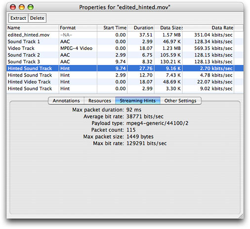
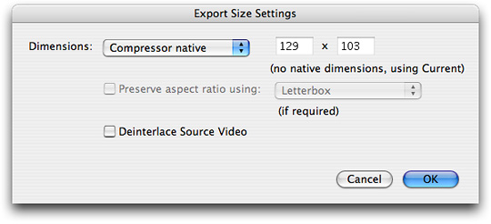
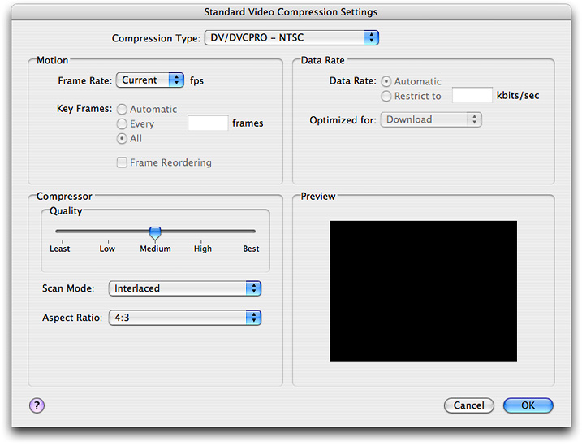
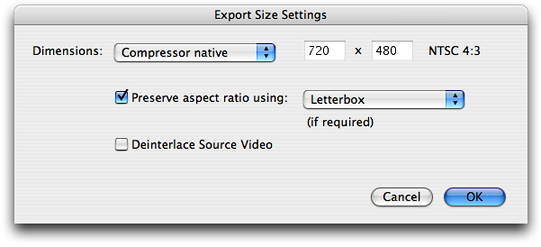
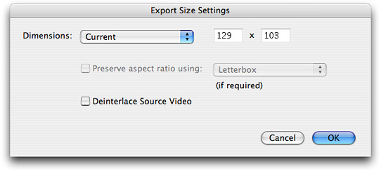
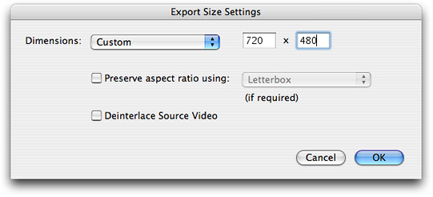
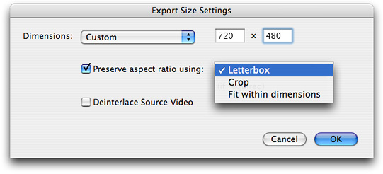
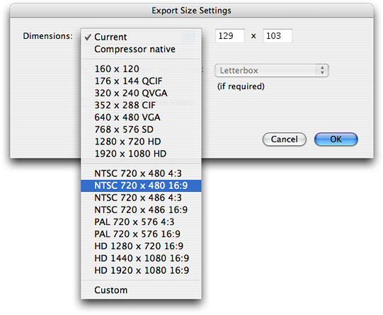
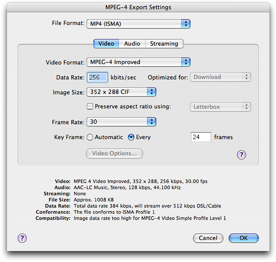

> 导航：[总目录](../../../README.md) · [documentation](../../../_indexes/documentation.md) · [QuickTime 7.1 Update Guide](Introduction%20to%20QuickTime%207.1%20Update%20Guide.md)


# New Features, Changes and Enhancements in QuickTime 7.1

If you are a developer, the QuickTime Software Development Kit (SDK) allows you to incorporate QuickTime capabilities into your applications developed directly for the Mac OS X and Windows platforms. If you are a Macintosh developer, the SDK provides you with the tools you need to port the QuickTime-based functionality of your application to Windows. This chapter discusses some of the fundamental concepts you need to understand in order to work with QuickTime on both platforms.

In addition, the chapter describes the new and enhanced features available in QuickTime 7.1. It is intended to provide developers with a conceptual overview, along with code samples and illustrations of usage, so that developers can take advantage of these new features in QuickTime 7.1 in their applications.

If you are a QuickTime API-level developer, content author, multimedia producer, or Webmaster who is currently working with QuickTime, you should read this chapter.

The QuickTime API is dedicated to extending the reach of application developers by letting them invoke the full range of multimedia’s capabilities. It supports a wide range of standards-based formats, in addition to proprietary formats from Apple and others. The QuickTime API is not static, however, and has evolved over the course of the last decade to adopt new idioms, new data structures, and new ways of doing things.

The C/C++ portion of the QuickTime API comprises more than 2700 functions that provide services to applications. These services include audio and video capture and playback; movie editing, composition, and streaming; still image import, export, and display; audio-visual interactivity, and more.

A new Cocoa (Objective-C) API for QuickTime, available in Mac OS X v10.4 and v10.3, provides a much less complex programmer interface, and represents a distillation and abstraction of the most essential QuickTime functions as a small set of classes and methods. A great deal of functionality has been packed into a relatively small objective API.

QuickTime 7 includes a number of major new features for users, developers, and content creators, including improvements in the QuickTime architecture, file format, user interface, and API. There are significant improvements in the audio, video, and metadata capabilities, as well as a new Cocoa API, and numerous other enhancements.

The QuickTime software architecture has been revised to expose platform-native interfaces on Windows to application developers. On Windows, this includes exposing QuickTime framework APIs via COM interfaces (ActiveX).

Some of the key areas of change in QuickTime 7 include:

- A shift of emphasis toward a Core Audio approach to sound, and away from the Sound Manager approach, throughout QuickTime.
- A shift of emphasis toward configuring components using component properties and an abstraction layer, or context, and away from the exclusive use of standard dialogs supplemented by direct access to low-level components.
- A shift of emphasis toward a more object-oriented organization, with more high-level functionality in QuickTime itself supporting lighter-weight applications.

If you work with audio at a relatively low level, you should become familiar with the Mac OS X Core Audio framework and learn how it differs from the older Sound Manager. The use of Core Audio concepts and data structures has become ubiquitous in QuickTime for both Mac OS X and Windows. For details, see Apple’s [Core Audio Format Specification](https://developer.apple.com/documentation/MusicAudio/Reference/CAFSpec/index.html) and the suite of [Core Audio Documentation](https://developer.apple.com/documentation/MusicAudio/index.html).

For more details, see Apple’s [Core Audio](https://developer.apple.com/documentation/MusicAudio/Reference/CoreAudio/index.html) documentation, specifically the in-line comments and documentation in the header file `CoreAudioTypes.h`. In particular, developers should look closely at the following structures for audio in `CoreAudioTypes.h`:

- `AudioStreamBasicDescription`. This structure encapsulates all the information for describing the basic format properties of a stream of audio data.
- `AudioChannelLayout`. This structure is used to specify channel layouts in files and hardware.
- `AudioBufferList`. A variable length array of AudioBuffer structures.

If you work directly with components, you should become familiar with the API for discovering, getting, and setting component properties. While standard dialogs for configuration are still common, there are often times when either no dialog or an application-specific dialog is preferable, as well as cases where low-level control or device-specific configuration is needed that a standard dialog cannot supply.

For example, the component property API allows configuration at any level of detail without requiring a user interface dialog or direct communication with low-level components. In many cases, an abstraction layer, or _context_ (either visual or audio) can be created, allowing transparent connection to different kinds of low-level components, devices, or rendering engines.

A new extensible QuickTime metadata format uses a similar method of configuration through an abstract set of properties, as a means of “future-proofing” the architecture. The same is true of the new API for working with QuickTime sample tables.

QuickTime 7 for Windows includes a new QuickTime COM/ActiveX control. This new control is fully scriptable from Visual Basic, C#, JavaScript, C++, and other applications that can host COM objects. This allows you to build stand-alone Windows applications that use QuickTime without needing to master QuickTime’s C/C++ API. Note that this new COM control is included in addition to the QuickTime ActiveX browser plug-in. They are not the same thing.

The new QuickTime COM control, discussed in greater detail in the _[QuickTime 7 for Windows Update Guide](../QuickTime%207%20for%20Windows%20Update%20Guide/Introduction%20to%20QuickTime%207%20for%20Windows.md#apple-f4xwc4dqnrsv64tfmyxwi33df52wszbpkridimbqgazdinzw)_ with code samples illustrating usage, has an API that will be familiar to Visual Basic programmers and others used to working with COM objects. It is intended to make it easy to create stand-alone Windows applications that use QuickTime. The new COM control is not a browser plug-in, and will not run in a browser or other Web-based application.

For Web-based applications, you can use the QuickTime ActiveX browser plug-in; it is scriptable using JavaScript from most browsers using the same platform-independent API as the QuickTime browser plug-ins for Netscape and Safari. The QuickTime browser plug-in is the cross-platform solution for writing Web pages that interact with QuickTime.

If you are a Visual Basic programmer or enterprise software developer doing in-house development, the COM control implementation offers a number of important advantages:

- You can build Windows desktop applications more easily with Visual Basic or C#, combining QuickTime with the rich and powerful .NET Framework.
- You can write useful utility scripts for working with QuickTime in either JavaScript or VBScript. These scripts can be run within the Windows Scripting Host environment by simply double-clicking the .js or .vbs script files, or from the command line using cscript.
- You don’t have to access the low-level functionality provided by the full QuickTime API in order to use QuickTime in your application development.

For example, if your Windows server can run a Visual Basic, C#, or .js application that uses QuickTime, you have the possibility to create custom QuickTime content interactively, delivering that content over the Web. As long as your clients have QuickTime installed, your content will work with Windows and non-Windows clients, Internet Explorer and non-Internet Explorer browsers.

QuickTime Player itself uses the new QuickTime COM control for virtually all of its access to QuickTime. Note that the QuickTime 7 ActiveX browser plug-in is not scriptable via Visual Basic. It is scriptable, however, in JavaScript using the same syntax as the Netscape-style plug-in, and works the same on all browsers for Windows or Mac OS X.

The new COM control is comprised of two separate DLLs:

- An COM/ActiveX control (`QTOControl.dll`) that “knows” how to open a movie and manage the interaction with the operating system and the host application.
- A COM library (`QTOLibrary.dll`) which provides a COM interface to a movie and to QuickTime itself.

The COM library is a very thin layer that sits on top of the low-level QuickTime APIs and provides a COM wrapper object for each logical QuickTime object. Each COM object exposes the properties, methods, and notifications of the QuickTime object it wraps.

If you are a Windows developer, you know that the Component Object Model (COM) specification defines how a host application accesses the component, how the component notifies the host application of events, standard data types for data exchange with the OS or other components. A COM control is a type of COM component that has a visual display of some kind, restricting its placement to visual containers such as a form or dialog box. COM controls typically manage their own window.

In the .NET environment, the new QuickTime COM control is accessed via the .NET Framework’s COM Interop layer. Primary Interop Assemblies (`.NET` wrappers for COM objects) will be provided with the QuickTime 7 SDK.

Note that the COM control does not provide a native managed code interface to QuickTime.

A substantial reorganization of the QuickTime engine has taken place “under the hood” in the QuickTime 7 software release. This reorganization is intended to allow increased access to QuickTime functionality from object-oriented frameworks such as Cocoa (Objective-C).

As the QuickTime document object model continues to evolve, the goal is to provide developers with easier access to the more powerful parts of the QuickTime engine using relatively lightweight object-oriented applications or even scripts, without having to delve into the large and sometimes complex procedural C/C++ QuickTime API. If you haven’t experimented with Cocoa and the Xcode tools yet, this is a good time to get started. And if you are a Windows developer, you can take advantage of the new COM/ActiveX control implementation in QuickTIme 7 using the tools available in Visual Basic .NET, C# and Visual Basic 6.

Some of the important changes in QuickTime 7 include

- A new user interface for QuickTime Player and QuickTime Pro.
- A new COM/ActiveX Control that lets you take advantage of the control using the tools available in Visual Basic .NET, C# and Visual Basic 6.
- A new Cocoa (Objective-C) framework, `QTKit.framework`, for developing QuickTime applications. This new API opens the world of QuickTime programming to a new group of developers without requiring them to learn the large, complex C/C++ QuickTime API. The new framework encapsulates a tremendous amount of QuickTime functionality in a small, easily-mastered API with a handful of new objects, classes, and methods.
- Many new audio features and enhancements, including support for multichannel sound, playback, capture, compression, and export of high-resolution audio, a new sound description, and new functions for movie audio control, audio conversion configuration, audio extraction, movie export, and level and frequency metering.
- A number of new video enhancements, including support for frame reordering video compression and the H.264 codec. Frame reordering support is a major advance that involves new sample tables for video, allowing video frames to have independent decode and display times. This allows improved display, editing, and compression of H.264 and other advanced video codecs. A new set of functions and structures are introduced to allow developers to work with samples that have independent decode and display times.
- New abstractions layers for OpenGL rendering and the new Visual Context, an abstraction layer that eliminates dependence on graphics worlds (GWorlds) and supports rendering directly to engines such as OpenGL on Mac OS X and Direct3D on Windows, beginning with QuickTime 7.1.
- Replacement of `NewMovieFrom`... functions, which allows you to set up properties before creating a movie. This function also allows you to create movies that are not necessarily associated with a graphics world, movies that can render their output to a visual context, such as an OpenGL texture buffer, and movies that play to a particular audio device.
- A new QuickTime extensible metadata format, allowing developers to efficiently reference text, audio, video, or other material that describes a movie, a track, or a media. Support is also added for including metadata from other file types in native format; the QuickTime 7 release includes native support for iTunes metadata.
- QuickTime Sample Table API, a new API for working with QT Sample Tables, which is a logical replacement for arrays of media sample references. The new API greatly extends the functionality of media sample references, and supports frame reordering compressed media.
- A new default install location for QuickTime in Windows, which has been moved from the directory `\Windows\System32\QuickTime` to `\Program Files\QuickTime`. A number of new APIs have been created to allow developers to locate the various directories created by the QuickTime installer. New updates and fixes to QuickTime for Java are also included.
- JavaScript support and accessibility in Safari, including JavaScript support for the Safari browser. This means you can now use JavaScript to control QuickTime when web pages are viewed using Safari.
- A new persistent cache option, which is important for web authors and content developers to understand because it may impact the way that QuickTime content is downloaded and saved from their websites. New updates and fixes to QuickTime for Java are also included.

QuickTime 7.1 includes a number of changes to the QuickTime Player, discussed in this section.

QuickTime Player includes a new hint track property panel for displaying hinted sound and video information to a QuickTime Pro user. Follow these steps:

1. Launch QuickTime Pro and open a movie with hinted sound and video tracks.
2. Choose Window > Show Movie Properties.
3. Select the Streaming Hints tab for a Hinted Sound Track in the track property panel.

The following new fields, with corresponding sound and video information, are displayed, as shown in [Figure 1-1](#apple-f4xwc4dqnrsv64tfmyxwi33df52wszbpkridimbqgaztknbtfvhgk52gmvqxi5lsmvzug2dbnztwk43bnzsek3timfxggzlnmvxhi43jnzixk2ldnnkgs3lfg4ys2u2xgeya):

- Maximum packet duration, in milliseconds
- Average bit rate, specified in bits per second
- Payload type
- Packet count
- Maximum packet size, specified in bytes
- Maximum bit rate, specified in bits per second

__Figure 1-1__  The new hint track property panel



QuickTime 7.1 provides QuickTime Pro users with the capability of exporting new video content from one size to another while also maintaining––that is, _preserving_––the aspect ratio for that content, or performing a scaling operation on existing content. Users may choose various export settings to accomplish this.

The source content may also be tagged with a _clean aperture_, as discussed in the next section, [Improved Visual Quality and New Aperture Mode APIs](#apple-f4xwc4dqnrsv64tfmyxwi33df52wszbpkridimbqgaztknbtfvhgk52gmvqxi5lsmvzug2dbnztwk43bnzsek3timfxggzlnmvxhi43jnzixk2ldnnkgs3lfg4ys2u2xgm). The source content may include a clean aperture, or simply be the clean image. The export source dimensions are controlled by the actual dimensions of the source movie while taking into account its aperture mode.

Follow these steps to export new or existing video content:

1. Launch QuickTime Pro and open a QuickTime movie.
2. Choose File > Export.
3. When the “Save exported file as” dialog appears, select Export: Movie to QuickTime from the items in the list.
4. Click the Options button and when the Movie Settings dialog appears, click the Size button. The new Export size settings dialog appears, as shown in Figure 1-2. This is the default setting.

__Figure 1-2__  Export size settings with compressor native dimensions selected



In this dialog (Figure 1-2), with the compressor native size item selected, the codec has a single active enforced dimension. The size is indicated in the text fields (129 x 103), which are not editable. The Preserve aspect ratio checkbox is not enabled.

Next, follow these steps:

1. Click the Video Settings button in the Movie Settings dialog and the Standard Video Compression Settings dialog (shown in Figure 1-3) appears.
2. Select the compression type from the list of compression displayed, in this case DV/DVCPro - NTSC.

__Figure 1-3__  The compression type selected



After selecting the compression type, click the Size button in the Movie Settings dialog. The new Export size settings dialog appears (shown in Figure 1-4). Note that the NTSC 4:3 aspect ratio is displayed to the right of the text fields. The Preserve aspect ratio box is checked, and the Letterbox menu item appears and can be selected.

__Figure 1-4__  Export size settings with the NTSC 4:3 aspect ratio displayed



__Figure 1-5__  Export size settings with current dimensions selected



In this dialog (Figure 1-5), the current mode is selected from the pulldown menu. The Preserve aspect ratio checkbox is disabled. The current size (129 x 103) is shown in the text fields but cannot be edited.

__Figure 1-6__  Export size settings with custom dimensions selected



In this dialog (Figure 1-6), the custom mode is selected from the pulldown menu. The Preserve aspect ratio checkbox is enabled and can be selected. All scaling modes are supported. The size fields are editable.

__Figure 1-7__  Export size settings with preserve aspect ratio checkbox and letterbox selected



In this dialog (Figure 1-7), the custom dimensions item is selected. The size (720 x 480) is editable in the text fields. The Preserve aspect ratio checkbox is enabled, and can be selected. All scaling modes, including Letterbox, Crop, and Fit within dimensions, are supported.

The following options are provided:

- _Preserve aspect ratio_. When this item is checked, the picture aspect ratio of the source movie is preserved by choosing one of three options:

  - _Letterbox_. This scales the source proportionally to fit in the clean aperture of the destination, adding black bars on the top/bottom or left/right as necessary.
  - _Crop_. Scales the source and trims to fit the clean aperture of the destination, centered.
  - _Fit within dimensions_. Adjusts the destination size so that the source fits within the selected dimensions by fitting to the shortest side, and scales the source to the destination.

  Note that when the Preserve aspect ratio checkbox is not checked, the source image is stretched to fit the destination size.

__Figure 1-8__  Selecting the NTSC aspect ratio



In this dialog (Figure 1-8), with the current dimensions item selected, the user may select the dimensions and the aspect ratio, in this case NTSC 720 x 480 16:9.

__Figure 1-9__  MPEG-4 export settings dialog with a Preserve aspect ratio checkbox



When the Save exported file as... dialog opens, you select Export: Movie to MPEG-4 and click the Options button. The MPEG-4 export setting dialog appears with the video tab selected (Figure 1-9). If you click the Preserve aspect ratio checkbox, the Letterbox menu item is hilited, and you have the choice of selecting the Letterbox, Crop, or Fit within size items.

Before discussing the new aperture mode APIs available in QuickTime 7.1, it may be useful to understand a few key terms:

- _Clean aperture_. The region of video that is clean of transition artifacts due to the encoding of the signal. This is the region of video that should be displayed to users.
- _Pixel aspect ratio_. The aspect ratio of the raw pixels in the source media. Typical picture aspect ratios are square (1:1), 10:11, and so on.
- _Picture aspect ratio_. The aspect ratio of the picture. Some typical picture aspect ratios are 4:3 and 16:9.
- _Conforming_. The process of adding or adjusting a movie to allow for video correction.

Typically, QuickTime tracks have a specified width and height in pixels. They are transformed into the movie coordinate system by a matrix and clip. The movie box is the bounding box of all the transformed tracks. A QuickTime movie is transformed into the display coordinate system by another matrix and clip. Both the movie and the display coordinate system are to be square.

An implicit scaling occurs between the image description width and height and the track width and height. Multiple image descriptions may exist in one track; each sample is scaled appropriately from the sample dimensions to the track dimensions.

There is no correction for the pixel aspect ratio or clean aperture between the sample and the track. Information about pixel aspect ratios and clean aperture may be stored in the sample description but is generally ignored. For example, DV movies are saved as 720 x 480 (non-square) pixels and displayed as 720 x 480 (square) pixels. This results in distorted playback of content. (If the pixel aspect ratio and clean aperture were obeyed, the movie would use 640 x 480 square pixels on the screen.)

Typically, QuickTime video content may be tagged with two image description extensions, one that describes the pixel aspect ratio (`'pasp'`), and the other that describes the clean aperture (`'clap'`) of the video frame. The clean aperture is the region free of edge-encoding artifacts. Together, these extensions define the correct way to scale non-square pixel content to square-pixel computer displays.

QuickTime 7.1 now provides improved quality of video playback in QuickTime by _correcting_ for non-square pixels and the clean aperture. The visual quality of DV (and other Pro media) playback is maximized in QuickTime Player by displaying DV at the correct aspect ratio, including PAL and 16 x 9 content, and by cropping to the clean aperture.

This enhanced visual quality is performed on new as well as existing QuickTime media content. By default, existing content appears as before in all applications. New content includes information to correct for the clean aperture and aspect ratio for use in supporting applications. The behavior of non-supporting applications is not affected.

QuickTime 7.1 provides a number of new APIs, described briefly in this document in the section New Aperture Mode APIs and more completely in the _[QuickTime 7.1 Update Reference](https://developer.apple.com/library/archive/documentation/QuickTime/Reference/QT7-1_Update_Reference/index.html#//apple_ref/doc/uid/TP40004221)_. These APIs let you set the aperture mode for a movie. The aperture mode is not stored in the movie, but is specified as a rendering preference. QuickTime Player also lets you set the current mode.

Tracks store additional width and height information that are used when cropping and scaling. These are _aperture mode dimensions_. Conforming scans the media to generate the aperture mode dimensions. New content is created automatically with this information. QuickTime Player allows users to add this information by conforming the movie.

QuickTime 7.1 users are impacted by the new aperture mode implementation in several ways, as discussed in this section.

Both new and existing QuickTime applications may behave differently when rendering images. For example, in the following aperture modes, you find this:

- _Classic_. Content appears as it did in QuickTime 7. The existing track dimensions are respected. A DV NTSC (4:3 or 16:9) track appears as 720 x 480.
- _Clean_. Content may appear different than in QuickTime 7. Conformed tracks are cropped to the clean aperture mode and scaled according to the pixel aspect ratio. The resulting movie composition may be different, as may the movie box. This is the new default for consumer applications. A 4:3 DV NTSC track appears as 640 x 480; a 16:9 DV NTSC track appears as 853 x 480.
- _Production_. Content may appear different than in QuickTime 7. Conformed tracks are not cropped to the clean aperture mode, but they are scaled according to the pixel aspect ratio. The resulting movie composition may be different, as may the movie box. This would be typically used for professional applications wanting to see all the pixels, but with the correct aspect ratio. A 4:3 DV NTSC track appears as 654 x 480; a 16:9 DV NTSC track appears as 873 x 480.
- _Encoded pixels_. Content typically appears the same as QuickTime 7. Conformed tracks are not cropped to the clean aperture mode, and are not scaled according to the pixel aspect ratio. The encoded dimensions of the image description are displayed. This would be typically used to preview rendering (where you want all pixels) in a professional application. A DV NTSC (4:3 or 16:9) track appears as 720 x 480.

When opened in QuickTime Player, a movie appears corrected if it has aperture mode dimensions. QuickTime Player respects the other aperture modes as well. The user can toggle the aperture modes to see how the content is displayed in these modes. The default mode is clean.

Existing QuickTime movies can be viewed correctly by conforming the movie. QuickTime Pro users can modify their content so that it displays correctly according to the aperture mode.

Other applications will default to show the classic mode, respecting the existing behavior. Those applications that want to leverage this new feature can opt in to using the clean mode (or other mode) and could call the new APIs to conform content.

Supported file formats to be tagged at capture and on export include:

- DV / DVCPro NTSC
- DVPAL
- DVCPro PAL
- DVCPro 50 NTSC
- DVCPro 50 PAL
- DVCPro HD 1080i 60
- DVCPro HD 1080i 50
- DVCPro HD 720p 30

File formats with existing tagged content that have aperture mode enabled when conformed include:

- HDV 1080i 60
- HDV 720p 30
- iCodec 1080i 60
- iCodec 720p 30
- Uncompressed formats, including Apple 2vuy, Apple v210, and Pinnacle CineWave

Nine new aperture mode APIs are available in QuickTime 7.1. The complete description of each API, with its function prototype, parameters, and discussion of usage is available in the _[QuickTime 7.1 Update Reference](https://developer.apple.com/library/archive/documentation/QuickTime/Reference/QT7-1_Update_Reference/index.html#//apple_ref/doc/uid/TP40004221)_. The new APIs include

- `SetTrackApertureModeDimensionsUsingSampleDescription`. Sets a track’s aperture mode dimensions using values calculated using a sample description.
- `GenerateMovieApertureModeDimensions`. Examines a movie and sets up track aperture mode dimensions.
- `GenerateTrackApertureModeDimensions`. Examines a track and sets up aperture mode dimensions.
- `RemoveMovieApertureModeDimensions`. Removes aperture mode dimension information from a movie.
- `RemoveTrackApertureModeDimensions`. Removes aperture mode dimension information from a track.
- `MediaSetTrackApertureModeDimensionsUsingSampleDescription`. Sets the three aperture mode dimension properties on the track, calculating the values using the provided sample description.
- `MediaGetApertureModeClipRectForSampleDescriptionIndex`. Calculates a source clip rectangle appropriate for the current aperture mode and the given sample description.
- `MediaGetApertureModeMatrixForSampleDescriptionIndex`. Calculates a matrix appropriate for the current aperture mode and the given sample description.
- `MediaGenerateApertureModeDimensions`. Examines media and sets up track aperture mode dimensions.

The following code snippet demonstrates how to set an aperture mode, using the `SetMovieApertureMode` routine. The routine is called to set the specified movie aperture mode in a movie. At that time, do conforming if the specified movie does not have the aperture mode dimensions in order to make sure that the video correction is performed correctly.

```
OSErr SetMovieApertureMode(Movie theMovie, OSType theApertureMode)
{
     OSErr err;
     if ( theApertureMode != kQTApertureMode_Classic ) {
            Boolean hasApertureModeDimensions;

            err = QTGetMovieProperty(theMovie,
                                              kQTPropertyClass_Visual,
                                              kQTVisualPropertyID_HasApertureModeDimensions,
                                              sizeof(hasApertureModeDimensions),
                                              &hasApertureModeDimensions,
                                              NULL);
            if ( err ) goto bail;

            if ( !hasApertureModeDimensions ) {
                   err = GenerateMovieApertureModeDimensions(theMovie);
                   if ( err ) goto bail;
            }
    }
    err = QTSetMovieProperty(theMovie, kQTPropertyClass_Visual, kQTVisualPropertyID_ApertureMode, sizeof(theApertureMode), &theApertureMode);
bail:
     return err;
}
```


QuickTime 7.1 provides an Objective-C (Cocoa) version of the new aperture mode support introduced in QuickTime, available in the _[QuickTime Kit Framework Reference](https://developer.apple.com/documentation/qtkit)_.

In order to allow QTKit clients to select different aperture modes for viewing and other operations (such as export), new methods, attribute types, and notifications have been added. Existing applications default to classic mode, which provides compatibility with behavior in QuickTime 7.0.x and earlier.

The new QTKit APIs are discussed briefly in this section. For more detailed explanations, refer specifically to the _QTMovie Class Reference_ and the _QTTrack Class Reference_.

The following attributes are new to the QTMovie class:

```
QTMovieApertureModeAttribute
QTMovieHasApertureModeDimensionsAttribute // NSNumber (BOOL)
```

You can set the aperture mode attribute on a QTMovie object to indicate whether aspect ratio and clean aperture correction should be performed. When a movie is in clean, production, or encoded pixels aperture mode, the dimensions of each track are overridden by special dimensions for that mode. The original track dimensions are preserved and can be restored by setting the movie into classic aperture mode. Note that aperture modes are _not_ saved in movies.

You can get the value of the attribute to determine whether aperture mode dimensions have been set on any track in this QTMovie object, even if those dimensions are all identical to the classic dimensions (as is the case for content with square pixels and no edge-processing region).

The following notification has been added to the QTMovie class:

```
QTMovieApertureModeDidChangeNotification
```

This notification is issued when the aperture mode of the target QTMovie object changes.

Two new methods are added:

```objc
- (void)generateApertureModeDimensions
- (void)removeApertureModeDimensions
```

The `generateApertureModeDimensions` method adds information to a QTMovie needed to support aperture modes for tracks created with applications and/or versions of QuickTime that did not support aperture mode dimensions.

If the image descriptions in video tracks lack tags describing clean aperture and pixel aspect ratio information, the media data is scanned to see if the correct values can be divined and attached. Then the aperture mode dimensions are calculated and set.

Afterwards, the `QTTrackHasApertureModeDimensionsAttribute` property will be set to `YES` for those tracks. Tracks that do not support aperture modes are not changed.

The `removeApertureModeDimensions` method removes aperture mode dimension information from a movie's tracks. It does not attempt to modify sample descriptions, so it may not completely reverse the effects of `generateApertureModeDimensions`. It sets the `QTMovieHasApertureModeDimensionsAttribute` property to `NO`.

The following attribute is new to the QTTrack class:

```
QTTrackHasApertureModeDimensionsAttribute  // NSNumber (BOOL)
```

You can get the value of this attribute to determine whether aperture mode dimensions have been set on a track, even if they are all identical to the classic dimensions (as is the case for content with square pixels and no edge-processing region).

Four new methods are added:

```objc
- (NSSize)apertureModeDimensionsForMode:(NSString *)mode
- (void)setApertureModeDimensions:(NSSize)dimensions forMode:(NSString *)mode
- (void)generateApertureModeDimensions
- (void)removeApertureModeDimensions
```

The `apertureModeDimensionsForMode:` method returns an NSSize value that indicates the dimensions of the target track for the specified movie aperture mode. For instance, passing a mode of `QTMovieApertureModeClean` would cause `apertureModeDimensionsForMode:` to return the track dimensions to use in clean aperture mode.

The `setApertureModeDimensions:forMode:` method sets the dimensions of the target track for the specified movie aperture mode.

The `generateApertureModeDimensions` method adds information to a QTTrack needed to support aperture modes for tracks created with applications and/or versions of QuickTime that did not support aperture mode dimensions.

If the image descriptions in the track lack tags describing clean aperture and pixel aspect ratio information, the media data is scanned to see if the correct values can be divined and attached. Then the aperture mode dimensions are calculated and set.

Afterwards, the `QTTrackHasApertureModeDimensionsAttribute` property will be set to `YES` for this track. Tracks that do not support aperture modes are not changed.

The `removeApertureModeDimensions` method removes the aperture mode dimension information from the target track. It does not attempt to modify sample descriptions, so it may not completely reverse the effects of `generateApertureModeDimensions`. It sets the `QTTrackHasApertureModeDimensionsAttribute` property to `NO`.

QuickTime 7.1 supports using visual contexts for playing video through Direct3D textures, mirroring the visual context support for OpenGL available on Mac OS X, beginning with QuickTime 7.

This support is very useful for applications that want to play video to textures and do further image manipulation in hardware, or for applications that want to take advantage of more efficient playback paths for certain media types.

Applications can take advantage of this by using the ActiveX Control or by coding to the visual context APIs directly.

With Direct3D texture visual contexts, the application is responsible for creating the Direct3DDevice9 which the visual context will use to allocate and manage textures. Since QuickTime 7.1 does not require DirectX9 on users’ systems, it is left up to applications to test for its presence before attempting to use visual contexts. Even if DirectX9 is installed, the graphics hardware might be underpowered; in this case, `QTDirect3DTextureContextCreate` will return an error indicating that visual contexts are not supported. It will also return this error if the user disables video acceleration in the QuickTime control panel.

In order to support visual contexts, the graphics hardware must not be restricted to power-of-2 texture sizes; it must support at least version 1.1 pixel-shaders, and have at least 32MB free texture memory.

When faced with insufficient graphics hardware, the application can either fall back to QuickDraw by providing a GWorld to `SetMovieGWorld` or handle the failure in some other way (for example, failing to run, and so on).

As with the Mac OS X implementation, some types of media may not perform well with visual contexts. QuickTime Player and the ActiveX Control will fall back to using QuickDraw for media such as MPEG-1, MPEG-2, interactive sprites, Flash, VR, QT effects and some other obscure types of media. Applications can examine the movie to determine if such media exists.

As for basic usage, the movie frames will arrive from the `QTVisualContextCopyImageForTime` function as CVDirect3DTextureRefs. Similar to Mac OS X, you query this `CVDirect3DTextureRef` with `CVDirect3DTextureGetName`, and it will return the texture as a `LPDIRECT3DTEXTURE9` pointer. Querying the CVDirect3DTextureRef with `CVDirect3DTextureGetCleanTexCoords` will return texture coordinates ready to be sent into your VertexBuffer. QuickTime generates these buffers as single level (that is, not mip-mapped) textures, allocated in either the `D3DPOOL_MANAGED` or `D3DPOOL_DEFAULT` Direct3D memory pools.

Visual context is an abstraction that represents a visual output destination for a movie, and is intended to decouple QuickTime from graphics worlds (GWorlds). This decoupling allows programmers to work in QuickTime without needing to understand QuickDraw, and to more easily render QuickTime directly using engines such as OpenGL on Mac OS X or Direct3D on Windows.

A visual context can act as a virtual output device, rendering the movie’s visual output, streaming it, storing it, or processing it in any number of ways.

A visual context can also act as a bridge between a QuickTime movie and an application’s visual rendering environment. For example, you can set up a visual context for OpenGL or Direct3D textures. This causes a movie to produce its visual output as a series of OpenGL textures. You can then pass the textures to OpenGL or Direct3D for rendering, without having to copy the contents of a `GWorld` and transform it into an OpenGL or Direct3D texture yourself. In this case, the visual context performs the transformation from pixel buffers to OpenGL or Direct3D textures and delivers the visual output to your application.

A `QTVisualContextRef` is an opaque token that represents a drawing destination for a movie. The visual context is, in object-oriented terms, a base class for other concrete implementations of visual rendering environments. The output of the visual context depends entirely on the implementation. The implementation supplied with QuickTime 7.1 produces a series of OpenGL or Direct3D textures, but the list of possible outputs is extensible.

You create a visual context by calling a function that instantiates a context of a particular type, such as `[QTOpenGLTextureContextCreate](../../QT7Win_Update_Guide/Chapter03/03QT7_Update_Guide.md#apple-f4xwc4dqnrsv64tfmyxwgl3govxggl2rkrhxazloi5gfizlyor2xezkdn5xhizlyorbxezlborsq)` on Mac OS X. This allocates a context object suitable for passing to functions such as `[SetMovieVisualContext](../../QT7UpdateGuide/Chapter03/03QT7_Update_Guide.md#apple-f4xwc4dqnrsv64tfmyxwgl3govxggl2tmv2e233wnfsvm2ltovqwyq3pnz2gk6du)` or `[NewMovieFromProperties](../../QT7Win_Update_Guide/Chapter03/03QT7_Update_Guide.md#apple-f4xwc4dqnrsv64tfmyxwgl3govxggl2omv3u233wnfsum4tpnvihe33qmvzhi2lfom)`, which target the visual output of the movie to the specified context.

To use a visual context with a QuickTime movie, you should instantiate the movie using the `[NewMovieFromProperties](../../QT7Win_Update_Guide/Chapter03/03QT7_Update_Guide.md#apple-f4xwc4dqnrsv64tfmyxwgl3govxggl2omv3u233wnfsum4tpnvihe33qmvzhi2lfom)` function. This creates a movie that can accept a visual context. You can either specify the desired visual context when you instantiate the movie, or set the initial visual context to `NIL` (to prevent the movie from inheriting the current `GWorld`), and set the visual context later using `[SetMovieVisualContext](../../QT7UpdateGuide/Chapter03/03QT7_Update_Guide.md#apple-f4xwc4dqnrsv64tfmyxwgl3govxggl2tmv2e233wnfsvm2ltovqwyq3pnz2gk6du)`.

It is also possible to set a visual context for a movie that was instantiated using an older function, such as `NewMovieFromFile`. Such a movie will be associated with a `GWorld`. You change this to a visual context by first calling `[SetMovieVisualContext](../../QT7UpdateGuide/Chapter03/03QT7_Update_Guide.md#apple-f4xwc4dqnrsv64tfmyxwgl3govxggl2tmv2e233wnfsvm2ltovqwyq3pnz2gk6du)` on the movie with the visual context set to `NIL`. This dissociates the movie from its `GWorld` (or any previous visual context). You can then call `[SetMovieVisualContext](../../QT7UpdateGuide/Chapter03/03QT7_Update_Guide.md#apple-f4xwc4dqnrsv64tfmyxwgl3govxggl2tmv2e233wnfsvm2ltovqwyq3pnz2gk6du)` a second time, this time passing in a `QTVisualContextRef`.

Windows developers can now use the following visual context APIs available in QuickTime 7.1, described briefly in this section. A complete description of these APIs is available in the _[QuickTime 7.1 Update Reference](https://developer.apple.com/library/archive/documentation/QuickTime/Reference/QT7-1_Update_Reference/index.html#//apple_ref/doc/uid/TP40004221)_.

- `[GetMovieVisualContext](../../QT7UpdateGuide/Chapter03/03QT7_Update_Guide.md#apple-f4xwc4dqnrsv64tfmyxwgl3govxggl2hmv2e233wnfsvm2ltovqwyq3pnz2gk6du)`. Returns the `QTVisualContext` object associated with the movie. It was introduced in QuickTime 7 for Mac OS X, and is now available for Windows..
- `[ICMDecompressionSessionCreateForVisualContext](../../QT7Win_Update_Guide/Chapter03/03QT7_Update_Guide.md#apple-f4xwc4dqnrsv64tfmyxwgl3govxggl2jinguizldn5wxa4tfonzws33oknsxg43jn5xeg4tfmf2gkrtpojlgs43vmfweg33oorsxq5a)`. Creates a session for decompressing video frames. Frames will be output to a visual context. If desired, the `trackingCallback` may attach additional data to pixel buffers before they are sent to the visual context.
- `QTDirect3DTextureContextCreate`. New in QuickTime 7.1 and intended for use by Windows developers who want to do 3D texture rendering in their applications. Given a Direct3D device, you create a visual context to draw into it. This routine works similar to `[QTOpenGLTextureContextCreate](../../QT7Win_Update_Guide/Chapter03/03QT7_Update_Guide.md#apple-f4xwc4dqnrsv64tfmyxwgl3govxggl2rkrhxazloi5gfizlyor2xezkdn5xhizlyorbxezlborsq)` on Mac OS X.
- `[QTVisualContextCopyImageForTime](../../QT7UpdateGuide/Chapter03/03QT7_Update_Guide.md#apple-f4xwc4dqnrsv64tfmyxwgl3govxggl2rkrlgs43vmfweg33oorsxq5cdn5yhsslnmftwkrtpojkgs3lf)`. Retrieves an image buffer from the visual context, indexed by the provided time. You should not request image buffers further ahead of the current time than the read-ahead time specified with the `kQTVisualContextExpectedReadAheadKey` attribute. You may skip images by passing later times, but you may not pass an earlier time than passed to a previous call to this function.
- `[QTVisualContextGetAttribute](../../QT7UpdateGuide/Chapter03/03QT7_Update_Guide.md#apple-f4xwc4dqnrsv64tfmyxwgl3govxggl2rkrlgs43vmfweg33oorsxq5chmv2ec5duojuwe5lumu)`. Returns a visual context attribute.
- `[QTVisualContextGetTypeID](../../QT7UpdateGuide/Chapter03/03QT7_Update_Guide.md#apple-f4xwc4dqnrsv64tfmyxwgl3govxggl2rkrlgs43vmfweg33oorsxq5chmv2fi6lqmveui)`. Returns the `CFTypeID` for `QTVisualContextRef`. You can use this function to test whether a `CFTypeRef` that extracted from a CF container such as a `CFArray` was a `QTVisualContextRef`.
- `[QTVisualContextIsNewImageAvailable](../../QT7UpdateGuide/Chapter03/03QT7_Update_Guide.md#apple-f4xwc4dqnrsv64tfmyxwgl3govxggl2rkrlgs43vmfweg33oorsxq5cjonhgk52jnvqwozkbozqws3dbmjwgk)`. Queries whether a new image is available for a given time. This function returns `TRUE` if there is a image available for the specified time that is different from the last image retrieved from `[QTVisualContextCopyImageForTime](../../QT7UpdateGuide/Chapter03/03QT7_Update_Guide.md#apple-f4xwc4dqnrsv64tfmyxwgl3govxggl2rkrlgs43vmfweg33oorsxq5cdn5yhsslnmftwkrtpojkgs3lf)`.
- `[QTVisualContextSetAttribute](../../QT7UpdateGuide/Chapter03/03QT7_Update_Guide.md#apple-f4xwc4dqnrsv64tfmyxwgl3govxggl2rkrlgs43vmfweg33oorsxq5ctmv2ec5duojuwe5lumu)`. Sets a visual context attribute.
- `[QTVisualContextSetImageAvailableCallback](../../QT7UpdateGuide/Chapter03/03QT7_Update_Guide.md#apple-f4xwc4dqnrsv64tfmyxwgl3govxggl2rkrlgs43vmfweg33oorsxq5ctmv2es3lbm5suc5tbnfwgcytmmvbwc3dmmjqwg2y)`. Installs a user-defined callback to receive notifications when a new image becomes available. Due to unpredictable activity, such as user seeks or the arrival of streaming video packets from a network, new images may become available for times supposedly occupied by previous images. Applications using the CoreVideo display link to drive rendering probably do not need to install a callback of this type, since they will already be checking for new images at a sufficient rate.
- `[QTVisualContextRelease](../../QT7UpdateGuide/Chapter03/03QT7_Update_Guide.md#apple-f4xwc4dqnrsv64tfmyxwgl3govxggl2rkrlgs43vmfweg33oorsxq5csmvwgkyltmu)`. Releases a visual context object. When the retain count decreases to zero the visual context is disposed.
- `[QTVisualContextRetain](../../QT7UpdateGuide/Chapter03/03QT7_Update_Guide.md#apple-f4xwc4dqnrsv64tfmyxwgl3govxggl2rkrlgs43vmfweg33oorsxq5csmv2gc2lo)`. Retains a visual context object.
- `[QTVisualContextTask](../../QT7UpdateGuide/Chapter03/03QT7_Update_Guide.md#apple-f4xwc4dqnrsv64tfmyxwgl3govxggl2rkrlgs43vmfweg33oorsxq5cumfzww)`. Enables the visual context to release internally held resources for later re-use. For optimal resource management, call this function in every rendering pass, after old images have been released, and new images have been used and all rendering has been flushed to the screen. This call is not mandatory.
- `[SetMovieVisualContext](../../QT7UpdateGuide/Chapter03/03QT7_Update_Guide.md#apple-f4xwc4dqnrsv64tfmyxwgl3govxggl2tmv2e233wnfsvm2ltovqwyq3pnz2gk6du)`. This routine targets a movie to render into a visual context. When `[SetMovieVisualContext](../../QT7UpdateGuide/Chapter03/03QT7_Update_Guide.md#apple-f4xwc4dqnrsv64tfmyxwgl3govxggl2tmv2e233wnfsvm2ltovqwyq3pnz2gk6du)` succeeds, it will retain the `QTVisualContext` object for its own use. If `visualContext` is `NULL`, the movie will not render any visual media. The `[SetMovieVisualContext](../../QT7UpdateGuide/Chapter03/03QT7_Update_Guide.md#apple-f4xwc4dqnrsv64tfmyxwgl3govxggl2tmv2e233wnfsvm2ltovqwyq3pnz2gk6du)` routine will fail if a different movie is already using the visual context, so you should first `disassociate` the other movie by calling `[SetMovieVisualContext](../../QT7UpdateGuide/Chapter03/03QT7_Update_Guide.md#apple-f4xwc4dqnrsv64tfmyxwgl3govxggl2tmv2e233wnfsvm2ltovqwyq3pnz2gk6du)` with a NULL `visualContext`.

  Note that calling `SetMovieGWorld` on a movie that is connected to a visual context will work, but it may still keep a reference to the visual context. If you wish to completely disconnect the visual context, make sure to first call `[SetMovieVisualContext](../../QT7UpdateGuide/Chapter03/03QT7_Update_Guide.md#apple-f4xwc4dqnrsv64tfmyxwgl3govxggl2tmv2e233wnfsvm2ltovqwyq3pnz2gk6du)` with a NULL `visualContext`.

The Windows D3DVisualContext sample demonstrates how to use visual context in a Direct3D application. It lets you do simple movie playback, but also more complex tasks, such as tracking mouse drags to allow rotation of a playing movie.

The code sample, which is reproduced in full here and commented in some detail, demonstrates how to

- set up your d3ddevice
- create a visual context
- set the movie
- pull textures from the visual context

__Listing 1-1__  Windows D3DVisualContext sample application

```c
#include <Windows.h>
#include <mmsystem.h>
#include <d3dx9.h>
#include <process.h>
#include <stdio.h>
#include <QTML.h>
#include <Movies.h>
#include <ImageCompression.h>
#include <CoreFoundation.h>

#ifndef WM_MOUSEWHEEL
#define WM_MOUSEWHEEL 0x020A
#endif
#ifndef WHEEL_DELTA
#define WHEEL_DELTA 120
#endif


// Global variables
HWND                    hWnd;

// Movie variables
QTVisualContextRef        d3dContext = NULL;
Movie                    textureMovie = NULL;
UInt32                    movieHeight = 720;
UInt32                    movieWidth = 1280;
TimeValue                movieDuration = 0;
CVImageBufferRef        cvImage = NULL;

// D3D variables
LPDIRECT3D9             pD3D = NULL;
LPDIRECT3DDEVICE9       gD3DDevice = NULL;
LPDIRECT3DVERTEXBUFFER9 vertexBuffer = NULL;
LPDIRECT3DTEXTURE9      movieTexture = NULL;
FLOAT                    currZRotation = 0;
FLOAT                    currYRotation = 0;
FLOAT                    currXRotation = 0;
FLOAT                    gEyePtX = 0.0f;
FLOAT                    gEyePtY = 0.0f;
FLOAT                    gEyePtZ = -2.39f;
int                        gLastMouseXPos = 0;
int                        gLastMouseYPos = 0;
float                    topLeft[2], topRight[2], bottomRight[2], bottomLeft[2];


// Render thread variables
HANDLE                    fastRenderThread = NULL;
unsigned int            fastRenderThreadID = 0;
HANDLE                    renderCondition = NULL;
Boolean                    fastRenderThreadRunning = false;
Boolean                    quitFastRenderThread = false;
UInt32                    renderWaitTime;


// Prototypes
void Render(CVImageBufferRef newCVImageRef);


struct CUSTOMVERTEX
{
    FLOAT        x, y, z; // The position
    FLOAT       tu, tv;   // The texture coordinates
};
#define D3DFVF_CUSTOMVERTEX (D3DFVF_XYZ|D3DFVF_TEX1)


//-----------------------------------------------------------------------------
// Name: InitD3D()
// Desc: Initializes Direct3D
//-----------------------------------------------------------------------------
HRESULT InitD3D( HWND hWnd )
{
    CVReturn cvErr = noErr;
    OSStatus err = noErr;
    UInt32 displayRefreshRate = 0;

    // Create the D3D object.
    if( NULL == ( pD3D = Direct3DCreate9( D3D_SDK_VERSION ) ) )
        return E_FAIL;

    // Set up the structure used to create the D3DDevice. Since we are now
    // using more complex geometry, we will create a device with a zbuffer.
    D3DPRESENT_PARAMETERS d3dpp;
    ZeroMemory( &d3dpp, sizeof(d3dpp) );
    d3dpp.Windowed = TRUE;
    d3dpp.SwapEffect = D3DSWAPEFFECT_DISCARD;
    d3dpp.BackBufferFormat = D3DFMT_A8R8G8B8;
    d3dpp.EnableAutoDepthStencil = TRUE;
    d3dpp.AutoDepthStencilFormat = D3DFMT_D16;
    d3dpp.PresentationInterval = D3DPRESENT_INTERVAL_ONE;
    d3dpp.hDeviceWindow = hWnd;

    // Create the D3DDevice.
    // It is essential that the D3DCREATE_MULTITHREADED flag be set when we create
    // the device, because QuickTime will want to access textures to decompress video into
    // them on a background thread, and be able to provide those textures to the app to be
    // rendered on yet another thread if the app so desires.
    // It is also important to request that Direct3D not alter the precision of the floating-point processor
    // by passing the D3DCREATE_FPU_PRESERVE flag when creating the device.
    // Without this flag, Direct3D will change the FPU to single-precision on the thread
    // on which the Direct3DDevice is created. QuickTime may behave unexpectedly if called
    // on threads which are not set to double-precision FPU state.
    if( FAILED( pD3D->CreateDevice( D3DADAPTER_DEFAULT, D3DDEVTYPE_HAL, hWnd,
                                     D3DCREATE_HARDWARE_VERTEXPROCESSING | D3DCREATE_MULTITHREADED | D3DCREATE_FPU_PRESERVE,
                                      &d3dpp, &gD3DDevice ) ) )
    {
        return E_FAIL;
    }

    // Turn off culling
    gD3DDevice->SetRenderState( D3DRS_CULLMODE, D3DCULL_NONE );

    // Turn off D3D lighting
    gD3DDevice->SetRenderState( D3DRS_LIGHTING, FALSE );

    // Turn on the zbuffer
    gD3DDevice->SetRenderState( D3DRS_ZENABLE, TRUE );

    gD3DDevice->SetRenderState( D3DRS_ALPHABLENDENABLE, FALSE );
    gD3DDevice->SetRenderState( D3DRS_SRCBLEND, D3DBLEND_SRCALPHA );
    gD3DDevice->SetRenderState( D3DRS_DESTBLEND, D3DBLEND_INVSRCALPHA );
    gD3DDevice->SetRenderState( D3DRS_ALPHATESTENABLE, FALSE );


    // This may fail if the video hardware doesn't support VC
    err = QTDirect3DTextureContextCreate( NULL, (void*)gD3DDevice, D3DFMT_A8R8G8B8, NULL, &d3dContext );
    if (noErr != err)
        return E_FAIL;


    // Get the refresh rate of the display. We want to poll for new textures from the VisualContext
    // at this rate.
    D3DDISPLAYMODE displayMode;
    ZeroMemory( &displayMode, sizeof(displayMode) );
    pD3D->GetAdapterDisplayMode(D3DADAPTER_DEFAULT, &displayMode);

    if (displayMode.RefreshRate != 0)
        displayRefreshRate = displayMode.RefreshRate;
    else
        displayRefreshRate = 60;

    // Convert display refresh to the number of milliseconds between refreshes to use for
    // our WaitNextEvent timer on the render thread.
    renderWaitTime = (1000/displayRefreshRate);

    return S_OK;
}


// Open the movie.
void makeMovie(Handle sourceMovieDataRef, OSType sourceMovieDataRefType)
{
    OSStatus err = noErr;
    DataReferenceRecord dataRefRec;
    Boolean movieActive = true;
    QTNewMoviePropertyElement newMovieProperties[3] = {0};
    Rect    movieRect;

    dataRefRec.dataRef = sourceMovieDataRef;
    dataRefRec.dataRefType = sourceMovieDataRefType;

    newMovieProperties[0].propClass = kQTPropertyClass_DataLocation;
    newMovieProperties[0].propID = kQTDataLocationPropertyID_DataReference;
    newMovieProperties[0].propValueSize = sizeof(dataRefRec);
    newMovieProperties[0].propValueAddress = &dataRefRec;

    newMovieProperties[1].propClass = kQTPropertyClass_Context;
    newMovieProperties[1].propID = kQTContextPropertyID_VisualContext;
    newMovieProperties[1].propValueSize = sizeof(d3dContext);
    newMovieProperties[1].propValueAddress = &d3dContext;

    newMovieProperties[2].propClass = kQTPropertyClass_NewMovieProperty;
    newMovieProperties[2].propID = kQTNewMoviePropertyID_Active;
    newMovieProperties[2].propValueSize = sizeof(movieActive);
    newMovieProperties[2].propValueAddress = &movieActive;

    // Create our movie with NewMovieFromProperties so that we can associate it with a
    // VisualContext from the start and not have it associated with a GWorld.
    // Alternately, we could create the movie using NewMovieFromProperties without providing
    // a VisualContext and later set the VisualContext for the movie with SetMovieVisualContext().
    err = NewMovieFromProperties( 3, newMovieProperties, 0, NULL, &textureMovie );

    movieDuration = GetMovieDuration(textureMovie);

    Rect    box;
    GetMovieBox(textureMovie, &box);
    MacOffsetRect(&box, -box.left, -box.top);
    SetMovieBox(textureMovie, &box);


    MoviesTask(textureMovie, 0);

    GetMovieBox(textureMovie, &movieRect);
    movieHeight = movieRect.bottom - movieRect.top;
    movieWidth = movieRect.right - movieRect.left;
}

//-----------------------------------------------------------------------------
// Name: InitGeometry()
// Desc: Create the textures and vertex buffers
//-----------------------------------------------------------------------------
HRESULT InitGeometry()
{
    // Create the vertex buffer for Rectangular view.
    if( FAILED( gD3DDevice->CreateVertexBuffer( 4*sizeof(CUSTOMVERTEX),
                                                0, D3DFVF_CUSTOMVERTEX,
                                                D3DPOOL_DEFAULT, &vertexBuffer, NULL ) ) )
    {
        return E_FAIL;
    }
    return S_OK;
}

VOID SetupVertices()
{
    // Map the textures onto scene coordinates. Rather than mapping 1.0f to 0.0f from the
    // texture, we just want to map the CleanTextureCoordinates we got from CoreVideo for the
    // texture into the destination.
    CUSTOMVERTEX* pVerticesRect;
    if( FAILED( vertexBuffer->Lock( 0, 0, (void**)&pVerticesRect, 0 ) ) )
        return;

    // Top left
    pVerticesRect[0].x        = -1.0f;
    pVerticesRect[0].y        = 1.0f;
    pVerticesRect[0].z        = 0.0f;
    pVerticesRect[0].tu       = topLeft[0];
    pVerticesRect[0].tv       = topLeft[1];

    // Bottom left
    pVerticesRect[1].x        = -1.0f;
    pVerticesRect[1].y        = -1.0f;
    pVerticesRect[1].z        = 0.0f;
    pVerticesRect[1].tu       = bottomLeft[0];
    pVerticesRect[1].tv       = bottomLeft[1];

    // Top right
     pVerticesRect[2].x        = 1.0f;
    pVerticesRect[2].y        = 1.0f;
    pVerticesRect[2].z        = 0.0f;
    pVerticesRect[2].tu       = topRight[0];
    pVerticesRect[2].tv       = topRight[1];

    // Bottom right
    pVerticesRect[3].x        = 1.0f;
    pVerticesRect[3].y        = -1.0f;
    pVerticesRect[3].z        = 0.0f;
    pVerticesRect[3].tu       = bottomRight[0];
    pVerticesRect[3].tv       = bottomRight[1];

    vertexBuffer->Unlock();

}

// The render thread. It wakes at the refresh rate of the display and checks for new
// video frames.
// This could be made more efficient if it only rendered either when there
// was a new frame or when the view geometry has changed.
DWORD __stdcall fastRenderThreadProc(void *arg)
{
    while (!quitFastRenderThread)
    {
        Boolean needToTaskVC = false;

        // Check to see if there is a new frame of video available.
        // Passing NULL for a time to QTVisualContextIsNewImageAvailable checks for the
        // current time.
        if (QTVisualContextIsNewImageAvailable(d3dContext, NULL))
        {
            OSStatus myErr = noErr;
            CVImageBufferRef    newCVImageRef = NULL;
            if (noErr == (myErr = QTVisualContextCopyImageForTime(d3dContext, NULL, NULL, &newCVImageRef))) {
                LPDIRECT3DTEXTURE9 newTexture = NULL;

                // Get the LPDIRECT3DTEXTURE9 for this CVDirect3DTextureRef
                newTexture = (LPDIRECT3DTEXTURE9)CVDirect3DTextureGetName((CVDirect3DTextureRef)newCVImageRef);

                // Get the texture coordinates to use in the vertex buffer for this texture
                CVDirect3DTextureGetCleanTexCoords(newCVImageRef, bottomLeft, bottomRight, topRight, topLeft);

                // Release the last frame we got from the VisualContext. This will release
                // of the associated LPDIRECT3DTEXTURE9 we received from CVDirect3DTextureGetName
                // for the previous frame.
                if (movieTexture != NULL )
                        CVDirect3DTextureRelease(cvImage);

                movieTexture = newTexture;
                cvImage = newCVImageRef;

                // We need to remember to task the VC to give it a chance to recycle the resources we have freed
                needToTaskVC = true;
            }
        }

        // We want to render even if we didn't get a new frame of video, since there may have been
        // some user input that changed the texture position.
        Render(cvImage);

        if (needToTaskVC)
            QTVisualContextTask(d3dContext);

        WaitForSingleObject( renderCondition, renderWaitTime ); // wake up about 60 times per second
    }

//bail:
    _endthreadex( 0 );
    return NULL;
}

VOID SetupMatrices()
{
    // For our world matrix, we will just leave it as the identity.
    D3DXMATRIXA16 matWorld;
    D3DXMATRIXA16 matTemp;

    D3DXMatrixIdentity( &matWorld );

    D3DXMatrixRotationZ( &matWorld, currZRotation);

    D3DXMatrixIdentity( &matTemp );
    D3DXMatrixRotationY( &matTemp, currYRotation);
    D3DXMatrixMultiply(&matWorld, &matWorld, &matTemp);

    D3DXMatrixIdentity( &matTemp );
    D3DXMatrixRotationX( &matTemp, currXRotation);
    D3DXMatrixMultiply(&matWorld, &matWorld, &matTemp);

    gD3DDevice->SetTransform( D3DTS_WORLD, &matWorld );

    D3DXVECTOR3 vEyePt( gEyePtX, gEyePtY, gEyePtZ );
    D3DXVECTOR3 vLookatPt( 0.0f, 0.0f, 0.0f );
    D3DXVECTOR3 vUpVec( 0.0f, 1.0f, 0.0f );
    D3DXMATRIXA16 matView;
    D3DXMatrixLookAtLH( &matView, &vEyePt, &vLookatPt, &vUpVec );
    gD3DDevice->SetTransform( D3DTS_VIEW, &matView );

    D3DXMATRIXA16 matProj;
    D3DXMatrixPerspectiveFovLH( &matProj, D3DX_PI/4, 1.0f, 1.0f, 100.0f );
    gD3DDevice->SetTransform( D3DTS_PROJECTION, &matProj );
}


void Render(CVImageBufferRef newCVImageRef)
{
    HRESULT hresult = S_OK;
    Boolean newImageAvailable = false;
    Boolean needToendScene = false;
    D3DMATRIX saveWorld, saveView, saveProj;

    // Clear the backbuffer and the zbuffer.
    gD3DDevice->Clear( 0, NULL, D3DCLEAR_TARGET|D3DCLEAR_ZBUFFER,
                        D3DCOLOR_XRGB(15,15,15), 1.0f, 0 );

    gD3DDevice->GetTransform( D3DTS_WORLD, &saveWorld );
    gD3DDevice->GetTransform( D3DTS_VIEW, &saveView );
    gD3DDevice->GetTransform( D3DTS_PROJECTION, &saveProj );
    SetupMatrices();
    SetupVertices();
    // Begin the scene.
    if( (hresult = gD3DDevice->BeginScene() ) == D3D_OK )
    {
        needToendScene = true;
        if (movieTexture != NULL) {
            gD3DDevice->SetTexture( 0, movieTexture );
            gD3DDevice->SetTextureStageState( 0, D3DTSS_COLOROP,   D3DTOP_SELECTARG1 );
            gD3DDevice->SetTextureStageState( 0, D3DTSS_COLORARG1, D3DTA_TEXTURE );

            // Render the vertex buffer contents.
            hresult = gD3DDevice->SetStreamSource( 0, vertexBuffer, 0, sizeof(CUSTOMVERTEX) );
            gD3DDevice->SetFVF( D3DFVF_CUSTOMVERTEX );
            hresult = gD3DDevice->DrawPrimitive( D3DPT_TRIANGLESTRIP, 0, 2 );
            if (hresult != D3D_OK) goto bail;
        }

        // End the scene.
        gD3DDevice->EndScene();
        needToendScene = false;

        // Present the backbuffer contents to the display.
        hresult = gD3DDevice->Present( NULL, NULL, NULL, NULL );
    }
bail:
    if (needToendScene)
        gD3DDevice->EndScene();
    gD3DDevice->SetTransform( D3DTS_WORLD, &saveWorld );
    gD3DDevice->SetTransform( D3DTS_VIEW, &saveView );
    gD3DDevice->SetTransform( D3DTS_PROJECTION, &saveProj );
}

//-----------------------------------------------------------------------------
// Name: Cleanup()
// Desc: Releases all previously initialized objects
//-----------------------------------------------------------------------------
VOID Cleanup()
{

    if (fastRenderThreadRunning) {
        DWORD waitResult;
        quitFastRenderThread = TRUE;
        SetEvent(renderCondition);
        waitResult = WaitForSingleObject( fastRenderThread, 5000 ); // give it a bit to kill itself
        if (waitResult == WAIT_TIMEOUT) {
            // The thread didn't terminate itself. Kill it.
            TerminateThread(fastRenderThread, 0);
        }
        CloseHandle(renderCondition);
    }

    if (cvImage) {
        CVDirect3DTextureRelease(cvImage);
        cvImage = NULL;
    }

    if( vertexBuffer != NULL ) {
        vertexBuffer->Release();
        vertexBuffer = NULL;
    }

    if (gD3DDevice) {
        gD3DDevice->Release();
        gD3DDevice = NULL;
    }

    if( pD3D != NULL ) {
        pD3D->Release();
        pD3D = NULL;
    }
}

void startStopMovie() {
    Fixed rate;
    TimeValue currentTime = 0;
    rate = GetMovieRate(textureMovie);
    currentTime = GetMovieTime(textureMovie, NULL);
    if (currentTime == movieDuration) {
        // If we are at the end of the movie, make sure the movie is stopped and then
        // set it back to the beginning before starting it again.
        if (rate != 0) {
            SetMovieRate(textureMovie, 0);
            rate = 0;
        }
        SetMovieTimeValue(textureMovie, 0);
    }
    if (rate == 0) {
        SetMovieRate(textureMovie, fixed1);
    } else
        SetMovieRate(textureMovie, 0);
}

//
//  FUNCTION: WndProc(HWND, unsigned, WORD, LONG)
//
//  PURPOSE:  Processes messages for the main window.
//
//  WM_COMMAND    - process the application menu
//  WM_PAINT    - Paint the main window
//  WM_DESTROY    - post a quit message and return
//
//
LRESULT CALLBACK WndProc(HWND hWnd, UINT message, WPARAM wParam, LPARAM lParam)
{
//    int wmId, wmEvent;
//    PAINTSTRUCT ps;
//    HDC hdc;
    RECT wRect;

    switch (message)
    {
        case WM_DESTROY:
            Cleanup();
            PostQuitMessage(0);
            break;

        case WM_LBUTTONDBLCLK:
            startStopMovie();
            break;

        case WM_KEYDOWN:
            switch(wParam)
            {
                case VK_SPACE:
                    startStopMovie();
                    break;

                // re-center movie
                case 'C':
                    {
                        currXRotation = 0;
                        currYRotation = 0;
                        currZRotation = 0;
                        gEyePtX = 0.0f;
                        gEyePtY = 0.0f;
                        gEyePtZ = -2.5f;
                    }
                    break;

                // single size
                case '1':
                    GetWindowRect(hWnd, &wRect);
                    SetWindowPos(hWnd, HWND_TOP, wRect.top, wRect.left, movieWidth, movieHeight + 16, SWP_SHOWWINDOW );
                    break;

                // double-size
                case '2':
                    GetWindowRect(hWnd, &wRect);
                    SetWindowPos(hWnd, HWND_TOP, wRect.top, wRect.left, (2 * movieWidth), (2*movieHeight) + 16, SWP_SHOWWINDOW );
                    break;
            }

        case WM_MOUSEWHEEL:
            {
                int mouseWheelDelta = (short) HIWORD(wParam);
                gEyePtZ += (0.01f * (mouseWheelDelta/10));
            }
            break;

        case WM_LBUTTONDOWN:
            {
                gLastMouseXPos = (short)LOWORD(lParam);
                gLastMouseYPos = (short)HIWORD(lParam);
            }
            break;

        case WM_MOUSEMOVE:
            {
                int newXPos = (short)LOWORD(lParam);
                int newYPos = (short)HIWORD(lParam);
                int nMouseButtonState = LOWORD(wParam);
                bool bLeftButton  = ((nMouseButtonState & MK_LBUTTON) != 0);
                bool bRightButton = ((nMouseButtonState & MK_RBUTTON) != 0);
                if (bLeftButton) {
                    currYRotation -= (0.01f * ((newXPos - gLastMouseXPos)));
                    currXRotation -= (0.01f * ((newYPos - gLastMouseYPos)));
                    if (currYRotation > D3DX_PI)
                        currYRotation -= 2*D3DX_PI;
                    if (currYRotation < -D3DX_PI)
                        currYRotation += 2*D3DX_PI;
                    if (currXRotation > D3DX_PI)
                        currXRotation -= 2*D3DX_PI;
                    if (currXRotation < -D3DX_PI)
                        currXRotation += 2*D3DX_PI;
                }
                if (bRightButton) {
                    currZRotation -= (0.01f * ((newXPos - gLastMouseXPos)));
                    if (currZRotation > D3DX_PI)
                        currZRotation -= 2*D3DX_PI;
                    if (currZRotation < -D3DX_PI)
                        currZRotation += 2*D3DX_PI;
                }
                gLastMouseXPos = newXPos;
                gLastMouseYPos = newYPos;
            }
            break;

        default:
            return DefWindowProc(hWnd, message, wParam, lParam);
    }

    return 0;
}


INT WINAPI WinMain( HINSTANCE hInst, HINSTANCE, LPSTR argStr, INT numArgs )
{
    OSErr        err = noErr;
    FSSpec        sourceFSSpec;
    Handle        sourceMovieDataRef = NULL;
    OSType        sourceMovieDataRefType;

    // register window class
    WNDCLASSEX wc = { sizeof(WNDCLASSEX), CS_CLASSDC, WndProc, 0L, 0L,
                      GetModuleHandle(NULL), NULL, NULL, NULL, NULL,
                      "WinVCPlayerWindow", NULL };
    RegisterClassEx( &wc );

    // Create the application's window.
    hWnd = CreateWindow( "WinVCPlayerWindow", "WinVCPlayer",
                              WS_OVERLAPPEDWINDOW, 100, 100, movieWidth, movieHeight,
                              GetDesktopWindow(), NULL, wc.hInstance, NULL );

    InitializeQTML(0);
    EnterMovies();

    err = NativePathNameToFSSpec(argStr, &sourceFSSpec, 0);
    if( err ) {
        fprintf( stderr, "NativePathNameToFSSpec(\"%s\") failed (%d)\n", argStr, err );
        goto bail;
    }

    err = QTNewDataReferenceFromFSSpec( &sourceFSSpec, 0, &sourceMovieDataRef, &sourceMovieDataRefType );
    if( err ) {
        fprintf( stderr, "QTNewDataReferenceFromFSSpec(\"%s\") failed (%d)\n", argStr, err );
        goto bail;
    }

    // Initialize Direct3D and create a VisualContext associated with the Direct3DDevice.
    if( SUCCEEDED( InitD3D( hWnd ) ) )
    {
        // Create a movie and point it at the VisualContext.
        makeMovie( sourceMovieDataRef, sourceMovieDataRefType);
        // Create the scene geometry
        if( SUCCEEDED( InitGeometry() ) )
        {
             DWORD lastTaskTime = 0;
           // Show the window.
            SetWindowPos(hWnd, HWND_TOP, 100, 100, movieWidth, movieHeight + 16, SWP_SHOWWINDOW );
            UpdateWindow( hWnd );

            MoviesTask(textureMovie, 0);
            fastRenderThread = (HANDLE)_beginthreadex(NULL,0,(unsigned int (__stdcall *)(void*))fastRenderThreadProc,NULL,0,&(fastRenderThreadID));

            if (!fastRenderThread || !fastRenderThreadID) {
                err = memFullErr;
                goto bail;
            }

            fastRenderThreadRunning = TRUE;
            // Enter the message loop.
            MSG msg;
            ZeroMemory( &msg, sizeof(msg) );
            while( msg.message!=WM_QUIT )
            {
                DWORD currTime = timeGetTime();
                if( PeekMessage( &msg, NULL, 0U, 0U, PM_REMOVE ) )
                {
                    TranslateMessage( &msg );
                    DispatchMessage( &msg );
                }
                // Task the movie once in a while.
                if (currTime >= (lastTaskTime + 100)) {
                    MoviesTask(textureMovie, 0);
                    lastTaskTime = currTime;
                }
           }
        }
    }
bail:
    Cleanup();
    TerminateQTML();
    UnregisterClass( "WinVCPlayerWindow", wc.hInstance );
    return 0;
}
```


QuickTime 7.1 now provides Windows developers with a modern, thread-safe API, `SCAudioFillBuffer`, for doing compression. As the Sound Manager API is in the process of being deprecated, using this new API is the preferred method for dealing with compression on Windows, rather than using Sound Converter. A complete description of this API is available in the _[QuickTime 7.1 Update Reference](https://developer.apple.com/library/archive/documentation/QuickTime/Reference/QT7-1_Update_Reference/index.html#//apple_ref/doc/uid/TP40004221)_.

`SCAudioFillBuffer` preserves the same style API as the Core Audio [AudioConverterFillComplexBuffer](https://developer.apple.com/documentation/audiotoolbox/1503098-audioconverterfillcomplexbuffer) API, which is part of the AudioToolbox framework and resides in AudioConverter.h.

`SCAudioFillBuffer` has the same parameters as [AudioConverterFillComplexBuffer](https://developer.apple.com/documentation/audiotoolbox/1503098-audioconverterfillcomplexbuffer), but internally it has an audio converter, a matrix mixer, and another audio converter. It’s based on a _“pull”_ model: You pull on the audio converter for some output, and specify the buffer in which you want to place it. You've already configured the format that it is going to return to you. You also provide audio converter with an input proc, so it will call back that input proc and specify however many samples of audio you have.

For example, if you want five packets of AAC coming out the back end, and at the front end you happen to have PCM de-interleaved, the routine will ask you for the samples. The difference is you can now have different numbers of channels going in or out. For example, at the same time you're doing the compression from PCM to AAC, you can also go from 5.1 to stereo.

`SCAudioFillBuffer` is used to pull compressed frames from the StdAudio component in `kQTSCAudioPropertyID_BasicDescription` format. The StdAudio component can perform any combination of decompression/mixing/compression, combining the facilities of Core Audio AudioConverters and Matrix Mixer AudioUnits. The behavior of the `SCAudioFillBuffer` call (signalling end of data, and so on) is identical to the AudioConverter's `AudioConverterFillComplexBuffer` API.

One important difference between the AudioConverter and SCAudio component is that the SCAudio compression APIs can do mixing as well as n -> n channels conversion. If you want to compress, decompress, or transcode audio using the `SCAudioFillBuffer` interface, you configure the `StandardCompressionSubTypeAudio` component with the desired input and output formats (or use the `SCRequestImageSettings` API to present a dialog and let a user pick an output format), then you call `SCAudioFillBuffer`, providing an `SCAudioInputDataProc` callback, which will be called for audio in the specified source format.

The QuickTime audio context now provides support for pitch as well as rate changes during the playback of a QuickTime movie. An interface is provided for controlling the render quality of the TimePitch AU that performs both pitch and rate adjustments. The APIs are available in QuickTime 7.1 and allow your application to

- hold the rate constant and change the pitch, as needed
- set the varispeed and TimePitch AU Render Quality
- set the pitch/rate converter quality setting from the StdAudio dialog, so exports from scaled edits will have improved quality.

The AUTimePitch operates in one of three different modes, depending on its Render Quality setting:

- Minimum Quality - Time-Domain: not expensive, but with lower quality results
- Medium Quality - Frequency-Domain: expensive enough not to be the default, but better quality
- High Quality - Frequency-Domain: too expensive for real-time processing on most G4 machines, but appropriate for Export

The Core Audio API allows programmatic control of this Render Quality parameter for playback. It also offers control over the Render Quality for extraction and export, since those operations don’t necessarily require realtime performance.

This is a `Float32` value indicating the pitch change in “cents”, where 0.0 indicates no change of pitch, +1.0 is raised one cent, +100.0 is raised one semi-tone, -100.0 is lowered one semi-tone. The most useful range is +/-1200. (one octave). This property is listenable.

When this property is set on a movie, it alters the playback pitch of all audio tracks that mix into the Movie Audio Context (currently, Music, MPEG, and Streaming tracks will be unaffected). This property will fail with `kQTMessageNotHandledErr` if set on a movie that has not been opened with the `RateChangesPreservePitch` property set.

When this property is set on a track, it alters the playback pitch of only that track. It has no effect when set on tracks that do not mix into the Audio Context.

The following is a list of the new audio properties available in QuickTime 7.1. For more information, refer to the QuickTime 7.1 Update Reference.

The AudioEngine is initially configured with default render quality settings that are appropriate to the individual AudioUnits, chosen to give an optimal trade-off between performance and sound quality. For instance, the Sample Rate Converter defaults to Medium Quality, while the TimePitch unit defaults to Low Quality (in order to ensure that the CPU-intensive spectral algorithms are not used).

Since the movie render quality property is a single value that takes effect for the entire AudioEngine, there is no simple way to restore these default quality settings once they have been changed. A new property value (`kQTAudioRenderQuality_PlaybackDefault` ) is defined that does not conflict with the stated range of AudioUnit render quality properties (0 - 0x7F) that will be recognized to mean “reset to the playback defaults”.

The value is `UInt32`, identical in range to the corresponding AudioUnit render quality values (defined in AudioUnitProperties.h): `kRenderQuality_Max`, `kRenderQuality_High`, `kRenderQuality_Medium`, kRenderQuality_Low, `kRenderQuality_Min`, plus the QuickTime-defined value: `kQTAudioRenderQuality_PlaybackDefault`.

When this property is set on a movie, it alters the Render Quality parameter for all the AudioUnits in the Movie-level audio context. This includes any VariSpeed and/or TimePitch units. The Render Quality property is propagated down to all the Track audio contexts, current and future, where it may alter the Render Quality parameter for any VariSpeed and/or TimePitch units, as well as the Sample Rate Converter (when needed) and Bass/Treble Filters. It has no effect on tracks that do not mix into the audio context.

The value is `UInt32`, identical in range to the corresponding AudioUnit render quality values (defined in AudioUnitProperties.h): `kRenderQuality_Max`, `kRenderQuality_High`, `kRenderQuality_Medium`, `kRenderQuality_Low`, `kRenderQuality_Min`, plus the QuickTime-defined value: `kQTAudioRenderQuality_PlaybackDefault`.

When this property is set on a MovieAudioExtraction session, it alters the Render Quality parameter for all the AudioUnits involved in rendering the audio for the movie’s audio context. This includes any VariSpeed, TimePitch, and/or Sample Rate Converter units. It has no effect on tracks that do not mix into the audio context.

The value is `UInt32`, identical in range to the corresponding AudioUnit render quality values (defined in AudioUnitProperties.h): `kRenderQuality_Max`, kRenderQuality_High, `kRenderQuality_Medium`, kRenderQuality_Low, `kRenderQuality_Min`.

StdAudio will not recognize the special value `kQTAudioRenderQuality_PlaybackDefault`.

`kQTSCAudioPropertyID_RenderQuality`, a read-write-listenable property of the `StdAudio` component, specifies the quality with which QuickTime should render the audio stream during the compression/decompression/transcode operation.

Movie Export must be able to pass the render quality from StdAudio to both MovieAudioExtraction and to the Converter and Mixer AudioUnits. This communication is accomplished through the `getPropertyProc` interface and so requires an internal property for that communication.

Movie Export implements the `movieExportAudioRenderQuality` property, used in the `getPropertyProc` interface to transfer the information from StdAudio to the extraction and conversion components. If you want to take advantage of this feature, use StdAudio and pass the StdAudio settings to the exporter.

The following is a list of the new audio properties in QuickTime 7.1, available in `Movies.h`. A complete description of these properties is available in the _[QuickTime 7.1 Update Reference](https://developer.apple.com/library/archive/documentation/QuickTime/Reference/QT7-1_Update_Reference/index.html#//apple_ref/doc/uid/TP40004221)_.

```
kQTAudioPropertyID_DeviceASBD = 'dasd', /* value is AudioStreamBasicDescription. Gettable.*/
```

This is a get-only property and returns the `AudioStreamBasicDescription` of the device the movie is playing to. The interesting fields are the sample rate, which reflects device’s current state, and the number of channels, which matches what is reported by `kQTAudioPropertyID_DeviceChannelLayout`.

```
kQTAudioPropertyID_SummaryASBD = 'sasd', /* value is AudioStreamBasicDescription. Gettable.*/
```

Get-only. Returns the `AudioStreamBasicDescription` corresponding to the Summary Mix of a movie. This describes non-interleaved, `Float32` linear PCM data, with a sample rate equal to the highest audio sample rate found among the sound tracks contributing to the AudioContext mix, and a number of channels that matches what is reported by `kQTAudioPropertyID_SummaryChannelLayout`.

```
kQTAudioPropertyID_RateChangesPreservePitch = 'aucp', /* value is Boolean. Gettable/Settable.*/
```

This property was introduced in QuickTime 7 and must be set in order for pitch changes to take effect. When the playback rate is not unity, audio must be resampled in order to play at the new rate. The default resampling affects the pitch of the audio (for example, playing at 2x speed raises the pitch by an octave, 1/2x lowers an octave). If this property is set on the Movie, an alternative algorithm may be used, which alters the speed without changing the pitch. Because this is more computationally expensive, this property may be silently ignored on some slow CPUs. Media handlers may query this movie property and honor it when performing Scaled Edits. This property can be specified as a property to the `[NewMovieFromProperties](../../QT7Win_Update_Guide/Chapter03/03QT7_Update_Guide.md#apple-f4xwc4dqnrsv64tfmyxwgl3govxggl2omv3u233wnfsum4tpnvihe33qmvzhi2lfom)` API. Currently, it has no effect when set on an open movie.

```
kQTAudioPropertyID_Pitch  = 'pitc', /* value is Float32. Get/Set/Listenable.*/
```

The movie pitch adjustment. This adjusts the pitch of all audio tracks that contribute to the AudioContext mix. Pitch control takes effect only if `kQTAudioPropertyID_RateChangesPreservePitch` is in effect; otherwise, returns `kQTMessageNotHandledErr`. The `Float32` value is specified in cents: 0.0 == no change, 1.0 == one cent up, 100.0 == one semi-tone up, -1.0 == one cent down. The most useful ranges for pitch are +/- 1200, that is, one octave.

The property is new in QuickTime 7.1 and available in `Movies.h`.

```
kQTAudioPropertyID_RenderQuality = 'qual', /* value is UInt32. Gettable/Settable.*/
```

Movie audio render quality takes effect for movie playback. `UInt32` values are as defined in AudioUnit/AudioUnitProperties.h and vary from 0x00 (`kRenderQuality_Min`) to 0x7F (`kRenderQuality_Max`). A special value `kQTAudioRenderQuality_PlaybackDefault`) is also defined which resets the quality settings of the playback processing chain to values that are chosen to be an optimal balance of performance and quality.

The property is new in QuickTime 7.1 and available in `Movies.h`.

```
kQTAudioRenderQuality_PlaybackDefault = 0x8000, /* defined to be outside the CoreAudio valid range*/;
```

```
kQTMovieAudioExtractionAudioPropertyID_RenderQuality = 'qual' /* value is UInt32. Gettable/Settable.*/
```

Sets the render quality to be used for this audio extraction session. `UInt32` values are as defined in AudioUnit/AudioUnitProperties.h and vary from 0x00(`kRenderQuality_Min`) to 0x7F (`kRenderQuality_Max`). A special value (`kQTAudioRenderQuality_PlaybackDefault`) is also defined which resets the quality settings to the same values that were chosen by default for playback.

The property is new in QuickTime 7.1 and available in `Movies.h`.

```
kQTSCAudioPropertyID_RenderQuality = 'qlty', /* UInt32, Read/Write/Listen*/
```

The property is new in QuickTime 7.1 and available in QuickTimeComponents.h.

Two notable examples of sample code that let you work with QuickTime audio in QuickTime 7 are:

- `QTSetMovieAudioDevice`, which is available for download at [http://developer.apple.com/samplecode/QTSetMovieAudioDevice/QTSetMovieAudioDevice.html](https://developer.apple.com/samplecode/QTSetMovieAudioDevice/index.html)
- `ExtractMovieAudioToAIFF`, available for download at [http://developer.apple.com/samplecode/ExtractMovieAudioToAIFF/ExtractMovieAudioToAIFF.html](https://developer.apple.com/samplecode/ExtractMovieAudioToAIFF/index.html)

The `QTSetMovieAudioDevice` code sample demonstrates how to create a `QTAudioContext` for a given audio output device and then target a movie to render to this audio context.

To accomplish this, you first use native Windows DirectX APIs to enumerate a list of all available sound output devices. Next, you call the QuickTime `QTAudioContextCreateForAudioDevice` API to create a QuickTime Audio Context (QTAudioContext) from either a device GUID or device name.

Note that you must have QT 7.0.4 or better installed to create a QuickTime Audio Context from a GUID.

Finally, you call `SetMovieAudioContext` to target the movie to render to the QuickTime Audio Context.

This sample lets you create a QT audio context for an audio output device and target a movie to render to the context.

You simply launch the application and do the following:

1. Use the popup to select the desired sound output device
2. Choose a QuickTime movie file to play
3. Select the “Play Movie” button to play the movie through the selected sound output device

The `ExtractMovieAudioToAIFF` sample contains a simple class called `AIFFWriter` that encapsulates the functionality of two sets of APIs: QuickTime’s Audio Extraction APIs and Core Audio’s Audio File APIs.

The project builds a Universal Binary target and demonstrates how to extract audio from QuickTime Movies and write the data to an AIFF file.

The `AIFFWriter` class will either perform the extraction and file writing on a separate thread if it can, or do so on the main thread in slices thereby not blocking the UI. It also implements a progress callback similar to a movie export progress `proc`, so clients of the class can drive some user interface element similar to a progress bar.

The sample application uses an instance of the `AIFFWriter` class to easily perform audio extraction from a QTKit `QTMovie` to an AIFF file.

The `AIFFWriter` class uses the default extraction channel layout which is the aggregate channel layout of the movie (for example, all Rights mixed together, all Left Surrounds mixed together, and so on).

The output stream description for the file is 16-bit, interleaved big endian with the sample rate set to the highest sample rate found in the movie.

The following are some of the other changes and enhancements available in QuickTime 7.1:

- Updated JPEG 2000 file format support on Windows.
- Multi-channel audio support for 7.1 and 8.0 channel layouts.
- New and additional metadata constants. A complete description of these metadata constant is available in the _[QuickTime 7.1 Update Reference](https://developer.apple.com/library/archive/documentation/QuickTime/Reference/QT7-1_Update_Reference/index.html#//apple_ref/doc/uid/TP40004221)_.

