> 导航：[总目录](../../../README.md) · [documentation](../../../_indexes/documentation.md) · [QuickTime 7.2.1 Update Guide](Introduction%20to%20QuickTime%207.2.1%20Update%20Guide.md)


[Next](Document%20Revision%20History.md)[Previous](Introduction%20to%20QuickTime%207.2.1%20Update%20Guide.md)

# New Features, Changes and Enhancements in QuickTime 7.2.1

The QuickTime API is dedicated to extending the reach of application developers by letting them invoke the full range of multimedia’s capabilities. It supports a wide range of standards-based formats, in addition to proprietary formats from Apple and others. The QuickTime API is not static, however, and has evolved over the course of the last decade to adopt new idioms, new data structures, and new ways of doing things.

The C/C++ portion of the QuickTime API comprises more than 2700 functions that provide services to applications. These services include audio and video capture and playback; movie editing, composition, and streaming; still image import, export, and display; audio-visual interactivity, and more.

A new Cocoa (Objective-C) API for QuickTime, available in Mac OS X v10.5, v10.4, and v10.3, provides a much less complex programmer interface, and represents a distillation and abstraction of the most essential QuickTime functions as a small set of classes and methods. A great deal of functionality has been packed into a relatively small objective API. There are currently 22 classes that make up the QuickTime Kit Framework.

If you are a Cocoa or QuickTime developer, you can use the QuickTime Software Development Kit (SDK) to incorporate QuickTime capabilities into your application development. This chapter describes some of the new and enhanced features available in QuickTime 7.2.1, and is intended to provide you with information you can use to take advantage of these new features in this latest release of QuickTime. If you are a QuickTime API-level developer, content author, multimedia producer, or Webmaster who is currently working with QuickTime, you should read this chapter.

QuickTime 7.2.1 requires the following configurations:

- __Software__. Mac OS X v10.5
- __Hardware__. A Macintosh computer with a G3 processor or faster, running at 400 MHz, with a minimum of 128 MB of RAM

The QuickTime 7.2.1 release follows the recent release of QuickTime 7.2, and includes the following major changes and enhancements:

- New iPhone reference movie creation capability
- New QTKit capture APIs
- Updates to the QuickTime Kit API
- New QuickTime control objects in Interface Builder 3
- 64-bit QuickTime support in Mac OS X v10.5
- New audio context inserts APIs
- Improvements in HiDPI for the QuickTime Kit and the QuickTime plug-in
- New timecode media handler APIs
- Miscellaneous changes and enhancements

Following the recent introduction of the iPhone, Apple now supports hardware products on multiple platforms, each capable of viewing web content in a browser. Because the viewport for the iPhone is significantly different from that of the Macintosh desktop, however, the user experience for displaying certain elements of web content––including the playback of QuickTime movies––needs to be optimized. Other issues, such as available network bandwidth, must also be considered.

QuickTime 7.2.1 enables web developers to present a single webpage listing URLs, each of which has a list of tests used by a playback device (such as the Macintosh desktop or iPhone) to find the appropriate form for the client’s hardware. This webpage of URLs is known as a __reference movie__.

The goal is to provide web developers and content authors with the power to create reference movies that point to iPhone and web versions of their source.

A scripting interface, using AppleScript on Mac OS X and ActiveX on Windows, is also available for developers to programmatically create a reference movie and to export that movie with iPhone presets.

This new capability enables a developer or content author to serve content on their web pages––specifically QuickTime movies––that is appropriate to various user platforms, taking into account bandwidth and other network considerations, as shown in Figure 1-1.

__Figure 1-1__  Reference movies appropriate to various user platforms

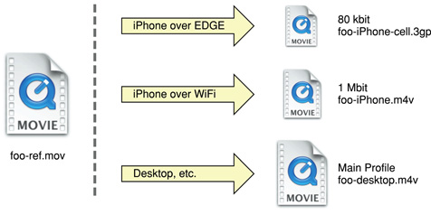

QuickTime 7.2.1 provides the following capabilities:

- Export for Web, which exports to iPhone, iPhone (cellular), and Desktop versions of given source movies.
- The creation of reference movies that point to all exported versions of the movie. The ref movie uses relative paths to point to each version. This requires that users keep the reference movie and the versions in the same folder on the server, but allows users to create the movie without specifying URLs and allows them to move the ref movie and its sources as a group without breaking the reference movie.
- Export that generates a poster frame image from the movie’s poster frame that can be used by the embed tag (in the case of the iPhone, for example).
- The generation of an embed tag that includes the poster frame specification and reference movie URL in an HTML snippet. The HTML snippet displays an HTML textfield with the embed tag, as well as help text for inserting the HTML and posting the movies. The HTML file also includes instructions on how to use the exported movie files, poster image, and the HTML snippet.
- The ability to select the folder where the results of the iPhone reference movie creation operation is written. A single subfolder is created in the specified folder to contain all the files.

To take advantage of this new capability, follow these steps:

1. Launch QuickTime Player Pro.
2. Select File > Export for Web...

   A dialog appears.
3. Enter the data you want to specify in the fields and checkboxes of the dialog box, as shown in Figure 1-2. In this step, you can specify the name, location of your export, and for which export versions you want to save, that is, iPhone, iPhone (cellular), and Desktop.

   __Figure 1-2__  Creating a reference movie automatically

   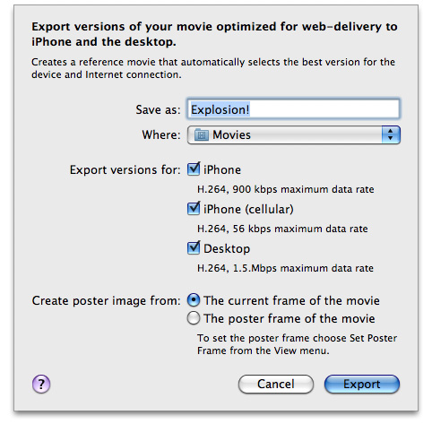
4. Click Export to export these versions of your QuickTime movie for optimized web delivery to the iPhone and the desktop.

When the user starts the export, the following files are placed in the specified folder (where NAME is the user-specified name):

- `NAME-iPhone.m4v`
- `NAME-iPhone-cell.3gp`
- `NAME-desktop.m4v`
- `NAME-poster.jpg`
- `NAME.mov`
- `ReadMe.html`

For more technical information about exporting movies for iPod, AppleTV, and iPhone, refer to [Technical Note TN2188](https://developer.apple.com/technotes/tn2007/tn2188.html). If you’re a web developer working with the iPhone, see [Optimizing Web Applications and Content for iPhone](https://developer.apple.com/iphone/designingcontent.html), which provides guidelines that will help you prepare web content and design a website or web-based application for iPhone.

The QuickTime Kit framework has made a major leap forward, providing support for capturing media from external sources, such as cameras and microphones, and outputting that media to QuickTime movies. Fifteen new classes have been added to the existing five in the first iteration of the framework. The goal is to provide Cocoa and QuickTime developers with a viable and robust alternative to using the procedural C sequence grabber API, which allowed applications to obtain digitized data from external sources, such as video boards. Using the QTKit capture API is now the preferred way of developing applications that support capture and recording of media.

To handle support for new video devices, the version of QuickTime 7.2.1 that ships with Mac OS X v10.5 includes 15 new QuickTime Kit Objective-C capture classes that allow you to incorporate pro-grade, frame-accurate capture of media in your application. Refer to the _[QuickTime Kit Framework Reference](https://developer.apple.com/documentation/qtkit)_ for a complete description of these new capture classes. To learn more about the QuickTime Kit capture architecture and how you can build a simple yet powerful capture application, refer to the _QTKit Capture Programming Guide_.

The new capture classes and methods available in the QuickTime Kit provide frame-accurate audio/video synchronization, and frame-accurate capture, meaning you can specify precisely––with timecodes––when you want capturing to occur. You also have access to transport controls of your camcorder, so you can fast forward and rewind the tape.

Note that this is implemented as a brand new capture engine––_not_ simply a wrapper around the Sequence Grabber API.

Using these classes and methods, you can capture media from one or more external sources, including cameras, microphones, and other external media devices, such as capture cards and tapedecks.

After you’ve captured this media, you can record it to one or more output destinations, including but not necessarily limited to the following:

- A QuickTime movie (`.mov`) file
- A Cocoa view that previews video media captured from the input sources

The devices supported in Mac OS X v10.5 include:

- UDC over USB, including Apple’s built-in iSight camera
- IIDC over FireWire, includes external iSight
- DV cameras
- HDV and Pro DV devices (with the appropriate codecs included with Final Cut Pro). Also, the AVC DAL plug-in, which handles both HDV and DV cameras
- Core Audio HAL devices
- Other devices that have VDIGs through a VDIG shim

All QTKit capture applications make use of three basic types of objects: capture inputs, capture outputs, and a capture session. __Capture inputs__, which are subclasses of `QTCaptureInput`, provide the necessary interfaces to different sources of captured media.

A capture device input, which is a `QTCaptureDeviceInput` object––a subclass of `QTCaptureInput`––provides an interface to capturing from various audio/video hardware, such as cameras and microphones. __Capture outputs__, which are subclasses of `QTCaptureOutput`, provide the necessary interfaces to various destinations for media, such as QuickTime movie files, or video and audio previews.

A __capture session__, which is a `QTCaptureSession` object, manages how media that is captured from connected input sources is distributed to connected output destinations. Each input and output has one or more connection, which represents a media stream of a certain QuickTime media type, such as video or audio media. A capture session will attempt to connect all input connections to each of its outputs.

As shown in Figure 1-3, a capture session works by connecting inputs to outputs in order to record and preview video from a camera.

__Figure 1-3__  Connecting inputs to outputs in a capture session

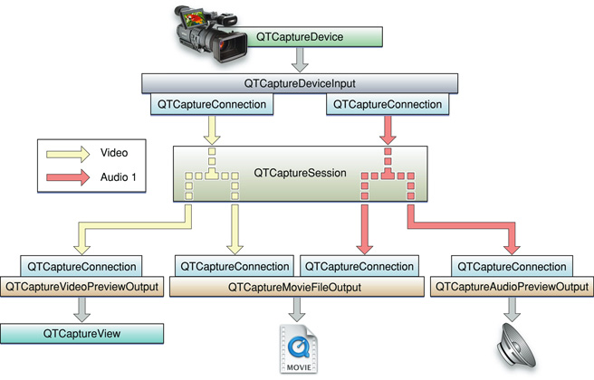

A capture session works by distributing the video from its single video input connection to a connection owned by each output. In addition to distributing separate media streams to each output, the capture session is also responsible for mixing the audio from multiple inputs down to a single stream.

Figure 1-4 shows how the capture session handles multiple audio inputs.

__Figure 1-4__  Handling multiple audio inputs in a capture session

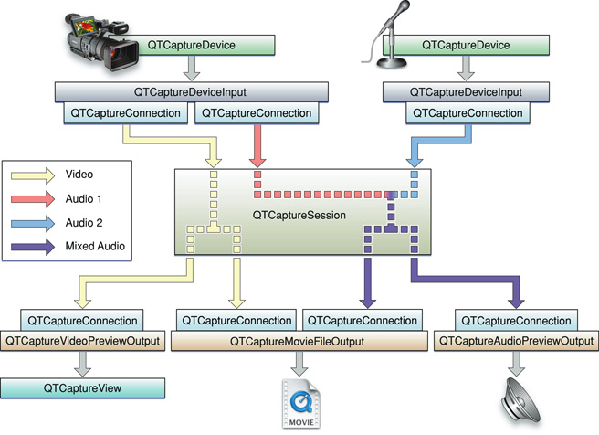

As illustrated in Figure 1-4, a capture session sends all of its input video to each output that accepts video and all of its input audio to each output that accepts audio. However, before sending the separate audio stream to its outputs, it mixes them down to one stream that can be sent to a single capture connection.

A capture session is also responsible for ensuring that all media are synchronized to a single time base in order to guarantee that all output video and audio are synchronized.

The connections belonging to each input and output are `QTCaptureConnection` objects. These describe the media type and format of each stream taken from an input or sent to an output. By referencing a specific connection, your application can have finer-grained control over which media enters and leaves a session. Thus, you can enable and disable specific connections, and control specific attributes of the media entering (for example, the volumes of specific audio channels).

For more information, refer to the _QTKit Capture Programming Guide_.

The QTKit capture API is comprised of fifteen new classes and more than several hundred new methods, notifications, and attributes. To better understand how you can take advantage of this API in your Cocoa or QuickTime application, you may want to read this section describing the various groupings of the API. The complete description of all these classes and their associated methods is available in the _[QuickTime Kit Framework Reference](https://developer.apple.com/documentation/qtkit)_.

There are four base classes, six classes devoted to input and output, another three utility classes, one class that deals with device input, and another with the user interface.

There are four classes in this group that can best be described as __base classes__, as described in Table 1-1. Understanding how these work is essential to using the QTKit capture API.

The `QTCaptureSession` class provides an interface for connecting input sources. The method used most commonly in this class is `startRunning`, which tells the receiver to start capturing data from its inputs and then to send that data to its outputs. Notably, if you’re using this method, when data does not need to be sent to file outputs, previews, or other outputs, your capture session should not be running, so that the overhead from capturing does not affect the performance of your application.

The `QTCaptureInput` and `QTCaptureOutput` classes, which are both abstract classes, provide interfaces for connecting inputs and outputs. An input source can have multiple connections, which is common for many cameras which have both audio and video output streams. Using `QTCaptureOutput` objects, you don’t need to have a fixed number of connections, but you do need a destination for your capture session and all of its input data.

__Table 1-1__  Base QTKit capture classes with tasks and commonly used methods

| Class | Group | Tasks | Most commonly used methods |
| `QTCaptureSession` | Base | Primary interface for capturing media streams; manages connections between inputs and outputs; also manages when a capture is running. | `startRunning` |
| `QTCaptureInput` | Base | Provides input source connections for a `QTCaptureSession`. Use subclasses of this class for inputs of a session. | `connections` |
| `QTCaptureOutput` | Base | Provides an interface for connecting capture output destinations, such as QuickTime files and video previews, to a `QTCaptureSession`. | `connections` |
| `QTCaptureConnection` | Base | Represents a connection over which a single stream of media data is sent from a `QTCaptureInput` to a `QTCaptureSession` and from a `QTCaptureSession` to a `QTCaptureOutput`. | `formatDescription`, `mediaType`, `setEnabled:`, `isEnabled` |

There are five __output classes__ and only one __input class__ belonging to this group, shown in Table 1-2.

You can use the methods available in the `QTCaptureDeviceInput` class to handle input sources for various media devices, such as cameras and microphones. The five output classes provide output destinations for `QTCaptureSession` objects that can be used to write captured media to QuickTime movies, for example, or to preview video or audio that is being captured. `QTCaptureFileOutput`, an abstract superclass, provides an output destination for a capture sesson to write captured media simply to files.

__Table 1-2__  Input and output QTKit capture classes with tasks and commonly used methods

| Class | Group | Tasks | Most commonly used methods |
| `QTCaptureAudioPreviewOutput` | Input/Output | Represents an output destination for a`QTCaptureSession` that can be used to preview the audio being captured. | `volume`, `setVolume:`, `setOutputDeviceUniqueID:` |
| `QTCaptureDecompressedVideoOutput` | Input/Output | Represents an output destination for a `QTCaptureSession` object that can be used to process decompressed frames from the video being captured. | `setDelegate:`, `captureOutput:didOutputVideoFrame:withSampleBuffer:fromConnection:` |
| `QTCaptureDeviceInput` | Input/Output | Represents the input source for media devices, such as cameras and microphones | `device`, `initWithDevice:` |
| `QTCaptureFileOutput` | Input/Output | Writes captured media to files and defines the interface for outputs that record media samples to files. | `recordToOutputFileURL:`, `setDelegate:`, `captureOutput:didFinishRecordingToOutputFileAtURL:forConnections:dueToError:` |
| `QTCaptureMovieFileOutput` | Input/Output | Represents an output destination for a `QTCaptureSession` that writes captured media to QuickTime movie files. | `recordToOutputFileURL:`, `setDelegate:`,`captureOutput:didFinishRecordingToOutputFileAtURL:forConnections:dueToError:` |
| `QTCaptureVideoPreviewOutput` | Input/Output | Represents an output destination for a`QTCaptureSession` that can be used to preview the video being captured. | `visualContextForConnection:`, `setDelegate:`, `captureOutput:didOutputVideoFrame:withSampleBuffer:fromConnection:` |

There are three classes belonging to this group: `QTCompressionOptions`, `QTFormatDescription`, and `QTSampleBuffer`, shown in Table 1-3. These are best characterized as __utility classes__, in that they perform tasks related to representing, for example, the compressions for particular media, or describing the formats of various media samples.

You can use `QTCompressionOptions` to describe compression options for all kinds of different media, using the `compressionOptionsIdentifiersForMediaType:` and `mediaType` methods. Compression options are created from presets keyed by a named identifier. These preset identifiers are listed in the _[QuickTime Kit Framework Reference](https://developer.apple.com/documentation/qtkit)_ in the chapter describing this class.

Using `QTSampleBuffer` objects, you can get information about sample buffer data that you may need to output or process the media samples in the buffer.

__Table 1-3__  Utility QTKit capture classes with tasks and commonly used methods

| Class | Group | Tasks | Most commonly used methods |
| `QTCompressionOptions` | Utility | Represents a set of compression options for a particular type of media. `QTCompressionOptions` objects are used to describe compression options for different kinds of media. | `compressionOptionsIdentifiersForMediaType:`, `mediaType` |
| `QTFormatDescription` | Utility | Describes the media format of media samples and of media sources, such as devices and capture connections. | `localizedFormatSummary`.The constant, `QTFormatDescriptionVideoCleanApertureDisplaySizeAttribute` |
| `QTSampleBuffer` | Utility | Provides format information, timing information, and metadata on media sample buffers. | `formatDescription` |

There are two classes in this particular group: `QTCaptureDevice` and `QTCaptureView`, as shown in Table 1-4.

Each instance of `QTCaptureDevice` corresponds to a capture device that is connected or has been previously connected to the user’s computer during the lifetime of the application. Note that instances of this class cannot be created directly. Whenever a device is connected to the computer, a single unique instance is created automatically and can be accessed using the `deviceWithUniqueID:` class method. An array of all currently connected devices can also be obtained using the `inputDevices:` class method.

Devices can provide one or more stream of a given media type. Your application can search for devices that provide media of a specific type using the `inputDevicesWithMediaType:` and `defaultInputDeviceWithMediaType` class methods.

You can use the methods available in the `QTCaptureView` class, which is a subclass of `NSView`, to preview video that is being processed by an instance of `QTCaptureSession`. The class creates and maintains its own `QTCaptureVideoPreviewOutput` to gather the preview video you need from the capture session.

__Table 1-4__  Device access and user interface QTKit capture classes with tasks and commonly used methods

| Class | Group | Tasks | Most commonly used methods |
| `QTCaptureDevice` | Device Access and UI | Represents an available capture device. | `inputDevices`, `open:`, `isOpen`, `close`, `localizedDisplayName` |
| `QTCaptureView` | Device Access and UI | Displays a video preview of a capture session. | `setCaptureSession:` |

To take advantage of the new QuickTime Kit capture classes, you can do the following:

- Read the _QTKit Capture Programming Guide_. The guide discusses how you can build a functioning capture player application that controls the capture of QuickTime movies, adding simple start and stop buttons, and allowing you to output and display your captured files in QuickTime Player as QuickTime movies. For this project, you need an iSight camera, either built-in or plugged into your Macintosh. You also need to have Mac OS X v10.5 installed on your computer. To implement this capture player, you won’t have to write more than 20 or 30 lines of Objective-C code.

  - Using Xcode 3 as your integrated development environment (IDE), along with the new implementation of Interface Builder 3, you’ll see how easy it is to work with the QuickTime Kit framework. In this example, you use the new QTKit capture control provided in the library of controls available in Interface Builder 3. The QTKit capture control performs much of the work for you in implementing the design of the user interface for this application.
- Check out the QTKit capture sample code projects, StillMotion and MyRecorder.

  - The StillMotion sample, available for download at [StillMotion](https://developer.apple.com/leopard/devcenter/docs/samplecode/StillMotion/index.html), demonstrates how to use the QTKit capture decompressed video output API to build a simple application that creates stop motion animations. The application lets you capture individual frames taken from a video camera connected to the computer and assemble them into a QuickTime movie that can be saved to disk.
  - The MyRecorder code sample, available for download at [MyRecorder](https://developer.apple.com/leopard/devcenter/docs/samplecode/MYRecorder/index.html), is designed to support professional-level video and audio capture, and pro-grade recording of media.

  The _QTKit Capture Programming Guide_ walks you through both code samples, taking a tutorial approach, so you can learn as you go, step-by-step through your project, using the tools available in Xcode 3 and Interface Builder 3. You get to construct and then extend the functionality of the capture player application, adding a minimum of Objective-C code. This is the ideal way to get up to speed with the new QTKit capture methods and classes.

QuickTime 7.2.1 includes new methods that deal with thread-safety and new classes that support core animation, as discussed in this section.

In the version of QuickTime 7.2.1 that ships with Mac OS X v10.5, new methods are provided that deal with thread-safety. These methods allow applications to manage `QTMovie` objects on current (non-main) threads. Specifically, five new methods belonging to the `QTMovie` class have been added. These include the following class and instance methods that deal with handling and managing thread-safety operations of movie objects: `enterQTKitOnThread`, `enterQTKitOnThreadDisablingThreadSafetyProtection`, `exitQTKitOnThread`, `attachToCurrentThread`, and `detachFromCurrentThread`. For more information about these new methods, refer to their descriptions in the _QTMovie Class Reference_.

For more information on thread-safety in QuickTime, refer to [Technote TN2125](https://developer.apple.com/technotes/tn/tn2125.html), which discusses in detail best programming practices to ensure thread-safety in your application.

Two new classes that provide support for Core Animation have been added in QuickTime 7.2.1. Both are subclasses of `CALayer`.

- `QTCaptureLayer`. Provides a layer that displays video frames currently being captured from a device attached to the computer, and is intended to provide support for drawing the contents of a capture session into a layer. Note that this class requires rendering using visual contexts.
- `QTMovieLayer`. Provides a layer into which the frames of a `QTMovie` can be drawn, and is intended to provide support for drawing the contents of a movie into a layer. Note that this class requires rendering using visual contexts.

For detailed descriptions of these classes and their associated methods, refer to _QTMovieLayer Reference_ and _QTCaptureLayer Reference_.

The QuickTime Kit framework supports the new control object architecture available in Interface Builder 3. It offers two new QuickTime control objects (one for movies and one for capture). These two objects replace the QuickTime palettes used for these operations.

The QuickTime movie control object (`QTMovieView`), represented in Interface Builder 3 by the QuickTime logo (shown in Figure 1-5), lets you drag and drop a QuickTime movie object into your Xcode project window.

__Figure 1-5__  The QuickTime movie view control object in Interface Builder 3

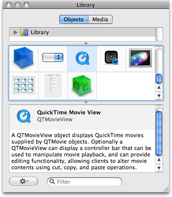

The QuickTime movie capture object (`QTCaptureView`), represented in Interface Builder 3 as a digital camera icon (shown in Figure 1-6), lets you capture video and audio, and record that output to QuickTime movies.

__Figure 1-6__  The QuickTime capture view object in Interface Builder 3

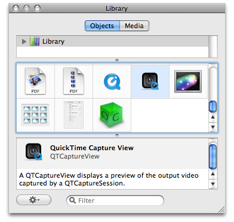

The QuickTime Kit is the primary 64-bit interface into QuickTime. There is no 64-bit QuickTime support.

Support is provided for the entire existing set of QuickTime Kit (QTKit) classes, methods, and functions, with one major exception: all methods that take or return native QuickTime identifiers (in particular, `Movie`, `MovieController`, `Track`, and `Media`) are not be supported in 64-bit QuickTime Kit. Developers will be unable to call, for instance, `QTMovie``quickTimeMovie` in order to “dip down” into the native QuickTime APIs.

The following is a complete list of the methods that will _not_ be supported under 64-bit QuickTime Kit:

In the `QTMovie` class:

```objc
+ (id)movieWithQuickTimeMovie:(Movie)movie disposeWhenDone:(BOOL)dispose error:(NSError **)errorPtr;
- (id)initWithQuickTimeMovie:(Movie)movie disposeWhenDone:(BOOL)dispose error:(NSError **)errorPtr;
- (Movie)quickTimeMovie;
- (MovieController)quickTimeMovieController;
```

In the `QTTrack` class:

```objc
+ (id)trackWithQuickTimeTrack:(Track)track error:(NSError **)errorPtr;
- (id)initWithQuickTimeTrack:(Track)track error:(NSError **)errorPtr;
- (Track)quickTimeTrack;
```

In the `QTMedia` class:

```objc
+ (id)mediaWithQuickTimeMedia:(Media)media error:(NSError **)errorPtr;
- (id)initWithQuickTimeMedia:(Media)media error:(NSError **)errorPtr;
- (Media)quickTimeMedia;
```

Note that there may be limitations to the current implementation. Some of these methods are subject to change and cannot be explicitly documented at this time. For developers, the essential takeaway is: The QuickTime Kit code in your application, minus the methods listed above, should just work.

QuickTime Player now conforms to the new Aqua user interface available in Mac OS X v10.5. Some of these user interface changes include:

- New control buttons that match those available in Mac OS X v10.5.
- Full-screen capability that lets users view QuickTime Player content in various modes: fit to screen, panoramic, or fill screen by specifying preferences in the QuickTime Preferences panel, shown in Figure 1-7.

  __Figure 1-7__  New full screen viewing modes as QuickTime preferences

  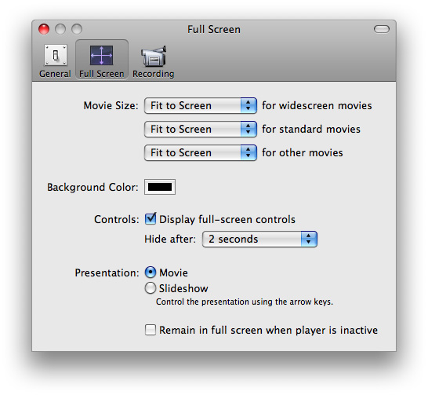
- A new zoom button that allows users to switch to the next optimal full screen viewing mode, as shown in Figure 1-8.

__Figure 1-8__  New full-screen control with zoom button


The Movie Info panel and the Movie Inspector windows have changed to include a HUD look and feel in Mac OS X v10.5. There are no functional changes implemented in QuickTime 7.2.1. The Movie Inspector and Movie Info panels function the same as in QuickTime 7.2.

The QuickTime Player A/V controls window also has a HUD look and feel, and can be displayed and manipulated in fullscreen mode. Again, there are no functional changes implemented in in QuickTime 7.2.1. The A/V Controls function the same as in QuickTime 7.2.

With QuickTime 7.2.1 and Mac OS X v10.5, users can now upload movies to servers running Podcast Producer, which are then available for download by clients using iTunes Podcast. The Share to Podcast Producer (shown in Figure 1-9) is only available in QuickTime Player Pro. Podcast Producer allows users to automate the creation and delivery of podcasts.

__Figure 1-9__  New share to podcast producer option in QuickTime Player Pro

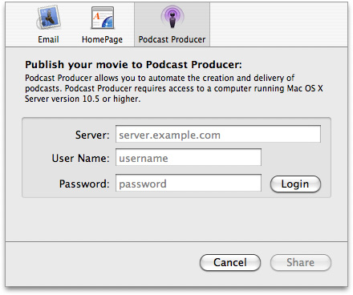

Mac OS X v10.5 and QuickTime 7.2.1 introduce audio context inserts for developers who want to add effects to audio during QuickTime playback. With the new inserts API, a client application can hook into the QuickTime audio processing chain and manipulate the audio data on the fly during real-time playback, as well as during movie audio extraction. One advantage of this new API is that you can attach inserts at both the movie and track level.

Prior to the introduction of this API, the QuickTime audio rendering chain had specific limitations. For example, there was no way to tap into it and no simple audio effects architecture that provided developers with the much-needed capability of adding effects to audio during playback.

Now with the introduction of this API, QuickTime effectively handles the playback and synchronization of audio effects. As a result, client applications need to deal only with the processing of effects.

The following diagrams illustrate the audio context data-flow processes. Note that inserts can be attached to the audio context during playback as well as extraction. The __device context__ is the context that is rendered to during playback, and the __extraction context__ is the context rendered to during extraction.

Figure 1-10 shows two track audio mix and context extraction.

__Figure 1-10__  Two-track audio mix and context extraction

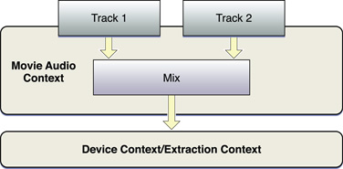

Figure 1-11 shows how the process works when mixing audio at different sampling rates.

__Figure 1-11__  The mixing process and extraction

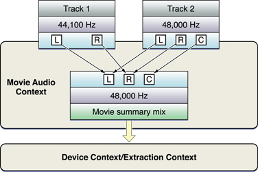

Figure 1-12 shows how the process works with movie-level inserts.

__Figure 1-12__  The movie-level insert process and extraction

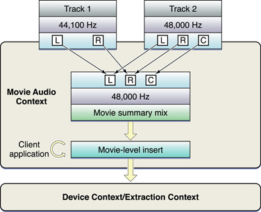

Figure 1-13 shows how the process works with track-level inserts.

__Figure 1-13__  The track-level insert process

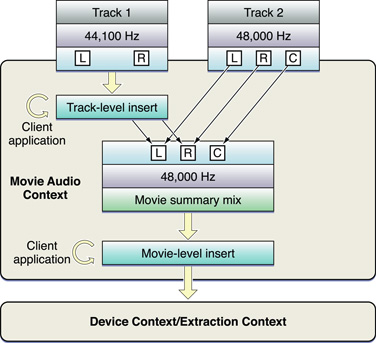

To register for a movie audio context insert during playback, follow these steps:

1. Get the movie’s current audio context, using `GetMovieAudioContext`.
2. Register the application insert, using `QTAudioContextRegisterInsert`.

To unregister a movie audio context Insert, you

1. Call `QTAudioContextRegisterInsert` with a `NULL` `QTAudioContextInsertRegistryInfoRef`
2. If the registry `ptr` is non-null but the `processDataCallback` is null, this has the same effect.

To register for a track audio context Insert during playback, you

1. Set the `kQTAudioPropertyID_RegisterAudioContextInsert` property on the track,
   providing the same registry info structure that is used for the `QTAudioContextRegisterInsert` call.
2. To unregister a track audio context Insert, you set the `kQTAudioPropertyID_RegisterAudioContextInsert` property on the track, with a null `processDataCallback` call.

The code you need to set the property to register your insert is as follows:

```
//Begin an extraction session
err = MovieAudioExtractionBegin(...);
//Configure the session
//Set property to register your insert
err = MovieAudioExtractionSetProperty(
        extractionSessionRef,
        kQTPropertyClass_MovieAudioExtraction_Audio,
        kQTMovieAudioExtractionMoviePropertyID_RegisterMovieInsert,
        sizeof(QTAudioContextInsertRegistryInfo),
        regInfo);
//Pull for data
while (...) {
   err= MovieAudioExtractionFillBuffer(..., &flags);
}
//End the session
err = MovieAudioExtractionEnd(...);
```


For more detailed explanations of the audio context insert functions, refer to the discussion of each call in `System/Library/Frameworks/QuickTime.framework/Headers/Movies.h`.

The following callback routines are available in QuickTime 7.2.1:

- `AudioContextInsertProcessDataCallback`. A client-supplied function to be called during playback to get data from the audio insert.

  This routine is called by the QuickTime audio context for each buffer of audio data it renders. The client receives a source buffer list and a destination buffer list, and is responsible for supplying output buffers to the destination buffer list. This routine is generally called on the `IOProc` at high thread priority, and so should not perform memory allocation or release, acquire mutex resources, nor take very long to process.
- `AudioContextInsertResetCallback`. A client-supplied function to be called to initialize and reset for processing data.

  This routine is called by the QuickTime audio context to initialize for rendering. The client is told the sample rate and the maximum number of frames it will be asked to process on any single `ProcessData` callback (for example, `inNumberFrames` will always be equal to or less than `inMaxFrames`). On return, the client reports its processing latency and tail times. This callback is invoked whenever the rendering chain is interrupted (for example, when playback jumps to a new point or changes direction). The client should call `AudioUnitReset` on any audio units in use, and should be prepared to respond to changes of sample rate or maxframes.
- `AudioContextInsertFinalizeCallback`. A client-supplied function to be called to release any resources in use by the insert.

  This routine is called by the QuickTime audio context when the audio context is being disposed (that is, when the `MovieAudioContext` has been reset or the movie was disposed). Once this callback returns, no more calls for this registered insert will be made.
- `QTAudioContextInsertRegistryInfo`. Parameters for registering an audio context insert. Use this routine with `QTAudioContextRegisterInsert` and the movie audio extraction `kQTMovieAudioExtractionAudioPropertyID_RegisterMovieInsert` property.

The QTAudioContextInsert sample code project is available for download at [QTAudioContextInsert](https://developer.apple.com/leopard/devcenter/docs/samplecode/QTAudioContextInsert/index.html).

The sample demonstrates how a client application of QuickTime can use the audio context Insert APIs to hook in a custom audio processing unit into the QuickTime audio processing chain.

The sample code seeks to establish good practices in using the new APIs. It illustrates steps involved in configuring and registering an insert with the movie or track whose audio data is to be tapped and/or processed. The code gives example implementations of the three callbacks––reset, process data, finalize––that need to be implemented by an insert’s processing logic. Finally, the sample code shows the steps involved in applying an insert to audio being extracted through the QuickTime movie audio extraction APIs.

The files in this sample code that are directly relevant to inserts are:

- `ACInsertManager.mm`. The `attachDetachMovie{Track}LevelInsert` routines demonstrate registering and unregistering movie and track level inserts during playback.
- `ACInsertProcessor.mm`. Shows examples of the `ProcessData`, `Reset` and `Finalize` callbacks that need to be implemented by the client app.
- `QuickTimeAudioUtils.c`. The `prepareMovieForExtraction` routine illustrates how movie and track-level inserts can be registered during extraction.

QuickTime 7.2.1 and Mac OS X v10.5 now provide support for the QuickTime Kit and the QuickTime web browser plug-in to handle HiDPI settings more efficiently. This enhancement enables QuickTime to draw movies and handle user interactions with movies correctly––whatever resolution the user or the operating system platform selects.

The following enhancements are provided in QuickTime Kit-based applications and in the QuickTime plug-in:

- Visual context-based movies draw and resize correctly in movie views.
- GWorld-based movies draw and resize correctly in movie views.

The following are new QuickTime aperture mode APIs available in Mac OS X v10.5. These are declared in `/QuickTime.framework/Headers/Movies.h`.

- `GenerateMovieApertureModeDimensions`. Examines a movie and sets up track aperture mode dimensions.

  Use this function to add information needed to support aperture modes to movies created with applications and/or versions of QuickTime that did not support aperture mode dimensions. If the image descriptions in video tracks lack tags describing clean aperture and pixel aspect ratio information, the media data may be scanned to see if the correct values can be divined and attached. Then the aperture mode dimensions are calculated and set for each track. Afterwards, the `kQTVisualPropertyID_HasApertureModeDimensions` property will be set to true for these tracks. Tracks that do not support aperture modes are not changed.
- `GenerateTrackApertureModeDimensions`. Examines a track and sets up aperture mode dimensions.

  Use this function to add information needed to support aperture modes to tracks created with applications and/or versions of QuickTime that did not support aperture mode dimensions. If the image descriptions in video tracks lack tags describing clean aperture and pixel aspect ratio information, the media data may be scanned to see if the correct values can be divined and attached. Then the aperture mode dimensions are calculated and set. Afterwards, the `kQTVisualPropertyID_HasApertureModeDimensions` property will be set to true for these tracks. Tracks which do not support aperture modes are not changed.
- `RemoveMovieApertureModeDimensions`. Removes aperture mode dimension information from a movie.

  Use this function to remove aperture mode dimension information from a movie's tracks. It does not attempt to modify sample descriptions, so it may not completely reverse the effect of `GenerateMovieApertureModeDimensions`. It sets the `kQTVisualPropertyID_HasApertureModeDimensions` property to `FALSE`.
- `RemoveTrackApertureModeDimensions`. Removes aperture mode dimension information from a track.

  Use this function to remove aperture mode dimension information from a track. It does not attempt to modify sample descriptions, so it may not completely reverse the effect of `GenerateTrackApertureModeDimensions`. It sets the `kQTVisualPropertyID_HasApertureModeDimensions` property to `FALSE`.

The following are new QuickTime 64-bit timecode media APIs available in Mac OS X v10.5. These are declared, with parameter descriptions, in `/QuickTime.framework/Headers/QuickTimeComponents.h`.

- `TCGetCurrentFrameAndTimeCodeDef`. Retrieves the frame number and time code format information for the current movie time.
- `TCGetFrameAndTimeCodeDefAtTime`. Retrieves the frame number and time code format information for a specific movie time.
- `TCTimeCodeTimeToString`. Converts a time value into a text string in the `(-) HH:MM:SS:FF` format.
- `TCTimeCodeCounterToString`. Converts a counter value into a text string.
- `TCTimeCodeTimeToFrameNumber`. Converts a time value into its corresponding frame number.
- `TCTimeCodeCounterToFrameNumber`. Converts a counter value into its corresponding frame number.
- `TCFrameNumberToTimeCodeTime`. Converts a frame number to its corresponding timecode time value.
- `TCFrameNumberToTimeCodeCounter`. Converts a frame number to its corresponding counter value.

To learn how to work with the timecode media handler, see the sample code project [QTKitTimeCode](https://developer.apple.com/samplecode/QTKitTimeCode/index.html).

The sample demonstrates the features of the timecode media handler and shows you how to add a timecode track, remove a timecode track, and toggle the visibility of a timecode track in a QuickTime movie file containing at least a single video track. The code sample is a completely new version of the original QTTimeCode sample updated for Mac OS X.

QuickTime 7.2.1 includes other miscellaneous changes and enhancements.

- Known accessibility limitations in QuickTime Player support for VoiceOver are addressed.
- Native rendering for Quartz compositions in QuickTime Player is provided.
- Java applets are now required to be “signed” in order to access QuickTime for Java and take advantage of QTJava.

Although the focus of this document is QuickTime 7.2.1, a number of changes and enhancements were implemented in the previous release of QuickTime 7.2. These included:

- A new export/encode architecture implementation. Both single- and multi-pass performance are enhanced, with the addition of support for __skip encoding__, which avoids sending frames to the encoder that don’t need to be re-encoded.
- Enhanced playback/decode. Performance and visual quality of the H.264 codec has been enhanced. Both single- and multi-pass H.264 encoding has been improved in quality and speed. Audio playback has also been improved for better audio/video synchronization.

[Next](Document%20Revision%20History.md)[Previous](Introduction%20to%20QuickTime%207.2.1%20Update%20Guide.md)

